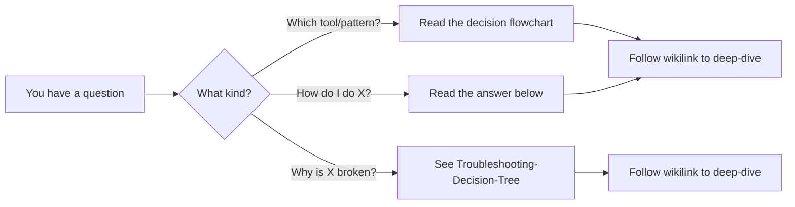
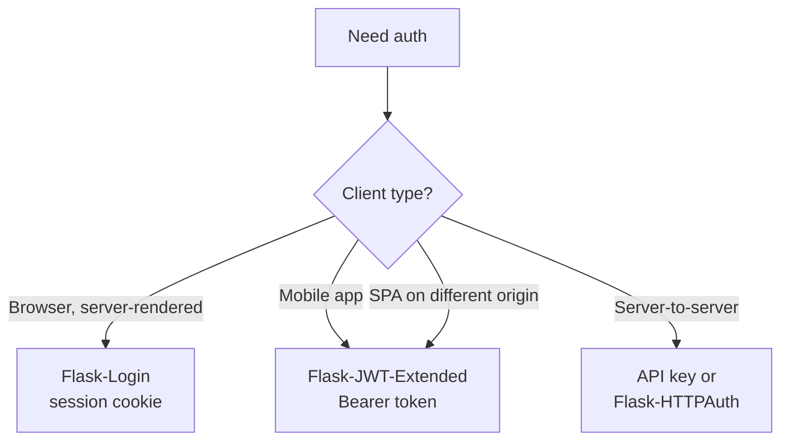
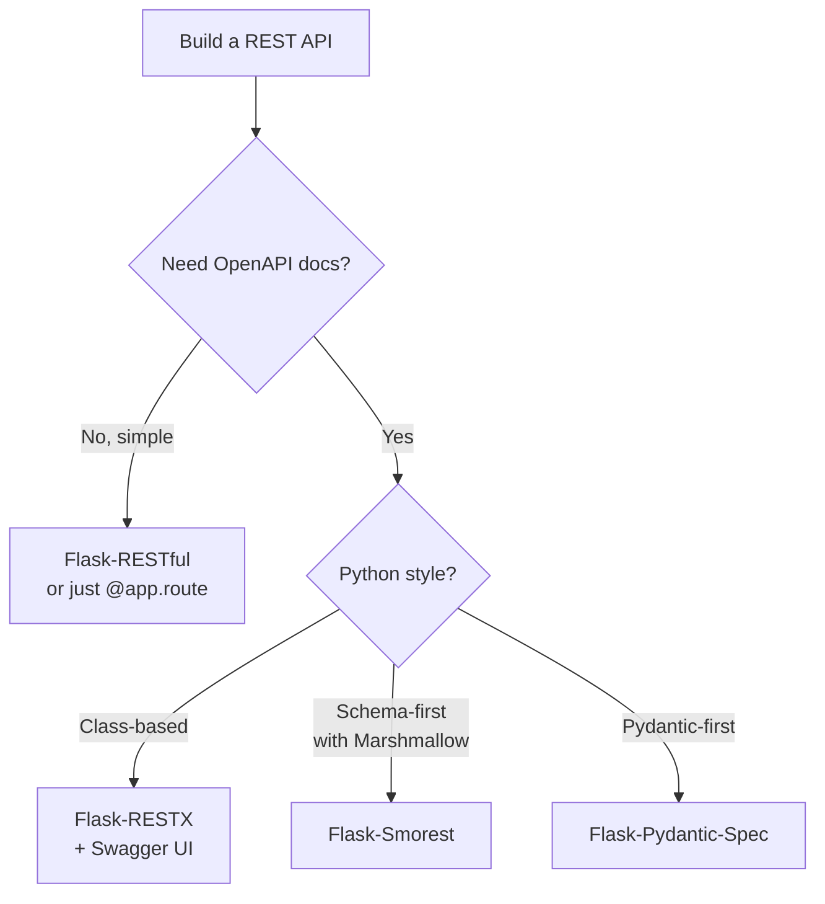
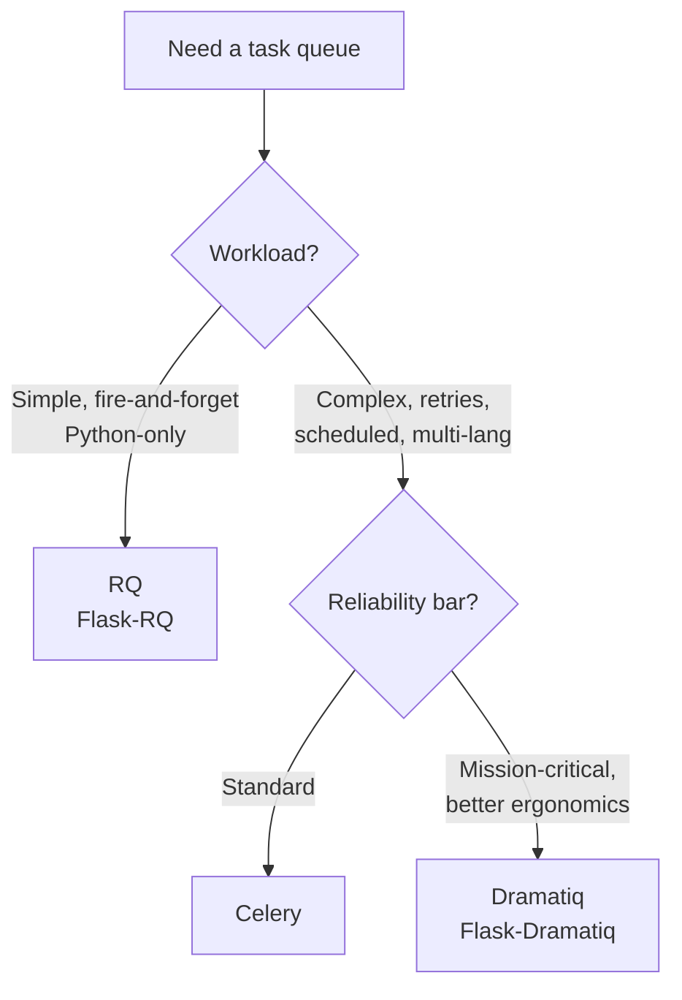
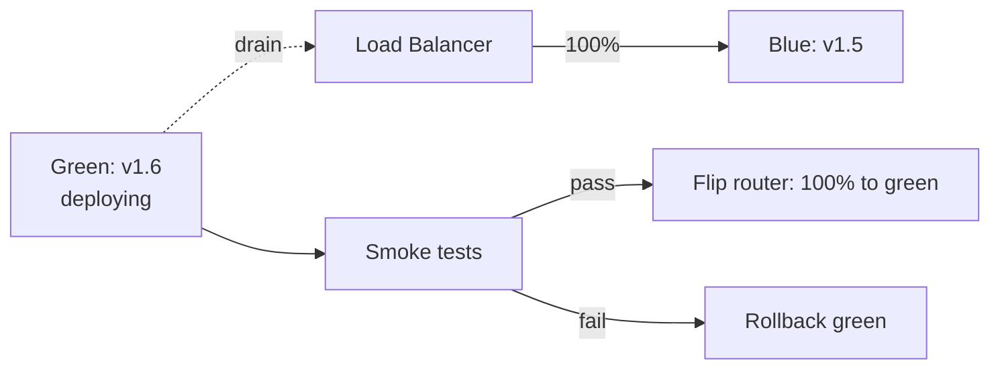

# ❓ Frequently Asked Questions

#faq #flask #reference #cross-cutting

> [!info] The "I just want an answer" page
> This FAQ collects the 30+ questions that come up most often when building Flask apps. Each answer is short (100–300 words), opinionated where opinions matter, and links out to the deep-dive notes for the full story. If your question isn't here, try the [[00-Troubleshooting-Decision-Tree]] for runtime problems or [[00-Glossary]] for terminology.

---

## How to Use This FAQ

1. **Skim the question list** below — each category groups five related questions.
2. **Use the decision flowcharts** when the question is "which one should I pick?"
3. **Follow the wikilinks** at the bottom of each answer for the full treatment.



---

## Question Index

| # | Category | Question |
|---|---|---|
| 1 | Getting Started | Which extensions do I need for a basic CRUD app? |
| 2 | Getting Started | Should I use Flask-Login or Flask-JWT-Extended? |
| 3 | Getting Started | SQLite or PostgreSQL for development? |
| 4 | Getting Started | Do I need Celery? |
| 5 | Getting Started | How do I structure my Flask project? |
| 6 | Database | How do I handle N+1 queries? |
| 7 | Database | When to use `selectinload` vs `joinedload`? |
| 8 | Database | How do I run migrations in production? |
| 9 | Database | How do I test with a database? |
| 10 | Database | What's the difference between Flask-SQLAlchemy and raw SQLAlchemy? |
| 11 | Authentication | Session vs JWT — which should I use? |
| 12 | Authentication | How do I add Google login? |
| 13 | Authentication | How do I handle password reset? |
| 14 | Authentication | How do I implement 2FA? |
| 15 | Authentication | How do I protect against CSRF? |
| 16 | API Design | Flask-RESTful vs Flask-RESTX vs Flask-Smorest? |
| 17 | API Design | How do I paginate API results? |
| 18 | API Design | How do I version my API? |
| 19 | API Design | How do I handle CORS? |
| 20 | API Design | How do I rate limit? |
| 21 | Async/Realtime | Celery vs RQ vs Dramatiq? |
| 22 | Async/Realtime | WebSocket vs SSE? |
| 23 | Async/Realtime | How do I scale SocketIO? |
| 24 | Async/Realtime | How do I run periodic tasks? |
| 25 | Async/Realtime | How do I monitor background tasks? |
| 26 | Production | How many Gunicorn workers should I run? |
| 27 | Production | How do I handle secrets? |
| 28 | Production | How do I set up HTTPS? |
| 29 | Production | How do I monitor my app? |
| 30 | Production | How do I do zero-downtime deploys? |
| 31 | Bonus | Should I use the app factory pattern? |
| 32 | Bonus | How do I migrate from Flask-RESTful to Flask-Smorest? |

---

## Getting Started

### Q1. Which extensions do I need for a basic CRUD app?

A typical Flask CRUD app needs **six** extensions to cover the basics:

- [[Flask-SQLAlchemy]] — database ORM and models
- [[Flask-Migrate]] — schema migrations
- [[Flask-WTF]] — HTML forms with CSRF protection
- [[Flask-Login]] — session-based authentication
- [[Flask-Caching]] (optional) — cache expensive queries
- [[Flask-Limiter]] (optional) — protect public endpoints

That's it. Resist the urge to install [[Celery]], [[Flask-SocketIO]], or [[Flask-Admin]] on day one. Each one adds operational complexity (a broker, a WebSocket server, an admin auth layer). Add them only when you have a concrete need. The [[Full-Stack-Example]] note shows a complete app using exactly these six extensions.

```python
# requirements.txt — the minimal viable stack
Flask==3.0.0
Flask-SQLAlchemy==3.1.1
Flask-Migrate==4.0.5
Flask-WTF==1.2.1
Flask-Login==0.6.3
Flask-Caching==2.1.0
```

See [[Installation-Guide]] for the venv setup and [[Project-Structure]] for how to lay out the files.

### Q2. Should I use Flask-Login or Flask-JWT-Extended?

**Flask-Login** for browser-based apps where you serve HTML. **Flask-JWT-Extended** for JSON APIs consumed by mobile apps or SPAs that store tokens in `localStorage`/`AsyncStorage`. They are not interchangeable — they manage different state.



The trap is mixing both in the same app. They both want to own `current_user`, and the mental model ("is this route protected by a cookie or a token?") leaks into every endpoint. If you must support both, put HTML routes in one blueprint and JSON routes in another, and document which auth each uses. See [[Flask-Login]] and [[Flask-JWT-Extended]] for the full patterns, plus [[Authentication-Cookbook]] Recipe 9 for the combined approach.

### Q3. SQLite or PostgreSQL for development?

**Develop on the same database you ship on.** If production runs PostgreSQL, develop on PostgreSQL — even on your laptop, via Docker. SQLite is great for tests and throwaway prototypes, but it has different SQL dialect, different type coercion, different concurrency, and no `JSONB`, no `ARRAY`, no partial indexes. Bugs that surface only under PostgreSQL concurrency will not surface in SQLite tests.

```bash
# Run PostgreSQL locally in 1 line
docker run -d --name pg -p 5432:5432 \
  -e POSTGRES_PASSWORD=dev -e POSTGRES_DB=app postgres:16
```

The exception: **use SQLite for unit tests** that don't exercise database-specific features. It's faster and isolates logic from persistence. Use PostgreSQL for integration tests. See [[Pytest-Flask]] for the dual-database test pattern.

### Q4. Do I need Celery?

**Not until a request takes more than a second.** Celery adds a broker (Redis or RabbitMQ), workers, a results backend, monitoring, and retry semantics. That's a lot of moving parts for a 200ms speed-up.

Before reaching for Celery, try (in order):
1. **Optimize the query.** Add an index, use `selectinload`, drop an unnecessary `join`. See [[Performance-Optimization]].
2. **Cache the result.** [[Flask-Caching]] with a Redis backend often turns a 2s endpoint into a 5ms endpoint.
3. **Push work to the client.** A "we'll email you when it's done" UX buys time.
4. **Use APScheduler in-process.** For periodic tasks that take seconds, not minutes, [[Flask-APScheduler]] is dramatically simpler than Celery.

Only when a request takes 30+ seconds (video encoding, bulk email, ML inference, large report generation) does Celery earn its complexity. See [[Celery]] and the comparison in [[Flask-Dramatiq]].

### Q5. How do I structure my Flask project?

Use the **application factory** pattern with a package layout. The canonical structure:

```
myapp/
├── pyproject.toml
├── wsgi.py              # entry point: from myapp import create_app
├── myapp/
│   ├── __init__.py      # create_app() factory
│   ├── extensions.py    # db = SQLAlchemy(); login = LoginManager()
│   ├── config.py        # class Config, class ProdConfig
│   ├── models/
│   ├── views/
│   │   ├── auth.py      # blueprint = Blueprint("auth")
│   │   └── api.py
│   ├── services/        # business logic (no Flask imports)
│   ├── templates/
│   └── static/
└── tests/
```

Two rules that save you weeks: (1) instantiate extensions in `extensions.py` with no Flask imports, then `db.init_app(app)` inside the factory; (2) put business logic in `services/` so it's testable without a request context. See [[Project-Structure]] for the full tree and [[Common-Patterns]] for the service-layer discussion.

---

## Database

### Q6. How do I handle N+1 queries?

An N+1 happens when you fetch a list of N parents, then lazily fetch N children one at a time. The fix is **eager loading**: tell SQLAlchemy to fetch the children in one extra query (or one join) instead of N.

```python
# BAD — 1 + N queries
posts = db.session.query(Post).all()
for p in posts:
    print(p.author.name)  # N more queries

# GOOD — 2 queries total
posts = db.session.query(Post).options(
    selectinload(Post.author)
).all()
```

To detect N+1 in development, enable [[Flask-DebugToolbar]] or [[Flask-Silk]] — both show a per-request SQL count. In tests, assert on `db.session.query_count`. In production, use [[Flask-Profiler]] to spot endpoints that issue hundreds of queries. See [[Flask-SQLAlchemy]] § Querying and [[Performance-Optimization]] for the full toolkit.

### Q7. When to use `selectinload` vs `joinedload`?

Both fix N+1 — they differ in *how*:

| Strategy | SQL | When to use |
|---|---|---|
| `joinedload` | One query with `LEFT OUTER JOIN` | To-one relationships, small collections |
| `selectinload` | Two queries: parents, then `WHERE id IN (...)` for children | To-many relationships, large collections |

`joinedload` collapses everything into one query, but a `LEFT JOIN` over a to-many relationship multiplies rows (one row per child). If a parent has 1000 children, you transfer 1000 copies of the parent's columns. `selectinload` keeps parents and children in separate queries, avoiding the duplication.

```python
# To-one — joinedload
Post.query.options(joinedload(Post.author)).all()

# To-many — selectinload
User.query.options(selectinload(User.posts)).all()
```

There's also `subqueryload` (an older form of `selectinload`); prefer `selectinload` for new code. See [[Flask-SQLAlchemy]] § Eager Loading.

### Q8. How do I run migrations in production?

Three rules:

1. **Never run `flask db migrate` in production.** Auto-generated migrations are for development. In prod, you run only `flask db upgrade` against an already-written, already-reviewed migration file.
2. **Use the expand-and-contract pattern** for risky changes. Add the new column (expand) → backfill data → switch app code → drop the old column (contract) in a later deploy. See [[Database-Migrations-Strategy]].
3. **Run migrations as a deploy step, not by hand.** Your CI/CD pipeline runs `flask db upgrade` immediately before switching traffic to the new version. If it fails, the deploy aborts and traffic stays on the old version.

```yaml
# GitHub Actions snippet
- name: Apply migrations
  run: flask db upgrade
  env:
    DATABASE_URL: ${{ secrets.PROD_DATABASE_URL }}
```

For zero-downtime, run the migration on a read-replica first, then promote. See [[Production-Deployment]] § Database and [[Flask-Migrate]] § Production Strategies.

### Q9. How do I test with a database?

Use a **separate test database** and roll back after every test. With pytest:

```python
# conftest.py
@pytest.fixture
def app():
    app = create_app("testing")
    with app.app_context():
        db.create_all()
        yield app
        db.session.remove()
        db.drop_all()

@pytest.fixture
def client(app):
    return app.test_client()

@pytest.fixture(autouse=True)
def rollback(app):
    yield
    db.session.rollback()
```

Two rules: (1) use a real database (PostgreSQL) for integration tests so SQL dialect bugs surface; (2) never share state between tests — each test gets a clean session. Use [[Factory-Boy]] to generate test data without fixtures-of-doom. See [[Pytest-Flask]] and [[Testing-Strategy]].

### Q10. What's the difference between Flask-SQLAlchemy and raw SQLAlchemy?

**Flask-SQLAlchemy is a thin wrapper** that does three things raw SQLAlchemy doesn't:

1. **Manages the engine per app.** You write `SQLALCHEMY_DATABASE_URI` in config and FSA wires up the engine, scoped session, and `db.Model` declarative base.
2. **Provides `db.session`** as a scoped session that auto-cleans up at request teardown.
3. **Adds Flask-friendly helpers:** `Model.query` (a query property), `paginate()`, `get_or_404()`, integration with [[Flask-Migrate]].

```python
# Flask-SQLAlchemy
class User(db.Model):
    id = db.Column(db.Integer, primary_key=True)

User.query.filter_by(active=True).all()

# Raw SQLAlchemy (no FSA)
from sqlalchemy import Column, Integer
from sqlalchemy.orm import declarative_base, sessionmaker
Base = declarative_base()
engine = create_engine(URL)
Session = sessionmaker(bind=engine)

class User(Base):
    __tablename__ = "users"
    id = Column(Integer, primary_key=True)

Session().query(User).filter_by(active=True).all()
```

Use FSA for any Flask app — it removes 100 lines of boilerplate. Drop to raw SQLAlchemy only when you need engines outside Flask (e.g., Celery workers — though FSA works there too). See [[Flask-SQLAlchemy]] § Architecture.

---

## Authentication

### Q11. Session vs JWT — which should I use?

| | Session (Flask-Login) | JWT (Flask-JWT-Extended) |
|---|---|---|
| State | Server stores user ID in session | Token is self-contained |
| Storage | Cookie (HttpOnly) | localStorage / Authorization header |
| Revocation | Trivial — destroy session | Hard — needs a blocklist |
| Scaling | Sticky sessions or shared session store | Stateless — scales trivially |
| Best for | Browser apps | Mobile, SPA, microservices |

**Default to sessions.** Revocation is the killer feature — when a token is compromised, you want to invalidate it now, not after its expiry. Sessions make that easy; JWTs require a blocklist (defeating the "stateless" benefit). Use JWTs only when sessions are impractical: mobile clients, microservice-to-microservice auth, or when you genuinely can't have server-side session state. See [[Flask-Login]], [[Flask-JWT-Extended]], and [[Security-Best-Practices]].

### Q12. How do I add Google login?

Use [[Flask-Dance]] (the simplest) or [[Flask-Authlib]] (more flexible). Flask-Dance provides pre-built OAuth blueprints for Google, GitHub, Facebook, and 40+ others.

```python
from flask_dance.contrib.google import make_google_blueprint

google_bp = make_google_blueprint(
    client_id=GOOGLE_OAUTH_CLIENT_ID,
    client_secret=GOOGLE_OAUTH_CLIENT_SECRET,
    scope=["profile", "email"],
)
app.register_blueprint(google_bp, url_prefix="/login")

@app.route("/login/google/authorized")
def authorized():
    resp = google.get("/oauth2/v1/userinfo")
    user_info = resp.json()
    # Find or create user, then login_user()
```

For OIDC (enterprise SSO with Keycloak, Okta), use [[Flask-Authlib]] with the OIDC dance. See [[Authentication-Cookbook]] Recipe 3 (OAuth2) and Recipe 8 (OIDC SSO).

### Q13. How do I handle password reset?

The standard flow:

1. User submits email to `/reset-password/request`.
2. You generate a signed, time-limited token (`itsdangerous.URLSafeTimedSerializer` or `Flask-JWT-Extended`'s `create_access_token` with a 30-min expiry and a `purpose: "reset"` claim).
3. Email a link containing the token (`https://app/reset-password?token=...`). Use [[Flask-Mail]] or a transactional email service.
4. User clicks, the route verifies the token, and shows the new-password form (Flask-WTF).
5. On submit, hash the new password with [[Flask-Bcrypt]] and update the DB.
6. Invalidate any existing sessions (log out everywhere).

Two gotchas: (a) **rate-limit the request endpoint** ([[Flask-Limiter]]) to prevent email enumeration; (b) **don't reveal whether the email exists** — always show "if that email is in our system, we've sent a reset link." See [[Authentication-Cookbook]] and [[Flask-Mail]].

### Q14. How do I implement 2FA?

TOTP (time-based one-time passwords, like Google Authenticator) is the standard. Use `pyotp`:

```python
import pyotp

# On enable: generate a secret, show QR
secret = pyotp.random_base32()
uri = pyotp.totp.TOTP(secret).provisioning_uri(
    name=user.email, issuer_name="MyApp"
)
# Render `uri` as a QR code; user scans with Authenticator app

# On verify: check the 6-digit code
totp = pyotp.TOTP(user.totp_secret)
if totp.verify(code, valid_window=1):
    login_user(user)
```

Then make 2FA a second step after password verification: user submits password → you stash `user_id` in a temporary server-side token → user is redirected to `/2fa` → on TOTP verification, complete `login_user()`. Backup codes (10 single-use codes) are essential — users lose phones. See [[Authentication-Cookbook]] Recipe 6.

### Q15. How do I protect against CSRF?

For HTML forms: [[Flask-WTF]] gives you CSRF tokens for free. For AJAX: include the token in a meta tag and add it as a header (`X-CSRFToken`) on every POST. For JSON APIs consumed by SPAs: rely on `SameSite=Lax` cookies plus a custom header (browsers won't send custom headers cross-origin without CORS preflight).

```html
<!-- base.html -->
<meta name="csrf-token" content="{{ csrf_token() }}">
```

```javascript
// frontend
const token = document.querySelector('meta[name="csrf-token"]').content;
fetch('/api/posts', {
  method: 'POST',
  headers: { 'X-CSRFToken': token, 'Content-Type': 'application/json' },
  body: JSON.stringify(data),
});
```

For pure stateless JWT APIs (no cookies), CSRF is not a concern — the token is in the `Authorization` header, which browsers don't auto-send. See [[Flask-WTF]], [[Flask-SeaSurf]] (alternative), and [[Security-Best-Practices]].

---

## API Design

### Q16. Flask-RESTful vs Flask-RESTX vs Flask-Smorest?



- **[[Flask-RESTful]]** — the original. Mature, simple, no built-in docs. Good for small APIs.
- **[[Flask-RESTX]]** — a fork of Flask-RESTful with built-in Swagger UI. Use if you want class-based resources and docs.
- **[[Flask-Smorest]]** — modern, uses [[Marshmallow]] schemas, generates OpenAPI 3. Recommended for new projects.
- **[[Flask-Pydantic-Spec]]** — if you live in Pydantic-land (FastAPI converts).

For a new app in 2024, default to **Flask-Smorest**. See [[API-Design-Cookbook]] for the full comparison.

### Q17. How do I paginate API results?

Return pagination metadata alongside results, using the `Link` header (RFC 5988) or a JSON envelope. Flask-SQLAlchemy's `paginate()` returns a `Pagination` object with everything you need.

```python
@app.route("/api/posts")
def list_posts():
    page = request.args.get("page", 1, type=int)
    per_page = min(request.args.get("per_page", 20, type=int), 100)
    pag = db.paginate(db.select(Post), page=page, per_page=per_page)
    return jsonify({
        "items": [post_schema.dump(p) for p in pag.items],
        "page": pag.page,
        "per_page": pag.per_page,
        "total": pag.total,
        "pages": pag.pages,
        "has_next": pag.has_next,
        "has_prev": pag.has_prev,
    })
```

Two rules: (1) cap `per_page` server-side (e.g., max 100) to prevent abuse; (2) use cursor-based pagination (`?after=cursor`) for large or frequently-changing datasets where offset pagination is slow. See [[API-Design-Cookbook]] § Pagination.

### Q18. How do I version my API?

Three patterns, in increasing strictness:

1. **URL versioning:** `/api/v1/posts`. Simplest, clearest, what most teams do.
2. **Header versioning:** `Accept: application/vnd.myapp.v1+json`. Cleaner URLs but harder to test (can't just `curl`).
3. **No versioning for internal APIs.** If you control all clients, deploy coordinated changes.

```python
# URL versioning with blueprints
v1 = Blueprint("api_v1", __name__, url_prefix="/api/v1")
v2 = Blueprint("api_v2", __name__, url_prefix="/api/v2")

@v1.route("/posts")
def v1_posts(): ...

@v2.route("/posts")
def v2_posts(): ...  # different shape
```

When you make a breaking change, keep the old version alive for at least one deprecation cycle, return a `Deprecation` header, and announce a sunset date. See [[API-Design-Cookbook]] § Versioning.

### Q19. How do I handle CORS?

Install [[Flask-CORS]] and configure per-blueprint:

```python
from flask_cors import CORS

# Per-blueprint (preferred — explicit)
CORS(api_blueprint, origins=["https://app.example.com"],
     supports_credentials=True)

# Or global (sloppy but quick)
CORS(app, resources={r"/api/*": {"origins": "*"}})
```

If your frontend sends cookies (sessions) or `Authorization` headers, you need `supports_credentials=True` AND a specific origin list (not `"*"`). Browsers reject `Access-Control-Allow-Origin: *` with credentials. See [[Flask-CORS]] and [[Security-Best-Practices]] § CORS.

### Q20. How do I rate limit?

[[Flask-Limiter]] with a Redis backend:

```python
from flask_limiter import Limiter
from flask_limiter.util import get_remote_address

limiter = Limiter(get_remote_address, storage_uri="redis://localhost:6379")
limiter.init_app(app)

@app.route("/api/login", methods=["POST"])
@limiter.limit("10/minute")  # IP-based
def login(): ...

@app.route("/api/expensive")
@limiter.limit("100/hour", key_func=lambda: current_user.id)
def expensive(): ...
```

For authenticated endpoints, key by user ID. For unauthenticated, key by IP. Always back the limiter with Redis (not memory) — multiple Gunicorn workers can't share in-memory state. Put limits on `/login`, `/reset-password`, `/signup`, and any expensive endpoint. See [[Flask-Limiter]].

---

## Async/Realtime

### Q21. Celery vs RQ vs Dramatiq?



- **[[Celery]]** — the standard. Most features, most docs, most operational pain.
- **[[Flask-RQ]]** (RQ) — Redis-only, simple, Pythonic. Great if you don't need scheduling or complex retries.
- **[[Flask-Dramatiq]]** — newer, more reliable defaults, better middleware story. Use if you're starting fresh and want stability.

For most apps: Celery if you need scheduling or non-Python workers; RQ if your needs are simple; Dramatiq if you want modern defaults. See the comparison in [[Celery]], [[Flask-RQ]], and [[Flask-Dramatiq]].

### Q22. WebSocket vs SSE?

| | WebSocket | SSE (Server-Sent Events) |
|---|---|---|
| Direction | Bidirectional | Server → client only |
| Protocol | ws:// | HTTP |
| Reconnect | Manual | Built-in |
| Best for | Chat, collaboration, games | Notifications, live feeds |

**Use SSE for one-way server pushes** (notifications, dashboards, log streaming). It's just HTTP, works through any proxy, and the browser handles reconnection for free. [[Flask-SSE]] or even a plain Flask streaming response will do.

**Use WebSocket when the client also sends data frequently** (chat, multiplayer games, collaborative editing). [[Flask-SocketIO]] is the standard. See [[Flask-SSE]] and [[Flask-SocketIO]].

### Q23. How do I scale SocketIO?

Single-process SocketIO is fine for a few hundred concurrent connections. Beyond that:

1. **Use a message queue as the SocketIO message bus** (Redis, RabbitMQ, Kafka). Without it, an emit on worker A doesn't reach clients connected to worker B.
2. **Use multiple worker processes** via `gunicorn --worker-class eventlet -w 4` (or `gevent`). Don't use sync workers — each holds a connection open.
3. **Use rooms, not broadcasts, whenever possible.** `socketio.emit("msg", room=user_id)` reaches one client; `socketio.emit("msg")` reaches all.
4. **Use sticky sessions at the load balancer.** Otherwise a client's reconnects bounce between workers.

```python
# Configure SocketIO with Redis message queue
socketio = SocketIO(
    app,
    message_queue="redis://redis:6379",
    cors_allowed_origins="*",
)
```

See [[Flask-SocketIO]] § Scaling and [[Production-Deployment]].

### Q24. How do I run periodic tasks?

Two options:

1. **Celery Beat** — built into Celery, runs scheduled tasks across your worker fleet. Best when you already run Celery.
2. **[[Flask-APScheduler]]** — in-process scheduler. Simpler, but doesn't survive restarts unless you use a persistent job store.

```python
# Celery Beat
from celery.schedules import crontab

beat_schedule = {
    "send-daily-digest": {
        "task": "tasks.send_digest",
        "schedule": crontab(hour=8, minute=0),
    },
}

# APScheduler
from flask_apscheduler import APScheduler
scheduler = APScheduler()
scheduler.init_app(app)
scheduler.start()

@scheduler.task("cron", hour=8, minute=0)
def send_digest():
    ...
```

Pick Celery Beat if your periodic tasks are heavy or need to be distributed across workers. Pick APScheduler if they're light and you'd rather not run a separate beat process. See [[Celery]] § Beat and [[Flask-APScheduler]].

### Q25. How do I monitor background tasks?

Three layers:

1. **Task-level monitoring:** use Flower for Celery (`pip install flower`, then `celery -A app.celery flower`). It shows task throughput, failures, and worker status. For RQ, use `rq-dashboard`; for Dramatiq, use Prometheus metrics.
2. **App-level monitoring:** export metrics to Prometheus via `prometheus-client`, scrape with Grafana. Track queue length, task duration, failure rate.
3. **Alerting:** alert on (a) queue length growing unboundedly (workers are stuck or underprovisioned), (b) failure rate > 5% over 5 minutes, (c) any task that hasn't run on schedule for 2 cycles.

```python
# Prometheus metrics for Celery
from prometheus_client import Counter, Histogram

task_total = Counter("celery_task_total", "label", ["task", "status"])
task_duration = Histogram("celery_task_duration_seconds", "label", ["task"])

@task_prerun.connect
def task_started(sender, **kw):
    task_started_at[sender.request.id] = time.time()

@task_postrun.connect
def task_finished(sender, **kw):
    duration = time.time() - task_started_at.pop(sender.request.id, time.time())
    task_duration.labels(task=sender.name).observe(duration)
    task_total.labels(task=sender.name, status=kw["state"]).inc()
```

See [[Celery]] § Monitoring and [[Structlog-Integration]] for structured task logging.

---

## Production

### Q26. How many Gunicorn workers should I run?

The classic formula is `(2 × CPU cores) + 1`. On a 4-core machine, that's 9 workers. But the real answer depends on your workload:

- **CPU-bound** (image processing, ML): stick with `(2 × cores) + 1`. Each worker pegs a core.
- **I/O-bound** (most Flask apps — DB, external APIs): you can run more, but consider async workers (`gevent` or `eventlet`) instead. A single gevent worker handles thousands of concurrent connections.
- **Memory-bound** (large in-memory joins): fewer workers, more memory each.

```bash
# CPU-bound
gunicorn -w 9 myapp:wsgi

# I/O-bound with gevent
gunicorn -k gevent --worker-connections 1000 -w 4 myapp:wsgi
```

Don't forget: each worker loads a full copy of your app. A 200MB app × 16 workers = 3.2GB RAM. See [[Production-Deployment]] § Workers.

### Q27. How do I handle secrets?

**Never in source control. Never in env files committed to git. Never hardcoded.** The hierarchy, from worst to best:

1. ❌ Hardcoded in `config.py`
2. ❌ `.env` file committed to git
3. ⚠️ `.env` file in `.gitignore`, loaded by python-dotenv — OK for dev
4. ✅ Environment variables set by your deploy system (systemd, Docker Compose, k8s secrets)
5. ✅✅ A secrets manager (AWS Secrets Manager, HashiCorp Vault, Doppler) fetched at startup

```python
# config.py — read from env, fail loudly if missing
import os
class ProdConfig:
    SECRET_KEY = os.environ["SECRET_KEY"]  # KeyError if missing — good
    DATABASE_URL = os.environ["DATABASE_URL"]
    STRIPE_API_KEY = os.environ["STRIPE_API_KEY"]
```

Use [[Pydantic-Settings]] for typed config with validation. See [[Security-Best-Practices]] § Secrets and [[Production-Readiness-Checklist]] § 1.1.

### Q28. How do I set up HTTPS?

Three layers:

1. **Termination at the load balancer / reverse proxy.** Nginx or AWS ALB holds the cert; traffic to your Flask app over Gunicorn is plain HTTP on `127.0.0.1`. This is the standard production setup.
2. **Automatic certs with Let's Encrypt.** Use `certbot` to provision and renew. For k8s, use `cert-manager`.
3. **HSTS and security headers.** Use [[Flask-Talisman]] to enforce HTTPS, set `Strict-Transport-Security`, and lock down the CSP.

```nginx
# nginx
server {
    listen 443 ssl http2;
    server_name app.example.com;
    ssl_certificate     /etc/letsencrypt/live/app.example.com/fullchain.pem;
    ssl_certificate_key /etc/letsencrypt/live/app.example.com/privkey.pem;

    location / {
        proxy_pass http://127.0.0.1:8000;
        proxy_set_header X-Forwarded-Proto $scheme;
    }
}
```

Make sure your Flask app trusts the `X-Forwarded-Proto` header (`ProxyFix`) so `request.is_secure` works behind the proxy. See [[Production-Deployment]] § TLS and [[Flask-Talisman]].

### Q29. How do I monitor my app?

Four pillars:

1. **Logs** — structured (JSON), shipped to a central store (ELK, Loki, Datadog). Use [[Structlog-Integration]].
2. **Metrics** — Prometheus for counters/histograms (request rate, latency, error rate, queue depth). Grafana to visualize.
3. **Tracing** — OpenTelemetry for distributed traces across services. Essential for microservices.
4. **Uptime checks** — external prober (Pingdom, UptimeRobot, Better Stack) hitting a `/healthz` endpoint every minute.

```python
# /healthz endpoint
@app.get("/healthz")
def healthz():
    # Check DB
    try:
        db.session.execute(text("SELECT 1"))
    except Exception:
        return jsonify({"status": "unhealthy"}), 503
    return jsonify({"status": "ok"})
```

Don't conflate `/healthz` (liveness — "is the process up?") with `/readyz` (readiness — "can I take traffic?"). A worker that can't reach the DB is alive but not ready. See [[Production-Readiness-Checklist]] § Observability.

### Q30. How do I do zero-downtime deploys?

**Blue-green deploy:** run two identical environments (blue and green). Route traffic to blue. Deploy new version to green. Run smoke tests on green. Flip the router. Tear down blue if green is healthy; flip back if not.



For single-host deploys, use **rolling restarts**: Gunicorn's `--graceful-timeout` and `SIGHUP` reload workers one at a time. For k8s, `RollingUpdate` strategy with `maxUnavailable: 0` and `maxSurge: 1` achieves the same.

The non-negotiable prerequisites: (1) the new version must be **backward-compatible with the old DB schema** for one deploy cycle (use expand-and-contract — see Q8); (2) you need **health checks** so the load balancer knows when to route traffic; (3) you need **a rollback procedure you've actually practiced**. See [[Production-Deployment]] § Zero-Downtime.

---

## Bonus

### Q31. Should I use the app factory pattern?

**Yes, almost always.** The factory pattern (`def create_app(config_name): ...`) gives you:

- Multiple configurations (dev, test, prod) from the same codebase
- Clean test isolation — each test creates its own app
- Lazy extension init — `db.init_app(app)` rather than `db = SQLAlchemy(app)`
- Easier Celery integration — `create_app()` is called inside the Celery worker

The only case against is a tiny single-file script (under 100 lines). Once you have models, blueprints, or tests, use the factory. See [[Project-Structure]] and [[Flask-Overview]] § Application Factory.

### Q32. How do I migrate from Flask-RESTful to Flask-Smorest?

It's a rewrite, not a migration — the API shapes are different. Strategy:

1. **Don't migrate everything at once.** New endpoints use Flask-Smorest; old endpoints stay on Flask-RESTful. Both can coexist.
2. **For each old endpoint, write a [[Marshmallow]] schema** for its input/output. This is the bulk of the work.
3. **Replace the `Resource` class** with a `MethodView` decorated by `@blueprint.arguments(Schema)` and `@blueprint.response(Schema)`.
4. **Delete the old `reqparse` code.** Marshmallow schemas replace it.
5. **Verify the response shapes match exactly** — same field names, same nullability, same types. Run contract tests.

```python
# Before — Flask-RESTful
class PostList(Resource):
    @marshal_with(post_fields)
    def get(self):
        return Post.query.all()

# After — Flask-Smorest
@blp.route("/posts")
class PostList(MethodView):
    @blp.response(200, PostSchema(many=True))
    def get(self):
        return Post.query.all()
```

Budget 2-4 hours per endpoint. See [[Flask-RESTful]] § Migration and [[Flask-Smorest]].

---

## See Also

- [[00-Map-of-Content]] — the canonical index
- [[00-Glossary]] — terminology reference
- [[00-Troubleshooting-Decision-Tree]] — runtime problem flowcharts
- [[API-Design-Cookbook]] — REST API recipes
- [[Authentication-Cookbook]] — auth recipes
- [[Production-Readiness-Checklist]] — go-live gate
- [[Security-Best-Practices]] — security hardening

*Return to [[00-Map-of-Content]] · Last updated 2024-01-15*
