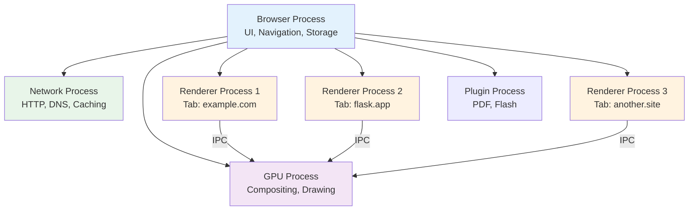
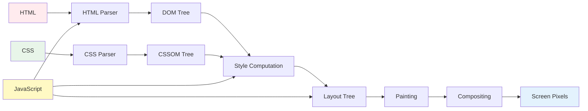
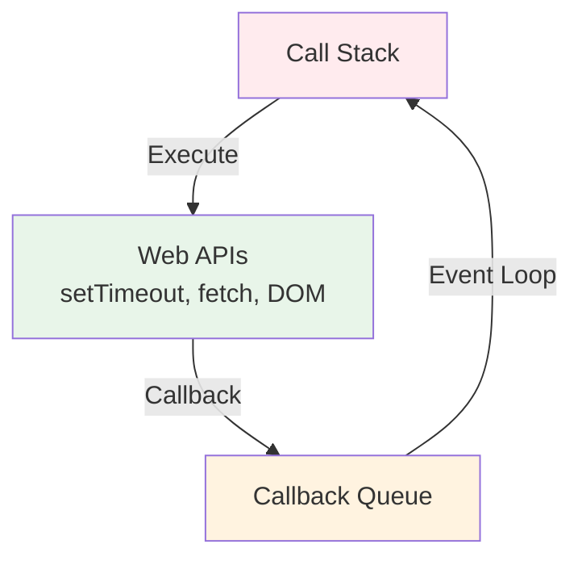

# How Web Browsers Work

> The browser is not a passive document viewer. It is a complete operating system for running web applications — and your Flask application executes inside it.

## Learning Objectives

After completing this chapter, you will be able to:

- Explain the browser's internal architecture and main components
- Describe the complete rendering pipeline from HTML to pixels
- Understand how the browser parses HTML, CSS, and JavaScript
- Explain the Document Object Model (DOM) and how JavaScript manipulates it
- Describe how the browser makes HTTP requests and handles responses
- Understand the browser's security model including the Same-Origin Policy and CORS
- Explain how cookies, localStorage, and sessionStorage work
- Describe the event loop and how JavaScript handles asynchronous operations

## What Is a Browser?

A web browser is a software application that retrieves, presents, and traverses information resources on the World Wide Web. But this definition undersells what modern browsers actually are.

A modern browser — Chrome, Firefox, Safari, Edge — is one of the most complex pieces of software ever created. Chrome alone contains over 25 million lines of code. For comparison, the Linux kernel has about 30 million lines, and Windows 10 has roughly 50 million.

The browser is essentially a **miniature operating system** that:

- Interprets and executes code (HTML, CSS, JavaScript)
- Renders graphics and text using advanced rendering engines
- Manages network connections (HTTP, WebSockets, WebRTC)
- Stores data (cookies, localStorage, IndexedDB, Cache API)
- Handles security (TLS, certificate validation, sandboxing, Same-Origin Policy)
- Manages multimedia (audio, video, WebGL, WebGPU)
- Provides debugging tools (Developer Tools)

When you build a Flask application, you are building a server-side program that generates responses consumed by this complex client-side runtime. Understanding the browser helps you build applications that work with it rather than against it.

## Browser Architecture

Modern browsers use a **multi-process architecture** for security, stability, and performance. Understanding this architecture explains many behaviors you will encounter as a web developer.



### Browser Process

The **browser process** (also called the "browser UI process" or "main process") is the central coordinator. It handles:

- **User interface**: Address bar, back/forward buttons, bookmarks, tabs (the tab strip, not tab content)
- **Navigation**: Deciding which renderer process should handle a URL, managing redirects
- **Storage**: Cookies, localStorage, IndexedDB — all managed centrally for security
- **Permissions**: Camera, microphone, location access requests
- **Profile management**: Separate user profiles with isolated data

In Chrome, this process runs with full OS privileges. All other processes are sandboxed (run with restricted privileges) for security.

### Renderer Process

Each browser tab (with some exceptions) runs in its own **renderer process**. This process is responsible for:

- **Parsing HTML** into the DOM
- **Parsing CSS** into the CSSOM (CSS Object Model)
- **Executing JavaScript** using a JavaScript engine (V8 in Chrome, SpiderMonkey in Firefox, JavaScriptCore in Safari)
- **Layout**: Calculating the position and size of every element
- **Painting**: Drawing elements into bitmap images
- **Compositing**: Combining layers into the final image shown on screen

Renderer processes are heavily sandboxed. They cannot access the file system, make arbitrary network connections, or access system resources directly. All communication with the outside world goes through the browser process via Inter-Process Communication (IPC).

This sandbox is why you cannot use Python file system operations from JavaScript — the renderer process simply does not have permission.

### GPU Process

The **GPU process** handles all GPU-accelerated tasks:

- Compositing layers into the final display image
- Drawing 3D graphics (WebGL, WebGPU)
- Accelerating CSS transforms and animations
- Video decoding

Separating GPU work into its own process prevents GPU driver crashes from bringing down the entire browser.

### Network Process

Some browsers (Chrome, Edge) use a dedicated **network process** to handle all network operations. This centralizes:

- HTTP request/response handling
- DNS resolution caching
- TLS handshake management
- HTTP/2 and HTTP/3 connection multiplexing
- Response caching

Centralizing the network stack allows the browser to optimize connection reuse and implement sophisticated caching strategies.

### Why Multi-Process?

Before Chrome's introduction in 2008, most browsers used a single-process architecture. One crash in any tab brought down the entire browser. Chrome's innovation was treating each tab as a separate process:

- **Stability**: If one tab crashes, other tabs continue running
- **Security**: Renderer sandboxing prevents malicious websites from accessing your files or other tabs' data
- **Performance**: Tabs on different CPU cores can render in parallel

The trade-off is memory usage. Each process has overhead (several MB minimum), so 50 open tabs in Chrome use significantly more RAM than 50 tabs in a single-process browser.

## The Rendering Pipeline

When a browser receives an HTML response from your Flask server, it transforms that raw text into a visual webpage through a multi-stage pipeline. Understanding this pipeline helps you write HTML that renders efficiently.



### Step 1: Parsing HTML into the DOM

The browser receives HTML as a stream of bytes from the network. It:

1. **Tokenizes** the bytes into HTML tokens (start tags, end tags, attributes, text content)
2. Builds a **parse tree** according to HTML parsing rules
3. Converts the parse tree into the **DOM (Document Object Model)** — a tree of JavaScript objects

The DOM is not just a data structure. It is a **live, mutable representation** of the document that JavaScript can modify. Each HTML element becomes a DOM node with properties, methods, and event handlers.

```html
<!-- HTML received from Flask -->
<!DOCTYPE html>
<html>
<head><title>My Flask App</title></head>
<body>
  <div class="container">
    <h1>Hello, World!</h1>
    <p>Welcome to my Flask application.</p>
  </div>
</body>
</html>
```

This becomes a tree structure:

```
Document
└── html
    ├── head
    │   └── title
    │       └── "My Flask App"
    └── body
        └── div.container
            ├── h1
            │   └── "Hello, World!"
            └── p
                └── "Welcome to my Flask application."
```

HTML parsing is **forgiving**. Unlike XML or JSON, which fail on syntax errors, the HTML parser applies heuristics to fix common mistakes. Unclosed tags are inferred, improperly nested elements are reorganized. This is why your Flask templates still render even with minor HTML errors — though you should always produce valid HTML.

### Step 2: Parsing CSS into the CSSOM

While HTML parsing proceeds, the browser simultaneously fetches and parses CSS:

1. Inline styles (`style` attributes) are extracted from HTML elements
2. Internal stylesheets (`<style>` tags) are parsed
3. External stylesheets (`<link rel="stylesheet">`) are fetched via HTTP and parsed

The result is the **CSSOM (CSS Object Model)** — a tree structure that maps selectors to computed styles. The CSSOM is separate from the DOM but mirrors its tree structure.

CSS parsing must handle **cascading** — the algorithm that determines which styles apply to an element when multiple rules could match. The cascade considers:

- **Specificity**: More specific selectors override less specific ones (`#id` beats `.class` beats `element`)
- **Importance**: `!important` declarations override normal ones
- **Source order**: Later rules override earlier rules of equal specificity
- **Inheritance**: Some properties inherit from parent elements

### Step 3: JavaScript Execution

When the HTML parser encounters a `<script>` tag, it **pauses HTML parsing** and executes the JavaScript immediately (unless `async` or `defer` attributes are present).

JavaScript can:
- Read and modify the DOM (`document.getElementById`, `element.innerHTML`)
- Read and modify CSSOM (`element.style`, `getComputedStyle`)
- Make additional HTTP requests (`fetch`, `XMLHttpRequest`)
- Set timers and event handlers

Because JavaScript can modify both the DOM and CSSOM, it is a **rendering blocker**. A slow JavaScript file delays the entire rendering pipeline. This is why Flask developers should:

- Minimize inline JavaScript in templates
- Use `async` or `defer` for non-critical scripts
- Place scripts at the end of `<body>` when possible
- Consider loading heavy JavaScript only after the initial render

### Step 4: Style Computation

The browser combines the DOM and CSSOM to compute the **final styles** for every element. This process:

1. Matches each DOM element against all CSS selectors
2. Applies the cascade rules to resolve conflicts
3. Converts relative units (em, rem, %) to absolute units (pixels)
4. Resolves inherited properties
5. Produces a **computed style** for each element

Style computation is expensive. On a complex page, the browser may evaluate thousands of selectors against hundreds of elements. Optimizing CSS selectors (using classes over descendant selectors, avoiding deep nesting) reduces this cost.

### Step 5: Layout (Reflow)

With computed styles, the browser calculates the **exact position and size** of every visible element. This process is called **layout** or **reflow**.

Layout proceeds top-down:

1. The viewport dimensions determine the containing block for the root element
2. Each element's width is calculated based on its box model (content + padding + border + margin)
3. Block-level elements stack vertically; inline elements flow horizontally
4. Positioned elements (absolute, fixed) are removed from normal flow and placed relative to their containing block
5. Flex and grid containers distribute space among their children

Layout is one of the most expensive operations in the rendering pipeline. Changing certain properties (width, height, position, margin) triggers a full or partial reflow. Properties like transform and opacity are cheaper because they can be handled during compositing without recalculating layout.

### Step 6: Painting

After layout, the browser **paints** each element's content into bitmap images called **layers**. Text is rasterized into glyphs using the appropriate fonts. Images are decoded and placed. Backgrounds, borders, and shadows are drawn.

Modern browsers optimize painting by:

- **Layering**: Separating independent elements into their own layers
- **Dirty rectangle tracking**: Only repainting regions that changed
- **GPU acceleration**: Offloading certain paint operations to the GPU

### Step 7: Compositing

The final stage combines all layers into the image displayed on screen. The **compositor thread** (which runs independently of the main thread) handles this, enabling smooth animations without blocking JavaScript execution.

CSS properties that can be composited without layout or paint recalculation:
- `transform` (translate, rotate, scale)
- `opacity`
- `filter`

This is why `transform: translateX()` performs better than `left: 10px` for animations — the former only requires compositing, while the latter requires layout, paint, and compositing.

## The Browser's Security Model

The browser operates in one of the most hostile computing environments imaginable — executing untrusted code from arbitrary websites on users' machines. Its security model reflects this reality.

### Same-Origin Policy (SOP)

The **Same-Origin Policy** is the browser's fundamental security boundary. An origin is defined as the combination of:

- **Protocol** (http vs https)
- **Host** (domain name)
- **Port** (80, 443, 5000, etc.)

Two URLs have the same origin only if all three match. For example:

| URL 1 | URL 2 | Same Origin? |
|-------|-------|--------------|
| `https://example.com/page1` | `https://example.com/page2` | Yes |
| `https://example.com` | `http://example.com` | No (different protocol) |
| `https://example.com` | `https://api.example.com` | No (different host) |
| `https://example.com:443` | `https://example.com:5000` | No (different port) |

Under SOP, JavaScript running on one origin cannot:
- Read responses from another origin via `fetch` or `XMLHttpRequest`
- Access the DOM of another origin's window or iframe
- Read cookies set by another origin
- Access localStorage or IndexedDB data from another origin

This prevents malicious.com from reading your banking data from bank.com.

### Cross-Origin Resource Sharing (CORS)

Sometimes, legitimate applications need to make cross-origin requests. **CORS** is a browser mechanism that allows servers to explicitly permit cross-origin access.

When JavaScript makes a cross-origin request, the browser automatically adds an `Origin` header. The server can respond with `Access-Control-Allow-Origin` headers indicating which origins are permitted.

In Flask, you handle CORS using the `flask-cors` extension or manual header management:

```python
from flask import Flask, jsonify

app = Flask(__name__)

@app.route('/api/data')
def get_data():
    response = jsonify({'message': 'Hello'})
    response.headers.add('Access-Control-Allow-Origin', 'https://example.com')
    return response
```

> [!WARNING]
> Setting `Access-Control-Allow-Origin: *` on an API that uses cookies or authentication is a security vulnerability. Be specific about which origins you allow.

### Cookie Security Model

Cookies are the primary mechanism for maintaining state in HTTP (which is stateless by design). The browser's cookie security model includes:

- **Domain attribute**: Controls which hosts can receive the cookie
- **Path attribute**: Limits the cookie to specific URL paths
- **Secure flag**: Only sends the cookie over HTTPS connections
- **HttpOnly flag**: Prevents JavaScript from accessing the cookie (mitigates XSS)
- **SameSite attribute**: Controls whether cookies are sent with cross-site requests

Flask's session cookie uses these security features:

```python
app.config.update(
    SESSION_COOKIE_SECURE=True,      # HTTPS only
    SESSION_COOKIE_HTTPONLY=True,    # No JavaScript access
    SESSION_COOKIE_SAMESITE='Lax',   # Restrict cross-site usage
)
```

### Content Security Policy (CSP)

**CSP** is a security mechanism that prevents XSS and data injection attacks by specifying which sources of content are trusted. It is delivered via the `Content-Security-Policy` HTTP header.

A strict CSP for a Flask application:

```python
@app.after_request
def set_csp(response):
    response.headers['Content-Security-Policy'] = (
        "default-src 'self'; "
        "script-src 'self'; "
        "style-src 'self' 'unsafe-inline'; "
        "img-src 'self' data: https:;"
    )
    return response
```

## JavaScript and the Event Loop

JavaScript in the browser is **single-threaded** — it can execute only one piece of code at a time. This thread is managed by the **event loop**, a programming construct that waits for and dispatches events or messages.



The event loop works as follows:

1. Synchronous code runs on the **call stack**, completing before anything else
2. Asynchronous operations (setTimeout, fetch, event listeners) are delegated to **Web APIs**
3. When an asynchronous operation completes, its callback enters the **callback queue**
4. The **event loop** checks if the call stack is empty; if so, it moves the oldest callback from the queue to the stack for execution

This model means:
- Long-running JavaScript blocks the entire page (no user interaction, no rendering)
- Asynchronous code does not mean parallel execution — it means deferred execution
- JavaScript's `async/await` is syntactic sugar over Promises, which are built on the callback mechanism

When your Flask application returns HTML with embedded JavaScript, that JavaScript executes within this single-threaded, event-loop-driven environment.

## Browser Storage Mechanisms

The browser provides multiple storage mechanisms, each with different characteristics:

| Mechanism | Capacity | Scope | Sent with Requests | Persistence |
|-----------|----------|-------|-------------------|-------------|
| **Cookies** | 4 KB | Domain + path | Yes (HTTP header) | Configurable expiration |
| **localStorage** | 5-10 MB | Origin (protocol + host + port) | No | Until explicitly cleared |
| **sessionStorage** | 5-10 MB | Origin, per tab | No | Until tab closes |
| **IndexedDB** | Hundreds of MB | Origin | No | Until explicitly cleared |
| **Cache API** | Configurable | Origin | No | Until explicitly cleared |

Flask developers primarily interact with **cookies** because they are sent with every HTTP request, making them ideal for session management. The other storage mechanisms are used by client-side JavaScript for caching data, offline functionality, and performance optimization.

## The Browser and Your Flask Application

Understanding the browser helps you build better Flask applications:

**Rendering performance matters**: Heavy HTML with deeply nested elements, complex CSS selectors, or render-blocking scripts create a poor user experience. Keep templates clean and efficient.

**The browser is a client, not a terminal**: Your Flask application does not render HTML — it sends text that the browser renders. The browser may modify your HTML (adding implied tags, correcting errors), cache your responses, or choose not to render certain elements at all.

**JavaScript runs in the browser, not on your server**: Python code in your Flask application never executes in the user's browser. The browser executes JavaScript that you embed in your HTML templates.

**Caching is aggressive**: Browsers cache CSS, JavaScript, and images aggressively. When you update static files, users may see old versions. Use cache-busting techniques (versioned filenames or query parameters) in Flask:

```python
# Cache busting with query parameters
url_for('static', filename='style.css', v='1.2.3')
```

**Network inspection**: The browser's Developer Tools (F12) let you inspect every HTTP request and response. This is invaluable for debugging Flask applications. You can see headers, cookies, response bodies, and timing information.

## Common Mistakes

**Mistake: Thinking the browser displays exactly what your Flask app sends**
The browser modifies HTML (adding implied tags, closing unclosed elements), may block requests due to security policies, and caches aggressively.

**Mistake: Assuming JavaScript executes on the server**
Python runs on your server. JavaScript runs in the user's browser. They are completely separate environments.

**Mistake: Not considering browser caching**
Browsers cache static files. Without cache-busting, users see stale CSS and JavaScript after deployments.

**Mistake: Ignoring CORS errors**
When frontend JavaScript cannot fetch your Flask API, CORS is often the cause. The browser blocks the response, not the server.

## Best Practices

- Use browser Developer Tools to inspect HTTP requests and responses
- Test your application in multiple browsers (Chrome, Firefox, Safari, Edge)
- Implement proper cache-busting for static assets
- Set secure cookie attributes (`Secure`, `HttpOnly`, `SameSite`)
- Use CSP headers to prevent XSS attacks
- Minimize render-blocking resources in your HTML templates

## Exercises

1. **Inspect a Request**: Open Chrome DevTools (F12), go to the Network tab, and visit a Flask application. Examine the request headers, response headers, cookies, and response body.

2. **DOM Manipulation**: Open any webpage, open the Console in DevTools, and use JavaScript to modify the page: `document.title = "Hacked!"`, `document.body.style.backgroundColor = "red"`. Understand that JavaScript has full control over the rendered page.

3. **Caching Test**: Load a Flask page with static files. Note the response headers for CSS/JS files. Refresh the page and observe which requests return "304 Not Modified" versus full responses.

4. **CORS Experiment**: Try to fetch `https://api.github.com` from JavaScript on a different origin. Examine the CORS headers in the response. Then try a site without CORS headers.

## Quiz

**Question 1**: Why do modern browsers use a multi-process architecture? What are the benefits?

**Question 2**: What happens when the HTML parser encounters a `<script>` tag without `async` or `defer`?

**Question 3**: Explain the Same-Origin Policy. Why does it exist?

**Question 4**: What is the difference between localStorage and cookies? When would you use each?

**Question 5**: Why is JavaScript's event loop important for web developers to understand?

## Interview Questions

1. "Explain the browser rendering pipeline from receiving HTML to displaying pixels."

2. "What is the Same-Origin Policy, and how does CORS relax it?"

3. "Why does JavaScript block HTML parsing by default? How can you prevent this?"

4. "Explain the difference between layout, paint, and compositing in the rendering pipeline."

5. "How do browser cookies work? What security attributes should be set and why?"

6. "A user reports that your Flask application loads slowly. Using browser DevTools, how would you diagnose the problem?"

## Related Chapters

- Previous: [[00-Foundations/Internet-Basics]]
- Next: [[00-Foundations/DNS]]
- [[00-Foundations/HTTP]] — The protocol between browser and server
- [[00-Foundations/Cookies-Sessions]] — State management in the browser

## Official Documentation References

- [How Browsers Work - Tali Garsiel](https://www.html5rocks.com/en/tutorials/internals/howbrowserswork/)
- [Chrome University - Life of a Navigation](https://www.youtube.com/watch?v=PzzNuCkSN1A)
- [MDN - How Browsers Work](https://developer.mozilla.org/en-US/docs/Web/Performance/How_browsers_work)
- [Inside Look at Modern Web Browser - Google Developers](https://developer.chrome.com/blog/inside-browser-part1/)
- [MDN - Same-Origin Policy](https://developer.mozilla.org/en-US/docs/Web/Security/Same-origin_policy)

---

*Previous: [[00-Foundations/Internet-Basics]] | Next: [[00-Foundations/DNS]]*