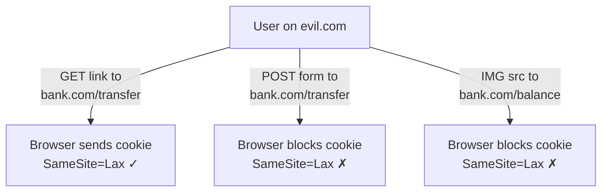

# Cookies and Sessions

> HTTP is stateless — it remembers nothing between requests. Yet every web application needs to remember who you are after you log in. Cookies and sessions are the solution, and understanding them deeply is essential for building any Flask application with authentication.

## Learning Objectives

After completing this chapter, you will be able to:

- Explain why HTTP's stateless nature requires cookies and sessions
- Describe how cookies work — setting, reading, expiration, and security attributes
- Distinguish between client-side sessions (signed cookies) and server-side sessions
- Explain session hijacking and best practices for secure session management
- Implement secure cookie settings in Flask
- Understand the difference between cookies, localStorage, and sessionStorage

## The Problem: HTTP Is Stateless

When you log into a website, the server must remember your identity on subsequent requests. But HTTP has no built-in mechanism for this. Each request is independent:

```
Request 1: POST /login (username=john, password=secret)
Response 1: 200 OK "Welcome, John!"

Request 2: GET /dashboard
Server: "Who is john? I've never seen this client before."
```

The server processes Request 2 as if it were from a completely new user. It has no memory of Request 1.

**Cookies** solve this by giving the server a way to stamp the client's browser with an identifier. On subsequent requests, the browser automatically presents this stamp, allowing the server to recognize the client.

## How Cookies Work

A cookie is a small piece of data (typically up to 4 KB) that a server stores on the client's browser. The browser sends it back with every subsequent request to the same domain.

### Setting a Cookie

The server sets a cookie using the `Set-Cookie` response header:

```http
HTTP/1.1 200 OK
Set-Cookie: session_id=abc123; Expires=Wed, 21 Oct 2026 07:28:00 GMT; Path=/; HttpOnly; Secure; SameSite=Lax
```

### Reading a Cookie

On subsequent requests, the browser automatically includes the cookie:

```http
GET /dashboard HTTP/1.1
Host: example.com
Cookie: session_id=abc123
```

### Cookie Attributes

| Attribute | Purpose | Security Implication |
|-----------|---------|---------------------|
| `Expires` / `Max-Age` | When the cookie expires | Session cookies (no expiry) are deleted when browser closes |
| `Path` | Which URL paths receive the cookie | `Path=/` sends cookie on all requests |
| `Domain` | Which hosts receive the cookie | `Domain=.example.com` shares across subdomains |
| `Secure` | Only send over HTTPS | Prevents cookie theft on unencrypted networks |
| `HttpOnly` | JavaScript cannot access the cookie | Prevents XSS attacks from stealing cookies |
| `SameSite` | Control cross-site request behavior | `Strict`, `Lax`, or `None` |

### SameSite Attribute

The `SameSite` attribute controls whether cookies are sent with cross-site requests:

- **`SameSite=Strict`**: Cookie never sent on cross-site requests. Most secure but breaks some legitimate cross-site flows (e.g., clicking a link from Twitter to your site requires re-authentication).
- **`SameSite=Lax`**: Cookie sent on top-level cross-site GET requests (link clicks) but not on POST requests or embedded resources (images, iframes). Good balance of security and usability. **Default in modern browsers.**
- **`SameSite=None`**: Cookie sent on all requests. Must be combined with `Secure`. Required for embedded content (iframes, cross-site API calls) but enables CSRF attacks if not carefully managed.



## Sessions

A **session** is a period of interaction between a user and a web application. Sessions are implemented using cookies, but the term "session" refers to the broader concept of maintaining state across requests.

### Client-Side Sessions (Signed Cookies)

Flask's default session mechanism stores session data in a **signed cookie** on the client's browser:

```python
from flask import session

@app.route('/login', methods=['POST'])
def login():
    session['user_id'] = 123          # Stored in the cookie
    session['username'] = 'john'       # Stored in the cookie
    return 'Logged in'
```

The session cookie contains the actual data, cryptographically signed with Flask's `SECRET_KEY`:

```
Cookie: session=eyJ1c2VyX2lkIjoxMjMsInVzZXJuYW1lIjoiam9obiJ9...
       (base64-encoded, signed JSON)
```

The signature prevents tampering — if the user modifies their session cookie, Flask detects the invalid signature and rejects it.

**Advantages:**
- No server-side storage required
- Scales horizontally — any server can verify the signature
- Simple to set up

**Disadvantages:**
- Cookie size limit (4 KB) restricts how much data you can store
- Sensitive data is visible to the client (though it cannot be modified)
- Cannot invalidate a session server-side (must wait for cookie to expire)

### Server-Side Sessions

With server-side sessions, only a **session ID** is stored in the cookie. The actual session data is stored on the server (in memory, Redis, a database, etc.):

```
Cookie: session_id=a1b2c3d4e5f6
Server storage: a1b2c3d4e5f6 -> {"user_id": 123, "username": "john", "cart": [...]}
```

**Advantages:**
- Arbitrary session size (not limited by cookie size)
- Sensitive data never leaves the server
- Sessions can be invalidated immediately (delete from server storage)

**Disadvantages:**
- Requires server-side storage
- Needs sticky sessions or shared storage for multi-server deployments
- Slightly more complex setup

Flask-Session is a popular extension for server-side sessions:

```python
from flask import Flask
from flask_session import Session

app = Flask(__name__)
app.config['SESSION_TYPE'] = 'redis'
app.config['SESSION_REDIS'] = redis.from_url('redis://localhost:6379')
Session(app)
```

## Flask Session Internals

Flask uses the **itsdangerous** library to sign session cookies. The process:

1. Session data is serialized to JSON
2. The JSON is base64-encoded
3. A **HMAC-SHA256** signature is computed using the `SECRET_KEY`
4. The signature is appended: `payload.signature`
5. The result is sent as the session cookie

```python
# Flask's session signing (simplified)
import base64, json, hmac, hashlib

data = json.dumps({'user_id': 123})
payload = base64.b64encode(data.encode()).decode()
signature = hmac.new(b'secret-key', payload.encode(), 'sha256').hexdigest()
cookie_value = f'{payload}.{signature}'
```

When the client sends the cookie back, Flask:
1. Splits the cookie into payload and signature
2. Recomputes the signature using `SECRET_KEY`
3. Compares the signatures (using constant-time comparison to prevent timing attacks)
4. If they match, decodes and deserializes the payload

> [!WARNING]
> If an attacker obtains your `SECRET_KEY`, they can forge session cookies and impersonate any user. Protect your secret key as you would database credentials. Never commit it to version control. Use environment variables.

## Session Security

### Session Hijacking

If an attacker steals a user's session cookie, they can impersonate that user. Methods:

- **XSS**: JavaScript reads `document.cookie` (prevented by `HttpOnly`)
- **Network sniffing**: Intercepting unencrypted HTTP traffic (prevented by `Secure` and HTTPS)
- **Physical access**: Accessing an unlocked computer
- **Session fixation**: Forcing a user to use a known session ID

### Best Practices for Secure Sessions

```python
app.config.update(
    SECRET_KEY=os.environ['SECRET_KEY'],  # Strong, random, secret
    
    # Cookie security
    SESSION_COOKIE_SECURE=True,           # HTTPS only
    SESSION_COOKIE_HTTPONLY=True,         # No JavaScript access
    SESSION_COOKIE_SAMESITE='Lax',        # CSRF protection
    SESSION_COOKIE_NAME='__Host-session', # __Host- prefix enforces Secure and Path=/
    
    # Session lifetime
    PERMANENT_SESSION_LIFETIME=timedelta(hours=1),
)
```

**Regenerate session ID on login:**

```python
from flask import session
from werkzeug.security import generate_password_hash

@app.route('/login', methods=['POST'])
def login():
    # ... validate credentials ...
    
    # Regenerate session ID to prevent session fixation
    session.regenerate()  # Flask 2.3+
    # Or manually: mark old session for deletion, create new
    
    session['user_id'] = user.id
    return redirect('/dashboard')
```

**Additional measures:**
- Set session expiration (idle timeout)
- Invalidate sessions on password change
- Bind sessions to IP address or User-Agent (may cause issues with mobile networks)
- Use server-side sessions for sensitive applications
- Log suspicious session activity

## Cookies vs. Web Storage

Browsers provide multiple client-side storage mechanisms:

| Feature | Cookies | localStorage | sessionStorage |
|---------|---------|--------------|----------------|
| Capacity | ~4 KB | ~5-10 MB | ~5-10 MB |
| Sent with HTTP requests | Yes | No | No |
| Accessible by JavaScript | Yes (unless HttpOnly) | Yes | Yes |
| Scope | Domain + path | Origin | Origin, per tab |
| Expiration | Configurable | Until cleared | Until tab closes |
| Use case | Session/auth tokens | Client-side caching | Form draft saving |

For Flask applications:
- Use **cookies** for session identifiers and authentication tokens
- Use **localStorage** for client-side preferences (theme, language) that do not need to reach the server
- Never store sensitive data in localStorage — it is accessible to any JavaScript on the page

## Common Mistakes

**Mistake: Storing sensitive data in client-side sessions**
Session cookies are signed, not encrypted. The client can read the contents. Never store passwords, credit card numbers, or personal information in client-side session cookies.

**Mistake: Using a weak or default SECRET_KEY**
Using `SECRET_KEY = 'dev'` or `SECRET_KEY = 'change-me'` in production means anyone can forge session cookies. Generate a strong key:

```bash
python -c "import secrets; print(secrets.token_hex(32))"
```

**Mistake: Not setting Secure and HttpOnly**
Without these attributes, session cookies are vulnerable to XSS attacks and network sniffing.

**Mistake: Sessions that never expire**
Infinite-lived sessions increase the window for hijacking. Set a reasonable expiration.

## Exercises

1. **Inspect Your Cookies**: Visit a website you use daily. Open DevTools → Application → Cookies. Examine the Name, Value, Domain, Path, Expires, Secure, HttpOnly, and SameSite columns for each cookie.

2. **Cookie Size**: Create a Flask route that stores increasingly large data in the session. At what point does the browser refuse the cookie?

3. **Session Hijacking Demo**: Log into a Flask app, copy the session cookie value to another browser (or use curl with the cookie). Can you access protected pages without logging in?

4. **SameSite Testing**: Create a Flask app with `SameSite=Strict`, `Lax`, and `None` cookies. Test cross-site link clicking and form submission behavior in each case.

## Quiz

**Question 1**: Why is HTTP called stateless? What problem does this create for web applications?

**Question 2**: Explain the difference between a session cookie and a persistent cookie.

**Question 3**: What do the `Secure`, `HttpOnly`, and `SameSite` attributes protect against?

**Question 4**: What is the difference between client-side sessions (Flask default) and server-side sessions?

**Question 5**: Why should you regenerate the session ID after a user logs in?

## Interview Questions

1. "HTTP is stateless. How do cookies and sessions maintain state across requests?"

2. "Explain the cookie attributes Secure, HttpOnly, and SameSite. What attacks do they prevent?"

3. "What is session fixation, and how do you prevent it?"

4. "Flask stores session data in a signed cookie. What are the advantages and disadvantages of this approach?"

5. "How would you implement 'log out all devices' functionality in a Flask application?"

## Related Chapters

- Previous: [[00-Foundations/HTTP2-HTTP3]]
- Next: [[00-Foundations/REST-APIs]]
- [[01-Flask-Core/Sessions]] — Flask's session implementation
- [[04-Authentication/Flask-Login]] — Production authentication
- [[08-Security/Session-Security]] — Advanced session security

## Official Documentation References

- [RFC 6265 - HTTP State Management Mechanism (Cookies)](https://datatracker.ietf.org/doc/html/rfc6265)
- [MDN - HTTP Cookies](https://developer.mozilla.org/en-US/docs/Web/HTTP/Cookies)
- [OWASP Session Management Cheat Sheet](https://cheatsheetseries.owasp.org/cheatsheets/Session_Management_Cheat_Sheet.html)
- [OWASP Cookie Attributes Cheat Sheet](https://cheatsheetseries.owasp.org/cheatsheets/Cookie_Attributes_Cheat_Sheet.html)
- [Flask Documentation - Sessions](https://flask.palletsprojects.com/en/latest/quickstart/#sessions)

---

*Previous: [[00-Foundations/HTTP2-HTTP3]] | Next: [[00-Foundations/REST-APIs]]*