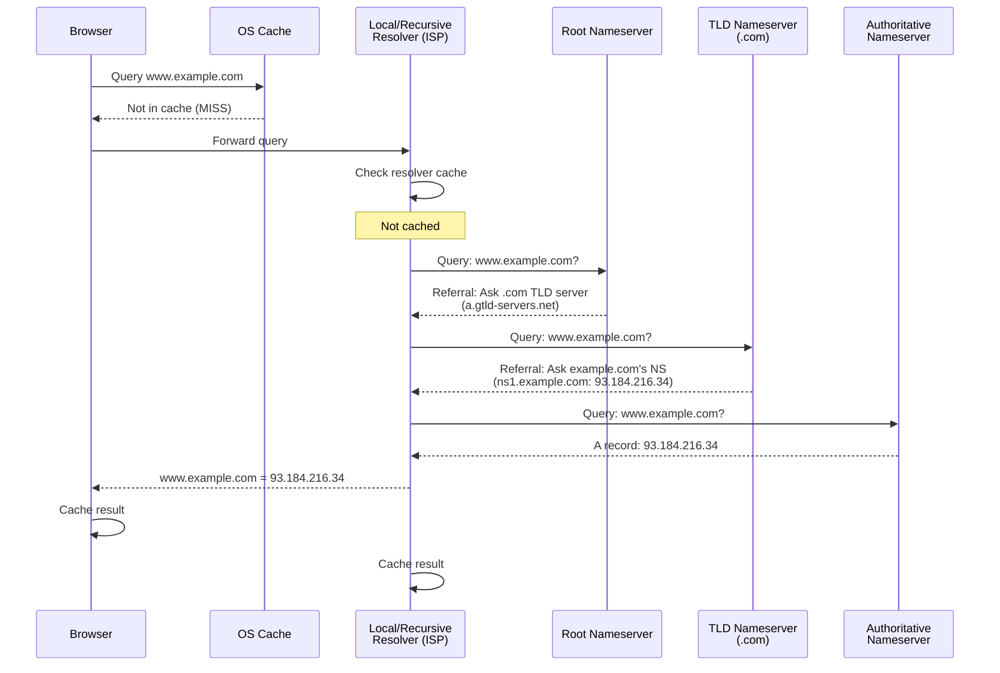

# DNS — Domain Name System

> DNS is the phonebook of the internet. Every time you visit a website, DNS translates the human-friendly domain name into the machine-friendly IP address — and it does this billions of times per day.

## Learning Objectives

After completing this chapter, you will be able to:

- Explain how DNS resolves a domain name to an IP address through the hierarchical DNS lookup process
- Describe the role of recursive resolvers, root nameservers, TLD nameservers, and authoritative nameservers
- Understand DNS caching at multiple levels and its impact on propagation time
- Configure DNS records (A, AAAA, CNAME, MX, TXT, NS) for a Flask application
- Explain DNS propagation and TTL (Time To Live)
- Understand DNS security threats and protections (DNSSEC, DNS hijacking, cache poisoning)
- Configure a custom domain for a deployed Flask application

## Why DNS Exists

Computers communicate using **IP addresses** — numerical identifiers like `93.184.216.34` (IPv4) or `2606:2800:220:1:248:1893:25c8:1946` (IPv6). Humans cannot remember these numbers for every website they visit.

DNS solves this problem by creating a **distributed, hierarchical naming system** that maps human-readable **domain names** (like `example.com`) to IP addresses. When you type `example.com` into your browser, DNS is the system that finds the corresponding IP address so your computer can establish a connection.

DNS operates on **UDP port 53** (with TCP port 53 used for large responses and zone transfers). It is one of the internet's oldest protocols — standardized in 1983 — and remains critical infrastructure for virtually every internet activity.

## The DNS Hierarchy

DNS is organized as an **inverted tree** with the root at the top. Each level is separated by a dot.

```
                    . (root)
                    |
    +---------------+---------------+---------------+
    |               |               |               |
   .com            .org            .net            .edu
    |               |               |               |
  google          wikipedia        cloudflare      mit
    |               |               |               |
  www             www              www             www
```

The fully qualified domain name (FQDN) `www.example.com.` actually ends with a trailing dot representing the root. The dots separate levels of authority:

- **Root zone** (`.`) — Managed by ICANN, operated by 13 logical root server clusters
- **Top-Level Domain (TLD)** — `.com`, `.org`, `.net`, `.io`, `.dev`, country codes like `.uk`, `.de`
- **Second-Level Domain** — `example` in `example.com` — registered by individuals and organizations
- **Subdomain** — `www`, `api`, `blog` — controlled by the domain owner

Each level delegates authority to the level below it. ICANN delegates `.com` to Verisign. Verisign delegates `example.com` to whoever registered it. That owner can create any subdomains (`api.example.com`, `blog.example.com`).

## How DNS Resolution Works

When your browser needs to resolve `www.example.com`, it performs a **DNS lookup** involving multiple servers:



### Step 1: Browser Cache

The browser maintains its own DNS cache. If you recently visited `example.com`, the IP address may still be cached. Chrome caches DNS entries for 60 seconds (or the TTL, whichever is shorter).

### Step 2: Operating System Cache

If the browser cache misses, the query goes to the operating system's DNS resolver. On Linux, this checks `/etc/hosts` first, then the systemd-resolved cache or nscd. On macOS, it uses the system resolver cache. On Windows, it uses the DNS Client service cache.

The `/etc/hosts` file allows local overrides:

```
# /etc/hosts
127.0.0.1    localhost
127.0.0.1    myflaskapp.test
93.184.216.34 example.com
```

### Step 3: Recursive DNS Resolver

If the OS cache also misses, the query is sent to a **recursive resolver** (also called a recursive nameserver or DNS resolver). This is typically operated by your ISP, your organization, or a public DNS service.

**Public DNS resolvers:**
- Google: `8.8.8.8`, `8.8.4.4`
- Cloudflare: `1.1.1.1`, `1.0.0.1`
- Quad9: `9.9.9.9`
- OpenDNS: `208.67.222.222`

The recursive resolver does the heavy lifting. It queries the root, TLD, and authoritative nameservers on your behalf, caches the results, and returns the answer.

### Step 4: Root Nameserver

The recursive resolver asks a **root nameserver**: "What is the IP address for `www.example.com`?"

The root server does not know the answer. But it knows which servers are responsible for each TLD. It responds with a **referral**: "I don't know, but here are the nameservers for `.com`."

There are 13 logical root server clusters (named A through M), operated by different organizations. These are among the most critical infrastructure on the internet. Their IP addresses are hardcoded into every DNS resolver.

### Step 5: TLD Nameserver

The recursive resolver asks the `.com` TLD nameserver: "What is the IP address for `www.example.com`?"

The TLD server also does not know the final answer. But it knows which nameservers are authoritative for `example.com`. It responds with another referral: "I don't know, but here are the nameservers for `example.com`."

Verisign operates the `.com` and `.net` TLD servers. Other TLDs have their own operators.

### Step 6: Authoritative Nameserver

Finally, the recursive resolver asks the **authoritative nameserver** for `example.com`: "What is the IP address for `www.example.com`?"

This server knows the answer because the domain owner configured it there. It responds with the **A record**: `93.184.216.34`.

The recursive resolver caches this answer and returns it to your browser. Your browser and OS also cache it. The next time you visit `example.com`, the answer comes from cache — potentially skipping all the upstream queries.

## DNS Record Types

DNS stores more than just IP addresses. Different **record types** serve different purposes:

### A Record (Address)

Maps a domain name to an IPv4 address. The most common DNS record.

```
example.com.    A    93.184.216.34
```

When a user types `example.com`, this record tells their browser to connect to `93.184.216.34`.

### AAAA Record (IPv6 Address)

Maps a domain name to an IPv6 address. The four As represent the longer IPv6 address length.

```
example.com.    AAAA    2606:2800:220:1:248:1893:25c8:1946
```

Modern browsers prefer AAAA records when IPv6 is available, falling back to A records otherwise.

### CNAME Record (Canonical Name)

Creates an alias from one domain name to another. The DNS resolver follows the chain until it finds an A or AAAA record.

```
www.example.com.    CNAME    example.com.
example.com.        A        93.184.216.34
```

When someone queries `www.example.com`, the resolver sees the CNAME and queries `example.com` instead.

> [!WARNING]
> A CNAME record cannot coexist with other records at the same name. You cannot have both a CNAME and an MX record for `example.com` — the CNAME would override everything. Use CNAMEs for subdomains (`www`, `api`) but not for the root domain.

### MX Record (Mail Exchange)

Specifies the mail server responsible for accepting email on behalf of the domain.

```
example.com.    MX    10    mail.example.com.
example.com.    MX    20    mail-backup.example.com.
```

The number (10, 20) is the **priority** — lower numbers are preferred. Multiple MX records provide redundancy.

### TXT Record (Text)

Stores arbitrary text data. Commonly used for:

- **SPF (Sender Policy Framework)**: Specifies which servers are authorized to send email for the domain
- **DKIM (DomainKeys Identified Mail)**: Cryptographic email authentication
- **Domain verification**: Proving domain ownership to Google, AWS, etc.
- **CAA (Certificate Authority Authorization)**: Specifies which CAs can issue certificates

```
example.com.    TXT    "v=spf1 include:_spf.google.com ~all"
```

### NS Record (Nameserver)

Specifies which DNS server is authoritative for the domain.

```
example.com.    NS    ns1.cloudflare.com.
example.com.    NS    ns2.cloudflare.com.
```

When you register a domain and want to use Cloudflare, AWS Route 53, or another DNS provider, you update the NS records at your registrar to point to their nameservers.

### Other Common Records

| Record | Purpose |
|--------|---------|
| **SOA** | Start of Authority — administrative info about the zone |
| **PTR** | Pointer — reverse DNS (IP to domain name) |
| **SRV** | Service — location of specific services (XMPP, SIP) |
| **CAA** | Certificate Authority Authorization |
| **DNSKEY** | Public key for DNSSEC |

## DNS Caching and TTL

DNS relies heavily on caching to reduce query load and improve performance. Every DNS record has a **TTL (Time To Live)** value — the number of seconds that resolvers should cache the record.

```
example.com.    3600    IN    A    93.184.216.34
```

Here, the TTL is 3600 seconds (1 hour). After a resolver caches this record, it will not query upstream for another hour — it serves the cached answer immediately.

### Caching Hierarchy

DNS records are cached at multiple levels:

1. **Browser cache**: Chrome caches for 60 seconds or the TTL, whichever is shorter
2. **OS cache**: Typically respects the full TTL
3. **Recursive resolver cache**: Respects the TTL; public resolvers like 8.8.8.8 may have millions of users benefiting from shared cache
4. **Intermediate resolvers**: Some ISPs run caching layers between you and the public resolver

### TTL and DNS Propagation

When you change a DNS record (e.g., updating your Flask app's IP address), the change is not instant. It must propagate through the caching hierarchy. Old cached values persist until their TTL expires.

This is why DNS changes can take hours or even days to fully propagate globally. To minimize this:

- Lower the TTL **before** making changes (e.g., to 300 seconds / 5 minutes)
- Wait for the old TTL to expire
- Make your DNS change
- After propagation, you can raise the TTL back

```
Before change:  example.com.    86400    A    192.0.2.1   (24 hour TTL)
Lower TTL:      example.com.    300      A    192.0.2.1   (wait 24 hours)
After change:   example.com.    300      A    198.51.100.1
After propagation: example.com. 86400   A    198.51.100.1
```

### Negative Caching

When a domain name does not exist, DNS resolvers cache this "negative" result too. If you misconfigure a subdomain and then fix it, the "does not exist" response may be cached for several minutes or hours.

## DNS for Flask Applications

When you deploy a Flask application, you configure DNS to point your domain to your server. Here is the typical setup:

### Basic Setup (Single Server)

```
# A record points root domain to server IP
example.com.        A        198.51.100.10

# CNAME points www to root
www.example.com.    CNAME    example.com.

# Optional: API subdomain
api.example.com.    A        198.51.100.10
```

### Cloudflare Setup (Recommended)

Using Cloudflare as your DNS provider adds caching, DDoS protection, and SSL:

1. Register your domain and point its NS records to Cloudflare
2. In Cloudflare's dashboard, add an A record for your server's IP
3. Enable the "Proxied" (orange cloud) setting — this routes traffic through Cloudflare's network
4. Cloudflare automatically provides SSL certificates

```
example.com.        A        198.51.100.10    (Proxied)
www.example.com.    CNAME    example.com.     (Proxied)
```

With Cloudflare proxying enabled, users connect to Cloudflare's edge servers, and Cloudflare connects to your origin server. Your server's real IP is hidden.

### Multi-Server Setup

For high availability, point your domain to multiple servers:

```
example.com.    A    198.51.100.10
example.com.    A    198.51.100.11
```

DNS **round-robin** distributes traffic across both IPs. However, DNS-based load balancing is crude — it does not detect server failures. For production, use a load balancer (like Nginx or a cloud load balancer) with health checks.

## DNS Tools

Several command-line tools help you query and debug DNS:

### dig (Domain Information Groper)

The most powerful DNS lookup tool. Available on Linux and macOS.

```bash
# Basic A record lookup
dig example.com A

# Query a specific nameserver
dig @8.8.8.8 example.com A

# Trace the full resolution path
dig +trace example.com

# Short output
dig +short example.com

# Check MX records
dig example.com MX

# Check TXT records
dig example.com TXT

# Reverse DNS lookup
dig -x 93.184.216.34
```

### nslookup

A simpler DNS lookup tool available on most operating systems.

```bash
nslookup example.com
nslookup -type=MX example.com
```

### host

A simple DNS lookup utility.

```bash
host example.com
host -t MX example.com
```

### Python's socket module

You can perform DNS lookups in Python:

```python
import socket

# Resolve domain to IP
ip = socket.gethostbyname('example.com')
print(ip)  # 93.184.216.34

# Resolve with full information
addr_info = socket.getaddrinfo('example.com', 80, socket.AF_INET)
print(addr_info)
```

## DNS Security

DNS was designed in an era when security was not a primary concern. Several vulnerabilities and protections exist:

### DNS Hijacking

An attacker redirects DNS queries to a malicious server, resolving legitimate domains to attacker-controlled IP addresses. This can happen by:

- Compromising a router and changing its DNS settings
- Compromising a DNS registrar account and changing NS records
- ISP-level manipulation (less common in democracies, more common in authoritarian regimes)

**Protection**: Use DNSSEC, monitor your domain's DNS settings, enable registrar lock, use two-factor authentication.

### DNS Cache Poisoning

An attacker injects false DNS records into a resolver's cache. When users query the poisoned domain, they receive the attacker's IP address.

**Protection**: DNSSEC cryptographically signs DNS records, preventing cache poisoning. Modern resolvers also use source port randomization (making attacks harder) and DNSSEC validation.

### DNSSEC (DNS Security Extensions)

DNSSEC adds cryptographic signatures to DNS records. Each DNS zone signs its records with a private key. Resolvers verify these signatures using public keys, ensuring records have not been tampered with.

DNSSEC provides **authentication** (this answer came from the real authoritative server) but not **encryption** (DNS queries and responses are still visible). For encrypted DNS, see DoH and DoT below.

### DoH and DoT

- **DNS over HTTPS (DoH)**: Encrypts DNS queries inside HTTPS connections. Hides DNS queries from ISPs and network observers. Supported by Firefox and Chrome.
- **DNS over TLS (DoT)**: Encrypts DNS queries using TLS on port 853. Similar protection to DoH but uses a dedicated port.

Both prevent network observers from seeing which domains you visit (though the IP addresses of HTTPS connections may still leak information via Server Name Indication).

## Common Mistakes

**Mistake: Expecting DNS changes to be instant**
DNS caching means changes take time to propagate. Always plan for the TTL duration.

**Mistake: CNAME at the root domain**
You cannot create a CNAME record for the root domain (`example.com`) alongside other records like MX. Use an ALIAS or ANAME record if your DNS provider supports it, or use an A record.

**Mistake: Forgetting to configure both www and non-www**
Users may type either `www.example.com` or `example.com`. Configure both (with a redirect from one to the other for consistency and SEO).

**Mistake: Long TTLs before planned changes**
Lower your TTL at least 24 hours before making DNS changes.

## Best Practices

- Use a reputable DNS provider (Cloudflare, AWS Route 53, Google Cloud DNS)
- Enable DNSSEC for domains that support it
- Keep TTLs short (300-600 seconds) for records that change frequently
- Keep TTLs long (86400 seconds) for stable records to reduce query load
- Configure both `www` and root domain with a canonical redirect
- Monitor your DNS configuration for unauthorized changes
- Use `dig +trace` to debug DNS resolution issues

## Exercises

1. **Trace a DNS lookup**: Run `dig +trace google.com` and observe each step of the resolution process. Identify the root server, TLD server, and authoritative server.

2. **Check your resolver**: Run `dig google.com` and note the `SERVER` line in the output. What DNS resolver are you using?

3. **Compare resolver speeds**: Time DNS lookups with different resolvers:
   ```bash
   time dig @8.8.8.8 example.com
   time dig @1.1.1.1 example.com
   time dig @9.9.9.9 example.com
   ```

4. **TTL investigation**: Look up a popular website's TTL: `dig google.com A`. How long is the TTL? Now run it again immediately. Do you see the same TTL value decreasing?

5. **Reverse DNS**: Use `dig -x` to find the domain name associated with an IP address. Try `dig -x 8.8.8.8`.

## Quiz

**Question 1**: What are the four types of DNS servers involved in resolving a domain name? What role does each play?

**Question 2**: Why does DNS use caching? What problem does it solve, and what problem does it create?

**Question 3**: What is the difference between an A record and a CNAME record? When would you use each?

**Question 4**: Explain DNS propagation. Why does it take time, and how can you minimize it?

**Question 5**: What is DNSSEC, and what threat does it protect against?

## Interview Questions

1. "Explain the complete DNS resolution process from browser to authoritative nameserver."

2. "Why can't you have a CNAME record at the root domain?"

3. "A user says your website is down, but it works for you. How could DNS be the cause?"

4. "Explain the difference between an authoritative nameserver and a recursive resolver."

5. "How would you migrate a Flask application to a new server with minimal downtime using DNS?"

6. "What is DNS cache poisoning, and how does DNSSEC prevent it?"

## Related Chapters

- Previous: [[00-Foundations/Browser]]
- Next: [[00-Foundations/IP-Addresses]]
- [[07-Deployment/Domains]] — Configuring domains for Flask deployment
- [[00-Foundations/TLS-HTTPS]] — Securing DNS with DNS over HTTPS

## Official Documentation References

- [ICANN - DNS Basics](https://www.icann.org/resources/pages/dnssec-what-is-it-why-important-2019-03-05-en)
- [RFC 1034 - Domain Names](https://datatracker.ietf.org/doc/html/rfc1034)
- [RFC 1035 - DNS Implementation](https://datatracker.ietf.org/doc/html/rfc1035)
- [Cloudflare - What is DNS?](https://www.cloudflare.com/learning/dns/what-is-dns/)
- [Google Public DNS](https://developers.google.com/speed/public-dns)

---

*Previous: [[00-Foundations/Browser]] | Next: [[00-Foundations/IP-Addresses]]*