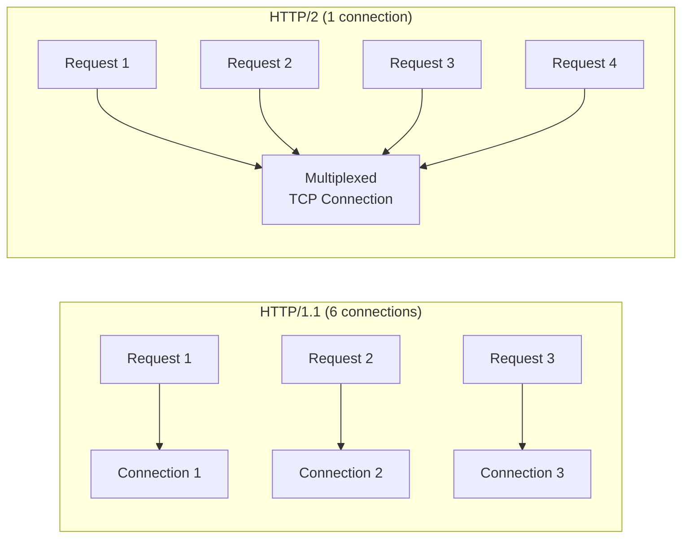
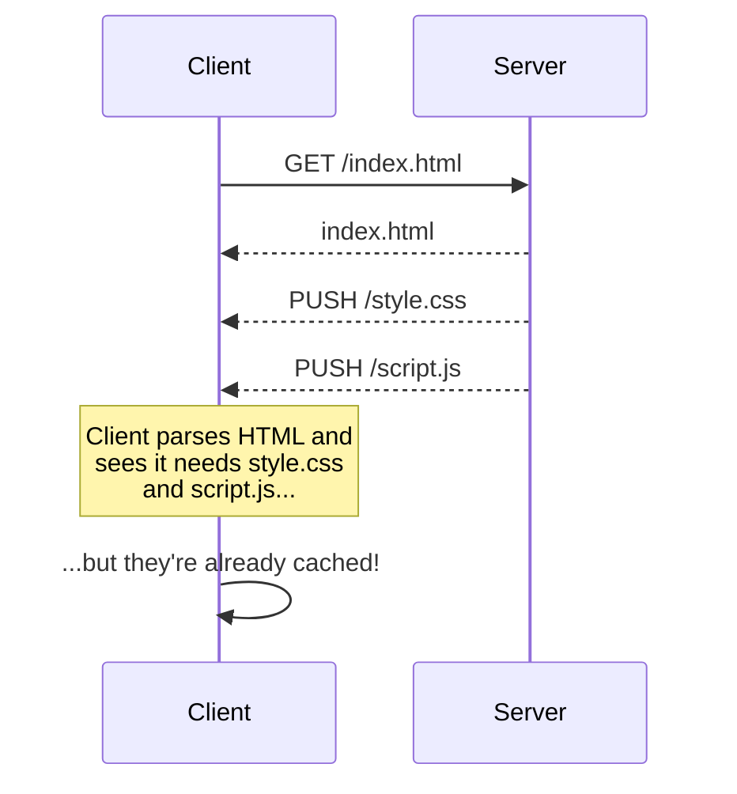
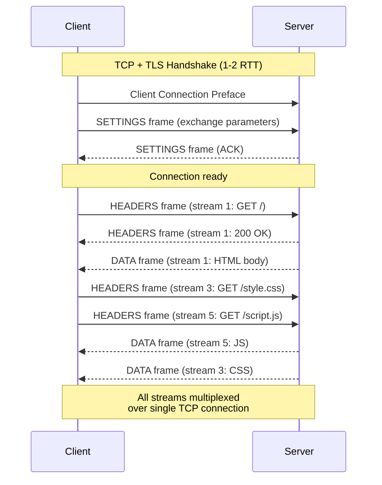
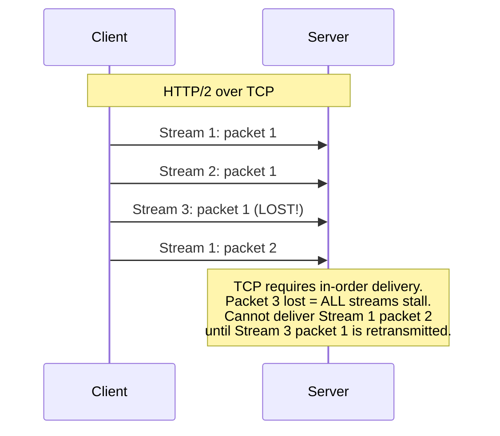
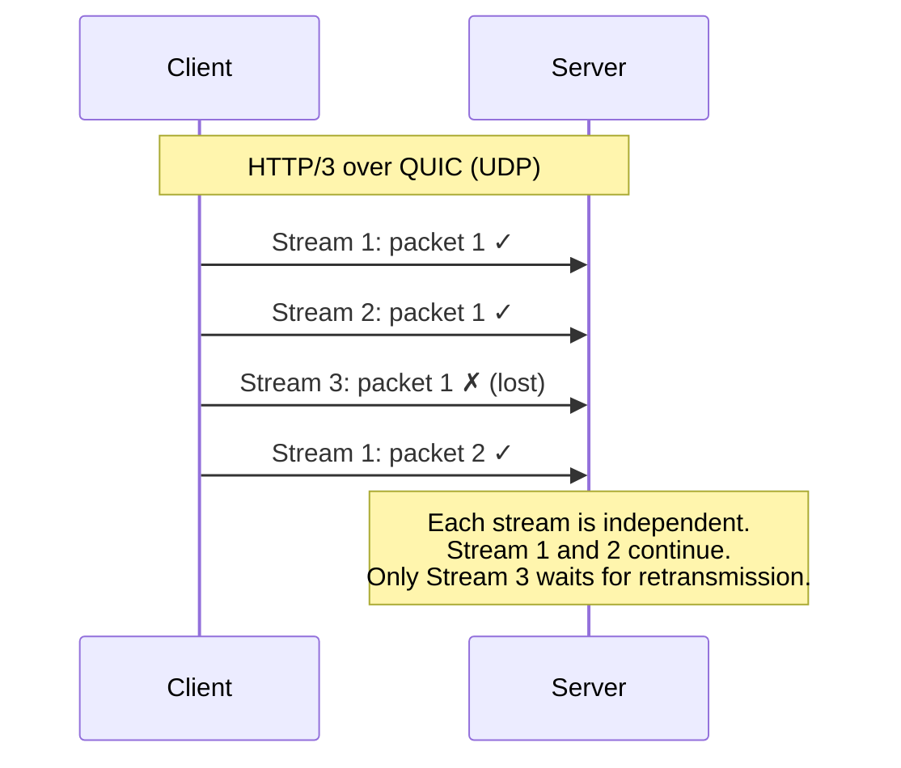

# HTTP/2 and HTTP/3

> HTTP/1.1 served the web for nearly two decades, but its limitations became critical as web pages grew complex. HTTP/2 and HTTP/3 represent fundamental redesigns that dramatically improve performance. Understanding them helps you build faster Flask applications and make informed deployment decisions.

## Learning Objectives

After completing this chapter, you will be able to:

- Explain the limitations of HTTP/1.1 that motivated HTTP/2 and HTTP/3
- Describe HTTP/2's multiplexing, header compression, and server push
- Explain HTTP/3's use of QUIC and UDP instead of TCP
- Understand how these protocols affect Flask application architecture
- Configure Nginx to serve Flask applications over HTTP/2 and HTTP/3

## HTTP/1.1 Limitations

HTTP/1.1 (standardized in 1997) has several performance bottlenecks:

### Head-of-Line Blocking

HTTP/1.1 can send only **one request per TCP connection at a time**. The next request must wait for the previous response to complete. On a complex page with 100 resources (HTML, CSS, JS, images), this creates a long queue.

Browsers worked around this by opening **multiple parallel connections** (typically 6 per domain), but each connection requires its own TCP handshake and TLS handshake, adding overhead.

### Uncompressed Headers

HTTP/1.1 sends full headers with every request. If you send 50 requests to the same domain, you transmit the `Host`, `User-Agent`, `Accept`, and `Cookie` headers 50 times. For large cookies, this adds significant overhead.

### No Server Push

The server can only respond to explicit client requests. If the server knows the client will need `style.css` after receiving `index.html`, it must wait for the client to request it — adding a round trip.

## HTTP/2 (RFC 7540, 2015)

HTTP/2 maintains HTTP's semantics (methods, headers, status codes) but changes how messages are transported over the wire.

### Key Features

#### 1. Binary Framing

HTTP/2 is a **binary protocol** rather than text-based. Messages are split into small frames, enabling more efficient parsing and multiplexing.

```
HTTP/1.1: Human-readable text
GET /page HTTP/1.1
Host: example.com

HTTP/2: Binary frames
[HEADERS frame] [DATA frame] [HEADERS frame] [DATA frame]
```

#### 2. Multiplexing

HTTP/2 sends multiple requests and responses **simultaneously over a single TCP connection**. Frames from different streams are interleaved:



This eliminates head-of-line blocking at the HTTP layer. Request 2 does not wait for Request 1 to complete.

> [!NOTE]
> HTTP/2 only solves head-of-line blocking at the HTTP layer. TCP-level head-of-line blocking remains — if a TCP packet is lost, all HTTP/2 streams on that connection stall until the packet is retransmitted. HTTP/3 solves this with QUIC.

#### 3. Header Compression (HPACK)

HTTP/2 uses **HPACK** to compress headers. The client and server maintain a dynamic table of previously sent headers. Instead of sending `User-Agent: Mozilla/5.0...` on every request, they send a reference: "use header #5 from the table."

This typically reduces header size by 30-80%, especially beneficial for requests with large cookies.

#### 4. Stream Prioritization

HTTP/2 allows clients to assign **priority weights** to streams. The server can use these to allocate bandwidth — sending critical CSS before non-essential images, for example.

#### 5. Server Push

HTTP/2 allows the server to proactively send resources the client has not yet requested:



Server push sounded promising but has largely fallen out of favor. Browsers now aggressively preload resources using `<link rel="preload">`, and push is difficult to use correctly — pushing resources the client already has cached wastes bandwidth. Many implementations (including some CDNs) have deprecated server push.

### HTTP/2 Connection Lifecycle



### HTTP/2 and Flask

Flask itself does not speak HTTP/2. Flask is a WSGI application — it receives requests from a WSGI server and returns responses. HTTP/2 termination happens at the reverse proxy (Nginx) or CDN layer.

```
Browser (HTTP/2) --> Nginx (terminates HTTP/2) --> Gunicorn (HTTP/1.1) --> Flask
```

Nginx handles HTTP/2, converts requests to HTTP/1.1, and forwards them to Gunicorn. This is transparent to your Flask application — you write the same code regardless of the HTTP version the client uses.

To enable HTTP/2 in Nginx:

```nginx
server {
    listen 443 ssl http2;
    listen [::]:443 ssl http2;
    
    ssl_certificate /path/to/cert.pem;
    ssl_certificate_key /path/to/key.pem;
    
    location / {
        proxy_pass http://127.0.0.1:8000;
        proxy_http_version 1.1;
    }
}
```

## HTTP/3 (RFC 9114, 2022)

HTTP/3 represents a more radical departure — it replaces TCP with **QUIC**, which runs over UDP.

### Why Replace TCP?

HTTP/2's multiplexing solved HTTP-level head-of-line blocking, but **TCP-level head-of-line blocking** remained:



A single lost TCP packet stalls all HTTP/2 streams. QUIC solves this by implementing reliability **per-stream** rather than per-connection:



### QUIC Key Features

**1. Built-in TLS 1.3**
QUIC integrates TLS 1.3 — encryption is not optional. There is no unencrypted QUIC.

**2. 0-RTT Connection Establishment**
For repeat connections, QUIC can send data immediately with the first packet (0-RTT), using a pre-shared key from a previous connection. This eliminates the latency of both TCP and TLS handshakes.

**3. Connection Migration**
QUIC connections are identified by a connection ID, not by the 4-tuple (source IP, source port, dest IP, dest port). If a user's IP changes (switching from Wi-Fi to cellular), the connection continues uninterrupted.

**4. User-Space Implementation**
QUIC runs in user space (like any application), not in the OS kernel. This enables faster deployment of protocol improvements without waiting for OS updates.

### HTTP/3 and Flask

As with HTTP/2, Flask does not directly speak HTTP/3. Termination happens at the CDN (Cloudflare) or reverse proxy level:

```
Browser (HTTP/3 over QUIC/UDP) --> Cloudflare (terminates HTTP/3) --> Nginx --> Gunicorn --> Flask
```

Cloudflare and some other CDNs already support HTTP/3. Configuring it is typically a checkbox in their dashboard. Your Flask application requires no changes.

### HTTP/3 Support in Nginx

Nginx added experimental HTTP/3 support in version 1.25.0:

```nginx
server {
    listen 443 quic reuseport;
    listen [::]:443 quic reuseport;
    listen 443 ssl;
    
    ssl_certificate /path/to/cert.pem;
    ssl_certificate_key /path/to/key.pem;
    
    # Enable 0-RTT
    ssl_early_data on;
    
    # Advertise HTTP/3 support
    add_header Alt-Svc 'h3=":443"; ma=86400';
    
    location / {
        proxy_pass http://127.0.0.1:8000;
    }
}
```

The `Alt-Svc` header tells browsers that HTTP/3 is available. After receiving this header, future connections will use HTTP/3.

## Protocol Comparison

| Feature | HTTP/1.1 | HTTP/2 | HTTP/3 |
|---------|----------|--------|--------|
| Transport | TCP | TCP | QUIC (over UDP) |
| Format | Text | Binary | Binary |
| Multiplexing | No (6 connections) | Yes | Yes |
| Head-of-line blocking | HTTP-level | TCP-level | None |
| Header compression | No | HPACK | QPACK |
| Server push | No | Yes (deprecated) | No |
| TLS required | No | No (but always used) | Yes (built-in) |
| 0-RTT | No | No | Yes |
| Connection migration | No | No | Yes |
| Deployment complexity | Simple | Moderate | Higher |

## Implications for Flask Developers

### What Changes

**Nothing in your Flask code.** Your application continues to receive HTTP/1.1 requests from Gunicorn, regardless of what protocol the client used.

### What You Should Know

1. **Performance improvements are automatic**: When you enable HTTP/2/3 at the reverse proxy/CDN level, clients benefit without code changes.

2. **Fewer TCP connections**: HTTP/2's multiplexing means fewer connections to your server. This reduces memory usage and connection overhead.

3. **Larger headers are less penalized**: HPACK/QPACK compression means large cookies and headers are less of a performance issue.

4. **Push is dead, preload is the replacement**: Use `<link rel="preload">` in your templates instead of server push:

```html
<link rel="preload" href="/static/style.css" as="style">
<link rel="preload" href="/static/script.js" as="script">
```

5. **HTTP/3 requires UDP**: Your firewall must allow inbound UDP on port 443 (in addition to TCP). Some corporate firewalls block UDP, so HTTP/2 over TCP remains a fallback.

## Best Practices

- Enable HTTP/2 on your reverse proxy (Nginx) — it is widely supported and provides significant benefits
- Consider HTTP/3 if your CDN supports it (Cloudflare, Fastly)
- Use `rel="preload"` for critical resources
- Minimize header sizes even with compression — not all intermediaries support it
- Keep your TLS configuration modern — HTTP/2 and HTTP/3 require TLS 1.2+

## Common Mistakes

**Mistake: Thinking HTTP/2 requires application changes**
HTTP/2 termination happens at the proxy layer. Your Flask code is unchanged.

**Mistake: Enabling HTTP/2 without TLS**
While the HTTP/2 specification allows unencrypted connections, no browser supports it. TLS is effectively required.

**Mistake: Obsessing over HTTP/3**
HTTP/3 provides marginal improvements for many applications. HTTP/2 provides most of the benefit with simpler deployment.

## Exercises

1. **Check HTTP/2 Support**: Visit a website and check DevTools → Network tab. The "Protocol" column shows `h2` for HTTP/2. Which sites use it?

2. **Test HTTP/3**: Visit cloudflare.com with a browser that supports HTTP/3 (Chrome, Firefox). In DevTools, look for `h3` in the Protocol column.

3. **Enable HTTP/2**: If you have a Flask app deployed with Nginx, add `http2` to the `listen` directive and test. Use `curl --http2 -I https://your-site.com` to verify.

## Quiz

**Question 1**: What problem does HTTP/2 multiplexing solve that existed in HTTP/1.1?

**Question 2**: What is head-of-line blocking, and how does HTTP/3 solve it differently from HTTP/2?

**Question 3**: Why does HTTP/3 use UDP instead of TCP?

**Question 4**: Does your Flask application need to change to support HTTP/2 or HTTP/3? Why or why not?

**Question 5**: What has replaced HTTP/2 server push as the recommended technique for early resource delivery?

## Interview Questions

1. "What are the main performance limitations of HTTP/1.1, and how does HTTP/2 address them?"

2. "Explain the difference between HTTP-level and TCP-level head-of-line blocking."

3. "Why does HTTP/3 use QUIC over UDP instead of TCP?"

4. "As a Flask developer, what do you need to do to support HTTP/2 and HTTP/3?"

5. "What is 0-RTT in QUIC, and what security considerations does it have?"

## Related Chapters

- Previous: [[00-Foundations/HTTP]]
- Next: [[00-Foundations/Cookies-Sessions]]
- [[07-Deployment/Nginx]] — Configuring HTTP/2 and HTTP/3
- [[00-Foundations/TCP-UDP]] — The transport layer beneath HTTP

## Official Documentation References

- [RFC 7540 - HTTP/2](https://datatracker.ietf.org/doc/html/rfc7540)
- [RFC 9114 - HTTP/3](https://datatracker.ietf.org/doc/html/rfc9114)
- [RFC 9000 - QUIC](https://datatracker.ietf.org/doc/html/rfc9000)
- [Cloudflare - HTTP/3](https://www.cloudflare.com/learning/performance/what-is-http3/)
- [Google Developers - Introduction to HTTP/2](https://web.dev/performance-http2/)

---

*Previous: [[00-Foundations/HTTP]] | Next: [[00-Foundations/Cookies-Sessions]]*