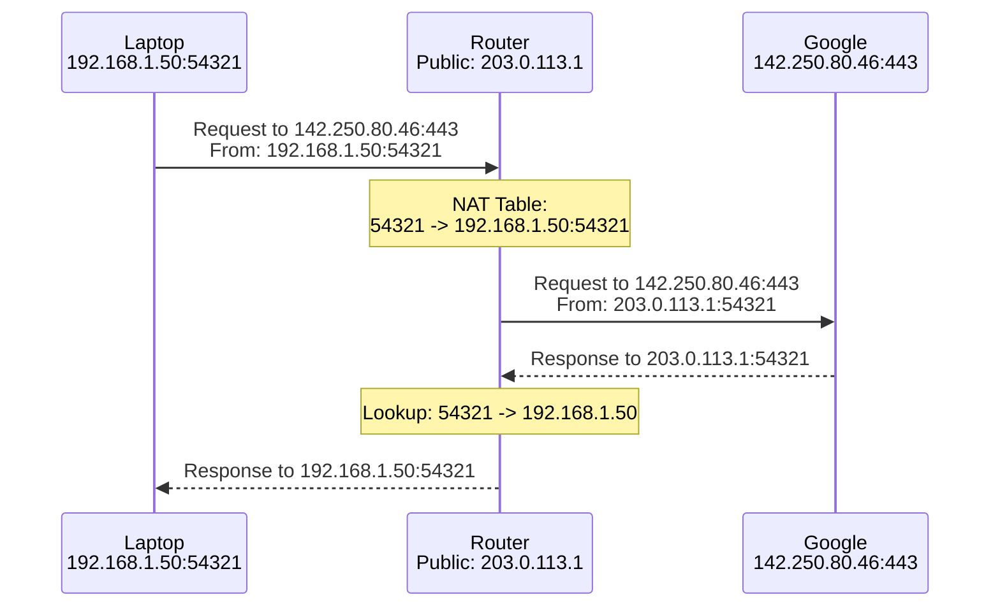

# IP Addresses

> Every device connected to the internet — your laptop, a Flask server, a smartphone, a refrigerator — needs a unique identifier. That identifier is an IP address. Without it, no communication is possible.

## Learning Objectives

After completing this chapter, you will be able to:

- Explain the structure and limitations of IPv4 addresses
- Describe the IPv6 addressing scheme and why it was necessary
- Understand private vs. public IP addresses and NAT
- Calculate network ranges using CIDR notation
- Explain how IP routing works at a high level
- Configure Flask to bind to specific IP addresses and ports
- Understand loopback addresses and when to use them

## What Is an IP Address?

An **IP address (Internet Protocol address)** is a numerical label assigned to every device connected to a computer network that uses the Internet Protocol for communication. It serves two primary functions:

1. **Host identification**: Identifies the specific device on a network
2. **Location addressing**: Provides information about where the device is located in the network topology, enabling routers to deliver packets to it

IP addresses are assigned by the **Internet Assigned Numbers Authority (IANA)** and five **Regional Internet Registries (RIRs)**: ARIN (North America), RIPE NCC (Europe), APNIC (Asia-Pacific), LACNIC (Latin America), and AFRINIC (Africa).

## IPv4: The Original Addressing Scheme

**IPv4 (Internet Protocol version 4)** was defined in 1981 (RFC 791). It uses **32-bit addresses**, typically written in **dotted-decimal notation** — four decimal numbers (octets) separated by dots.

### Structure

```
32 bits total:
|        8 bits        |        8 bits        |        8 bits        |        8 bits        |
|     192            |     168              |     1                |     1                |

Binary:
| 11000000 | 10101000 | 00000001 | 00000001 |
```

Each octet ranges from 0 to 255, giving a total of:

```
2^32 = 4,294,967,296 addresses
```

Approximately **4.3 billion** unique IP addresses. This seemed infinite in 1981 when the internet connected a few hundred research computers. It is nowhere near enough today.

### Address Classes (Historical)

Originally, IPv4 addresses were divided into classes:

| Class | First Bits | Range | Default Mask | Use |
|-------|-----------|-------|--------------|-----|
| A | 0 | 0.0.0.0 – 127.255.255.255 | /8 | Very large networks |
| B | 10 | 128.0.0.0 – 191.255.255.255 | /16 | Medium networks |
| C | 110 | 192.0.0.0 – 223.255.255.255 | /24 | Small networks |
| D | 1110 | 224.0.0.0 – 239.255.255.255 | — | Multicast |
| E | 1111 | 240.0.0.0 – 255.255.255.255 | — | Reserved |

Class-based allocation wasted enormous numbers of addresses. A Class A network received 16.7 million addresses even if it only needed a few thousand. **CIDR (Classless Inter-Domain Routing)** replaced classes in 1993, but the damage was done — IPv4 address exhaustion was inevitable.

### Private IP Address Ranges

Certain IPv4 ranges are reserved for **private networks** — they are not routable on the public internet. RFC 1918 defines three private ranges:

| Range | CIDR | Usable Addresses | Common Use |
|-------|------|-----------------|------------|
| 10.0.0.0 – 10.255.255.255 | 10.0.0.0/8 | 16,777,214 | Large enterprise networks |
| 172.16.0.0 – 172.31.255.255 | 172.16.0.0/12 | 1,048,574 | Medium networks |
| 192.168.0.0 – 192.168.255.255 | 192.168.0.0/16 | 65,534 | Home and small office networks |

Your home router likely assigns addresses in the `192.168.x.x` range. Your office might use `10.x.x.x`. These addresses work fine within your local network but cannot be used on the internet — routers on the internet drop packets with private source or destination addresses.

### Special Addresses

| Address | Purpose |
|---------|---------|
| **127.0.0.1** | Loopback — refers to the local machine |
| **127.0.0.0/8** | Entire loopback range (127.0.0.0 – 127.255.255.255) |
| **0.0.0.0** | "All interfaces" — binds to every available network interface |
| **255.255.255.255** | Broadcast — sent to all devices on the local network |
| **169.254.0.0/16** | Link-local (APIPA) — auto-assigned when DHCP fails |

### The Loopback Address (127.0.0.1)

The **loopback address** is critical for Flask development. When you run:

```bash
flask run
```

Flask starts a development server listening on `127.0.0.1:5000` by default. This means:

- The server only accepts connections from the same machine
- Other computers on your network cannot access it
- It is safe for development because no external connections are possible

When you deploy, you change this:

```python
# Development only - safe, local-only
app.run(host='127.0.0.1', port=5000)

# Production bind - accepts external connections (use with caution)
app.run(host='0.0.0.0', port=5000)
```

> [!WARNING]
> Never use Flask's built-in development server with `host='0.0.0.0'` in production. It is not designed for security, performance, or reliability. Use Gunicorn behind Nginx instead.

## IPv6: The Next Generation

**IPv6 (Internet Protocol version 6)** was developed to solve IPv4 address exhaustion. It uses **128-bit addresses**, written in **hexadecimal notation** — eight groups of four hexadecimal digits separated by colons.

### Structure

```
2001:0db8:85a3:0000:0000:8a2e:0370:7334
```

Rules for shortening:
- Leading zeros in each group can be omitted: `0db8` → `db8`
- One group of consecutive all-zero sections can be replaced with `::`

So the above address becomes:

```
2001:db8:85a3::8a2e:370:7334
```

### Address Space

```
2^128 = 340,282,366,920,938,463,463,374,607,431,768,211,456
```

That is approximately **340 undecillion** addresses — enough for every grain of sand on Earth to have its own IP address, with plenty to spare. IPv6 will not run out of addresses.

### IPv6 Address Types

| Prefix | Type | Purpose |
|--------|------|---------|
| `::1/128` | Loopback | Equivalent to 127.0.0.1 |
| `fe80::/10` | Link-local | Auto-configured, local network only |
| `fc00::/7` | Unique local | Private networks (like 192.168.x.x) |
| `2000::/3` | Global unicast | Publicly routable addresses |
| `ff00::/8` | Multicast | One-to-many communication |

### IPv6 Adoption

Despite being standardized in 1998, IPv6 adoption has been slow. As of 2024, approximately 40-50% of internet users have IPv6 access. Major services (Google, Facebook, Cloudflare) support IPv6, but many smaller services do not.

When deploying a Flask application, you should support both IPv4 and IPv6 for maximum accessibility. Most cloud providers and CDNs handle this automatically.

## CIDR Notation

**CIDR (Classless Inter-Domain Routing)** notation compactly represents IP address ranges. It uses the format:

```
IP_ADDRESS/PREFIX_LENGTH
```

The **prefix length** indicates how many leading bits are the network portion. The remaining bits identify hosts within that network.

### CIDR Examples

| CIDR | Range | Usable Hosts | Description |
|------|-------|-------------|-------------|
| 192.168.1.0/24 | 192.168.1.0 – 192.168.1.255 | 254 | Single Class C |
| 192.168.0.0/16 | 192.168.0.0 – 192.168.255.255 | 65,534 | All 192.168.x.x |
| 10.0.0.0/8 | 10.0.0.0 – 10.255.255.255 | 16,777,214 | All 10.x.x.x |
| 0.0.0.0/0 | 0.0.0.0 – 255.255.255.255 | 4.3B | The entire internet |

### Calculating Network Ranges

For `192.168.1.0/24`:
- Network portion: first 24 bits (`192.168.1`)
- Host portion: last 8 bits (`.0` through `.255`)
- Network address: `192.168.1.0` (all host bits = 0)
- Broadcast address: `192.168.1.255` (all host bits = 1)
- Usable hosts: `192.168.1.1` through `192.168.1.254` (254 addresses)

### The Subnet Mask

The prefix length `/24` corresponds to a subnet mask `255.255.255.0`. In binary:

```
/24 = 11111111.11111111.11111111.00000000 = 255.255.255.0
/16 = 11111111.11111111.00000000.00000000 = 255.255.255.0
/8  = 11111111.00000000.00000000.00000000 = 255.0.0.0
```

A subnet mask ANDed with an IP address yields the network address.

## NAT: How Private Networks Connect to the Internet

**NAT (Network Address Translation)** is the technology that allows millions of devices with private IP addresses to share a single public IP address.

### How NAT Works

When your laptop (private IP `192.168.1.50`) sends a request to `google.com`:

1. The packet leaves your laptop with source `192.168.1.50:54321`
2. Your router replaces the source IP with its public IP: `203.0.113.1:54321`
3. The router records the mapping in its NAT table
4. Google's response arrives at `203.0.113.1:54321`
5. The router looks up its NAT table, finds the mapping, and forwards the packet to `192.168.1.50:54321`



### Types of NAT

| Type | Description |
|------|-------------|
| **Static NAT** | One-to-one mapping between private and public IPs |
| **Dynamic NAT** | Pool of public IPs shared among private hosts |
| **PAT/NAPT** | Many-to-one mapping using different port numbers (most common) |

### Port Forwarding

NAT prevents external devices from initiating connections to your private network. **Port forwarding** overrides this for specific services:

```
Router: Forward port 80 to 192.168.1.10:80
Router: Forward port 443 to 192.168.1.10:443
```

When the router receives a connection on its public IP port 80, it forwards it to the internal server at `192.168.1.10:80`. This is how you host a Flask application behind a home router.

## IP Routing

**Routing** is the process of moving packets from their source to their destination across multiple networks. Routers make this possible.

### Routing Tables

Every router maintains a **routing table** — a list of network destinations and the next hop for each:

```
Destination        Gateway            Interface
0.0.0.0/0          192.168.1.1        eth0      (default route)
192.168.1.0/24     -                  eth1      (directly connected)
10.0.0.0/8         192.168.1.254      eth0      (corporate VPN)
```

When a packet arrives, the router:
1. Extracts the destination IP address
2. Finds the most specific matching route (longest prefix match)
3. Forwards the packet out the specified interface to the specified gateway

The **default route** (`0.0.0.0/0`) matches everything and is used when no more specific route exists. It typically points to your ISP's router.

### BGP: Routing the Internet

Within the internet, routers use **BGP (Border Gateway Protocol)** to exchange routing information. BGP routers advertise which IP address ranges (called **prefixes**) they can reach.

When you access a website in another country, BGP determines the path through dozens of intermediate networks. BGP is a **path-vector protocol** — it considers not just distance but policies (which networks are willing to carry traffic for which other networks).

BGP has no built-in authentication, making **BGP hijacking** possible — where a malicious network advertises IP prefixes it does not own, redirecting traffic. This has caused major outages, including the 2008 Pakistan YouTube blackout and the 2018 Amazon Route 53 hijack.

## IP and Flask

Understanding IP addresses affects several aspects of Flask development:

### Development Server Binding

```python
# Only accessible from your own computer (safe)
app.run(host='127.0.0.1', port=5000)

# Accessible from any device on your network
app.run(host='0.0.0.0', port=5000)

# Bind to a specific interface
app.run(host='192.168.1.10', port=5000)
```

### Getting Client IP Addresses

In production behind a reverse proxy:

```python
from flask import request

@app.route('/')
def index():
    # Direct connection (development)
    ip = request.remote_addr
    
    # Behind reverse proxy (production)
    # Nginx should set X-Forwarded-For
    ip = request.headers.get('X-Forwarded-For', request.remote_addr)
    return f'Your IP: {ip}'
```

> [!WARNING]
> Never trust `X-Forwarded-For` from the internet without validating that the request came from your trusted proxy. Attackers can forge this header.

### IP-Based Rate Limiting

```python
from flask import Flask, request
from collections import defaultdict
import time

app = Flask(__name__)
requests_by_ip = defaultdict(list)

@app.route('/')
def index():
    ip = request.remote_addr
    now = time.time()
    
    # Keep only requests from last minute
    requests_by_ip[ip] = [t for t in requests_by_ip[ip] if now - t < 60]
    
    if len(requests_by_ip[ip]) > 100:
        return 'Rate limit exceeded', 429
    
    requests_by_ip[ip].append(now)
    return 'Hello'
```

For production, use Flask-Limiter instead of this naive implementation.

## Common Mistakes

**Mistake: Using private IPs on the public internet**
Private IP ranges (192.168.x.x, 10.x.x.x, 172.16-31.x.x) are not routable on the internet. If you configure a server with a private IP and no NAT, it cannot be reached from outside.

**Mistake: Binding Flask to `0.0.0.0` in development**
This exposes your development server to your entire network. Any device on the same Wi-Fi can access it.

**Mistake: Forgetting IPv6**
If your Flask application only listens on IPv4, IPv6-only users cannot connect. Use dual-stack binding or a proxy that handles both.

**Mistake: Trusting `X-Forwarded-For` blindly**
This header can contain multiple IPs and may be forged. Only trust it from your known proxy servers.

## Exercises

1. **Find your IP**: Run `ipconfig` (Windows) or `ip addr` (Linux) or `ifconfig` (macOS). What is your local IP address? Is it in a private range? What is your public IP (check with a website like ipinfo.io)?

2. **CIDR Calculation**: What is the range of `10.10.10.0/26`? How many usable hosts? What are the network and broadcast addresses?

3. **Binary Conversion**: Convert `192.168.1.1` to binary. Convert `11000000.10101000.00000001.00000001` back to dotted decimal.

4. **IPv6 Shortening**: Fully expand the IPv6 address `2001:db8::1`. How many groups of four hex digits does it have?

5. **Traceroute**: Run `traceroute 8.8.8.8` (Linux/Mac) or `tracert 8.8.8.8` (Windows). Count how many routers your packets pass through to reach Google's DNS.

## Quiz

**Question 1**: How many unique addresses does IPv4 support? Why was this insufficient?

**Question 2**: What are the three private IPv4 ranges defined by RFC 1918? When would you use each?

**Question 3**: Explain the difference between `127.0.0.1` and `0.0.0.0` when binding a Flask server.

**Question 4**: How does NAT allow multiple devices to share a single public IP address?

**Question 5**: What is CIDR notation? Express the range 192.168.0.0 through 192.168.255.255 in CIDR notation.

## Interview Questions

1. "Explain the difference between IPv4 and IPv6. Why has IPv6 adoption been slow?"

2. "What is NAT, and why was it necessary?"

3. "A Flask app returns 127.0.0.1 as the client's IP. What does this indicate?"

4. "How would you configure a Flask application to be accessible from other devices on your local network during development?"

5. "Explain CIDR notation. What does /24 mean? How many usable hosts in a /24 network?"

6. "What security concerns arise when a Flask application runs behind a reverse proxy?"

## Related Chapters

- Previous: [[00-Foundations/DNS]]
- Next: [[00-Foundations/Ports]]
- [[00-Foundations/TCP-UDP]] — How data travels between IP addresses
- [[07-Deployment/Nginx]] — Configuring Nginx to proxy to Flask

## Official Documentation References

- [RFC 791 - Internet Protocol (IPv4)](https://datatracker.ietf.org/doc/html/rfc791)
- [RFC 1918 - Private Internet Address Allocation](https://datatracker.ietf.org/doc/html/rfc1918)
- [RFC 2460 - Internet Protocol Version 6 (IPv6)](https://datatracker.ietf.org/doc/html/rfc2460)
- [RFC 4632 - Classless Inter-domain Routing (CIDR)](https://datatracker.ietf.org/doc/html/rfc4632)
- [IANA IPv4 Address Space Registry](https://www.iana.org/assignments/ipv4-address-space/ipv4-address-space.xhtml)

---

*Previous: [[00-Foundations/DNS]] | Next: [[00-Foundations/Ports]]*