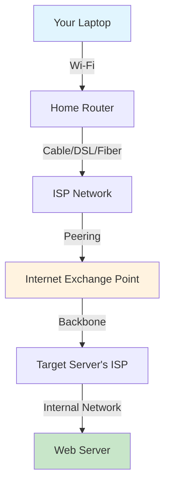
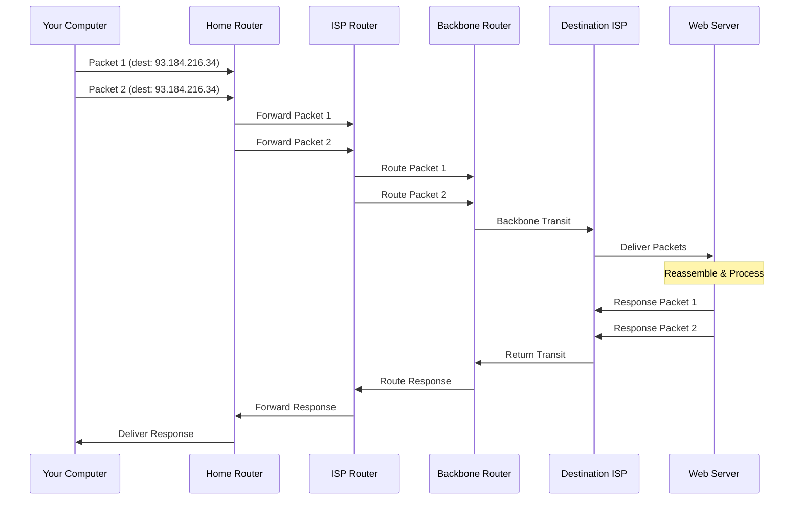

# Internet Basics

> Before you write a single line of Flask code, you must understand the network that carries your application to every user on Earth.

## Learning Objectives

After completing this chapter, you will be able to:

- Explain how the internet physically functions as a network of networks
- Describe the role of Internet Service Providers (ISPs), backbone networks, and peering agreements
- Understand packet switching and why it enables the internet's scalability
- Explain the difference between bandwidth, latency, and throughput
- Trace the physical path of a data packet from your laptop to a web server and back
- Understand why the internet is decentralized and resilient by design

## What Is the Internet?

The internet is not a cloud. It is not a place. It is not owned by any company or government. The internet is a **decentralized, global network of interconnected computer networks** that communicate using standardized protocols.

To understand the internet, imagine a postal system for digital data. When you send a letter, you write an address, attach a stamp, and drop it in a mailbox. Postal workers route your letter through sorting facilities, trucks, and airplanes until it reaches its destination. The recipient writes back, and the process reverses.

The internet works the same way — except the "letters" are **packets** of data, the "addresses" are **IP addresses**, the "postal workers" are **routers**, and the "roads" are **fiber optic cables, copper wires, radio waves, and satellite links**.

### A Network of Networks

The internet is composed of millions of private, public, academic, business, and government networks. Your home Wi-Fi network is one such network. Your Internet Service Provider (ISP) — Comcast, AT&T, Verizon, or thousands of others worldwide — operates a larger network. These networks connect to even larger **backbone networks** operated by companies like Level 3, Cogent, and NTT.

Backbone networks are the highways of the internet — high-capacity fiber optic cables that span continents and oceans. Undersea cables carry approximately 99% of international internet traffic. The backbone networks interconnect at **Internet Exchange Points (IXPs)** — physical locations where different networks exchange traffic.

This architecture — small networks connecting to medium networks connecting to large networks — is why the internet is called a **network of networks**.



## The Birth of the Internet

Understanding the internet's origins helps explain its design decisions.

### ARPANET (1969)

The internet traces its origins to **ARPANET**, a research project funded by the U.S. Department of Defense's Advanced Research Projects Agency (ARPA). The goal was to create a communication network that could survive nuclear attack — meaning no single point of failure could bring down the entire network.

The first ARPANET message was sent on October 29, 1969, from UCLA to Stanford Research Institute. The system crashed after transmitting just two letters ("LO" of "LOGIN"), but the connection was established.

### Key Design Decisions

Three principles from ARPANET still define the internet today:

1. **Decentralization**: No central authority controls the internet. Every network operates independently and connects voluntarily.

2. **Packet Switching**: Data is broken into small packets that travel independently and are reassembled at the destination. If one route is destroyed, packets find another path.

3. **Open Standards**: All protocols are publicly documented (RFCs — Request for Comments), enabling anyone to build compatible systems.

### TCP/IP Standardization (1983)

On January 1, 1983, ARPANET officially adopted **TCP/IP** as its core protocol suite. This date is considered the birthday of the modern internet. TCP/IP provided:

- **IP (Internet Protocol)**: Addressing and routing packets between networks
- **TCP (Transmission Control Protocol)**: Reliable, ordered delivery of data

Together, TCP/IP solved the problem of making different types of computers, on different networks, communicate seamlessly.

### The World Wide Web (1989)

The internet and the World Wide Web are not the same thing. The **internet** is the infrastructure — the cables, routers, and protocols that move data. The **World Wide Web** is a service that runs on top of the internet, invented by **Tim Berners-Lee** at CERN in 1989.

The Web introduced three technologies:

- **HTTP (HyperText Transfer Protocol)**: The language browsers and web servers use to communicate
- **HTML (HyperText Markup Language)**: The format for structuring web pages
- **URL (Uniform Resource Locator)**: The addressing scheme for web resources

Flask is a web framework — it helps you build applications that communicate via HTTP on the World Wide Web, which runs on the internet.

## How Data Travels: Packet Switching

When you visit a website, your computer does not send one continuous stream of data. It breaks everything into **packets**.

### What Is a Packet?

A packet is a small unit of data with three parts:

1. **Header**: Contains metadata — source IP address, destination IP address, packet sequence number, protocol information
2. **Payload**: The actual data being transmitted (a chunk of your HTTP request, an image fragment, etc.)
3. **Trailer**: Error-checking information (optional, depending on protocol)

A typical packet might carry 1,000 to 1,500 bytes of payload. A single webpage might require hundreds of packets.

### Why Packet Switching?

Before packet switching, networks used **circuit switching** — establishing a dedicated connection between sender and receiver for the entire duration of communication (like a telephone call). This was inefficient because:

- The dedicated line sat idle during pauses in communication
- If the line broke, the entire connection was lost
- Adding more users required building more physical lines

Packet switching solves these problems:

- **Efficiency**: Multiple communications share the same physical lines. Packets from different sources are interleaved.
- **Resilience**: If a router fails, packets are automatically rerouted through alternative paths.
- **Scalability**: New devices can join without requiring dedicated infrastructure.

### The Journey of a Packet

When you type `https://example.com` into your browser, here is what happens at the packet level:

1. **Your computer** breaks the HTTP request into packets.
2. **Your home router** receives the packets and forwards them to your ISP.
3. **Your ISP's routers** examine the destination IP address and consult their **routing tables** — databases that map IP address ranges to outgoing network interfaces. They forward each packet to the next hop.
4. **Backbone routers** continue this process, moving packets closer to their destination across potentially dozens of intermediate routers.
5. **The destination server's ISP** receives the packets and routes them to the specific server.
6. **The server** reassembles the packets, processes your HTTP request, and sends a response back using the same process.



Each router makes an independent decision about where to send each packet. Packets from the same message may take different routes. This is why packet switching is both resilient and unpredictable.

## Bandwidth, Latency, and Throughput

Three metrics describe network performance. Understanding their differences is essential for building responsive web applications.

### Bandwidth

**Bandwidth** is the maximum amount of data that can be transmitted over a connection in a given time, measured in bits per second (bps). Think of bandwidth as the width of a highway — a wider highway can carry more cars simultaneously.

- Home internet: 25 Mbps to 1 Gbps
- Mobile 4G: 5-100 Mbps
- Backbone fiber: 100 Gbps to 1 Tbps per strand
- Undersea cables: 100+ Tbps total capacity

Bandwidth is a theoretical maximum. You rarely achieve full bandwidth due to network congestion, protocol overhead, and other factors.

### Latency

**Latency** is the time it takes for a single packet to travel from source to destination, measured in milliseconds (ms). Think of latency as the speed limit on the highway — even a wide highway doesn't help if the speed limit is very low.

- Same city: < 5 ms
- Same country: 10-50 ms
- Same continent: 30-100 ms
- Transatlantic: 60-80 ms (limited by speed of light through fiber)
- Satellite: 500-700 ms

Latency is crucial for web applications because it affects the time before any data starts arriving. Even with infinite bandwidth, a request to a server on another continent cannot respond faster than ~60ms due to the speed of light.

### Throughput

**Throughput** is the actual amount of data successfully transferred per unit of time. This is what users experience. Throughput is always less than or equal to bandwidth and is affected by latency, packet loss, and congestion.

### The Bandwidth-Latency Product

The product of bandwidth and latency tells you how much data can be "in flight" on a network at once. For a 1 Gbps connection with 100ms latency:

```
Bandwidth × Latency = 1,000,000,000 bits/s × 0.1s = 100,000,000 bits = 12.5 MB
```

This means 12.5 MB of data can be in transit before the sender must wait for acknowledgment. This is why high-bandwidth, high-latency connections (like satellite internet) require large buffers to achieve good throughput.

## Internet Infrastructure

### Physical Layer

The internet runs on physical infrastructure:

**Fiber Optic Cables**: Thin glass strands that transmit data as pulses of light. A single fiber can carry terabits per second. Undersea cables — some as thin as a garden hose — carry 99% of international traffic. The longest, the SEA-ME-WE 3, stretches 39,000 km from Germany to Australia and South Korea.

**Copper Cables**: Traditional telephone and cable TV lines. DSL and cable internet use copper for the "last mile" from the ISP to your home. Copper has limited bandwidth and suffers from signal degradation over distance.

**Radio Waves**: Wi-Fi uses 2.4 GHz and 5 GHz radio frequencies. Cellular networks use licensed spectrum. Satellite internet uses geostationary or low-earth orbit satellites.

### Routers and Switches

**Routers** are specialized computers that forward packets between networks. They maintain routing tables — databases that map IP address prefixes to outgoing interfaces. When a packet arrives, the router looks up the destination IP, finds the best matching prefix, and forwards the packet accordingly.

Core internet routers handle millions of packets per second and make routing decisions in microseconds. They run specialized operating systems (like Cisco IOS or JunOS) and use protocols like **BGP (Border Gateway Protocol)** to exchange routing information with other routers.

**Switches** operate at a lower level, forwarding data within a single network based on MAC addresses rather than IP addresses. Your home router is actually a combination of a router, switch, wireless access point, and modem.

### Internet Exchange Points (IXPs)

IXPs are physical infrastructure where different networks connect to exchange traffic. There are over 1,000 IXPs worldwide. The largest, DE-CIX in Frankfurt, Germany, handles peak traffic exceeding 10 Tbps.

Peering at IXPs reduces costs for ISPs by allowing them to exchange traffic directly rather than paying a third-party transit provider. It also reduces latency by keeping traffic local rather than routing it through distant backbone networks.

## The Role of ISPs

Internet Service Providers form a hierarchy:

**Tier 1 ISPs** own physical infrastructure (fiber, routers) and can reach every other network on the internet without paying for transit. Examples: AT&T, Verizon, Level 3 (now Lumen), NTT, Orange. They peer with each other at no cost.

**Tier 2 ISPs** peer with some networks but must purchase transit from Tier 1 ISPs to reach the entire internet. Most regional and national ISPs fall into this category.

**Tier 3 ISPs** purchase all their internet transit from other providers. Your local cable company or small ISP is typically a Tier 3.

When you visit a website, your request may traverse multiple ISP networks, each exchanging traffic through peering agreements or paid transit arrangements.

## Internet Governance

The internet has no single governing body. Instead, multiple organizations manage different aspects:

- **ICANN** (Internet Corporation for Assigned Names and Numbers): Manages domain names and IP address allocation
- **IETF** (Internet Engineering Task Force): Develops internet standards and protocols (produces RFCs)
- **ISOC** (Internet Society): Promotes internet access and standards
- **Regional Internet Registries** (ARIN, RIPE, APNIC, LACNIC, AFRINIC): Allocate IP addresses to ISPs in their regions

This distributed governance model reflects the internet's decentralized design. No government or corporation controls the internet, though individual countries can regulate internet access within their borders.

## Why This Matters for Flask Developers

Understanding the internet's physical and logical structure matters for practical web development:

**Latency affects user experience**: A Flask application hosted in New York will feel sluggish to users in Tokyo (~200ms round-trip time). For global applications, consider Content Delivery Networks (CDNs) or multiple deployment regions.

**Bandwidth affects payload size**: Large images, uncompressed JSON responses, and unoptimized assets consume bandwidth. A mobile user on a slow connection will abandon a page that takes too long to load. Flask's `send_file()`, response compression, and static file optimization matter.

**Packet loss affects reliability**: The internet drops packets. TCP handles retransmission, but your Flask application should handle interrupted connections gracefully. Implement proper error handling and avoid long-running requests that might timeout.

**The internet is untrusted**: Packets pass through dozens of routers and networks owned by different entities. Never transmit sensitive data without encryption (HTTPS/TLS). Flask's `SESSION_COOKIE_SECURE` and `SESSION_COOKIE_HTTPONLY` settings exist for this reason.

**The internet is stateless**: Each HTTP request is independent. The internet does not remember your previous request. Session management (cookies, server-side sessions) exists precisely because the underlying infrastructure has no memory of past interactions.

## Common Mistakes

**Mistake: Confusing the internet with the World Wide Web**
The internet is the infrastructure. The Web is a service running on it. Email, FTP, SSH, and many other services also use the internet.

**Mistake: Assuming the internet is a cloud**
Data travels through physical cables, routers, and data centers. Understanding this helps debug latency issues and make deployment decisions.

**Mistake: Thinking the internet is controlled by a single entity**
The internet's decentralization is its greatest strength. No single point of failure can bring down the entire network.

## Best Practices

- Always consider latency when choosing hosting locations for your Flask application
- Minimize payload sizes — compress responses, optimize images, use efficient serialization
- Design for network failures — implement retries, timeouts, and graceful degradation
- Use HTTPS for all production traffic — the internet is not a trusted network
- Test your application on slow connections (Chrome DevTools can simulate this)

## Performance Notes

| Factor | Impact on Flask Apps |
|--------|---------------------|
| High Latency | Use AJAX/fetch for progressive loading; minimize round trips |
| Low Bandwidth | Compress responses; optimize static assets; use pagination |
| Packet Loss | Implement request timeouts; use idempotent operations |
| Network Congestion | Cache responses; use CDNs for static content |

## Security Notes

- The internet is a hostile environment — every packet passes through untrusted infrastructure
- Unencrypted HTTP traffic can be intercepted and modified by any router along the path
- DNS queries (which translate domain names to IP addresses) are often unencrypted by default
- Always use HTTPS in production — Flask's development server does not support HTTPS; use a production WSGI server behind a reverse proxy

## Exercises

1. **Trace a Route**: Open a terminal and run `traceroute google.com` (Linux/Mac) or `tracert google.com` (Windows). Count how many hops your packets take to reach Google's servers.

2. **Measure Latency**: Use `ping google.com` to measure round-trip time to Google's servers. Then try pinging servers in different countries (e.g., `ping sydney.edu.au` for Australia). Calculate the approximate distance based on the speed of light.

3. **Research Undersea Cables**: Look up a submarine cable map online. Find the cable that carries traffic between your continent and Europe. How many fiber pairs does it have? What is its total capacity?

4. **Bandwidth Calculation**: If a Flask application returns a 2MB JSON response, and a user has a 10 Mbps connection, what is the minimum possible download time (ignoring latency)? What about on a 1 Mbps connection?

## Quiz

**Question 1**: What is the fundamental difference between circuit switching and packet switching?

**Question 2**: Why does a high-bandwidth, high-latency connection (like satellite internet) still feel slow for interactive web browsing?

**Question 3**: What percentage of international internet traffic travels through undersea cables rather than satellites?

**Question 4**: Name the three technologies Tim Berners-Lee invented that created the World Wide Web.

**Question 5**: What is the role of a router in the internet?

## Interview Questions

1. "Explain what happens when you type a URL into a browser and press Enter." (This is the most common networking interview question — you should be able to answer it for 10+ minutes, covering DNS, TCP, HTTP, and the full request lifecycle.)

2. "Why is the internet designed to be decentralized? What are the advantages and disadvantages?"

3. "How does packet switching contribute to the internet's resilience?"

4. "Explain the difference between bandwidth and latency. Why does a connection with high bandwidth but high latency feel slow for some applications?"

5. "What are the security implications of data traveling through untrusted networks?"

## Related Chapters

- Next: [[00-Foundations/Browser]] — How web browsers work
- [[00-Foundations/DNS]] — How domain names resolve to IP addresses
- [[00-Foundations/IP-Addresses]] — Internet Protocol addressing
- [[00-Foundations/TCP-UDP]] — How data is transported reliably
- [[00-Foundations/HTTP]] — The protocol that Flask speaks

## Official Documentation References

- [IETF RFC 791 - Internet Protocol](https://datatracker.ietf.org/doc/html/rfc791)
- [IETF RFC 1122 - Requirements for Internet Hosts](https://datatracker.ietf.org/doc/html/rfc1122)
- [ICANN - How the Internet Works](https://www.icann.org/resources/pages/how-the-internet-works-2012-02-25-en)
- [Submarine Cable Map](https://www.submarinecablemap.com/)
- [Internet Society - Internet History](https://www.internetsociety.org/internet/history-internet/)

---

*Next: [[00-Foundations/Browser]]*