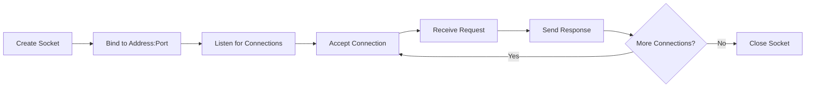

# Ports

> An IP address identifies a device. A port identifies a specific service on that device. Together, they form the complete address for network communication.

## Learning Objectives

After completing this chapter, you will be able to:

- Explain what port numbers are and why they are necessary
- Identify well-known ports for common services (HTTP, HTTPS, SSH, DNS, etc.)
- Distinguish between TCP and UDP port usage
- Understand the port range categories (well-known, registered, dynamic/private)
- Use the `netstat` and `lsof` commands to inspect port usage
- Configure Flask to run on different ports
- Diagnose "port already in use" errors

## Why Ports Exist

An IP address identifies a specific device on a network. But a typical server runs multiple network services simultaneously:

- A web server (HTTP/HTTPS)
- An SSH server for remote administration
- An FTP server for file transfers
- A DNS server for name resolution
- A database server (PostgreSQL, MySQL)
- An email server (SMTP, IMAP)

If all services listened on the same IP address with no further differentiation, the operating system would have no way to know which service should receive an incoming packet.

**Ports** solve this by adding a 16-bit number to the IP address, creating a complete socket address:

```
IP Address + Port Number = Socket Address
192.168.1.10 : 5000
```

This allows up to **65,536** (2^16) different services on a single device.

## The 16-Bit Port Number

Port numbers range from **0 to 65535**. They are divided into three ranges:

### Well-Known Ports (0–1023)

Assigned by IANA for standard, universally recognized services. These ports typically require administrative/root privileges to bind on Unix-like systems.

| Port | Protocol | Service |
|------|----------|---------|
| 20/21 | TCP | FTP (File Transfer Protocol) |
| 22 | TCP | SSH (Secure Shell) |
| 25 | TCP | SMTP (Simple Mail Transfer Protocol) |
| 53 | UDP/TCP | DNS (Domain Name System) |
| 80 | TCP | HTTP (HyperText Transfer Protocol) |
| 110 | TCP | POP3 (Post Office Protocol) |
| 143 | TCP | IMAP (Internet Message Access Protocol) |
| 443 | TCP | HTTPS (HTTP Secure) |
| 3306 | TCP | MySQL |
| 5432 | TCP | PostgreSQL |

When you type `http://example.com` in your browser, it connects to port 80. When you type `https://example.com`, it connects to port 443. These defaults are so universal that browsers automatically append them.

### Registered Ports (1024–49151)

Registered with IANA for specific applications but do not require root privileges. Many applications and frameworks use ports in this range.

| Port | Application |
|------|-------------|
| 3000 | Node.js/Express (common convention) |
| 3306 | MySQL |
| 5000 | Flask development server (default) |
| 5432 | PostgreSQL |
| 8000 | Django development server (default) |
| 8080 | Alternative HTTP (common for proxies) |
| 27017 | MongoDB |
| 6379 | Redis |

### Dynamic/Private/Ephemeral Ports (49152–65535)

Not assigned to any service. Used by client applications for outbound connections. When your browser connects to a web server, the operating system picks an ephemeral port from this range as the source port.

For example, when you visit `https://google.com`:
- Destination: `142.250.80.46:443`
- Source: `192.168.1.50:54321` (ephemeral port chosen by OS)

## Sockets: The Programming Interface

A **socket** is the endpoint of a network communication channel. In Python and most programming languages, you interact with network services through sockets.

### Socket Address Structure

```
Family: AF_INET (IPv4) or AF_INET6 (IPv6)
Address: IP address (or hostname)
Port: Port number
```

### Python Socket Example

```python
import socket

# Create a TCP socket
sock = socket.socket(socket.AF_INET, socket.SOCK_STREAM)

# Connect to a web server
sock.connect(('example.com', 80))

# Send an HTTP request
request = b'GET / HTTP/1.1\r\nHost: example.com\r\n\r\n'
sock.sendall(request)

# Receive the response
response = sock.recv(4096)
print(response.decode())

# Close the connection
sock.close()
```

This is essentially what Flask (through Werkzeug) does under the hood — creates a socket, binds it to an address and port, listens for connections, and handles incoming requests.

### The Socket Lifecycle (Server)



Flask's development server follows this exact pattern, implemented in Python using the `socket` module.

## Flask and Ports

### Default Port

Flask's development server defaults to **port 5000**:

```bash
$ flask run
 * Running on http://127.0.0.1:5000
```

This port was chosen because it is in the registered range, does not conflict with well-known services, and is memorable.

### Changing the Port

You can configure Flask to use any port:

```bash
# Environment variable
export FLASK_RUN_PORT=8080
flask run

# Command line option
flask run --port=8080

# In Python
app.run(port=8080)
```

### Port Already in Use Error

The most common port-related error in Flask development:

```
OSError: [Errno 98] Address already in use
```

This means another process is already bound to the same IP and port. Common causes:

1. **Another Flask instance is running** — perhaps in another terminal
2. **A crashed Flask process did not release the port** — ports may remain in TIME_WAIT state
3. **Another application uses that port** — check with `lsof` or `netstat`

### Diagnosing Port Conflicts

**Linux/macOS:**
```bash
# Find what process is using port 5000
lsof -i :5000

# Or using netstat
netstat -tlnp | grep 5000

# Or using ss (modern replacement for netstat)
ss -tlnp | grep 5000
```

**Windows:**
```cmd
netstat -ano | findstr :5000
```

**Killing the process:**
```bash
# Kill by PID (replace 12345 with the actual PID)
kill 12345

# Or kill all Python processes (use with caution)
killall python
```

### Binding to Privileged Ports (< 1024)

On Linux and macOS, binding to ports below 1024 requires root privileges:

```bash
# This will fail for non-root users
flask run --port=80
# PermissionError: [Errno 13] Permission denied
```

This is a security feature — arbitrary users cannot start services on well-known ports and impersonate system services.

In production, the standard pattern is:
1. Run Flask (via Gunicorn) on a non-privileged port (e.g., 8000)
2. Run Nginx on port 80/443 as root
3. Nginx proxies requests to Flask

Alternatively, use `authbind` or Linux capabilities:

```bash
# Allow a specific user to bind port 80
sudo setcap 'cap_net_bind_service=+ep' /usr/bin/python3
```

## The TCP/IP Port Relationship

Ports work with both TCP and UDP. The same port number can be used for both protocols simultaneously because they are independent:

- `192.168.1.10:53` (TCP) — DNS zone transfers
- `192.168.1.10:53` (UDP) — DNS queries

These are different sockets because the protocol differs. The operating system maintains separate tables for TCP and UDP ports.

## Port Scanning

Port scanning is the act of probing a server to discover which ports are open. It is a common reconnaissance technique used by both security professionals and attackers.

The most famous port scanner is **Nmap**:

```bash
# Scan common ports on a target
nmap example.com

# Scan all 65535 ports
nmap -p- example.com

# Scan specific ports
nmap -p 22,80,443,5000,8000,8080 example.com

# Service version detection
nmap -sV example.com
```

> [!WARNING]
> Only scan servers you own or have explicit permission to test. Unauthorized port scanning may violate laws and terms of service.

### Securing Your Flask Application

1. **Do not expose the development server to the internet** — it is not secure
2. **Run behind a firewall** — only expose necessary ports (80, 443)
3. **Use a non-default port for admin interfaces** — but do not rely on this for security (security through obscurity is not security)
4. **Monitor for unauthorized port usage** — use `netstat` or `ss` regularly

## Common Mistakes

**Mistake: Running Flask dev server on port 80**
The development server is not designed for production. It is single-threaded, has poor error handling, and is not security-hardened. Use Gunicorn + Nginx.

**Mistake: Binding to `0.0.0.0:5000` on a public server**
This exposes your development server to the entire internet. Always bind to `127.0.0.1` in development unless you specifically need network access.

**Mistake: Assuming ports are secret**
Port numbers are not authentication. Simply running a service on a non-standard port provides no meaningful security. Nmap can discover all open ports in seconds.

## Best Practices

- Use the default port 5000 for Flask development
- Use ports 8000-8999 for Flask applications in production (behind Nginx on 80/443)
- Always check which ports are in use before starting a service
- Configure your firewall to only expose necessary ports
- Document which ports your application uses
- Use environment variables for port configuration

## Exercises

1. **Port Scan Yourself**: Run `nmap localhost` on your machine. What ports are open? Identify the services running on each.

2. **Find Flask's Port**: Start a Flask application and run `lsof -i :5000` (Linux/Mac) or `netstat -ano | findstr :5000` (Windows). What process information do you see?

3. **Test Port Binding**: Try to bind a simple Python socket server to port 80 without root privileges. What error do you get? Why?

4. **Multiple Services**: Write two simple Python scripts — one that listens on port 5000, another on port 5001. Verify both can run simultaneously.

5. **Ephemeral Ports**: Make several HTTP requests to different websites using Python's `requests` library. After each request, check which local port was used: `response.raw._connection.sock.getsockname()`.

## Quiz

**Question 1**: What is the difference between an IP address and a port number? Why are both needed?

**Question 2**: Name three well-known ports and their associated services.

**Question 3**: Why can't regular users bind to ports below 1024 on Unix systems?

**Question 4**: What happens when you try to run two Flask applications on the same port? How do you diagnose which process is using a port?

**Question 5**: Can TCP port 80 and UDP port 80 be used simultaneously on the same IP? Why or why not?

## Interview Questions

1. "Explain the concept of ports in networking. Why are they necessary?"

2. "Why does Flask use port 5000 by default? What considerations go into choosing a port number?"

3. "A developer tries to bind their Flask app to port 80 and gets 'Permission denied.' Why? How should they properly deploy on port 80?"

4. "How would you diagnose a 'port already in use' error in a production environment?"

5. "Explain the difference between well-known, registered, and ephemeral port ranges."

## Related Chapters

- Previous: [[00-Foundations/IP-Addresses]]
- Next: [[00-Foundations/TCP-UDP]]
- [[01-Flask-Core/Flask-CLI]] — Running Flask on different ports
- [[07-Deployment/Nginx]] — Proxy configuration and port mapping

## Official Documentation References

- [IANA Service Name and Transport Protocol Port Number Registry](https://www.iana.org/assignments/service-names-port-numbers/service-names-port-numbers.xhtml)
- [RFC 6335 - Internet Assigned Numbers Authority (IANA) Procedures for the Management of the Service Name and Transport Protocol Port Number Registry](https://datatracker.ietf.org/doc/html/rfc6335)
- [Python socket module documentation](https://docs.python.org/3/library/socket.html)

---

*Previous: [[00-Foundations/IP-Addresses]] | Next: [[00-Foundations/TCP-UDP]]*