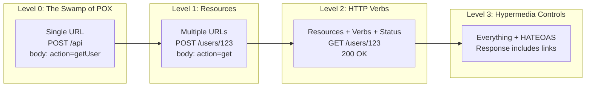

# REST APIs

> REST is not a technology, a framework, or a protocol. It is an architectural style — a set of principles for designing networked applications. Understanding REST deeply enables you to design APIs that are intuitive, scalable, and maintainable.

## Learning Objectives

After completing this chapter, you will be able to:

- Explain REST as an architectural style and its six constraints
- Design RESTful resource URLs following conventions
- Choose appropriate HTTP methods and status codes for API operations
- Implement content negotiation and versioning strategies
- Understand HATEOAS and Richardson Maturity Model
- Distinguish REST from RPC and GraphQL
- Design a complete REST API for a Flask application

## What Is REST?

**REST (Representational State Transfer)** is an architectural style for designing networked applications, introduced by **Roy Fielding** in his 2000 doctoral dissertation. Fielding was one of the principal authors of the HTTP specification, and REST was his vision for how the web's existing architecture could be used to build scalable distributed systems.

REST is not:
- A protocol (like HTTP or TCP)
- A standard (like ISO or IEEE)
- A technology (like SOAP or GraphQL)
- A framework (like Flask or Django)

REST is a **set of constraints** that, when applied to an architecture, create desirable properties: scalability, simplicity, modifiability, visibility, portability, and reliability.

### The Six Constraints of REST

#### 1. Client-Server Architecture

The client and server are separate concerns. The client handles the user interface and user experience; the server handles data storage and business logic. They communicate through a uniform interface.

This separation allows each to evolve independently. You can change your Flask backend without touching your JavaScript frontend, and vice versa.

#### 2. Statelessness

Each request from client to server must contain all information necessary to understand and process the request. The server stores no client context between requests.

Session state is kept entirely on the client (in cookies, localStorage, or application memory). The server is stateless — any server can handle any request from any client.

> [!TIP]
> Statelessness makes REST APIs horizontally scalable. You can add more servers behind a load balancer without worrying about session affinity (sticky sessions). Any request can go to any server.

#### 3. Cacheability

Responses must explicitly define themselves as cacheable or not. Cacheable responses allow clients (and intermediaries) to reuse them for equivalent requests, reducing server load and latency.

Use `Cache-Control`, `ETag`, and `Last-Modified` headers to control caching behavior.

#### 4. Uniform Interface

All resources are accessed through a uniform, standardized interface. This constraint has four sub-constraints:

**a. Resource Identification**: Resources are identified by URLs. A user resource might be `/users/123`, a post resource `/posts/456`.

**b. Resource Manipulation Through Representations**: Clients manipulate resources by sending representations (JSON, XML) to the server. The server updates the resource based on the representation.

**c. Self-Descriptive Messages**: Each request and response contains enough information to be understood in isolation. Headers describe the message format, caching behavior, and authentication.

**d. HATEOAS (Hypermedia As The Engine Of Application State)**: Responses include links to related resources and possible actions. A response for a user might include links to their posts, settings, and logout action.

#### 5. Layered System

A client cannot ordinarily tell whether it is connected directly to the end server or to an intermediary along the way. Intermediary servers (load balancers, caches, proxies) can be inserted transparently to improve scalability, security, or performance.

Your Flask application likely sits behind Nginx, which may sit behind a CDN like Cloudflare. The client sees only the outermost layer.

#### 6. Code on Demand (Optional)

Servers can temporarily extend or customize client functionality by transferring executable code (JavaScript). This is the only optional constraint. Most REST APIs do not use it.

## RESTful Resource Design

REST centers on **resources** — nouns, not verbs. A resource is any information that can be named: a user, a blog post, a product, an order.

### URL Design

Use nouns for resources, HTTP methods for actions:

| Action | HTTP Method | URL | Description |
|--------|-------------|-----|-------------|
| List all users | GET | `/users` | Collection endpoint |
| Create a user | POST | `/users` | Create in collection |
| Get one user | GET | `/users/123` | Resource endpoint |
| Update a user | PUT | `/users/123` | Full replacement |
| Partial update | PATCH | `/users/123` | Partial modification |
| Delete a user | DELETE | `/users/123` | Remove resource |

**Incorrect (RPC-style):**
```
GET /getUsers
GET /getUser?id=123
POST /createUser
POST /updateUser
POST /deleteUser?id=123
```

**Correct (RESTful):**
```
GET /users
GET /users/123
POST /users
PATCH /users/123
DELETE /users/123
```

### Nested Resources

Use nesting to represent relationships:

```
GET /users/123/posts           # All posts by user 123
GET /users/123/posts/456       # Post 456 by user 123
POST /users/123/posts          # Create a post for user 123
```

Avoid deep nesting (more than 2-3 levels). For complex relationships, use query parameters or flatten the hierarchy:

```
# Too deep
GET /users/123/posts/456/comments/789

# Better
GET /comments/789
GET /posts/456/comments?author=123
```

### Query Parameters

Use query parameters for filtering, sorting, pagination, and searching:

```
GET /users?role=admin&status=active
GET /users?sort=-created_at        # Descending
GET /users?page=2&limit=50
GET /posts?search=flask+tutorial
GET /products?category=electronics&price_min=100&price_max=500
```

## REST Response Design

### Success Responses

```json
{
    "id": 123,
    "name": "John Doe",
    "email": "john@example.com",
    "created_at": "2024-01-15T10:30:00Z",
    "links": {
        "self": "/users/123",
        "posts": "/users/123/posts",
        "settings": "/users/123/settings"
    }
}
```

### Error Responses

Use consistent error formats:

```json
{
    "error": {
        "code": "VALIDATION_ERROR",
        "message": "The request failed validation",
        "details": [
            {"field": "email", "message": "Invalid email format"},
            {"field": "age", "message": "Must be at least 18"}
        ]
    }
}
```

### Collection Responses

```json
{
    "data": [
        {"id": 1, "name": "Alice"},
        {"id": 2, "name": "Bob"}
    ],
    "meta": {
        "page": 1,
        "per_page": 20,
        "total": 150,
        "total_pages": 8
    },
    "links": {
        "self": "/users?page=1",
        "next": "/users?page=2",
        "last": "/users?page=8"
    }
}
```

## Richardson Maturity Model

The Richardson Maturity Model classifies REST APIs into four levels:



**Level 0**: Using HTTP as a transport for RPC. One URL, everything in the request body.

**Level 1**: Multiple URLs (resources) but typically only POST.

**Level 2**: Resources + HTTP methods + proper status codes. This is where most "REST" APIs operate.

**Level 3**: HATEOAS — responses include links to related resources and actions. True REST according to Fielding, but rarely implemented in practice.

Most production APIs aim for Level 2, which provides most of REST's benefits without the complexity of HATEOAS.

## API Versioning

APIs evolve. Versioning prevents breaking existing clients:

### URL Versioning (Most Common)

```
/api/v1/users
/api/v2/users
```

Simple, explicit, cache-friendly. The version is part of the resource identifier.

### Header Versioning

```http
Accept: application/vnd.api.v2+json
API-Version: 2
```

Cleaner URLs but requires custom headers. Less discoverable.

### Parameter Versioning

```
/api/users?version=2
```

Simple but pollies the query string. Can be cached incorrectly.

**Recommendation**: Use URL versioning for its simplicity and visibility.

## REST vs. RPC vs. GraphQL

| Aspect | REST | RPC | GraphQL |
|--------|------|-----|---------|
| Style | Resource-oriented | Action-oriented | Query-oriented |
| URL structure | Noun-based (`/users/123`) | Verb-based (`/getUser`) | Single endpoint (`/graphql`) |
| Data fetching | Multiple endpoints | Multiple endpoints | Single request |
| Over-fetching | Common | Common | Eliminated |
| Under-fetching | Common (N+1 problem) | Common | Eliminated |
| Caching | HTTP caching works well | HTTP caching works well | Requires custom caching |
| Complexity | Medium | Low | High |

**When to use REST:**
- Public APIs with diverse clients
- When HTTP caching is important
- When you want simple, discoverable URLs
- When your data model maps naturally to resources

**When to use GraphQL:**
- Mobile apps with limited bandwidth
- Complex UIs that need data from many resources
- When clients have diverse data requirements
- When over-fetching/under-fetching is a significant problem

## REST in Flask

```python
from flask import Flask, jsonify, request, abort
from functools import wraps

app = Flask(__name__)

# In-memory store (use a database in production)
users = {}
next_id = 1

# Error handler
@app.errorhandler(404)
def not_found(error):
    return jsonify({'error': 'Resource not found'}), 404

# GET /users
@app.get('/api/v1/users')
def list_users():
    page = request.args.get('page', 1, type=int)
    per_page = request.args.get('per_page', 20, type=int)
    user_list = list(users.values())
    total = len(user_list)
    start = (page - 1) * per_page
    end = start + per_page
    
    return jsonify({
        'data': user_list[start:end],
        'meta': {
            'page': page,
            'per_page': per_page,
            'total': total,
            'total_pages': (total + per_page - 1) // per_page
        }
    })

# GET /users/<id>
@app.get('/api/v1/users/<int:user_id>')
def get_user(user_id):
    user = users.get(user_id)
    if not user:
        abort(404)
    return jsonify(user)

# POST /users
@app.post('/api/v1/users')
def create_user():
    global next_id
    data = request.get_json()
    
    if not data or 'name' not in data:
        return jsonify({'error': 'Name is required'}), 422
    
    user = {
        'id': next_id,
        'name': data['name'],
        'email': data.get('email'),
        'created_at': datetime.now(UTC).isoformat()
    }
    users[next_id] = user
    next_id += 1
    
    return jsonify(user), 201, {'Location': f'/api/v1/users/{user["id"]}'}

# PATCH /users/<id>
@app.patch('/api/v1/users/<int:user_id>')
def update_user(user_id):
    user = users.get(user_id)
    if not user:
        abort(404)
    
    data = request.get_json()
    if 'name' in data:
        user['name'] = data['name']
    if 'email' in data:
        user['email'] = data['email']
    
    return jsonify(user)

# DELETE /users/<id>
@app.delete('/api/v1/users/<int:user_id>')
def delete_user(user_id):
    if user_id not in users:
        abort(404)
    del users[user_id]
    return '', 204
```

## Common Mistakes

**Mistake: Using verbs in URLs**
`/getUsers`, `/createPost` — use nouns and HTTP methods instead.

**Mistake: Inconsistent pluralization**
Mixing `/user/123` and `/users/456` — be consistent. Use plural nouns: `/users`, `/posts`.

**Mistake: Wrong status codes**
Returning 200 for errors, 500 for validation failures — use the correct semantic code.

**Mistake: Not versioning the API**
Changing an endpoint's behavior breaks existing clients. Version from day one.

## Best Practices

- Use nouns, not verbs, in URLs
- Use plural resource names consistently
- Return proper HTTP status codes
- Support filtering, sorting, and pagination on collection endpoints
- Version your API from the start
- Use consistent error response formats
- Include `Location` headers on 201 Created responses
- Document your API with OpenAPI/Swagger

## Exercises

1. **Design an API**: Design a REST API for a blog platform (users, posts, comments, categories). Write the URL structure, methods, and status codes for all endpoints.

2. **Implement CRUD**: Build the complete CRUD API from the Flask example above. Test it with curl or httpie.

3. **Add Filtering**: Extend the `list_users` endpoint to support filtering by name (partial match) and email domain.

4. **Error Handling**: Create a consistent error handling pattern that returns structured JSON for all 4xx and 5xx errors.

## Quiz

**Question 1**: What are the six constraints of REST? Which is optional?

**Question 2**: Why is REST's statelessness constraint important for scalability?

**Question 3**: What is the difference between PUT and PATCH in REST?

**Question 4**: What is HATEOAS, and why is it rarely implemented?

**Question 5**: Explain the Richardson Maturity Model. What level do most production APIs achieve?

## Interview Questions

1. "What is REST? How does it differ from RPC?"

2. "Design a REST API for an e-commerce platform. What are the resources, URLs, and methods?"

3. "Explain the six REST constraints. Which is most important for scalability?"

4. "How would you version a REST API? What are the trade-offs?"

5. "When would you choose REST over GraphQL? When would you choose GraphQL?"

6. "What is idempotency? Which HTTP methods are idempotent, and why does it matter?"

## Related Chapters

- Previous: [[00-Foundations/Cookies-Sessions]]
- Next: [[00-Foundations/JSON]]
- [[10-Advanced/REST-API-Development]] — Advanced REST API patterns
- [[10-Advanced/JWT-Authentication]] — Token-based API authentication

## Official Documentation References

- [Roy Fielding's Dissertation - Architectural Styles and the Design of Network-based Software Architectures](https://www.ics.uci.edu/~fielding/pubs/dissertation/rest_arch_style.htm)
- [RFC 7231 - HTTP/1.1 Semantics and Content](https://datatracker.ietf.org/doc/html/rfc7231)
- [Microsoft REST API Guidelines](https://github.com/microsoft/api-guidelines)
- [Google API Design Guide](https://cloud.google.com/apis/design)
- [Zalando RESTful API Guidelines](https://opensource.zalando.com/restful-api-guidelines/)

---

*Previous: [[00-Foundations/Cookies-Sessions]] | Next: [[00-Foundations/JSON]]*