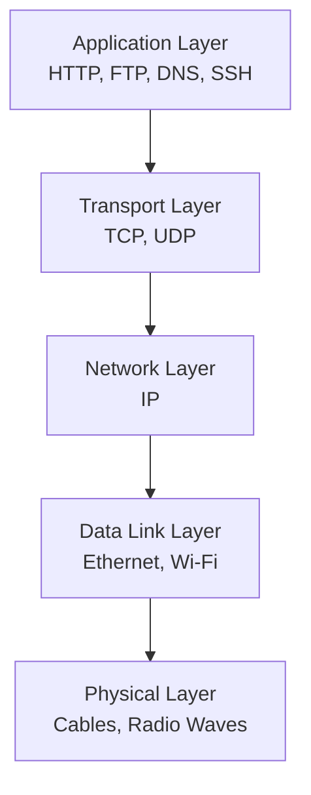
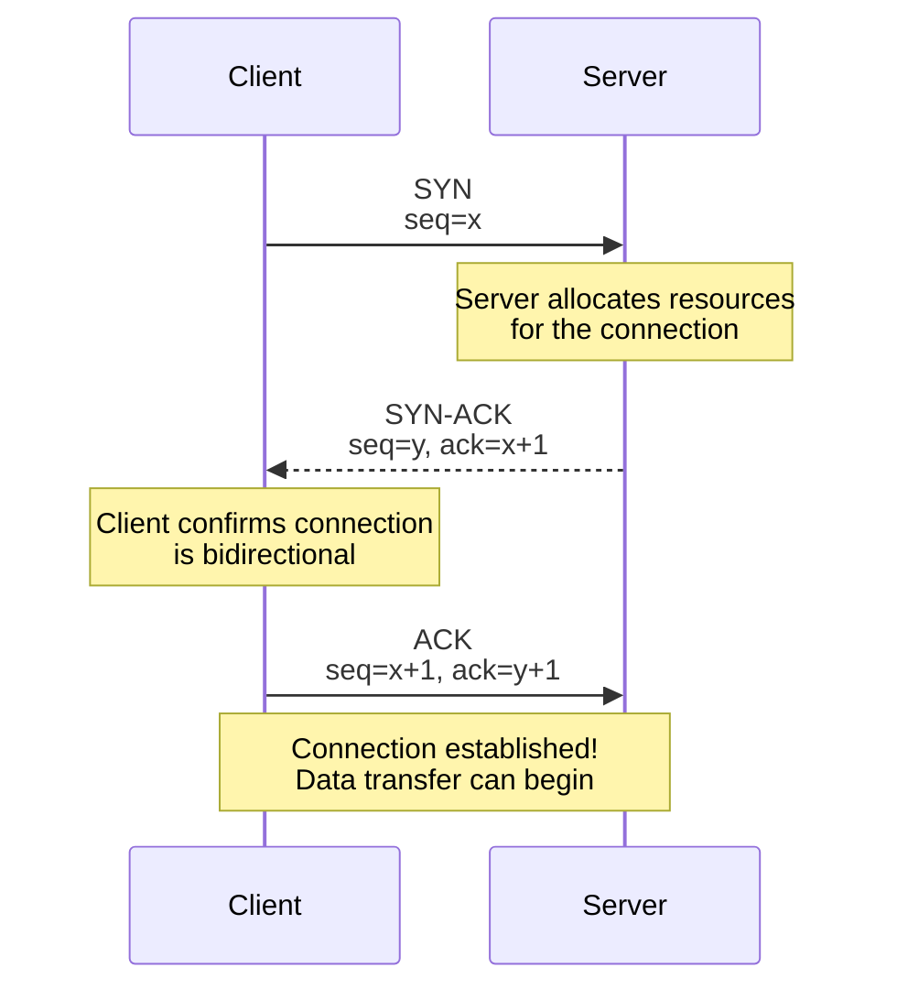
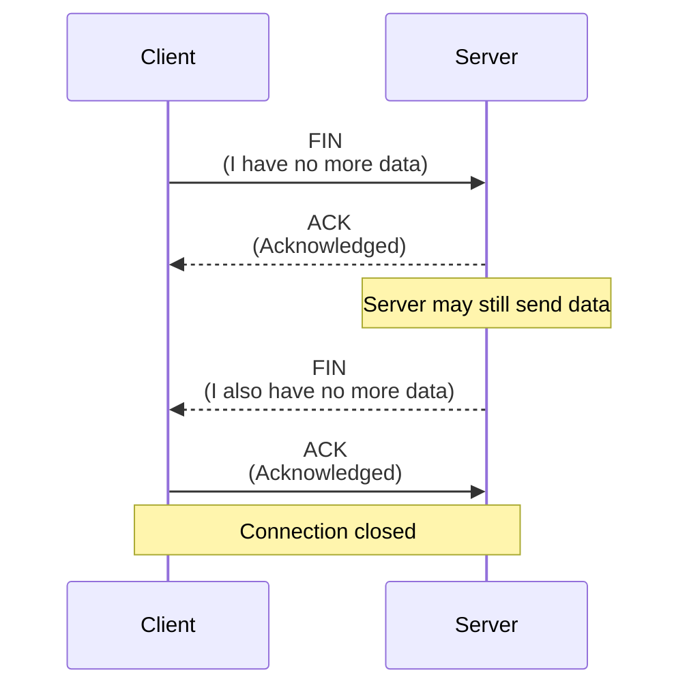
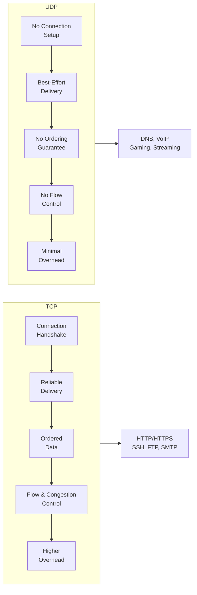

# TCP and UDP

> TCP and UDP are the two transport protocols of the internet. Every web page, every API call, every video stream — all of it travels via one of these two protocols. Choosing the right one and understanding their behavior is essential for building responsive Flask applications.

## Learning Objectives

After completing this chapter, you will be able to:

- Explain the fundamental differences between TCP and UDP
- Describe TCP's three-way handshake, reliable delivery, and flow control
- Understand UDP's connectionless nature and when it is appropriate
- Explain TCP ports, sockets, and the client-server model
- Describe TCP connection termination (four-way handshake)
- Choose between TCP and UDP for different application scenarios
- Understand how TCP affects Flask application performance

## The Transport Layer

TCP and UDP operate at the **transport layer** (Layer 4) of the OSI model. Their job is to move data between applications on different devices.



The transport layer receives data from applications, segments it into packets, and hands it to the network layer (IP) for delivery. On the receiving end, it reassembles packets and delivers them to the correct application.

**The key question**: Should the transport layer guarantee delivery, or should it prioritize speed?

TCP chooses **reliability**. UDP chooses **speed**.

## TCP: Transmission Control Protocol

TCP is the workhorse of the internet. HTTP, HTTPS, SSH, FTP, SMTP — nearly all application protocols use TCP because they require reliable, ordered data delivery.

### Key Characteristics

| Feature | TCP |
|---------|-----|
| Connection | Connection-oriented (requires handshake) |
| Reliability | Guaranteed delivery with acknowledgments |
| Ordering | Packets arrive in order |
| Flow Control | Prevents overwhelming the receiver |
| Congestion Control | Adapts to network conditions |
| Overhead | Higher (headers, handshakes, acknowledgments) |
| Use Case | Web pages, file transfers, email, APIs |

### The TCP Header

Every TCP segment carries a header (20-60 bytes) containing control information:

```
 0                   1                   2                   3
 0 1 2 3 4 5 6 7 8 9 0 1 2 3 4 5 6 7 8 9 0 1 2 3 4 5 6 7 8 9 0 1
+-+-+-+-+-+-+-+-+-+-+-+-+-+-+-+-+-+-+-+-+-+-+-+-+-+-+-+-+-+-+-+-+
|          Source Port          |       Destination Port        |
+-+-+-+-+-+-+-+-+-+-+-+-+-+-+-+-+-+-+-+-+-+-+-+-+-+-+-+-+-+-+-+-+
|                        Sequence Number                        |
+-+-+-+-+-+-+-+-+-+-+-+-+-+-+-+-+-+-+-+-+-+-+-+-+-+-+-+-+-+-+-+-+
|                    Acknowledgment Number                      |
+-+-+-+-+-+-+-+-+-+-+-+-+-+-+-+-+-+-+-+-+-+-+-+-+-+-+-+-+-+-+-+-+
|  Data |           |U|A|P|R|S|F|                               |
| Offset| Reserved  |R|C|S|S|Y|I|            Window             |
|       |           |G|K|H|T|N|N|                               |
+-+-+-+-+-+-+-+-+-+-+-+-+-+-+-+-+-+-+-+-+-+-+-+-+-+-+-+-+-+-+-+-+
|           Checksum            |         Urgent Pointer        |
+-+-+-+-+-+-+-+-+-+-+-+-+-+-+-+-+-+-+-+-+-+-+-+-+-+-+-+-+-+-+-+-+
```

Key fields:
- **Source/Destination Port**: Identifies the sending and receiving applications
- **Sequence Number**: Identifies the position of this segment's data in the overall stream
- **Acknowledgment Number**: The next sequence number expected from the other side
- **Flags**: Control bits (SYN, ACK, FIN, RST, PSH, URG)
- **Window Size**: Available buffer space for flow control

### The Three-Way Handshake

Before TCP sends any data, it establishes a connection through a **three-way handshake**:



**Step 1 — SYN**: The client sends a SYN (synchronize) segment with a random initial sequence number (ISN). This says "I want to connect and start counting data from this number."

**Step 2 — SYN-ACK**: The server responds with its own SYN (containing its own ISN) and an ACK acknowledging the client's SYN. This says "I received your request, here is my starting sequence number."

**Step 3 — ACK**: The client acknowledges the server's SYN. The connection is now established.

This handshake adds **one round-trip time (RTT)** of latency before any data can be sent. For a server in another continent (100ms RTT), this means 100ms of delay before the HTTP request can even be transmitted.

> [!TIP]
> HTTP/2 and HTTP/3 reduce this overhead through connection reuse and 0-RTT handshakes. But the underlying TCP connection still requires the three-way handshake the first time.

### Reliable Delivery

TCP guarantees that all data arrives completely and in order:

1. **Sequence numbers** track the order of data segments
2. **Acknowledgments (ACKs)** confirm received data — the sender retransmits if an ACK is not received within a timeout
3. **Checksums** detect data corruption — corrupted segments are discarded and retransmitted
4. **Duplicate detection** handles delayed or retransmitted segments

This reliability comes at a cost: every packet must be acknowledged, and lost packets trigger retransmissions that add latency.

### Flow Control

Flow control prevents a fast sender from overwhelming a slow receiver. Each TCP header includes a **window size** — the amount of buffer space the receiver has available.

The sender tracks this window and never sends more unacknowledged data than the receiver can buffer. As the receiver processes data, it sends ACKs with updated window sizes, allowing the sender to continue.

### Congestion Control

Congestion control prevents senders from overwhelming the network itself. TCP monitors the network by tracking:

- **Round-trip time (RTT)**: How long acknowledgments take
- **Packet loss**: Missing ACKs indicate congestion

When congestion is detected, TCP reduces its sending rate. When the network seems clear, it gradually increases the rate. This algorithm (various versions exist: Tahoe, Reno, CUBIC, BBR) ensures the internet does not collapse under load.

### Connection Termination

TCP connections are closed with a **four-way handshake**:



Either side can initiate closure. After closing, the connection enters **TIME_WAIT** state (typically 2-4 minutes) to handle any delayed packets. This is why you may see "port already in use" errors shortly after stopping a Flask server — the port is still in TIME_WAIT.

## UDP: User Datagram Protocol

UDP is TCP's lightweight alternative. It provides minimal functionality — just port multiplexing and a checksum — with no guarantees.

### Key Characteristics

| Feature | UDP |
|---------|-----|
| Connection | Connectionless (no handshake) |
| Reliability | No guarantees — packets may be lost, duplicated, or arrive out of order |
| Ordering | No ordering guarantees |
| Flow Control | None |
| Congestion Control | None |
| Overhead | Minimal (8-byte header) |
| Use Case | DNS queries, video streaming, online gaming, VoIP, real-time data |

### The UDP Header

UDP's header is remarkably simple — just 8 bytes:

```
 0      7 8     15 16    23 24    31
+--------+--------+--------+--------+
|     Source Port     |   Dest Port   |
+--------+--------+--------+--------+
|     Length          |    Checksum   |
+--------+--------+--------+--------+
```

No sequence numbers, no acknowledgments, no connection state. UDP is often described as a "thin wrapper around IP."

### When to Use UDP

UDP is the right choice when:

- **Speed matters more than reliability**: Live video streaming — a dropped frame is better than delayed playback
- **Application handles reliability**: DNS retransmits queries at the application level if no response arrives
- **Small, single-packet messages**: DNS queries typically fit in one UDP packet
- **Broadcast/multicast**: UDP supports sending to multiple recipients simultaneously
- **Connection overhead is unacceptable**: Online games send frequent small updates — TCP handshakes would add unacceptable latency

### QUIC and HTTP/3

**QUIC** is a modern transport protocol built on top of UDP. It provides TCP-like reliability and security (TLS is built in) without TCP's head-of-line blocking problem. **HTTP/3** uses QUIC instead of TCP.

By building on UDP, QUIC can be implemented in user space (not requiring OS kernel changes) and avoids TCP's legacy baggage.

## TCP vs. UDP Comparison



| Aspect | TCP | UDP | Winner |
|--------|-----|-----|--------|
| Connection setup | 1 RTT handshake | None | UDP |
| Data delivery | Guaranteed | Best-effort | TCP |
| Order preservation | Yes | No | TCP |
| Latency | Higher (retransmissions) | Lower | UDP |
| Overhead per packet | 20+ bytes | 8 bytes | UDP |
| Throughput | Moderate (congestion control) | Maximum | UDP |
| Complexity | Higher | Lower | UDP |
| Firewall/NAT traversal | Easy | Harder | TCP |

## TCP and Flask

Flask uses HTTP, which runs on TCP. Understanding TCP helps you build better Flask applications:

### Connection Overhead

Each HTTP request requires a TCP connection (or reuses an existing one with HTTP keep-alive). The three-way handshake adds latency:

| Scenario | Latency |
|----------|---------|
| New TCP connection + HTTP request | 2 RTT (1 for handshake, 1 for request/response) |
| Reused connection (keep-alive) | 1 RTT |
| HTTP/2 (multiplexed) | 1 RTT for many requests |
| HTTP/3 (0-RTT) | 0-1 RTT |

### Flask's Development Server

Flask's built-in development server (`flask run` or `app.run()`) uses Python's `http.server` module, which creates a new TCP socket for each request. It is **single-threaded** (or optionally threaded) and not optimized for performance.

```python
# Werkzeug's development server (simplified)
class BaseWSGIServer(HTTPServer):
    def handle_request(self):
        # Accept TCP connection
        request, client_address = self.get_request()
        # Handle single request
        self.process_request(request, client_address)
```

For production, Gunicorn uses **pre-forking** — it creates multiple worker processes, each handling TCP connections independently. This enables parallel request processing.

### Timeouts

TCP connections can hang indefinitely if a client disappears. Flask applications should implement timeouts:

```python
# Gunicorn timeout configuration
timeout = 30  # Kill worker if request takes >30 seconds
keepalive = 2  # Keep TCP connections alive for 2 seconds
```

Long-running requests (file uploads, report generation) should be handled asynchronously or moved to background tasks.

### Keep-Alive

HTTP/1.1 introduced **persistent connections** (keep-alive) — reusing TCP connections for multiple HTTP requests. This avoids the three-way handshake overhead for every request.

Flask supports keep-alive automatically. The `Connection: keep-alive` header tells the client to reuse the TCP connection.

## Common Mistakes

**Mistake: Confusing TCP and HTTP**
TCP is the transport protocol. HTTP is the application protocol that runs on top of TCP. They are separate layers.

**Mistake: Thinking UDP is "unreliable" and therefore useless**
UDP's lack of guarantees is a feature, not a bug. Many applications (DNS, video streaming, gaming) build their own reliability on top of UDP precisely because they need control over the retransmission behavior.

**Mistake: Ignoring TCP's impact on latency**
The three-way handshake, slow start, and congestion control all add latency. For globally distributed applications, TCP behavior significantly affects user experience.

## Exercises

1. **TCP Handshake Capture**: Use Wireshark or tcpdump to capture a TCP three-way handshake. Filter by `tcp.port == 80` and visit a website. Identify the SYN, SYN-ACK, and ACK packets.

2. **UDP in Python**: Write a UDP client and server. Send a message from client to server. What happens if the server is not running when the client sends?

3. **TCP vs UDP Behavior**: Write two simple servers — one TCP, one UDP. Send them 1000 messages as fast as possible. Which one drops messages? Which one is slower?

4. **TIME_WAIT Observation**: Start a Flask app, make a request, then stop the app. Try to restart immediately. What error do you get? Use `netstat -an | grep 5000` to see the connection in TIME_WAIT state.

## Quiz

**Question 1**: Describe the TCP three-way handshake. What is the purpose of each step?

**Question 2**: What is the fundamental trade-off between TCP and UDP?

**Question 3**: Why does TCP have a four-way termination but a three-way establishment?

**Question 4**: A video streaming service uses UDP instead of TCP. Why might this be a good choice?

**Question 5**: What is TCP's TIME_WAIT state, and why does it exist?

## Interview Questions

1. "Explain the TCP three-way handshake. Why is it necessary?"

2. "What is the difference between TCP and UDP? Give specific use cases for each."

3. "How does TCP ensure reliable delivery? What mechanisms are involved?"

4. "Why does HTTP run on TCP rather than UDP?"

5. "A Flask application feels slow for users in another country. How does TCP behavior contribute to this?"

6. "Explain TCP congestion control. Why was it necessary?"

## Related Chapters

- Previous: [[00-Foundations/Ports]]
- Next: [[00-Foundations/TLS-HTTPS]]
- [[00-Foundations/HTTP]] — The application protocol built on TCP
- [[00-Foundations/HTTP2-HTTP3]] — Modern protocols addressing TCP limitations

## Official Documentation References

- [RFC 793 - Transmission Control Protocol](https://datatracker.ietf.org/doc/html/rfc793)
- [RFC 768 - User Datagram Protocol](https://datatracker.ietf.org/doc/html/rfc768)
- [RFC 5681 - TCP Congestion Control](https://datatracker.ietf.org/doc/html/rfc5681)
- [RFC 8312 - CUBIC for Fast Long-Distance Networks](https://datatracker.ietf.org/doc/html/rfc8312)
- [RFC 9000 - QUIC](https://datatracker.ietf.org/doc/html/rfc9000)

---

*Previous: [[00-Foundations/Ports]] | Next: [[00-Foundations/TLS-HTTPS]]*