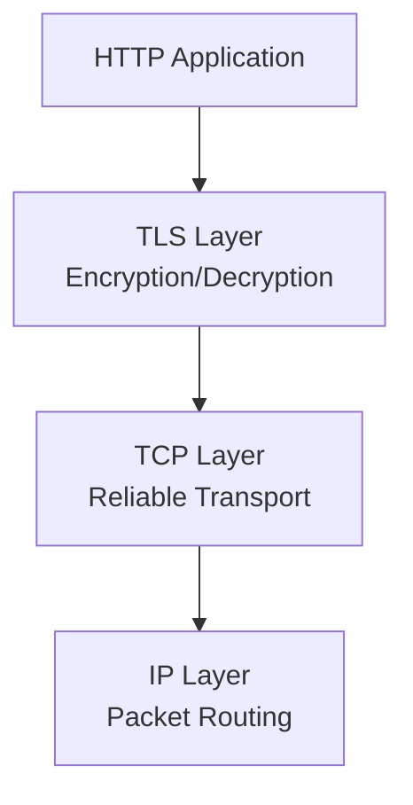
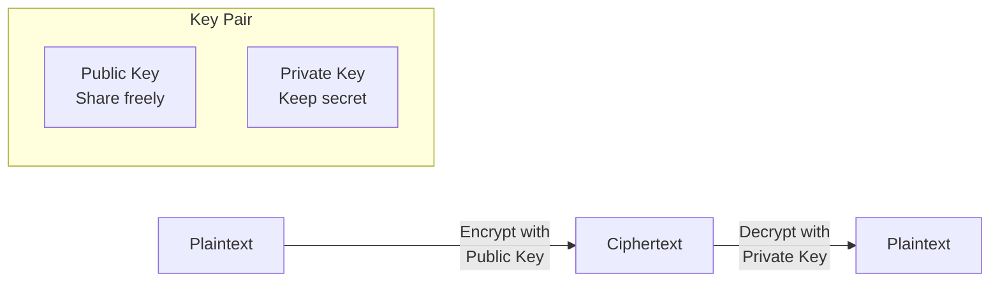
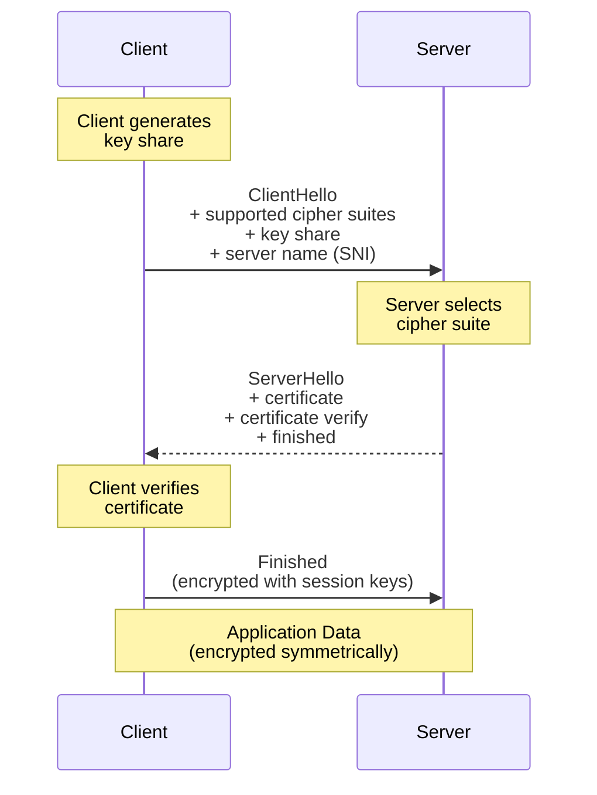
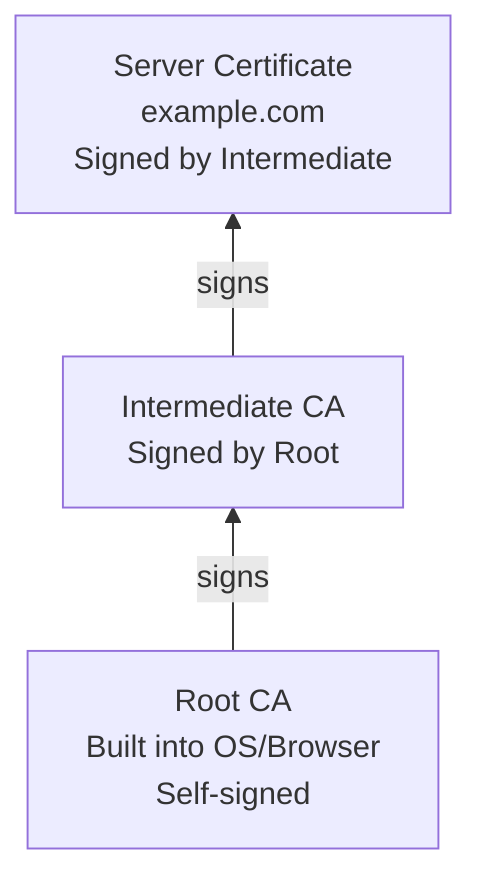

# TLS and HTTPS

> The internet is a hostile environment. Every packet passes through routers and networks operated by entities you do not control. Without encryption, anyone on the path can read, modify, or steal your data. TLS is the shield that makes secure web communication possible.

## Learning Objectives

After completing this chapter, you will be able to:

- Explain how TLS provides confidentiality, integrity, and authentication
- Describe the TLS handshake process and certificate validation
- Understand public-key cryptography, symmetric encryption, and hash functions
- Obtain and configure TLS certificates for a Flask application
- Explain the role of Certificate Authorities (CAs) and the chain of trust
- Implement HTTPS redirect in Flask
- Understand common TLS vulnerabilities and how to mitigate them

## Why Encryption Matters

When your Flask application sends data over plain HTTP, that data passes through multiple intermediate routers, ISPs, and potentially untrusted networks. At any point, a malicious actor can:

- **Eavesdrop**: Read sensitive data (passwords, session cookies, personal information)
- **Tamper**: Modify data in transit (inject ads, change form submissions)
- **Impersonate**: Pretend to be your server and steal user credentials

This is not theoretical. Public Wi-Fi networks, compromised routers, and ISP-level surveillance all intercept unencrypted traffic. The only defense is **end-to-end encryption** — data encrypted on the client that only the server can decrypt, and vice versa.

**TLS (Transport Layer Security)** provides this encryption. When combined with HTTP, we call it **HTTPS**.

> [!WARNING]
> Never run a production Flask application over plain HTTP. Always use HTTPS. Modern browsers mark HTTP sites as "Not Secure," search engines penalize them, and users rightly distrust them.

## What Is TLS?

TLS is a cryptographic protocol that provides:

1. **Confidentiality**: Data is encrypted — only the intended recipient can read it
2. **Integrity**: Data cannot be modified in transit without detection
3. **Authentication**: The client verifies it is communicating with the real server, not an impostor

TLS sits between TCP and the application layer:



From the application's perspective, TLS is transparent. HTTP data goes in, encrypted data comes out and travels over TCP. The application does not need to handle encryption itself — though it must configure TLS properly.

### TLS vs. SSL

You may hear "SSL" used interchangeably with "TLS." **SSL (Secure Sockets Layer)** was the original protocol, developed by Netscape in 1994. It had serious security flaws and was replaced by **TLS 1.0** in 1999 (which was essentially SSL 3.1).

| Version | Status |
|---------|--------|
| SSL 2.0 | Deprecated, insecure |
| SSL 3.0 | Deprecated, insecure (POODLE attack) |
| TLS 1.0 | Deprecated (2018) |
| TLS 1.1 | Deprecated (2018) |
| TLS 1.2 | Widely supported, secure |
| TLS 1.3 | Recommended, faster handshake |

Always use TLS 1.2 or higher. Disable older versions.

## Cryptographic Primitives

TLS combines three cryptographic techniques:

### 1. Public-Key Cryptography (Asymmetric Encryption)

Public-key cryptography uses a pair of mathematically related keys:

- **Public key**: Can be shared with anyone. Used to encrypt data or verify signatures.
- **Private key**: Must be kept secret. Used to decrypt data or create signatures.

Data encrypted with the public key can only be decrypted with the private key. This enables secure communication without sharing a secret in advance.



Common public-key algorithms: **RSA** (Rivest-Shamir-Adleman), **ECDSA** (Elliptic Curve Digital Signature Algorithm), **Ed25519**.

Public-key operations are computationally expensive. TLS uses them only during the handshake to establish a shared secret, then switches to faster symmetric encryption for the actual data transfer.

### 2. Symmetric Encryption

Symmetric encryption uses the same key for both encryption and decryption. It is orders of magnitude faster than public-key cryptography.

```
Encrypt(plaintext, key) -> ciphertext
Decrypt(ciphertext, key) -> plaintext
```

TLS uses symmetric encryption for all data transfer after the handshake. Common algorithms:

- **AES (Advanced Encryption Standard)**: The modern standard. Key sizes: 128, 192, 256 bits. AES-256-GCM is the current gold standard.
- **ChaCha20-Poly1305**: A fast, secure alternative to AES, particularly on mobile devices without AES hardware acceleration.

### 3. Hash Functions

Hash functions produce a fixed-size "fingerprint" of data. They are **one-way** — you cannot derive the original data from the hash.

TLS uses hash functions for:
- **Integrity verification**: A hash of the transmitted data proves it was not modified
- **Key derivation**: Deriving encryption keys from shared secrets
- **Certificate fingerprints**: Identifying certificates

Common hash functions: **SHA-256**, **SHA-384**. (MD5 and SHA-1 are broken — do not use them for security.)

## The TLS Handshake

The TLS handshake establishes an encrypted connection. TLS 1.3 (the modern version) completes this in a single round trip:



### Step 1: ClientHello

The client sends:
- **TLS version** it supports
- **Cipher suites** it supports (combinations of key exchange, authentication, encryption, and hash algorithms)
- **Key share**: A public key for key exchange (using ECDHE — Ephemeral Elliptic Curve Diffie-Hellman)
- **SNI (Server Name Indication)**: The hostname it wants to connect to (allows multiple certificates on one IP)

### Step 2: ServerHello

The server responds with:
- **Selected cipher suite**
- **Certificate**: The server's public key wrapped in an X.509 certificate, signed by a Certificate Authority
- **CertificateVerify**: A digital signature proving the server possesses the private key matching the certificate
- **Finished**: A hash of all previous handshake messages, encrypted with the new session keys

### Step 3: Client Finished

The client:
- **Verifies the certificate** (see Certificate Validation below)
- **Derives session keys** using its private key share and the server's public key share
- Sends its own "Finished" message encrypted with the session keys

### Step 4: Application Data

Both parties now have the same symmetric session keys. All subsequent communication is encrypted using these keys. The expensive public-key operations are done — symmetric encryption handles everything from here.

### TLS 1.3 Improvements

TLS 1.3 (RFC 8446, 2018) improves on TLS 1.2:

- **Faster handshake**: 1-RTT instead of 2-RTT (TLS 1.2 required two round trips)
- **0-RTT resumption**: Repeat visitors can send data immediately using a pre-shared key
- **Simplified cipher suites**: Only 5 cipher suites, all considered secure
- **Removed insecure algorithms**: MD5, SHA-1, RSA key exchange, CBC mode ciphers — all removed
- **Encrypted more of the handshake**: Reduces metadata leakage

## Certificates and Certificate Authorities

### What Is a Certificate?

A **TLS certificate** (technically an X.509 certificate) is a digital document that binds a public key to an identity. It contains:

- **Subject**: The entity the certificate belongs to (domain name, organization)
- **Issuer**: The Certificate Authority that signed the certificate
- **Public key**: The server's public key
- **Validity period**: Start and end dates
- **Serial number**: Unique identifier
- **Signature**: The CA's digital signature, proving the certificate is authentic

### Certificate Chain

Certificates form a **chain of trust**:

```
End-Entity Certificate (your server's certificate)
    ↓ signed by
Intermediate CA Certificate
    ↓ signed by
Root CA Certificate (built into browsers/OS)
```

When your browser connects to `https://example.com`, it receives:
1. The server's certificate for `example.com`
2. An intermediate CA certificate

The browser checks:
1. The intermediate CA signed the server's certificate
2. A root CA (that the browser trusts) signed the intermediate certificate
3. The certificate is not expired
4. The domain name matches
5. The certificate has not been revoked



### Certificate Authorities

**Certificate Authorities (CAs)** are trusted organizations that issue certificates after verifying the requester's identity. Major CAs include:

- **Let's Encrypt**: Free, automated certificates. The most popular CA for web applications. Issues 90-day certificates that must be renewed automatically.
- **DigiCert**: Commercial CA. Offers extended validation (EV) certificates.
- **Cloudflare**: Issues free certificates for domains using their proxy service.

Browsers and operating systems ship with a **trust store** — a list of root CA certificates they trust. If a certificate chain leads back to one of these trusted roots, the certificate is considered valid.

### Let's Encrypt

Let's Encrypt revolutionized TLS by offering free certificates through an automated API. The process:

1. You prove control of a domain (via DNS record or HTTP challenge)
2. Let's Encrypt issues a certificate
3. You configure your server to use it
4. Automated tools (Certbot, acme.sh) handle renewal

For Flask applications behind Nginx, Certbot automates everything:

```bash
# Install Certbot
sudo apt install certbot python3-certbot-nginx

# Obtain and install certificate
sudo certbot --nginx -d example.com -d www.example.com

# Auto-renewal is configured automatically
```

### Self-Signed Certificates

For development or internal applications, you can create a **self-signed certificate** — signed by your own key rather than a CA. Browsers will show a warning ("Your connection is not private") because they do not trust the signer.

```bash
# Generate a self-signed certificate
openssl req -x509 -nodes -days 365 -newkey rsa:2048 \
    -keyout server.key -out server.crt \
    -subj "/CN=localhost"
```

In Flask (development only):

```python
# Run with SSL certificate
app.run(ssl_context=('server.crt', 'server.key'))
```

> [!WARNING]
> Never use self-signed certificates in production for public-facing applications. Users will see scary warnings and may leave your site.

## HTTPS in Flask

### Redirect HTTP to HTTPS

All production Flask applications should redirect HTTP traffic to HTTPS:

```python
from flask import Flask, request, redirect

app = Flask(__name__)

@app.before_request
def redirect_https():
    if not request.is_secure:
        url = request.url.replace('http://', 'https://', 1)
        return redirect(url, code=301)
```

In practice, this is better handled at the reverse proxy (Nginx) level rather than in Flask.

### Secure Cookie Settings

When using HTTPS, configure Flask's session cookies for maximum security:

```python
app.config.update(
    SESSION_COOKIE_SECURE=True,    # Only send over HTTPS
    SESSION_COOKIE_HTTPONLY=True,  # Prevent JavaScript access
    SESSION_COOKIE_SAMESITE='Lax', # Restrict cross-site usage
    SECRET_KEY='your-secret-key',  # Used to sign session cookies
)
```

| Setting | Effect | Why |
|---------|--------|-----|
| `SESSION_COOKIE_SECURE` | Cookie only sent over HTTPS | Prevents session hijacking on HTTP |
| `SESSION_COOKIE_HTTPONLY` | JavaScript cannot read cookie | Prevents XSS attacks from stealing sessions |
| `SESSION_COOKIE_SAMESITE='Lax'` | Cookie not sent on cross-site POST | Prevents CSRF attacks |

### HSTS (HTTP Strict Transport Security)

HSTS tells browsers to always use HTTPS for your domain, even if the user types `http://`:

```python
@app.after_request
def add_hsts(response):
    response.headers['Strict-Transport-Security'] = 'max-age=31536000; includeSubDomains'
    return response
```

The `max-age` is in seconds (31536000 = 1 year). `includeSubDomains` applies the policy to all subdomains. Once a browser sees this header, it will refuse to connect over HTTP until the policy expires.

> [!WARNING]
> Only enable HSTS after you are confident your HTTPS setup works correctly. If you enable HSTS and then lose your certificate, users cannot access your site until the HSTS policy expires.

## Common TLS Vulnerabilities

| Vulnerability | Description | Mitigation |
|--------------|-------------|------------|
| **Heartbleed** (2014) | Buffer over-read in OpenSSL exposing private keys | Update OpenSSL, revoke and reissue certificates |
| **POODLE** | Downgrade attack forcing SSL 3.0 | Disable SSL 3.0 and TLS 1.0/1.1 |
| **BEAST** | CBC mode weakness in TLS 1.0 | Use TLS 1.2+ with AES-GCM |
| **CRIME/BREACH** | Compression side-channel attacks | Disable TLS compression |
| **Renegotiation attack** | Man-in-the-middle during renegotiation | Use patched OpenSSL, disable renegotiation |

## Best Practices

- Use TLS 1.2 minimum (TLS 1.3 preferred)
- Use strong cipher suites (AES-256-GCM, ChaCha20-Poly1305)
- Use Let's Encrypt for free, automated certificates
- Enable HTTP to HTTPS redirect
- Set secure cookie attributes
- Enable HSTS after verifying HTTPS works
- Monitor certificate expiration
- Keep OpenSSL and other TLS libraries updated

## Exercises

1. **Inspect a Certificate**: Visit any HTTPS website, click the lock icon in your browser, and view the certificate. Who is the CA? What is the validity period? What is the public key algorithm?

2. **SSL Labs Test**: Go to ssllabs.com/ssltest and test any website's TLS configuration. What grade does it receive? What cipher suites are supported?

3. **Create a Self-Signed Certificate**: Use OpenSSL to create a self-signed certificate and run Flask with it. Observe the browser warning. Add the certificate to your OS trust store and verify the warning disappears.

4. **TLS Version Check**: Use `openssl s_client` to check which TLS versions a server supports:
   ```bash
   openssl s_client -connect example.com:443 -tls1_3
   openssl s_client -connect example.com:443 -tls1_2
   ```

## Quiz

**Question 1**: What three security properties does TLS provide?

**Question 2**: Why does TLS use public-key cryptography only during the handshake, then switch to symmetric encryption?

**Question 3**: What is a Certificate Authority, and why are they necessary?

**Question 4**: Explain the difference between a self-signed certificate and a CA-signed certificate.

**Question 5**: What does HSTS do, and why should you be careful when enabling it?

## Interview Questions

1. "Explain how TLS provides secure communication over an untrusted network."

2. "Walk through the TLS 1.3 handshake. What happens at each step?"

3. "What is a certificate chain? How does a browser validate it?"

4. "Why is HTTPS important for a Flask application? What attacks does it prevent?"

5. "Explain the difference between confidentiality, integrity, and authentication in the context of TLS."

6. "A user's browser shows 'Your connection is not private.' What are the possible causes?"

## Related Chapters

- Previous: [[00-Foundations/TCP-UDP]]
- Next: [[00-Foundations/HTTP]]
- [[08-Security/Security-Overview]] — Comprehensive application security
- [[07-Deployment/HTTPS]] — Production HTTPS configuration

## Official Documentation References

- [RFC 8446 - TLS 1.3](https://datatracker.ietf.org/doc/html/rfc8446)
- [RFC 5280 - X.509 Certificates](https://datatracker.ietf.org/doc/html/rfc5280)
- [Let's Encrypt Documentation](https://letsencrypt.org/docs/)
- [Mozilla SSL Configuration Generator](https://ssl-config.mozilla.org/)
- [OWASP Transport Layer Protection Cheat Sheet](https://cheatsheetseries.owasp.org/cheatsheets/Transport_Layer_Protection_Cheat_Sheet.html)

---

*Previous: [[00-Foundations/TCP-UDP]] | Next: [[00-Foundations/HTTP]]*