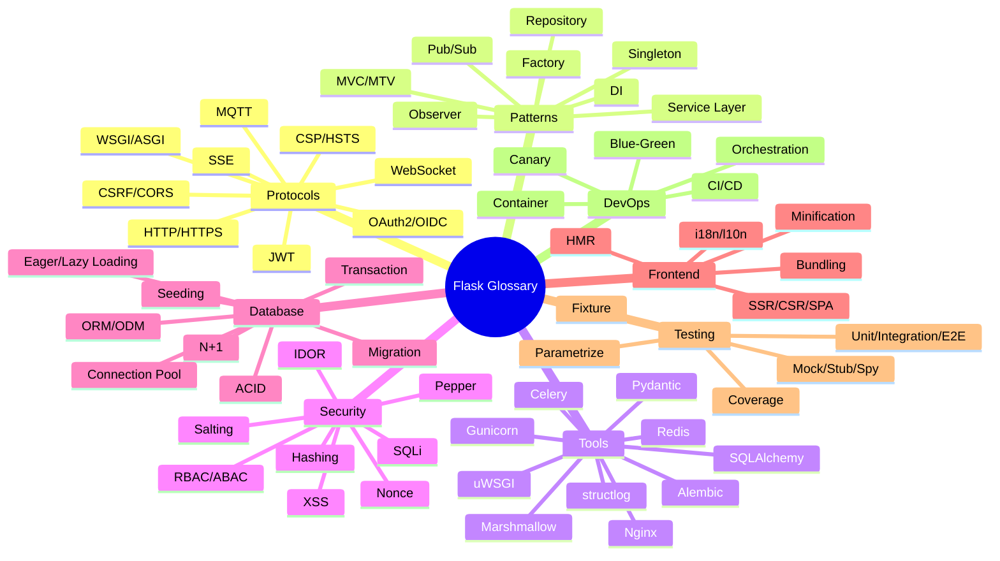

# 📖 Glossary

#glossary #reference #flask #cross-cutting

> [!info] The vocabulary of Flask web development
> This glossary defines 90+ terms you'll encounter across the vault. Each entry includes the term, a 1–3 sentence definition, a category tag, and a wikilink to the deep-dive note where the term is most thoroughly explained. Use `Ctrl+F` / `Cmd+F` to jump to a term.

---

## How to Use This Glossary

- **Category tags** (in square brackets) group terms by domain: `[protocol]`, `[pattern]`, `[tool]`, `[security]`, `[database]`, `[frontend]`, `[testing]`, `[devops]`.
- **Wikilinks** point to the vault note where the term is most thoroughly explained.
- **Cross-references** ("See also") link to related glossary entries.

---

## Term Index (Alphabetical)

Jump: [A](#a) · [B](#b) · [C](#c) · [D](#d) · [E](#e) · [F](#f) · [G](#g) · [H](#h) · [I](#i) · [J](#j) · [K](#k) · [L](#l) · [M](#m) · [N](#n) · [O](#o) · [P](#p) · [Q](#q) · [R](#r) · [S](#s) · [T](#t) · [U](#u) · [V](#v) · [W](#w) · [X](#x) · [Y](#y) · [Z](#z)

---

## A

**ABAC** — Attribute-Based Access Control. An authorization model where access decisions are made by evaluating attributes of the user, resource, and environment (e.g., "user.department == resource.department AND time is business hours"). More expressive than RBAC but harder to audit. `[security]` See [[Flask-Principal]].

**ACID** — Atomicity, Consistency, Isolation, Durability. The four properties a reliable database transaction must guarantee. Flask-SQLAlchemy sessions provide ACID transactions by default. `[database]` See [[Flask-SQLAlchemy]] § Transactions.

**Alembic** — A database migration tool for SQLAlchemy. Flask-Migrate wraps Alembic to expose it through the `flask db` CLI. `[tool]` See [[Flask-Migrate]].

**Application Factory** — A function (typically `create_app()`) that constructs and returns a configured Flask app instance. Enables per-environment configuration, test isolation, and lazy extension init. `[pattern]` See [[Flask-Overview]] § Application Factory and [[Project-Structure]].

**ASGI** — Asynchronous Server Gateway Interface. The async successor to WSGI; supports long-lived connections (WebSockets) and async handlers. Flask itself is WSGI; ASGI alternatives include FastAPI and Litestar. `[protocol]` See [[Flask-Overview]].

**Authlib** — A comprehensive OAuth/OIDC library for Python. Used by [[Flask-Authlib]] for OAuth2 client and provider functionality. `[tool]`

---

## B

**Blueprint** — Flask's mechanism for grouping related routes, templates, and static files. The unit of modularization; think of it as a "mini-app" you can register on the main app. `[pattern]` See [[Flask-Overview]] § Blueprints.

**Blue-Green Deploy** — A deployment strategy where two identical production environments (blue and green) alternate as the active deployment. Switch traffic from one to the other after verifying the new version. Enables instant rollback. `[devops]` See [[Production-Deployment]].

**Brotli** — A compression algorithm (developed by Google) that typically achieves 15–20% better compression than gzip. Supported by all modern browsers. `[frontend]` See [[Flask-Compress]].

**Bcrypt** — A password hashing algorithm designed to be slow (key derivation). Resistant to GPU/ASIC brute-force. The de facto standard for password storage. `[security]` See [[Flask-Bcrypt]].

**Bundling** — Combining multiple JavaScript/CSS source files into a single file for delivery to the browser. Reduces HTTP requests; modern bundlers (Vite, esbuild) also do tree-shaking and transpilation. `[frontend]` See [[Flask-Vite]] and [[Flask-Assets]].

---

## C

**Canary Deploy** — A deployment strategy where a new version is rolled out to a small percentage of users first (e.g., 5%), monitored for errors, and then gradually ramped up to 100%. `[devops]` See [[Production-Deployment]].

**Celery** — A distributed task queue for Python. The standard solution for background work in Flask apps. Requires a broker (Redis or RabbitMQ) and optional results backend. `[tool]` See [[Celery]].

**CLI** — Command-Line Interface. Flask's CLI is `flask --app myapp` and is extended by extensions (e.g., `flask db`, `flask shell`). `[tool]` See [[Flask-CLI]] and [[Flask-Shell]].

**Connection Pool** — A cache of database connections reused across requests. Avoids the cost of establishing a new TCP+auth connection per query. SQLAlchemy pools are configurable via `pool_size`, `max_overflow`, `pool_pre_ping`. `[database]` See [[Flask-SQLAlchemy]] § Connection Pool.

**Container** — A lightweight, isolated runtime environment (typically Docker) that packages an app with its dependencies. The deploy unit of modern cloud infrastructure. `[devops]` See [[Production-Deployment]].

**Coverage** — The percentage of code lines (or branches, or paths) exercised by tests. The standard metric for test thoroughness; measured by `coverage.py` or `pytest-cov`. Aim for 80%+ on business logic. `[testing]` See [[Testing-Strategy]].

**CORS** — Cross-Origin Resource Sharing. A browser security mechanism that controls when JavaScript on origin A can make requests to origin B. Configured via HTTP response headers. `[protocol]` `[security]` See [[Flask-CORS]] and [[Security-Best-Practices]].

**CSP** — Content Security Policy. An HTTP response header that restricts which scripts, styles, and other resources the browser may load and execute. The primary defense against XSS. `[protocol]` `[security]` See [[Flask-Talisman]].

**CSRF** — Cross-Site Request Forgery. An attack where a malicious site causes the user's browser to submit a request to your app using the user's session cookie. Prevented by CSRF tokens. `[protocol]` `[security]` See [[Flask-WTF]] and [[Flask-SeaSurf]].

**CSR** — Client-Side Rendering. The browser downloads a minimal HTML document plus a JS bundle; the JS then renders the page. Default for SPAs (React, Vue). `[frontend]` See [[Flask-Vite]].

---

## D

**Dependency Injection (DI)** — A pattern where components receive their dependencies (other objects they need) as constructor arguments or function parameters rather than creating them. Improves testability and modularity. `[pattern]` See [[Flask-Injector]].

**Dramatiq** — A fast and reliable alternative to Celery. Better middleware story and more reliable retries. `[tool]` See [[Flask-Dramatiq]].

---

## E

**Eager Loading** — A query strategy where related objects are loaded in the same query (or one extra query) as the parent, avoiding N+1. Implemented via `joinedload` or `selectinload` in SQLAlchemy. `[database]` See [[Flask-SQLAlchemy]] § Eager Loading.

**E2E Test** — End-to-End test. A test that exercises the entire stack from the user's perspective (browser → app → DB → response). Slow but high-fidelity. Tools: Playwright, Cypress, Selenium. `[testing]` See [[Testing-Strategy]].

**ETag** — Entity Tag. An HTTP header containing a hash of the response body. The browser sends `If-None-Match` on subsequent requests; if the ETag matches, the server returns `304 Not Modified` and no body. `[protocol]`

---

## F

**Factory** — A function or method that creates objects, hiding the construction details. The "application factory" pattern (`create_app()`) is the canonical Flask example. `[pattern]` See [[Project-Structure]].

**Fixture** — In pytest, a reusable setup function that provides a value (or context) to one or more tests. Fixtures can be scoped per-function, per-module, per-session. `[testing]` See [[Pytest-Flask]].

**Flask** — A Python web microframework. Provides routing, request/response objects, templates (Jinja2), and an extension ecosystem. WSGI-based. `[tool]` See [[Flask-Overview]].

**Flask-SQLAlchemy** — A thin Flask wrapper around SQLAlchemy that manages the engine, scoped session, and `db.Model` declarative base per app. `[tool]` See [[Flask-SQLAlchemy]].

---

## G

**GraphQL** — A query language for APIs developed by Facebook. Clients specify exactly the fields they want; the server returns only those. An alternative to REST. `[protocol]` See [[Flask-GraphQL]] and [[Ariadne-Flask]].

**Gunicorn** — The recommended WSGI server for production Flask. Pre-forks worker processes, supports sync and async workers (gevent, eventlet). `[tool]` See [[Production-Deployment]].

---

## H

**Hashing** — A one-way function that converts an input into a fixed-size output. Used for password storage (slow hashes like bcrypt/argon2) and integrity checks (fast hashes like SHA-256). Never store passwords as plain hashes — use salted slow hashes. `[security]` See [[Flask-Bcrypt]].

**HMR** — Hot Module Replacement. A development feature where changes to source files are reflected in the browser instantly, without a full page reload. Bundlers like Vite provide HMR out of the box. `[frontend]` See [[Flask-Vite]].

**HSTS** — HTTP Strict Transport Security. An HTTP response header that tells the browser to always use HTTPS for this domain for a specified duration. Defends against SSL-strip attacks. `[protocol]` `[security]` See [[Flask-Talisman]].

**HTTP** — HyperText Transfer Protocol. The foundational request/response protocol of the web. Stateless; uses methods (GET, POST, PUT, DELETE, PATCH) and status codes. `[protocol]`

**HTTPS** — HTTP over TLS. Encrypts the contents of HTTP requests and responses, and authenticates the server via a certificate. Mandatory for production. `[protocol]` See [[Production-Deployment]] § TLS.

---

## I

**i18n** — Internationalization. Designing an app so it can be adapted to multiple languages and regions without code changes. The "18" stands for the 18 letters between "i" and "n". `[frontend]` See [[Flask-Babel]].

**IDOR** — Insecure Direct Object Reference. A vulnerability where the app exposes an object identifier (e.g., `/api/orders/123`) without checking that the requesting user owns that object. Fix with per-row authorization. `[security]` See [[Security-Best-Practices]].

**Integration Test** — A test that exercises multiple components together (e.g., app + DB) but stops short of full E2E. Faster than E2E, more thorough than unit tests. `[testing]` See [[Testing-Strategy]].

---

## J

**Jinja2** — Flask's default template engine. A text-based template language with inheritance, filters, macros, and autoescaping. `[tool]` See [[Flask-Overview]].

**JWT** — JSON Web Token. A compact, signed token format (RFC 7519) used for stateless authentication. Contains claims (user ID, expiry, scopes) encoded as a JSON payload. Stateless but hard to revoke. `[protocol]` `[security]` See [[Flask-JWT-Extended]].

---

## K

**Key Derivation Function (KDF)** — A function that takes a password and a salt and produces a key of fixed length, designed to be slow (bcrypt, scrypt, argon2). Used for password storage. `[security]` See [[Flask-Bcrypt]].

---

## L

**l10n** — Localization. The process of adapting an already-internationalized app to a specific language and region (translating strings, formatting dates/numbers). `[frontend]` See [[Flask-Babel]].

**Lazy Loading** — A query strategy where related objects are loaded only when first accessed. Default in SQLAlchemy; causes N+1 if you iterate over a list and access a relation on each. `[database]` See [[Flask-SQLAlchemy]] § Eager Loading.

**Limiter** — A request rate limiter; "rate limiting" is the general concept. Flask-Limiter implements request rate limits in Flask. `[tool]` See [[Flask-Limiter]] and [[00-FAQ]] Q20.

---

## M

**Marshalling** — Converting Python objects to/from JSON for API responses. In Flask-Smorest and Flask-RESTful, marshalling is defined by schemas. `[pattern]` See [[Marshmallow]] and [[Flask-RESTful]].

**Marshmallow** — A popular Python serialization library. Defines schemas with typed fields and validation; converts ORM objects to dicts and back. `[tool]` See [[Marshmallow]].

**Mermaid** — A markdown-friendly diagramming language. Used throughout this vault for flowcharts, sequence diagrams, ER diagrams, and mindmaps. `[tool]`

**Migration** — A scripted, reversible change to the database schema. Tracked in version control and applied in order. `[database]` See [[Flask-Migrate]].

**Minification** — Removing whitespace, comments, and shortening identifiers in JS/CSS to reduce file size. Typically done by the bundler. `[frontend]` See [[Flask-Assets]] and [[Flask-Vite]].

**Mock** — A test double that records calls and lets you assert on them. Used to verify interactions (e.g., "did the code call `mail.send`?"). `[testing]` See [[Pytest-Flask]].

**MQTT** — Message Queuing Telemetry Transport. A lightweight pub/sub protocol popular for IoT and sensor data. `[protocol]` See [[Flask-MQTT]].

**MVC** — Model-View-Controller. A UI architecture pattern. Flask is sometimes called MTV (Model-Template-View) because Flask's "view" is what MVC calls "controller". `[pattern]` See [[Flask-Overview]].

---

## N

**N+1 Query** — A performance antipattern where a list of N parents is fetched, then each parent's relation is fetched one at a time (N more queries). Total: N+1 queries instead of 1 or 2. `[database]` See [[Flask-SQLAlchemy]] § Eager Loading.

**Nginx** — A high-performance HTTP server and reverse proxy. Commonly used in front of Gunicorn to terminate TLS, serve static files, and load-balance multiple workers. `[tool]` See [[Production-Deployment]].

**Nonce** — A "number used once." In CSP, a per-response random string that whitelists specific inline scripts. `[security]` See [[Flask-Talisman]].

---

## O

**Observer** — A pattern where one object (the subject) maintains a list of dependents (observers) and notifies them of state changes. SQLAlchemy events are an example. `[pattern]` See [[Flask-SQLAlchemy]] § Events.

**ODM** — Object-Document Mapper. The document-database equivalent of an ORM. Maps Python objects to MongoDB documents. `[database]` See [[Flask-MongoEngine]].

**OIDC** — OpenID Connect. An identity layer on top of OAuth2; provides authentication (who is the user) in addition to authorization (what can they do). The standard for SSO. `[protocol]` See [[Flask-Authlib]].

**OAuth2** — An authorization framework (RFC 6749) that lets a user grant one app access to their data on another app, without sharing passwords. The basis of "Sign in with Google/GitHub". `[protocol]` See [[Flask-Dance]] and [[Flask-Authlib]].

**ORM** — Object-Relational Mapper. A library that translates between Python objects and database rows. Lets you write `User.query.all()` instead of `SELECT * FROM users`. `[database]` `[tool]` See [[Flask-SQLAlchemy]].

**Orchestration** — Automating the deployment, scaling, and management of containers. Kubernetes is the dominant orchestrator; Docker Compose for single-host. `[devops]` See [[Production-Deployment]].

---

## P

**Parametrize** — A pytest feature that runs the same test function with multiple inputs. Replaces copy-pasted test functions with one declarative test. `[testing]` See [[Pytest-Flask]].

**Pepper** — A secret value added to passwords in addition to the per-password salt. Unlike salt, the pepper is shared across all passwords and stored separately (often in env, not DB). Defends against DB-only leaks. `[security]` See [[Flask-Bcrypt]].

**Pub/Sub** — Publish/Subscribe. A messaging pattern where publishers send messages to topics, and subscribers receive messages from topics they've subscribed to. Decouples producers from consumers. `[pattern]` See [[Flask-MQTT]] and [[Celery]].

**Pydantic** — A Python data validation library based on type hints. The serialization layer in FastAPI; usable in Flask via [[Flask-Pydantic-Spec]] or [[Pydantic-Settings]] for config. `[tool]`

---

## R

**RBAC** — Role-Based Access Control. An authorization model where permissions are assigned to roles, and users are assigned roles. Simpler than ABAC; covers most apps' needs. `[security]` See [[Flask-Principal]].

**Rate Limiting** — Restricting the number of requests a client can make in a time window. Defends against abuse and DoS. Flask-Limiter is the standard implementation. `[security]` `[pattern]` See [[Flask-Limiter]].

**Redis** — An in-memory key-value store. Used as a cache, message broker (Celery), rate-limit backend, session store, and SocketIO message bus. `[tool]` `[database]` See [[Flask-Redis]] and [[Flask-Caching]].

**Repository Pattern** — An architectural pattern where data access is encapsulated in repository classes with methods like `find_by_id()`, `save()`. Decouples business logic from the ORM. `[pattern]` See [[Common-Patterns]].

**Request Context** — Flask's per-request state. Pushed on every request; provides `request`, `session`, `g`. Distinct from the Application Context. `[pattern]` See [[Flask-Overview]].

**Rollbar** — An error-tracking service. Captures uncaught exceptions, groups them, and alerts. Alternatives: Sentry, Honeybadger. `[tool]` `[devops]` See [[Error-Handling]].

---

## S

**Salting** — Adding a unique random value to each password before hashing. Defends against rainbow tables and ensures identical passwords hash differently. Always salt. `[security]` See [[Flask-Bcrypt]].

**Schema** — In Marshmallow, a class defining the fields and validation of a serialized object. In a database, the structure of tables and columns. `[database]` `[pattern]` See [[Marshmallow]].

**Seeding** — Populating a database with initial or test data. Often a one-time script or a fixture file. `[database]` See [[Flask-SQLAlchemy]] § Seeding.

**Service Layer** — An architectural pattern where business logic lives in service classes/functions, separate from routes and models. Routes call services; services call models. Improves testability. `[pattern]` See [[Common-Patterns]].

**Singleton** — A pattern where only one instance of a class exists per process. Flask extensions often follow this (one `db`, one `mail` per app). `[pattern]` See [[Project-Structure]].

**SPA** — Single-Page Application. A web app that loads a single HTML page and updates the DOM client-side as the user navigates. React/Vue/Angular SPAs typically consume a JSON API. `[frontend]` See [[Flask-Vite]].

**Spy** — A test double that records calls without replacing behavior. Lets you assert that a function was called with certain args while still letting it execute. `[testing]` See [[Pytest-Flask]].

**SQLAlchemy** — The Python ORM that Flask-SQLAlchemy wraps. The most full-featured Python ORM; supports querying, relations, transactions, dialects. `[tool]` See [[Flask-SQLAlchemy]].

**SQLi** — SQL Injection. An attack where user input is concatenated into a SQL string, allowing the attacker to execute arbitrary SQL. Prevented by parameterized queries (which all ORMs use by default). `[security]` See [[Security-Best-Practices]].

**SSR** — Server-Side Rendering. The server renders the HTML for the page; the browser displays it directly. Flask's default mode with Jinja2. `[frontend]` See [[Flask-Overview]].

**SSE** — Server-Sent Events. A one-way (server→client) streaming protocol over HTTP. Simpler than WebSocket; built-in browser reconnection. `[protocol]` See [[Flask-SSE]].

**Stub** — A test double that returns canned responses without verifying calls. Used to isolate the code under test from external dependencies. `[testing]` See [[Pytest-Flask]].

**structlog** — A structured logging library that outputs JSON or key-value pairs instead of free-form strings. Easier to search and aggregate in central log stores. `[tool]` See [[Structlog-Integration]].

---

## T

**TOTP** — Time-based One-Time Password. The algorithm behind Google Authenticator and similar 2FA apps. Generates a 6-digit code that changes every 30 seconds from a shared secret. `[protocol]` `[security]` See [[Authentication-Cookbook]] Recipe 6.

**Transaction** — A unit of work on a database that is atomic (all or nothing), consistent, isolated, and durable (ACID). SQLAlchemy sessions are transactional; `db.session.commit()` ends one and begins the next. `[database]` See [[Flask-SQLAlchemy]] § Transactions.

---

## U

**Unit Test** — A test that exercises a single function or class in isolation, with all dependencies mocked/stubbed. Fast; should be the bulk of your test suite. `[testing]` See [[Testing-Strategy]].

**uWSGI** — An alternative WSGI server. More configurable than Gunicorn but with a steeper learning curve. Used in specific deployments (notably uWSGI Emperor mode for multi-app hosting). `[tool]` See [[Production-Deployment]].

---

## V

**Vite** — A modern frontend build tool. Provides near-instant HMR in dev and optimized bundling in prod. The recommended replacement for Webpack. `[tool]` `[frontend]` See [[Flask-Vite]].

---

## W

**WebSocket** — A bidirectional, persistent protocol (RFC 6455) that upgrades from HTTP. Used for real-time apps: chat, games, collaboration. `[protocol]` See [[Flask-SocketIO]].

**Werkzeug** — The WSGI utility library Flask is built on. Provides request/response objects, routing, debugging, and the dev server. `[tool]` See [[Flask-Overview]].

**WSGI** — Web Server Gateway Interface. The Python standard (PEP 3333) for synchronous web apps. Flask is WSGI; Gunicorn and uWSGI are WSGI servers. `[protocol]` See [[Flask-Overview]].

---

## X

**XSS** — Cross-Site Scripting. An attack where untrusted input is rendered into a page without escaping, allowing the attacker to execute JavaScript in the victim's browser. Prevented by Jinja2's autoescaping and a strict CSP. `[security]` See [[Security-Best-Practices]] and [[Flask-Talisman]].

---

## Z

(No entries yet — when you find one, add it here.)

---

## Category Summary

| Category | Count | Notes |
|---|---|---|
| `[protocol]` | 18 | HTTP, HTTPS, WSGI, ASGI, WebSocket, SSE, MQTT, OAuth2, OIDC, JWT, CSRF, CORS, CSP, HSTS, ETag, GraphQL, TOTP |
| `[pattern]` | 12 | Factory, Singleton, Repository, Service Layer, DI, Observer, Pub/Sub, Blueprint, Marshalling, MVC/MTV, Rate Limiting, Request Context |
| `[tool]` | 18 | Gunicorn, uWSGI, Nginx, Redis, Celery, Alembic, SQLAlchemy, Marshmallow, Pydantic, structlog, Werkzeug, Jinja2, Flask, Flask-SQLAlchemy, Authlib, Mermaid, Vite, Rollbar |
| `[security]` | 14 | XSS, SQLi, IDOR, RBAC, ABAC, Hashing, Salting, Pepper, Nonce, JWT, CSRF, CORS, CSP, HSTS |
| `[database]` | 9 | ORM, ODM, Migration, Seeding, Transaction, ACID, N+1, Eager/Lazy Loading, Connection Pool |
| `[frontend]` | 9 | SSR, CSR, SPA, HMR, Bundling, Minification, i18n, l10n, Brotli |
| `[testing]` | 8 | Unit, Integration, E2E, Fixture, Mock, Stub, Spy, Parametrize, Coverage |
| `[devops]` | 5 | CI/CD, Blue-Green, Canary, Container, Orchestration |

> [!note] Coverage check
> This glossary deliberately overlaps with the smaller glossary at the bottom of [[00-Map-of-Content]] — this one is more complete and tagged by category; that one is the quick-reference for the most common terms. Both should stay in sync if you add new terms.

---

## Adding a Term

When you encounter a term in the vault that isn't defined here:

1. Add it to the appropriate alphabetical section above.
2. Follow the format: `**Term** — Definition. [tag] See [[Related-Note]].`
3. Bump the count in the Category Summary table.
4. Add a wikilink from the term's first appearance back here (`[[00-Glossary]]`).

---

## See Also

- [[00-Map-of-Content]] — the canonical index
- [[00-FAQ]] — answers to common questions
- [[00-Troubleshooting-Decision-Tree]] — runtime problem flowcharts
- [[Security-Best-Practices]] — security concepts in depth
- [[Performance-Optimization]] — performance terminology in context
- [[Common-Patterns]] — pattern explanations with examples

*Return to [[00-Map-of-Content]] · Last updated 2024-01-15*
