# 🗺️ Map of Content

#moc #flask #index

> [!info] The canonical entry point
> This MOC indexes every note in the Flask Extensions Vault. If you're lost, return here. If you're new, read top-to-bottom.

The vault is organized in **20 thematic sections** mirroring the way Flask apps are typically built: you start with the framework, add persistence, layer on auth, then forms/API, then utilities, then admin/serialization, then async/realtime concerns, then testing, then integration, then best-practices hardening — and then layer on the modern ecosystem (modern API frameworks, advanced auth, NoSQL/search, frontend, security tooling, task queues, observability, GraphQL, config/DI, and battle-tested cookbooks). Four **cross-cutting reference notes** ([[00-FAQ]], [[00-Glossary]], [[00-Troubleshooting-Decision-Tree]], [[00-Version-Compatibility-Matrix]]) sit alongside this MOC and cut across every section.

Each section below lists its notes with a one-line summary so you can decide whether to dive in.

---

## 🧭 Navigation

- 🏠 [[README|Vault README]] — orientation, conventions, license
- 🧭 This MOC — the index you are reading
- ❓ [[00-FAQ|FAQ]] — 30+ answered questions
- 📖 [[00-Glossary|Glossary]] — 90+ terms defined
- 🚨 [[00-Troubleshooting-Decision-Tree|Troubleshooting]] — symptom-based debugging
- 📊 [[00-Version-Compatibility-Matrix|Version Matrix]] — Flask/Python/extension compatibility
- 📊 Graph view: `Ctrl+G` / `Cmd+G` to see inter-note relationships
- 🏷️ Tag pane: filter by `#flask`, `#database`, `#security`, `#async`, etc.

---

## ⚡ Quick Reference

Four cross-cutting reference notes sit alongside this MOC and cut across every thematic section. Use them as alternative entry points when you have a question, a term, a symptom, or a version pinning problem.

| Note | When to use it |
|---|---|
| [[00-FAQ]] | Start here when you have a specific question ("how do I reset a password?", "Celery or RQ?", "how many Gunicorn workers?") — 32 questions across 7 categories with code examples and decision flowcharts. |
| [[00-Glossary]] | Start here when you hit an unfamiliar term ("what's an app factory?", "what's HSTS?", "what's `g`?") — 91 terms with category tags and wikilinks to the relevant deep-dive note. |
| [[00-Troubleshooting-Decision-Tree]] | Start here when something is broken ("app won't start", "endpoint is slow", "WebSocket won't connect") — 10 symptom-based decision trees with branch-by-branch explanations. |
| [[00-Version-Compatibility-Matrix]] | Start here before any upgrade or new-project pinning ("does Flask-Login work on Flask 3?", "which Python for Flask 2.x?", "is `_app_ctx_stack` gone?") — Flask/Python/extension matrix, migration guides, deprecation timeline. |

> [!tip] Three doors in
> If you're not sure where to start, ask: is this a *question*, a *term*, a *symptom*, or a *version* problem? Each answer points to one of the four reference notes above. Otherwise, keep reading the MOC top-to-bottom.

---

## 00 · First Principles

Before diving into Flask, it helps to understand web frameworks from the ground up. This handbook rebuilds Flask from scratch using raw Python sockets.

| Note | What it covers |
|---|---|
| [[00-Flask-First-Principles-From-Scratch]] | Building a web server from scratch, HTTP, routing, WSGI, templating, and migrating to Flask |

---

## 01 · Introduction

The bedrock notes. Read these before anything else if you're new to Flask. The Introduction section exists to give you the mental model — what Flask is, why it's designed the way it is, how to lay out a project, and how to install everything correctly. Skipping these notes and jumping straight to a specific extension is the most common way to end up with a tangled, unmaintainable codebase. Spend the time here; it pays off in every other section.

| Note | What it covers |
|---|---|
| [[Flask-Overview]] | The microframework philosophy, WSGI, Jinja2, Werkzeug, app factory, blueprints, request lifecycle, Flask vs Django/FastAPI |
| [[Project-Structure]] | Single-file vs package layouts, large-app structure, where each extension lives, config files, `.env`, complete folder tree |
| [[Installation-Guide]] | Virtual environments (venv/pipenv/poetry/uv), installing Flask & extensions, `requirements.txt`, version pinning, Docker setup |
| [[Flask-CLI]] | The `flask` command, `--app`/`FLASK_APP` discovery, custom commands via `@app.cli.command()`, Click integration, AppGroup, Blueprint CLI, CliRunner testing |
| [[Flask-Shell]] | `flask shell` REPL, `@app.shell_context_processor`, auto-importing models, IPython/bpython integration, debugging patterns, production safety |

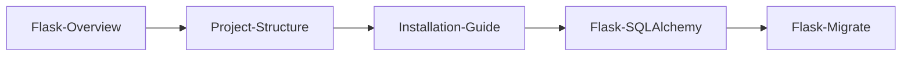

> [!note] Why the bedrock three matter
> Every Flask app starts here. [[Flask-Overview]] gives you the conceptual model (what is a request, what is a blueprint, why an app factory). [[Project-Structure]] shows you the canonical layout that scales from a script to a real production app. [[Installation-Guide]] ensures your environment is reproducible. [[Flask-CLI]] and [[Flask-Shell]] then show you how to drive the running app from the command line — essential for migrations, one-off scripts, and debugging sessions. Skip these and you'll write the same code three different ways across three projects.

---

## 02 · Database

Persistence is the first non-trivial decision in any Flask app. These two extensions cover 95% of production Flask database work. Flask-SQLAlchemy is the de facto ORM; Flask-Migrate gives you reversible schema migrations. Together they replace what Django gives you out of the box with `models.py` + `migrations/`.

| Note | What it covers |
|---|---|
| [[Flask-SQLAlchemy]] ⭐ | The most-used Flask extension. ORM, models, relationships, querying, sessions, transactions, pagination, hybrid properties, signals, testing, performance. **4000+ words.** |
| [[Flask-Migrate]] | Alembic wrapper for schema migrations. `init`/`migrate`/`upgrade`/`downgrade`, custom migrations, multi-database, production strategies. |

> [!tip] Read order
> Read [[Flask-SQLAlchemy]] first — you cannot migrate a schema you haven't defined. [[Flask-Migrate]] builds directly on the SQLAlchemy model layer.

> [!example] A typical database-driven app
> A blog, a SaaS dashboard, an internal CRM — all of these start with: define `User`, `Post`, `Comment` models in Flask-SQLAlchemy; run `flask db migrate` to create the initial schema; run `flask db upgrade` to apply it. Every later schema change follows the same loop.

---

## 03 · Authentication

Most apps need to know who is making each request. Flask gives you signed cookies out of the box (via `ItsDangerous`), but for real user management you need either session-based auth (Flask-Login) or token-based auth (Flask-JWT-Extended). The choice depends on your client: browsers handle sessions naturally; mobile apps and SPAs typically prefer JWT.

| Note | What it covers |
|---|---|
| [[Flask-Login]] | Session-based user authentication. `UserMixin`, `login_user`, `current_user`, `@login_required`, remember-me, logout |
| [[Flask-JWT-Extended]] | Token-based auth (JWT). Access/refresh tokens, claims, blacklist, custom decorators, WebSocket auth |

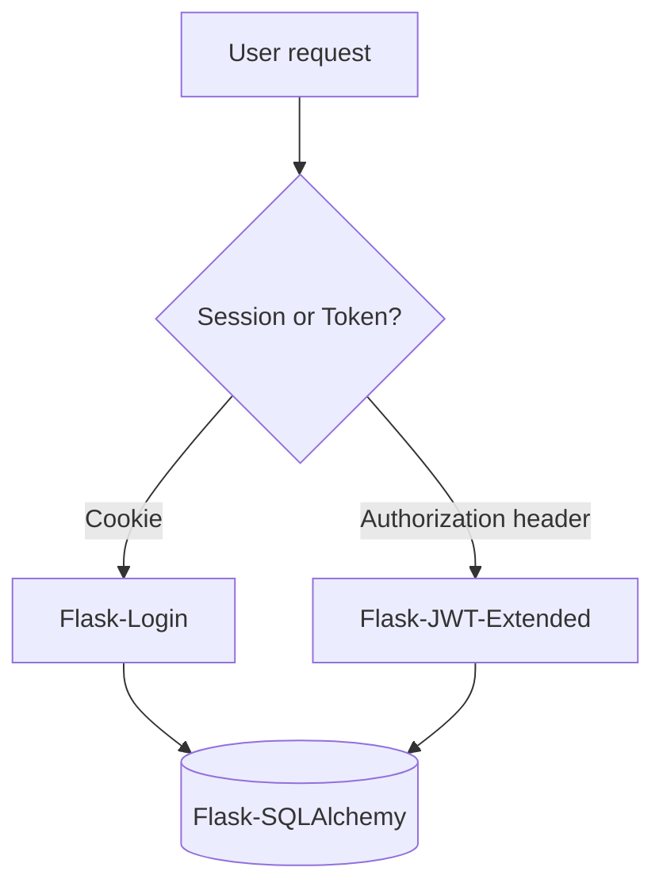

> [!warning] Don't mix auth systems casually
> Picking one auth system and using it consistently is much simpler than supporting both. If your app has both server-rendered pages (needing sessions) and a JSON API (needing tokens), document which routes use which auth and keep them in separate blueprints.

---

## 04 · Forms & API

Flask can handle input directly via `request.form`, `request.json`, and `request.files`, but doing this by hand is error-prone and insecure. These three extensions cover the standard ways to accept input: Flask-WTF for traditional HTML forms (with CSRF), Flask-RESTful for resource-based JSON APIs, and Flask-CORS for allowing browsers to call your API from a different origin.

| Note | What it covers |
|---|---|
| [[Flask-WTF]] | Form rendering, CSRF protection, `FlaskForm`, validators, file uploads in forms |
| [[Flask-RESTful]] | Resource-based REST API layer. `Resource`, `reqparse`, `marshal_with`, `Api` |
| [[Flask-CORS]] | Cross-Origin Resource Sharing. `@cross_origin`, `CORS(app)`, per-resource config, credentials |

> [!tip] Forms vs API — pick per route
> Server-rendered HTML pages should use Flask-WTF (for CSRF protection). JSON API endpoints should use Flask-RESTful (or `flask-smorest` or just `@app.route`). Don't try to use Flask-WTF for JSON — it's not designed for that.

---

## 05 · Utilities

These are the cross-cutting concerns that don't fit neatly into one section. They affect every part of the app: email sending, response caching, request rate-limiting, and file upload management. Most production Flask apps use at least three of these four.

| Note | What it covers |
|---|---|
| [[Flask-Mail]] | SMTP mail sending. `Mail`, `Message`, attachments, async sending, templates |
| [[Flask-Caching]] | Cache backends (Redis, Memcached, filesystem). `@cache.cached`, `cached()`, `memoize`, J2 cache |
| [[Flask-Limiter]] | Rate limiting. `@limiter.limit`, Redis backends, key functions, strategies |
| [[Flask-Uploads]] | File upload management. Upload sets, naming, storage backends |

> [!example] Typical utility stack
> A production SaaS app typically uses Flask-Mail (transactional emails), Flask-Caching (cache expensive queries), Flask-Limiter (prevent API abuse), and either Flask-Uploads or direct S3 uploads (user avatars, attachments).

---

## 06 · Admin & Serialization

Once you have data, you need (a) an admin interface for staff to manage it and (b) a serialization layer for your API to convert Python objects to JSON safely. Flask-Admin provides the admin UI; Marshmallow provides the schemas. They're often used together — admin for internal staff, Marshmallow for the public API.

| Note | What it covers |
|---|---|
| [[Flask-Admin]] | Auto-generated admin interface. `Admin`, `ModelView`, custom views, permissions |
| [[Marshmallow]] | Schema serialization/deserialization. `Schema`, `fields`, validation, nested schemas, integration with SQLAlchemy |

> [!note] Flask-Admin is not Django admin
> Django's admin is legendary because it's free and ubiquitous. Flask-Admin is good but requires setup and configuration. Plan to spend a few hours customizing it for your models. See [[Flask-Admin]] for the patterns.

---

## 07 · Async & Realtime

When a request takes too long (more than a few hundred milliseconds) or needs to push updates to the client without polling, you've outgrown the basic request-response model. Celery handles background work; Flask-SocketIO handles real-time bidirectional communication. Both are more complex than typical Flask extensions and warrant their own deep dives.

| Note | What it covers |
|---|---|
| [[Celery]] | Distributed task queue. Broker, workers, `@shared_task`, schedules, results backend |
| [[Flask-SocketIO]] | WebSocket support. `SocketIO`, `emit`, `@socketio.on`, rooms, namespaces |

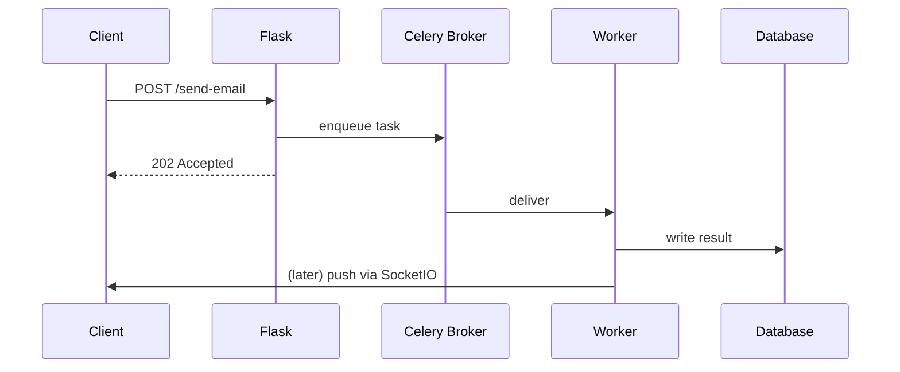

> [!warning] Don't reach for Celery prematurely
> If your endpoint takes 200ms, optimize the query. If it takes 2 seconds, you might still fix it with caching or async I/O. Only when a request takes 30+ seconds (or needs to retry on failure) does Celery become the right answer. Adding Celery adds operational complexity — a broker, workers, monitoring — that you should not take on lightly.

---

## 08 · Testing

A Flask app without tests is a Flask app you can't refactor. These three notes cover the testing stack: Flask-Testing (the older, unittest-based style), Pytest-Flask (the modern, fixture-based style — pick this for new projects), and Factory-Boy (test-data generation that pairs with either).

| Note | What it covers |
|---|---|
| [[Flask-Testing]] | The `TestCase` base class. Setup, teardown, assertions, test client patterns |
| [[Pytest-Flask]] | Pytest fixtures for Flask. `client`, `app`, `request_ctx`, parametrize, DB rollback per test |
| [[Factory-Boy]] | Test-data generation with factory_boy. `SQLAlchemyModelFactory`, `Sequence`, `SubFactory`, Faker integration, pytest fixture stacking |

> [!tip] Use factory_boy for test data
> Don't write `User(username="alice", ...)` in every test. Use [factory_boy](https://factoryboy.readthedocs.io/) to define `UserFactory` once and instantiate with overrides. See [[Pytest-Flask]] for examples.

---

## 09 · Integration

This section is where everything comes together. The Full-Stack-Example note walks through a real app using every major extension. Production-Deployment covers the operational side (Gunicorn, Nginx, Docker, systemd). Common-Patterns documents architectural decisions (service layer, repository pattern, etc.). Error-Handling covers `@app.errorhandler`, RFC 9457 Problem Details, and Sentry integration. Database-Migrations-Strategy covers expand-and-contract, zero-downtime, and multi-environment migration pipelines.

| Note | What it covers |
|---|---|
| [[Full-Stack-Example]] | A complete end-to-end Flask app using every major extension. Annotated walkthrough |
| [[Production-Deployment]] | Gunicorn/uWSGI, Nginx, Docker, systemd, load balancing, secrets |
| [[Common-Patterns]] | Service layer, repository pattern, application factory variations, blueprints composition |
| [[Error-Handling]] | `@app.errorhandler`, custom exception hierarchies, RFC 9457 Problem Details, Sentry integration, content-negotiated error responses |
| [[Database-Migrations-Strategy]] | Expand-and-contract pattern, zero-downtime migrations, multi-env promotion, rollback strategies, data vs schema migrations |

> [!example] When to read these
> Read [[Full-Stack-Example]] when you want to see how everything fits. Read [[Production-Deployment]] when you're about to ship. Read [[Common-Patterns]] when your app is getting messy and you're considering a refactor.

---

## 10 · Best Practices

The final section is hardening. Security-Best-Practices covers the attacks every Flask app must defend against (CSRF, XSS, SQLi, secret leakage). Performance-Optimization covers query optimization, caching strategy, async patterns, and profiling. Testing-Strategy covers the test pyramid, transactional fixtures, mocking, coverage targets, and CI/CD pipeline design. Read these before you ship to production — and again every six months as a refresher.

| Note | What it covers |
|---|---|
| [[Security-Best-Practices]] | CSRF, XSS, SQLi, secrets management, password hashing, headers, HTTPS |
| [[Performance-Optimization]] | Query optimization, caching strategy, async patterns, profiling, connection pooling |
| [[Testing-Strategy]] | Test pyramid, what (not) to test, transactional fixtures, SQLite vs Postgres in tests, mocking, coverage targets, CI/CD pipeline design, flaky-test prevention |

> [!danger] Security is not optional
> Every Flask app on the public internet will be probed for vulnerabilities within hours of deployment. Read [[Security-Best-Practices]] before you ship. The most common Flask security mistakes — hardcoded `SECRET_KEY`, missing CSRF on forms, SQL injection via `text()` without parameters — are all trivial to make and trivial to prevent.

---

## 11 · Modern API Frameworks

The Flask-RESTful extension (section 04) is now in maintenance mode. For new API projects, the community has moved to one of these four modern frameworks. Each brings type-safe serialization, automatic OpenAPI/Swagger generation, and cleaner patterns than the original Flask-RESTful.

| Note | What it covers |
|---|---|
| [[Flask-RESTX]] | Drop-in Flask-RESTful replacement with built-in Swagger UI, namespaces, and OpenAPI 2.0/3.0 |
| [[Flask-Smorest]] | Marshmallow-first framework with `@bp.arguments`/`@bp.response`, ETag, pagination, apispec |
| [[Flask-Pydantic-Spec]] | Pydantic v2 validation + OpenAPI spec generation. Closest to FastAPI ergonomics in Flask |
| [[Flask-Rebar]] | Google's internal framework. HandlerRegistry, RequestMappers, robust Swagger generation |

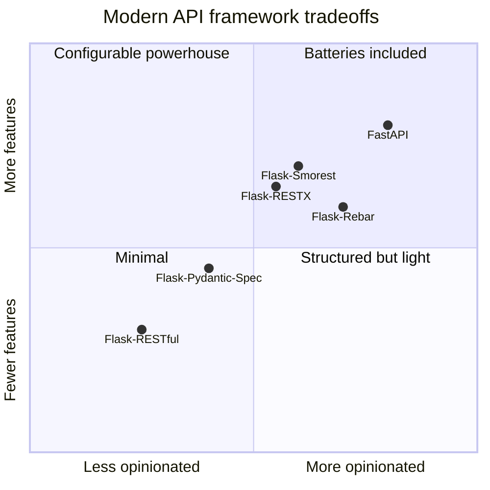

> [!tip] Which to pick?
> - **Flask-RESTX** if you want Swagger UI "for free" and a familiar Flask-RESTful feel.
> - **Flask-Smorest** if you already use [[Marshmallow]] and want first-class schema integration.
> - **Flask-Pydantic-Spec** if you love Pydantic and want FastAPI-like validation in Flask.
> - **Flask-Rebar** if you need Google-grade Swagger generation and registry-based routing.

---

## 12 · Advanced Auth & OAuth

Beyond Flask-Login (sessions) and Flask-JWT-Extended (tokens), there's a whole world of authentication patterns: OAuth2 providers (log in with Google/GitHub), HTTP Basic/Digest/Token auth, role-based access control, and server-side sessions. This section covers the specialist auth tools.

| Note | What it covers |
|---|---|
| [[Flask-Authlib]] | Modern OAuth 1.0/2.0 + OpenID Connect (both client and server). JOSE (JWT/JWS/JWE/JWK) |
| [[Flask-Dance]] | Pre-built OAuth blueprints for 30+ providers (Google, GitHub, Twitter, Facebook, GitLab, …) |
| [[Flask-HTTPAuth]] | HTTP Basic, Digest, Token, and MultiAuth (combine multiple schemes) |
| [[Flask-Principal]] | Identity/Need/Permission model for fine-grained RBAC |
| [[Flask-Session]] | Server-side session storage (Redis, Memcached, MongoDB, SQLAlchemy, filesystem) |

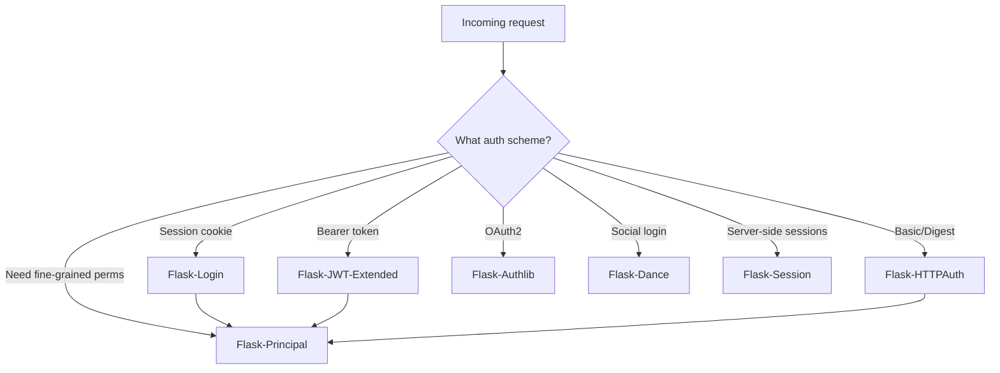

> [!note] OAuth2 is two-sided
> "OAuth2" can mean (a) your app **consuming** another provider's OAuth2 (let users log in with Google — use [[Flask-Dance]] or [[Flask-Authlib]]) or (b) your app **providing** OAuth2 to others (your app is the identity provider — use [[Flask-Authlib]] server features). Don't conflate them.

---

## 13 · NoSQL & Search

Flask-SQLAlchemy covers SQL databases (Postgres, MySQL, SQLite). But many apps need document stores, key-value stores, wide-column stores, or full-text search engines. This section covers the NoSQL and search extensions.

| Note | What it covers |
|---|---|
| [[Flask-MongoEngine]] | MongoDB ODM. `Document`, `EmbeddedDocument`, `ReferenceField`, signals, GridFS |
| [[Flask-PynamoDB]] | AWS DynamoDB ORM. Models, GSIs, single-table design, optimistic locking |
| [[Flask-Redis]] | Direct Redis access (data structures, pub/sub, Lua) — NOT just caching |
| [[Flask-Elasticsearch]] | Full-text search with Elasticsearch. Mapping, analyzers, bool queries, aggregations |
| [[Whoosh-Search]] | Pure-Python full-text search. Schema, analyzers, query parser — no external service |

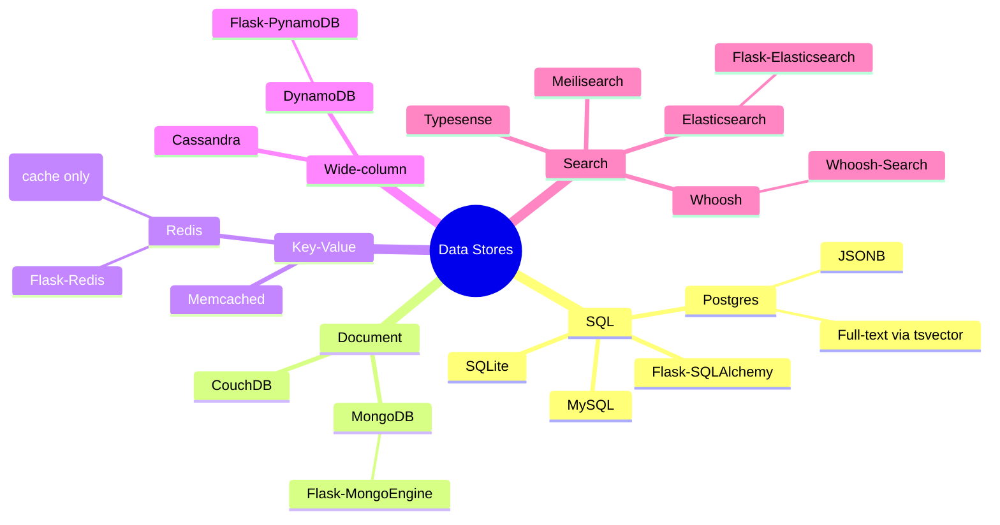

> [!tip] Don't use Redis for everything
> [[Flask-Redis]] (direct access to Lists/Sets/Hashes/Streams) and [[Flask-Caching]] (cache decorator) both touch Redis, but for different purposes. Use Flask-Caching for `@cache.cached()` patterns. Use Flask-Redis when you need Redis-specific data structures or pub/sub.

---

## 14 · Frontend, Assets & i18n

Server-rendered Flask apps need CSS/JS bundling, response compression, internationalization, timezone-aware timestamps, and (increasingly) modern JS build tools like Vite. This section covers the frontend-facing extensions.

| Note | What it covers |
|---|---|
| [[Flask-Assets]] | CSS/JS bundling with webassets. Bundles, filters (SCSS, Less, jsmin, Babel) |
| [[Flask-Compress]] | Gzip/Brotli response compression. `COMPRESS_MIMETYPE`, `COMPRESS_LEVEL` |
| [[Flask-Babel]] | i18n & l10n. `gettext`, `ngettext`, `pybabel extract/init/update/compile`, locale/timezone selectors |
| [[Flask-Moment]] | Moment.js integration for client-side timezone formatting |
| [[Flask-Vite]] | Modern Vite dev server integration with HMR — replaces Flask-Assets/webpack |

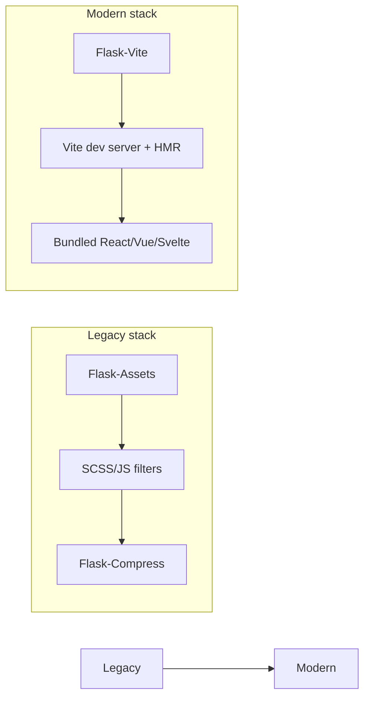

> [!warning] Flask-Assets is legacy
> webassets (the engine under Flask-Assets) is unmaintained. For new projects, use [[Flask-Vite]]. For existing projects, you can stay on Flask-Assets but plan a migration.

---

## 15 · Security Extensions

[[Security-Best-Practices]] covers the principles. This section covers the *tools* that enforce them: security headers (Talisman), CSRF protection (SeaSurf as an alternative to Flask-WTF's), password hashing (bcrypt), all-in-one auth (Flask-Security-Too, Flask-User).

| Note | What it covers |
|---|---|
| [[Flask-Talisman]] | Security headers: CSP, HSTS, X-Frame-Options, X-Content-Type-Options, Referrer-Policy. Nonce generation |
| [[Flask-SeaSurf]] | CSRF protection alternative to Flask-WTF. HMAC-signed double-submit cookie |
| [[Flask-Bcrypt]] | Password hashing with bcrypt. Work factor, lazy hash upgrades, pepper |
| [[Flask-Security-Too]] | All-in-one auth: register, login, confirm, reset, roles, 2FA (TOTP/SMS), WebAuthn, OAuth2 client |
| [[Flask-User]] | Lighter all-in-one alternative to Flask-Security-Too. UserManager + DbAdapter pattern |

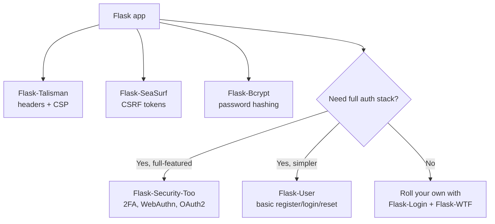

> [!danger] Talisman and SeaSurf can both be used
> Use [[Flask-Talisman]] for headers AND [[Flask-SeaSurf]] (or Flask-WTF's CSRFProtect) for CSRF. They don't conflict — they protect against different things.

---

## 16 · Task Queue Alternatives

[[Celery]] is the heavyweight champion of Python task queues, but it's overkill for many apps. This section covers lighter alternatives: RQ (simpler), Dramatiq (faster, more reliable), Huey (lightweight), and APScheduler (in-process scheduling — no separate worker).

| Note | What it covers |
|---|---|
| [[Flask-RQ]] | Redis Queue. `@job`, `enqueue`, workers. Simplest of the distributed queues |
| [[Flask-Dramatiq]] | Fast, reliable alternative to Celery. Middleware (retries, callbacks, throttling, age limiting) |
| [[Flask-Huey]] | Lightweight queue with SQLite backend (no Redis required). `@huey.task`, crontab, pipelines |
| [[Flask-APScheduler]] | In-process scheduling. No separate worker. Triggers: date, interval, cron. Job stores |

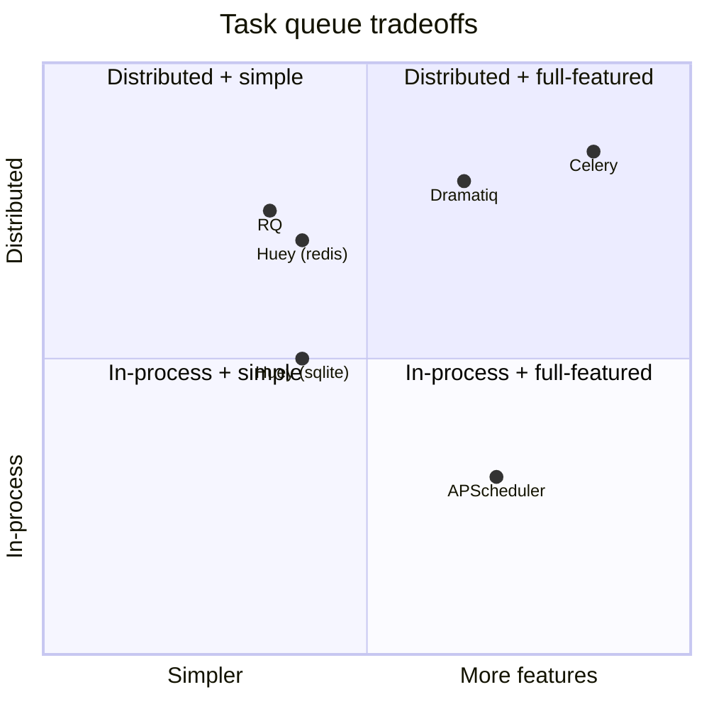

> [!tip] Choose based on needs
> - **APScheduler** if you just need cron-like jobs in your web process.
> - **Huey** if you want a real queue but don't want to run Redis.
> - **RQ** if you have Redis and want the simplest possible distributed queue.
> - **Dramatiq** if you want Celery-class reliability with simpler ops.
> - **Celery** if you need it all (and accept the operational complexity).

---

## 17 · Debugging & Profiling

Before you can fix a slow endpoint, you have to measure it. These extensions give you visibility into what your Flask app is doing: Flask-DebugToolbar for the classic Django-debug-toolbar-style side panel, Flask-Silk for per-request profiling and SQL inspection, Flask-Profiler for aggregate analytics, and Structlog for production-grade structured logging.

| Note | What it covers |
|---|---|
| [[Flask-DebugToolbar]] | Side-panel debugger. Panels for SQL, templates, headers, routes, config, custom panels |
| [[Flask-Silk]] | Per-request profiling and inspection. cProfile dumps, SQL query inspection |
| [[Flask-Profiler]] | Aggregate endpoint metrics stored in MongoDB/SQLite/Redis. Custom measurements |
| [[Structlog-Integration]] | Structured logging with structlog. JSON logs, contextvars (request_id, user_id), Sentry integration |

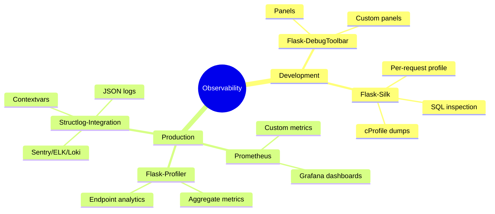

> [!danger] Never enable Flask-DebugToolbar or Flask-Silk in production
> These tools expose internals (config, SQL, source code paths, environment variables) to anyone who can hit the app. They must be gated behind `DEBUG=True` and/or IP allowlists, and disabled entirely in production.

---

## 18 · GraphQL & Modern Protocols

REST isn't the only API style. GraphQL offers a typed, client-driven query language. Server-Sent Events (SSE) provide one-way server push without the complexity of WebSockets. MQTT is the lingua franca of IoT. This section covers these alternative protocols.

| Note | What it covers |
|---|---|
| [[Flask-GraphQL]] | GraphQL integration with Graphene (schema-first or code-first). Legacy — prefer Ariadne |
| [[Ariadne-Flask]] | Modern schema-first GraphQL. `make_executable_schema`, resolvers, subscriptions |
| [[Flask-SSE]] | Server-Sent Events. `text/event-stream`, streaming responses, `EventSource` protocol |
| [[Flask-MQTT]] | MQTT IoT protocol integration. Topics, QoS levels, Last Will & Testament |

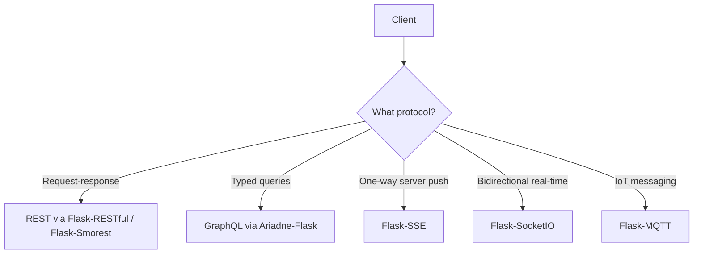

> [!tip] SSE vs WebSocket
> Use [[Flask-SSE]] for one-way push (notifications, live logs, dashboards). Use [[Flask-SocketIO]] only when you need bidirectional communication (chat, collaborative editing, multiplayer). SSE is dramatically simpler.

---

## 19 · Config, DI & Feature Flags

Flask's built-in `app.config` is a dict — fine for small apps, but at scale you want type-safe configuration (Pydantic-Settings), environment-based config (Flask-Environments), dependency injection (Flask-Injector), and feature flags (Flask-FeatureFlags) to decouple deploy from release.

| Note | What it covers |
|---|---|
| [[Flask-Injector]] | Dependency Injection. `@inject`, providers, bindings, request-scoped providers |
| [[Flask-FeatureFlags]] | Feature flag management. `@feature_flag`, sources (config/Redis/DB), A/B testing |
| [[Pydantic-Settings]] | Type-safe configuration with Pydantic v2 `BaseSettings`. `.env` loading, validation, secrets |
| [[Flask-Environments]] | Environment-based config classes. `FLASK_ENV`, DevConfig/ProdConfig/TestConfig inheritance |

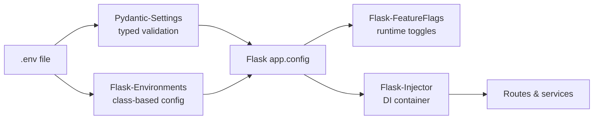

> [!note] Pydantic-Settings replaces app.config
> For new projects, [[Pydantic-Settings]] is the modern choice. It gives you type checking, validation, and `.env` integration out of the box. You can still pipe the validated settings into `app.config` for compatibility with extensions that read it.

---

## 20 · Recipes & Cookbook

The capstone section. These four notes are cookbooks — collections of battle-tested recipes for the most common Flask problems. Read them when you're about to build something and want to see how others have done it.

| Note | What it covers |
|---|---|
| [[Authentication-Cookbook]] | 10 auth recipes: session, JWT, OAuth2, API key, HTTP Basic, TOTP MFA, magic link, OIDC SSO, combined session+JWT, RBAC |
| [[File-Handling-Cookbook]] | 10 file recipes: disk upload, thumbnails, S3 presigned, chunked, tus, range download, Azure/B2, ClamAV, CSV/Excel import, PDF generation |
| [[API-Design-Cookbook]] | 14 API recipes: naming, pagination (offset/cursor/keyset), filtering, sparse fieldsets, versioning, rate limiting, idempotency, bulk, RFC 9457 errors, HATEOAS, ETags, GraphQL |
| [[Production-Readiness-Checklist]] | 7 checklists (100+ items): Security, Performance, Observability, Deployment, Database, Backup/DR, Compliance |

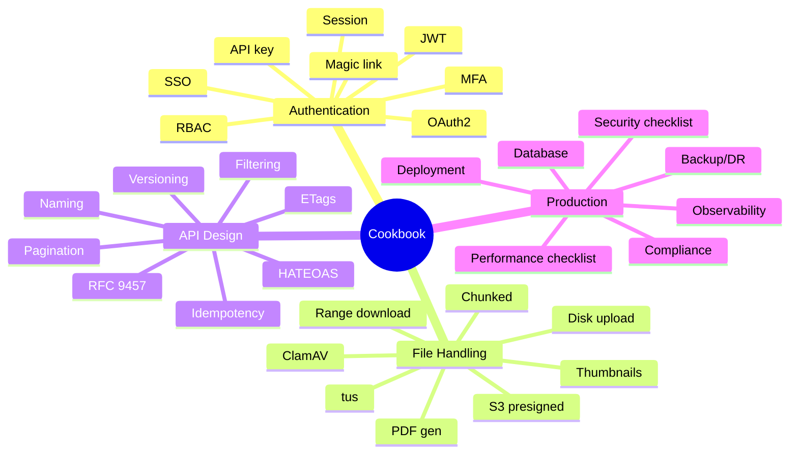

> [!example] How to use the cookbooks
> Don't read these end-to-end. Instead, when you're about to build feature X, jump to the relevant recipe. Each recipe has a **When to use**, **When NOT to use**, **Implementation**, **Variations**, and **Common mistakes** section — designed to be skimmed in 5 minutes.

---

## 🏷️ Tag Index

| Tag | Notes |
|---|---|
| `#flask` | All notes (80 total) |
| `#database` | [[Flask-SQLAlchemy]], [[Flask-Migrate]], [[Full-Stack-Example]], [[Flask-MongoEngine]], [[Flask-PynamoDB]], [[Flask-Redis]] |
| `#auth` | [[Flask-Login]], [[Flask-JWT-Extended]], [[Flask-Authlib]], [[Flask-Dance]], [[Flask-HTTPAuth]], [[Flask-Principal]], [[Flask-Session]], [[Flask-Security-Too]], [[Flask-User]], [[Authentication-Cookbook]] |
| `#api` | [[Flask-RESTful]], [[Flask-RESTX]], [[Flask-Smorest]], [[Flask-Pydantic-Spec]], [[Flask-Rebar]], [[Flask-CORS]], [[Marshmallow]], [[API-Design-Cookbook]] |
| `#graphql` | [[Flask-GraphQL]], [[Ariadne-Flask]] |
| `#forms` | [[Flask-WTF]] |
| `#async` | [[Celery]], [[Flask-SocketIO]], [[Flask-RQ]], [[Flask-Dramatiq]], [[Flask-Huey]], [[Flask-APScheduler]] |
| `#realtime` | [[Flask-SocketIO]], [[Flask-SSE]], [[Flask-MQTT]] |
| `#testing` | [[Flask-Testing]], [[Pytest-Flask]], [[Factory-Boy]], [[Testing-Strategy]] |
| `#security` | [[Flask-Login]], [[Flask-JWT-Extended]], [[Flask-Limiter]], [[Flask-CORS]], [[Flask-Talisman]], [[Flask-SeaSurf]], [[Flask-Bcrypt]], [[Security-Best-Practices]] |
| `#performance` | [[Flask-Caching]], [[Performance-Optimization]], [[Flask-DebugToolbar]], [[Flask-Silk]], [[Flask-Profiler]] |
| `#deployment` | [[Production-Deployment]], [[Full-Stack-Example]], [[Production-Readiness-Checklist]] |
| `#config` | [[Flask-Environments]], [[Flask-FeatureFlags]], [[Pydantic-Settings]], [[Flask-Injector]] |
| `#i18n` | [[Flask-Babel]], [[Flask-Moment]] |
| `#frontend` | [[Flask-Assets]], [[Flask-Compress]], [[Flask-Vite]], [[Flask-Babel]], [[Flask-Moment]] |
| `#search` | [[Flask-Elasticsearch]], [[Whoosh-Search]] |
| `#logging` | [[Structlog-Integration]] |
| `#moc` | This note |

---

## 🔗 Dependency Graph (textual)

If you want to know which extensions assume which others:

```
Flask (core)
├── Flask-SQLAlchemy ──┬── Flask-Migrate
│                      ├── Flask-Login (User model)
│                      ├── Flask-Admin (ModelView)
│                      └── Marshmallow (schemas)
├── Flask-WTF (CSRF — required by Flask-Login sessions)
├── Flask-Login ──┬── Flask-JWT-Extended (alt to sessions)
│                 └── Flask-Admin (auth for admin)
├── Flask-RESTful ──┬── Marshmallow
│                   ├── Flask-CORS
│                   └── Flask-JWT-Extended (auth)
├── Flask-Mail
├── Flask-Caching
├── Flask-Limiter
├── Flask-Uploads
├── Celery ── Flask-SQLAlchemy (for DB tasks)
├── Flask-SocketIO ── Flask-Login (auth)
└── Testing: Flask-Testing OR Pytest-Flask
```

> [!note] Reading order suggestion
> For a beginner building a real app:
> 1. Introduction (all three notes)
> 2. [[Flask-SQLAlchemy]] + [[Flask-Migrate]]
> 3. [[Flask-WTF]] (for forms/CSRF)
> 4. [[Flask-Login]] (for sessions)
> 5. [[Marshmallow]] + [[Flask-RESTful]] (if building an API)
> 6. [[Flask-Caching]] + [[Flask-Limiter]] (production hardening)
> 7. [[Celery]] (when you need background work)
> 8. [[Pytest-Flask]] (testing)
> 9. [[Production-Deployment]] + [[Security-Best-Practices]]

---

## 📝 Status

| Section | Files | Status |
|---|---|---|
| 01-Introduction | 5 | ✅ Complete (expanded) |
| 02-Database | 2 | ✅ Complete |
| 03-Authentication | 2 | ✅ Complete |
| 04-Forms-API | 3 | ✅ Complete |
| 05-Utilities | 4 | ✅ Complete |
| 06-Admin-Serialization | 2 | ✅ Complete |
| 07-Async-Realtime | 2 | ✅ Complete |
| 08-Testing | 3 | ✅ Complete (expanded) |
| 09-Integration | 5 | ✅ Complete (expanded) |
| 10-Best-Practices | 3 | ✅ Complete (expanded) |
| 11-Modern-API | 4 | ✅ Complete (NEW) |
| 12-Advanced-Auth | 5 | ✅ Complete (NEW) |
| 13-NoSQL-Search | 5 | ✅ Complete (NEW) |
| 14-Frontend-Assets | 5 | ✅ Complete (NEW) |
| 15-Security-Extensions | 5 | ✅ Complete (NEW) |
| 16-Task-Queues | 4 | ✅ Complete (NEW) |
| 17-Debugging-Profiling | 4 | ✅ Complete (NEW) |
| 18-GraphQL-Modern | 4 | ✅ Complete (NEW) |
| 19-Config-DI | 4 | ✅ Complete (NEW) |
| 20-Recipes-Cookbook | 4 | ✅ Complete (NEW) |
| Cross-Cutting Reference | 4 | ✅ Complete (NEW) — [[00-FAQ]], [[00-Glossary]], [[00-Troubleshooting-Decision-Tree]], [[00-Version-Compatibility-Matrix]] |
| **README + MOC** | 2 | ✅ Complete |
| **TOTAL** | **80 files** | **✅ Vault complete** |

**Vault stats**: 80 markdown files · ~315,000 words · ~410 Mermaid diagrams · 20 thematic sections + 4 cross-cutting reference notes · fully cross-linked Obsidian vault

---

## 🧭 Decision Tree: Which Extension Do I Need?

A common question: "I have problem X — which extension solves it?" This decision tree should help.

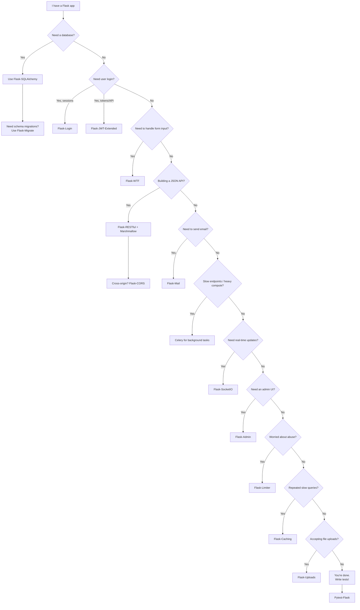

> [!tip] You don't need every extension
> A "real" Flask app might use 5–8 of these. The decision tree helps you avoid pulling in extensions you don't need. Don't reach for Celery because you saw it in a tutorial; reach for it because your endpoint is taking 30 seconds.

---

## 📚 Reading Paths by Goal

### Goal: "Build my first Flask app"

1. [[Flask-Overview]]
2. [[Installation-Guide]]
3. [[Project-Structure]]
4. [[Flask-SQLAlchemy]]
5. [[Flask-Migrate]]
6. [[Flask-WTF]]
7. [[Flask-Login]]
8. [[Pytest-Flask]]

### Goal: "Build a JSON API"

1. [[Flask-Overview]] (skim)
2. [[Project-Structure]]
3. [[Flask-SQLAlchemy]]
4. [[Marshmallow]]
5. [[Flask-RESTful]]
6. [[Flask-CORS]]
7. [[Flask-JWT-Extended]]
8. [[Flask-Limiter]]
9. [[Pytest-Flask]]

### Goal: "Add async/background jobs to existing app"

1. [[Celery]]
2. [[Flask-Mail]] (typically used from Celery)
3. [[Flask-SocketIO]] (for pushing results back to clients)

### Goal: "Harden an existing app for production"

1. [[Security-Best-Practices]]
2. [[Performance-Optimization]]
3. [[Production-Deployment]]
4. [[Flask-Caching]]
5. [[Flask-Limiter]]
6. [[Pytest-Flask]] (so you can refactor safely)

### Goal: "Build an internal admin tool"

1. [[Flask-Admin]]
2. [[Flask-SQLAlchemy]] (Admin reads from models)
3. [[Flask-Login]] (admin auth)
4. [[Flask-WTF]] (custom admin forms)

### Goal: "Add real-time features (chat, notifications)"

1. [[Flask-SocketIO]]
2. [[Flask-Login]] or [[Flask-JWT-Extended]] (auth for sockets)
3. [[Celery]] (background broadcast)
4. [[Flask-Caching]] (rate-limit socket emissions)

### Goal: "Build a modern API with OpenAPI/Swagger"

1. [[Flask-Smorest]] (recommended) or [[Flask-RESTX]]
2. [[Marshmallow]] (if using Smorest) or Pydantic (if using [[Flask-Pydantic-Spec]])
3. [[Flask-JWT-Extended]] (auth)
4. [[Flask-Limiter]] (rate limiting)
5. [[API-Design-Cookbook]] (patterns)

### Goal: "Add social login (Google/GitHub)"

1. [[Flask-Dance]] (simplest) or [[Flask-Authlib]] (more control)
2. [[Flask-Login]] (session after OAuth callback)
3. [[Flask-SQLAlchemy]] (User model)
4. [[Authentication-Cookbook]] recipe #3

### Goal: "Add background jobs without Celery"

1. [[Flask-APScheduler]] (in-process, simplest)
2. [[Flask-Huey]] (if you need a real queue but no Redis)
3. [[Flask-RQ]] (if you have Redis and want simplicity)
4. [[Flask-Dramatiq]] (if you need Celery-class reliability)

### Goal: "Add full-text search"

1. [[Whoosh-Search]] (pure Python, no external service — start here)
2. [[Flask-Elasticsearch]] (when you outgrow Whoosh or need scaling)
3. See [[API-Design-Cookbook]] for search endpoint patterns

### Goal: "Ship to production safely"

1. [[Production-Readiness-Checklist]] (100+ item checklist)
2. [[Production-Deployment]] (Gunicorn, Nginx, Docker)
3. [[Security-Best-Practices]] + [[Flask-Talisman]]
4. [[Structlog-Integration]] (logging)
5. [[Performance-Optimization]]

### Goal: "Understand the full Flask ecosystem"

Read the MOC top-to-bottom, then pick one note from each section. By the time you've read 20 notes (one per section + a few extras), you'll have seen every major Flask extension pattern.

---

## 🧩 Extension Compatibility Matrix

Which extensions work well together, and which have known conflicts:

| Extension Pairs | Status | Notes |
|---|---|---|
| Flask-SQLAlchemy + Flask-Migrate | ✅ Perfect | Designed together. |
| Flask-SQLAlchemy + Flask-Login | ✅ Perfect | `UserMixin` on the model. |
| Flask-SQLAlchemy + Flask-Admin | ✅ Perfect | `ModelView` reads from `db.Model`. |
| Flask-SQLAlchemy + Marshmallow | ✅ Perfect | `marshmallow-sqlalchemy` auto-schemas. |
| Flask-Login + Flask-WTF | ✅ Required | CSRF tokens must align. |
| Flask-Login + Flask-JWT-Extended | ⚠️ Choose one | Both try to manage `current_user`. |
| Flask-WTF + Flask-RESTful | ⚠️ Awkward | WTF is for forms, RESTful is JSON. Pick per route. |
| Flask-CORS + Flask-JWT-Extended | ✅ Works | Configure CORS to allow credentials. |
| Celery + Flask-SQLAlchemy | ⚠️ Tricky | Celery workers need their own app context. |
| Flask-SocketIO + Flask-Login | ⚠️ Tricky | Socket auth is different from HTTP auth. |
| Flask-Limiter + Flask-Caching | ✅ Perfect | Limit + cache is a common combo. |
| Flask-Admin + Flask-Login | ✅ Perfect | Use `is_accessible()` for auth. |

> [!warning] Flask-Login + Flask-JWT-Extended
> Mixing session auth and JWT in the same app is doable but confusing. Pick one for the primary auth, use the other only for specific endpoints. Document your choice in your project README.

---

## 🏆 The "Must-Read" Shortlist

If you have time for only 5 notes, read these:

1. **[[Flask-Overview]]** — understand the framework.
2. **[[Project-Structure]]** — set up your app correctly from day one.
3. **[[Flask-SQLAlchemy]]** — the database is 80% of any real Flask app.
4. **[[Flask-Login]]** — every app needs auth.
5. **[[Production-Deployment]]** — the gap between "works on my machine" and "works in production."

Everything else is depth on top of these foundations.

---

## 🔁 Maintenance & Updates

This MOC is the canonical index. If you add a note:

1. Place it in the appropriate section folder.
2. Add a wikilink row in the corresponding section table above.
3. Update the tag index if you introduced a new tag.
4. Update the dependency graph if your note introduces a new dependency.
5. Append a row to `/home/z/my-project/worklog.md` documenting the addition.

If you rename a note:

1. Use Obsidian's "Rename" UI (it updates wikilinks automatically).
2. If renaming on the filesystem, `rg -l 'OldName'` and update every wikilink manually.
3. Update this MOC.
4. Bump the `updated:` field on every file you touched.

If you delete a note:

1. **Don't.** Instead, mark it deprecated with a `> [!warning] Deprecated` callout at the top and add a redirect wikilink: `See [[Replacement-Note]] instead.`
2. If you must delete, remove all wikilinks to it first.

---

## 📖 Glossary

| Term | Definition |
|---|---|
| **Blueprint** | Flask's mechanism for modular route groups. See [[Flask-Overview]]. |
| **Application Factory** | A function returning a configured `Flask` instance. See [[Flask-Overview]]. |
| **WSGI** | Web Server Gateway Interface — Python's HTTP-to-app protocol. |
| **ORM** | Object-Relational Mapper — translates Python objects to SQL. See [[Flask-SQLAlchemy]]. |
| **Migration** | A scripted, reversible schema change. See [[Flask-Migrate]]. |
| **Marshalling** | Converting objects to/from JSON for API responses. See [[Marshmallow]]. |
| **Broker** | A message queue Celery uses to dispatch tasks. |
| **Worker** | A process that consumes tasks from a Celery broker. |
| **JWT** | JSON Web Token — stateless auth tokens. See [[Flask-JWT-Extended]]. |
| **CSRF** | Cross-Site Request Forgery — attack prevented by Flask-WTF. |
| **CORS** | Cross-Origin Resource Sharing — browser security policy. See [[Flask-CORS]]. |
| **CLI** | Command-Line Interface. Flask's CLI is `flask --app ...`. |
| **Pytest fixture** | Reusable setup function for tests. See [[Pytest-Flask]]. |
| **Gunicorn** | The recommended WSGI server for production Flask. |
| **uWSGI** | An alternative WSGI server; more configurable than Gunicorn. |

---

## 🎯 Quick Links (Frequently Used)

If you find yourself returning to the same notes, bookmark these:

- [[Flask-SQLAlchemy]] — the most-used note in the vault.
- [[Flask-Migrate]] — every schema change starts here.
- [[Project-Structure]] — for when your app outgrows `app.py`.
- [[Installation-Guide]] — for when you're setting up a new machine.
- [[Production-Deployment]] — for when you're shipping.
- [[Security-Best-Practices]] — for when you're shipping *safely*.

---

*Return to [[README]] · Last updated 2024-01-15*
