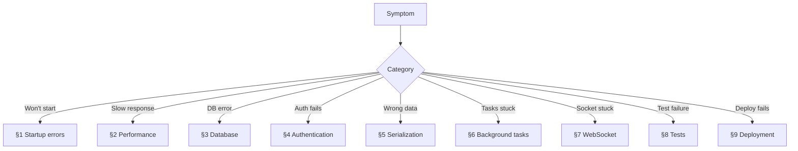
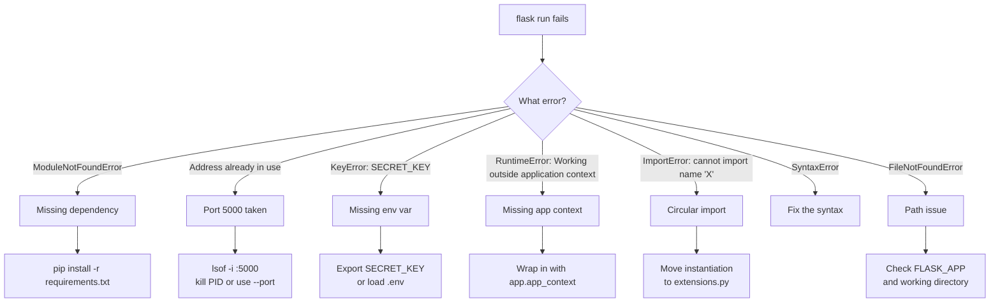
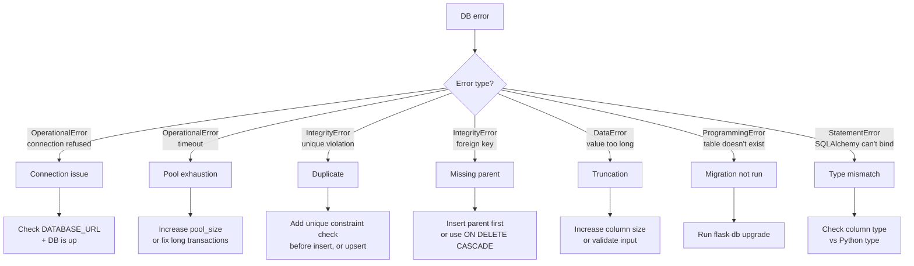
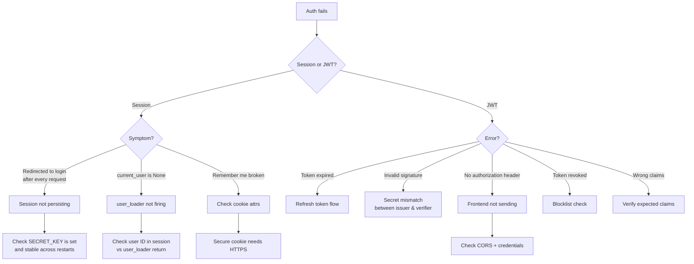
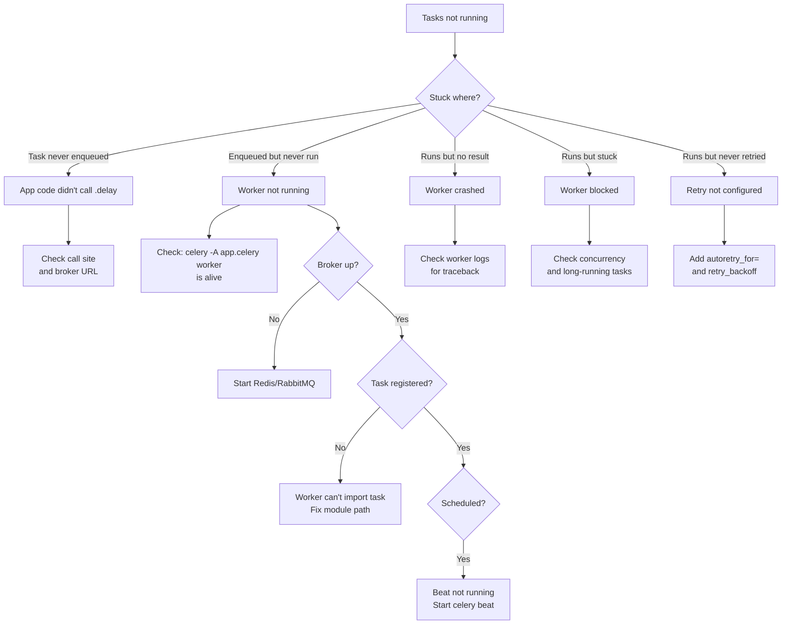
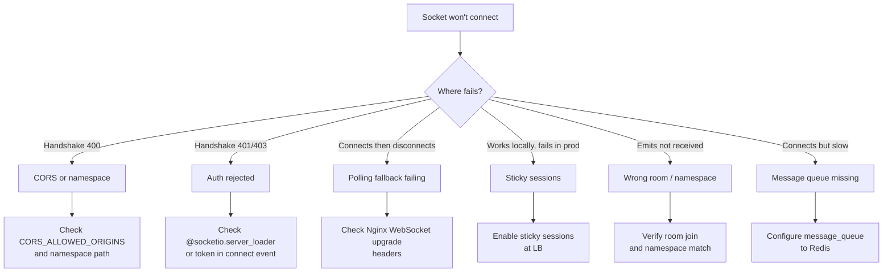
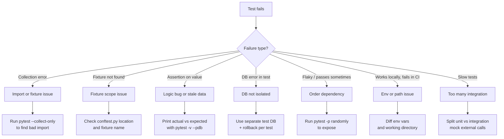
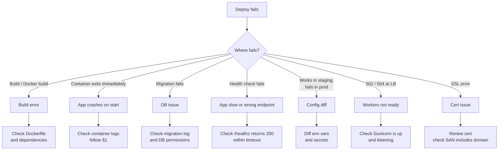
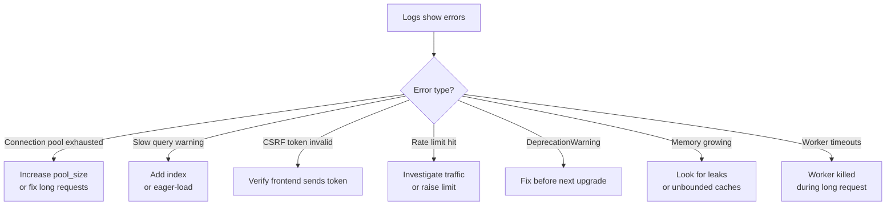

# 🌳 Troubleshooting Decision Tree

#troubleshooting #debugging #reference #cross-cutting #flask

> [!info] The "something is broken, where do I look?" page
> Each section below is a decision tree for a specific failure mode. Start from the symptom (top of the tree), follow the branches based on what you observe, and you'll land on a concrete fix with a wikilink to the deep-dive note. Every section has a Mermaid flowchart, branch explanations, and links to relevant vault notes.

---

## How to Use This Guide

1. **Identify the symptom category.** "Won't start" → §1. "Slow" → §2. "Wrong data" → §5. Pick the section that matches your symptom most closely.
2. **Follow the flowchart.** Each diamond (`{}`) is a yes/no question. Each rectangle is an action or conclusion.
3. **Read the branch explanations** below the flowchart for the *why* and the *how to verify*.
4. **Open the linked note** for the full treatment if the quick fix doesn't resolve it.



> [!tip] Before you start debugging
> Reproduce the bug locally, in a clean environment, with debug logging on. If you can't reproduce, you can't fix. See [[Structlog-Integration]] for structured logging and [[Error-Handling]] for error capture.

---

## 1. My App Won't Start

The single most common Flask failure. Almost always one of: missing env var, port conflict, syntax error, or extension init order.



### Branch explanations

- **ModuleNotFoundError** — a package isn't installed in the active venv. Run `pip install -r requirements.txt`. If you use poetry, `poetry install`. Verify with `pip list | grep <package>`. See [[Installation-Guide]].
- **Address already in use** — port 5000 (or your configured port) is held by another process. On macOS, AirPlay Receiver uses 5000 by default — disable it in System Settings or use `--port 8000`. Find the process with `lsof -i :5000` and `kill -9 <PID>`.
- **KeyError: SECRET_KEY** (or any config var) — your config reads from `os.environ["SECRET_KEY"]` but the env var isn't set. Either `export SECRET_KEY=...` in your shell, or add it to a `.env` file loaded by python-dotenv. For production, see [[Pydantic-Settings]] for validated config. See [[Security-Best-Practices]] § Secrets.
- **Working outside application context** — you called `db.session` or `current_user` outside a request or app context. Wrap the code in `with app.app_context():` (for CLI scripts, tests, Celery tasks). See [[Flask-Overview]] § Application Context.
- **ImportError: cannot import name 'X'** — almost always a circular import. The classic cause is importing models from `__init__.py` while `__init__.py` imports from views that import models. Fix by instantiating extensions in `extensions.py` (no Flask imports), then `init_app(app)` inside the factory. See [[Project-Structure]] § The extensions.py pattern.
- **SyntaxError** — Python couldn't parse the file. Check the line number in the traceback. Often a missing colon, unclosed paren, or f-string gone wrong.
- **FileNotFoundError** — usually `FLASK_APP` is set wrong, or you're running from the wrong directory. Verify with `echo $FLASK_APP` and `pwd`. See [[Flask-CLI]].

> [!warning] The "it works on my machine" trap
> 90% of startup failures in CI/production are missing env vars or missing dependencies. Always run `flask --app myapp db check` (or similar) as a smoke test in CI before deploying. See [[Production-Readiness-Checklist]].

---

## 2. My Endpoint Is Slow

Slow endpoints are usually one of: N+1 queries, missing index, missing cache, blocking I/O, or insufficient workers.

```mermaid
flowchart TD
  Slow[Endpoint slow] --> How{How slow?}
  How -- ">5s" --> Q1[Almost always DB]
  How -- "1-5s" --> Q2[DB or external API]
  How -- "<1s but should be faster" --> Q3[Cache miss]
  Q1 --> Prof[Profile with Flask-Profiler]
  Prof --> QCount{Query count?}
  QCount -- ">10 per request --> N+1
  NPlus --> Fix1[Add selectinload<br/>or joinedload]
  QCount -- "1 but slow --> Missing index
  Index --> Fix2[EXPLAIN ANALYZE<br/>+ add index]
  QCount -- "1 and fast --> Not DB
  NotDB --> Ext{External calls?}
  Ext -- Yes --> Fix3[Cache or async<br/>via Celery]
  Ext -- No --> CPU[CPU-bound?]
  CPU -- Yes --> Fix4[Offload to Celery<br/>or optimize algorithm]
  CPU -- No --> Net[Network/proxy?]
  Net --> Fix5[Check Nginx timeouts<br/>and worker count]
  Q2 --> Same[Same path as >5s]
  Q3 --> Cache[Check cache hit ratio]
  Cache --> Fix6[Tune TTL or warm cache]
```

### Branch explanations

- **Profile first.** Install [[Flask-Profiler]] or [[Flask-Silk]] and look at the per-request breakdown. Don't guess — measure. If you can't profile, add `time.perf_counter()` calls around suspect blocks.
- **High query count = N+1.** The single most common cause. Fix with `selectinload` (to-many) or `joinedload` (to-one). See [[Flask-SQLAlchemy]] § Eager Loading and [[00-FAQ]] Q6/Q7.
- **One slow query = missing index.** Run `EXPLAIN ANALYZE` on the query. Look for `Seq Scan` on large tables — that's a full table scan. Add a B-tree index on the columns in your `WHERE`/`ORDER BY`. See [[Performance-Optimization]].
- **External calls blocking.** If your endpoint calls a third-party API synchronously, it inherits the API's latency. Either cache the result ([[Flask-Caching]]) or move it to Celery ([[Celery]]). For high-throughput cases, use `httpx` with async/await (requires ASGI — see [[Flask-Overview]]).
- **CPU-bound work in the request.** If you're doing image processing, ML inference, or large data transformations, move it to a background task. The request should enqueue and return 202 Accepted. See [[Celery]].
- **Cache misses.** If you have caching but the endpoint is still slow, your cache key may be wrong (different params, different users hitting different keys) or your TTL too short. Log cache hits/misses. See [[Flask-Caching]].
- **Worker exhaustion.** If only *some* requests are slow (others are fast), you may have too few Gunicorn workers, or sync workers holding connections. Switch to `gevent` workers or add more. See [[Production-Deployment]] § Workers.

> [!tip] The 80/20 of Flask performance
> 80% of slow endpoints are fixed by: (1) adding an index, (2) fixing N+1, (3) adding a cache. Profile to find which one. See [[Performance-Optimization]].

---

## 3. My Database Query Fails

Database errors fall into three buckets: connection errors, integrity errors, and (the catch-all) "DataError" / "OperationalError".



### Branch explanations

- **Connection refused** — the database isn't running, or `DATABASE_URL` is wrong. Verify with `psql $DATABASE_URL -c 'SELECT 1'` (or the equivalent). Check that the DB container/process is up. Common in CI: the DB container hasn't finished booting before the app starts; add a healthcheck wait.
- **Connection timeout / pool exhaustion** — your connection pool is exhausted, usually because a long-running request held a connection without releasing it. Increase `SQLALCHEMY_ENGINE_OPTIONS={"pool_size": 20, "max_overflow": 10}`. Better: find the slow request and fix it. See [[Flask-SQLAlchemy]] § Connection Pool.
- **Unique violation** — you tried to insert a row with a duplicate unique key. Either check first (`if User.query.filter_by(email=...).first(): return error`) or use `ON CONFLICT DO NOTHING` (`db.session.execute(insert(User).on_conflict_do_nothing(index_elements=["email"]))`).
- **Foreign key violation** — you inserted a child row referencing a parent that doesn't exist. Insert the parent first, or restructure your transaction order. For deletions, add `ON DELETE CASCADE` to the FK so deleting a parent removes its children.
- **Value too long** — your column is `VARCHAR(50)` and you tried to store 60 chars. Either lengthen the column via migration, or validate input length before insert (Marshmallow `fields.Str(validate=validate.Length(max=50))`). See [[Marshmallow]].
- **Table doesn't exist** — the schema hasn't been migrated. Run `fl db upgrade`. If you're in a fresh environment, also run `fl db init` first (only once per project). See [[Flask-Migrate]].
- **StatementError / binding error** — usually a type mismatch: passing a `dict` where SQLAlchemy expects a JSON string, or a `datetime` where it expects a date. Check the column type and the value you're binding. See [[Flask-SQLAlchemy]] § Models.

> [!danger] The silent failure: autocommit
> If `db.session.commit()` is never called, your inserts silently disappear at request teardown. SQLAlchemy's default mode in Flask is "commit on explicit commit only." Always `db.session.commit()` after writes, and wrap in try/except with `db.session.rollback()` on error. See [[Flask-SQLAlchemy]] § Sessions.

---

## 4. Authentication Doesn't Work

Auth failures usually manifest as "I'm logged in but get redirected to login again" or "my JWT is rejected with 401."



### Branch explanations

- **Session not persisting** — the #1 cause is a missing or rotated `SECRET_KEY`. Flask signs the session cookie with this key; if it changes between requests, the cookie is invalid and the user is logged out. Verify `SECRET_KEY` is set, stable, and the same across all workers. Second cause: cookies not being set because `SESSION_COOKIE_SECURE=True` is on but you're serving HTTP (in dev). See [[Flask-Login]].
- **`current_user` is None** — the `user_loader` callback isn't finding the user. Check that `session["_user_id"]` matches what your `user_loader` expects (usually the integer primary key). If you've changed the user ID type (int → UUID), old sessions break.
- **Remember-me broken** — `SESSION_COOKIE_SECURE=True` requires HTTPS. In dev (HTTP), the cookie isn't set. Either run HTTPS locally or set `SESSION_COOKIE_SECURE=False` for the dev config. See [[Security-Best-Practices]].
- **JWT expired** — access tokens have short lifetimes (5–15 min). Implement a refresh-token endpoint that exchanges a long-lived refresh token for a new access token. See [[Flask-JWT-Extended]] § Refresh Tokens.
- **JWT invalid signature** — the secret used to sign the token differs from the secret used to verify it. Common in microservices: the auth service and the API service have different `JWT_SECRET_KEY` values. Sync them via a shared secret manager. See [[00-FAQ]] Q27.
- **No Authorization header** — the frontend isn't sending the token. Either the frontend code is broken, or CORS is stripping the header. For CORS, `supports_credentials=True` requires `Access-Control-Allow-Origin` to be a specific origin (not `*`). See [[Flask-CORS]].
- **Token revoked** — your blocklist check is rejecting it. Verify the blocklist logic and that revocation is what you intended. See [[Flask-JWT-Extended]] § Blocklist.
- **Wrong claims** — the token lacks a required claim (e.g., `roles`, `scope`). Inspect the token at jwt.io. Add custom claims via `@jwt.additional_claims_loader`. See [[Flask-JWT-Extended]] § Claims.

> [!warning] CSRF on AJAX
> If your SPA can't POST to a session-protected endpoint, it's usually CSRF. The token must be in a custom header (`X-CSRFToken`), not just the form body. See [[00-FAQ]] Q15 and [[Flask-WTF]].

---

## 5. My API Returns Wrong Data

When the response shape is wrong, fields are missing, or values are incorrect, the bug is in serialization, validation, or query filtering.

```mermaid
flowchart TD
  Wrong[Wrong API data] --> Type{How wrong?}
  Type -- "Field missing" --> M1[Schema doesn't include field]
  M1 --> M2[Add to Schema or<br/>use dump_default]
  Type -- "Wrong type (str vs int)" --> T1[Marshmallow field type<br/>or input coercion]
  T1 --> T2[Verify schema field types<br/>match model]
  Type -- "Extra fields leaking" --> L1[Missing load_only / only]
  L1 --> L2[Use only= or exclude=]
  Type -- "Dates in wrong format" --> D1[Timezone / format]
  D1 --> D2[Use fields.DateTime(format=...)<br/>or ISO-8601]
  Type -- "Null where data expected" --> N1[Eager loading not applied]
  N1 --> N2[Add selectinload<br/>before serialization]
  Type -- "Duplicate rows" --> Dup1[Cartesian product]
  Dup1 --> Dup2[Use distinct or fix join]
  Type -- "Wrong rows returned" --> F1[Filter applied incorrectly]
  F1 --> F2[Log the SQL<br/>and verify WHERE clause]
```

### Branch explanations

- **Field missing in response** — your Marshmallow schema doesn't declare it. Either add the field, or use `dump_default` to provide a default. For nested objects, ensure you've declared a `Nested` field with the right schema. See [[Marshmallow]].
- **Wrong type** — Marshmallow coerces values on dump/load. If you declared `age = fields.Integer()` but the model has `age = db.Column(db.String)`, you'll get odd results. Align schema and model types. See [[Marshmallow]] § Fields.
- **Extra fields leaking** — by default Marshmallow includes all declared fields. To exclude sensitive fields (e.g., `password_hash`), use `load_only=[...]` (sent on input, never on output) or pass `only=`/`exclude=` at dump time. See [[Security-Best-Practices]] § Output.
- **Date format wrong** — JSON has no native date type. Use `fields.DateTime(format="iso")` (default) or `"rfc822"`. For timezones, store UTC in DB and convert on output. See [[Marshmallow]].
- **Null where data expected** — almost always N+1 in disguise. You serialized a list of parents, each with a relation that wasn't eager-loaded, and the lazy load returned `None` (because the relation was empty, or because the session was closed before serialization). Eager-load first, then serialize. See [[Flask-SQLAlchemy]] § Eager Loading.
- **Duplicate rows** — your `JOIN` produced a Cartesian product. Add `.distinct()` or fix the join to use a subquery. Common when joining through a many-to-many without deduplication.
- **Wrong rows returned** — the filter doesn't say what you think it does. Log the SQL with `db.session.execute(q).statement.compile(compile_kwargs={"literal_binds": True})` and read it. Often a missing `filter_by(active=True)` or an off-by-one in pagination.

> [!tip] Pin the schema, not the model
> Never serialize models directly with `jsonify(model.__dict__)`. Always go through a Marshmallow schema. Schemas are explicit, versioned, and testable. See [[Marshmallow]] and [[API-Design-Cookbook]].

---

## 6. Background Tasks Aren't Running

Celery / RQ / Dramatiq tasks that don't execute are usually one of: broker down, worker not running, task not registered, or exception in worker.



### Branch explanations

- **Task never enqueued** — verify the code actually calls `task.delay(args)` or `task.apply_async(args)`. Add a log line right before the call. Check that `CELERY_BROKER_URL` points to a reachable broker.
- **Enqueued but never run** — no worker is consuming the queue. Run `celery -A app.celery inspect active` to see active workers. If empty, start the worker: `celery -A app.celery worker -l info`. In production, the worker is a systemd service or k8s deployment — check its status. See [[Celery]] § Workers.
- **Worker running but task stuck** — the worker is alive but not picking up tasks. Causes: (a) wrong queue name (task is on `celery` queue, worker is consuming `default`); (b) worker is busy with a long-running task and concurrency is 1 (default for prefork). Increase `--concurrency` or use `--pool=gevent`. See [[Celery]].
- **Task runs but result missing** — the worker crashed mid-execution. Check the worker logs for a traceback. Common cause: out-of-memory (worker killed by OOM killer). Reduce batch size or give the worker more memory.
- **Task never retries** — you need to opt into retries. Use `@shared_task(autoretry_for=(Exception,), retry_backoff=True, max_retries=3)`. See [[Celery]] § Retries.
- **Beat not running** — scheduled tasks need a separate `celery beat` process. Verify it's running: `celery -A app.celery inspect scheduled`. See [[Celery]] § Beat and [[Flask-APScheduler]] for in-process alternatives.
- **Task not registered** — the worker can't find the task by name. Verify the task's `name` attribute matches what you enqueue. Use `celery -A app.celery inspect registered` to list tasks the worker knows about. See [[Celery]] § Tasks.

> [!warning] The Celery app context trap
> Celery workers don't have a Flask request context by default. If your task uses `db.session` or `current_app`, you need to push an app context inside the task. Use the `task_prerun` signal or wrap your task body in `with app.app_context():`. See [[Celery]] § Flask Integration.

---

## 7. WebSocket Won't Connect

SocketIO connection failures are usually one of: CORS, transport mismatch, sticky sessions, or auth.



### Branch explanations

- **Handshake 400** — the server rejected the initial HTTP request. Most common cause: CORS. `CORS_ALLOWED_ORIGINS` must list the origin (e.g., `"https://app.example.com"`), not `"*"`, when credentials are involved. Second cause: wrong namespace path — the client connects to `/chat` but the server registers handlers on `/`.
- **Handshake 401/403** — auth failed. SocketIO doesn't use HTTP auth headers easily; the typical pattern is to send a token in the `connect` event handler: `socket = io.connect("/", { auth: { token: "..." } })`. On the server, `@socketio.on("connect")` checks the token and disconnects if invalid. See [[Flask-SocketIO]] § Auth.
- **Connects then disconnects** — the WebSocket upgrade failed and the polling fallback also failed. Usually a reverse proxy issue. Nginx needs `proxy_set_header Upgrade $http_upgrade; proxy_set_header Connection "upgrade";` for the WebSocket endpoint. See [[Production-Deployment]].
- **Works locally, fails in prod** — you have multiple workers but no sticky sessions. WebSocket connections are stateful; if a reconnect lands on a different worker, the session is lost. Enable sticky sessions at the load balancer (IP-hash or cookie-based). See [[Flask-SocketIO]] § Scaling and [[00-FAQ]] Q23.
- **Emits not received** — you emitted to a room the client didn't join, or to the wrong namespace. Verify `socketio.emit(event, data, room=room_id, namespace="/chat")` matches the client's `socket.on(event, ...)` on the same namespace. See [[Flask-SocketIO]] § Rooms.
- **Connects but slow / emits lost between workers** — you have multiple workers but no message queue configured. Without `message_queue="redis://..."`, an emit on worker A doesn't reach clients connected to worker B. Configure the message queue. See [[Flask-SocketIO]] § Scaling.

> [!tip] Use the SocketIO logger
> Enable `socketio = SocketIO(app, logger=True, engineio_logger=True)` in dev to see every event. Disable in prod (verbose). See [[Flask-SocketIO]] § Debugging.

---

## 8. Tests Are Failing

Test failures usually fall into: setup issues (DB state, fixtures), assertion failures (wrong value), or environment issues (env vars, working directory).



### Branch explanations

- **Collection error** — pytest couldn't import your test module. Run `pytest --collect-only` to see which file fails. Usually an import error in the test file itself, or in a module it imports. See [[Pytest-Flask]].
- **Fixture not found** — pytest can't find a fixture by name. Check that the fixture is in `conftest.py` (autodiscovered) or imported explicitly. Fixtures in `conftest.py` at the root are available everywhere; those in subdirectories are scoped to that subtree.
- **Assertion on value** — the test asserts X but the code produced Y. Drop into the debugger: `pytest --pdb` stops at the failure. Print actual and expected with `assert actual == expected, f"{actual} != {expected}"`. Often the test expectation is wrong (e.g., expecting a `dict` but the code returns a `dataclass`).
- **DB error in test** — usually means tests share DB state. Use a separate test database and rollback after each test. The `autouse=True` rollback fixture in [[00-FAQ]] Q9 is the standard pattern. See [[Pytest-Flask]] and [[Testing-Strategy]].
- **Flaky tests** — pass sometimes, fail others. Almost always order-dependence: test A leaves state that test B relies on. Run `pytest -p randomly` (or `pytest-randomly`) to randomize order and expose the dependency. Fix by making each test self-contained.
- **Works locally, fails in CI** — environment difference. Common culprits: missing env var in CI, different Python version, file path with different separator, missing system library. Diff `env` locally vs CI; check `python --version`. Run the same Docker image locally that CI uses.
- **Slow tests** — usually too many integration tests hitting a real DB or external API. Split into a fast unit-test suite (mocked) and a slower integration suite. Run unit tests on every save; integration tests on every push. See [[Testing-Strategy]].

> [!tip] pytest flags you should know
> `pytest -x` (stop on first failure), `pytest -k "login"` (run only tests matching pattern), `pytest --lf` (run only last-failed), `pytest -vv` (verbose). See [[Pytest-Flask]].

---

## 9. Deployment Fails

Deployment failures are usually one of: build error, missing env var, migration failure, or health-check timeout.



### Branch explanations

- **Build error** — Docker couldn't build the image. Read the build log; the line that failed is usually obvious. Common causes: a `pip install` failure (network or version pin), a missing system library (e.g., `libpq-dev` for psycopg2), or a COPY failing because the file isn't in the build context.
- **Container exits immediately** — the app crashed on startup. Run `docker logs <container>` to see the traceback. Then follow §1 of this guide. Common: missing env var, missing `flask db upgrade` step, wrong `FLASK_APP`.
- **Migration fails** — `flask db upgrade` failed. Check the migration log. Common causes: (a) the migration tries to add a NOT NULL column without a default to a non-empty table (add a default or do expand-and-contract); (b) the DB user lacks DDL permissions; (c) a previous migration was applied manually and the version table is out of sync. See [[Database-Migrations-Strategy]] and [[Flask-Migrate]] § Production.
- **Health check fails** — the load balancer can't reach `/healthz` within the timeout, so it marks the deployment unhealthy. Verify `/healthz` returns 200 quickly (under 1s). If it's slow because it checks DB connectivity, split into `/healthz` (liveness, no DB check) and `/readyz` (readiness, with DB check). See [[00-FAQ]] Q29.
- **Works in staging, fails in prod** — environment difference. Diff the env vars and secrets between staging and prod. Common: a secret that exists in staging but not prod, or a different database URL. Use [[Pydantic-Settings]] to validate config at startup so missing vars fail fast.
- **502 / 504 at load balancer** — Gunicorn isn't running or isn't listening on the expected port. SSH to the host and `curl http://127.0.0.1:8000/healthz`. If that works, the issue is between LB and host (security group, wrong port). If it doesn't, Gunicorn is down — check `systemctl status gunicorn` or `kubectl logs <pod>`.
- **SSL error** — cert expired or doesn't cover the domain. Check `openssl s_client -connect app.example.com:443` for the cert chain. Renew with certbot (Let's Encrypt) or your CA. Verify the SAN includes the exact hostname. See [[00-FAQ]] Q28.

> [!danger] The "migration ran on staging but not prod" trap
> Always run `flask db upgrade` as part of the deploy, not as a manual step. If you run it manually and forget, prod runs an old schema against new code — a guaranteed outage. See [[Production-Deployment]] § Database and [[Database-Migrations-Strategy]].

---

## 10. Logs Show Errors (but the app seems fine)

Sometimes the app works but logs are noisy. These errors are early warning signs.



### Branch explanations

- **Connection pool exhausted** — see §3. Either increase pool size or find the long request holding connections.
- **Slow query warnings** — see §2. Add an index or eager-load.
- **CSRF token invalid** — usually a misbehaving client (bot, broken frontend). If it's bots, ignore. If it's your frontend, see §4.
- **Rate limit hit** — investigate the source IP. If it's a legit user, raise the limit. If it's a bot, block at the WAF. See [[Flask-Limiter]].
- **DeprecationWarning** — fix before the next major version of the dependency. Warnings become errors eventually. Use `pytest -W error::DeprecationWarning` to catch them in CI.
- **Memory growing** — possible leak. Common causes: unbounded in-memory cache, growing session store, large global list. Profile with `tracemalloc`. See [[Performance-Optimization]].
- **Worker timeouts** — Gunicorn's `--timeout 30` killed a worker that took too long. Either raise the timeout, optimize the endpoint, or move work to Celery. See [[Production-Deployment]].

> [!info] Don't ignore log noise
> Logs that look like noise today become outages tomorrow. Set up structured logging ([[Structlog-Integration]]) and alert on error rate, not just on individual errors.

---

## Cross-Cutting Diagnostic Toolkit

Regardless of the symptom, these tools help:

| Tool | Use | Note |
|---|---|---|
| `flask --app myapp shell` | Inspect models, run queries interactively | [[Flask-Shell]] |
| `flask db current` / `flask db history` | See migration state | [[Flask-Migrate]] |
| [[Flask-DebugToolbar]] | Per-request SQL count, headers, config (dev only) | — |
| [[Flask-Silk]] | Per-request SQL + profiling (dev/staging) | — |
| [[Flask-Profiler]] | Per-endpoint performance metrics | — |
| [[Structlog-Integration]] | Structured logs searchable in central store | — |
| `celery -A app.celery inspect active` | Live Celery worker state | [[Celery]] |
| `redis-cli MONITOR` | See every Redis command (use carefully) | [[Flask-Redis]] |
| `pytest --pdb` | Drop into debugger at failure | [[Pytest-Flask]] |
| `docker logs -f <container>` | Tail container stdout/stderr | [[Production-Deployment]] |

---

## When You're Stuck

If none of the trees above resolve your issue:

1. **Reproduce in a clean environment.** A new venv, a fresh DB, a single-file reproduction. If the bug disappears, it's environmental — diff your env against the clean one.
2. **Read the actual traceback.** Most "mystery" bugs have a clear error message that was skimmed over. Read every line.
3. **Search the relevant extension's GitHub Issues.** Most bugs have been seen before. Search for the exact error string.
4. **Ask with a minimal repro.** If you post on Stack Overflow or the Pallets Discord, include: the exact error, the minimal code to reproduce, your versions (`flask --version`, `pip freeze`), and what you've tried.

> [!quote] The debugging mindset
> "When you have eliminated the impossible, whatever remains, however improbable, must be the truth." — Sherlock Holmes. Don't skip the impossible-looking branches; that's where the bug usually lives.

---

## See Also

- [[00-Map-of-Content]] — the canonical index
- [[00-FAQ]] — answers to common questions
- [[00-Glossary]] — terminology reference
- [[Error-Handling]] — error capture, logging, and user-facing error pages
- [[Performance-Optimization]] — deep dive on profiling and performance
- [[Security-Best-Practices]] — security hardening (when "doesn't work" means "got pwned")
- [[Production-Readiness-Checklist]] — go-live gate (catch issues before they become incidents)
- [[Database-Migrations-Strategy]] — production migration patterns
- [[Testing-Strategy]] — test architecture and what to test

*Return to [[00-Map-of-Content]] · Last updated 2024-01-15*
