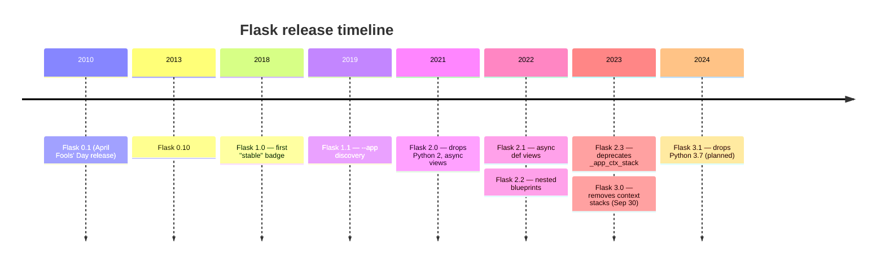
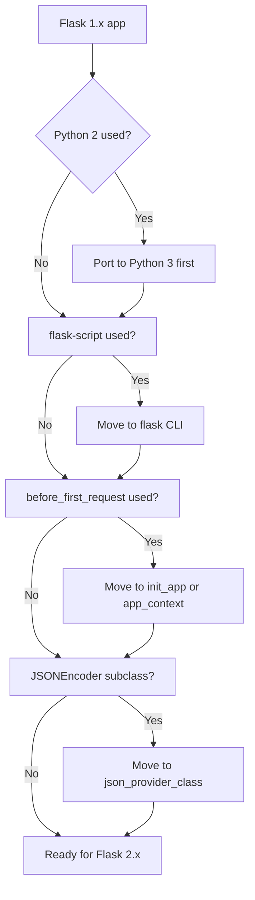
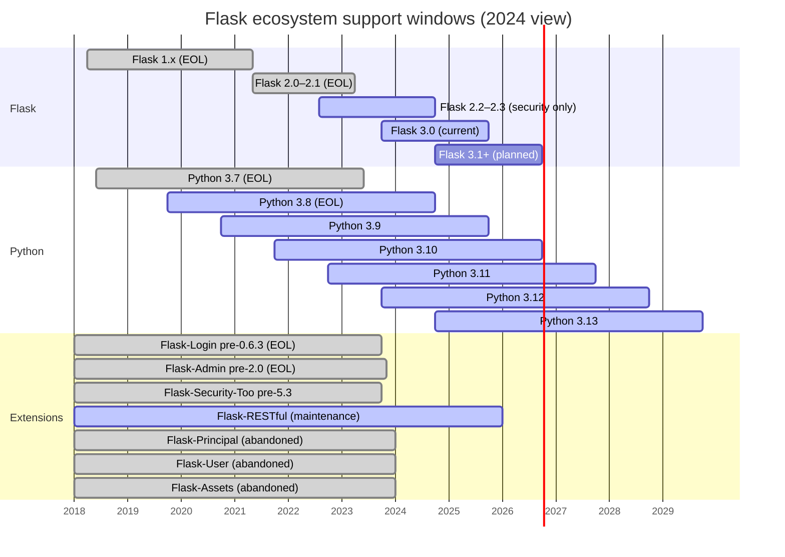

# 📊 Version Compatibility Matrix

#reference #compatibility #versions #flask #migration

> [!info] The cross-cutting version reference
> This note answers "which versions work with which?" for Flask, Python, and every extension documented in this vault. It is the authoritative reference when an upgrade breaks your app or when you're starting a new project and need to pin a known-good stack.

> [!warning] Versions move fast
> The data here reflects the state of the ecosystem as of early 2024 (Flask 3.0.x, Python 3.12, SQLAlchemy 2.0). Always cross-reference with each project's changelog and the [PyPI release history](https://pypi.org/project/Flask/#history) before pinning. The *patterns* in this vault are durable; the *exact version tuples* drift.

---

## 1. Flask Version History

Flask has three major release lines still in the wild. Knowing which line you're on is the first step in any debugging session.

### Flask 1.x (2018–2021)

The "classic" Flask. Flask 1.0 (April 2018) was the first release Pallets considered production-stable enough to warrant a 1.0 badge — six years after the project started. Flask 1.1 (July 2019) added `--app` discovery helpers and JSON body parsing. Flask 1.1.2 was the last 1.x patch (April 2020).

Key characteristics of the 1.x line:

- **CLI**: `flask` command shipped as a first-class citizen (replacing the deprecated `flask-script`).
- **App factory**: documented as the canonical pattern, supplanting module-level `app = Flask(__name__)`.
- **`_app_ctx_stack` and `_request_ctx_stack`**: the "global" proxies (`current_app`, `request`, `g`, `session`) were implemented as `LocalStack` objects backed by these stacks.
- **Python support**: 2.7 and 3.5+ — the last line to support Python 2.
- **Async**: none. WSGI sync only.

### Flask 2.x (May 2021–September 2023)

Flask 2.0 was the first major version to drop Python 2 and synchronise with the modern Werkzeug 2.x line. Flask 2.1 (March 2022) brought async views via `@app.route(..., methods=["GET"]) async def view(...)`. Flask 2.2 (August 2022) added `flask --app` auto-detection of `app.py`/`wsgi.py` and `Blueprint`-level nested blueprints. Flask 2.3 (April 2023) was the last 2.x minor — it deprecated `_app_ctx_stack` and `_request_ctx_stack` ahead of the 3.0 removal.

Key characteristics of the 2.x line:

- **Async support**: `async def` views, `before_request` etc. — but still WSGI under the hood (each async view runs in an event loop per request).
- **`--app` auto-detection**: `app.py`, `wsgi.py`, `application.py` discovered automatically.
- **Nested blueprints**: `parent.register_blueprint(child)`.
- **`teardown_appcontext`**: guaranteed to run even if `before_request` raised.
- **Python support**: 3.7+ for 2.0–2.1; 3.8+ for 2.2–2.3.

### Flask 3.x (September 2023–present)

Flask 3.0 (September 30, 2023) is the current line. Flask 3.1 is in development as of this writing. The headline change is the removal of the long-deprecated context-stack globals — every extension that touched `_app_ctx_stack` directly had to ship a 3.0-compatible release.

Key characteristics of the 3.x line:

- **`_app_ctx_stack` and `_request_ctx_stack` removed.** Extensions must use `current_app._get_current_object()` or proper context-propagation patterns.
- **`app.json` provider**: `app.json.dumps()` / `app.json.loads()` replacing the old `JSONEncoder` class.
- **`BLUEPRINT_NAME` removed from url_for**: blueprints no longer inject a prefix automatically; use explicit `url_prefix`.
- **`app.config.from_file()`**: accepts a callable to parse custom formats (TOML, YAML) without an extension.
- **Path utilities**: `werkzeug.utils.safe_join` replaced with `werkzeug.utils.secure_filename`-style API; `send_file` is stricter about absolute paths.
- **Python support**: 3.8+ (3.8 dropped in Flask 3.1).



---

## 2. Python Version Compatibility

Python releases on a 12-month cadence (October each year). Each release gets 5 years of support from the upstream Python project. Flask, in turn, supports the latest two minor Python releases plus a couple of older ones.

| Python | Released | EOL | Flask 1.x | Flask 2.0–2.1 | Flask 2.2–2.3 | Flask 3.0 | Flask 3.1+ |
|---|---|---|---|---|---|---|---|
| 3.7 | Jun 2018 | Jun 2023 | ✅ | ✅ | ❌ | ❌ | ❌ |
| 3.8 | Oct 2019 | Oct 2024 | ✅ | ✅ | ✅ | ✅ | ❌ |
| 3.9 | Oct 2020 | Oct 2025 | ✅ | ✅ | ✅ | ✅ | ✅ |
| 3.10 | Oct 2021 | Oct 2026 | ❌ | ✅ | ✅ | ✅ | ✅ |
| 3.11 | Oct 2022 | Oct 2027 | ❌ | ✅ | ✅ | ✅ | ✅ |
| 3.12 | Oct 2023 | Oct 2028 | ❌ | ❌ | ✅ | ✅ | ✅ |
| 3.13 | Oct 2024 | Oct 2029 | ❌ | ❌ | ❌ | ✅ (3.0.3+) | ✅ |

> [!tip] Pinning Python for new projects
> For a new project started in 2024, target **Python 3.12** (latest stable, supports the free-threaded build for early experimentation) or **3.11** (maximum extension compatibility). Avoid 3.8 — it hits EOL in October 2024 and several extensions have already dropped it. See [[Installation-Guide]] for the recommended `pyproject.toml` `requires-python` line.

---

## 3. Extension Compatibility Matrix

The big table. Each row is an extension documented in this vault; columns show the Flask version(s) it supports, the minimum Python, and notes on known incompatibilities. "✅" means a tested-and-working combination; "⚠️" means works but with caveats; "❌" means broken or unsupported.

| Extension | Latest tested | Flask 1.x | Flask 2.x | Flask 3.x | Min Python | Notes |
|---|---|---|---|---|---|---|
| [[Flask-SQLAlchemy]] | 3.1.x | ⚠️ v2.x only | ✅ 3.0+ | ✅ 3.1+ | 3.8 | v2.x supports Flask 1; v3.x requires Flask 2.2+. Uses SQLAlchemy 2.0. |
| [[Flask-Migrate]] | 4.0.x | ✅ | ✅ | ✅ | 3.7 | Pinned to Flask-SQLAlchemy version, not Flask directly. |
| [[Flask-Login]] | 0.6.x | ✅ | ✅ | ✅ 0.6.3+ | 3.7 | 0.6.3 fixed the `_app_ctx_stack` removal. Use 0.6.3+ on Flask 3. |
| [[Flask-JWT-Extended]] | 4.6.x | ✅ | ✅ | ✅ | 3.8 | No context-stack usage; clean on 3.x. |
| [[Flask-WTF]] | 1.2.x | ✅ | ✅ | ✅ | 3.8 | WTForms 3+ required. |
| [[Flask-RESTful]] | 0.3.10 | ✅ | ✅ | ⚠️ | 3.7 | Maintenance mode. `_app_ctx_stack` was used internally; 0.3.10 patched for Flask 3. Prefer [[Flask-Smorest]] or [[Flask-RESTX]] for new code. |
| [[Flask-CORS]] | 4.0.x | ✅ | ✅ | ✅ | 3.8 | Clean on 3.x. |
| [[Flask-Mail]] | 0.9.x | ✅ | ✅ | ⚠️ | 3.7 | Unmaintained since 2017 but still works on 3.x for basic SMTP. Prefer `emails` or `aiosmtplib`. |
| [[Flask-Caching]] | 2.1.x | ✅ | ✅ | ✅ | 3.8 | Clean. |
| [[Flask-Limiter]] | 3.5.x | ✅ | ✅ | ✅ | 3.8 | Clean. |
| [[Flask-Uploads]] | 0.2.1 | ✅ | ⚠️ | ❌ | 3.7 | Abandoned. Use [[Flask-Uploads]] alternatives in [[File-Handling-Cookbook]] (e.g. `flask-reuploaded` fork, or direct `werkzeug.secure_filename` + S3). |
| [[Flask-Admin]] | 2.0.x | ✅ | ✅ | ✅ 2.0+ | 3.8 | 1.6.x breaks on Flask 3; 2.0 (Nov 2023) is the Flask-3-compatible release. |
| [[Marshmallow]] | 3.20.x | n/a | n/a | n/a | 3.8 | Framework-agnostic. Use `marshmallow-sqlalchemy` 1.0+ for SQLAlchemy 2.0. |
| [[Celery]] | 5.3.x | ✅ | ✅ | ✅ | 3.8 | 5.3 added Flask-3 compatibility; 5.2 has issues with context stacks. |
| [[Flask-SocketIO]] | 5.3.x | ✅ | ✅ | ✅ | 3.7 | Uses its own request context; mostly unaffected by Flask-3 changes. |
| [[Flask-RESTX]] | 1.3.x | ✅ | ✅ | ✅ | 3.8 | Successor to Flask-RESTful; actively maintained. |
| [[Flask-Smorest]] | 0.13.x | ✅ | ✅ | ✅ | 3.8 | Clean. |
| [[Flask-Pydantic-Spec]] | 0.5.x | ✅ | ✅ | ✅ | 3.8 | Clean. Pydantic v2 supported since 0.4. |
| [[Flask-Rebar]] | 2.0.x | ✅ | ✅ | ✅ | 3.8 | Clean. |
| [[Flask-Authlib]] | 1.3.x | ✅ | ✅ | ✅ | 3.8 | Clean. |
| [[Flask-Dance]] | 7.0.x | ⚠️ | ✅ | ✅ 7.0+ | 3.8 | 6.x has Flask-3 issues; 7.0 (Nov 2023) fixed them. |
| [[Flask-HTTPAuth]] | 4.8.x | ✅ | ✅ | ✅ | 3.8 | Clean. |
| [[Flask-Principal]] | 0.4.0 | ✅ | ✅ | ⚠️ | 3.7 | Abandoned. `_app_ctx_stack` used internally — works on 3.x by accident but may break. Use [[Flask-Login]] roles or roll your own. |
| [[Flask-Session]] | 0.5.x | ✅ | ✅ | ✅ | 3.7 | Clean. |
| [[Flask-MongoEngine]] | 1.0.x | ✅ | ✅ | ⚠️ | 3.7 | Slow updates; verify against latest Flask before pinning. |
| [[Flask-PynamoDB]] | 0.4.x | ✅ | ✅ | ✅ | 3.7 | PynamoDB is framework-agnostic; thin Flask wrapper. |
| [[Flask-Redis]] | 0.4.x | ✅ | ✅ | ⚠️ | 3.7 | Unmaintained. Prefer `redis-py` directly with `g.event` for pub/sub. |
| [[Flask-Elasticsearch]] | 2.4.x | ✅ | ✅ | ✅ | 3.8 | Clean. |
| [[Whoosh-Search]] | 2.7.x | n/a | n/a | n/a | 3.10 | Pure Python, Flask-agnostic. |
| [[Flask-Assets]] | 2.0.x | ✅ | ⚠️ | ❌ | 3.7 | webassets is unmaintained. Use [[Flask-Vite]]. |
| [[Flask-Compress]] | 1.14.x | ✅ | ✅ | ✅ | 3.8 | Clean. |
| [[Flask-Babel]] | 4.0.x | ✅ | ✅ | ✅ | 3.8 | 4.0 added Flask 3 + Python 3.12 support. |
| [[Flask-Moment]] | 1.0.x | ✅ | ✅ | ⚠️ | 3.7 | Moment.js itself is in maintenance; prefer client-side date-fns/day.js. |
| [[Flask-Vite]] | 0.4.x | ✅ | ✅ | ✅ | 3.8 | Clean. |
| [[Flask-Talisman]] | 1.1.x | ✅ | ✅ | ✅ | 3.7 | Clean. |
| [[Flask-SeaSurf]] | 1.1.x | ✅ | ✅ | ✅ | 3.7 | Clean. |
| [[Flask-Bcrypt]] | 0.7.1 | ✅ | ✅ | ⚠️ | 3.7 | Unmaintained. Use `bcrypt` library directly; see [[Security-Best-Practices]]. |
| [[Flask-Security-Too]] | 5.3.x | ✅ | ✅ | ✅ | 3.8 | 5.3 added Flask-3 support. |
| [[Flask-User]] | 0.6.x | ✅ | ⚠️ | ❌ | 3.7 | Unmaintained. Use [[Flask-Security-Too]]. |
| [[Flask-RQ]] | 0.4.x | ✅ | ✅ | ⚠️ | 3.7 | Thin wrapper. Verify against latest RQ. |
| [[Flask-Dramatiq]] | 0.6.x | ✅ | ✅ | ✅ | 3.8 | Clean. |
| [[Flask-Huey]] | 2.5.x | ✅ | ✅ | ✅ | 3.7 | Clean. |
| [[Flask-APScheduler]] | 1.13.x | ✅ | ✅ | ✅ | 3.7 | Clean. |
| [[Flask-DebugToolbar]] | 0.13.x | ✅ | ✅ | ⚠️ | 3.7 | 0.14 (in dev) adds Flask-3 support; 0.13 has minor issues. |
| [[Flask-Silk]] | 0.2.x | ✅ | ✅ | ⚠️ | 3.7 | Mostly works; not actively tested on 3.x. |
| [[Flask-Profiler]] | 1.8.x | ✅ | ✅ | ⚠️ | 3.7 | Works but no recent releases. |
| [[Structlog-Integration]] | 24.1.x | n/a | n/a | n/a | 3.8 | structlog is Flask-version-agnostic; integration layer is clean. |
| [[Flask-GraphQL]] | 2.0.x | ✅ | ✅ | ⚠️ | 3.7 | Legacy. Prefer [[Ariadne-Flask]]. |
| [[Ariadne-Flask]] | 0.20.x | ✅ | ✅ | ✅ | 3.8 | Clean. |
| [[Flask-SSE]] | 1.0.x | ✅ | ✅ | ✅ | 3.7 | Streaming is a Werkzeug feature; clean on 3.x. |
| [[Flask-MQTT]] | 0.3.x | ✅ | ✅ | ⚠️ | 3.7 | No recent updates; verify on 3.x. |
| [[Flask-Injector]] | 0.14.x | ✅ | ✅ | ✅ | 3.7 | Clean. |
| [[Flask-FeatureFlags]] | 0.6.x | ✅ | ⚠️ | ❌ | 3.7 | Abandoned. Use `unleash-client-python` or roll your own. |
| [[Pydantic-Settings]] | 2.1.x | n/a | n/a | n/a | 3.8 | Framework-agnostic. |
| [[Flask-Environments]] | 0.4.x | ✅ | ⚠️ | ⚠️ | 3.7 | Unmaintained. Prefer [[Pydantic-Settings]]. |

> [!note] Why so many "⚠️ on Flask 3"?
> The pattern is almost always the same: an extension reached into `_app_ctx_stack` or `_request_ctx_stack` (the internal "global" stacks Flask used to back `current_app` / `request` / `g` / `session`). Flask 3.0 removed these stacks in favour of `current_app._get_current_object()` and explicit context propagation. Any extension that imported `_app_ctx_stack` directly raises `ImportError` on Flask 3.0 — see §5 below.

---

## 4. Migration Guides

### 4.1 Flask 1.x → 2.x

The 1.x → 2.x jump (May 2021) was the bigger of the two recent migrations. Headline changes:

| What changed | Migration action |
|---|---|
| **Python 2 dropped** | Move to Python 3.6+ (3.7+ for 2.1, 3.8+ for 2.2). |
| **`flask-script` removed** | Use the `flask` CLI directly. Custom commands go in `app/cli.py` and use `@app.cli.command()`. See [[Flask-CLI]]. |
| **Async views introduced (2.1)** | No action required to keep sync code working. If you want async, install `flask[async]` (pulls in `asgiref`). |
| **`before_first_request` deprecated (2.3)** | Replace with `init_app` patterns or `with app.app_context()` in your CLI. |
| **Werkzeug 2.x** | Check any `werkzeug.utils` imports — `safe_join` and `secure_filename` semantics shifted. |
| **`flask.json.JSONEncoder` deprecated** | Subclassing `JSONEncoder` still works in 2.x but is gone in 3.x. Move to `app.json_provider_class`. |
| **`url_for(..., _external=True)` in tests** | Behaviour with `SERVER_NAME` changed; set `SERVER_NAME='localhost'` in test config. |



### 4.2 Flask 2.x → 3.x

The 2.x → 3.x jump (September 2023) is the one most teams are currently facing. Headline changes:

| What changed | Migration action |
|---|---|
| **`_app_ctx_stack` and `_request_ctx_stack` removed** | Audit third-party extensions. See §5 below. |
| **`flask.json.JSONEncoder` removed** | Subclass `flask.json.provider.DefaultJSONProvider` and set `app.json = MyProvider(app)`. |
| **`BLUEPRINT_NAME` no longer auto-prefixed in `url_for`** | Pass explicit `url_prefix` to `register_blueprint`. |
| **`before_first_request` removed** | Already deprecated in 2.3; remove all uses. |
| **`flask.Markup` removed** | Import `markupsafe.Markup` directly. |
| **`c.G` removed** | Use `g` from `flask` directly. |
| **`app.config.from_pyfile` no longer searches `instance/`** | Pass explicit path or use `from_file`. |
| **`send_file` stricter** | Absolute paths now raise `ValueError`; use `send_from_directory`. |
| **`app.test_client()` no longer defaults to `use_cookies=True`** | Pass explicitly if you need cookies. |

> [!tip] Use `flask --version` to confirm
> Run `flask --version` in your venv. It prints Flask, Werkzeug, and Python versions. Pair this with `pip freeze | grep -i flask` to audit your installed extension versions in one shot. See [[Installation-Guide]] for a `pip-tools` workflow that pins the whole stack.

---

## 5. The `_app_ctx_stack` Removal in Flask 3.x

The single most disruptive change in Flask 3.0 was the removal of the internal context-stack globals. For ten years, Flask's "magic globals" — `current_app`, `request`, `g`, `session` — were implemented as proxies that looked up the top of a thread-local stack (`_app_ctx_stack` for app context, `_request_ctx_stack` for request context). Many extensions imported these stacks directly:

```python
# Old (Flask 2.x) — broken on Flask 3.0
from flask import _app_ctx_stack

def get_current_app():
    return _app_ctx_stack.top.app
```

Flask 3.0 removed both stacks. The correct pattern is:

```python
# New (Flask 3.x) — works on 2.x and 3.x
from flask import current_app

def get_current_app():
    return current_app._get_current_object()
```

### Extensions affected by the removal

| Extension | Status | Workaround / fix |
|---|---|---|
| [[Flask-Login]] | ✅ Fixed in 0.6.3 | Upgrade to ≥0.6.3. |
| [[Flask-Admin]] | ✅ Fixed in 2.0 | Upgrade to ≥2.0. |
| [[Flask-Security-Too]] | ✅ Fixed in 5.3 | Upgrade to ≥5.3. |
| [[Flask-Dance]] | ✅ Fixed in 7.0 | Upgrade to ≥7.0. |
| [[Flask-RESTful]] | ⚠️ Fixed in 0.3.10 | Upgrade, but consider migrating to [[Flask-RESTX]] or [[Flask-Smorest]]. |
| [[Flask-Principal]] | ❌ Unmaintained | No fix. Use [[Flask-Login]] roles or roll your own RBAC. |
| [[Flask-User]] | ❌ Unmaintained | No fix. Migrate to [[Flask-Security-Too]]. |
| [[Flask-Assets]] | ❌ Unmaintained | Migrate to [[Flask-Vite]]. |
| [[Flask-FeatureFlags]] | ❌ Unmaintained | Migrate to `unleash-client-python` or roll your own. |
| [[Flask-Uploads]] | ❌ Unmaintained | Use `flask-reuploaded` fork or direct file handling. |
| [[Flask-Mail]] | ⚠️ Works by accident | No `_app_ctx_stack` usage but unmaintained; migrate to `emails` or `aiosmtplib`. |

> [!danger] Audit before upgrading
> Before flipping a project from Flask 2.x to 3.x, run `grep -rn "_app_ctx_stack\|_request_ctx_stack" venv/` against your installed packages. Any hit is a guaranteed `ImportError` on Flask 3.0 startup. Pin the offending package to a fixed version (see table above) or replace it before upgrading Flask.

---

## 6. Recommended Version Stacks for New Projects (2024)

If you're starting a new Flask project in 2024, here is the known-good stack:

### The "Modern Sync" stack

For a server-rendered Flask app with sessions, forms, and a database:

```toml
# pyproject.toml
[project]
requires-python = ">=3.12"
dependencies = [
    "Flask==3.0.3",
    "Flask-SQLAlchemy==3.1.1",
    "Flask-Migrate==4.0.7",
    "Flask-Login==0.6.3",
    "Flask-WTF==1.2.1",
    "Flask-Caching==2.1.0",
    "Flask-Limiter==3.5.0",
    "Flask-Compress==1.14",
    "Flask-Vite==0.4.1",
    "marshmallow==3.20.2",
    "marshmallow-sqlalchemy==1.0.0",
    "pydantic-settings==2.1.0",
    "structlog==24.1.0",
    "gunicorn==21.2.0",
]
```

### The "Modern API" stack

For a JSON API with OpenAPI, JWT auth, and async workers:

```toml
[project]
requires-python = ">=3.12"
dependencies = [
    "Flask[async]==3.0.3",
    "Flask-SQLAlchemy==3.1.1",
    "Flask-Migrate==4.0.7",
    "Flask-JWT-Extended==4.6.0",
    "Flask-Smorest==0.13.0",
    "Flask-CORS==4.0.1",
    "Flask-Limiter==3.5.0",
    "marshmallow==3.20.2",
    "marshmallow-sqlalchemy==1.0.0",
    "apispec==6.4.0",
    "gunicorn==21.2.0",
]
```

### The "Real-time" stack

If you need WebSockets alongside REST:

```toml
[project]
requires-python = ">=3.12"
dependencies = [
    "Flask==3.0.3",
    "Flask-SQLAlchemy==3.1.1",
    "Flask-Migrate==4.0.7",
    "Flask-Login==0.6.3",
    "Flask-SocketIO==5.3.6",
    "python-socketio==5.11.0",
    "eventlet==0.36.1",  # or "gevent==23.9.1"
    "redis==5.0.3",  # message queue for multi-worker SocketIO
]
```

> [!tip] Pin everything
> The above stacks are pin-frozen at the time of writing. For your own project, run `pip-compile` (from `pip-tools`) against a `requirements.in` listing only the top-level packages, and commit the resulting `requirements.txt`. See [[Installation-Guide]] §"Version pinning" for the workflow.

---

## 7. Deprecation Timeline

What's going away, and when:



### Specific deprecations to plan for

| Item | Deprecated in | Removed in | Replacement |
|---|---|---|---|
| `flask._app_ctx_stack` | Flask 2.3 (April 2023) | Flask 3.0 (Sep 2023) | `current_app._get_current_object()` |
| `flask._request_ctx_stack` | Flask 2.3 | Flask 3.0 | `request._get_current_object()` |
| `before_first_request` | Flask 2.3 | Flask 3.0 | `init_app()` patterns |
| `flask.json.JSONEncoder` | Flask 2.2 | Flask 3.0 | `flask.json.provider.DefaultJSONProvider` |
| `flask.Markup` | Flask 2.3 | Flask 3.0 | `markupsafe.Markup` |
| `BLUEPRINT_NAME` url_for prefix | Flask 2.3 | Flask 3.0 | explicit `url_prefix` |
| `app.config.from_pyfile` instance search | Flask 2.3 | Flask 3.0 | explicit path or `from_file` |
| `flask-session` v0.4 API | 0.5 (2023) | 0.6 (planned) | v0.5+ `Session(app)` API |
| `WTForms` 2.x | 2020 | n/a | WTForms 3.x (required by Flask-WTF 1.x) |
| `SQLAlchemy` 1.4 legacy API | 1.4 (2021) | 2.1 (planned 2024) | SQLAlchemy 2.0 style |

> [!warning] SQLAlchemy 2.0 is non-trivial
> Moving from SQLAlchemy 1.4 to 2.0 affects query syntax (`Query.get()` → `Session.get()`, `Query.filter_by()` still works, but `session.execute(select(...))` is the new idiom). Flask-SQLAlchemy 3.x is built for SQLAlchemy 2.0. If you're still on Flask-SQLAlchemy 2.x with the legacy `Query` API, plan a dedicated migration sprint — see [[Flask-SQLAlchemy]] §"SQLAlchemy 2.0 migration".

---

## 8. Decision Tree: "Can I Upgrade Flask?"

```mermaid
flowchart TD
    START[Considering Flask upgrade] --> V{Current version?}
    V -- 1.x --> Q1{Ready to drop Python 2?}
    Q1 -- No --> STAY1[Stay on Flask 1.1.4]
    Q1 -- Yes --> UP1[Upgrade to 2.3.x first, then 3.0]
    V -- 2.x --> Q2{Using _app_ctx_stack?}
    Q2 -- Yes --> FIX[Fix extension imports first]
    Q2 -- No --> Q3{Using before_first_request?}
    Q3 -- Yes --> FIX2[Replace with init_app]
    Q3 -- No --> Q4{Using JSONEncoder subclass?}
    Q4 -- Yes --> FIX3[Migrate to DefaultJSONProvider]
    Q4 -- No --> Q5{Extensions on fixed versions?}
    Q5 -- No --> UPGEXT[Upgrade Flask-Login/Admin/Security/Dance]
    Q5 -- Yes --> UP3[Upgrade to Flask 3.0.3+]
    UP1 --> Q2
    FIX --> Q3
    FIX2 --> Q4
    FIX3 --> Q5
    UPGEXT --> UP3
    UP3 --> TEST[Run full test suite]
    TEST --> PASS{All green?}
    PASS -- Yes --> SHIP[Ship it]
    PASS -- No --> DEBUG[See [[00-Troubleshooting-Decision-Tree]]]
```

---

## 9. See Also

- [[00-Map-of-Content]] — canonical vault index
- [[00-FAQ]] — question-based entry point (incl. "should I upgrade?" and "which Python version?")
- [[00-Glossary]] — terms like WSGI, ASGI, ORM, Migration defined
- [[00-Troubleshooting-Decision-Tree]] — symptom-based debugging (incl. "app won't start after upgrade")
- [[Installation-Guide]] — `pyproject.toml` template, `pip-compile` workflow, Docker base images
- [[Flask-Overview]] — what Flask is, why the versioning matters
- [[Project-Structure]] — where version pins live in a real repo
- [[Production-Deployment]] — pinning versions across dev / staging / prod environments
- [[Production-Readiness-Checklist]] — 100-item checklist includes "all deps on supported versions"
- [[Database-Migrations-Strategy]] — schema migration patterns that survive Flask / SQLAlchemy upgrades
- [[Security-Best-Practices]] — security implications of running on EOL software

---

*Return to [[00-Map-of-Content]] · Last updated 2024-01-15*
