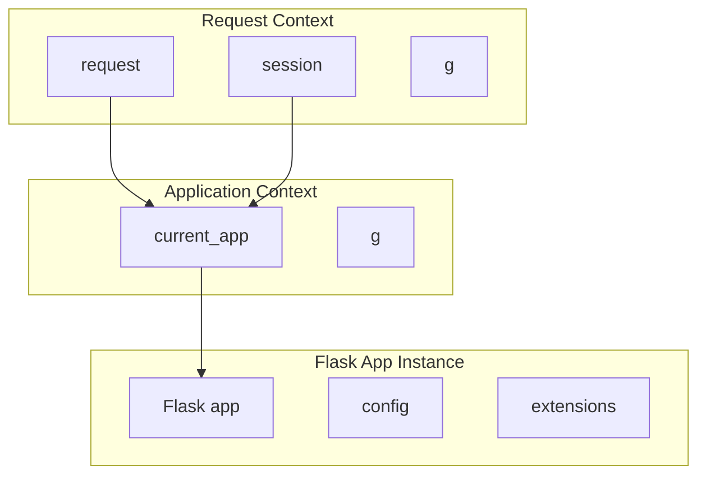

# Application Context

> While the request context handles per-request data, the application context handles application-level state. Understanding the application context — what it provides, when it is active, and how it differs from the request context — is crucial for writing clean, testable Flask code.

## Learning Objectives

After completing this chapter, you will be able to:

- Explain the purpose of the application context and how it differs from the request context
- Use `current_app` to access the Flask application from anywhere
- Understand when Flask automatically pushes the application context
- Manually push and pop application contexts for testing and background tasks
- Explain the `g` object in the context of application vs. request scopes

## What Is the Application Context?

The **application context** keeps track of application-level data during a request, CLI command, or other activity. It provides access to:

| Object | Purpose |
|--------|---------|
| `current_app` | Points to the Flask application handling the activity |
| `g` | Application-scoped temporary storage (also available in request context) |

Where the request context tracks request-specific data (the current HTTP request), the application context tracks application-specific data (configuration, extensions, database connections).

## Why a Separate Context?

Flask needs an application context for scenarios where there is no HTTP request:

1. **Background tasks**: Sending emails, processing queues
2. **CLI commands**: Database migrations, custom management commands
3. **Testing**: Creating test data, testing utility functions
4. **Multiple applications**: Testing or running multiple Flask apps in the same process

## `current_app`

`current_app` is a proxy to the active Flask application:

```python
from flask import current_app

def log_message(message):
    """Log a message using the current app's logger."""
    current_app.logger.info(message)

def get_config(key, default=None):
    """Read configuration from the current app."""
    return current_app.config.get(key, default)
```

This is essential when your code is not in a view function and does not have direct access to the `app` object:

```python
# models.py — no access to app instance
from flask import current_app
from flask_sqlalchemy import SQLAlchemy

db = SQLAlchemy()

class User(db.Model):
    id = db.Column(db.Integer, primary_key=True)
    
    def send_email(self, subject, body):
        # Access app config for mail settings
        sender = current_app.config['MAIL_DEFAULT_SENDER']
        # ... send email
```

## Automatic Application Context

Flask automatically pushes an application context in these situations:

1. **During a request**: The request context pushes an app context if one is not already active
2. **CLI commands**: `flask` commands run inside an app context
3. **Test client**: `app.test_client()` pushes an app context automatically

```python
# Inside a view — app context is automatic
@app.route('/')
def index():
    current_app.logger.info('Handling request')  # Works!
    return 'OK'

# CLI command — app context is automatic
@app.cli.command('config')
def show_config():
    for key, value in current_app.config.items():
        print(f'{key} = {value}')

# Test client — app context is automatic
with app.test_client() as client:
    response = client.get('/')  # App context active
```

## Manual Application Context

When Flask does not automatically push an app context, you must do it manually:

```python
# Background task
from flask import current_app

def send_email_async(app, recipient, subject, body):
    with app.app_context():
        # Now current_app is available
        mail.send(recipient, subject, body)

# Called from a view
def queue_email(recipient, subject, body):
    threading.Thread(
        target=send_email_async,
        args=(current_app._get_current_object(), recipient, subject, body)
    ).start()
```

> [!WARNING]
> Pass `current_app._get_current_object()` to threads, not `current_app` itself. The proxy is thread-local; `_get_current_object()` returns the real app instance.

### Using `app_context()` in Tests

```python
def test_config(app):
    with app.app_context():
        assert current_app.config['TESTING'] is True
        assert current_app.config['SQLALCHEMY_DATABASE_URI'] == 'sqlite:///:memory:'

def test_database(app):
    with app.app_context():
        db.create_all()
        user = User(name='Test')
        db.session.add(user)
        db.session.commit()
        
        assert User.query.count() == 1
```

## Application Context vs. Request Context

| Feature | Application Context | Request Context |
|---------|-------------------|-----------------|
| Purpose | Application-level data | Request-level data |
| Provides | `current_app`, `g` | `request`, `session`, `g` |
| Lifetime | Request, CLI command, manual block | Single HTTP request |
| Created | Before request context (if needed) | When request arrives |
| Required for | Extensions, config, CLI | URL routing, form data, sessions |

### Context Relationship



The request context sits on top of the application context. When a request arrives, Flask ensures an application context is active (creating one if needed), then pushes the request context.

## The Application Factory Pattern (`create_app()`)

The application context becomes especially important with the **application factory pattern** (`create_app()`). In modern Flask (especially 3.x), this pattern is the standard best practice because it eliminates global state, making testing and creating multiple app instances much easier. Since there is no global `app` object, `current_app` becomes essential.

### Why Use a Factory?

1. **Testing**: You can create multiple instances of the app with different configurations (e.g., a test database) in the same process.
2. **Multiple Instances**: You can run multiple versions of the same application in the same Python process.
3. **No Circular Imports**: By initializing extensions in a separate module and passing the `app` instance later via `init_app()`, you avoid circular dependency issues.

### Factory Implementation

```python
# app/__init__.py
from flask import Flask
from config import config

# 1. Create extension instances globally (unbound)
from flask_sqlalchemy import SQLAlchemy
db = SQLAlchemy()

def create_app(config_name='default'):
    # 2. Create the app instance
    app = Flask(__name__)
    app.config.from_object(config[config_name])
    
    # 3. Bind extensions to the app instance
    db.init_app(app)
    
    # 4. Register blueprints
    from app.main import main_bp
    app.register_blueprint(main_bp)
    
    # 5. Register global error handlers or CLI commands
    from app.errors import register_error_handlers
    register_error_handlers(app)
    
    return app
```

Without a global `app`, `current_app` is the only way to access the application within your blueprints or models:

```python
# app/main/views.py
from flask import current_app, Blueprint
from app import db

main_bp = Blueprint('main', __name__)

@main_bp.route('/')
def index():
    # current_app works because the request context pushed the app context
    env = current_app.config.get('ENV', 'production')
    return f'Running in {env} mode'
```

## Common Mistakes

**Mistake: Accessing `current_app` without an active context**
```python
# This raises RuntimeError
def bad_function():
    return current_app.config['SECRET_KEY']  # No context!
```

**Mistake: Storing request data in `current_app`**
`current_app` is shared across all requests. Do not store request-specific data there — use `g` instead.

**Mistake: Passing `current_app` directly to threads**
```python
# Wrong — proxy is thread-local
def bad():
    threading.Thread(target=func, args=(current_app,)).start()

# Correct — get the real app object
def good():
    threading.Thread(target=func, args=(current_app._get_current_object(),)).start()
```

## Best Practices

- Use `current_app` instead of importing a global `app` object
- Use `app_context()` for background tasks, CLI commands, and testing
- Do not store request-specific data in `current_app.config`
- Always pass `_get_current_object()` when sharing the app across threads
- Keep app context lifetime as short as possible

## Exercises

1. **Context Checker**: Write a function that checks whether an application context and request context are active, printing diagnostic information.

2. **Background Email**: Implement a function that sends email in a background thread using `app_context()`.

3. **Multi-App Test**: Write a test that creates two different Flask apps and verifies `current_app` points to the correct one in each context.

4. **Factory Pattern**: Convert a Flask app that uses a global `app` variable to use the application factory pattern. Verify `current_app` works correctly.

## Quiz

**Question 1**: What is the difference between the application context and the request context?

**Question 2**: What does `current_app` provide, and when is it available?

**Question 3**: Why would you need to manually push an application context?

**Question 4**: What is the difference between `current_app` and `current_app._get_current_object()`?

**Question 5**: When does Flask automatically push an application context?

## Interview Questions

1. "Explain the application context in Flask. How does it differ from the request context?"

2. "When would you use `current_app` instead of a global `app` variable?"

3. "You need to access the Flask app from a background thread. How do you do it safely?"

4. "Explain the application factory pattern and how it relates to the application context."

5. "What happens if you try to use `current_app` without an active application context?"

## Related Chapters

- Previous: [[01-Flask-Core/Request-Context]]
- Next: [[01-Flask-Core/Sessions]]
- [[06-Blueprints/Application-Factory]] — Deep dive into the factory pattern

## Official Documentation References

- [Flask Application Context](https://flask.palletsprojects.com/en/latest/appcontext/)
- [Flask current_app](https://flask.palletsprojects.com/en/latest/api/#flask.current_app)
- [Flask AppContext](https://flask.palletsprojects.com/en/latest/api/#flask.ctx.AppContext)

---

*Previous: [[01-Flask-Core/Request-Context]] | Next: [[01-Flask-Core/Sessions]]*