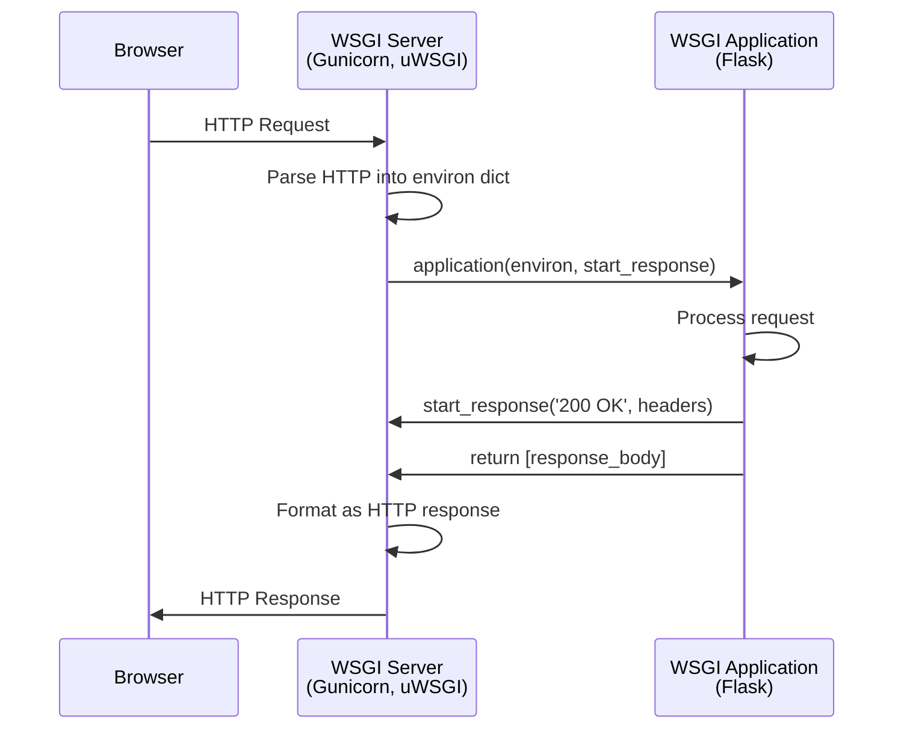
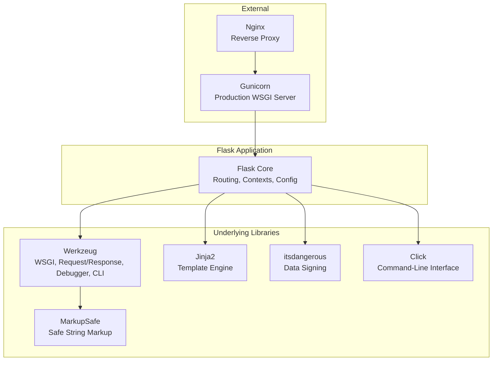
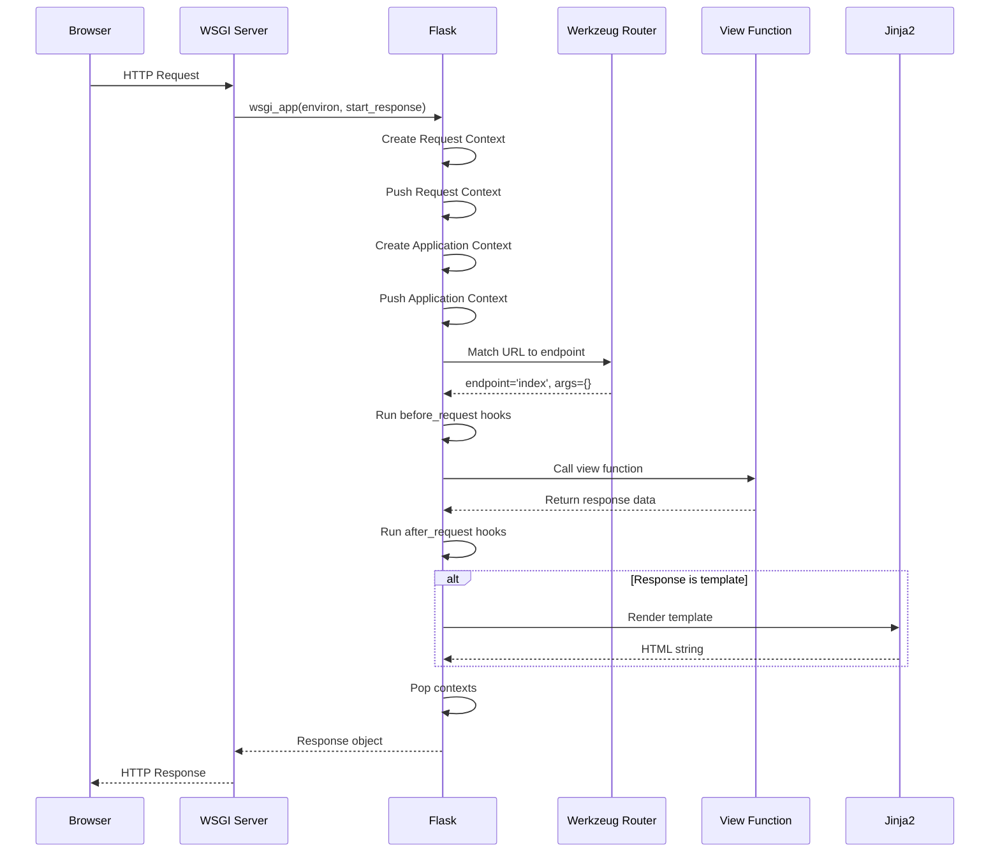
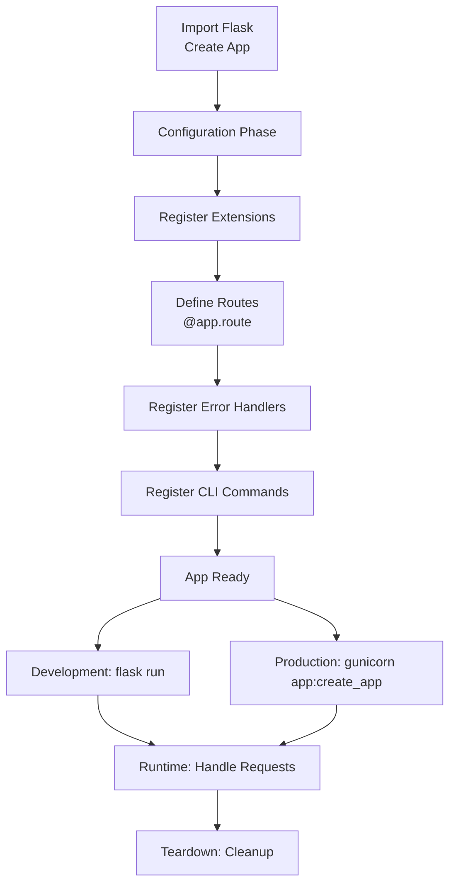

# Flask Architecture

> Before you write Flask routes or render templates, you must understand how Flask is built. Flask is not a monolithic framework — it is a carefully composed system of specialized libraries, each with a specific responsibility. Understanding this architecture transforms you from a Flask user into a Flask developer.

## Learning Objectives

After completing this chapter, you will be able to:

- Explain Flask's design philosophy and microframework approach
- Describe the WSGI specification and Flask's place in the WSGI ecosystem
- Trace the complete request-response cycle through Flask's components
- Understand how Flask uses thread-local storage for request contexts
- Identify the roles of Werkzeug, Jinja2, Click, and itsdangerous in Flask
- Explain the difference between micro and full-stack frameworks
- Describe the Model-View-Template (MVT) pattern as applied in Flask

## Flask's Design Philosophy

Flask was created by **Armin Ronacher** in 2010 as an April Fool's joke that proved too useful to discard. It was built on top of two libraries Ronacher had developed: **Werkzeug** (a WSGI utility library) and **Jinja2** (a template engine).

Flask's design philosophy centers on **simplicity and extensibility**:

With the release of **Flask 3.x**, the framework continues its tradition of minimalism while embracing modern Python features (like type hinting and refined async support) and removing deprecated legacy code, keeping the core lightweight.

**Micro does not mean minimal.** Flask is called a "microframework" because it keeps the core simple and extensible — not because it lacks functionality. The "micro" refers to the framework's architecture, not its capabilities.

Flask provides:
- Request and response handling
- Routing
- Template rendering
- Session management
- Development server and debugger

Flask does not provide (but extensions do):
- Database ORM (use Flask-SQLAlchemy)
- Form validation (use Flask-WTF)
- User authentication (use Flask-Login)
- Caching (use Flask-Caching)
- Email (use Flask-Mail)

This design gives you **freedom of choice**. You can use any database library, any form library, any authentication system. You are not locked into Flask's choices.

### Flask vs. Full-Stack Frameworks

| Aspect | Flask (Micro) | Django (Full-Stack) |
|--------|---------------|---------------------|
| Database | Bring your own | Django ORM (built-in) |
| Forms | Bring your own | Django Forms (built-in) |
| Auth | Bring your own | Django Auth (built-in) |
| Admin | Bring your own | Django Admin (built-in) |
| Flexibility | High | Lower (opinionated) |
| Setup time | Longer (assemble components) | Shorter (batteries included) |
| Learning curve | Gentler initially | Steeper initially |
| Project structure | You decide | Django decides |

Choose Flask when you need flexibility, have specific technology requirements, or want to understand every component of your stack. Choose Django when you want a complete, opinionated solution that handles common patterns out of the box.

## The WSGI Specification

WSGI (Web Server Gateway Interface, PEP 3333) is the Python standard that defines how web servers communicate with Python web applications.

### Why WSGI Exists

Before WSGI (2003), every Python web framework had its own way of connecting to web servers. If you wrote an application in one framework, you were locked into the servers that supported it.

WSGI created a universal interface. Any WSGI-compliant application can run on any WSGI-compliant server.

### The WSGI Interface

WSGI specifies a callable (function or class) with this signature:

```python
def application(environ, start_response):
    # environ: dictionary containing CGI-style environment variables
    #          (request method, path, headers, query string, etc.)
    
    # start_response: callable that begins the HTTP response
    # start_response(status, headers)
    
    # Returns an iterable of response body bytes
    status = '200 OK'
    headers = [('Content-Type', 'text/html')]
    start_response(status, headers)
    return [b'<h1>Hello, WSGI!</h1>']
```

### The WSGI Environment

The `environ` dictionary contains everything about the request:

```python
{
    'REQUEST_METHOD': 'GET',
    'PATH_INFO': '/users/123',
    'QUERY_STRING': 'page=2',
    'SERVER_NAME': 'localhost',
    'SERVER_PORT': '5000',
    'HTTP_HOST': 'localhost:5000',
    'HTTP_USER_AGENT': 'Mozilla/5.0...',
    'HTTP_ACCEPT': 'text/html',
    'HTTP_COOKIE': 'session=abc123',
    'wsgi.input': <io.BytesIO>,           # Request body stream
    'wsgi.errors': <sys.stderr>,          # Error stream
    'wsgi.url_scheme': 'http',
    'wsgi.version': (1, 0),
    # ... many more
}
```

### WSGI Server → Application Flow



Flask is a WSGI application. When a request arrives:
1. The WSGI server (Gunicorn) parses the HTTP request into an `environ` dict
2. Gunicorn calls Flask's WSGI callable with `environ` and `start_response`
3. Flask processes the request, generates a response
4. Flask calls `start_response` with the status and headers
5. Flask returns the response body as an iterable
6. Gunicorn formats this as an HTTP response and sends it to the client

### Flask's WSGI Entry Point

Flask's `__call__` method implements the WSGI interface:

```python
class Flask(Scaffold):
    def __call__(self, environ, start_response):
        """The WSGI entry point."""
        return self.wsgi_app(environ, start_response)
    
    def wsgi_app(self, environ, start_response):
        """Actually handles the WSGI request."""
        ctx = self.request_context(environ)
        error = None
        try:
            try:
                ctx.push()
                response = self.full_dispatch_request()
            except Exception as e:
                error = e
                response = self.handle_exception(e)
            return response(environ, start_response)
        finally:
            if self.should_ignore_error(error):
                error = None
            ctx.auto_pop(error)
```

This is Flask's core. Every request passes through `wsgi_app`.

## Flask's Component Architecture

Flask is composed of several specialized libraries:



### Werkzeug

**Werkzeug** (German for "tool") is the foundation of Flask. It provides:

- **Request and Response classes**: Wrap WSGI environ and response data in Python objects
- **Routing**: URL rule matching with parameter converters
- **Development server**: `run_simple()` for development
- **Interactive debugger**: The famous Werkzeug traceback page
- **WSGI utilities**: Middleware, request/response wrappers, data structures

Without Werkzeug, Flask would not exist. Understanding Werkzeug helps you understand Flask's internals.

### Jinja2

**Jinja2** is Flask's template engine. It renders HTML by combining templates with Python data. Covered in depth in [[02-Jinja2/Jinja2-Overview]].

### itsdangerous

**itsdangerous** signs data cryptographically. Flask uses it to sign session cookies, ensuring clients cannot tamper with their session data.

### Click

**Click** is a Python library for creating command-line interfaces. Flask's CLI (`flask run`, `flask shell`, custom commands) is built on Click.

### MarkupSafe

**MarkupSafe** implements safe string handling for HTML/XML. It prevents double-escaping in templates by marking strings as "safe" or "unsafe."

## The Request-Response Cycle

When a browser sends a request to your Flask application, here is exactly what happens:



### Step-by-Step Breakdown

**1. WSGI Server Receives HTTP Request**

Gunicorn (or the dev server) receives raw HTTP bytes from the network. It parses them into the WSGI `environ` dictionary.

**2. Flask Creates Request Context**

Flask wraps `environ` in a `Request` object and creates a `RequestContext`. This context makes `request` and `session` available as global-like variables. Flask 3.x ensures that context variables are safe to use in async functions by leveraging Python's `contextvars`.

```python
ctx = self.request_context(environ)
ctx.push()
```

**3. Flask Creates Application Context**

If not already active, Flask creates an `AppContext`, making `current_app` and `g` available. The application context is pushed right before the request context if necessary.

**4. URL Routing**

Werkzeug's router matches the request path against registered URL rules:

```python
# Flask's routing (simplified)
rule = app.url_map.bind_to_environ(environ)
endpoint, values = rule.match()
```

If no match, Flask returns 404. If the method does not match, Flask returns 405.

**5. `before_request` Hooks**

Flask executes registered `before_request` functions in order. These are typically used to open database connections, load users from sessions, or check permissions. If any hook returns a response, subsequent hooks and the view function are skipped, and Flask moves directly to response processing.

**6. View Function Executes**

Flask calls the matched view function with URL arguments:

```python
response = view_func(**values)
```

The view function returns data (string, dict, tuple, Response object). In Flask 3.x, this can also be an asynchronous coroutine (`async def`).

**7. Response Processing (`make_response`)**

Flask ensures the return value is a `Response` object by passing it through `make_response()`. If the view returned a string, Flask wraps it. If it returned a dictionary, Flask converts it to JSON.

**8. `after_request` Hooks**

Flask executes `after_request` functions, passing the generated `Response` object. These hooks can modify the response (e.g., adding CORS headers or setting cookies) and must return it.

**9. Context Teardown and `teardown_request`**

Flask pops the request and application contexts. Before fully removing them, it runs `teardown_request` hooks, which are guaranteed to execute even if an unhandled exception occurred during the request (unlike `after_request`).

**10. WSGI Response**

The Response object is called as a WSGI application:

```python
return response(environ, start_response)
```

This calls `start_response` with the status and headers, then yields the response body.

**11. HTTP Response Sent**

The WSGI server formats the response as HTTP and sends it to the client.

## Thread-Local Contexts

One of Flask's most important design decisions is the use of **thread-local storage** for contexts. This enables the "global" `request` and `current_app` objects while keeping requests isolated.

### The Problem

In a web server, multiple requests arrive simultaneously, each handled by a different thread. If `request` were a simple global variable, threads would overwrite each other's data:

```python
# Without thread locals - BROKEN
request = None

@app.route('/')
def index():
    return request.path  # Which request? Race condition!
```

### The Solution: Thread Locals

Flask uses Werkzeug's `Local` and `LocalStack` classes, which store data per-thread:

```python
from werkzeug.local import Local, LocalStack

# Each thread sees its own value
request_ctx = LocalStack()

# In Thread 1: request_ctx.push(ctx1)
# In Thread 2: request_ctx.push(ctx2)
# Each thread accesses its own context - no conflicts
```

This makes `request` appear global within a request handler, while keeping each request's data isolated:

```python
from flask import request

@app.route('/')
def index():
    # This accesses the current thread's request context
    return f"Path: {request.path}, Method: {request.method}"
```

### How It Works

```mermaid
graph LR
    T1[Thread 1<br/>Request A] --> L[Local Proxy<br/>_request_ctx_stack]
    T2[Thread 2<br/>Request B] --> L
    T3[Thread 3<br/>Request C] --> L
    
    L --> S1[Stack: [Context A]]
    L --> S2[Stack: [Context B]]
    L --> S3[Stack: [Context C]]
```

The `request` object is actually a **proxy** that forwards attribute access to the current thread's request context.

### Async and Thread Locals

With Python's `async`/`await`, execution can move between threads. Flask 2.0+ uses `contextvars` (PEP 567) instead of thread locals for async compatibility. `contextvars` are similar to thread locals but work across `await` boundaries.

## Model-View-Template (MVT) in Flask

Flask follows a pattern similar to MVC (Model-View-Controller), though it is more accurately called **MVT (Model-View-Template)**:

| Component | Responsibility | In Flask |
|-----------|---------------|----------|
| **Model** | Data and business logic | SQLAlchemy models, database queries |
| **View** | Handle requests, return responses | `@app.route()` functions |
| **Template** | Presentation layer | Jinja2 HTML templates |

Unlike Django's strict MTV separation, Flask is flexible. Your view function can contain business logic, query the database, and render a template — all in one function. For larger applications, you will want to separate concerns (see [[06-Blueprints/Blueprint-Organization]]).

## Flask's Minimal Hello World

The simplest Flask application reveals the framework's core:

```python
from flask import Flask

app = Flask(__name__)

@app.route('/')
def hello():
    return 'Hello, World!'
```

What happens here:
1. `Flask(__name__)` creates an application instance. `__name__` helps Flask locate resources.
2. `@app.route('/')` registers the `hello` function as the handler for the root URL.
3. When a request to `/` arrives, Flask calls `hello()` and returns its result.

To run:

```bash
export FLASK_APP=hello.py
flask run
```

This starts Werkzeug's development server, which creates a TCP socket on `127.0.0.1:5000` and waits for HTTP requests.

## Flask Application Lifecycle



**Configuration Phase**: Set `SECRET_KEY`, database URIs, and other config before the app handles requests.

**Registration Phase**: Extensions, blueprints, routes, error handlers, and CLI commands are registered. This typically happens at import time.

**Runtime Phase**: The application handles requests. This is the longest phase — potentially months or years of continuous operation.

**Teardown Phase**: When the server shuts down, teardown functions run to close database connections, flush logs, etc.

## Common Mistakes

**Mistake: Thinking Flask is "just for small apps"**
Flask's micro nature does not limit project size. With blueprints, application factories, and extensions, Flask scales to large applications (Pinterest, LinkedIn, and Reddit have used Flask).

**Mistake: Using the development server in production**
`flask run` and `app.run()` use Werkzeug's development server. It is single-threaded, has poor error handling, and is not security-hardened. Always use Gunicorn + Nginx in production.

**Mistake: Creating the app in global scope with heavy initialization**
Database connections, cache clients, and other heavy resources should be initialized lazily or through the application factory pattern (see [[06-Blueprints/Application-Factory]]).

## Best Practices

- **Use the Application Factory pattern (`create_app()`)**: Instead of creating a global app instance, instantiate Flask inside a function. This is essential for modern Flask 3.x apps, enabling better testability, multiple instances, and dynamic configuration.
  
  ```python
  def create_app(config_class=Config):
      app = Flask(__name__)
      app.config.from_object(config_class)
      
      # Initialize extensions
      db.init_app(app)
      migrate.init_app(app, db)
      
      # Register blueprints
      from app.main import bp as main_bp
      app.register_blueprint(main_bp)
      
      return app
  ```

- **Separate configuration by environment** (development, testing, production) using object-based configuration or environment variables.
- **Register teardown functions** (`@app.teardown_appcontext`) to clean up resources like database connections reliably, even in the event of errors.
- **Use blueprints** to organize routes by feature, avoiding circular imports and keeping logic modular.
- **Keep view functions thin** — delegate business logic and data access to service functions or models.

## Exercises

1. **Trace the Cycle**: Add print statements to `before_request`, `after_request`, and a view function. Observe the execution order.

2. **Manual WSGI**: Write a minimal WSGI application without Flask that returns "Hello, WSGI!" Run it with `python -m http.server` or gunicorn.

3. **Thread Locals**: Write a script that uses Werkzeug's `Local` to store per-thread data. Verify threads do not see each other's values.

4. **Request Timing**: Create a `before_request` that stores `time.time()` in `g.start_time`. In `after_request`, calculate and log the request duration.

## Quiz

**Question 1**: What is WSGI, and why is it important for Python web development?

**Question 2**: Name the four main libraries Flask depends on and what each provides.

**Question 3**: How does Flask isolate request data when multiple requests arrive simultaneously?

**Question 4**: What is the difference between a microframework and a full-stack framework?

**Question 5**: Trace the complete path of an HTTP request from the browser through Flask and back.

## Interview Questions

1. "Explain Flask's architecture. What are its main components and how do they interact?"

2. "What is WSGI? How does Flask implement the WSGI interface?"

3. "How does Flask handle concurrent requests? Explain thread-local contexts."

4. "Why is Flask called a microframework? What are the advantages and disadvantages?"

5. "Trace the lifecycle of an HTTP request through a Flask application."

6. "What would happen if Flask used a simple global variable for `request` instead of a thread local?"

## Related Chapters

- Next: [[01-Flask-Core/Routing]]
- [[Appendix/Werkzeug]] — Deep dive into Werkzeug
- [[06-Blueprints/Application-Factory]] — Application factory pattern
- [[00-Foundations/HTTP]] — The protocol Flask speaks

## Official Documentation References

- [Flask Documentation - Application Context](https://flask.palletsprojects.com/en/latest/appcontext/)
- [Flask Documentation - Request Context](https://flask.palletsprojects.com/en/latest/reqcontext/)
- [PEP 3333 - WSGI](https://peps.python.org/pep-3333/)
- [Werkzeug Documentation](https://werkzeug.palletsprojects.com/)
- [Armin Ronacher - Flask Design Decisions](https://flask.palletsprojects.com/en/latest/design/)

---

*Next: [[01-Flask-Core/Routing]]*