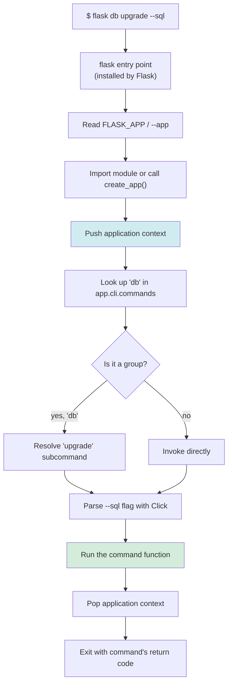
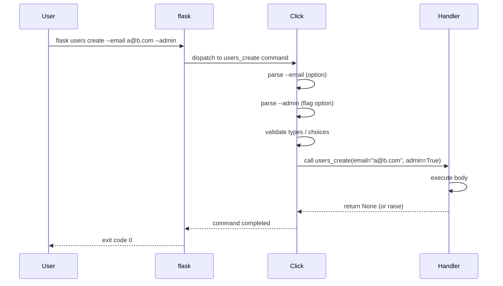
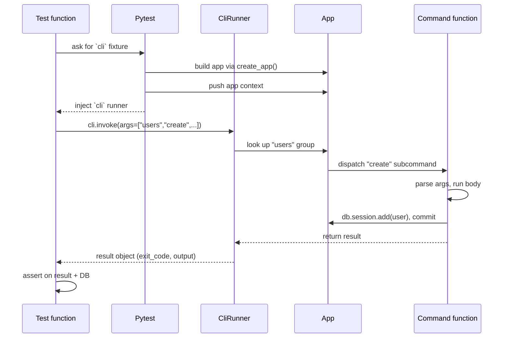

# Flask CLI

#flask #cli #click #commands #shell #dev-tools #scripting

> [!info] The command-line interface that ships with Flask
> Flask's `flask` command is a [Click](https://click.palletsprojects.com/)-based CLI that every Flask app gets for free. Out of the box it knows how to `run` the dev server, open a `shell`, and (when Flask-Migrate is installed) execute `db` migrations. Its real power, though, is the **extension hook**: any package can register its own subcommands, and your app can do the same with `@app.cli.command()`. This note covers the built-in commands, custom commands, command groups, Blueprint CLI, Click integration, shell context, and how to test CLI commands in pytest.

Think of the Flask CLI as the **control panel for your application**. The web server is the front door that users walk through; the CLI is the back door that operators, deploy scripts, and cron jobs walk through. The same `create_app()` factory produces both — only the entry point differs. The HTTP entry point feeds a WSGI request through `app.wsgi_app`. The CLI entry point loads `app` and hands it to Click, which dispatches the named subcommand with the application context already pushed.

> [!tip] Why a CLI at all?
> A surprising amount of Flask work isn't HTTP: seeding the database on first deploy, running a one-off backfill, sending a digest email, generating a sitemap, rotating a signing key, dumping diagnostics. You *could* expose each of these as a protected `/admin/...` route, but then you've added an auth surface and a CSRF check to something that should run unattended at 3 AM from a cron job. The CLI is the right tool for jobs that don't need HTTP.

---

## 1. Overview & Metaphor

### What the `flask` command actually does

When you type `flask db upgrade` at a shell:

1. The `flask` entry point (installed by Flask) reads `FLASK_APP` (or `--app`) to find your application factory or module.
2. It calls `create_app()` (or imports the module-level `app`) to get a Flask instance.
3. It pushes an application context.
4. It looks up the `db` command group (registered by Flask-Migrate) and invokes its `upgrade` subcommand.
5. The subcommand receives a Click context and runs to completion.
6. The application context is popped; the process exits.

### Mermaid: CLI command dispatch flow



The application-context push (blue) is the secret sauce. It's the reason `flask db upgrade` can call `db.session.execute(...)` and `flask routes` can introspect `app.url_map` without you having to manually `with app.app_context(): ...` in your command body. Anywhere inside a Flask CLI command, `current_app`, `g`, and `db.session` all work as if you were inside a request handler.

### Mermaid: command group hierarchy

A medium-sized Flask app typically ends up with a tree of command groups. Here's the structure you get from a project with Flask-Migrate, a custom `users` group, and a Blueprint-contributed `reports` group:

```mermaid
graph TD
    Root["flask"]
    Root --> Run["flask run"]
    Root --> Shell["flask shell"]
    Root --> Routes["flask routes"]
    Root --> DB["flask db"]
    Root --> Users["flask users"]
    Root --> Reports["flask reports"]
    Root --> Tasks["flask tasks"]
    DB --> DBInit["flask db init"]
    DB --> DBMigrate["flask db migrate"]
    DB --> DBUpgrade["flask db upgrade"]
    DB --> DBDowngrade["flask db downgrade"]
    DB --> DBStamp["flask db stamp"]
    Users --> UsersCreate["flask users create"]
    Users --> UsersReset["flask users reset-password"]
    Users --> UsersActivate["flask users activate"]
    Reports --> ReportsRender["flask reports render"]
    Reports --> ReportsEmail["flask reports email"]
    Reports --> ReportsPurge["flask reports purge"]
    Tasks --> TasksRun["flask tasks run"]
    Tasks --> TasksList["flask tasks list"]
    style Root fill:#fff3cd
    style DB fill:#d1ecf1
    style Users fill:#d4edda
    style Reports fill:#f8d7da
```



Click groups are just nested command collections. `flask` itself is the top-level group; `flask db` is a subgroup; `flask db upgrade` is a leaf command. Any subcommand can itself be a group, recursively.

---

## 2. The `flask` Command Structure

### `FLASK_APP` and `--app`

Flask needs to know where your application lives. Two ways to tell it:

```bash
# Environment variable (persistent across shell sessions)
export FLASK_APP="app:create_app"
flask run

# CLI flag (one-shot, overrides the env var)
flask --app app:create_app run

# Auto-detection (Flask 2.3+):
# - looks for app.py, wsgi.py, application.py, app/__init__.py
# - if the module exposes `create_app()` or `make_app()`, calls it
flask run
```

The `module:factory` syntax (`app:create_app`) tells Flask to import `app` and call `create_app()` to get the application instance. You can pass arguments to the factory:

```bash
export FLASK_APP="app:create_app('production')"
flask routes
```

> [!warning] `--app` placement matters
> `--app` is a global option on the `flask` command itself, so it has to come *before* the subcommand: `flask --app myapp run`, not `flask run --app myapp`. The latter will be parsed as a `--app` argument to `run`, which doesn't accept it.

### `FLASK_ENV` (deprecated) and `--env-file`

In Flask 2.2 and earlier, `FLASK_ENV=development` set debug mode and `FLASK_ENV=production` set non-debug mode. Flask 2.3 deprecated `FLASK_ENV`; the modern equivalent is `--debug` / `FLASK_DEBUG=1`:

```bash
flask --app app run --debug
# or
FLASK_DEBUG=1 flask run
```

For loading `.env` files before the app starts, use `--env-file` (Flask 2.3+) or a `python-dotenv` integration:

```bash
flask --env-file .env.production run
```

### Built-in commands

| Command | What it does |
|---|---|
| `flask run` | Start the Werkzeug dev server. `--port`, `--host`, `--debug`, `--reload`, `--cert` for HTTPS. |
| `flask shell` | Open a Python REPL with the app context pushed and shell-context-injected names bound. See [[Flask-Shell]]. |
| `flask routes` | Print every registered URL rule with its endpoint and allowed methods. |
| `flask --version` | Print Flask, Werkzeug, Python, and platform versions. |
| `flask --help` | Print all top-level commands, including custom ones registered by your app and extensions. |

`flask routes` is one of the most useful debugging commands in Flask. It dumps a table:

```
Endpoint                       Methods    Rule
-----------------------------  ---------  --------------------------------
auth.login                     GET, POST  /login
auth.logout                    GET        /logout
post.detail                    GET        /posts/<int:post_id>
post.create                    POST       /posts
static                         GET        /static/<path:filename>
```

If a route isn't matching, this is the first thing to check — the rule may have a typo, the blueprint prefix may be missing, or a converter may be wrong (`<post_id>` vs `<int:post_id>`).

---

## 3. Custom Commands with `@app.cli.command()`

The simplest way to add a command is to decorate a function:

```python
# app/cli.py
import click
from flask import Flask
from flask.cli import with_appcontext

def create_app():
    app = Flask(__name__)
    app.config.from_object("app.config.ProductionConfig")

    register_cli_commands(app)
    return app

def register_cli_commands(app: Flask):
    @app.cli.command("hello")
    @click.argument("name")
    @click.option("--upper", is_flag=True, help="Uppercase the greeting.")
    def hello(name, upper):
        """Greet NAME, because every CLI needs a hello command."""
        msg = f"Hello, {name}!"
        if upper:
            msg = msg.upper()
        click.echo(msg)
```

```bash
$ flask hello Alice
Hello, Alice!
$ flask hello alice --upper
HELLO, ALICE!
$ flask hello --help
Usage: flask hello [OPTIONS] NAME

  Greet NAME, because every CLI needs a hello command.

Options:
  --upper  Uppercase the greeting.
  --help   Show this message and exit.
```

Three things to notice:

1. **`@app.cli.command(name)`** registers the function as a Flask CLI subcommand. Without a `name` argument, it uses the function name with underscores converted to dashes (`hello_world` → `hello-world`).
2. **The docstring becomes the help text.** Click reads the function's `__doc__` and uses it for `flask <cmd> --help`. Multi-line docstrings work; first line is the summary.
3. **No `@with_appcontext` is needed** when the command is registered via `@app.cli.command()` — Flask pushes the app context for you. (You *do* need it if you register via `app.cli.add_command(...)` with a Click command constructed outside the app's knowledge.)

### Real example: seed the database

```python
def register_cli_commands(app: Flask):
    @app.cli.command("seed")
    @click.option("--count", default=10, help="How many rows to insert.")
    @click.option("--reset", is_flag=True, help="Drop and recreate tables first.")
    def seed(count, reset):
        """Insert sample data into the database."""
        from app.extensions import db
        from app.models import User, Post
        from werkzeug.security import generate_password_hash
        from faker import Faker

        fake = Faker()
        if reset:
            click.echo("Dropping all tables...")
            db.drop_all()
            db.create_all()

        for _ in range(count):
            u = User(
                email=fake.unique.email(),
                password_hash=generate_password_hash("password"),
                display_name=fake.name(),
            )
            db.session.add(u)
        db.session.commit()
        click.echo(f"Seeded {count} users.")
```

```bash
$ flask seed --count 50 --reset
Dropping all tables...
Seeded 50 users.
```

> [!tip] Use `click.echo`, not `print`
> `click.echo` handles terminal encoding (Windows `cp1252` vs UTF-8), respects `--quiet`-style flags you build later, and flushes stdout so output appears correctly when piped to a file or another command. `print` works but throws away these affordances.

---

## 4. Command Groups

A single `flask` command namespace gets crowded fast. Click groups let you organize:

```python
import click
from flask.cli import AppGroup

users_cli = AppGroup("users", help="User management commands.")

@users_cli.command("create")
@click.option("--email", prompt=True)
@click.option("--password", prompt=True, hide_input=True, confirmation_prompt=True)
@click.option("--admin", is_flag=True, help="Make this user an admin.")
def users_create(email, password, admin):
    """Create a new user."""
    from app.extensions import db
    from app.models import User
    from werkzeug.security import generate_password_hash

    if User.query.filter_by(email=email).first():
        click.echo(f"User {email} already exists.", err=True)
        raise SystemExit(1)

    user = User(
        email=email,
        password_hash=generate_password_hash(password),
        is_admin=admin,
    )
    db.session.add(user)
    db.session.commit()
    click.echo(f"Created user {email} (admin={admin}).")

@users_cli.command("reset-password")
@click.argument("email")
def users_reset_password(email):
    """Send a password reset email to EMAIL."""
    # ... token + email logic ...
    click.echo(f"Reset email sent to {email}.")

def register_cli_commands(app):
    app.cli.add_command(users_cli)
    # ... other commands ...
```

Now:

```bash
$ flask users --help
Usage: flask users [OPTIONS] COMMAND [ARGS]...

  User management commands.

Options:
  --help  Show this message and exit.

Commands:
  create         Create a new user.
  reset-password  Send a password reset email to EMAIL.
```

> [!example] When to use a group vs flat commands
> Use a group when you have 3+ commands that share a noun (`users`, `db`, `reports`, `tasks`). Below 3, flat commands (`flask seed`, `flask cleanup`) read more cleanly. Above ~10 commands at the top level, the `flask --help` output becomes a wall of text — at that point, group everything.

---

## 5. Blueprint CLI Commands

Blueprints can register their own CLI commands, scoped under the blueprint's name automatically:

```python
# app/blueprints/reports.py
from flask import Blueprint
import click

bp = Blueprint("reports", __name__, url_prefix="/reports")

@bp.cli.command("render")
@click.argument("report_id", type=int)
def render_report(report_id):
    """Render REPORT_ID and store the output."""
    from app.services import ReportRenderer
    ReportRenderer().render(report_id)
    click.echo(f"Rendered report {report_id}.")

@bp.cli.command("purge")
@click.option("--older-than-days", default=30)
def purge_reports(older_than_days):
    """Delete rendered reports older than N days."""
    # ... deletion logic ...
    click.echo(f"Purged reports older than {older_than_days} days.")
```

When the blueprint is registered with `app.register_blueprint(bp)`, its CLI commands appear under `flask reports`:

```bash
$ flask reports render 42
Rendered report 42.

$ flask reports purge --older-than-days 90
Purged reports older than 90 days.
```

This is the cleanest way to ship commands alongside the feature they belong to — the blueprint's `__init__.py` exports both the routes and the CLI commands, so adding the feature to an app is just `app.register_blueprint(reports_bp)`.

> [!warning] Blueprint name is the CLI group name
> The blueprint's `name` attribute becomes the CLI group name. If two blueprints share a name (or a blueprint name collides with a top-level command), the second registration silently fails to expose its CLI. Use distinct, descriptive blueprint names.

---

## 6. Click Integration — Beyond the Basics

### `@click.option` vs `@click.argument`

| Decorator | When to use | Example |
|---|---|---|
| `@click.argument("name")` | Required positional, value the command acts *on* | `flask users activate alice@example.com` |
| `@click.option("--email")` | Optional flag, value the command acts *with* | `flask users create --email alice@example.com` |

Arguments come after options in the command line and can't be omitted (unless `required=False`). Options can have defaults, can be flags, can prompt the user, and can repeat (`multiple=True`).

### Choice, type, and prompt

```python
@app.cli.command("config")
@click.argument("env", type=click.Choice(["dev", "staging", "prod"]))
@click.option("--key", prompt="Config key")
@click.option("--value", prompt="New value")
def config_set(env, key, value):
    """Set a config value for ENV in the config store."""
    # ...
```

### Custom param types

```python
class EmailType(click.ParamType):
    name = "email"
    def convert(self, value, param, ctx):
        from email_validator import validate_email, EmailNotValidError
        try:
            return validate_email(value).email
        except EmailNotValidError as e:
            self.fail(str(e), param, ctx)

EMAIL = EmailType()

@app.cli.command("invite")
@click.argument("email", type=EMAIL)
def invite(email):
    """Send an invitation to EMAIL."""
    # ...
```

### Mermaid: option parsing order

Click evaluates decorators bottom-up but processes options on the command line in any order. Understanding the parsing flow helps when chaining complex option groups.



### Returning exit codes

```python
@app.cli.command("verify")
def verify():
    """Sanity-check the deployment."""
    errors = run_health_checks()
    if errors:
        for err in errors:
            click.echo(err, err=True)
        raise SystemExit(1)  # non-zero exit code
    click.echo("All checks passed.")
```

Cron jobs and CI scripts depend on exit codes. `raise SystemExit(N)` (or `ctx.exit(N)`) is the correct way to set them; returning an integer from the function does *not* work.

---

## 7. Shell Context

The `flask shell` command opens an interactive REPL with the app context pushed and a set of names injected. The injected names come from `@app.shell_context_processor`:

```python
def register_shell_context(app):
    @app.shell_context_processor
    def make_shell_context():
        from app.extensions import db
        from app.models import User, Post, Tenant
        return dict(
            db=db,
            User=User,
            Post=Post,
            Tenant=Tenant,
            # ... anything you want available as a global in the REPL
        )
```

Now `flask shell` drops you into a REPL where `db`, `User`, `Post`, and `Tenant` are already bound. See [[Flask-Shell]] for the full treatment.

---

## 8. Testing CLI Commands

Click provides `CliRunner` for invoking commands in tests without spawning a subprocess. `pytest-flask` exposes it via the `cli` fixture:

```python
# tests/test_cli.py
def test_users_create(cli, app, db_session):
    result = cli.invoke(args=["users", "create", "--email", "alice@example.com", "--password", "hunter2"])
    assert result.exit_code == 0
    assert "Created user alice@example.com" in result.output

    from app.models import User
    assert User.query.filter_by(email="alice@example.com").one()

def test_users_create_rejects_duplicate(cli, db_session):
    UserFactory.create(email="alice@example.com")
    result = cli.invoke(args=["users", "create", "--email", "alice@example.com", "--password", "x"])
    assert result.exit_code == 1
    assert "already exists" in result.output
```

Key points:

- `cli.invoke(args=[...])` runs the command in-process. The application context is pushed automatically (pytest-flask does this).
- `result.exit_code`, `result.output`, and `result.exception` give you everything to assert on.
- If you need to inspect side effects (DB rows, files written), do it after `cli.invoke` returns — the command has fully run by then.

### Invoking custom Click groups directly

For non-pytest-flask tests, use `click.testing.CliRunner` directly:

```python
from click.testing import CliRunner
from app import create_app

def test_seed_creates_users():
    app = create_app(testing=True)
    runner = CliRunner()
    with app.app_context():
        result = runner.invoke(app.cli, ["seed", "--count", "5"])
    assert result.exit_code == 0
    # ...
```

### Mermaid: test lifecycle for CLI commands



---

## 9. Common Patterns

### Pattern: factory-passing configuration via env vars

```python
# Run the prod app via CLI:
FLASK_APP="app:create_app('production')" flask routes
```

Your `create_app(config_name=None)` factory inspects its argument and loads the right config class. The CLI doesn't need to know about config — the factory does.

### Pattern: long-running commands with progress

```python
@app.cli.command("backfill")
def backfill():
    """Backfill the new 'slug' column on every Post."""
    from app.models import Post
    posts = Post.query.all()
    with click.progressbar(posts, label="Backfilling") as bar:
        for post in bar:
            post.slug = slugify(post.title)
    db.session.commit()
```

`click.progressbar` renders a nice progress bar to stderr that works in pipes and CI logs.

### Pattern: cron-friendly output

```python
@app.cli.command("send-digests")
@click.option("--quiet", is_flag=True, help="Only print on errors.")
def send_digests(quiet):
    """Email a weekly digest to every active user."""
    users = User.query.filter_by(receive_digest=True).all()
    sent, failed = 0, 0
    for user in users:
        try:
            send_digest(user)
            sent += 1
            if not quiet:
                click.echo(f"  sent: {user.email}")
        except Exception as e:
            failed += 1
            click.echo(f"  FAILED: {user.email} — {e}", err=True)
    click.echo(f"Done. sent={sent} failed={failed}")
    if failed:
        raise SystemExit(1)
```

The `--quiet` flag plus stderr-on-error pattern is what you want for a cron job: log noise is suppressed on success, errors are visible, exit code reflects whether anything failed.

### Pattern: composite commands via `invoke`

```python
@app.cli.command("deploy-prepare")
@click.pass_context
def deploy_prepare(ctx):
    """Run all the pre-deploy steps in order."""
    ctx.invoke(seed, count=0)  # no seed rows, just schema
    ctx.invoke(build_search_index)
    ctx.invoke(warm_cache)
    click.echo("Ready to deploy.")
```

`ctx.invoke` calls another registered command by name with its Python signature. Useful for orchestrating multi-step procedures without copy-pasting command bodies.

---

## 10. Troubleshooting

| Symptom | Likely cause | Fix |
|---|---|---|
| `Error: Failed to find Flask application or factory.` | `FLASK_APP` not set, or factory name wrong | Set `FLASK_APP=app:create_app`, or rely on auto-detection by naming your module `app.py` / `wsgi.py` |
| `RuntimeError: Working outside of application context` | Command was registered via `app.cli.add_command(...)` without `@with_appcontext`, or you constructed a Click command outside Flask's knowledge | Decorate with `@with_appcontext`, or register via `@app.cli.command()` |
| Custom command doesn't appear in `flask --help` | Function not decorated, or `register_cli_commands(app)` not called from your factory | Add the decorator, wire the registration into `create_app()` |
| `flask db ...` not found | Flask-Migrate not initialized, or `Migrate(app, db)` called after the CLI is parsed | Call `Migrate(app, db)` inside `create_app()` before returning |
| Tests can't see CLI commands | Tests use a different `app` fixture than the one the commands were registered on | Register commands in the same `create_app()` your test fixture uses; don't conditionally skip registration in test mode |
| `flask shell` doesn't have `db` / models | No `@app.shell_context_processor` registered, or it's not returning the expected names | See §7 above and [[Flask-Shell]] |
| Exit code is 0 even on failure | Command raised an exception that Click caught, or returned instead of `raise SystemExit(1)` | `raise SystemExit(1)` explicitly, or `ctx.exit(1)` |

---

## 11. Best Practices

> [!tip] Flask CLI checklist
> 1. **Keep CLI registration in `app/cli.py`** (or `app/cli/__init__.py`), not scattered across blueprints. Central registration makes `flask --help` predictable.
> 2. **Every command has a docstring.** Click uses it as the `--help` text; tests can read it; future-you will thank past-you.
> 3. **Use `click.echo`, not `print`.** Encoding-safe, test-friendly.
> 4. **Return meaningful exit codes.** `0` on success, non-zero on failure — cron and CI scripts depend on this.
> 5. **Push the app context only when needed.** `@app.cli.command()` does it for you; `app.cli.add_command(click_cmd)` does not (add `@with_appcontext`).
> 6. **Group commands by domain** (`flask users ...`, `flask reports ...`) once you have 5+.
> 7. **Test commands with `CliRunner`.** They're functions; treat them as such. See [[Pytest-Flask]] for the `cli` fixture.
> 8. **Don't put business logic in CLI command bodies.** Commands should parse args, call a service function, and echo the result. The service function is what's testable; the command is the I/O wrapper.
> 9. **Idempotent where possible.** `flask seed` should be safe to run twice (use `INSERT ... ON CONFLICT DO NOTHING` or upsert logic). Operators will run things twice.
> 10. **Use `--dry-run` for destructive commands.** `flask users purge-inactive --dry-run` should print what *would* be deleted without deleting it.

---

## 12. Related Vault Notes

- [[Flask-Migrate]] — registers the `flask db` command group; this is where most Flask developers first encounter the CLI
- [[Flask-Overview]] — the `flask` command is part of Flask itself, built on Click (one of the Pallets ecosystem libraries)
- [[Project-Structure]] — where to put `app/cli.py` in your package layout; how `register_cli_commands(app)` fits into the application factory
- [[Flask-Shell]] — the `flask shell` built-in command and `@app.shell_context_processor`
- [[Pytest-Flask]] — provides the `cli` fixture that wraps `CliRunner` for in-process command testing
- [[Flask-SQLAlchemy]] — the most common dependency of custom CLI commands (`db.session.add(...)`, `db.session.commit()`)
