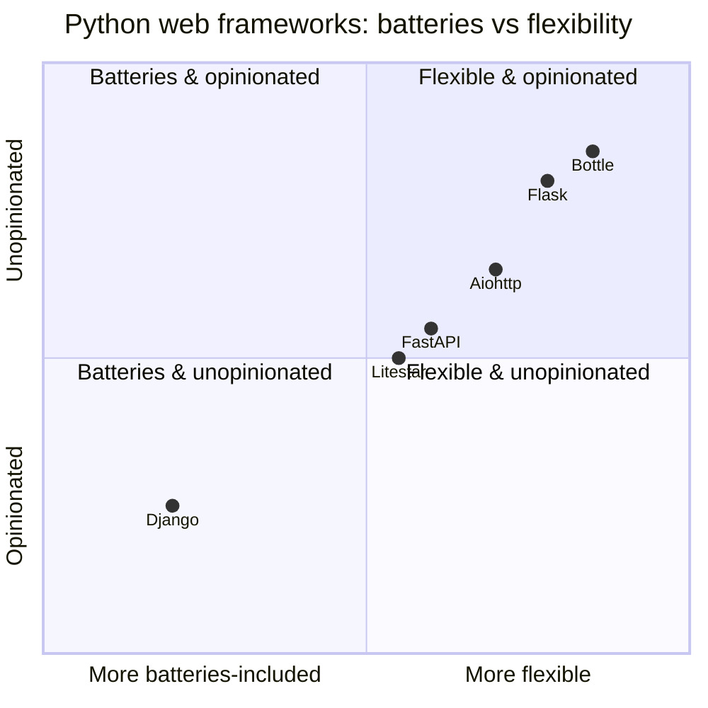
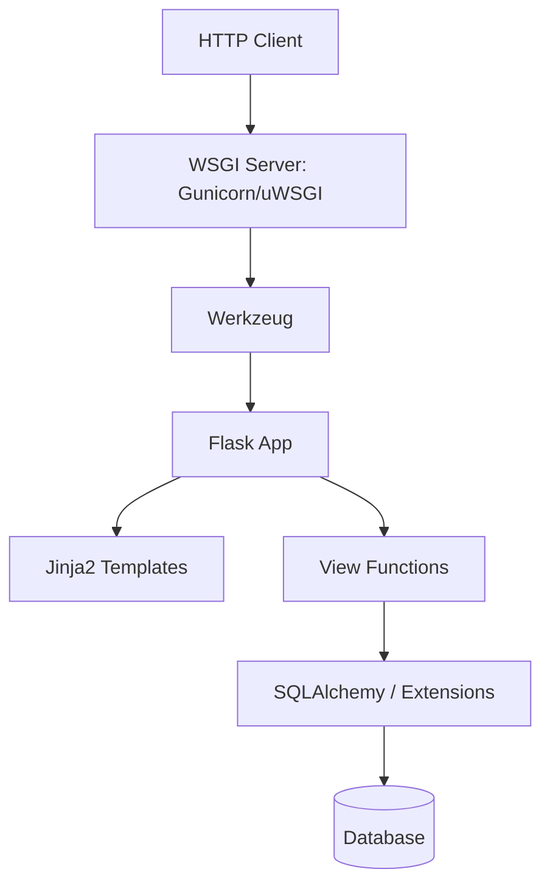
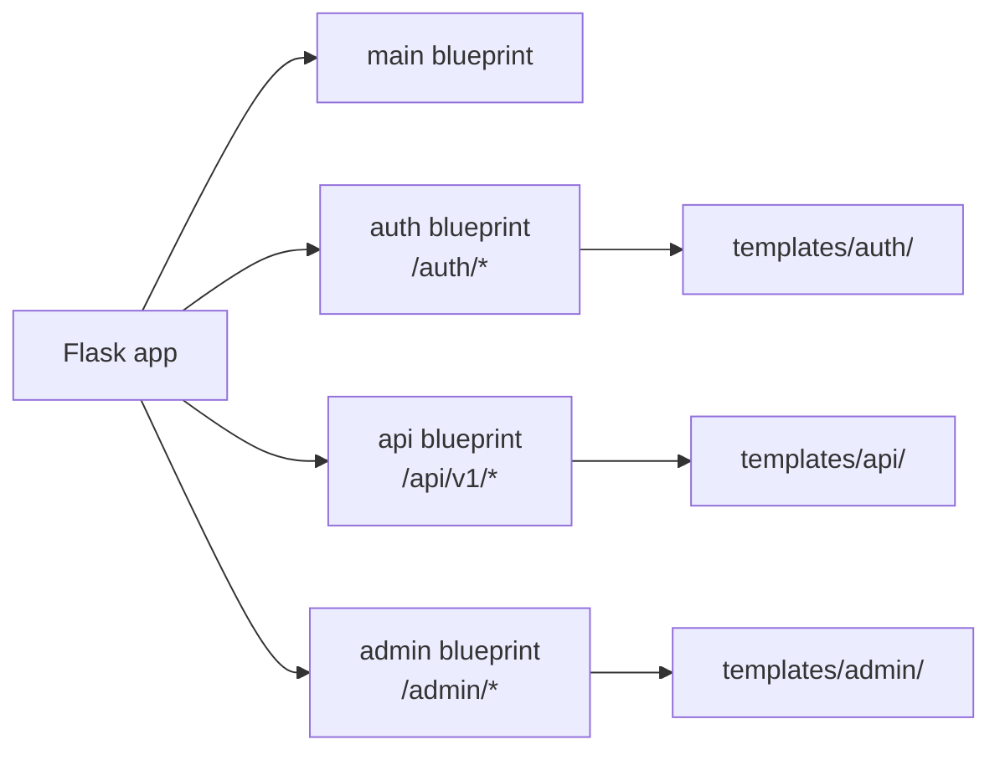
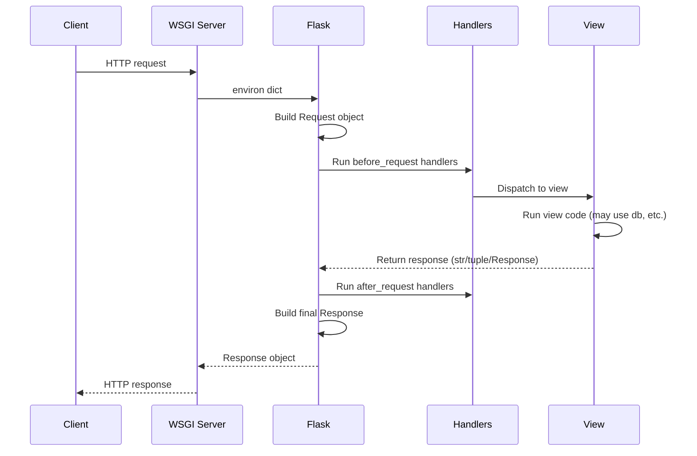
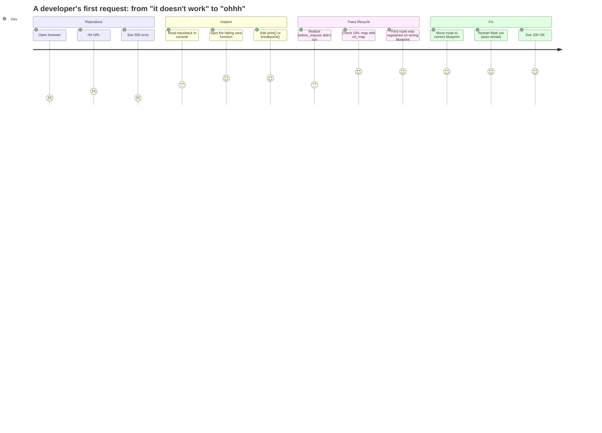
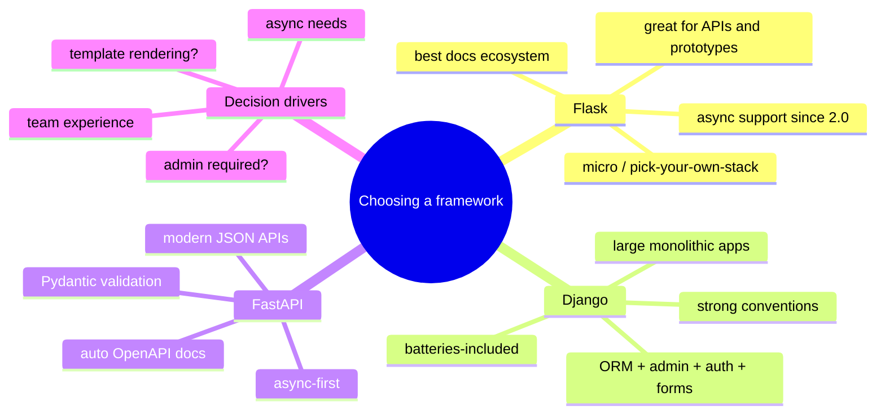
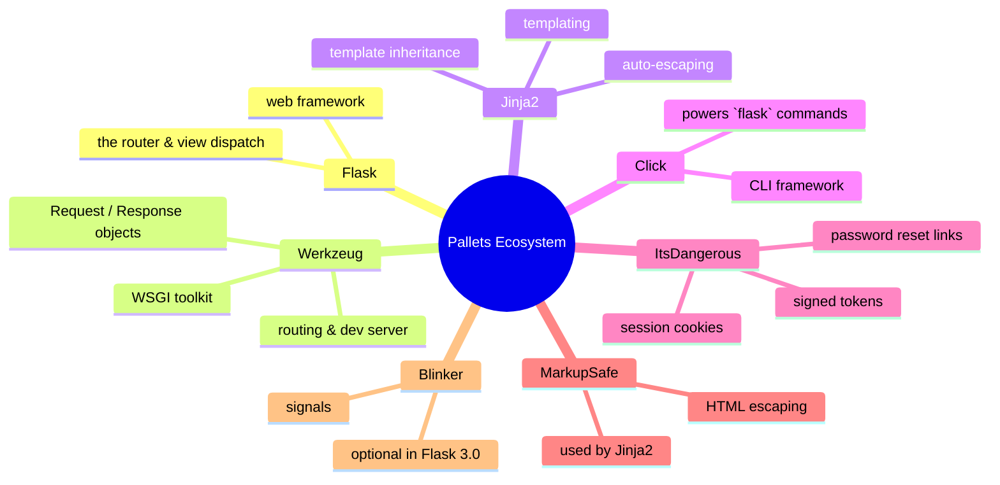

# Flask Overview

#flask #overview #wsgi #jinja2 #werkzeug

> [!info] The starting point
> If you read only one note in this vault, make it this one. Everything else assumes you understand what Flask is, why it exists, and how it processes a single HTTP request.

Flask is a **microframework** for Python — a deliberately small web framework that provides the minimum necessary to build web applications, then gets out of your way. It was created by Armin Ronacher and first released in 2010. As of this writing, the current version is Flask 3.0.x, which requires Python 3.8+.

The word "micro" is misleading. Flask is *micro* in **defaults**, not in **capability**. A Flask app with SQLAlchemy, Celery, SocketIO, Marshmallow, and JWT can do anything a Django app can do. The difference is that Flask **makes you choose your own stack**. Django gives you an ORM, an admin, a form library, and a session system out of the box. Flask gives you a router, a template engine, and a dev server. Everything else, you add.

This is Flask's greatest strength (flexibility, no bloat, learn just what you need) and its greatest weakness (decision fatigue, more setup, less consistent across projects).



Flask sits in the flexible-and-unopinionated quadrant — you bring the stack, Flask brings the router.

---

## The Three Pillars

Flask is built on three mature, independent libraries:

| Component | Role | Origin |
|---|---|---|
| **Werkzeug** | WSGI toolkit — request/response objects, routing, middleware | Also by Armin Ronacher |
| **Jinja2** | Templating engine — `{{ variable }}`, ``, template inheritance | Also by Armin Ronacher |
| **ItsDangerous** | Cryptographically signed tokens — used for sessions, password resets | Part of the Pallets ecosystem |

You can use any of these without Flask. Flask's contribution is to **bind them together** with a clean API for handling HTTP requests.



### WSGI — the protocol

WSGI (Web Server Gateway Interface) is the Python standard (PEP 3333) that defines how a web server talks to a Python application. Flask is a WSGI application: any WSGI-compatible server (Gunicorn, uWSGI, `waitress`, mod_wsgi) can serve it.

The Flask development server (`flask run`) is **not** WSGI; it's a Werkzeug debug server. It's convenient but absolutely unsuitable for production. See [[Production-Deployment]] for real server choices.

### Jinja2 — the templates

Jinja2 is a powerful templating language with:

- Variable substitution: `{{ user.name }}`
- Control flow: ``, ``
- Template inheritance: ``
- Auto-escaping (XSS protection by default)
- Filters: `{{ content | striptags }}`
- Macros: reusable template snippets

Flask makes Jinja2 trivial: any `.html` file in the `templates/` directory becomes a template, and `render_template("foo.html", **ctx)` renders it.

### ItsDangerous — sessions without a server

Flask's default session implementation stores session data **client-side** in a signed cookie. The signature comes from ItsDangerous, using `app.secret_key`. This means you don't need a session backend (Redis, database) for basic sessions — Flask just signs and verifies the cookie.

> [!warning] Session size limit
> Because sessions live in a cookie, they're capped at ~4 KB (browser limit). For larger sessions, use a server-side session store (e.g., `Flask-Session`).

---

## The Microframework Philosophy

> [!tip] The Flask design manifesto
> 1. **No required database.** Flask doesn't ship with an ORM. You can use SQLAlchemy, Tortoise, Peewee, raw SQL, or none at all.
> 2. **No required form library.** `Flask-WTF` exists, but Flask itself doesn't know about forms.
> 3. **No required auth.** Flask gives you signed sessions. `Flask-Login` adds user management. JWT is a third-party concern.
> 4. **No required admin.** Django's admin is famous. Flask's admin (`Flask-Admin`) is an opt-in extension.
> 5. **No required task queue.** Add `Celery` if you need one.
> 6. **No required API layer.** `Flask-RESTful`, `flask-smorest`, and `flask-classful` exist but are optional.

This means a Flask "hello world" is genuinely small:

```python
# app.py — the complete app
from flask import Flask

app = Flask(__name__)

@app.route("/")
def hello():
    return "Hello, World!"

if __name__ == "__main__":
    app.run(debug=True)
```

Run with `python app.py` and visit `http://127.0.0.1:5000/`. That's it.

Compare to Django's equivalent — you'd need `django-admin startproject`, a settings module, a `urls.py`, a `views.py`, and a `wsgi.py`. Flask trades ceremony for explicit choice.

---

## The Application Factory Pattern

The hello-world above is fine for toys, but real apps use the **application factory pattern**: a function that creates and configures the `Flask` instance.

### Why a factory?

1. **Multiple configurations.** You want one app for dev (debug=True, SQLite), one for testing (in-memory SQLite), one for production (PostgreSQL, debug=False).
2. **Multiple instances.** Sometimes you run multiple Flask apps in the same process (e.g., a public site and an admin site).
3. **Test isolation.** Each test creates a fresh app with a fresh database.
4. **Extension initialization.** Extensions like `Flask-SQLAlchemy` use `db.init_app(app)` — they need to be created *outside* the app and *bound* to it inside the factory.

### The pattern

```python
# app/__init__.py
from flask import Flask
from flask_sqlalchemy import SQLAlchemy
from flask_migrate import Migrate
from config import Config

# Extensions are created at module scope, unbound to any app.
db = SQLAlchemy()
migrate = Migrate()


def create_app(config_class=Config):
    """Application factory."""
    app = Flask(__name__)
    app.config.from_object(config_class)

    # Bind extensions to this specific app instance.
    db.init_app(app)
    migrate.init_app(app, db)

    # Register blueprints (modular routes).
    from app.main import bp as main_bp
    app.register_blueprint(main_bp)

    from app.auth import bp as auth_bp
    app.register_blueprint(auth_bp, url_prefix="/auth")

    return app
```

### Usage

```python
# wsgi.py (or run via `flask --app app run`)
from app import create_app
app = create_app()

if __name__ == "__main__":
    app.run()
```

```python
# tests/conftest.py
import pytest
from app import create_app, db

@pytest.fixture
def app():
    app = create_app(TestConfig)
    with app.app_context():
        db.create_all()
        yield app
        db.drop_all()
```

> [!tip] Always use the factory pattern
> Even if your app has one configuration today, you will need tests tomorrow. The factory pattern is non-negotiable for any app you intend to maintain. See [[Project-Structure]] for where each piece lives.

---

## Blueprints

Blueprints are Flask's answer to "my app is getting too big." A blueprint is a **reusable collection of routes, templates, and static files** that you register on the main app.

Think of a blueprint as a *mini-app* — it has its own routes, its own templates folder, its own static folder, and its own error handlers. But it doesn't run on its own; it must be registered on a real Flask app.

### A minimal blueprint

```python
# app/auth/__init__.py
from flask import Blueprint

bp = Blueprint("auth", __name__, url_prefix="/auth")

from app.auth import routes  # noqa: E402  (import after bp defined)
```

```python
# app/auth/routes.py
from flask import render_template, redirect, url_for
from app.auth import bp

@bp.route("/login")
def login():
    return render_template("auth/login.html")

@bp.route("/logout")
def logout():
    return redirect(url_for("main.index"))
```

```python
# app/auth/templates/auth/login.html


  <h1>Log in</h1>
  <!-- form here -->

```

### Registering on the app

```python
# app/__init__.py (excerpt)
from app.auth import bp as auth_bp
app.register_blueprint(auth_bp)
```

### Blueprint features

- **`url_prefix`**: prepend a path to all routes in the blueprint. Auth routes become `/auth/login`, `/auth/logout`, etc.
- **`subdomain`**: serve a blueprint under a subdomain (e.g., `api.example.com`).
- **`template_folder`**: override where templates live.
- **`static_folder`**: per-blueprint static files.
- **Error handlers**: blueprints can register their own 404/500 handlers.
- **`url_defaults`**: inject default URL parameters.



> [!note] Naming
> The first argument to `Blueprint()` is its **name**. Use it with `url_for("blueprint_name.route_function")`. Names must be unique across the app.

---

## The Request Lifecycle

Understanding how Flask processes a request is essential for debugging and for using extensions correctly.



### Step by step

1. **Server receives request.** Gunicorn/uWSGI parses HTTP into a WSGI `environ` dict.
2. **Flask builds `Request` object.** Werkzeug creates a `flask.Request` from `environ`, accessible as `flask.request` (a thread-local proxy).
3. **URL matching.** Flask's URL map finds the view function whose route matches the path.
4. **`before_request` handlers.** All functions registered via `@app.before_request` run in order. They can short-circuit by returning a response (used for auth checks, rate limiting).
5. **View dispatch.** The matched view function runs with URL params as kwargs.
6. **`after_request` handlers.** All `@app.after_request` functions run, each receiving and potentially modifying the response.
7. **`teardown_request` / `teardown_appcontext`.** Cleanup runs even if an exception occurred. SQLAlchemy uses these to commit/rollback the session.
8. **Response.** Flask converts the view's return value (string, dict, tuple, `Response`) into a proper `Response` object and returns it to the WSGI server.



### Hooks you'll actually use

```python
@app.before_request
def require_login():
    """Reject unauthenticated requests to /admin/*."""
    if request.path.startswith("/admin") and not current_user.is_authenticated:
        return redirect(url_for("auth.login"))

@app.after_request
def add_security_headers(response):
    response.headers["X-Content-Type-Options"] = "nosniff"
    response.headers["X-Frame-Options"] = "DENY"
    return response

@app.teardown_appcontext
def shutdown_session(exception=None):
    """Commit on success, rollback on exception."""
    if exception:
        db.session.rollback()
    db.session.remove()
```

> [!tip] `before_request` vs middleware
> For most cross-cutting concerns (auth, rate-limiting, logging), `@app.before_request` is sufficient. If you need to modify the WSGI `environ` before Flask sees it, write a WSGI middleware instead.

---

## When to Use Flask vs Django vs FastAPI

This is the question everyone asks. Here's an honest comparison.

### Choose Flask when:

- ✅ You want fine-grained control over every component.
- ✅ You're building an API-only service (no admin, no server-rendered templates).
- ✅ You're extending an existing codebase that already uses Flask.
- ✅ You need to integrate with non-standard libraries (custom ORM, unusual auth).
- ✅ You're building a small internal tool or prototype.
- ✅ You want the simplest possible request handler.

### Choose Django when:

- ✅ You're building a "standard" CRUD web app with admin, forms, and auth.
- ✅ You want batteries-included — ORM, auth, admin, forms, sessions, all in the box.
- ✅ Your team values consistency over flexibility.
- ✅ You want the ORM's migration system to "just work" without choosing tools.

### Choose FastAPI when:

- ✅ You're building a pure JSON API with Pydantic-style validation.
- ✅ You need async I/O (high-concurrency workloads, SSE, WebSockets).
- ✅ You want auto-generated OpenAPI/Swagger docs.
- ✅ You're starting greenfield and don't need server-rendered templates.

### Summary table



| Feature | Flask | Django | FastAPI |
|---|---|---|---|
| Philosophy | Micro, choose-your-own | Batteries-included | Async-first API |
| ORM | Optional (SQLAlchemy) | Built-in Django ORM | Optional (SQLAlchemy/Tortoise) |
| Migrations | Flask-Migrate (Alembic) | Built-in | Alembic (manual) |
| Admin | Flask-Admin (extension) | Built-in | None |
| Forms | Flask-WTF (extension) | Built-in | None (use Pydantic) |
| Auth | Flask-Login / JWT | Built-in | None (use third-party) |
| Async | Limited (Flask 2.0+) | Limited | First-class |
| Templates | Jinja2 (built-in) | Django Templates (built-in) | None (Jinja2 if you add it) |
| API docs | None | None | Auto OpenAPI |
| Learning curve | Gentle | Steep but well-paved | Medium |
| Best for | Flexible apps, APIs, prototypes | Full-stack web apps | Modern async APIs |

> [!note] You can have both
> Many teams run **Flask for the API** and **Django for the admin**, or **FastAPI for hot paths** and **Flask for everything else**. Don't force yourself to pick one forever.

---

## A Complete Minimal Flask App

Putting it all together — app factory, blueprint, template, config:

```python
# config.py
import os
basedir = os.path.abspath(os.path.dirname(__file__))

class Config:
    SECRET_KEY = os.environ.get("SECRET_KEY", "dev-secret-change-me")
    SQLALCHEMY_DATABASE_URI = os.environ.get(
        "DATABASE_URL", f"sqlite:///{basedir}/app.db"
    )
    SQLALCHEMY_TRACK_MODIFICATIONS = False

class TestConfig(Config):
    TESTING = True
    SQLALCHEMY_DATABASE_URI = "sqlite:///:memory:"
```

```python
# app/__init__.py
from flask import Flask
from flask_sqlalchemy import SQLAlchemy
from config import Config

db = SQLAlchemy()

def create_app(config_class=Config):
    app = Flask(__name__)
    app.config.from_object(config_class)

    db.init_app(app)

    from app.main import bp as main_bp
    app.register_blueprint(main_bp)

    return app
```

```python
# app/main/__init__.py
from flask import Blueprint
bp = Blueprint("main", __name__)
from app.main import routes  # noqa
```

```python
# app/main/routes.py
from flask import render_template
from app.main import bp

@bp.route("/")
def index():
    return render_template("index.html", title="Home")
```

```html
<!-- app/main/templates/index.html -->
<!DOCTYPE html>
<html>
<head><title>{{ title }}</title></head>
<body><h1>Welcome to Flask!</h1></body>
</html>
```

```python
# run.py
from app import create_app
app = create_app()

if __name__ == "__main__":
    app.run(debug=True)
```

Run:

```bash
$ pip install flask flask-sqlalchemy
$ flask --app run run --debug
```

Visit `http://127.0.0.1:5000/`. You now have the foundation for every extension documented in this vault.

---

## Next Steps

- [[00-Flask-First-Principles-From-Scratch]] — build a web framework from scratch to understand how Flask works under the hood.
- [[Project-Structure]] — how to lay out a real Flask app as it grows.
- [[Installation-Guide]] — virtualenvs, `requirements.txt`, Docker.
- [[Flask-SQLAlchemy]] — your first database.
- [[Flask-Migrate]] — version-control your schema.

---

## References

- [Flask official docs](https://flask.palletsprojects.com/) — the canonical reference.
- [Pallets Projects](https://palletsprojects.com/) — Flask, Werkzeug, Jinja2, Click, ItsDangerous, MarkupSafe.
- [Armin Ronacher's blog](https://lucumr.pocoo.org/) — insights from Flask's creator.
- [PEP 3333 — Python Web Server Gateway Interface](https://peps.python.org/pep-3333/) — the WSGI spec.
- [The Flask Mega-Tutorial](https://blog.miguelgrinberg.com/post/the-flask-mega-tutorial-part-i-hello-world) by Miguel Grinberg — the de facto book-length tutorial.

---

## Common Myths About Flask

Let's clear up some persistent misconceptions that confuse newcomers.

### Myth 1: "Flask is for small apps only"

False. Instagram, Pinterest, LinkedIn, and Netflix all run Flask in some services. Flask scales horizontally like any other stateless web framework — you put many Gunicorn workers behind a load balancer. The "small" in microframework refers to *defaults*, not *capability*.

### Myth 2: "Flask is async-unfriendly"

Partially true historically, less so now. Flask 2.0+ supports `async def` views natively. Flask 3.0 further improved async support. That said, if your app is *dominated* by async I/O (e.g., a chat server with thousands of concurrent connections), FastAPI or Litestar will be a better fit. For most CRUD apps, Flask's async support is fine.

### Myth 3: "Flask is slower than Django"

Roughly the same. Both are WSGI apps, both spend most of their time in your code (database, network), not the framework. Microbenchmarks that show Flask "slower" usually compare unoptimized configurations. In real apps, the bottleneck is the database, not the framework.

### Myth 4: "Flask has no admin / no ORM / no auth"

False — it has all three, they're just optional. Flask-Admin, Flask-SQLAlchemy, and Flask-Login are mature extensions covered in this vault. The difference from Django is that you *choose* them; they're not forced on you.

### Myth 5: "Flask is dying / deprecated"

False. The Pallets Project actively maintains Flask, with version 3.0 released in late 2023. The ecosystem is healthy. New alternatives (FastAPI, Litestar, Sanic) compete for specific use cases (especially async APIs), but Flask remains the *default* choice for general-purpose Python web apps.

---

## The Pallets Ecosystem

Flask is one project in a family maintained by the Pallets Project:

| Project | Purpose |
|---|---|
| [Flask](https://flask.palletsprojects.com/) | The web framework. |
| [Werkzeug](https://werkzeug.palletsprojects.com/) | WSGI toolkit — request/response, routing, dev server. |
| [Jinja](https://jinja.palletsprojects.com/) | Templating engine. |
| [Click](https://click.palletsprojects.com/) | CLI framework — powers `flask` CLI commands. |
| [ItsDangerous](https://itsdangerous.palletsprojects.com/) | Signed tokens — used for sessions. |
| [MarkupSafe](https://markupsafe.palletsprojects.com/) | HTML escaping — used by Jinja. |
| [Blinker](https://blinker.readthedocs.io/) | Signals — used by Flask's `signals` module (signals are now optional in Flask 3.0). |

Understanding this stack helps you debug. If you get an error from `werkzeug.routing`, it's a URL routing issue. If you get one from `jinja2.exceptions`, it's a template issue. If you get `itsdangerous.BadSignature`, it's a session/cookie issue.



---

## Flask's Release Cadence

Flask follows semantic versioning. Major versions (2.0, 3.0) break backwards compatibility; minors (2.1, 2.2) add features; patches (2.0.1, 2.0.2) fix bugs.

| Version | Released | Key change |
|---|---|---|
| 0.10 | 2013 | Modern Jinja2 integration. |
| 0.12 | 2017 | Stable for years. |
| 1.0 | 2018 | Modern CLI (`flask run`), app factory pattern official. |
| 1.1 | 2019 | JSON response helpers. |
| 2.0 | 2021 | Async views, dropped Python 2/3.6. |
| 2.1 | 2022 | Body caching removed (security). |
| 2.2 | 2022 | `Flask.url_for` improvements, blueprint nested groups. |
| 2.3 | 2023 | Last 2.x — deprecation warnings for 3.0. |
| 3.0 | 2023 | Dropped Python 3.7, removed `flask.json.JSONEncoder` subclassing, removed deprecated `before_first_request`. |

> [!tip] Watch for `before_first_request` if upgrading
> `@app.before_first_request` was removed in Flask 2.3+. Replace with `with app.app_context(): ...` at startup, or a `flask before_serve` CLI hook.

---

## When Flask Is the Wrong Choice

For balance, here's when you should *not* use Flask:

- **You're building an admin-heavy CRUD app and want zero config.** Django is faster to start.
- **You need first-class async everywhere.** FastAPI, Litestar, or Starlette.
- **You're embedding Python in an existing async server.** FastAPI or aiohttp.
- **Your team has strong Django experience and zero Flask experience.** Stick with what you know.
- **You need an API gateway with OpenAPI auto-gen.** FastAPI's auto-generated docs are hard to beat.

In every other case, Flask is a safe, mature, well-documented choice.

---

*See also: [[Project-Structure]] · [[Installation-Guide]] · [[00-Map-of-Content]]*
