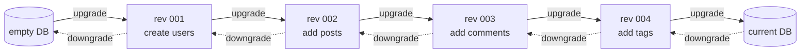
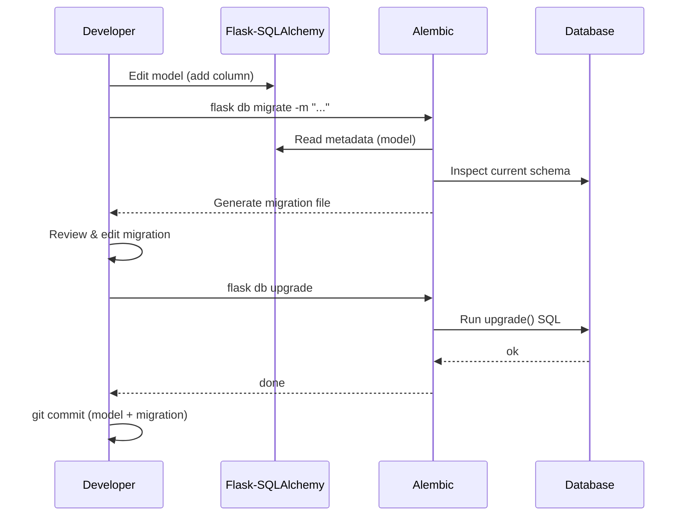
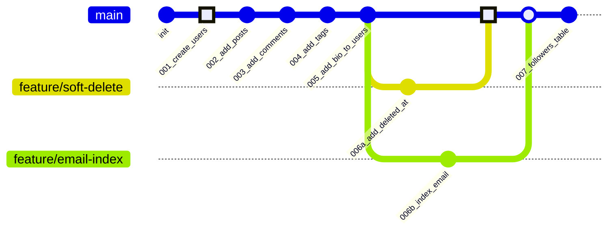
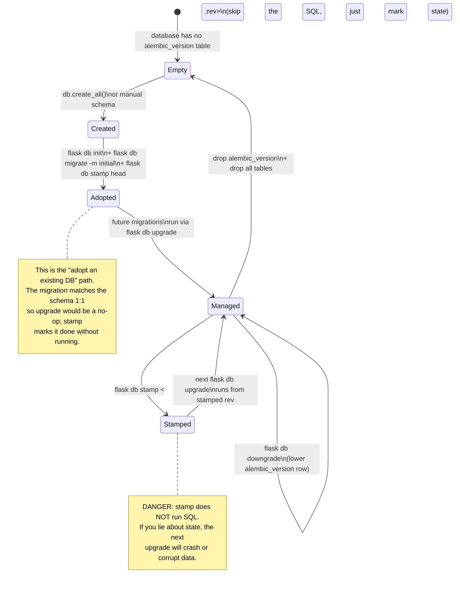
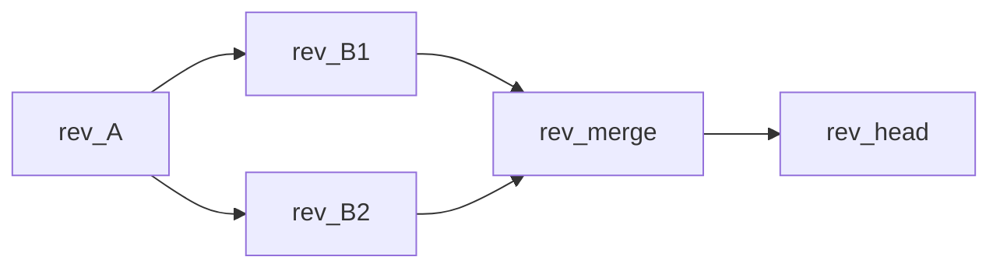
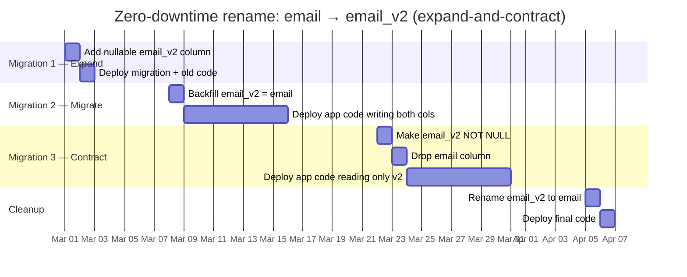
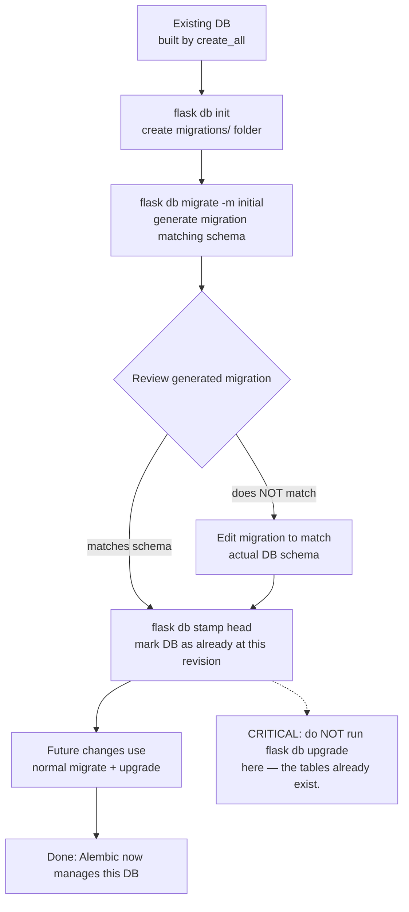

# Flask-Migrate

#flask #database #alembic #migrations #schema

> [!info] Version control for your database
> Flask-Migrate wraps [Alembic](https://alembic.sqlalchemy.org/) — SQLAlchemy's migration framework — and exposes it as Flask CLI commands (`flask db ...`). Without it, every schema change is a manual `ALTER TABLE` and a prayer. With it, your database schema becomes a versioned, reversible artifact tracked alongside your code.

This note assumes you've already read [[Flask-SQLAlchemy]] — migrations only make sense once you have models to migrate.

---

## 1. Overview & Metaphor

### What are migrations?

A migration is a **scripted, reversible change** to your database schema. Instead of running `ALTER TABLE users ADD COLUMN bio TEXT;` directly on production, you write a Python file that Alembic executes (and can undo).

The set of migrations forms a **linear history** — each migration knows its parent. Alembic walks the chain forward (`upgrade`) or backward (`downgrade`) to bring any database to any point in the schema's history.



### Why not `db.create_all()`?

In development you can just `db.create_all()` to make tables from your models. This works for toys but fails the moment you have real data:

- `create_all()` only **adds** missing tables. It cannot `ALTER` existing tables — add columns, change types, add indexes.
- It cannot **drop** things safely.
- It cannot reproduce a specific schema version for tests.
- It cannot deploy a schema change to production.

Migrations solve all of these.

> [!tip] The metaphor
> Migrations are **git for your database**. Each migration is a commit. `flask db upgrade` is `git checkout`. `flask db downgrade` is `git revert`. The migration files live in `migrations/versions/` exactly like commits live in `.git/`.

### What Flask-Migrate adds

Plain Alembic requires you to write an `alembic.ini`, an `env.py`, and wire up your metadata. Flask-Migrate:

- Generates a Flask-aware `env.py` that uses your `db` object's metadata.
- Adds `flask db <command>` to the CLI.
- Auto-detects model changes by comparing your `db.Model` classes to the current database schema.
- Integrates with the application factory pattern.

---

## 2. Installation

```bash
(venv) $ pip install Flask-Migrate
```

Versions in this note:

| Package | Version |
|---|---|
| Flask-Migrate | 4.0.x |
| Alembic | 1.13.x |
| Flask-SQLAlchemy | 3.1.x |

You must have Flask-SQLAlchemy set up first — Flask-Migrate reads from `db.metadata`. See [[Flask-SQLAlchemy#2-installation|FSA installation]].

---

## 3. Setup & Initialization

### Wire up `Migrate` in the factory

```python
# app/extensions.py
from flask_sqlalchemy import SQLAlchemy
from flask_migrate import Migrate

db = SQLAlchemy()
migrate = Migrate()  # created unbound
```

```python
# app/__init__.py
from flask import Flask
from app.extensions import db, migrate
from config import Config

def create_app(config_class=Config):
    app = Flask(__name__)
    app.config.from_object(config_class)

    db.init_app(app)
    migrate.init_app(app, db)  # MUST be after db.init_app

    # Register blueprints, etc.
    return app
```

> [!warning] Order matters
> `migrate.init_app(app, db)` must come **after** `db.init_app(app)`. If you reverse them, Alembic won't find your models.

### Initialize the migrations folder

```bash
(venv) $ flask db init
```

This creates:

```
migrations/
├── alembic.ini
├── env.py
├── README
├── script.py.mako
└── versions/   (empty)
```

| File | Purpose |
|---|---|
| `alembic.ini` | Alembic configuration (logging, script location). |
| `env.py` | The "runner" — sets up metadata, runs migrations. Flask-Migrate generates a Flask-aware version. |
| `script.py.mako` | Mako template for new migration files. |
| `versions/` | Where generated migration scripts live. |

> [!tip] Commit `migrations/` to git
> Migrations are **code**. They belong in version control. Without them, no one else can reproduce your schema. Add `migrations/` to git.

---

## 4. The Migration Workflow

The basic loop:

1. **Edit your models.** Add a column, change a type, add a relationship.
2. **Auto-generate a migration:**
   ```bash
   $ flask db migrate -m "add bio column to users"
   ```
3. **Review the generated file** in `migrations/versions/`. Alembic is smart but not omniscient.
4. **Apply it:**
   ```bash
   $ flask db upgrade
   ```
5. **Commit both the model change and the migration file** to git.

### Sequence diagram



The migrations themselves form a chain of revisions that looks just like a git history:



Just like `git merge` reconciles divergent commit histories, `flask db merge` reconciles divergent migration chains.

---

## 5. The `flask db` Command Reference

| Command | What it does |
|---|---|
| `flask db init` | Create the `migrations/` folder. One-time. |
| `flask db migrate -m "msg"` | Auto-generate a migration from model changes. |
| `flask db upgrade` | Apply pending migrations (forward). |
| `flask db downgrade` | Revert the most recent migration (or N). |
| `flask db upgrade <revision>` | Upgrade to a specific revision. |
| `flask db downgrade <revision>` | Downgrade to a specific revision. |
| `flask db current` | Show the current revision in the DB. |
| `flask db history` | List all migrations in order. |
| `flask db show` | Show details of a specific revision. |
| `flask db heads` | Show the latest revision(s). |
| `flask db stamp <revision>` | Mark the DB as being at a revision **without** running the migration. Dangerous. |
| `flask db edit <revision>` | Open a migration file in `$EDITOR`. |
| `flask db merge -m "msg"` | Create a merge migration when branches diverge. |
| `flask db check` | Show pending changes (no migration generated). |

### `flask db current`

```bash
$ flask db current
INFO  [alembic.runtime.migration] Running upgrade 3f8a -> 4b1c, add bio column to users
4b1c5d2e8f3a (head)
```

### `flask db history`

```bash
$ flask db history
4b1c5d2e8f3a (head) -> add bio column to users
3f8a2b1d4c5e      -> add posts table
2c1b9a0c3b4d      -> create users table
<base>
```

### `flask db upgrade` to a specific revision

```bash
$ flask db upgrade 3f8a2b1d4c5e   # upgrade to that revision (forward only)
$ flask db downgrade 3f8a2b1d4c5e # downgrade to that revision (backward only)
```

### `flask db stamp`



> [!warning] `stamp` is a footgun
> `stamp` writes a row to `alembic_version` saying "the DB is at revision X" **without running any SQL**. Use it when:
> - You have a database that was created by `db.create_all()` and you want to "adopt" Alembic: `flask db stamp head`.
> - You manually fixed something and need to skip a broken migration.
> 
> Never `stamp` to lie about state — you'll get crashes later when other migrations assume the schema is what the revision says it is.

---

## 6. Anatomy of a Migration File

When you run `flask db migrate`, Alembic creates a file like this:

```python
# migrations/versions/4b1c5d2e8f3a_add_bio_column_to_users.py
"""add bio column to users

Revision ID: 4b1c5d2e8f3a
Revises: 3f8a2b1d4c5e
Create Date: 2024-01-15 14:32:11.842135
"""
from alembic import op
import sqlalchemy as sa


# revision identifiers, used by Alembic.
revision = "4b1c5d2e8f3a"
down_revision = "3f8a2b1d4c5e"
branch_labels = None
depends_on = None


def upgrade():
    op.add_column("users", sa.Column("bio", sa.Text(), nullable=True))


def downgrade():
    op.drop_column("users", "bio")
```

### Key parts

- **`revision`**: a unique ID (Alembic uses a hash, but you can rename to `001_add_bio.py` if you prefer readable names).
- **`down_revision`**: the parent migration. This forms the chain.
- **`upgrade()`**: code that runs on `flask db upgrade`.
- **`downgrade()`**: code that runs on `flask db downgrade`. Should be the exact inverse of `upgrade()`.

### Operations reference (`op.*`)

```python
def upgrade():
    # Create / drop tables
    op.create_table(
        "posts",
        sa.Column("id", sa.Integer, primary_key=True),
        sa.Column("title", sa.String(200), nullable=False),
        sa.Column("author_id", sa.Integer, sa.ForeignKey("users.id")),
    )
    op.drop_table("old_table")

    # Add / drop columns
    op.add_column("users", sa.Column("bio", sa.Text))
    op.drop_column("users", "deprecated_field")

    # Alter column
    op.alter_column("users", "email",
                    existing_type=sa.String(120),
                    type_=sa.String(255),
                    nullable=True)

    # Rename column
    op.alter_column("users", "name", new_column_name="full_name")

    # Indexes
    op.create_index("idx_users_email", "users", ["email"], unique=True)
    op.drop_index("idx_users_email", table_name="users")

    # Foreign keys
    op.create_foreign_key(
        "fk_posts_author", "posts", "users", ["author_id"], ["id"]
    )
    op.drop_constraint("fk_posts_author", "posts", type_="foreignkey")

    # Check constraints
    op.create_check_constraint(
        "ck_posts_view_count_positive", "posts", "view_count >= 0"
    )

    # Execute raw SQL
    op.execute("UPDATE users SET bio = 'No bio yet' WHERE bio IS NULL")

    # Data migration with bulk_update
    users = op.get_bind().execute(sa.text("SELECT id, name FROM users")).fetchall()
    op.bulk_update("users", [{"id": u.id, "full_name": u.name.upper()} for u in users])
```

---

## 7. Auto-Detection Limitations

Alembic compares your SQLAlchemy model metadata to the live database schema. It detects:

- ✅ New tables, dropped tables
- ✅ New columns, dropped columns
- ✅ Type changes (`String(120)` → `String(255)`)
- ✅ Nullable changes
- ✅ Indexes (sometimes)
- ✅ Foreign keys (sometimes)

It **cannot** detect:

- ❌ Renamed columns / tables (looks like a drop + add — you lose data!)
- ❌ Server-side defaults (`server_default`)
- ❌ Check constraints
- ❌ Triggers, stored procedures, views
- ❌ Custom column types in some cases
- ❌ Changes to `__table_args__` (composite indexes, etc.) reliably

> [!danger] Rename vs drop+add
> If you rename a column in your model, Alembic sees it as: drop the old column, add a new one. **All data in the old column is lost.** Always review generated migrations before applying. To do a real rename, edit the migration:
>
> ```python
> def upgrade():
>     op.alter_column("users", "name", new_column_name="full_name")
> ```

### Worked example: rename a column

1. Rename in your model: `name = db.Column(...)` → `full_name = db.Column(...)`.
2. Run `flask db migrate -m "rename name to full_name"`.
3. Alembic generates a migration that **drops `name` and adds `full_name`**. This is wrong.
4. Edit the migration:

```python
def upgrade():
    op.alter_column(
        "users", "name",
        new_column_name="full_name",
        existing_type=sa.String(64),
    )

def downgrade():
    op.alter_column(
        "users", "full_name",
        new_column_name="name",
        existing_type=sa.String(64),
    )
```

5. `flask db upgrade`. Data preserved.

---

## 8. Custom Migrations

Sometimes you need to migrate data, not just schema. Write the migration manually:

```python
# migrations/versions/5c2d6e3f9g4b_split_full_name.py
"""split full_name into first_name and last_name

Revision ID: 5c2d6e3f9g4b
Revises: 4b1c5d2e8f3a
Create Date: 2024-02-01 10:00:00
"""
from alembic import op
import sqlalchemy as sa


revision = "5c2d6e3f9g4b"
down_revision = "4b1c5d2e8f3a"


def upgrade():
    # 1. Add new columns
    op.add_column("users", sa.Column("first_name", sa.String(64)))
    op.add_column("users", sa.Column("last_name", sa.String(64)))

    # 2. Migrate data
    bind = op.get_bind()
    users = bind.execute(sa.text("SELECT id, full_name FROM users")).fetchall()
    for user in users:
        parts = (user.full_name or "").split(" ", 1)
        first = parts[0]
        last = parts[1] if len(parts) > 1 else ""
        bind.execute(
            sa.text("UPDATE users SET first_name = :first, last_name = :last WHERE id = :id"),
            {"first": first, "last": last, "id": user.id},
        )

    # 3. Make new columns NOT NULL
    op.alter_column("users", "first_name", nullable=False)
    op.alter_column("users", "last_name", nullable=False)

    # 4. Drop the old column
    op.drop_column("users", "full_name")


def downgrade():
    # Reverse order
    op.add_column("users", sa.Column("full_name", sa.String(128)))
    bind = op.get_bind()
    users = bind.execute(sa.text("SELECT id, first_name, last_name FROM users")).fetchall()
    for user in users:
        bind.execute(
            sa.text("UPDATE users SET full_name = :name WHERE id = :id"),
            {"name": f"{user.first_name} {user.last_name}".strip(), "id": user.id},
        )
    op.alter_column("users", "full_name", nullable=False)
    op.drop_column("users", "first_name")
    op.drop_column("users", "last_name")
```

> [!tip] Always write a `downgrade()`
> A migration without `downgrade()` is a one-way door. Even if you never expect to use it, write it — it forces you to think about reversibility, which often surfaces design issues.

---

## 9. Multi-Database Support

If you use `SQLALCHEMY_BINDS` (multiple databases), Flask-Migrate can migrate each separately.

### Setup

```python
# app/extensions.py
db = SQLAlchemy()
migrate = Migrate()
```

```python
# app/__init__.py
migrate.init_app(app, db, render_as_batch=True)
```

### Per-database commands

```bash
$ flask db upgrade --database users
$ flask db migrate --database analytics -m "add event_index"
```

> [!note] `--database` requires explicit binds
> Each bind has its own migration chain. See the [Flask-Migrate multi-DB docs](https://flask-migrate.readthedocs.io/en/latest/#multiple-database-support).

### SQLite batch mode

SQLite doesn't support most `ALTER TABLE` operations directly. Alembic's "batch mode" works around this by creating a new table, copying data, dropping old, renaming.

```python
migrate.init_app(app, db, render_as_batch=True)
```

Or per-migration:

```python
def upgrade():
    with op.batch_alter_table("users") as batch_op:
        batch_op.alter_column("email", existing_type=sa.String(120), type_=sa.String(255))
        batch_op.add_column(sa.Column("bio", sa.Text))
```

> [!warning] Always use batch mode for SQLite
> If you develop on SQLite and deploy to Postgres, enable `render_as_batch=True`. Without it, migrations that work in dev (Postgres) will fail in test (SQLite), or vice versa.

---

## 10. Branching & Merging

When two developers both branch off `rev_A` and create `rev_B1` and `rev_B2`, you have a branch:

```
       rev_A
       /   \
   rev_B1  rev_B2
```

Alembic won't apply both — you must merge:

```bash
$ flask db merge -m "merge b1 and b2" rev_B1 rev_B2
```

This creates a merge revision with two `down_revision`s:

```python
revision = "rev_merge"
down_revision = ("rev_B1", "rev_B2")
```

Now `flask db upgrade` works again.



> [!tip] Avoid branches
> Branches happen when two devs push migrations without pulling. Communicate in your team: **whoever merges first wins**, the other rebases. Merges are unavoidable but should be rare.

---

## 11. Production Migration Strategies

Migrations on production databases are scary. Here's how to do it safely.

### Strategy 1: Expand-and-contract (zero-downtime)

For breaking changes (renames, type changes, NOT NULL additions), do it in **three migrations** over multiple deploys:



Each migration is backward-compatible with the running app code; the next app deploy is what flips the read/write target.

**Migration 1 (expand)** — add the new column nullable:
```python
def upgrade():
    op.add_column("users", sa.Column("email_v2", sa.String(255), nullable=True))
```

**Migration 2 (migrate)** — backfill, then start writing to both:
```python
def upgrade():
    op.execute("UPDATE users SET email_v2 = email")
    # Deploy app code that writes to BOTH columns
```

**Migration 3 (contract)** — once the app no longer reads `email`, make `email_v2` NOT NULL and drop `email`:
```python
def upgrade():
    op.alter_column("users", "email_v2", nullable=False)
    op.drop_column("users", "email")
    # Possibly rename
    op.alter_column("users", "email_v2", new_column_name="email")
```

> [!danger] NOT NULL on a large table
> Adding a `NOT NULL` column to a table with millions of rows **locks the table** in Postgres < 11. In Postgres 11+, you can add `NOT NULL` with a `DEFAULT` cheaply. Always test on a staging copy first.

### Strategy 2: Run before code deploy

For schema changes that the new code requires:

1. Deploy migration: `flask db upgrade`.
2. Deploy new app code.

The migration must be **backward-compatible** with the old code still running. (See expand-and-contract above.)

### Strategy 3: Run after code deploy

For schema changes that remove things the new code no longer uses:

1. Deploy new app code (no longer references the old column).
2. Deploy migration that drops the column.

### Strategy 4: Maintenance window

For changes that can't be made zero-downtime (rare), schedule a maintenance window:

1. Take app out of load balancer (return 503).
2. `flask db upgrade`.
3. Bring app back.

### CI/CD pipeline

```yaml
# .github/workflows/deploy.yml (excerpt)
- name: Run migrations
  run: |
    source venv/bin/activate
    flask db upgrade
  env:
    DATABASE_URL: ${{ secrets.PROD_DATABASE_URL }}
    SECRET_KEY: ${{ secrets.SECRET_KEY }}

- name: Deploy app
  run: gunicorn wsgi:app --bind 0.0.0.0:8000
```

> [!tip] Always backup before migrating prod
> ```bash
> pg_dump $DATABASE_URL > backup_$(date +%s).sql
> ```
> If a migration goes wrong, restore from backup and `flask db stamp <previous-rev>`.

---

## 12. Common Workflows

### Workflow A: Adding a column

```python
# app/models/user.py
class User(db.Model):
    # ...
    bio: Mapped[str | None] = mapped_column(db.Text)  # new!
```

```bash
$ flask db migrate -m "add bio to users"
# Review migrations/versions/xxx_add_bio_to_users.py
$ flask db upgrade
$ git add app/models/user.py migrations/
$ git commit -m "Add bio column to User"
```

### Workflow B: Adding a model

```python
# app/models/comment.py
class Comment(db.Model):
    id: Mapped[int] = mapped_column(primary_key=True)
    body: Mapped[str] = mapped_column(db.Text, nullable=False)
    post_id: Mapped[int] = mapped_column(db.ForeignKey("posts.id"))
```

```bash
$ flask db migrate -m "add comments table"
$ flask db upgrade
```

### Workflow C: Adding an index

```python
class User(db.Model):
    email: Mapped[str] = mapped_column(db.String(255), index=True)  # add index=True
```

```bash
$ flask db migrate -m "index users.email"
# REVIEW: Alembic should generate create_index. Sometimes it misses.
$ flask db upgrade
```

If Alembic misses the index, write it manually:

```python
def upgrade():
    op.create_index("ix_users_email", "users", ["email"])

def downgrade():
    op.drop_index("ix_users_email", table_name="users")
```

### Workflow D: Changing a column type

```python
# was: mapped_column(db.String(120))
# now: mapped_column(db.String(255))
class User(db.Model):
    email: Mapped[str] = mapped_column(db.String(255), unique=True)
```

```bash
$ flask db migrate -m "widen email column"
```

Alembic generates:

```python
def upgrade():
    op.alter_column("users", "email",
                    existing_type=sa.String(120),
                    type_=sa.String(255))
```

This works on Postgres but **may fail on SQLite** without batch mode.

### Workflow E: Adopting an existing database

You have a database that was created via `db.create_all()`. To start using Alembic:



```bash
$ flask db init
$ flask db migrate -m "initial"   # generates migration matching current schema
$ flask db stamp head              # mark DB as already at this revision
```

> [!warning] Don't run `flask db upgrade` after `migrate` here
> If you generated the migration from an existing schema, the DB is already at that state. Running `upgrade` would try to `CREATE TABLE` on tables that exist. Use `stamp head` to mark the DB as already migrated.

---

## 13. Common Pitfalls & Troubleshooting

> [!danger] Top 10 migration mistakes
> 1. **Committing model changes without a migration** — your code and schema drift apart.
> 2. **Running `flask db upgrade` without reviewing the generated migration** — silent data loss.
> 3. **Renaming a column** — Alembic sees drop+add. Manually rewrite as `alter_column(..., new_column_name=...)`.
> 4. **Not committing `migrations/` to git** — your teammates can't reproduce your schema.
> 5. **Forgetting `downgrade()`** — one-way door.
> 6. **Two devs creating migrations off the same parent** — branch conflict. Use `flask db merge`.
> 7. **NOT NULL on a populated table without a default** — fails on existing rows.
> 8. **Running migrations on prod without a backup** — recoverable only via prayer.
> 9. **Migration order matters** — `add_column` before `bulk_update` that uses it.
> 10. **Using SQLite in dev, Postgres in prod** — `render_as_batch=True` or test against Postgres.

### "Target database is not up to date"

```
Target database is not up to date.
```

**Cause**: The DB is at an older revision than your `head`.

**Fix**: `flask db upgrade`.

### "Can't locate revision identified by 'xxxx'"

**Cause**: The DB has a revision that doesn't exist in `migrations/versions/`. Usually means someone deleted a migration file from git but the DB was already migrated to it.

**Fix**:
1. Restore the missing migration file from git history.
2. Or `flask db stamp <real-revision>` to lie about state (dangerous).

### Multiple heads

```bash
$ flask db heads
abc123 (branch_a)
def456 (branch_b)
```

**Cause**: Two devs created migrations off the same parent.

**Fix**: `flask db merge -m "merge" abc123 def456`.

### `flask db migrate` finds nothing

You added a column to your model, but Alembic says "No changes in schema detected."

**Causes**:
- The model file isn't imported anywhere Alembic can see. Make sure `app/models/__init__.py` imports it.
- You changed something Alembic can't detect (server defaults, check constraints, `__table_args__`).
- The change is to a relationship (`db.relationship` doesn't appear in the schema; only the FK column does).

**Fix**: Write the migration manually.

### SQLite: `unsupported ALTER TABLE`

```
sqlalchemy.exc.OperationalError: (sqlite3.OperationalError) near "ALTER": syntax error
```

**Fix**: Enable batch mode.

```python
migrate.init_app(app, db, render_as_batch=True)
```

Or per-migration:

```python
with op.batch_alter_table("users") as batch_op:
    batch_op.alter_column(...)
```

---

## 14. Best Practices

> [!tip] Migration best practices
> 1. **Review every generated migration.** Alembic is wrong ~20% of the time.
> 2. **Always write `downgrade()`.**
> 3. **One change per migration.** Don't bundle "add column + add index + rename table" into one file.
> 4. **Use descriptive migration messages.** `flask db migrate -m "add user.bio column"` not `flask db migrate -m "wip"`.
> 5. **Test migrations against a copy of production data** before deploying.
> 6. **Backup prod before every migration.**
> 7. **Use expand-and-contract** for breaking changes.
> 8. **Commit migrations with the model change that produced them.** Atomic.
> 9. **Enable `render_as_batch=True`** if you use SQLite anywhere.
> 10. **Never edit a migration that's been deployed.** Write a new migration to fix it.

> [!danger] Editing deployed migrations
> If a migration has been run on any environment (including a teammate's dev DB), **never edit it**. The revision ID and `down_revision` form a chain that other migrations might depend on. If the migration is wrong, write a *new* migration that fixes it.

---

## 15. Integration with Other Extensions

### [[Flask-SQLAlchemy]]

Flask-Migrate reads `db.metadata` to compare with the DB. Any change to your SQLAlchemy models becomes a migration.

### Flask CLI

`flask db` is registered as a Flask CLI command group. You can add custom commands:

```python
# app/cli.py
import click
from flask import Flask

def register_cli_commands(app: Flask):
    @app.cli.command("db-seed")
    def db_seed():
        """Seed the database with sample data."""
        from app.extensions import db
        from app.models.user import User
        # ...
        click.echo("Seeded.")
```

### [[Production-Deployment]]

In your deploy script:

```bash
# pre-deploy hook
flask db upgrade
```

See [[Production-Deployment]].

### [[Pytest-Flask]]

Tests should run with a fresh schema. Either `db.create_all()` (fast, no migrations) or `flask db upgrade` (slower, but tests the real migrations):

```python
# tests/conftest.py
import pytest
from flask_migrate import upgrade
from app import create_app
from app.extensions import db

@pytest.fixture(scope="session")
def app():
    app = create_app(testing=True)
    with app.app_context():
        # Option A: skip migrations (faster)
        db.create_all()
        yield app
        db.drop_all()

        # Option B: use real migrations
        # upgrade()
        # yield app
        # db.drop_all()
```

---

## 16. Real-World Example: A Full Migration Workflow

A complete walkthrough — adding a "deleted_at" column for soft deletes.

### Step 1: Update the model

```python
# app/models/user.py
from datetime import datetime
from sqlalchemy.ext.hybrid import hybrid_property

class User(db.Model):
    # ... existing columns ...
    deleted_at: Mapped[datetime | None] = mapped_column(db.DateTime, nullable=True)

    @hybrid_property
    def is_deleted(self):
        return self.deleted_at is not None

    @is_deleted.expression
    def is_deleted(cls):
        return cls.deleted_at.isnot(None)
```

### Step 2: Generate the migration

```bash
$ flask db migrate -m "add soft-delete to users"
INFO  [alembic.autogenerate.compare] Detected added column 'users.deleted_at'
  Generating /path/to/migrations/versions/7a8b9c0d1e2f_add_soft_delete_to_users.py ... done
```

### Step 3: Review

```python
# migrations/versions/7a8b9c0d1e2f_add_soft_delete_to_users.py
"""add soft-delete to users

Revision ID: 7a8b9c0d1e2f
Revises: 6b7c8d9e0f1a
Create Date: 2024-03-15 12:00:00
"""
from alembic import op
import sqlalchemy as sa


revision = "7a8b9c0d1e2f"
down_revision = "6b7c8d9e0f1a"


def upgrade():
    op.add_column("users", sa.Column("deleted_at", sa.DateTime(), nullable=True))
    op.create_index("ix_users_deleted_at", "users", ["deleted_at"])


def downgrade():
    op.drop_index("ix_users_deleted_at", table_name="users")
    op.drop_column("users", "deleted_at")
```

### Step 4: Test locally

```bash
$ flask db upgrade
INFO  [alembic.runtime.migration] Running upgrade 6b7c8d9e0f1a -> 7a8b9c0d1e2f, add soft-delete to users

# Verify
$ flask shell
>>> from app.models import User
>>> from sqlalchemy import func, select
>>> db.session.execute(select(func.count()).select_from(User)).scalar()  # works
```

### Step 5: Test the downgrade

```bash
$ flask db downgrade
INFO  [alembic.runtime.migration] Running downgrade 7a8b9c0d1e2f -> 6b7c8d9e0f1a, add soft-delete to users

$ flask db upgrade   # back to head
```

### Step 6: Commit

```bash
$ git add app/models/user.py migrations/versions/7a8b9c0d1e2f_add_soft_delete_to_users.py
$ git commit -m "Add soft-delete column to User model"
```

### Step 7: Deploy

```bash
# On the production server:
$ git pull
$ source venv/bin/activate
$ flask db current        # show current revision
$ flask db history        # see pending
$ pg_dump $DATABASE_URL > backup_$(date +%s).sql
$ flask db upgrade
$ systemctl restart gunicorn
```

---

## 17. References & Further Reading

- [Flask-Migrate docs](https://flask-migrate.readthedocs.io/) — the canonical reference.
- [Alembic documentation](https://alembic.sqlalchemy.org/) — the underlying engine.
- [Alembic cookbook](https://alembic.sqlalchemy.org/en/latest/cookbook.html) — advanced recipes.
- [Expand-and-contract pattern](https://www.brunton-spall.co.uk/post/2014/05/06/database-migrations-done-right/) — the canonical blog post on safe migrations.
- [Strong Migrations gem (Ruby)](https://github.com/ankane/strong_migrations) — the philosophy transfers to Python.

---

## 18. Cheat Sheet

```bash
# One-time setup
flask db init

# Daily workflow
flask db migrate -m "description"
# review the generated file!
flask db upgrade

# Inspecting
flask db current
flask db history
flask db heads

# Rollback
flask db downgrade          # one step back
flask db downgrade <rev>    # to a specific revision

# Branches
flask db merge -m "msg" rev1 rev2

# Adopting an existing DB
flask db init
flask db migrate -m "initial"
flask db stamp head

# Multi-DB
flask db upgrade --database users
```

```python
# Common op.* operations
op.create_table(...)
op.drop_table("name")
op.add_column("tbl", sa.Column(...))
op.drop_column("tbl", "col")
op.alter_column("tbl", "col", type_=..., nullable=..., new_column_name=...)
op.create_index("name", "tbl", ["col"], unique=True)
op.drop_index("name", table_name="tbl")
op.create_foreign_key("name", "src", "dst", ["src_col"], ["dst_col"])
op.execute("UPDATE ...")
```

---

*See also: [[Flask-SQLAlchemy]] · [[Project-Structure]] · [[Production-Deployment]] · [[Pytest-Flask]] · [[00-Map-of-Content]]*
