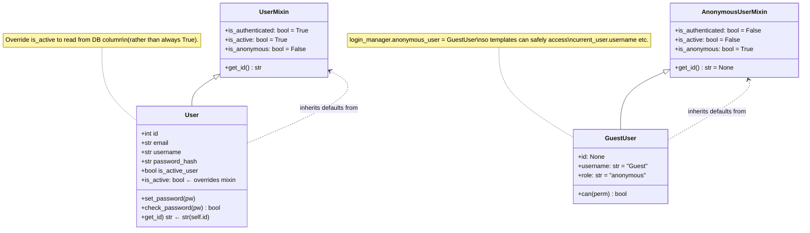
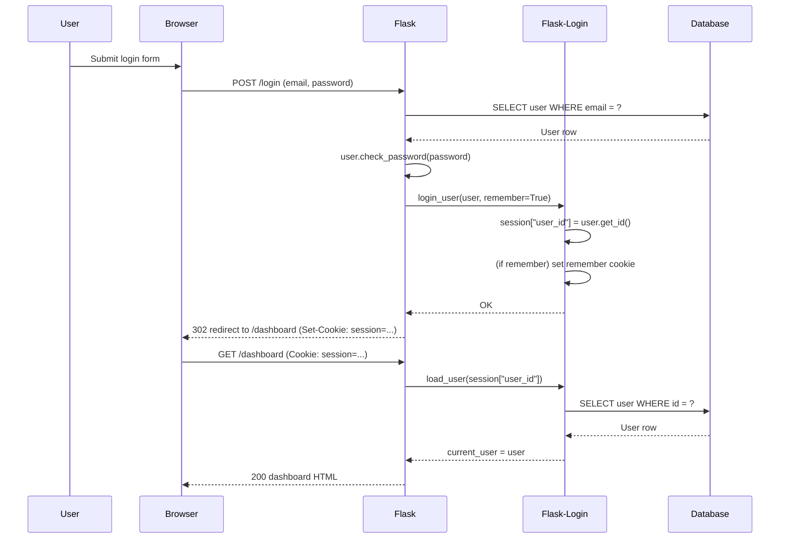
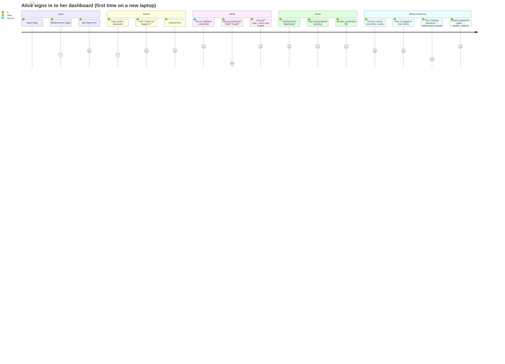
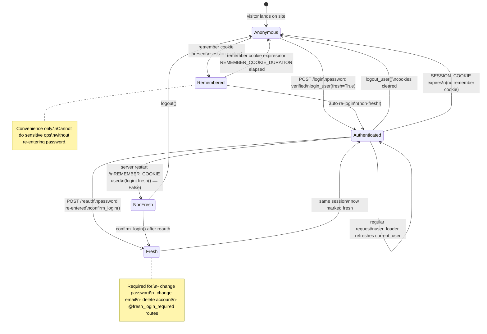
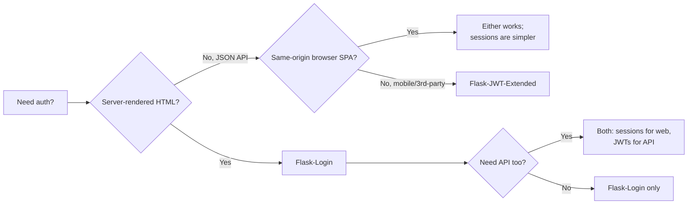

# Flask-Login

#flask #authentication #login #sessions #security

> [!info] The session-based authentication standard for Flask
> Flask-Login provides user session management for Flask. It handles the common tasks of logging in, logging out, and remembering your users' sessions over time. It does **not** handle authentication itself — that is, it does not verify passwords, hash them, or look users up in a database. It only manages the **session state** after you've already decided the user is who they claim to be.

Think of Flask-Login as the **bouncer's clipboard** at a club: the bouncer (your password-checking code) decides whether to let you in; once you're in, the bouncer hands you a wristband (the session cookie), and every subsequent door inside the club checks the wristband, not your ID.

---

## 1. Overview & Metaphor

### What is session-based authentication?

When a user logs in to a website, the server needs to remember "this browser is Alice" for every subsequent request. HTTP is stateless, so the server has two places to put that memory:

1. **In a cookie on the user's browser** — a small string the browser sends with every request. The string is either:
   - The state itself (encrypted or signed), as in JWTs — see [[Flask-JWT-Extended]].
   - A **session ID** that points to state stored server-side. This is what Flask-Login uses.
2. **In a custom header like `Authorization: Bearer <token>`** — typical for APIs.

Flask's built-in `session` object is a signed cookie that stores a dict. Flask-Login uses it to store one key: the user's ID. On every request, Flask-Login's `user_loader` callback turns that ID back into a Python user object, then exposes it as `current_user`.

### Why Flask-Login?

You could do all of this with raw Flask:

```python
from flask import Flask, session, redirect, request

app = Flask(__name__)
app.secret_key = "dev"

@app.route("/login", methods=["POST"])
def login():
    if check_password(request.form["email"], request.form["password"]):
        session["user_id"] = get_user_id(request.form["email"])
        return redirect("/")
    return "Bad credentials", 401
```

That works for a toy. Real apps need:

- A `current_user` proxy accessible from templates and views.
- A `@login_required` decorator that redirects unauthenticated users.
- "Remember me" — long-lived cookies that survive browser restarts.
- Session protection against session hijacking (IP/user-agent changes).
- A clean way to define what "is this user logged in?" means for custom user classes.
- CSRF-friendly logout.

Flask-Login packages all of this into ~500 lines of well-tested code.

> [!tip] The metaphor
> Flask-Login is a **hotel keycard system**. You check in at the front desk (your `/login` view), the desk issues a keycard (the session cookie), and from then on every door in the hotel reads your keycard without calling the front desk. The keycard has a number on it (the user ID); the front desk can look up who that number belongs to (the `user_loader`). If you lose the card, anyone finding it can use it — which is why we have "session protection" (the equivalent of checking the photo on the card against the bearer).

### What Flask-Login does NOT do

| Concern | Who handles it |
|---|---|
| Password hashing | `werkzeug.security` (`generate_password_hash`, `check_password_hash`) or `argon2-cffi` / `passlib` |
| User storage | [[Flask-SQLAlchemy]] or any database |
| Login forms & CSRF | [[Flask-WTF]] |
| OAuth / social login | `authlib`, `django-allauth` (port), or `Authlib-Flask` |
| Rate limiting brute-force attempts | [[Flask-Limiter]] |
| Session cookie transport security | Flask `SESSION_COOKIE_*` config |
| Token-based API auth | [[Flask-JWT-Extended]] |

---

## 2. Installation

```bash
(venv) $ pip install Flask-Login
```

Versions referenced in this note:

| Package | Version |
|---|---|
| Flask | 3.0.x |
| Flask-Login | 0.6.x |
| Flask-SQLAlchemy | 3.1.x |

> [!warning] Flask-Login 0.6 vs 0.5
> 0.6 dropped Python 3.7 support and changed `LoginManager.unauthorized` to use `abort()` instead of returning a redirect directly, which makes custom callbacks cleaner. The public API you actually use (`login_user`, `current_user`, `@login_required`, etc.) is unchanged.

No native dependencies; pure Python.

---

## 3. Configuration

### Minimal setup

```python
# app/extensions.py
from flask_login import LoginManager

login_manager = LoginManager()
login_manager.login_view = "auth.login"          # endpoint name, not URL
login_manager.login_message = "Please log in to access this page."
login_manager.login_message_category = "info"
```

```python
# app/__init__.py
from flask import Flask
from app.extensions import db, login_manager
from app.models.user import User

def create_app():
    app = Flask(__name__)
    app.config["SECRET_KEY"] = "change-me-in-production"
    app.config["SESSION_TYPE"] = "filesystem"

    db.init_app(app)
    login_manager.init_app(app)

    @login_manager.user_loader
    def load_user(user_id: str):
        return db.session.get(User, int(user_id))

    from app.auth import auth_bp
    app.register_blueprint(auth_bp)

    return app
```

### All configuration options

Flask-Login reads its own config from the `LoginManager` object attributes, **not** from `app.config`. Flask itself controls the underlying session cookie via `app.config`.

#### `LoginManager` attributes

| Attribute | Default | Description |
|---|---|---|
| `login_view` | `None` | Endpoint name to redirect to when `@login_required` fails. If `None`, raises 401. |
| `login_message` | `"Please log in to access this page."` | Flash message on redirect. Set to `None` to disable flashing. |
| `login_message_category` | `"message"` | Flash category. |
| `refresh_view` | `None` | Endpoint name for "fresh login required" redirect. |
| `needs_refresh_message` | `"Please reauthenticate to access this page."` | Flash message for fresh-login redirect. |
| `needs_refresh_message_category` | `"message"` | Flash category. |
| `session_protection` | `"basic"` | One of `None`, `"basic"`, `"strong"`. See §6. |
| `localize_callback` | `None` | Callable to translate messages (e.g., Flask-Babel's `_`). |
| `anonymous_user` | `AnonymousUserMixin` | Class to instantiate for `current_user` when no one is logged in. |

#### Flask session config (relevant to auth)

| `app.config` key | Default | Description |
|---|---|---|
| `SECRET_KEY` | `None` | **Required.** Used to sign the session cookie. |
| `SESSION_COOKIE_NAME` | `"session"` | Cookie name. |
| `SESSION_COOKIE_HTTPONLY` | `True` | Prevent JS from reading the cookie. **Leave True.** |
| `SESSION_COOKIE_SECURE` | `False` | If `True`, cookie only sent over HTTPS. **Set True in prod.** |
| `SESSION_COOKIE_SAMESITE` | `None` | `"Lax"` (recommended) or `"Strict"`. Mitigates CSRF. |
| `PERMANENT_SESSION_LIFETIME` | `timedelta(days=31)` | How long a "permanent" (remember-me) session lasts. |
| `SESSION_REFRESH_EACH_REQUEST` | `True` | Re-send cookie on every response. |

> [!danger] Set `SESSION_COOKIE_SECURE = True` in production
> If you don't, the cookie will be sent over plain HTTP if a user ever hits `http://yoursite.com`, leaking the session to anyone sniffing traffic. Combine with HSTS to prevent the downgrade in the first place.

### Production config

```python
# app/config.py
import os
from datetime import timedelta

class Config:
    SECRET_KEY = os.environ["SECRET_KEY"]
    SESSION_COOKIE_SECURE = True
    SESSION_COOKIE_HTTPONLY = True
    SESSION_COOKIE_SAMESITE = "Lax"
    PERMANENT_SESSION_LIFETIME = timedelta(days=14)
    REMEMBER_COOKIE_DURATION = timedelta(days=30)
    REMEMBER_COOKIE_SECURE = True
    REMEMBER_COOKIE_HTTPONLY = True
    REMEMBER_COOKIE_SAMESITE = "Strict"
```

---

## 4. Basic Usage

### The four required user methods

Flask-Login needs your user class to expose four properties:

| Method / property | Returns | Purpose |
|---|---|---|
| `is_authenticated` | `bool` | `True` if the user has provided valid credentials. Usually `True` for real users. |
| `is_active` | `bool` | `True` if the account is enabled (not banned / not pending email confirmation). |
| `is_anonymous` | `bool` | `True` for the special "guest" user, `False` for everyone real. |
| `get_id()` | `str` | A unique identifier stored in the session. Must be a `str`. |

### `UserMixin`

`flask_login.UserMixin` provides default implementations of all four:



```python
class UserMixin:
    @property
    def is_authenticated(self): return True
    @property
    def is_active(self):      return True
    @property
    def is_anonymous(self):   return False
    def get_id(self):         return str(self.id)
```

Just inherit from it:

```python
# app/models/user.py
from datetime import datetime
from werkzeug.security import generate_password_hash, check_password_hash
from flask_login import UserMixin
from app.extensions import db


class User(UserMixin, db.Model):
    __tablename__ = "users"

    id = db.Column(db.Integer, primary_key=True)
    email = db.Column(db.String(255), unique=True, nullable=False, index=True)
    username = db.Column(db.String(64), unique=True, nullable=False)
    password_hash = db.Column(db.String(255), nullable=False)
    is_active_user = db.Column(db.Boolean, default=True, nullable=False)
    created_at = db.Column(db.DateTime, default=datetime.utcnow)

    def set_password(self, password: str) -> None:
        self.password_hash = generate_password_hash(password)

    def check_password(self, password: str) -> bool:
        return check_password_hash(self.password_hash, password)

    # Override the mixin to use the *account* flag, not the constant True.
    @property
    def is_active(self) -> bool:
        return self.is_active_user
```

> [!warning] `is_active` shadows column names
> If you already have a column called `is_active`, you have a clash. The common fix is to name the DB column `is_active_user` (as above) and override `is_active` as a property. Otherwise Flask-Login's mixin and SQLAlchemy's column descriptor fight each other and you get a confusing `AttributeError`.

### The login flow

```python
# app/auth/views.py
from flask import Blueprint, render_template, redirect, url_for, request, flash
from flask_login import login_user, logout_user, login_required, current_user
from app.extensions import db
from app.models.user import User
from app.auth.forms import LoginForm

auth_bp = Blueprint("auth", __name__)


@auth_bp.route("/login", methods=["GET", "POST"])
def login():
    if current_user.is_authenticated:
        return redirect(url_for("main.dashboard"))

    form = LoginForm()
    if form.validate_on_submit():
        user = db.session.scalar(
            db.select(User).where(User.email == form.email.data)
        )
        if user is None or not user.check_password(form.password.data):
            flash("Invalid email or password", "danger")
            return redirect(url_for("auth.login"))

        login_user(user, remember=form.remember_me.data)
        next_page = request.args.get("next")
        # Prevent open redirect — see §7.
        if not next_page or not next_page.startswith("/"):
            next_page = url_for("main.dashboard")
        return redirect(next_page)

    return render_template("auth/login.html", form=form)


@auth_bp.route("/logout")
@login_required
def logout():
    logout_user()
    flash("You have been logged out.", "info")
    return redirect(url_for("main.index"))
```

### The login form (with [[Flask-WTF]])

```python
# app/auth/forms.py
from flask_wtf import FlaskForm
from wtforms import StringField, PasswordField, BooleanField, SubmitField
from wtforms.validators import DataRequired, Email, Length


class LoginForm(FlaskForm):
    email = StringField("Email", validators=[DataRequired(), Email()])
    password = PasswordField("Password", validators=[DataRequired(), Length(min=8)])
    remember_me = BooleanField("Keep me logged in")
    submit = SubmitField("Sign In")
```

### Template

```html
<!-- app/templates/auth/login.html -->


  <h2>Sign in</h2>
  <form method="post">
    {{ form.hidden_tag() }}
    <p>{{ form.email.label }} {{ form.email(size=40) }}</p>
    <p>{{ form.password.label }} {{ form.password(size=40) }}</p>
    <p>{{ form.remember_me() }} {{ form.remember_me.label }}</p>
    <p>{{ form.submit() }}</p>
    
      <div class="flash {{ category }}">{{ message }}</div>
    
  </form>

```

### Protecting views

```python
from flask_login import login_required

@app.route("/settings")
@login_required
def settings():
    return render_template("settings.html", user=current_user)
```

### Login sequence diagram



### Login UX journey



---

## 5. Intermediate Patterns

### `current_user` in templates

Flask-Login injects `current_user` into the Jinja context automatically:

```html
<!-- base.html -->
<nav>
  
    <a href="{{ url_for('main.dashboard') }}">{{ current_user.username }}</a>
    <a href="{{ url_for('auth.logout') }}">Sign out</a>
  
    <a href="{{ url_for('auth.login') }}">Sign in</a>
    <a href="{{ url_for('auth.register') }}">Register</a>
  
</nav>
```

### Anonymous user customization

By default, `current_user` for a logged-out visitor is an `AnonymousUserMixin` whose `is_authenticated` is `False`. You can replace it:

```python
# app/extensions.py
from flask_login import AnonymousUserMixin

class GuestUser(AnonymousUserMixin):
    """A guest with sensible defaults for templates."""
    id = None
    username = "Guest"
    role = "anonymous"

    def can(self, permission: str) -> bool:
        return False


login_manager.anonymous_user = GuestUser
```

Now `current_user.username` won't blow up in templates for logged-out visitors.

### The `user_loader` callback

Flask-Login calls this **on every request** that has a session cookie. It must return `None` if the ID is invalid (don't raise):

```python
@login_manager.user_loader
def load_user(user_id: str):
    try:
        return db.session.get(User, int(user_id))
    except (ValueError, TypeError):
        return None
```

> [!tip] Cache the user lookup
> This function runs on **every authenticated request**. If you're hitting the DB each time, you have an extra query per page view. Cache it (e.g., `flask_caching`'s `@cache.memoize(timeout=60)` keyed on `user_id`) — but invalidate on logout and on profile changes.

### The `request_loader` (alternative)

If you can't use a session cookie — e.g., authenticating API clients with a token in a header — Flask-Login provides `request_loader`. It runs on every request, *before* `user_loader`, and lets you decide authentication from `request` directly:

```python
from flask import request

@login_manager.request_loader
def load_user_from_request(request):
    token = request.headers.get("Authorization")
    if token and token.startswith("Bearer "):
        token = token[7:]
        user = User.verify_auth_token(token)   # your own token logic
        if user:
            return user
    return None
```

> [!warning] If you need real tokens, use [[Flask-JWT-Extended]]
> The `request_loader` is fine for "good enough" token schemes — but if you need expiration, refresh tokens, or claims, JWT-Extended is purpose-built. Rolling your own token format is a classic security bug.

### Remember me

`login_user(user, remember=True)` writes **two** cookies:

1. The Flask `session` cookie (short-lived by default).
2. A separate `remember_token` cookie (longer-lived, set via `REMEMBER_COOKIE_DURATION`).

When the session expires, the remember cookie triggers a re-login automatically inside Flask-Login's request lifecycle. You don't write any code for it — but the user's session is **reset**, so any data you stashed in `session["..."]` is gone.

> [!note] Remember cookies are not "fresh"
> A user coming back via a remember cookie is considered **non-fresh** (see §6). This is by design: a stolen remember cookie shouldn't be enough to change the password.

### Custom unauthorized handler

By default, `@login_required` flashes a message and redirects to `login_view`. If you're building an API, you want a JSON 401 instead:

```python
from flask import jsonify
from flask_login import current_user

@login_manager.unauthorized_handler
def unauthorized():
    if request.path.startswith("/api/"):
        return jsonify(error="authentication required"), 401
    return redirect(url_for("auth.login"))
```

### Group / role checks

Flask-Login has no built-in RBAC. Roll your own:

```python
# app/auth/decorators.py
from functools import wraps
from flask import abort
from flask_login import current_user


def role_required(*roles: str):
    def decorator(fn):
        @wraps(fn)
        @login_required
        def wrapper(*args, **kwargs):
            if current_user.role not in roles:
                abort(403)
            return fn(*args, **kwargs)
        return wrapper
    return decorator


# usage
@auth_bp.route("/admin")
@role_required("admin", "superadmin")
def admin_panel():
    ...
```

> [!tip] Consider `Flask-Principal` or `Flask-User` for advanced RBAC
> For complex permission systems, the ecosystem has more specialized tools. For simple role checks, the decorator above is enough.

---

## 6. Advanced Usage

### Session protection: `basic` vs `strong`

Flask-Login records the user's IP and User-Agent as part of the session. When these change between requests, that's a possible session-theft signal.

| Mode | Behavior |
|---|---|
| `None` | No check. |
| `"basic"` (default) | If IP/UA changes, the session is simply deleted and the user is treated as anonymous. If a remember cookie is present, they're silently re-logged-in. |
| `"strong"` | If IP/UA changes, the session is deleted AND the remember cookie is deleted. The user is fully logged out. |

```python
login_manager.session_protection = "strong"
```

> [!warning] `strong` breaks mobile networks
> Mobile users can flip between Wi-Fi and cellular mid-session, changing their IP. `strong` will log them out, which is annoying. Reserve `strong` for high-security apps (banking, admin consoles) or scope it to specific blueprints with a custom check.

### Fresh vs non-fresh logins

A **fresh** login is one where the user typed their password this session. A **non-fresh** session is one re-established from a "remember me" cookie. Flask-Login lets you require freshness for sensitive operations:



```python
from flask_login import fresh_login_required, login_fresh

@app.route("/change-password", methods=["GET", "POST"])
@fresh_login_required
def change_password():
    ...
```

When a non-fresh user hits `@fresh_login_required`, they're redirected to `login_manager.refresh_view`. You should configure that:

```python
login_manager.refresh_view = "auth.reauthenticate"
login_manager.needs_refresh_message = "Please re-enter your password to continue."
```

```python
@auth_bp.route("/reauth", methods=["GET", "POST"])
@login_required
def reauthenticate():
    form = ReauthForm()
    if form.validate_on_submit():
        if current_user.check_password(form.password.data):
            confirm_login()                       # marks session fresh
            flash("Reauthenticated.", "success")
            return redirect(request.args.get("next") or url_for("main.index"))
        flash("Incorrect password.", "danger")
    return render_template("auth/reauth.html", form=form)
```

You can also check freshness inline:

```python
from flask_login import login_fresh

if not login_fresh():
    return redirect(url_for("auth.reauthenticate"))
```

### Alternative: token-based auth with Flask-Login

If you want a stateless token but don't want to bring in JWT, you can implement an `itsdangerous`-signed token on the user model:

```python
from itsdangerous import TimedSerializer, BadSignature, SignatureExpired

class User(UserMixin, db.Model):
    ...

    def get_auth_token(self) -> str:
        s = TimedSerializer(current_app.config["SECRET_KEY"], salt="auth-token")
        return s.dumps({"id": self.id, "pw": self.password_hash[-8:]})

    @staticmethod
    def verify_auth_token(token: str, max_age: int = 86400) -> "User | None":
        s = TimedSerializer(current_app.config["SECRET_KEY"], salt="auth-token")
        try:
            data = s.loads(token, max_age=max_age)
        except (BadSignature, SignatureExpired):
            return None
        user = db.session.get(User, data["id"])
        # Invalidate token when password changes:
        if user and user.password_hash[-8:] == data["pw"]:
            return user
        return None
```

Then plug it into `request_loader` as shown in §5. The `pw` suffix means changing the password invalidates all outstanding tokens — useful for "log out everywhere".

> [!warning] This pattern is fine but limited
> It doesn't have refresh tokens, custom claims, or revocation lists. If you find yourself wanting those, switch to [[Flask-JWT-Extended]] — it's the right tool.

### Multi-tenant / per-blueprint auth

If you have two user populations (e.g., customers and staff) and want separate sessions:

```python
customer_lm = LoginManager()
customer_lm.login_view = "customer.login"
customer_lm.user_loader_id = "customer_user_id"  # custom session key (custom subclass needed)

staff_lm = LoginManager()
staff_lm.login_view = "staff.login"
```

In practice, this requires subclassing `LoginManager` to override the session key — most teams instead use a single user table with a `role` column. The single-table approach is simpler and almost always sufficient.

### Disabling logins during maintenance

```python
@login_manager.user_loader
def load_user(user_id):
    if current_app.config["MAINTENANCE_MODE"]:
        return None
    return db.session.get(User, int(user_id))
```

Everyone is forced into anonymous mode — useful for read-only deploys.

---

## 7. Common Pitfalls & Troubleshooting

### Pitfall 1: "current_user is AnonymousUserMixin" right after `login_user`

**Cause**: You called `login_user(user)` but didn't `commit` the DB transaction, so `user.id` is `None` and `get_id()` returns `"None"`.

**Fix**:

```python
db.session.commit()       # ensure user.id is populated
login_user(user)
```

### Pitfall 2: Session not persisting across requests

Check `SECRET_KEY`. If it's `None` or changes between requests, Flask can't decrypt the cookie.

```python
# WRONG — random key per process start
app.config["SECRET_KEY"] = os.urandom(32)

# RIGHT — stable, from env
app.config["SECRET_KEY"] = os.environ["SECRET_KEY"]
```

### Pitfall 3: Open redirect via the `next` parameter

```python
# VULNERABLE
return redirect(request.args.get("next", "/"))
# An attacker can craft /login?next=https://evil.com and phish users.
```

**Fix**: Only allow relative URLs:

```python
next_page = request.args.get("next") or url_for("main.dashboard")
if not next_page.startswith("/") or next_page.startswith("//"):
    next_page = url_for("main.dashboard")
return redirect(next_page)
```

Use `url_has_allowed_host_and_scheme` from `werkzeug.security` (or `urllib.parse.urlparse`) for stricter checks.

### Pitfall 4: "AttributeError: 'AnonymousUserMixin' has no attribute 'username'"

You accessed `current_user.username` in a template while the user was logged out.

**Fix**: Either guard with `` or use a custom `anonymous_user` (see §5).

### Pitfall 5: `@login_required` not redirecting

Likely causes:

1. `login_manager.login_view` is `None` → Flask-Login returns 401 instead of redirecting.
2. You forgot `login_manager.init_app(app)`.
3. The endpoint name is wrong (it's `"auth.login"`, not `"/login"`).

### Pitfall 6: Cookies not working in production

Symptom: login works on `localhost`, fails in prod. Check:

- `SESSION_COOKIE_SECURE = True` will silently fail if the page is loaded over HTTP.
- `SESSION_COOKIE_SAMESITE = "Strict"` breaks login redirects from external sites (e.g., SSO callbacks). Use `"Lax"`.
- Reverse proxy stripping the `X-Forwarded-Proto` header? Configure `ProxyFix`.

### Pitfall 7: Logging the same user in twice creates two sessions

Each browser session is independent. If a user opens two tabs and logs in to one, the other is also logged in (same session cookie). If they log in to two browsers, each has its own session — that's correct, not a bug.

### Pitfall 8: `confirm_login()` after remember-me doesn't make the session fresh

If a user logged in via remember cookie and then types their password into a normal `/login` form, that *is* a fresh login — use `login_user(user, fresh=True)` explicitly to be safe.

### Troubleshooting checklist

```mermaid
flowchart TD
    A[Login broken?] --> B{current_user anonymous<br/>after login_user?}
    B -- Yes --> C[Did you db.session.commit()?<br/>user.id must be set]
    B -- No --> D{Cookie not sent on<br/>next request?}
    D -- Yes --> E[SECRET_KEY stable?<br/>SESSION_COOKIE_SECURE matches https?]
    D -- No --> F{user_loader returning None?}
    F -- Yes --> G[user_id format mismatch?<br/>str vs int?]
    F -- No --> H{@login_required 401s<br/>instead of redirect?]
    H --> I[login_view set to endpoint name?]
```

---

## 8. Best Practices

### Password handling

- Always hash with `werkzeug.security.generate_password_hash` (default `scrypt` since Werkzeug 2.3) — never store plaintext.
- Use a constant-time comparison (`check_password_hash` does this; never `==`).
- Reject passwords shorter than 12 chars; consider checking against `haveibeenpwned` API.

### Cookie hardening

| Setting | Production value |
|---|---|
| `SESSION_COOKIE_SECURE` | `True` |
| `SESSION_COOKIE_HTTPONLY` | `True` |
| `SESSION_COOKIE_SAMESITE` | `"Lax"` |
| `REMEMBER_COOKIE_SECURE` | `True` |
| `REMEMBER_COOKIE_HTTPONLY` | `True` |
| `REMEMBER_COOKIE_SAMESITE` | `"Strict"` |

Pair with HSTS: `Strict-Transport-Security: max-age=63072000; includeSubDomains`.

### Rate-limit login endpoints

Pair with [[Flask-Limiter]]:

```python
from flask_limiter import Limiter
from flask_limiter.util import get_remote_address

limiter = Limiter(key_func=get_remote_address, default_limits=[])

@auth_bp.route("/login", methods=["POST"])
@limiter.limit("10/minute;100/hour")
def login(): ...
```

### CSRF

`@login_required` doesn't help if a malicious site can POST to your logout endpoint. Flask-WTF provides CSRF protection on forms; for AJAX, use the `X-CSRFToken` header pattern. See [[Flask-WTF]].

### Rotate `SECRET_KEY`

Rotating invalidates all sessions (force-logout everyone). Do it deliberately:

```python
app.config["SECRET_KEY"] = new_key
app.config["SECRET_KEY_FALLBACKS"] = [old_key]  # supported in Flask 2.3+
```

The fallback list lets old cookies continue to work until they expire naturally.

### Don't roll your own crypto

If you find yourself reaching for `hashlib.sha256(password)`, stop. Use `werkzeug.security` or `argon2-cffi`.

---

## 9. Integration with Other Flask Extensions

### With [[Flask-SQLAlchemy]]

The standard pairing. Your user model is a `db.Model` and a `UserMixin`. See the full example in §10.

### With [[Flask-WTF]]

`FlaskForm` provides CSRF tokens and form validation. Every login form should use it. The `flask_login` extension itself is CSRF-agnostic; Flask-WTF protects your POST routes.

### With [[Flask-Migrate]]

When you add new columns to `User` (e.g., `last_login_at`), create a migration with `flask db migrate -m "add last_login_at to user"` and `flask db upgrade`.

### With [[Flask-Mail]]

For "forgot password" flows:

```python
from itsdangerous import URLSafeTimedSerializer

def generate_reset_token(user: User) -> str:
    s = URLSafeTimedSerializer(current_app.config["SECRET_KEY"], salt="password-reset")
    return s.dumps({"user_id": user.id})


def verify_reset_token(token: str, max_age: int = 3600) -> User | None:
    s = URLSafeTimedSerializer(current_app.config["SECRET_KEY"], salt="password-reset")
    try:
        data = s.loads(token, max_age=max_age)
    except Exception:
        return None
    return db.session.get(User, data["user_id"])
```

Email the link via Flask-Mail; on click, verify the token, then `login_user(user, remember=False)` after the password reset form is submitted.

### With [[Flask-Caching]]

Cache the `user_loader` lookup:

```python
from flask_caching import Cache
cache = Cache()

@login_manager.user_loader
@cache.memoize(timeout=60)
def load_user(user_id: str):
    return db.session.get(User, int(user_id))

# Invalidate on profile changes:
# load_user.delete_cache(user.get_id())
```

### With [[Flask-JWT-Extended]]

Some teams run **both**: sessions for the web UI, JWTs for a mobile API on the same app. Use `login_user` for web routes; use `@jwt_required()` for `/api/*` blueprints. Don't try to share the same auth state across both — keep them separate.

### With [[Marshmallow]]

When serializing a user for a JSON response, use `marshmallow` to avoid leaking `password_hash`:

```python
from marshmallow import Schema, fields

class UserSchema(Schema):
    id = fields.Int()
    username = fields.Str()
    email = fields.Email()
    # NO password_hash
```

---

## 10. Real-World Example

A complete, runnable mini-app: registration, login, logout, dashboard, password change, protected route.

```python
# app.py  — single-file runnable example
import os
from datetime import datetime
from flask import Flask, render_template_string, redirect, url_for, request, flash
from flask_sqlalchemy import SQLAlchemy
from flask_login import (
    LoginManager, UserMixin, login_user, logout_user, login_required,
    current_user, fresh_login_required,
)
from werkzeug.security import generate_password_hash, check_password_hash

db = SQLAlchemy()
login_manager = LoginManager()
login_manager.login_view = "login"
login_manager.login_message_category = "info"

TEMPLATES = {
    "base": """<!doctype html><title>App</title>
        <nav>
            Hi {{ current_user.username }} —
            <a href="{{ url_for('dashboard') }}">dashboard</a>
            <a href="{{ url_for('change_password') }}">password</a>
            <a href="{{ url_for('logout') }}">logout</a>
            <a href="{{ url_for('login') }}">login</a></nav>
        <hr>
            <div class="flash {{ c }}">{{ m }}</div>
        """,
    "login": """
        <h2>Sign in</h2><form method=post>
          <input name=email placeholder=email>
          <input name=password type=password placeholder=password>
          <label><input type=checkbox name=remember> remember me</label>
          <button>Sign in</button></form>""",
    "dashboard": """
        <h2>Dashboard</h2><p>Welcome, {{ current_user.username }}.</p>""",
    "change_password": """
        <h2>Change password</h2><form method=post>
          <input name=old type=password placeholder=current>
          <input name=new type=password placeholder=new>
          <button>Change</button></form>""",
}


class User(UserMixin, db.Model):
    id = db.Column(db.Integer, primary_key=True)
    username = db.Column(db.String(64), unique=True, nullable=False)
    password_hash = db.Column(db.String(255), nullable=False)
    is_active_user = db.Column(db.Boolean, default=True, nullable=False)
    last_login_at = db.Column(db.DateTime)

    def set_password(self, p): self.password_hash = generate_password_hash(p)
    def check_password(self, p): return check_password_hash(self.password_hash, p)

    @property
    def is_active(self): return self.is_active_user


def create_app():
    app = Flask(__name__)
    app.config["SECRET_KEY"] = os.environ.get("SECRET_KEY", "dev-secret")
    app.config["SQLALCHEMY_DATABASE_URI"] = "sqlite:///app.db"
    app.config["SQLALCHEMY_TRACK_MODIFICATIONS"] = False
    db.init_app(app)
    login_manager.init_app(app)

    # rename templates to start with _
    for name, src in list(TEMPLATES.items()):
        TEMPLATES["_" + name if name == "base" else name] = src

    @login_manager.user_loader
    def load_user(user_id):
        return db.session.get(User, int(user_id))

    @app.route("/")
    def index():
        return redirect(url_for("dashboard" if current_user.is_authenticated else "login"))

    @app.route("/login", methods=["GET", "POST"])
    def login():
        if current_user.is_authenticated:
            return redirect(url_for("dashboard"))
        if request.method == "POST":
            user = User.query.filter_by(username=request.form["email"]).first()
            if user and user.check_password(request.form["password"]):
                user.last_login_at = datetime.utcnow()
                db.session.commit()
                login_user(user, remember="remember" in request.form)
                flash("Logged in.", "success")
                nxt = request.args.get("next", "")
                if nxt.startswith("/") and not nxt.startswith("//"):
                    return redirect(nxt)
                return redirect(url_for("dashboard"))
            flash("Invalid credentials.", "danger")
        return render_template_string(TEMPLATES["login"])

    @app.route("/logout")
    @login_required
    def logout():
        logout_user()
        flash("Logged out.", "info")
        return redirect(url_for("login"))

    @app.route("/dashboard")
    @login_required
    def dashboard():
        return render_template_string(TEMPLATES["dashboard"])

    @app.route("/change-password", methods=["GET", "POST"])
    @fresh_login_required
    def change_password():
        if request.method == "POST":
            if not current_user.check_password(request.form["old"]):
                flash("Current password is wrong.", "danger")
            else:
                current_user.set_password(request.form["new"])
                db.session.commit()
                flash("Password changed. Please log in again.", "success")
                logout_user()
                return redirect(url_for("login"))
        return render_template_string(TEMPLATES["change_password"])

    with app.app_context():
        db.create_all()
        if not User.query.filter_by(username="alice").first():
            u = User(username="alice")
            u.set_password("password123")
            db.session.add(u)
            db.session.commit()

    return app


if __name__ == "__main__":
    create_app().run(debug=True)
```

```bash
$ python app.py
# Open http://127.0.0.1:5000/login
# Username: alice   Password: password123
```

This example demonstrates:

- `UserMixin` with an overridden `is_active` property
- The `user_loader` callback
- `login_user` with `remember=`
- `@login_required` and `@fresh_login_required`
- Safe `next` redirect validation
- Recording `last_login_at` on login
- Forcing re-login after password change

---

## 11. References & Further Reading

- **Official docs**: <https://flask-login.readthedocs.io/>
- **Source code**: <https://github.com/maxcountryman/flask-login>
- **PyPI**: <https://pypi.org/project/Flask-Login/>
- **OWASP Authentication Cheat Sheet**: <https://cheatsheetseries.owasp.org/cheatsheets/Authentication_Cheat_Sheet.html>
- **OWASP Session Management Cheat Sheet**: <https://cheatsheetseries.owasp.org/cheatsheets/Session_Management_Cheat_Sheet.html>
- **Miguel Grinberg's *The Flask Mega-Tutorial*, Chapter 5 (User Logins)**: <https://blog.miguelgrinberg.com/post/the-flask-mega-tutorial-part-v-user-logins>
- **Werkzeug `security` module**: <https://werkzeug.palletsprojects.com/en/stable/utils/#werkzeug.security>

### Related notes in this vault

- [[Flask-JWT-Extended]] — token-based alternative for APIs
- [[Flask-SQLAlchemy]] — the user model
- [[Flask-WTF]] — login forms and CSRF
- [[Flask-Migrate]] — schema changes for the user table
- [[Flask-Mail]] — password reset emails
- [[Flask-Caching]] — caching the `user_loader`
- [[Flask-Limiter]] — rate-limiting the login endpoint
- [[Security-Best-Practices]] — top-level security checklist

### When to choose Flask-Login vs Flask-JWT-Extended



> [!tip] The simple heuristic
> If your frontend is a Flask template app, use Flask-Login. If your frontend is a mobile app or a SPA talking to a JSON API on a different origin, use Flask-JWT-Extended. If both, use both — they coexist fine.
