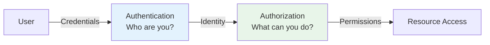
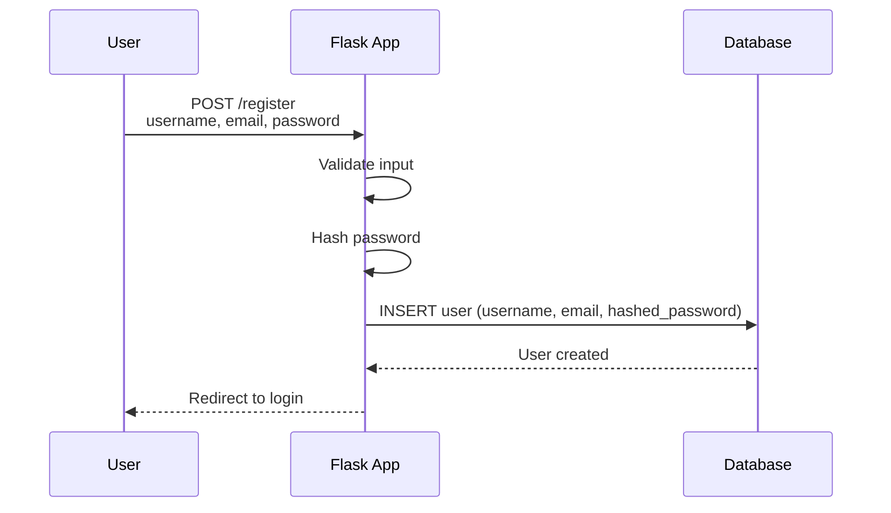
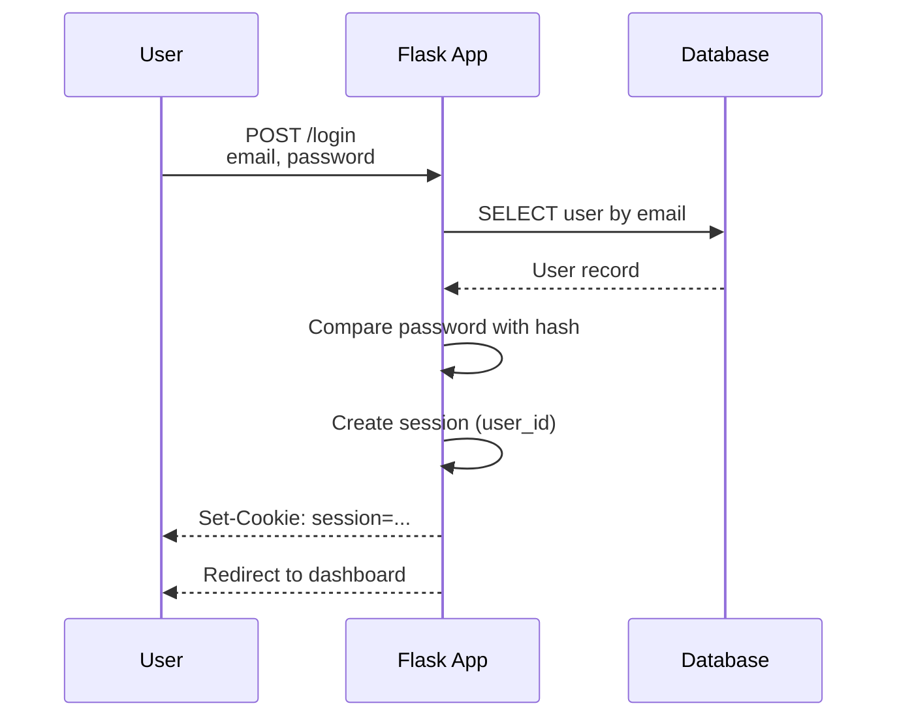
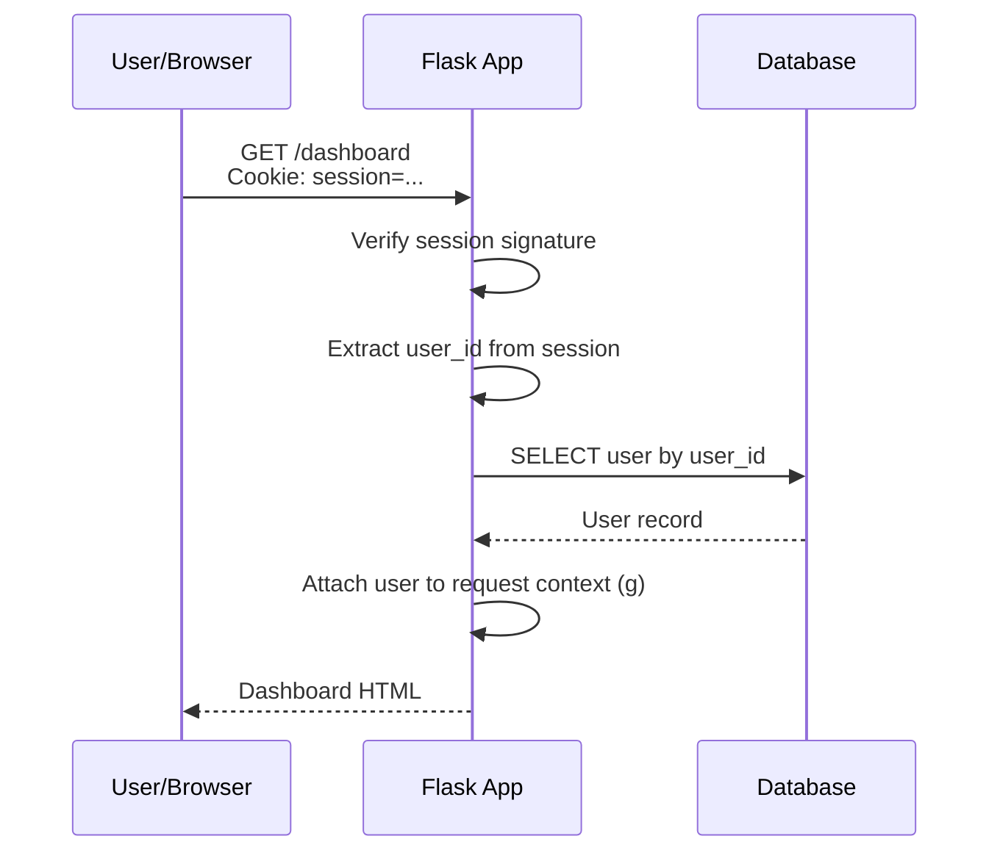
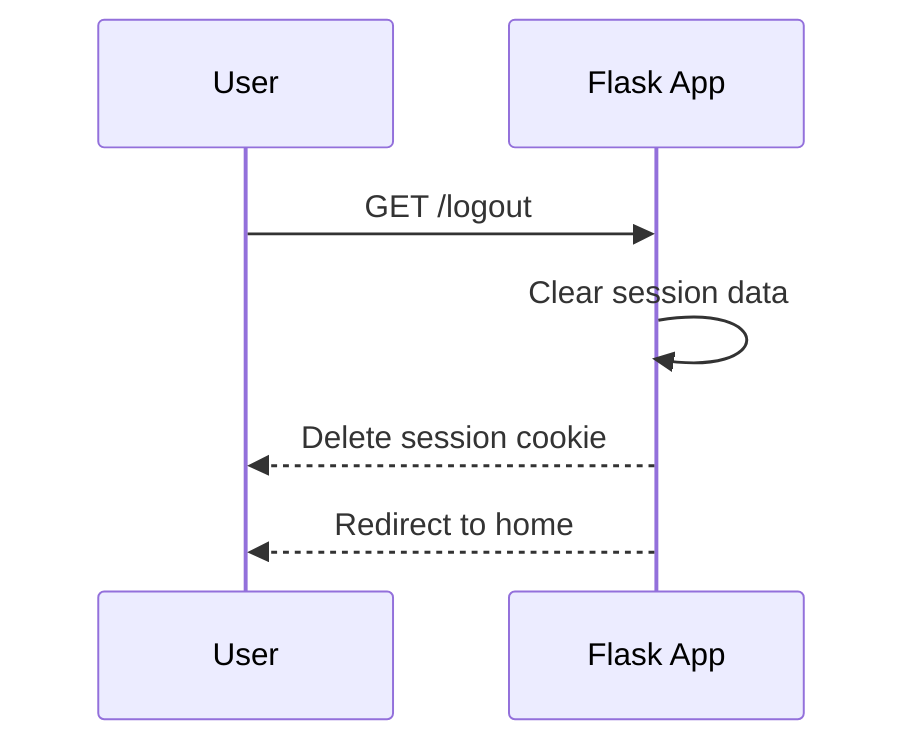

# Authentication Overview

> Authentication is the process of verifying who a user is. It is the foundation of every application that has users. Building authentication correctly — securely, efficiently, and maintainably — is one of the most important skills for a Flask developer. This chapter provides the conceptual foundation for the entire authentication system.

## Learning Objectives

After completing this chapter, you will be able to:

- Explain the complete authentication flow from registration to logout
- Describe the difference between authentication (who are you?) and authorization (what can you do?)
- Understand password hashing and why it is essential
- Implement session-based authentication in Flask
- Explain common authentication vulnerabilities and how to prevent them
- Choose between session-based and token-based authentication

## What Is Authentication?

**Authentication** is the process of verifying the identity of a user. When a user logs in with a username and password, the application checks those credentials against stored data. If they match, the user is authenticated — the application knows who they are.

**Authorization** is the process of determining what an authenticated user is allowed to do. A user may be authenticated (logged in) but not authorized to access the admin panel.



## The Authentication Flow

### Registration



### Login



### Authenticated Request



### Logout



## Password Hashing

Never store passwords in plain text. Use a strong, slow hashing algorithm:

```python
from werkzeug.security import generate_password_hash, check_password_hash

# Hash a password
password_hash = generate_password_hash('user_password', method='pbkdf2:sha256')
# → 'pbkdf2:sha256:600000$...'

# Verify a password
is_valid = check_password_hash(password_hash, 'user_password')
# → True
```

### Why Not Plain Text or Fast Hashes?

| Method | Why It Is Wrong |
|--------|-----------------|
| Plain text | If database is breached, all passwords exposed |
| MD5 | Broken — collisions found, fast to crack |
| SHA-1 | Broken — collision attacks demonstrated |
| SHA-256 (alone) | Fast to compute — GPUs can try billions/second |
| bcrypt / PBKDF2 / Argon2 | Designed to be slow — resistant to brute force |

> [!WARNING]
> If you ever discover a system storing passwords in plain text, treat it as a critical security incident. All affected passwords must be reset immediately.

### Werkzeug's `generate_password_hash`

Werkzeug uses PBKDF2 with SHA-256 by default:

- **Algorithm**: PBKDF2-HMAC-SHA256
- **Salt**: Random 16-byte salt (unique per password)
- **Iterations**: 600,000 (adjustable, increase over time)
- **Output**: 32-byte hash

The hash string format: `method$salt$hash`

## Session-Based Authentication in Flask

### Basic Implementation

```python
from flask import Flask, request, session, redirect, url_for, flash
from werkzeug.security import generate_password_hash, check_password_hash
from flask_sqlalchemy import SQLAlchemy

app = Flask(__name__)
app.config['SECRET_KEY'] = 'your-secret-key'
db = SQLAlchemy(app)

class User(db.Model):
    id = db.Column(db.Integer, primary_key=True)
    username = db.Column(db.String(80), unique=True, nullable=False)
    email = db.Column(db.String(120), unique=True, nullable=False)
    password_hash = db.Column(db.String(256), nullable=False)
    
    def set_password(self, password):
        self.password_hash = generate_password_hash(password)
    
    def check_password(self, password):
        return check_password_hash(self.password_hash, password)

@app.route('/register', methods=['GET', 'POST'])
def register():
    if request.method == 'POST':
        username = request.form['username']
        email = request.form['email']
        password = request.form['password']
        
        if User.query.filter_by(email=email).first():
            flash('Email already registered')
            return redirect(url_for('register'))
        
        user = User(username=username, email=email)
        user.set_password(password)
        db.session.add(user)
        db.session.commit()
        
        flash('Registration successful!')
        return redirect(url_for('login'))
    
    return render_template('register.html')

@app.route('/login', methods=['GET', 'POST'])
def login():
    if request.method == 'POST':
        email = request.form['email']
        password = request.form['password']
        
        user = User.query.filter_by(email=email).first()
        
        if user and user.check_password(password):
            session.clear()  # Prevent session fixation
            session['user_id'] = user.id
            session.permanent = True
            return redirect(url_for('dashboard'))
        
        flash('Invalid email or password')
    
    return render_template('login.html')

@app.route('/logout')
def logout():
    session.clear()
    return redirect(url_for('index'))

@app.route('/dashboard')
def dashboard():
    if 'user_id' not in session:
        return redirect(url_for('login'))
    
    user = User.query.get(session['user_id'])
    return render_template('dashboard.html', user=user)
```

### The `before_request` Pattern

Load the current user on every request:

```python
from flask import g

@app.before_request
def load_logged_in_user():
    user_id = session.get('user_id')
    if user_id is None:
        g.user = None
    else:
        g.user = User.query.get(user_id)

# Now g.user is available in all views and templates
@app.route('/profile')
def profile():
    if g.user is None:
        return redirect(url_for('login'))
    return render_template('profile.html')
```

### Login Required Decorator

```python
from functools import wraps

def login_required(view):
    @wraps(view)
    def wrapped_view(*args, **kwargs):
        if g.user is None:
            return redirect(url_for('login'))
        return view(*args, **kwargs)
    return wrapped_view

@app.route('/protected')
@login_required
def protected():
    return 'This is a protected page'
```

## Authentication Vulnerabilities

| Vulnerability | Description | Prevention |
|--------------|-------------|------------|
| **Brute force** | Trying many passwords | Rate limiting, account lockout |
| **Session hijacking** | Stealing session cookie | HTTPS, HttpOnly, Secure, SameSite |
| **Session fixation** | Forcing known session ID | Regenerate session on login |
| **Credential stuffing** | Using breached passwords | Check against breach databases |
| **Password guessing** | Weak passwords | Password strength requirements |
| **Timing attacks** | Measuring response time | Use constant-time comparison |

## Session vs. Token Authentication

| Aspect | Session-Based | Token-Based (JWT) |
|--------|--------------|---------------------|
| Storage | Server-side session + cookie | Client-side token |
| Scalability | Requires shared session store | Stateless — any server can verify |
| Logout | Server invalidates session | Token expires naturally (or blacklist) |
| XSS risk | Lower (HttpOnly cookie) | Higher (token in JavaScript) |
| CSRF risk | Requires CSRF protection | No CSRF risk |
| Best for | Traditional web apps | SPAs, mobile apps, APIs |

For traditional server-rendered Flask applications, **session-based authentication** is recommended. For SPAs and APIs, **JWT tokens** are more appropriate (see [[10-Advanced/JWT-Authentication]]).

## Common Mistakes

**Mistake: Storing passwords in plain text**
Always hash passwords with a strong algorithm.

**Mistake: Using fast hash algorithms (MD5, SHA-256)**
Use PBKDF2, bcrypt, or Argon2 — algorithms designed to be slow.

**Mistake: Not regenerating session on login**
This leaves users vulnerable to session fixation attacks.

**Mistake: Trusting user input without validation**
Always validate and sanitize all user inputs.

**Mistake: No rate limiting on login**
Brute force attacks are trivial without rate limiting.

## Best Practices

- Use strong password hashing (PBKDF2, bcrypt, Argon2)
- Regenerate session on login (prevent fixation)
- Set secure session cookie attributes (HttpOnly, Secure, SameSite)
- Implement rate limiting on login attempts
- Validate all user inputs
- Use HTTPS for all authentication traffic
- Log failed login attempts (monitor for attacks)
- Consider multi-factor authentication for sensitive applications

## Exercises

1. **Registration Form**: Create a registration page with username, email, and password fields. Validate inputs and hash the password.

2. **Login Flow**: Implement a complete login flow with session management and redirect after login.

3. **Logout**: Implement logout that clears the session completely.

4. **Login Decorator**: Create a `@login_required` decorator and apply it to protected routes.

5. **Rate Limiting**: Add rate limiting to the login endpoint (3 attempts per minute).

## Quiz

**Question 1**: What is the difference between authentication and authorization?

**Question 2**: Why must passwords be hashed before storage? What algorithm should you use?

**Question 3**: What is session fixation, and how do you prevent it?

**Question 4**: What cookie attributes should be set for session security?

**Question 5**: When would you choose token-based (JWT) over session-based authentication?

## Interview Questions

1. "Explain the complete authentication flow from registration to logout."

2. "Why is password hashing necessary? What makes a good hashing algorithm?"

3. "What is the difference between authentication and authorization?"

4. "How would you prevent brute force attacks on a login endpoint?"

5. "Explain session fixation and how to prevent it."

6. "When would you use JWT instead of session-based authentication?"

## Related Chapters

- [[04-Authentication/Flask-Login]] — Production-ready authentication
- [[04-Authentication/Flask-WTF]] — Form handling and CSRF
- [[04-Authentication/Password-Hashing]] — Deep dive into password security
- [[10-Advanced/JWT-Authentication]] — Token-based authentication
- [[08-Security/Session-Security]] — Session security details

## Official Documentation References

- [Flask Quickstart - Sessions](https://flask.palletsprojects.com/en/latest/quickstart/#sessions)
- [Werkzeug Security Helpers](https://werkzeug.palletsprojects.com/en/latest/utils/#module-werkzeug.security)
- [OWASP Authentication Cheat Sheet](https://cheatsheetseries.owasp.org/cheatsheets/Authentication_Cheat_Sheet.html)
- [OWASP Password Storage Cheat Sheet](https://cheatsheetseries.owasp.org/cheatsheets/Password_Storage_Cheat_Sheet.html)

---

*Next: [[04-Authentication/Password-Hashing]]*