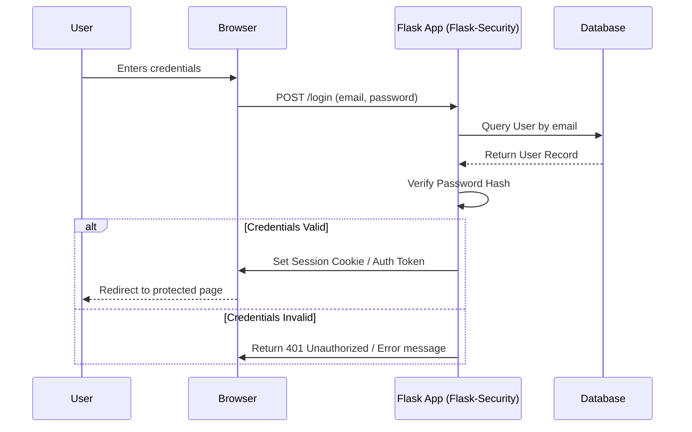

# Flask-Security-Too

Flask-Security-Too is a modern, actively maintained fork of the original Flask-Security package. It provides a complete solution for user authentication, registration, password recovery, and role-based access control (RBAC).

## Key Features
- Session based authentication
- Token based authentication (API)
- Role and Permission management
- Password hashing (bcrypt, argon2)
- Two-Factor Authentication (2FA)
- Unified login for multiple identity providers (OAuth)

## Authentication Flow



## Setup
To install Flask-Security-Too:
```bash
pip install Flask-Security-Too
```
