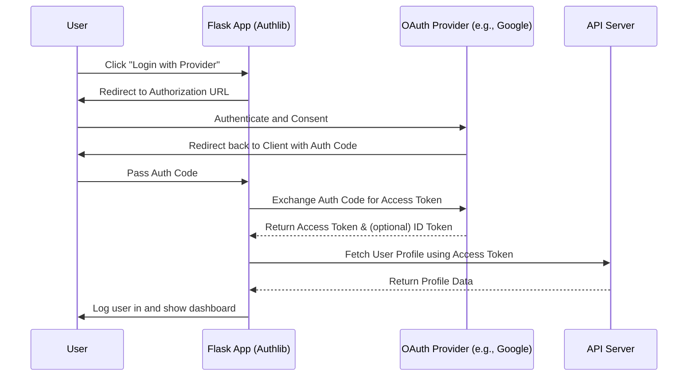

# OAuth2 with Authlib

OAuth2 is an authorization framework that enables applications to obtain limited access to user accounts on an HTTP service, such as Facebook, GitHub, or Google. Authlib is an excellent, comprehensive library for building OAuth and OpenID Connect clients and providers in Python.

## Authlib Features
- Generic OAuth 1.0 and OAuth 2.0 Client
- Flask/Django integrations built-in
- Support for OpenID Connect

## OAuth2 Authorization Code Flow



## Setup
```bash
pip install Authlib requests
```
