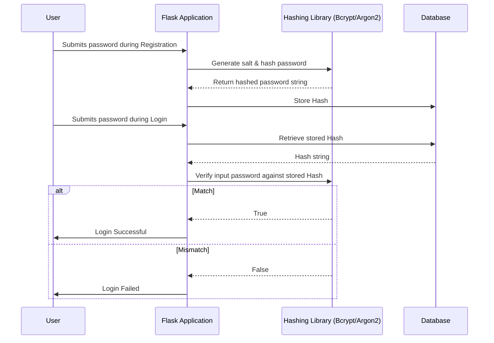

# Password Hashing in Flask

Storing plain text passwords is a massive security risk. Passwords must be hashed using strong, slow algorithms like Bcrypt or Argon2. 

## Bcrypt
Bcrypt is a robust, well-tested password hashing function based on the Blowfish cipher. It incorporates a salt to protect against rainbow table attacks and is computationally expensive to resist brute-force attacks.

## Argon2
Argon2 is the winner of the Password Hashing Competition (PHC). It is highly recommended for modern applications as it offers resistance against both GPU cracking and side-channel attacks.

## Hashing Flow

