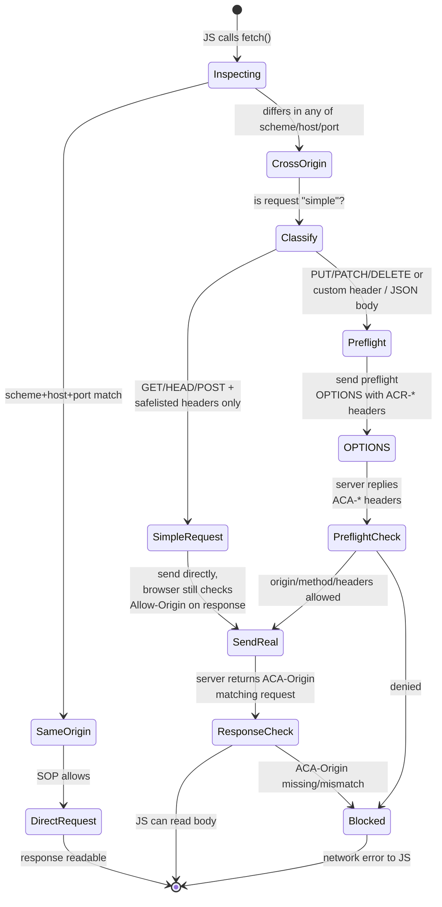
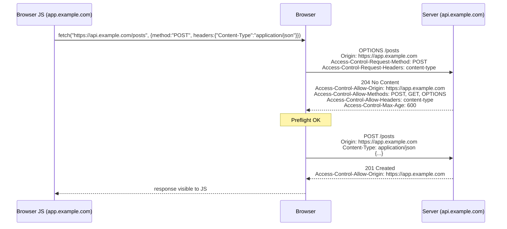
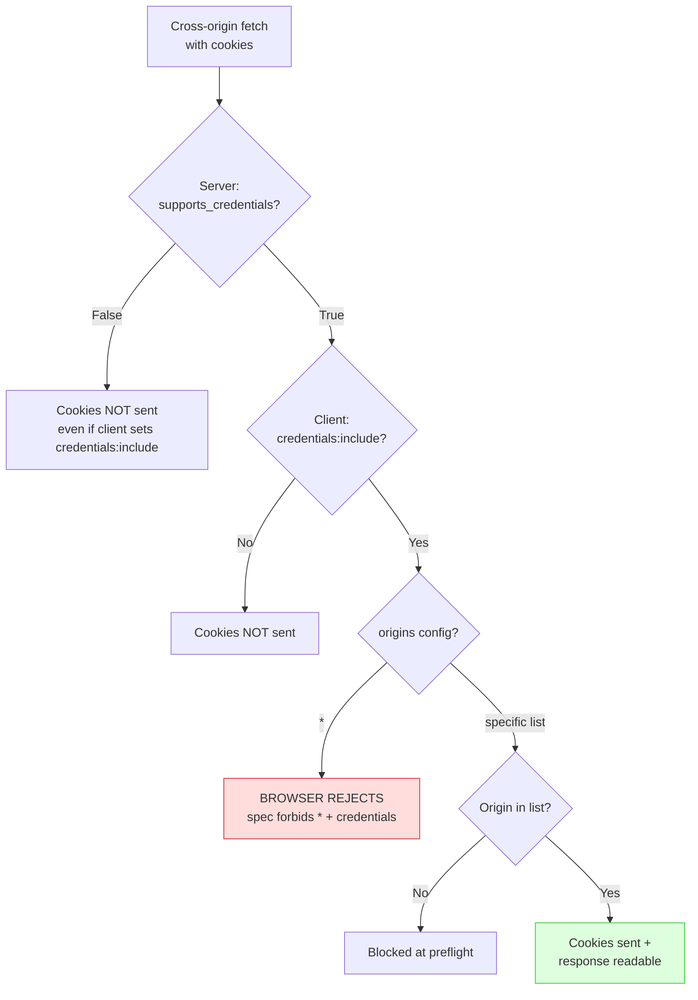
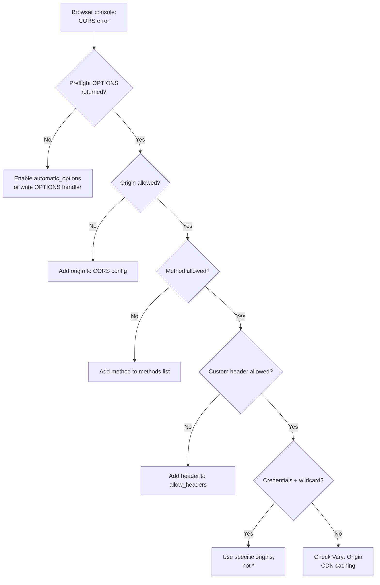
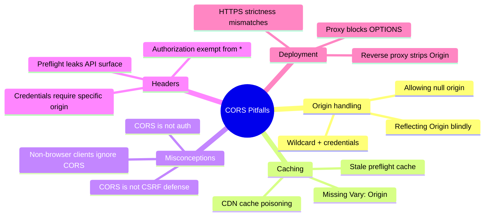

# Flask-CORS

#flask #cors #security #http #browser #cross-origin

> [!info] Cross-Origin Resource Sharing, made easy
> Flask-CORS (by Cory Dolphin) wraps the browser's CORS protocol in two convenient surfaces: a `@cross_origin()` decorator for per-view rules and a `CORS(app, resources=...)` initializer for global rules. The underlying protocol is just HTTP response headers — but getting them right (especially with cookies, preflight, and per-route origins) is fiddly enough that almost every Flask API uses this extension.

CORS is **not** a Flask concept. It's a browser-enforced protocol defined in the [Fetch standard](https://fetch.spec.whatwg.org/). Flask-CORS just emits the right headers. The hard part is *understanding* CORS; once you do, the extension is a tiny convenience layer.

---

## 1. Overview & Metaphor

### What is the same-origin policy?

Browsers block JavaScript from reading responses across **origins**. An *origin* is `scheme://host:port`. So `https://app.example.com` cannot `fetch("https://api.example.com/users")` and read the response — the browser throws a CORS error in the console and the JS sees a network failure.

This is the **same-origin policy (SOP)**, the foundational security mechanism of the web. Without it, any site you visit could read your bank balance by making requests to your bank (since your browser would attach your cookies).

### What is CORS?

**CORS** (Cross-Origin Resource Sharing) is the *opt-out* mechanism for SOP. The server sends response headers declaring which other origins are allowed to read its responses. The browser enforces those headers — it still blocks the response if the server doesn't explicitly allow the origin.

> [!tip] The metaphor
> CORS is a **guest list at a venue**. The browser is the bouncer. Your JS app is a guest who wants to enter `api.example.com`. The bouncer calls the venue ahead (preflight, `OPTIONS`) and asks: "Is `app.example.com` on the list for the kind of dance they want to do?" The venue replies with headers (`Access-Control-Allow-Origin: https://app.example.com`, `Access-Control-Allow-Methods: POST, GET`). If the guest is on the list, the bouncer lets them in (the actual request goes through and the JS can read the response). If not, the bouncer blocks the door — the request may still hit the server, but the JS never sees the response.

### Simple vs preflighted requests

The browser classifies cross-origin requests into two categories:

| Type | Triggered by | Preflight? |
|---|---|---|
| **Simple** | `GET`/`HEAD`/`POST` with "CORS-safelisted" headers (`Accept`, `Accept-Language`, `Content-Language`, `Content-Type` of `text/plain`, `multipart/form-data`, or `application/x-www-form-urlencoded`) | ❌ No |
| **Preflighted** | Anything else — `PUT`/`PATCH`/`DELETE`, custom headers (`Authorization`, `X-CSRFToken`, `Content-Type: application/json`), or non-safelisted headers | ✅ Yes |

For preflighted requests, the browser first sends an `OPTIONS` request with `Origin` and `Access-Control-Request-*` headers. The server replies with `Access-Control-Allow-*` headers. If the preflight passes, the browser sends the real request.

> [!note] Almost every modern JSON API triggers preflight
> `Content-Type: application/json` is not on the safelist, so any `fetch("/api/...")` posting JSON triggers an `OPTIONS` preflight. Plan for it.

#### Browser CORS Decision Tree



### Mermaid: CORS preflight flow



---

## 2. Installation

```bash
(venv) $ pip install Flask-CORS
```

Versions referenced in this note:

- Flask-CORS **4.0.x**
- Flask **3.0.x**

The package imports as `flask_cors` (with underscore).

---

## 3. Configuration

Flask-CORS exposes two entry points: `CORS` (class, for app-wide config) and `@cross_origin` (decorator, for per-view config). Both accept the same options.

### Full options table

| Option | Default | Description |
|---|---|---|
| `origins` | `"*"` | Allowed origin(s). String, list, regex, or callable `(request_origin) -> bool`. |
| `methods` | Inherits from route | Allowed methods, e.g. `["GET","POST"]`. |
| `allow_headers` | `"*"` | Allowed request headers. |
| `expose_headers` | `[]` | Response headers the browser should expose to JS. |
| `supports_credentials` | `False` | Allow cookies + `Authorization`. ⚠️ Can't combine with `origins="*"`. |
| `max_age` | `None` (browser default ~5s) | Seconds the browser caches the preflight response. |
| `send_wildcard` | `False` | If `True` and `origins="*"`, send `*` instead of echoing the origin. |
| `vary_header` | `True` | Add `Vary: Origin` so caches don't leak between origins. |
| `automatic_options` | `True` | Auto-respond to `OPTIONS` so you don't have to write an `OPTIONS` view. |
| `intercept_exceptions` | `True` | Add CORS headers even on error responses (e.g. 500). |

### App-wide configuration

```python
from flask import Flask
from flask_cors import CORS

app = Flask(__name__)

# Simplest: allow everything
CORS(app)

# Restrictive: only one origin, allow cookies
CORS(app, resources={
    r"/api/*": {
        "origins": "https://app.example.com",
        "methods": ["GET", "POST", "PUT", "DELETE", "OPTIONS"],
        "allow_headers": ["Content-Type", "Authorization", "X-CSRFToken"],
        "supports_credentials": True,
        "max_age": 600,
    }
})
```

### Per-view configuration

```python
from flask_cors import cross_origin

@app.route("/api/public")
@cross_origin(origin="*", methods=["GET"])
def public():
    return {"message": "Hello, world"}

@app.route("/api/secret")
@cross_origin(origins=["https://app.example.com", "https://admin.example.com"],
              supports_credentials=True)
def secret():
    return {"secret": "shh"}
```

> [!warning] Decorator order matters
> `@cross_origin` must be **below** the route decorator: `@app.route` on top, `@cross_origin` underneath. If you reverse them, Flask-CORS won't be able to inspect the route signature.

---

## 4. Basic Usage

### Minimal CORS-enabled API

```python
from flask import Flask, jsonify
from flask_cors import CORS

app = Flask(__name__)
CORS(app)                              # allow all origins

@app.route("/api/hello")
def hello():
    return jsonify(message="Hello from api.example.com")
```

A page at `http://localhost:3000` can now `fetch("http://localhost:5000/api/hello")` and read the JSON.

### Conditional origin via callable

```python
def allow_origin(origin):
    return origin.endswith(".example.com") or origin == "http://localhost:5173"

CORS(app, origins=allow_origin)
```

The callable receives the request's `Origin` header and returns `True`/`False`. Useful for "any subdomain of `example.com`".

### Regex-based origins

```python
CORS(app, resources={r"/api/*": {"origins": r"https://\w+\.example\.com$"}})
```

Flask-CORS uses `re.match` with the supplied pattern, anchored by `^` and `$` automatically.

---

## 5. Intermediate Patterns

### 5.1 Cookies and credentials

By default, browsers don't send cookies on cross-origin `fetch`. Two things must change:

1. **Client side**: `fetch(url, {credentials: "include"})` (or `axios`'s `withCredentials: true`).
2. **Server side**: `supports_credentials=True`.

```python
CORS(app, resources={r"/api/*": {
    "origins": "https://app.example.com",     # MUST be specific, not "*"
    "supports_credentials": True,
}})
```

```javascript
fetch("https://api.example.com/api/me", {credentials: "include"})
  .then(r => r.json())
  .then(data => console.log(data.user));
```

> [!danger] Never combine `origins="*"` with `supports_credentials=True`
> The CORS spec **forbids** responding with `Access-Control-Allow-Origin: *` when `Access-Control-Allow-Credentials: true` is also set. The browser will reject the response and your cookies won't work. Flask-CORS catches this and echoes the request's `Origin` instead — but only if you list specific origins. With `origins="*"` you'll see `*` in the response and the browser will fail silently.
>
> **Always specify an explicit origin list when credentials are involved.**

#### Credentials vs Origin Matrix



### 5.2 Exposing response headers to JS

By default, JS can only read a safelisted set of response headers (`Cache-Control`, `Content-Language`, `Content-Length`, `Content-Type`, `Expires`, `Last-Modified`, `Pragma`). To expose `X-Total-Count`, `Link`, etc.:

```python
CORS(app, expose_headers=["X-Total-Count", "Link", "X-Request-ID"])
```

### 5.3 Caching preflight responses

`max_age=86400` tells the browser to cache the preflight result for a day, eliminating most `OPTIONS` requests on subsequent visits:

```python
CORS(app, resources={r"/api/*": {
    "origins": "https://app.example.com",
    "max_age": 86400,
}})
```

> [!tip] Don't set `max_age` too high during development
> If you change your allowed methods or headers, browsers with cached preflights will use the old rules until the cache expires. Capicorn browsers cap `max_age` at varying values (Chrome: 7200s, Firefox: 86400s). Use `0` or omit during dev.

### 5.4 Per-blueprint CORS

```python
from flask import Blueprint
from flask_cors import CORS

bp = Blueprint("api", __name__, url_prefix="/api")
cors = CORS(bp, origins="https://app.example.com")
```

This is the cleanest way to scope CORS rules — your admin blueprint can have stricter rules than your public API blueprint.

### 5.5 Disabling CORS for one route

```python
@app.route("/api/no-cors")
def no_cors():
    return "no CORS headers here"      # global CORS still applies unless you exempt
```

To actually exempt: only attach `CORS(app)` to specific resources, or use a `before_request` hook that skips adding headers for certain paths. The cleanest pattern is to use multiple `CORS(app, resources={...})` calls with explicit path regexes.

---

## 6. Advanced Usage

### 6.1 CORS with CSRF double-submit

When using [[Flask-JWT-Extended]] cookies (or any cookie-based auth), the standard pattern is **double-submit CSRF**: the JWT access cookie is `HttpOnly`, and a separate CSRF cookie (readable by JS) is sent. The JS reads the CSRF cookie and puts its value in an `X-CSRFToken` header. The server compares the two.

Flask-CORS must:

- Allow the `X-CSRFToken` header (`allow_headers`)
- Allow credentials (`supports_credentials=True`)
- Use specific origins (not `*`)

```python
CORS(app, resources={r"/api/*": {
    "origins": ["https://app.example.com"],
    "supports_credentials": True,
    "allow_headers": ["Content-Type", "X-CSRFToken"],
    "expose_headers": ["X-CSRFToken"],
    "methods": ["GET", "POST", "PUT", "PATCH", "DELETE", "OPTIONS"],
}})
```

### 6.2 Dynamic origin validation (DB-backed)

```python
from models import Tenant

def dynamic_origin(origin):
    # Look up allowed origins from DB per request
    return Tenant.query.filter_by(allowed_origin=origin).first() is not None

CORS(app, origins=dynamic_origin, supports_credentials=True)
```

> [!warning] Per-request DB lookups on every preflight
> This fires a query on every `OPTIONS` request. Cache aggressively — most tenants' allowed origins change rarely.

### 6.3 Handling `OPTIONS` automatically

`automatic_options=True` (default) means Flask-CORS intercepts `OPTIONS` requests on decorated routes and replies without invoking your view. If you set `automatic_options=False`, you must write your own `OPTIONS` handler:

```python
@app.route("/api/custom", methods=["GET", "POST", "OPTIONS"])
@cross_origin(automatic_options=False)
def custom():
    if request.method == "OPTIONS":
        resp = app.make_default_options_response()
        resp.headers["Access-Control-Allow-Methods"] = "GET, POST, OPTIONS"
        return resp
    # handle GET/POST
```

### 6.4 CORS with [[Flask-RESTful]]

Just wrap the app — Flask-RESTful routes are regular Flask routes from the CORS perspective:

```python
from flask import Flask
from flask_restful import Api, Resource
from flask_cors import CORS

app = Flask(__name__)
api = Api(app, prefix="/api/v1")
CORS(app, resources={r"/api/v1/*": {"origins": "https://app.example.com"}})

class Posts(Resource):
    def get(self): ...
api.add_resource(Posts, "/posts")
```

### 6.5 Adding CORS headers to error responses

`intercept_exceptions=True` (default) ensures 404/500 responses also carry CORS headers. Without it, your JS will see "CORS error" on a 500 instead of the actual error — very confusing during debugging.

### 6.6 Sending `Vary: Origin`

`vary_header=True` (default) adds `Vary: Origin` to all CORS-enabled responses. This is critical: a CDN that doesn't vary by origin will cache an `Access-Control-Allow-Origin: https://app.example.com` response and serve it to `https://evil.example.com`, leaking data. Always keep `vary_header=True` in production.

---

## 7. Common Pitfalls & Troubleshooting

### Mermaid: troubleshooting flowchart



| Symptom | Likely cause | Fix |
|---|---|---|
| `Access to fetch at '...' from origin '...' has been blocked by CORS policy: No 'Access-Control-Allow-Origin' header` | Flask-CORS not configured for this route, or route doesn't match the resources regex | Wrap with `CORS(app)` globally or use `@cross_origin` on the view. |
| `... blocked: Response to preflight request doesn't pass access control check: It does not have HTTP ok status` | `OPTIONS` returns 4xx (route not found, or method not allowed) | Make sure route is registered with `OPTIONS` or `automatic_options=True`. |
| `... blocked: Request header field authorization is not allowed` | `Authorization` header missing from `allow_headers` | Add `"Authorization"` to `allow_headers`. |
| `... blocked: Method PUT not allowed` | `methods` list doesn't include `PUT` | Add `"PUT"` to `methods`. |
| Cookies not sent on cross-origin fetch | `credentials: "include"` missing on client OR `supports_credentials=False` on server | Both must be set; origin must be specific (not `*`). |
| `Access-Control-Allow-Origin: *` ignored with credentials | Combination forbidden by spec | Replace `*` with explicit origin list. |
| CORS works in dev, fails in prod | Reverse proxy stripping `Origin` header, or CDN caching without `Vary: Origin` | Ensure proxy passes `Origin`; set `vary_header=True`; clear CDN cache. |
| Pre-flight `OPTIONS` returns 200 but real request still blocked | Allow-* headers missing from real response (only set on OPTIONS) | Flask-CORS sets both automatically; if you wrote custom middleware, ensure both paths set headers. |

> [!danger] CORS is not a security feature for your server
> CORS is enforced by the **browser** to protect the **user**. It does not stop a server-side attacker (e.g. a Python `requests` script) from calling your API from any origin. Treat CORS as a UX feature that lets legitimate browser apps talk to your API — not as access control. Real access control = authentication + authorisation on the server.

### Reverse-proxy gotchas

If you sit behind nginx/AWS ALB/CloudFront:

1. The proxy must **pass through the `Origin` header** to Flask. Some proxies strip unknown headers.
2. The proxy must **forward `OPTIONS` requests** to Flask rather than replying 405. Configure nginx: `if ($request_method = OPTIONS) { proxy_pass http://flask; }`.
3. The proxy must **not cache responses without `Vary: Origin`**. CloudFront respects `Vary` if you allowlist it in the cache behaviour.

---

## 8. Best Practices

1. **Be specific about origins.** Default `*` is fine for public read APIs (weather, news) but should never be used for credentialed routes.
2. **Use per-blueprint CORS** so admin endpoints can be locked down while public ones stay open.
3. **Keep `vary_header=True`** so CDNs don't leak responses across origins.
4. **Set a sensible `max_age`** (e.g. 3600–86400) in production to cut preflight chatter.
5. **Allow-list only the headers you actually use.** `"*"` is convenient but broadcasts your API surface to attackers probing your preflight responses.
6. **Don't rely on CORS for auth.** Use [[Flask-JWT-Extended]] or [[Flask-Login]] for actual access control. CORS only affects browsers.
7. **Test preflight explicitly** — write a test that sends `OPTIONS` with `Origin` and `Access-Control-Request-Method` and asserts the right `Allow-*` headers come back.
8. **Document your allowed origins** in a config file, not deep in code, so security review can spot a wild-card that shouldn't be there.
9. **Log `Origin` headers in dev** to catch unexpected cross-origin requests early.
10. **Combine with [[Flask-Limiter]]** — preflight requests count against rate limits, so a malicious origin probing your preflight can be throttled.

---

## 9. Integration with Other Extensions

### With [[Flask-RESTful]]

See §6.4 — wrap the app, resources flow through automatically.

### With [[Flask-JWT-Extended]]

Two patterns depending on token storage:

| Token storage | CORS requirements |
|---|---|
| `Authorization: Bearer <token>` header | `allow_headers: ["Authorization"]`. No `supports_credentials` needed. |
| HttpOnly cookie (with separate CSRF cookie) | `supports_credentials: True`, specific origins, `allow_headers: ["X-CSRFToken"]`, `expose_headers: ["X-CSRFToken"]`. |

### With [[Flask-WTF]]

If you have a server-rendered form (no CORS needed) AND an API endpoint on the same app, scope CORS narrowly:

```python
CORS(app, resources={r"/api/*": {"origins": "https://app.example.com"}})
# /forms/* routes have NO CORS headers — same-origin only
```

### With [[Flask-Limiter]]

Pre-flight requests are real HTTP requests; they count against rate limits. Either:

- Exempt `OPTIONS` from rate limiting, or
- Set a separate, higher limit for `OPTIONS` requests.

---

## 10. Real-World Example — CORS-Enabled API with Cookies

A complete, runnable app demonstrating:

- Global CORS for the `/api/*` blueprint
- Specific origin allowlist
- Credentials support (JWT in cookies with CSRF double-submit)
- Exposed custom header

```python
# app.py — pip install flask flask-cors flask-jwt-extended
import os
from flask import Flask, jsonify, request
from flask_cors import CORS
from flask_jwt_extended import (JWTManager, jwt_required, create_access_token,
                                set_access_cookies, unset_jwt_cookies,
                                get_csrf_token, get_jwt)

ALLOWED_ORIGINS = ["http://localhost:5173", "https://app.example.com"]

app = Flask(__name__)
app.config["JWT_SECRET_KEY"]        = os.environ.get("JWT_SECRET_KEY", "dev-jwt-secret")
app.config["JWT_TOKEN_LOCATION"]    = ["cookies"]
app.config["JWT_COOKIE_SECURE"]     = False          # True in prod (HTTPS only)
app.config["JWT_COOKIE_SAMESITE"]   = "Lax"
app.config["JWT_ACCESS_COOKIE_PATH"] = "/api"
app.config["JWT_COOKIE_CSRF_PROTECT"] = True

jwt = JWTManager(app)
CORS(app,
     resources={r"/api/*": {
         "origins": ALLOWED_ORIGINS,
         "supports_credentials": True,
         "allow_headers": ["Content-Type", "X-CSRFToken"],
         "expose_headers": ["X-CSRFToken"],
         "methods": ["GET", "POST", "PUT", "DELETE", "OPTIONS"],
         "max_age": 600,
         "vary_header": True,
     }})

@app.route("/api/login", methods=["POST"])
def login():
    body = request.get_json()
    if body.get("username") != "alice" or body.get("password") != "pw":
        return jsonify(msg="Bad credentials"), 401
    access_token = create_access_token(identity="1")
    resp = jsonify(msg="Logged in")
    set_access_cookies(resp, access_token)
    resp.headers["X-CSRFToken"] = get_csrf_token(access_token)
    return resp

@app.route("/api/me", methods=["GET"])
@jwt_required()
def me():
    claims = get_jwt()
    return jsonify(user_id=claims["sub"])

@app.route("/api/logout", methods=["POST"])
@jwt_required()
def logout():
    resp = jsonify(msg="Logged out")
    unset_jwt_cookies(resp)
    return resp

if __name__ == "__main__":
    app.run(debug=True)
```

Front-end (Vite + React, on `localhost:5173`):

```javascript
// On first load, log in
fetch("http://localhost:5000/api/login", {
  method: "POST",
  credentials: "include",
  headers: {"Content-Type": "application/json"},
  body: JSON.stringify({username: "alice", password: "pw"})
})
.then(r => {
  const csrf = r.headers.get("X-CSRFToken");
  localStorage.setItem("csrf", csrf);
});

// Authenticated request
fetch("http://localhost:5000/api/me", {
  credentials: "include",
  headers: {"X-CSRFToken": localStorage.getItem("csrf")}
})
.then(r => r.json())
.then(d => console.log(d));
```

---

## 11. Security Considerations

1. **CORS is browser-only.** A non-browser client ignores CORS headers. Anyone can call your API from `curl` or `requests`. Server-side auth is the only real protection.
2. **Reflecting arbitrary origins is dangerous.** If your code does `resp.headers["Access-Control-Allow-Origin"] = request.headers["Origin"]` for every request, you're allowing any website to read responses from your API. Always validate the origin against an allowlist.
3. **`null` origin.** Some browsers send `Origin: null` for sandboxed iframes, `file://` URLs, redirects from cross-origin pages, and data URIs. Never allow `null` in production unless you have a specific reason.
4. **`supports_credentials` + wildcard is forbidden.** The spec rejects this combination. Flask-CORS will substitute the request origin, but only if you've configured specific origins — wildcard + credentials is a no-op silently.
5. **CDN caching without `Vary: Origin`.** If a CDN caches a response with `Access-Control-Allow-Origin: https://app.example.com` and serves it to `https://evil.example.com`, the evil page can read the response. Always include `Vary: Origin` and configure your CDN to respect it.
6. **`Access-Control-Allow-Headers: *`** is permissive but the `Authorization` header is **exempt** from the wildcard — you must list it explicitly.
7. **CORS does not prevent CSRF.** CORS protects responses from being read cross-origin. CSRF attacks submit requests without needing to read the response. For CSRF protection, see [[Flask-WTF]]'s CSRF token mechanism or JWT CSRF double-submit.
8. **Audit your preflight responses.** They leak the methods and headers your API accepts. Don't include headers you don't actually use.

### Mermaid: CORS security pitfalls mindmap



---

## 12. References

- Flask-CORS docs: <https://flask-cors.readthedocs.io/>
- MDN — CORS: <https://developer.mozilla.org/en-US/docs/Web/HTTP/CORS>
- Fetch standard (CORS section): <https://fetch.spec.whatwg.org/#cors-protocol>
- W3C CORS spec (older but readable): <https://www.w3.org/TR/cors/>
- OWASP CORS Misconfiguration: <https://owasp.org/www-community/attacks/CORS_OriginHeaderScrutiny>
- PortSwigger — CORS exploitation: <https://portswigger.net/web-security/cors>
- HTTP `Vary` header: <https://developer.mozilla.org/en-US/docs/Web/HTTP/Headers/Vary>
- Related notes: [[Flask-RESTful]], [[Flask-JWT-Extended]], [[Flask-WTF]], [[Security-Best-Practices]]
