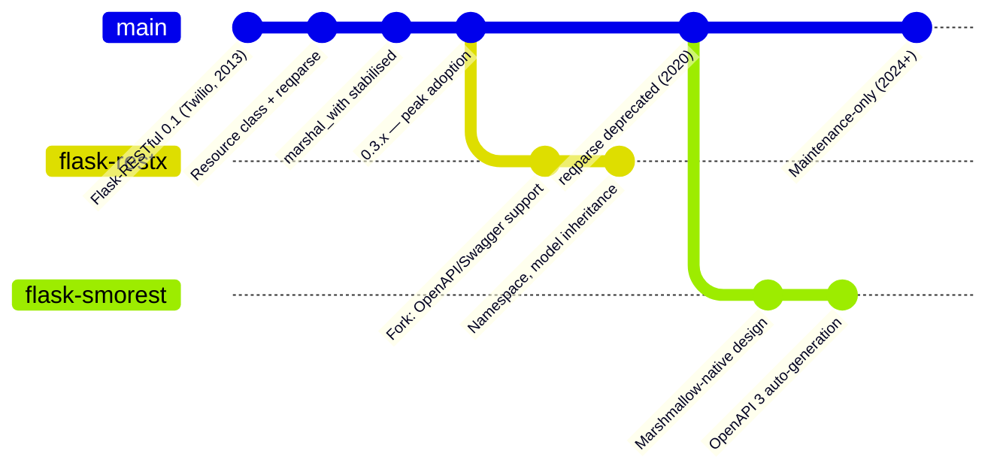
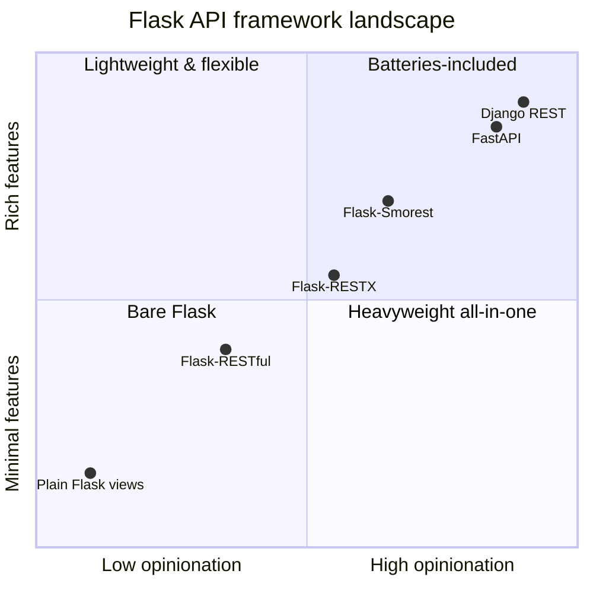
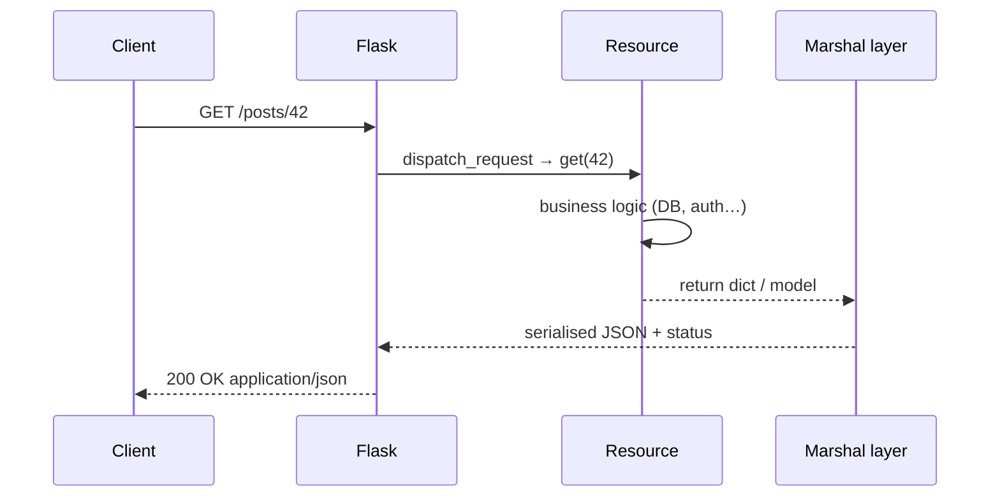
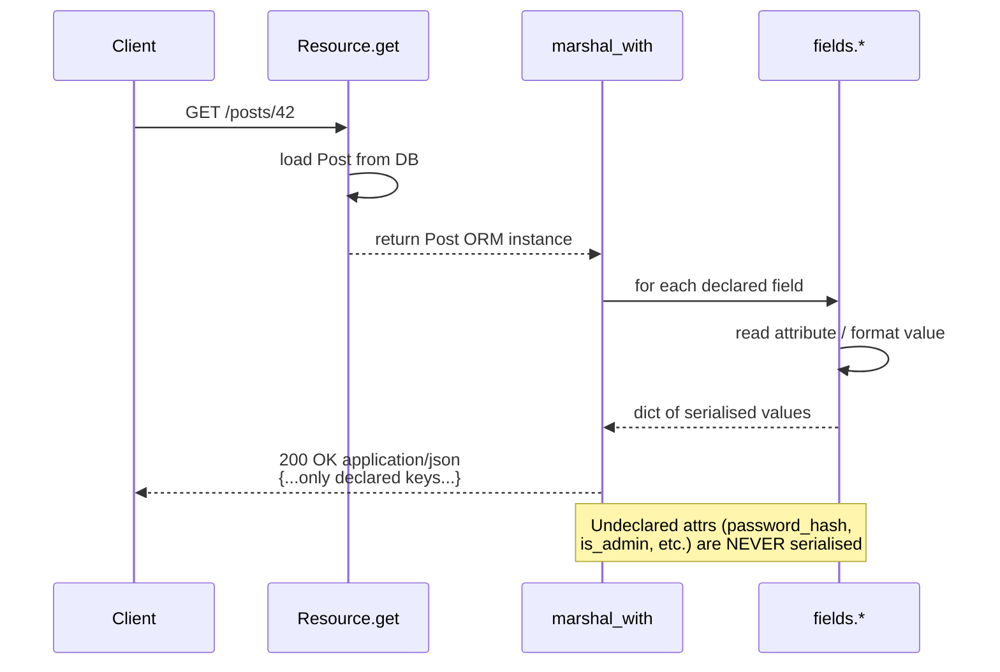
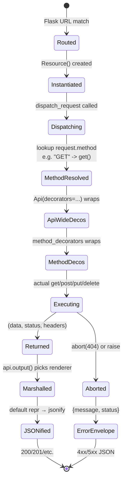
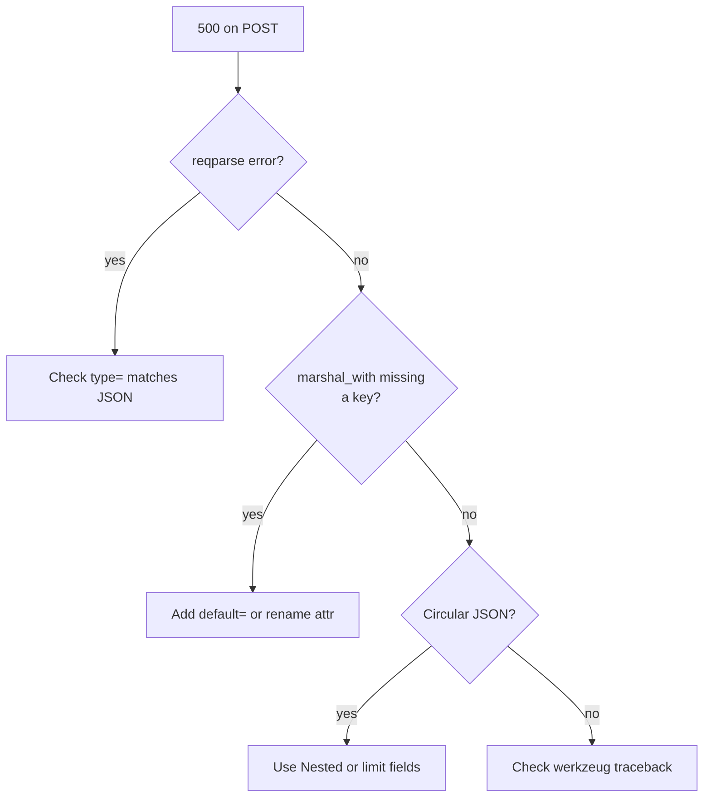

# Flask-RESTful

#flask #api #rest #restful #http #serialization

> [!info] The class-based REST abstraction for Flask
> Flask-RESTful (by Twilio, the same engineering team behind Flask) adds a `Resource` class, a request parser, a response marshalling layer, and custom exception handling on top of plain Flask. It was the standard way to build REST APIs in Flask from ~2013 to ~2020. Today it's **maintenance-only** — Twilio recommends Flask-RESTX or Flask-Smorest for new projects — but it remains the most-deployed Flask API extension and you'll encounter it in countless production codebases.

Think of Flask-RESTful as a **thin opinionated layer** over Flask: you write classes whose methods are HTTP verbs (`get`, `post`, `put`, `delete`), register them on URL prefixes, and let the extension handle content negotiation, JSON serialisation, and error envelopes. It is *not* a framework — it's a set of helpers that you can ignore on any single endpoint.

> [!warning] Use for legacy; consider alternatives for greenfield
> For new projects in 2024+, prefer **[[Marshmallow]] + Flask-Smorest** (OpenAPI generation, maintained) or **FastAPI** (Pydantic-native, async). Flask-RESTful is stable but the `reqparse` module it ships is officially deprecated. This note covers Flask-RESTful because of its prevalence in existing Flask codebases.

## Flask-RESTful Lineage



---

## 1. Overview & Metaphor

### What is REST?

**REST** (Representational State Transfer) is an architectural style for distributed systems, outlined by Roy Fielding in his 2000 PhD dissertation. Its key constraints when applied to HTTP:

1. **Client–server** — UI concerns (client) are separated from data storage (server).
2. **Stateless** — each request contains all info needed; the server stores no client state between requests.
3. **Cacheable** — responses declare cacheability to reduce latency.
4. **Uniform interface** — resources identified by URLs, manipulated via representations (JSON), self-descriptive messages (HTTP methods + headers), and HATEOAS (links to related actions).
5. **Layered** — intermediaries (proxies, gateways) can be added transparently.
6. **Code-on-demand** (optional) — server can ship executable code (JS).

In practice, "REST API" colloquially means: **HTTP verbs + URL resource paths + JSON payloads + status codes**.

### Why Flask-RESTful over plain Flask?

You can write a REST API in pure Flask:

```python
@app.route("/posts/<int:id>", methods=["GET", "PUT", "DELETE"])
def post(id):
    if request.method == "GET":    ...
    if request.method == "PUT":    ...
    if request.method == "DELETE": ...
```

This becomes repetitive. Flask-RESTful lets you split the verbs into methods of a class, declares output schemas via `@marshal_with`, centralises input parsing, and gives you a clean error envelope. Same end result, less boilerplate.

> [!tip] The metaphor
> Flask-RESTful is a **hotel front desk**. You don't have to use it — guests (requests) can knock on any door (view function) directly. But the front desk gives every guest a standard welcome (content negotiation), a standardised room-key protocol (auth decorators), and a standard complaint form (error envelope). Each "room" is a `Resource`, and each guest's request is dispatched by the verb they're holding (GET, POST, ...).

### REST vs RPC vs GraphQL

| Style | URL shape | Example | Tools |
|---|---|---|---|
| **REST** | Nouns; verbs in HTTP method | `POST /posts/42/comments` | Flask-RESTful, Flask-Smorest, DRF |
| **RPC** | Verbs in URL | `POST /createComment?post=42` | gRPC, JSON-RPC |
| **GraphQL** | Single endpoint, query in body | `POST /graphql` with `{post(id:42){comments}}` | Apollo, Strawberry |

#### API Framework Quadrant



---

## 2. Installation

```bash
(venv) $ pip install Flask-RESTful
```

Versions referenced in this note:

- Flask-RESTful **0.3.10**
- Flask **3.0.x**

> [!note] Aniso8601 vs python-dateutil
> Flask-RESTful pulls in `aniso8601` for parsing ISO-8601 durations in the `inputs` module. If you don't use it, the import is harmless.

---

## 3. Configuration

Flask-RESTful has very few knobs. Most behaviour is controlled by how you instantiate `Api` and how you write `Resource` subclasses.

```python
from flask import Flask
from flask_restful import Api

app = Flask(__name__)
api = Api(app)                  # also: Api(app, prefix="/api/v1", catch_all_404s=True)
```

| Argument | Default | Description |
|---|---|---|
| `app` | `None` | Flask app to attach to. Can be deferred via `api.init_app(app)`. |
| `prefix` | `None` | URL prefix prepended to every resource. |
| `default_mediatype` | `"application/json"` | Used when client doesn't send `Accept`. |
| `decorators` | `[]` | Decorators applied to *every* resource. Useful for auth. |
| `catch_all_404s` | `False` | Treat 404s on unknown endpoints as API errors (JSON envelope). |
| `errors` | `{}` | Custom error handler dictionary. |

### Error envelope

By default Flask-RESTful returns errors like:

```json
{"message": "Internal Server Error", "status": 500}
```

You can customise globally:

```python
api = Api(app, catch_all_404s=True)
```

---

## 4. Basic Usage

### A hello-world resource

```python
from flask_restful import Resource, Api

api = Api(app)

class HelloWorld(Resource):
    def get(self):
        return {"hello": "world"}

api.add_resource(HelloWorld, "/")
```

### A resource with URL params

```python
class UserResource(Resource):
    def get(self, user_id):
        user = User.query.get_or_404(user_id)
        return {"id": user.id, "name": user.name}

api.add_resource(UserResource, "/users/<int:user_id>")
### One class, multiple routes
class PostList(Resource):
    def get(self): ...
    def post(self): ...

api.add_resource(PostList, "/posts", "/articles")  # both URLs hit same class
```

### Mermaid: request lifecycle in Flask-RESTful



---

## 5. Intermediate Patterns

### 5.1 Request parsing (reqparse)

> [!warning] `reqparse` is deprecated
> The Flask-RESTful docs explicitly recommend [[Marshmallow]] for new code. We cover `reqparse` here because you'll see it everywhere. For greenfield, use Marshmallow's `Schema.load()`.

```python
from flask_restful import reqparse

parser = reqparse.RequestParser()
parser.add_argument("name",      type=str,  required=True, help="Name is required.")
parser.add_argument("age",       type=int,  required=False, default=18)
parser.add_argument("active",    type=bool, location="json")
parser.add_argument("X-Trace-Id", type=str, location="headers")

args = parser.parse_args()       # raises 400 on bad input
print(args["name"], args["age"])
```

| Argument | Purpose |
|---|---|
| `name` | Field name in form/json/query. |
| `type` | Callable coerces the raw string. Built-ins: `int`, `str`, `bool`, `inputs.datetime`, `inputs.date`, `inputs.url`, `inputs.int_range(1, 100)`. |
| `required` | `True` → 400 if missing. |
| `default` | Value when missing and not required. |
| `location` | Where to look: `"json"`, `"form"`, `"args"` (query string), `"headers"`, `"cookies"`, `"values"` (form+args). |
| `action` | `"append"` (list) or `"store"` (default). |
| `help` | Custom message on validation failure. |

### 5.2 Marshalling output with `fields` and `@marshal_with`

Output fields declare *what* to expose — preventing accidental leakage of internal fields (like `password_hash`).

```python
from flask_restful import Resource, fields, marshal_with

post_fields = {
    "id":         fields.Integer,
    "title":      fields.String,
    "body":       fields.String,
    "published":  fields.Boolean,
    "created_at": fields.DateTime("iso8601"),
    "author":     fields.Nested({"id": fields.Integer, "name": fields.String}),
    "url":        fields.Url("post_detail", absolute=True),
}

class PostResource(Resource):
    @marshal_with(post_fields)
    def get(self, id):
        return Post.query.get_or_404(id)
```

| Field type | Serialises |
|---|---|
| `String` | `str` |
| `Integer` | `int` |
| `Boolean` | `bool` |
| `Float` | `float` |
| `DateTime(fmt)` | `"iso8601"` or `"rfc822"` or strftime |
| `Url(endpoint)` | URL generated by `url_for` |
| `List(field)` | List of items |
| `Nested(fields)` | Sub-object |
| `Raw` | Pass-through (rarely used) |
| `FormattedString` | Template: `FormattedString("User {0}")` |
| `Fixed(decimals=2)` | Decimal as fixed-precision number |
| `Arbitrary` | High-precision number |

> [!tip] `default=` for nullable fields
> If a field can be `None`, set `default=None` or `fields.String(default="")` to avoid `KeyError`/null surprises in the response.

#### marshal_with Flow



### 5.3 Custom fields

```python
from flask_restful import fields

class PasswordHashField(fields.String):
    def output(self, key, obj):
        return "[REDACTED]"          # never leak the hash

user_fields = {"id": fields.Integer, "pw_hash": PasswordHashField()}
```

### 5.4 Status codes & headers

```python
def post(self):
    ...
    return post, 201, {"Location": url_for("post_detail", id=post.id, _external=True),
                       "X-Total-Count": "1024"}
```

Return a tuple `(dict, status_code, headers)` — or `(dict, status_code)` or `(dict, headers)`.

### 5.5 Error handling

```python
from flask_restful import abort

def get(self, id):
    post = Post.query.get(id)
    if not post:
        abort(404, message=f"Post {id} not found.")
    return post
```

Custom exception → JSON:

```python
class BusinessError(Exception):
    pass

@api.app.errorhandler(BusinessError)
def handle_business_error(e):
    return {"code": "BUSINESS_ERROR", "message": str(e)}, 422
```

### 5.6 Resource-level decorators

```python
from flask_login import login_required

class PostList(Resource):
    method_decorators = [login_required]   # applies to ALL methods
    def get(self): ...
    def post(self): ...
```

Different decorators per method:

```python
class PostResource(Resource):
    method_decorators = {
        "get":    [],
        "post":   [login_required],
        "delete": [login_required, admin_required],
    }
```

### 5.7 API-wide decorators

```python
api = Api(app, decorators=[csrf_exempt, log_request])
```

Applied to every resource. The order matters: decorators listed earlier are *outermost* — they wrap the innermost view logic first. Be careful when combining API-wide decorators with `method_decorators` on a `Resource`: the API-wide ones run first, then the method-level ones, then the method itself.

### 5.8 The `Resource.dispatch_request` lifecycle

When Flask routes a request to a `Resource`, the following happens in order:

1. Flask resolves the URL rule and instantiates the `Resource` subclass.
2. `Resource.dispatch_request` looks at `request.method` and finds the matching lowercase method (`get`, `post`, etc.).
3. Method-level decorators (`method_decorators`) wrap the method.
4. API-wide decorators (`Api(decorators=...)`) wrap the result.
5. The method is called with the URL kwargs (e.g. `id=42`).
6. The return value (`dict`, `(dict, status)`, or `(dict, status, headers)`) is rendered via `api.output()` — which picks a representation function based on `Accept` header.
7. Default representation serialises to JSON via Flask's `jsonify`.

#### Resource Request State Machine



> [!tip] Override `dispatch_request` for global hooks
> If you want every resource to log timing, attach a request ID, or wrap responses in a standard envelope, override `dispatch_request` on a base `Resource`:
> ```python
> class BaseResource(Resource):
>     def dispatch_request(self, *args, **kwargs):
>         import time, uuid
>         request_id = uuid.uuid4().hex
>         g.request_id = request_id
>         start = time.perf_counter()
>         resp = super().dispatch_request(*args, **kwargs)
>         elapsed_ms = (time.perf_counter() - start) * 1000
>         app.logger.info(f"req={request_id} elapsed_ms={elapsed_ms:.1f}")
>         return resp
> ```
> Then inherit: `class PostList(BaseResource): ...`. This is cleaner than stacking decorators.

### 5.9 Returning non-JSON responses

Sometimes a single endpoint should return CSV, PDF, or an image. Use `flask.make_response` and return that — Flask-RESTful passes `Response` objects through untouched:

```python
from flask import make_response
import csv, io

class PostExport(Resource):
    def get(self):
        buf = io.StringIO()
        writer = csv.writer(buf)
        writer.writerow(["id", "title"])
        for p in Post.query.all():
            writer.writerow([p.id, p.title])
        resp = make_response(buf.getvalue(), 200)
        resp.headers["Content-Type"] = "text/csv"
        resp.headers["Content-Disposition"] = "attachment; filename=posts.csv"
        return resp
```

---

## 6. Advanced Usage

### 6.1 Namespaces / Blueprints

```python
from flask_restful import Api, Resource
from flask import Blueprint

bp = Blueprint("api", __name__, url_prefix="/api/v1")
api = Api(bp)

class PostList(Resource): ...
api.add_resource(PostList, "/posts")

app.register_blueprint(bp)
```

### 6.2 Pagination pattern

```python
from flask_restful import Resource, fields, marshal_with, reqparse

post_fields = {"id": fields.Integer, "title": fields.String}

paginated_fields = {
    "items":   fields.List(fields.Nested(post_fields)),
    "page":    fields.Integer,
    "pages":   fields.Integer,
    "total":   fields.Integer,
    "has_next":fields.Boolean,
}

class PostList(Resource):
    @marshal_with(paginated_fields)
    def get(self):
        parser = reqparse.RequestParser()
        parser.add_argument("page",  type=int, default=1)
        parser.add_argument("size",  type=int, default=20)
        args = parser.parse_args()
        pag = Post.query.order_by(Post.id.desc()).paginate(
            page=args["page"], per_page=args["size"], error_out=False)
        return {"items": pag.items, "page": pag.page,
                "pages": pag.pages, "total": pag.total,
                "has_next": pag.has_next}
```

### 6.3 Rate limiting per resource

Combine with [[Flask-Limiter]]:

```python
from flask_limiter import Limiter
from flask_limiter.util import get_remote_address

limiter = Limiter(get_remote_address, app=app,
                  default_limits=["1000 per day", "100 per hour"])

class PostList(Resource):
    method_decorators = {"post": [limiter.limit("5 per minute")]}
    def get(self): ...
    def post(self): ...
```

### 6.4 Content negotiation

Flask-RESTful serves JSON by default. To support additional types:

```python
class PlainTextRenderer:
    def __call__(self, data, code, headers=None):
        from flask import make_response
        resp = make_response(str(data), code)
        resp.headers["Content-Type"] = "text/plain"
        return resp

@api.representation("text/plain")
def handle_text(data, code, headers=None):
    return PlainTextRenderer()(data, code, headers)
```

### 6.5 HATEOAS basics

HATEOAS = Hypermedia As The Engine Of Application State. Responses include links to next actions:

```python
post_fields = {
    "id":    fields.Integer,
    "title": fields.String,
    "links": fields.List(fields.Nested({
        "rel":  fields.String,
        "href": fields.String,
        "method": fields.String,
    })),
}

class PostResource(Resource):
    @marshal_with(post_fields)
    def get(self, id):
        post = Post.query.get_or_404(id)
        post.links = [
            {"rel": "self",   "href": url_for("post", id=id, _external=True), "method": "GET"},
            {"rel": "edit",   "href": url_for("post", id=id, _external=True), "method": "PUT"},
            {"rel": "delete", "href": url_for("post", id=id, _external=True), "method": "DELETE"},
        ]
        return post
```

> [!note] HATEOAS in practice
> Few real APIs implement full HATEOAS. Most settle for "REST-ish" — nouns in URLs, verbs in methods, JSON payloads, status codes — and rely on client-side knowledge of the URL scheme. HATEOAS is most valuable for APIs consumed by generic browsers/UIs.

### 6.6 Custom input types

```python
def non_empty_str(value):
    if not value or not isinstance(value, str):
        raise ValueError("Must be a non-empty string.")
    return value

parser.add_argument("name", type=non_empty_str, required=True)
```

### 6.7 Authentication decorator with [[Flask-JWT-Extended]]

```python
from functools import wraps
from flask_jwt_extended import verify_jwt_in_request, get_jwt

def admin_required(fn):
    @wraps(fn)
    def wrapper(*args, **kwargs):
        verify_jwt_in_request()
        claims = get_jwt()
        if not claims.get("is_admin"):
            abort(403, message="Admins only.")
        return fn(*args, **kwargs)
    return wrapper

class AdminStats(Resource):
    method_decorators = [admin_required]
    def get(self): return {"users": User.query.count()}
```

### 6.8 File responses

```python
from flask import send_file
import io

class PdfResource(Resource):
    def get(self, id):
        buf = io.BytesIO(render_pdf(id))
        buf.seek(0)
        return send_file(buf, mimetype="application/pdf",
                         as_attachment=True, download_name=f"post-{id}.pdf")
```

`send_file` is a Flask function; Flask-RESTful leaves binary responses to it.

---

## 7. Common Pitfalls & Troubleshooting

### Mermaid: troubleshooting flowchart



| Symptom | Likely cause | Fix |
|---|---|---|
| `TypeError: Object of type User is not JSON serializable` | Returned a model object directly without `@marshal_with` | Add `@marshal_with(fields_dict)` or return `.to_dict()`. |
| `marshal` returns `None` for known attr | Attribute name in `fields` doesn't match model attr | Use `attribute="db_column_name"` in field: `fields.String(attribute="full_name")`. |
| `KeyError` on nullable field | Field has no `default` and object's value is `None` | Add `default=None` to the field. |
| 415 Unsupported Media Type | Sending JSON without `Content-Type: application/json` | Set header; Flask-RESTful checks it for `location="json"`. |
| `reqparse` ignores JSON | `location` defaulted to `"json"` but request is `multipart/form-data` | Set `location="values"` or `"form"`. |
| 404 on trailing slash | Flask-RESTful adds `/` to routes; client and server mismatch | Match URLs exactly, or use `strict_slashes=False`. |
| Auth decorator runs on docs/attachments | Used `method_decorators` list with side effects | Use `method_decorators` dict and only protect specific methods. |
| Returning `None` gives empty 200 | Flask treats `None` return as "no body" | Return `(obj, 200)` explicitly, or `{}` if empty. |

> [!danger] `reqparse` and JSON: a common silent failure
> `reqparse.RequestParser()` defaults to looking in the **JSON body**. If you call your endpoint with `Content-Type: application/x-www-form-urlencoded`, all your `str` args silently default to `""` (or whatever `default=` you set), rather than failing. Always set `location=` explicitly and unit-test with the actual client behaviour.

---

## 8. Best Practices

1. **Use `@marshal_with` religiously** — explicit allowlists prevent accidentally leaking `password_hash`, `email`, `is_admin`, etc.
2. **Prefer Marshmallow over `reqparse`** for new code; pin a schema library so input and output validation is consistent.
3. **Version your API**: prefix with `/api/v1`. The day you need breaking changes you'll be grateful.
4. **Return correct status codes**: `201` on create, `204` on delete, `400` on bad input, `401` on no auth, `403` on authed-but-not-permitted, `404` on missing, `409` on conflict, `422` on semantic failure, `429` on rate limit.
5. **Use HTTP verbs properly**: don't tunnel everything through `POST /api/do_thing`. Use `POST /things` to create, `PATCH /things/:id` to partially update.
6. **Don't put business logic in Resources.** Resources orchestrate: parse input → call service layer → serialise output. The service layer (plain Python functions) is testable without Flask.
7. **Paginate list endpoints** — `?page=1&size=20` — and always return a `total` so clients can show "Page 1 of N".
8. **Document with OpenAPI** — Flask-RESTful doesn't generate specs; pair it with `flask-smorest` or hand-write specs. For new APIs, just use `flask-smorest`.
9. **Rate-limit early** — see [[Flask-Limiter]]. A new public API without limits is a DoS waiting to happen.
10. **Log request/response bodies for non-PII APIs** during early development — invaluable for debugging. Strip PII before shipping.

---

## 9. Integration with Other Extensions

### With [[Flask-SQLAlchemy]]

The standard pairing. Pattern:

```python
post_fields = {"id": fields.Integer, "title": fields.String, "body": fields.String}

class PostList(Resource):
    @marshal_with(post_fields)
    def get(self):
        return Post.query.all()

    @marshal_with(post_fields)
    def post(self):
        args = parser.parse_args()
        post = Post(title=args["title"], body=args["body"])
        db.session.add(post)
        db.session.commit()
        return post, 201
```

### With [[Marshmallow]]

Use Marshmallow for input validation (`Schema.load`) and Flask-RESTful `@marshal_with` for output. Or, more cleanly, use Marshmallow for both and replace Flask-RESTful with Flask-Smorest.

```python
from marshmallow import Schema, fields, validate, ValidationError

class PostSchema(Schema):
    id    = fields.Int(dump_only=True)
    title = fields.Str(required=True, validate=validate.Length(max=200))
    body  = fields.Str(required=True)

class PostList(Resource):
    def post(self):
        try:
            data = PostSchema().load(request.get_json())
        except ValidationError as e:
            return {"errors": e.messages}, 422
        post = Post(**data)
        db.session.add(post); db.session.commit()
        return PostSchema().dump(post), 201
```

### With [[Flask-JWT-Extended]]

JWT for auth, decorate resources:

```python
from flask_jwt_extended import jwt_required

class Me(Resource):
    method_decorators = [jwt_required()]
    def get(self):
        from flask_jwt_extended import current_user
        return {"id": current_user.id, "name": current_user.name}
```

### With [[Flask-CORS]]

Wrap the app:

```python
from flask_cors import CORS
CORS(app, resources={r"/api/*": {"origins": ["https://app.example.com"]}})
```

Cross-origin APIs need both CORS (browser-level) and JWT (request-level).

### With [[Flask-Limiter]]

See §6.3. Most useful on `POST /login`, `POST /password-reset`, and write endpoints.

---

## 10. Real-World Example — Blog API

A complete, runnable single-file API for blog posts with:

- Full CRUD (`GET` list, `POST` create, `GET` one, `PUT` update, `DELETE` remove)
- Pagination
- Marshalled output
- JWT-protected writes; public reads
- Custom error envelope

```python
# app.py — pip install flask flask-restful flask-sqlalchemy flask-jwt-extended
import os
from flask import Flask, request, url_for
from flask_restful import Api, Resource, fields, marshal_with, reqparse, abort
from flask_sqlalchemy import SQLAlchemy
from flask_jwt_extended import (JWTManager, jwt_required, create_access_token,
                                create_refresh_token)

app = Flask(__name__)
app.config["SQLALCHEMY_DATABASE_URI"]      = "sqlite:///blog.db"
app.config["SQLALCHEMY_TRACK_MODIFICATIONS"] = False
app.config["JWT_SECRET_KEY"]               = os.environ.get("JWT_SECRET_KEY", "dev-jwt-secret")
db  = SQLAlchemy(app)
jwt = JWTManager(app)
api = Api(app, prefix="/api/v1", catch_all_404s=True)

# ---- Models ---------------------------------------------------------
class Post(db.Model):
    id         = db.Column(db.Integer, primary_key=True)
    title      = db.Column(db.String(200), nullable=False)
    body       = db.Column(db.Text, nullable=False)
    author_id  = db.Column(db.Integer, db.ForeignKey("user.id"))
    created_at = db.Column(db.DateTime, server_default=db.func.now())

class User(db.Model):
    id       = db.Column(db.Integer, primary_key=True)
    username = db.Column(db.String(80), unique=True, nullable=False)
    password = db.Column(db.String(255), nullable=False)  # store hash in real life

# ---- Output fields --------------------------------------------------
post_fields = {
    "id":         fields.Integer,
    "title":      fields.String,
    "body":       fields.String,
    "author_id":  fields.Integer,
    "created_at": fields.DateTime("iso8601"),
    "url":        fields.Url("post_detail", absolute=True),
}

paginated_fields = {
    "items":    fields.List(fields.Nested(post_fields)),
    "page":     fields.Integer,
    "pages":    fields.Integer,
    "total":    fields.Integer,
    "has_next": fields.Boolean,
}

# ---- Parsers --------------------------------------------------------
post_parser = reqparse.RequestParser()
post_parser.add_argument("title", type=str, required=True, help="Title required.")
post_parser.add_argument("body",  type=str, required=True, help="Body required.")

list_parser = reqparse.RequestParser()
list_parser.add_argument("page", type=int, default=1)
list_parser.add_argument("size", type=int, default=10)

login_parser = reqparse.RequestParser()
login_parser.add_argument("username", type=str, required=True)
login_parser.add_argument("password", type=str, required=True)

# ---- Auth -----------------------------------------------------------
class Login(Resource):
    def post(self):
        args = login_parser.parse_args()
        user = User.query.filter_by(username=args["username"]).first()
        if not user or user.password != args["password"]:           # demo only
            abort(401, message="Bad credentials.")
        return {
            "access_token":  create_access_token(identity=str(user.id)),
            "refresh_token": create_refresh_token(identity=str(user.id)),
        }

# ---- Resources ------------------------------------------------------
class PostList(Resource):
    @marshal_with(paginated_fields)
    def get(self):
        args = list_parser.parse_args()
        pag = Post.query.order_by(Post.created_at.desc()).paginate(
            page=args["page"], per_page=args["size"], error_out=False)
        return {"items": pag.items, "page": pag.page, "pages": pag.pages,
                "total": pag.total, "has_next": pag.has_next}

    @jwt_required()
    @marshal_with(post_fields)
    def post(self):
        args = post_parser.parse_args()
        from flask_jwt_extended import get_jwt_identity
        post = Post(title=args["title"], body=args["body"],
                    author_id=int(get_jwt_identity()))
        db.session.add(post); db.session.commit()
        return post, 201, {"Location": url_for("post_detail", id=post.id, _external=True)}

class PostDetail(Resource):
    @marshal_with(post_fields)
    def get(self, id):
        return Post.query.get_or_404(id)

    @jwt_required()
    @marshal_with(post_fields)
    def put(self, id):
        post = Post.query.get_or_404(id)
        args = post_parser.parse_args()
        post.title, post.body = args["title"], args["body"]
        db.session.commit()
        return post

    @jwt_required()
    def delete(self, id):
        post = Post.query.get_or_404(id)
        db.session.delete(post); db.session.commit()
        return "", 204

# ---- Routes ---------------------------------------------------------
api.add_resource(Login,     "/login")
api.add_resource(PostList,  "/posts", endpoint="post_list")
api.add_resource(PostDetail, "/posts/<int:id>", endpoint="post_detail")

if __name__ == "__main__":
    with app.app_context():
        db.create_all()
        if not User.query.first():
            db.session.add(User(username="alice", password="pw"))
            db.session.commit()
    app.run(debug=True)
```

Try it:

```bash
# Get a token
curl -X POST localhost:5000/api/v1/login \
     -d "username=alice&password=pw" \
     -H "Content-Type: application/x-www-form-urlencoded"
# {"access_token":"...","refresh_token":"..."}

# Create a post (requires token)
curl -X POST localhost:5000/api/v1/posts \
     -H "Authorization: Bearer <TOKEN>" \
     -H "Content-Type: application/json" \
     -d '{"title":"Hello","body":"World"}'

# List posts
curl "localhost:5000/api/v1/posts?page=1&size=10"
```

### Comparison with alternatives

| Feature | Flask-RESTful | Flask-RESTX | Flask-Smorest | FastAPI |
|---|---|---|---|---|
| Maintained | ⚠️ maintenance | ✅ active | ✅ active | ✅ very active |
| OpenAPI gen | ❌ | ✅ Swagger UI | ✅ | ✅ |
| Input validation | `reqparse` (deprecated) | `reqparse` | Marshmallow | Pydantic |
| Async | ❌ | ❌ | ❌ | ✅ |
| Use when | Legacy maintenance | Want Swagger UI + Flask syntax | Modern Flask API | New project, async |

### Testing Flask-RESTful resources

Resources are just classes — you can unit-test methods in isolation, but most teams prefer integration tests through the Flask test client so the full marshalling pipeline is exercised:

```python
import pytest
from app import create_app, db

@pytest.fixture
def client():
    app = create_app(testing=True)
    app.config["SQLALCHEMY_DATABASE_URI"] = "sqlite:///:memory:"
    with app.app_context():
        db.create_all()
    with app.test_client() as client:
        yield client

def test_post_requires_auth(client):
    r = client.post("/api/v1/posts", json={"title": "x", "body": "y"})
    assert r.status_code == 401                      # JWT missing

def test_post_creates_with_token(client):
    token = client.post("/api/v1/login",
                        data={"username": "alice", "password": "pw"}).get_json()["access_token"]
    r = client.post("/api/v1/posts",
                    json={"title": "Hello", "body": "World"},
                    headers={"Authorization": f"Bearer {token}"})
    assert r.status_code == 201
    body = r.get_json()
    assert body["title"] == "Hello"
    assert "password" not in body                     # marshal allow-list works
    assert r.headers["Location"].endswith("/api/v1/posts/1")

def test_404_envelope_is_json(client):
    r = client.get("/api/v1/posts/9999")
    assert r.status_code == 404
    assert r.get_json()["message"] == "Post 9999 not found."
```

> [!tip] Always assert the response shape, not just the status code
> A test that only checks `r.status_code == 201` will silently pass even if `password_hash` is leaked into the response. Add `assert "password" not in r.get_json()` for any endpoint that returns a user representation — this is the cheapest defence against future regressions in your marshal allow-lists.

### Migration path off Flask-RESTful

If you're maintaining a legacy Flask-RESTful API and want to migrate:

1. **Adopt [[Marshmallow]] for input first** — replace `reqparse` calls one endpoint at a time. Each `reqparse` block maps directly to a Marshmallow `Schema`.
2. **Replace `@marshal_with(fields_dict)` with `@marshal_with(SchemaClass)`** — Marshmallow schemas work with the `flask-smorest` `@blueprint.response()` decorator.
3. **Move resources to `flask-smorest` Blueprints** — one at a time, since old and new APIs can coexist on the same app.
4. **Generate OpenAPI from the new schemas** — gives you a free Swagger UI and a contract you can share with frontend teams.
5. **Delete the old Flask-RESTful `Api` instance** when the last resource is migrated.

See [[Marshmallow]] and the Flask-Smorest docs for the target architecture.

---

## 11. References

- Official docs: <https://flask-restful.readthedocs.io/>
- Source: <https://github.com/flask-restful/flask-restful>
- Deprecation notice on `reqparse`: <https://flask-restful.readthedocs.io/en/latest/reqparse.html>
- Roy Fielding's dissertation: <https://www.ics.uci.edu/~fielding/pubs/dissertation/rest_arch_style.htm>
- REST API Tutorial: <https://restfulapi.net/>
- HTTP status code reference: <https://developer.mozilla.org/en-US/docs/Web/HTTP/Status>
- JSON:API spec: <https://jsonapi.org/>
- Related notes: [[Flask-CORS]], [[Flask-JWT-Extended]], [[Marshmallow]], [[Flask-SQLAlchemy]], [[Flask-Limiter]]
