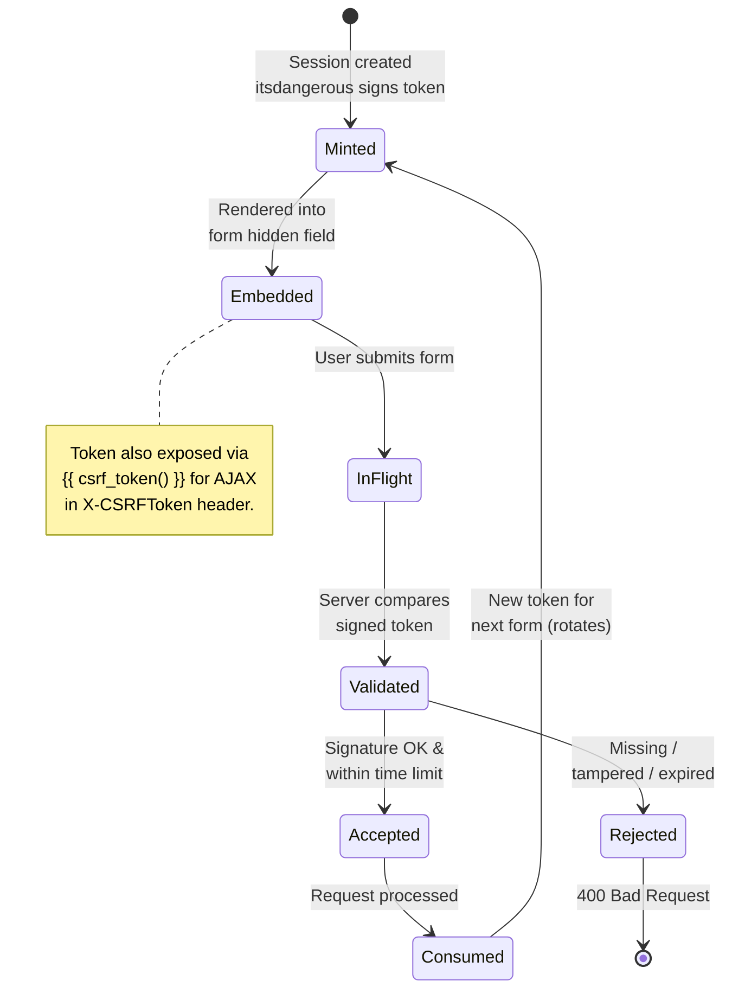
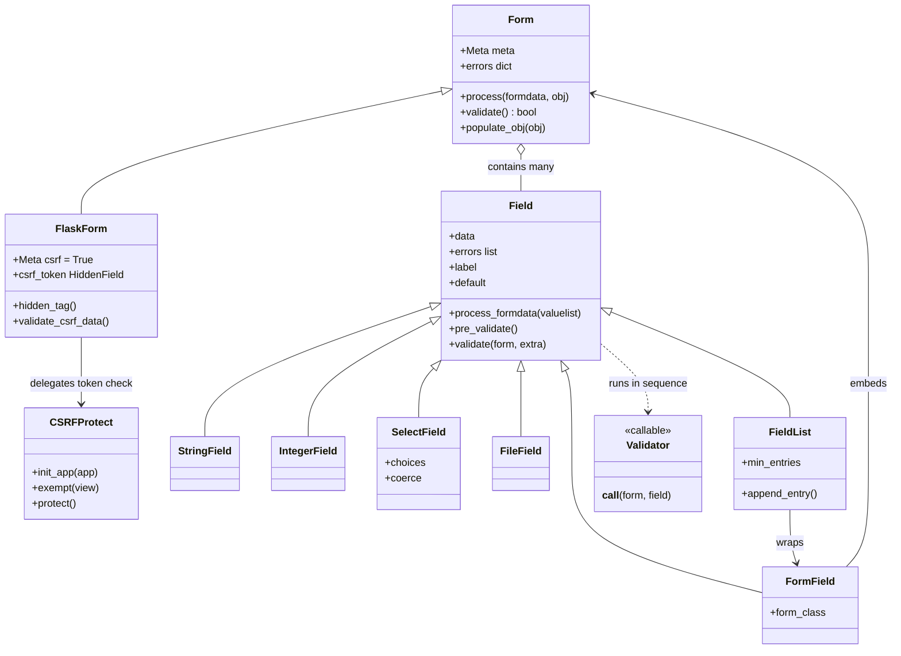
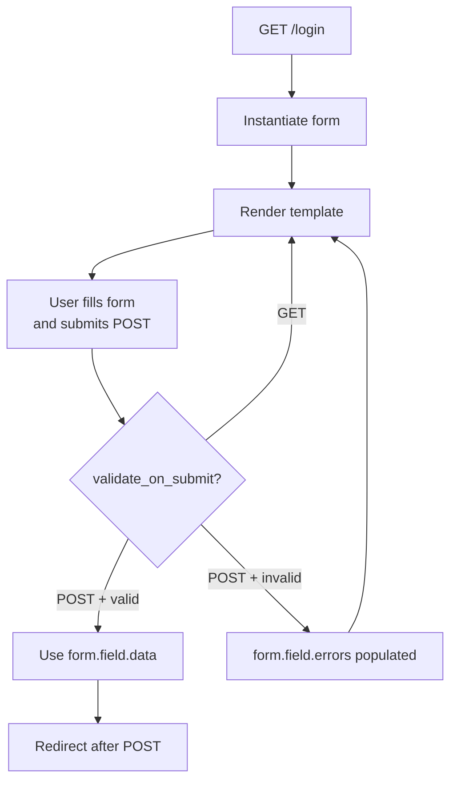
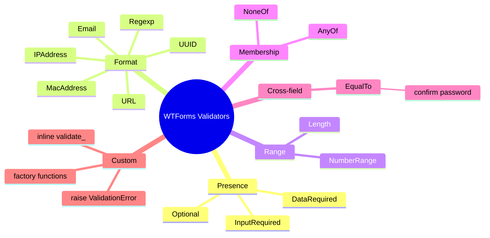
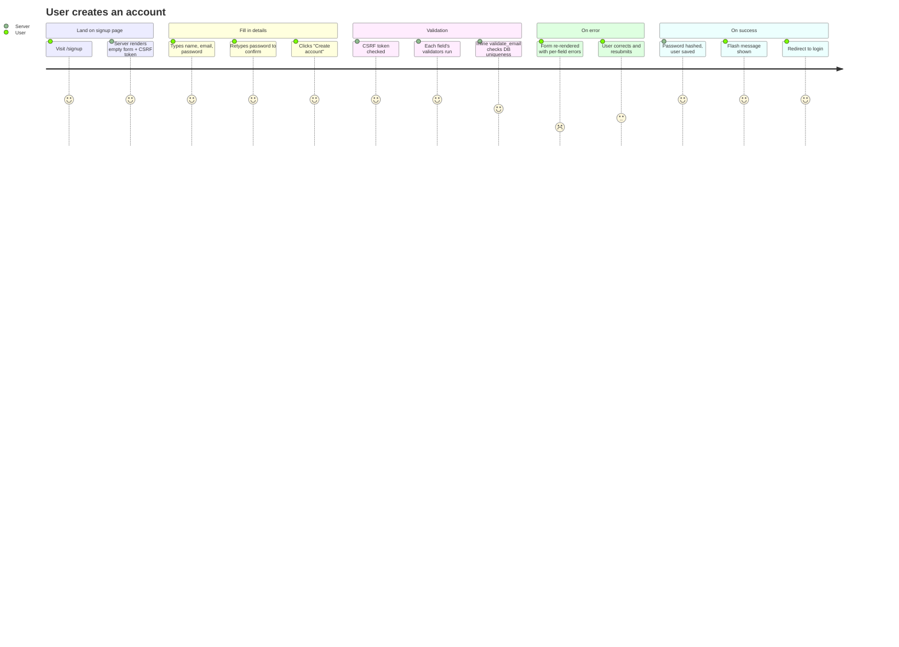

# Flask-WTF

#flask #forms #wtf #wtforms #csrf #validation #security

> [!info] The form-handling and CSRF-protection extension for Flask
> Flask-WTF integrates the [WTForms](https://wtforms.readthedocs.io/) library with Flask and — crucially — provides **CSRF protection** for all your POST/PUT/PATCH/DELETE routes, even ones that don't use forms. Most Flask tutorials reach for `flask_wtf.FlaskForm` for every HTML form, but the package's single highest-value feature is actually `flask_wtf.csrf.CSRFProtect`, a one-line global CSRF shield.

Think of Flask-WTF as **two extensions in one**: (1) a thin Flask adapter around the WTForms library, giving you declarative form classes with field types and validators; and (2) a CSRF middleware that signs and verifies tokens on every state-changing request. Together they close the two biggest gaps in vanilla Flask: untrusted user input and cross-site request forgery.

---

## 1. Overview & Metaphor

### What problem does form handling solve?

A web form is the most common way users send data to a server. The server must, for every field:

1. **Receive** the raw value from `request.form` (a `MultiDict` of strings).
2. **Coerce** it to the right Python type (`"42"` → `42`, `"2024-01-15"` → `date(...)`).
3. **Validate** it (is the email well-formed? is the age between 18 and 120? is the username taken?).
4. **Re-render** the form with error messages if validation failed.
5. **Persist** the validated data — usually via [[Flask-SQLAlchemy]].
6. **Protect** against CSRF — an attacker tricking the user's browser into submitting a form to your site using the user's session cookie.

Doing this by hand for every form is tedious, error-prone, and a security hazard. WTForms standardises steps 1–4; Flask-WTF adds step 6 and wires everything to Flask's request/response cycle.

> [!tip] The metaphor
> Flask-WTF is a **border customs officer** for incoming form data. Every value (passenger) arriving at the border must:
> - Declare its type (passport = field type).
> - Pass inspection (validators = customs check).
> - Carry an unforgeable stamp proving the request originated from a form you actually rendered (CSRF token = visa).
>
> If any step fails, the passenger is sent back with a written reason (`form.email.errors`) — the rest of the form is still processed so the user can correct multiple mistakes at once.

### What is CSRF, exactly?

**Cross-Site Request Forgery** exploits the fact that browsers automatically attach cookies to requests, including cross-origin form submissions. Suppose you're logged into your bank (cookie set). An attacker page contains:

```html
<form action="https://bank.com/transfer" method="POST">
  <input name="to" value="attacker">
  <input name="amount" value="10000">
</form>
<script>document.forms[0].submit()</script>
```

Your browser sends the request **with your bank cookie attached**, and the bank can't tell it didn't come from you. CSRF prevents this by requiring a secret token that the attacker's page cannot read (because of the same-origin policy). Flask-WTF mints a per-session token, embeds it in every form as a hidden field, and rejects submissions that don't match.

#### CSRF Token Lifecycle



### WTForms vs Marshmallow vs Pydantic

| Tool | Primary use | Output | Lives in |
|---|---|---|---|
| **WTForms** | HTML forms (round-trip from server-rendered pages) | Form object → rendered HTML | Server templates |
| **[[Marshmallow]]** | API payloads (JSON in/out) | `dict` / JSON | API endpoints |
| **Pydantic** | Config, settings, FastAPI request bodies | Python objects | Anywhere |

They overlap, but WTForms is unique in producing re-renderable form objects with per-field error collections — perfect for Jinja2 templates.

#### Form Class Hierarchy



---

## 2. Installation

```bash
(venv) $ pip install Flask-WTF
```

Flask-WTF pulls in WTForms, its email validator, and (optionally) the `email-validator` package for proper RFC 6531 email syntax checking. Versions referenced in this note:

- Flask-WTF **1.2.x**
- WTForms **3.1.x**
- Flask **3.0.x**

> [!warning] Pin `email-validator` explicitly
> WTForms' `Email()` validator needs the `email-validator` package. Flask-WTF lists it as an extra, not a hard dependency. If you forget it, `Email()` silently falls back to a permissive regex. Add it explicitly:
> ```bash
> (venv) $ pip install email-validator
> ```

---

## 3. Configuration

Flask-WTF reads its behaviour from `app.config`. The must-have setting is `SECRET_KEY`, which Flask itself uses to sign session cookies and which Flask-WTF reuses to sign CSRF tokens.

```python
# extensions.py
from flask_wtf import CSRFProtect

csrf = CSRFProtect()          # create once, init_app later

# app.py
from flask import Flask
from extensions import csrf

def create_app():
    app = Flask(__name__)
    app.config["SECRET_KEY"] = "change-me-in-production"   # REQUIRED
    app.config["WTF_CSRF_TIME_LIMIT"] = 3600               # 1 hour
    csrf.init_app(app)                                     # global CSRF
    return app
```

### Full configuration table

| Key | Default | Description |
|---|---|---|
| `SECRET_KEY` | _none_ | **Required.** Used to sign session cookies and CSRF tokens. Must be a random, unguessable string (≥32 bytes). |
| `WTF_CSRF_ENABLED` | `True` | Master switch. Set `False` in tests if you don't want to send tokens. |
| `WTF_CSRF_CHECK_DEFAULT` | `True` | When `True` (default), `CSRFProtect` checks every POST/PUT/PATCH/DELETE automatically. Set `False` to opt out globally and use `@csrf.exempt` per-view instead. |
| `WTF_CSRF_SECRET_KEY` | value of `SECRET_KEY` | Separate key for signing CSRF tokens. Useful when you rotate `SECRET_KEY` more often than you want sessions invalidated. |
| `WTF_CSRF_TIME_LIMIT` | `3600` | Token lifetime in seconds. `None` = never expire (not recommended). |
| `WTF_CSRF_SSL_STRICT` | `True` | Reject tokens when scheme isn't `https` in production. Disable only behind a TLS-terminating proxy that lies about `wsgi.url_scheme`. |
| `WTF_CSRF_HEADERS` | `["X-CSRFToken", "X-CSRF-Token"]` | Headers checked for token in AJAX requests. |
| `WTF_CSRF_FIELD_NAME` | `"csrf_token"` | Form field name. Change if it collides with a real field. |
| `WTF_CSRF_METHODS` | `{"POST", "PUT", "PATCH", "DELETE"}` | HTTP methods that require a token. `GET`/`HEAD`/`OPTIONS`/`TRACE` are always exempt. |
| `WTF_I18N_ENABLED` | `True` | Use Flask-Babel for translating validation messages. |

> [!danger] Never set `SECRET_KEY` in source code
> A leaked `SECRET_KEY` lets an attacker forge session cookies and **bypass CSRF entirely** (they can mint valid tokens). Load it from an environment variable:
> ```python
> app.config["SECRET_KEY"] = os.environ["SECRET_KEY"]
> ```
> Use a 32+ byte random value: `python -c "import secrets; print(secrets.token_hex(32))"`.

---

## 4. Basic Usage

### A login form

```python
# forms.py
from flask_wtf import FlaskForm
from wtforms import StringField, PasswordField, BooleanField, SubmitField
from wtforms.validators import DataRequired, Email, Length

class LoginForm(FlaskForm):
    email    = StringField("Email", validators=[DataRequired(), Email()])
    password = PasswordField("Password", validators=[DataRequired(), Length(min=8)])
    remember = BooleanField("Remember me")
    submit   = SubmitField("Log in")
```

```python
# app.py
from flask import Flask, render_template, redirect, url_for, flash
from forms import LoginForm

app = Flask(__name__)
app.config["SECRET_KEY"] = "dev"

@app.route("/login", methods=["GET", "POST"])
def login():
    form = LoginForm()
    if form.validate_on_submit():           # POST + valid
        flash(f"Welcome back, {form.email.data}!")
        return redirect(url_for("dashboard"))
    return render_template("login.html", form=form)   # GET or failed POST

@app.route("/dashboard")
def dashboard():
    return "Dashboard"
```

```html
<!-- templates/login.html -->
<form method="post">
  {{ form.csrf_token }}                       <!-- CSRF hidden field -->
  <p>
    {{ form.email.label }}
    {{ form.email() }}
    <span class="err">{{ err }}</span>
  </p>
  <p>
    {{ form.password.label }}
    {{ form.password() }}
    <span class="err">{{ err }}</span>
  </p>
  <p>{{ form.remember() }} {{ form.remember.label }}</p>
  <p>{{ form.submit() }}</p>
</form>
```

> [!note] `{{ form.csrf_token }}` is mandatory
> Forgetting the hidden CSRF field is the #1 cause of "400 Bad Request" on submit. Always render it inside every `<form>` that uses `method="post"`. Alternatively call `{{ form.hidden_tag() }}` which emits the CSRF field (and any other `HiddenField`s).

### Mermaid: form validation flow



### Field reference

| Field | Renders as | Python type | Notes |
|---|---|---|---|
| `StringField` | `<input type="text">` | `str` | Base for most text inputs. |
| `PasswordField` | `<input type="password">` | `str` | Browser hides characters. Not encrypted server-side. |
| `IntegerField` | `<input type="number">` | `int` | Coerces `"42"` → `42`. |
| `DecimalField` | `<input type="text">` | `decimal.Decimal` | Use for money; avoids float drift. |
| `FloatField` | `<input type="text">` | `float` | Rarely appropriate — prefer `DecimalField`. |
| `BooleanField` | `<input type="checkbox">` | `bool` | Unchecked = `False`. |
| `DateField` | `<input type="date">` | `datetime.date` | Format via `format="%Y-%m-%d"`. |
| `DateTimeField` | `<input type="datetime-local">` | `datetime.datetime` | |
| `RadioField` | `<input type="radio">` (multiple) | `str` | Pass `choices=[("m","Male"),("f","Female")]`. |
| `SelectField` | `<select>` | `str` | Use `validate_choice=True` (default). |
| `SelectMultipleField` | `<select multiple>` | `list[str]` | |
| `TextAreaField` | `<textarea>` | `str` | |
| `FileField` | `<input type="file">` | `FileStorage` | See §5. |
| `MultipleFileField` | `<input type="file" multiple>` | `list[FileStorage]` | |
| `HiddenField` | `<input type="hidden">` | `str` | E.g. for record IDs. |
| `SubmitField` | `<input type="submit">` | `bool` | `True` if clicked when multiple submits. |
| `FieldList` | wraps N copies of another field | `list` | Dynamic-length lists. |
| `FormField` | embeds another form | form instance | Nested/sub-forms. |

### Validator reference

| Validator | Purpose | Example |
|---|---|---|
| `DataRequired` | Field must be present and non-empty | `DataRequired()` |
| `InputRequired` | Field must be present (empty string is OK) | internal use |
| `Optional` | Skip remaining validators if empty | for optional fields |
| `Email` | RFC-valid email | `Email()` |
| `Length` | String length bounds | `Length(min=6, max=128)` |
| `NumberRange` | Numeric range | `NumberRange(min=18, max=120)` |
| `URL` | Well-formed URL | `URL()` |
| `UUID` | Valid UUID | `UUID()` |
| `Regexp` | Match a regex | `Regexp(r"^[a-z0-9_]+$")` |
| `IPAddress` | IPv4/IPv6 | `IPAddress(ipv6=True)` |
| `MacAddress` | MAC address | `MacAddress()` |
| `AnyOf` | Value must be in a list | `AnyOf(["draft","published"])` |
| `NoneOf` | Value must NOT be in a list | `NoneOf(["admin","root"])` |
| `EqualTo` | Must equal another field | `EqualTo("password")` for confirm |

> [!tip] `DataRequired` vs `InputRequired`
> `DataRequired` rejects `None`, `""`, `[]`, `()` — useful for "must have a real value". `InputRequired` only rejects `None` (i.e. the field wasn't submitted at all). For most HTML forms you want `DataRequired`.

#### Validator Concept Map



---

## 5. Intermediate Patterns

### 5.1 Custom validators

A validator is any callable taking the form and field. Raise `ValidationError` to fail:

```python
from wtforms.validators import ValidationError

def reserved_usernames(message=None):
    RESERVED = {"admin", "root", "system", "support"}
    msg = message or "This username is reserved."
    def _validator(form, field):
        if field.data.lower() in RESERVED:
            raise ValidationError(msg)
    return _validator

class SignupForm(FlaskForm):
    username = StringField("Username", validators=[
        DataRequired(), Length(min=3, max=20),
        Regexp(r"^[A-Za-z0-9_]+$"),
        reserved_usernames(),
    ])
```

### 5.2 Inline validators (form-specific)

```python
class SignupForm(FlaskForm):
    email = StringField("Email", validators=[DataRequired(), Email()])
    submit = SubmitField("Sign up")

    def validate_email(self, field):
        # Runs after the listed validators, only if they pass.
        if User.query.filter_by(email=field.data).first():
            raise ValidationError("Email already registered.")
```

Methods named `validate_<fieldname>` are picked up automatically.

### 5.3 Dynamic choices

`SelectField.choices` is evaluated at *render* time, so it can be a property:

```python
from wtforms import SelectField

class PostForm(FlaskForm):
    category = SelectField("Category", coerce=int)

    def __init__(self, *args, **kwargs):
        super().__init__(*args, **kwargs)
        # Categories loaded fresh each request
        self.category.choices = [(c.id, c.name) for c in Category.query.all()]
```

> [!warning] Stale `choices` causes validation errors
> If you set `choices` once at class-definition time, the list is frozen. Add a category in the DB and the form will reject it because it's not in the old choices. Always load choices in `__init__` or a property.

### 5.4 File uploads

Use `FileField` from `flask_wtf.file` (not `wtforms`):

```python
from flask_wtf import FlaskForm
from flask_wtf.file import FileField, FileRequired, FileAllowed

class UploadForm(FlaskForm):
    document = FileField("PDF document",
                         validators=[FileRequired(),
                                     FileAllowed(["pdf"], "PDFs only!")])
    submit   = SubmitField("Upload")
```

```python
@app.route("/upload", methods=["GET", "POST"])
def upload():
    form = UploadForm()
    if form.validate_on_submit():
        f = form.document.data
        filename = secure_filename(f.filename)
        f.save(os.path.join(app.config["UPLOAD_FOLDER"], filename))
        return redirect(url_for("uploaded", name=filename))
    return render_template("upload.html", form=form)
```

```html
<!-- templates/upload.html -->
<form method="post" enctype="multipart/form-data">
  {{ form.csrf_token }}
  {{ form.document() }}
  {{ form.submit() }}
</form>
```

> [!danger] Two things you MUST get right for uploads
> 1. `enctype="multipart/form-data"` on the `<form>` tag — without it the browser sends the filename as a string, not the file content.
> 2. `secure_filename` from `werkzeug.utils` — never trust `f.filename`. `../../../etc/passwd` is a real input.

### 5.5 Nested forms with `FormField` and `FieldList`

```python
from wtforms import FieldList, FormField, Form, StringField, IntegerField

class PhoneForm(Form):
    label  = StringField("Label")
    number = StringField("Number")

class ContactForm(FlaskForm):
    name   = StringField("Name", validators=[DataRequired()])
    phones = FieldList(FormField(PhoneForm), min_entries=1)
    submit = SubmitField("Save")
```

In the template, iterate the `FieldList`:

```html

  <li>{{ sub.label() }} {{ sub.number() }}</li>

```

`FieldList.append_entry()` lets you add rows dynamically with JS, posting back with indexed names like `phones-0-number`, `phones-1-number`.

### 5.6 `populate_obj()` — one-line binding to SQLAlchemy models

```python
@app.route("/profile", methods=["GET", "POST"])
@login_required
def profile():
    form = ProfileForm(obj=current_user)          # pre-fill from model
    if form.validate_on_submit():
        form.populate_obj(current_user)           # write all fields back
        db.session.commit()
        return redirect(url_for("profile"))
    return render_template("profile.html", form=form)
```

> [!warning] `populate_obj` overwrites every field
> It blindly sets `obj.<field> = field.data` for every field on the form — including `submit` and `csrf_token`. Either exclude those fields explicitly, or only put editable model attributes on the form. A common bug: a `submit` field ends up as `user.submit = "Save"` on the model (silently ignored by SQLAlchemy but ugly).

### 5.7 CSRF in AJAX requests

For fetch/axios calls you don't have a `<form>`. Send the token in a header:

```python
# In a base template, expose the token:
<meta name="csrf-token" content="{{ csrf_token() }}">
```

```javascript
// On every AJAX request
const token = document.querySelector('meta[name="csrf-token"]').content;
fetch("/api/like", {
  method: "POST",
  headers: {"X-CSRFToken": token, "Content-Type": "application/json"},
  body: JSON.stringify({post_id: 42})
});
```

Flask-WTF checks `X-CSRFToken` automatically (see `WTF_CSRF_HEADERS`).

### 5.8 Exempting specific views

```python
@app.route("/webhook/stripe", methods=["POST"])
@csrf.exempt                                  # Stripe signs its own requests
def stripe_webhook():
    ...
```

Webhooks from third parties (Stripe, GitHub, Twilio) provide their own signature verification — adding CSRF would break them.

---

## 6. Advanced Usage

### 6.1 Custom field types

Subclass an existing field to add shared behaviour:

```python
from wtforms import StringField
from wtforms.widgets import TextArea

class TagListField(StringField):
    widget = TextArea()
    def _value(self):
        if self.data:
            return ", ".join(self.data)
        return ""
    def process_formdata(self, valuelist):
        if valuelist:
            self.data = [x.strip() for x in valuelist[0].split(",") if x.strip()]
        else:
            self.data = []
```

Use it like any field:

```python
class PostForm(FlaskForm):
    tags = TagListField("Tags")
```

### 6.2 Custom widgets

```python
from wtforms.widgets import html_params, HTMLString

class Bootstrap5Widget:
    def __call__(self, field, **kwargs):
        kwargs.setdefault("class", "form-control")
        if field.errors:
            kwargs["class"] += " is-invalid"
        return HTMLString(f'<input {html_params(name=field.name, value=field.data, **kwargs)}>')
```

### 6.3 Multiple submit buttons

```python
class ConfirmForm(FlaskForm):
    save   = SubmitField("Save",   name="action")
    delete = SubmitField("Delete", name="action")

# In view:
if form.validate_on_submit():
    if form.save.data:   ...
    if form.delete.data: ...
```

### 6.4 CSRF error handler

```python
from flask_wtf.csrf import CSRFError

@app.errorhandler(CSRFError)
def handle_csrf_error(e):
    return render_template("csrf_error.html", reason=e.description), 400
```

### 6.5 Per-form CSRF disabling

```python
class APITokenForm(FlaskForm):
    class Meta:
        csrf = False                  # this form is used in a JWT API
```

### 6.6 Internationalization with Flask-Babel

```python
from flask_babel import lazy_gettext as _l

class LoginForm(FlaskForm):
    email    = StringField(_l("Email"), validators=[DataRequired(), Email()])
    password = PasswordField(_l("Password"), validators=[DataRequired()])
    submit   = SubmitField(_l("Log in"))
```

Validator messages can be translated by passing `_l("...")` as `message=`:

```python
Length(min=8, message=_l("Password must be at least %(min)d characters."))
```

### 6.7 CSRF protection without WTForms

You can use `CSRFProtect` standalone — useful for an API or for plain `request.form` routes:

```python
from flask_wtf import CSRFProtect
csrf = CSRFProtect(app)

@app.route("/plain", methods=["POST"])
def plain():
    # CSRF is checked automatically. Just read request.form.
    return "OK"
```

The token is exposed to templates via `{{ csrf_token() }}` even when no form object exists.

---

## 7. Common Pitfalls & Troubleshooting

### Mermaid: troubleshooting flowchart

```mermaid
flowchart TD
    S[Submit form<br/>gets 400] --> A{csrf_token rendered?}
    A -- No --> R1[Add {{ form.csrf_token }} or form.hidden_tag]
    A -- Yes --> B{SECRET_KEY set & stable?}
    B -- No --> R2[Set SECRET_KEY env var]
    B -- Yes --> C{Submitted in time?}
    C -- No --> R3[Increase WTF_CSRF_TIME_LIMIT]
    C -- Yes --> D{AJAX without header?}
    D -- Yes --> R4[Send X-CSRFToken header]
    D -- No --> E{Multiple tabs /<br/>stale session?}
    E -- Yes --> R5[Refresh page]
    E -- No --> F[Check WTF_CSRF_SSL_STRICT<br/>behind proxy]
```

| Symptom | Likely cause | Fix |
|---|---|---|
| `400 Bad Request — The CSRF token is missing.` | Forgot `{{ form.csrf_token }}` in template | Add `{{ form.hidden_tag() }}` inside `<form>`. |
| `400 — The CSRF token has expired.` | Token older than `WTF_CSRF_TIME_LIMIT` | Bump the limit, or have the page auto-refresh. |
| `400 — The CSRF tokens do not match.` | User has two tabs open with different sessions, or `SECRET_KEY` changed | Log the user out and back in; ensure `SECRET_KEY` is stable. |
| Validation always fails for `SelectField` | Choices set at class definition; new values rejected | Move `choices` assignment into `__init__`. |
| `AttributeError: 'NoneType' object has no attribute 'data'` | Tried `form.field.data` on a missing field | Check field name spelling; check that form class is the one you think. |
| File upload `f` is `None` | Forgot `enctype="multipart/form-data"` | Add `enctype` to `<form>`. |
| `populate_obj` sets weird attrs | Form includes `submit`/`csrf` fields | Use `form.populate_obj(obj, exclude=("csrf_token","submit"))` (3.1+) or split forms. |

> [!danger] CSRF disabled in production by accident
> Setting `WTF_CSRF_ENABLED = False` in a config file that ships to production is a common deployment mistake. Add a test that POSTs to a form without a token and asserts a 400 response:
> ```python
> def test_csrf_enforced(client):
>     r = client.post("/login", data={"email":"a@b.c","password":"12345678"})
>     assert r.status_code == 400
> ```

---

## 8. Best Practices

1. **Always use `FlaskForm`** — even for one-field forms. The CSRF token alone is worth it.
2. **One form per route** when possible. Combine with hidden fields for context, not multiple `<form>` tags pointing to the same URL.
3. **Redirect after POST** (PRG pattern) — prevents the "Confirm Form Resubmission" browser prompt.
4. **Use `obj=` for edit forms** — `EditForm(obj=item)` pre-fills; `form.populate_obj(item)` writes back. Two lines handle the round-trip.
5. **Validate server-side, always.** HTML5 `required` is a UX improvement, not security — it's trivially bypassed.
6. **Use `coerce=int` on `SelectField`** when IDs are integers, otherwise you compare `"3" == 3` and confusion ensues.
7. **Translate messages** with Flask-Babel; users in Madrid shouldn't read "This field is required."
8. **Test form validation** in isolation — instantiate the form with `formdata=MultiDict(...)`, call `validate()`, assert `form.field.errors`. No Flask request context needed.
9. **Pin `email-validator`** explicitly so `Email()` does real RFC validation.
10. **Rotate `SECRET_KEY` carefully.** Changing it invalidates every session and every CSRF token — schedule during low-traffic windows.

---

## 9. Integration with Other Extensions

### With [[Flask-SQLAlchemy]]

The canonical combo. Pattern:

```python
class PostForm(FlaskForm):
    title   = StringField(validators=[DataRequired(), Length(max=200)])
    body    = TextAreaField(validators=[DataRequired()])
    tags    = TagListField()
    submit  = SubmitField("Save")

@app.route("/posts/new", methods=["GET", "POST"])
@login_required
def new_post():
    form = PostForm()
    if form.validate_on_submit():
        post = Post(author=current_user)
        form.populate_obj(post)
        db.session.add(post)
        db.session.commit()
        return redirect(url_for("post_detail", id=post.id))
    return render_template("post_form.html", form=form)
```

### With [[Flask-Login]]

`@login_required` protects the route; Flask-WTF protects the form. They compose cleanly. For "fresh login required" actions (password change, email change), see Flask-Login's `@fresh_login_required`.

### With [[Marshmallow]]

Use WTForms for HTML forms, Marshmallow for JSON APIs. They don't conflict — different code paths. If you find yourself writing the same rules twice, consider generating WTForms from Marshmallow schemas via `marshmallow-serializer` or simply hand-maintain both (the duplication is usually small).

### With [[Flask-RESTful]]

Flask-RESTful APIs typically disable WTForms' CSRF (tokens come from [[Flask-JWT-Extended]]). But you can still use WTForms to parse JSON payloads:

```python
class JsonForm(FlaskForm):
    class Meta:
        csrf = False
    name = StringField(validators=[DataRequired()])
```

---

## 10. Real-World Example — Registration Form

A complete, runnable single-file app demonstrating:

- Custom inline validator (email uniqueness)
- `EqualTo` for password confirmation
- `populate_obj` to a SQLAlchemy model
- Flash messages and re-rendering with errors
- CSRF protection

### User Journey — Successful Signup



```python
# app.py — pip install flask flask-wtf flask-sqlalchemy email-validator
import os
from flask import Flask, render_template_string, redirect, url_for, flash
from flask_sqlalchemy import SQLAlchemy
from flask_wtf import FlaskForm
from wtforms import StringField, PasswordField, SubmitField
from wtforms.validators import DataRequired, Email, Length, EqualTo, ValidationError
from werkzeug.security import generate_password_hash

app = Flask(__name__)
app.config["SECRET_KEY"] = os.environ.get("SECRET_KEY", "dev-secret-change-me")
app.config["SQLALCHEMY_DATABASE_URI"] = "sqlite:///app.db"
db = SQLAlchemy(app)

class User(db.Model):
    id       = db.Column(db.Integer, primary_key=True)
    email    = db.Column(db.String(120), unique=True, nullable=False)
    name     = db.Column(db.String(80),  nullable=False)
    pw_hash  = db.Column(db.String(255), nullable=False)

class SignupForm(FlaskForm):
    name            = StringField("Name",     validators=[DataRequired(), Length(1, 80)])
    email           = StringField("Email",    validators=[DataRequired(), Email()])
    password        = PasswordField("Password",
                                   validators=[DataRequired(), Length(min=8, max=128)])
    confirm         = PasswordField("Confirm password",
                                   validators=[DataRequired(), EqualTo("password",
                                              message="Passwords must match.")])
    submit          = SubmitField("Create account")

    def validate_email(self, field):
        if User.query.filter_by(email=field.data).first():
            raise ValidationError("That email is already registered.")

TPL = """

  <div class="flash {{ cat }}">{{ msg }}</div>

<form method="post">
  {{ form.csrf_token }}
  <p>{{ form.name.label }} {{ form.name() }}
     <span style="color:red">{{ e }}</span></p>
  <p>{{ form.email.label }} {{ form.email() }}
     <span style="color:red">{{ e }}</span></p>
  <p>{{ form.password.label }} {{ form.password() }}
     <span style="color:red">{{ e }}</span></p>
  <p>{{ form.confirm.label }} {{ form.confirm() }}
     <span style="color:red">{{ e }}</span></p>
  <p>{{ form.submit() }}</p>
</form>
"""

@app.route("/signup", methods=["GET", "POST"])
def signup():
    form = SignupForm()
    if form.validate_on_submit():
        user = User(name=form.name.data, email=form.email.data,
                    pw_hash=generate_password_hash(form.password.data))
        db.session.add(user)
        db.session.commit()
        flash("Account created — please log in.", "success")
        return redirect(url_for("signup"))
    return render_template_string(TPL, form=form)

if __name__ == "__main__":
    with app.app_context():
        db.create_all()
    app.run(debug=True)
```

Run with `python app.py`, visit `http://127.0.0.1:5000/signup`, and try:

- Submit empty → see "required" errors.
- Submit `bob` for email → "Invalid email address."
- Submit mismatched passwords → "Passwords must match."
- Submit a duplicate email → "That email is already registered."

---

## 11. References

- Official docs: <https://flask-wtf.readthedocs.io/>
- WTForms docs: <https://wtforms.readthedocs.io/>
- `email-validator`: <https://pypi.org/project/email-validator/>
- OWASP CSRF Prevention Cheat Sheet: <https://cheatsheetseries.owasp.org/cheatsheets/Cross-Site_Request_Forgery_Prevention_Cheat_Sheet.html>
- Pallets Projects — Flask security: <https://flask.palletsprojects.com/en/latest/security/>
- Related notes: [[Flask-SQLAlchemy]], [[Flask-Login]], [[Marshmallow]], [[Flask-RESTful]], [[Security-Best-Practices]]
