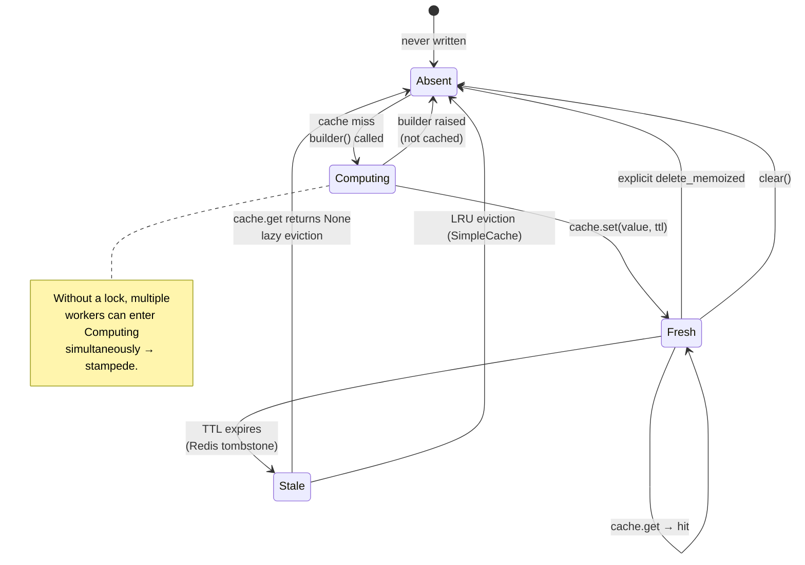
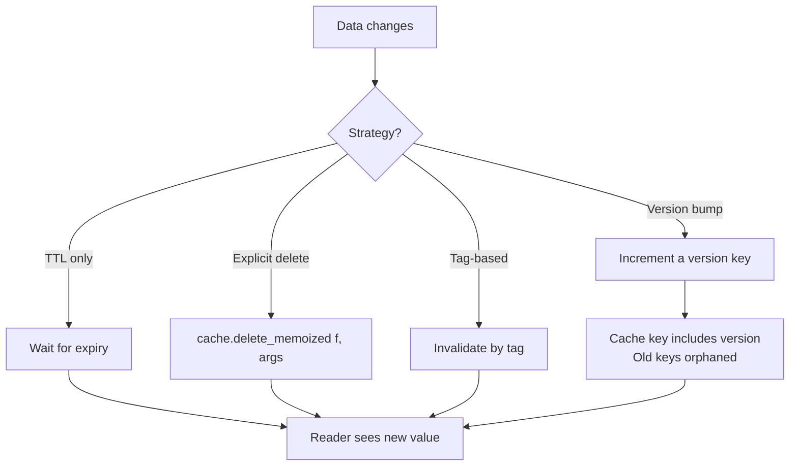
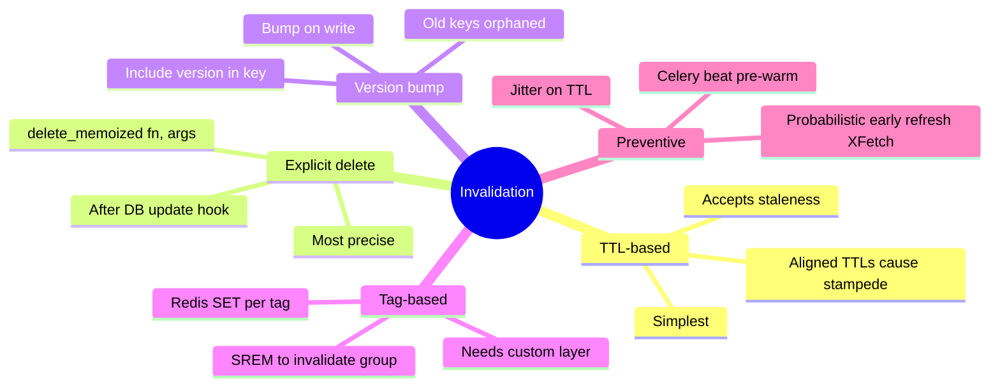
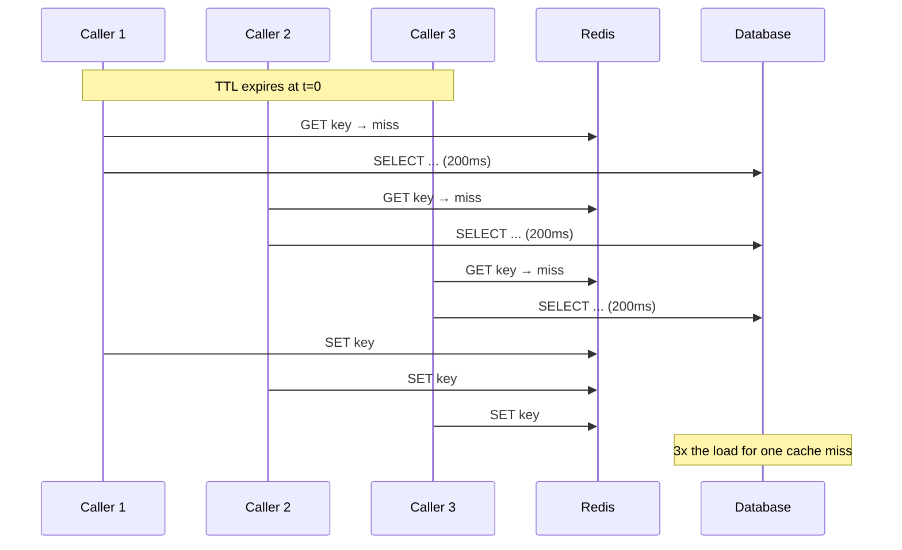
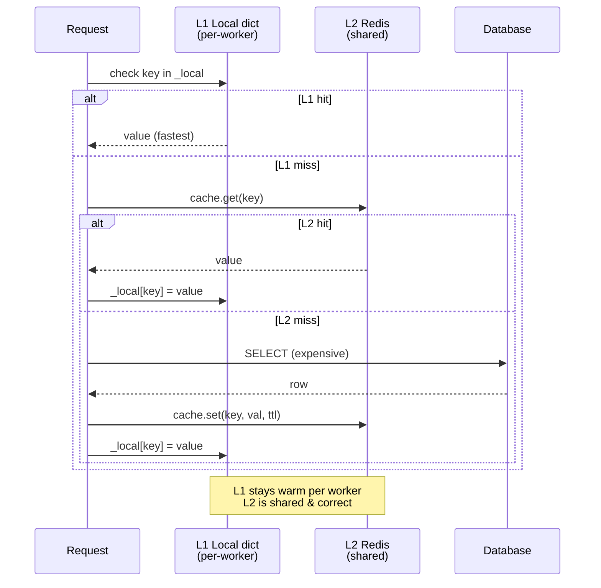
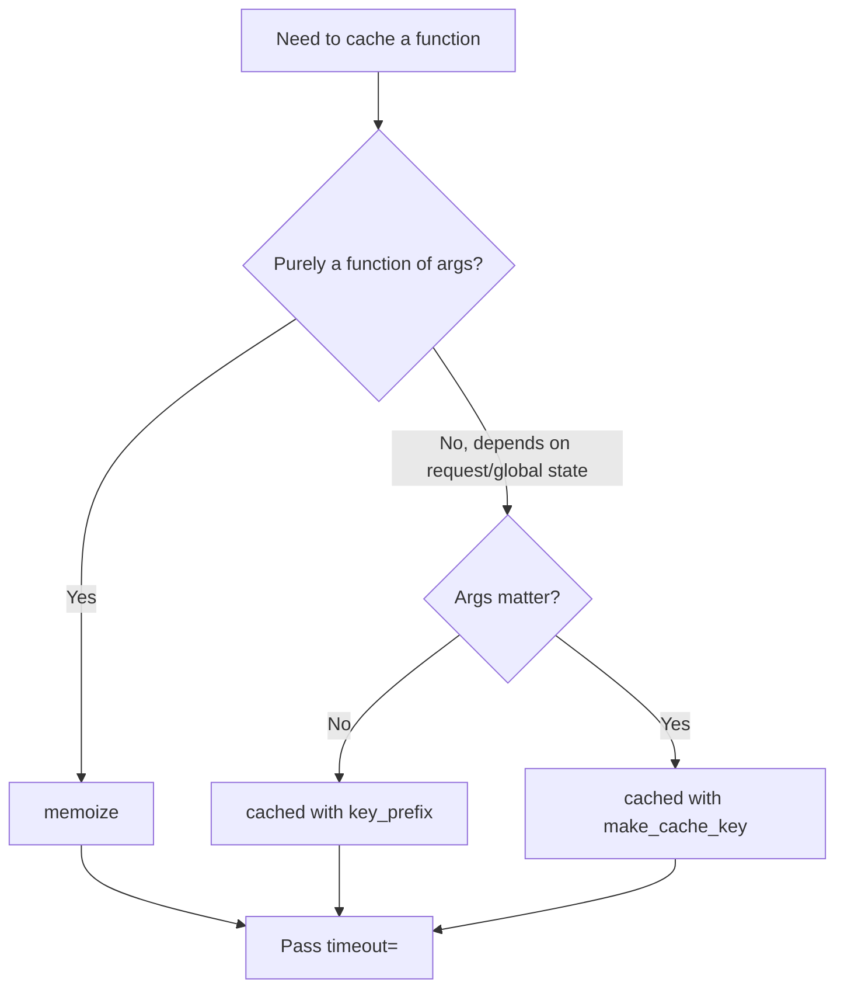

# Flask-Caching

#flask #caching #redis #memcached #performance #memoization #utilities

> [!info] The caching abstraction layer for Flask
> Flask-Caching is a thin, pluggable cache front-end for Flask. It supports a dozen backends (in-memory, filesystem, Redis, Memcached, MongoDB), exposes a uniform API (`cache.cached()`, `cache.memoize()`, `cache.get/set/delete`), and integrates with Jinja2 via a `` template tag. The same code can swap from `SimpleCache` in dev to Redis in prod by changing one config key.
>
> It is the successor to the long-deprecated `Flask-Cache` (note the missing "ing") and is the recommended cache layer for nearly every Flask project that needs more than `functools.lru_cache`.

Think of Flask-Caching as a **refrigerator for your function results**. You cooked a meal (computed a result) once; instead of throwing it away, you label it (`cache_key`) and put it on a shelf (`cache.set`). When you want it again, you check the fridge first (`cache.get`) and only re-cook if it's gone off (TTL expired) or you threw it out (`cache.delete`).

---

## 1. Overview & Metaphor

### What problem does caching solve?

Caching addresses a single problem: **redundant computation is expensive**. Real Flask apps repeatedly:

- Run the same database query (a homepage's "top 10 articles").
- Render the same template fragment (a navigation bar).
- Call the same external API (currency exchange rates).
- Compute the same derived value (a user's reputation score).

If any of these takes 50 ms and runs 100 times per second, that's 5 seconds of CPU per second of wall-clock — i.e. you need ≥5 workers just to keep up, even though the *answer* only changes once an hour.

A cache intercepts the call: "I already computed this for inputs X, here's the stored result." The cost drops from 50 ms to ~0.5 ms (a Redis `GET`), and you can handle the same load with one worker.

### Where caches live (and when to use each)

| Layer | TTL | Cost | Invalidates on | Use for |
|---|---|---|---|---|
| Browser cache | Hours–days | Free (client-side) | URL change, ETag/Last-Modified | Static assets, `Cache-Control: public` |
| CDN (Cloudflare, Fastly) | Minutes–days | Free–cheap | URL or purge | Public pages, images, JS/CSS |
| Reverse-proxy (Nginx) | Seconds–minutes | Free | URL purge | Public pages, full-page cache |
| **App cache (Flask-Caching)** | Seconds–hours | App memory | Explicit delete or TTL | Query results, rendered fragments, computed values |
| Database query cache | Seconds–minutes | Free | Transaction commit | Hot rows |

Flask-Caching sits in the **app layer** — close to your code, flexible, but per-process (unless you use Redis/Memcached as the shared backend).

> [!tip] The metaphor
> Flask-Caching is a **shared fridge in the office kitchen**. Anyone on the team (any worker process) can open it and grab last night's lasagna. The lasagna has a sticky note (`cache_key`) and a "use by" date (`timeout` / TTL). When it expires you throw it out and re-cook — but only if someone asks for it again. If you put it in a *communal* fridge (Redis), everyone sees the same lasagna; if you put it in a *personal* mini-fridge (`SimpleCache`), each worker keeps their own and they drift out of sync.

### The CAP-ish tradeoff

Every cache introduces a **consistency vs. performance** tradeoff:

- **Low TTL (1–10 s)** — almost-fresh data, low cache-hit ratio.
- **High TTL (1–24 h)** — high hit ratio, stale data, requires explicit invalidation.

Pick TTLs based on the cost of staleness, not on a default. A currency rate can be 6 hours stale; a user's notification badge cannot.

---

## 2. Installation

```bash
(venv) $ pip install Flask-Caching
```

For backends, install the right client library:

```bash
(venv) $ pip install redis          # Redis backend
(venv) $ pip install pylibmc        # Memcached (fastest, C-based)
(venv) $ pip install python-memcached  # Memcached (pure Python)
(venv) $ $ pip install pymongo      # MongoDB backend (rare)
```

Versions referenced in this note:

- Flask-Caching **2.1.x**
- Flask **3.0.x**
- redis-py **5.x**

---

## 3. Configuration

Flask-Caching reads its config from `app.config`. The most important key is `CACHE_TYPE` — it selects the backend.

| `CACHE_TYPE` | Backend | Library needed | Process-shared? | Use for |
|---|---|---|---|---|
| `null` | No-op cache | — | — | Testing; disable cache |
| `SimpleCache` | In-process dict | — | **No** (per-worker) | Dev, single-process |
| `FileSystemCache` | Files on disk | — | Yes (shared filesystem) | Small apps, dev |
| `RedisCache` | Redis | `redis` | Yes | **Production default** |
| `RedisSentinelCache` | Redis via Sentinel | `redis` | Yes | HA Redis clusters |
| `RedisClusterCache` | Redis Cluster | `redis` | Yes | Sharded Redis |
| `MemcachedCache` | Memcached | `pylibmc` or `python-memcached` | Yes | Memcached shops |
| `SASLMemcachedCache` | Memcached + SASL auth | `pylibmc` | Yes | Auth Memcached |
| `SpreadSASLMemcachedCache` | SASL Memcached w/ spread reads | `pylibmc` | Yes | Multi-node Memcached |
| `MongoDBCache` | MongoDB | `pymongo` | Yes | Rare; if you already run Mongo |
| `DynamoDBCache` | AWS DynamoDB | `boto3` | Yes | Serverless cache |
| `NullCache` | Same as `null` (alias) | — | — | Testing |

> [!warning] `SimpleCache` is not shared across workers
> If you run Gunicorn with 4 workers, each worker has its own `SimpleCache` and they will not see each other's keys. For multi-worker production, **always use Redis or Memcached**.

### Common config keys

| Key | Default | Description |
|---|---|---|
| `CACHE_TYPE` | `null` | Backend selector — see table above |
| `CACHE_DEFAULT_TIMEOUT` | `300` (5 min) | Default TTL in seconds for `set`/`cached`/`memoize` |
| `CACHE_THRESHOLD` | `500` | Max items for `SimpleCache` / `FileSystemCache` (LRU eviction) |
| `CACHE_KEY_PREFIX` | `flask_cache_` | Prefix on all keys — useful for shared Redis |
| `CACHE_OPTIONS` | `{}` | Backend-specific kwargs (passed to the client) |
| `CACHE_ARGS` | `[]` | Positional args to the backend class |
| `CACHE_NO_NULL_WARNING` | `False` | Suppress the "CACHE_TYPE is null" warning |
| `CACHE_REDIS_URL` | `None` | Shortcut: `redis://[:password@]host:port/db` |
| `CACHE_REDIS_HOST` | `None` | Explicit host (alternative to URL) |
| `CACHE_REDIS_PORT` | `6379` | Port |
| `CACHE_REDIS_PASSWORD` | `None` | Password |
| `CACHE_REDIS_DB` | `0` | Redis DB index |
| `CACHE_MEMCACHED_SERVERS` | `None` | List of `host:port` strings |
| `CACHE_DIR` | `None` | Directory for `FileSystemCache` |
| `CACHE_SOURCE_CHECK` | `False` | Include function source hash in memoize keys (see §7) |

### Dev vs production config

```python
# config.py
class DevelopmentConfig:
    CACHE_TYPE = "SimpleCache"
    CACHE_DEFAULT_TIMEOUT = 60
    CACHE_THRESHOLD = 1000

class ProductionConfig:
    CACHE_TYPE = "RedisCache"
    CACHE_REDIS_URL = os.environ["REDIS_URL"]
    CACHE_KEY_PREFIX = "myapp:"
    CACHE_DEFAULT_TIMEOUT = 300
```

### Initialising the extension

```python
# extensions.py
from flask import Flask
from flask_caching import Cache

cache = Cache()

def init_app(app: Flask) -> None:
    cache.init_app(app)
```

```python
# app.py
from flask import Flask
from config import ProductionConfig
from extensions import init_app

def create_app() -> Flask:
    app = Flask(__name__)
    app.config.from_object(ProductionConfig)
    init_app(app)
    return app
```

#### Cache Entry State Machine



---

## 4. Basic usage

### `cache.cached()` — cache a function by its name

`cache.cached(timeout, key_prefix, unless, response_filter, query_string, hash_method)` decorates a function and caches its return value by the `key_prefix` (default `view/<function.module>.<function.__name__>`).

```python
from flask import Flask
from extensions import cache

app = Flask(__name__)

@app.route("/health")
@cache.cached(timeout=30)
def health():
    # Expensive check — only runs once per 30s
    import time; time.sleep(2)
    return {"ok": True, "ts": time.time()}
```

The first request takes 2 s; subsequent ones return instantly from cache for 30 s.

> [!note] `cached()` ignores arguments
> `cached()` keys **only** on the function name — every call with any argument returns the same cached value. To cache per-argument, use `memoize()` (next section).

### `cache.memoize()` — cache by function name **and** args

```python
@cache.memoize(timeout=60)
def get_user(user_id: int) -> dict:
    # Hits the DB only on cache miss
    user = User.query.get(user_id)
    return {"id": user.id, "name": user.name, "email": user.email}

# Different args → different cache keys:
get_user(1)   # DB hit
get_user(2)   # DB hit
get_user(1)   # Cache hit
```

`memoize` builds the cache key from:

1. The function's module + qualified name
2. A hash of the positional arguments
3. A hash of the sorted keyword arguments

### `cache.delete()` and `cache.delete_memoized()`

```python
# Remove a cached() value:
cache.delete("view/__main__.health")

# Remove a memoized() value — pass the function and the args you used:
cache.delete_memoized(get_user, 1)

# Or nuke ALL memoized values for a function:
cache.delete_memoized(get_user)
```

### Low-level `cache.get/set/delete`

```python
cache.set("weather:London", {"temp": 12, "icon": "rain"}, timeout=600)
weather = cache.get("weather:London")
cache.delete("weather:London")
cache.set_many({"a": 1, "b": 2}, timeout=60)
cache.get_many("a", "b")   # → [1, 2]
cache.delete_many("a", "b")
cache.clear()              # ⚠ wipes the whole cache (or namespace, depending on backend)
cache.has("weather:London")  # → bool (note: separate round-trip — usually just use get)
```

---

## 5. Intermediate patterns

### `cached()` parameters

| Param | Type | Description |
|---|---|---|
| `timeout` | `int` | TTL in seconds; default = `CACHE_DEFAULT_TIMEOUT` |
| `key_prefix` | `str` | Override the cache key |
| `unless` | `Callable` | If it returns truthy, **skip** the cache (read-through) |
| `response_filter` | `Callable` | Only cache if it returns truthy (e.g. cache 200s only) |
| `query_string` | `bool` | Include the request's query string in the key |
| `hash_method` | `Callable` | Hashing function for keys (default: `md5`) |
| `cache_none` | `bool` | Cache `None` returns too (default `False`) |
| `make_cache_key` | `Callable` | Custom key-builder (advanced; replaces default) |

```python
from flask import request

# Per-query-string caching — /search?q=foo and /search?q=bar cache separately
@app.route("/search")
@cache.cached(timeout=60, query_string=True)
def search():
    q = request.args.get("q")
    return {"results": expensive_search(q)}

# Don't cache admin responses
def is_admin():
    return "admin" in request.cookies

@app.route("/dashboard")
@cache.cached(timeout=60, unless=is_admin)
def dashboard():
    return {"stats": compute_stats()}

# Only cache successful responses
@app.route("/api/users")
@cache.cached(timeout=60, response_filter=lambda r: r.status_code == 200)
def users():
    ...
```

### Per-view caching

```python
@app.route("/api/articles")
@cache.cached(timeout=300, key_prefix="articles:list")
def list_articles():
    return jsonify([a.to_dict() for a in Article.query.all()])
```

### Template caching with the Jinja2 `` tag

Register the extension:

```python
cache.init_app(app, config={"CACHE_TYPE": "RedisCache", ...})
```

Use in templates:

```jinja

  <aside>
    <h2>Popular today</h2>
    <ul>
      
        <li>{{ article.title }}</li>
      
    </ul>
  </aside>

```

The arguments are `(timeout, key_suffix, *vary_on)`. `vary_on` lets you cache per-user, per-language, etc.:

```jinja

  <header>...</header>

```

> [!warning] Don't `` user-specific data with a global key
> If two users hit the same `` block, user A's menu may be served to user B. Always include `current_user.id` (or session ID) in the vary_on.

### Manual cache key construction

```python
def make_cache_key(*args, **kwargs):
    from flask import request
    # Cache per user + per page
    user_id = current_user.id if current_user.is_authenticated else "anon"
    page = request.args.get("page", 1)
    return f"articles:list:{user_id}:p{page}"

@app.route("/api/articles")
@cache.cached(timeout=300, make_cache_key=make_cache_key)
def list_articles():
    ...
```

### Cache invalidation strategies



1. **TTL-only** — simplest, accepts staleness.
2. **Explicit delete** — call `cache.delete_memoized` after a write. Works well for memoized model methods.
3. **Version bump** — keep a `User:42:profile:version` integer in cache; include it in the key; bump on write.
4. **Tag-based** — Flask-Caching doesn't natively support tags, but Redis backend can use `MSET`/`SADD` patterns.

#### Invalidation Strategies Mindmap



```python
# Pattern: explicit delete
@db.event.listens_for(User, "after_update")
def on_user_update(mapper, connection, target):
    cache.delete_memoized(get_user, target.id)
```

---

## 6. Advanced usage

### `cache.memoize()` deep dive

`memoize` is **the** tool for caching pure functions of their arguments. But it has sharp edges:

```python
@cache.memoize(timeout=300)
def expensive_pure_function(a, b, c=10):
    ...
```

Key generation:
- `make_cache_key` → `flask_cache_view//app.utils.expensive_pure_function/<hash(a, b, c=10)>`
- Default hash: SHA-1 of `repr((args, sorted(kwargs.items())))`

### Gotcha: mutable args

```python
@cache.memoize(timeout=60)
def filter_products(filters: dict):
    return [p for p in Product.query.all() if matches(p, filters)]

filter_products({"color": "red"})   # cache miss
filter_products({"color": "red"})   # cache HIT (same repr)
filter_products({"color": "blue"})  # cache miss (different repr)
```

The default hashing uses `repr()`, which works for dicts **if the key order is stable**. Two dicts with the same content but different insertion order produce different reprs in older Pythons. Modern Python (3.7+) guarantees dict ordering, but if you accept a dict from JSON, the order matches the wire format — which may differ between clients.

**Fix:** normalise args before memoization:

```python
@cache.memoize(timeout=60)
def filter_products(filters: dict):
    normalised = tuple(sorted(filters.items()))
    return _filter_products_impl(normalised)

@cache.memoize(timeout=60)
def _filter_products_impl(normalised: tuple):
    filters = dict(normalised)
    ...
```

### Gotcha: unhashable args

Lists, sets, and custom objects without `__hash__` break memoization. Pass immutable types or convert to tuples/frozensets first.

### Gotcha: `cache_none` and negative caching

By default, `memoize` does **not** cache `None` returns. If your function returns `None` for "not found", every call hits the DB. To cache negative results:

```python
@cache.memoize(timeout=60, cache_none=True)
def get_optional_user(email):
    return User.query.filter_by(email=email).first()
```

> [!warning] Caching `None` can mask temporary failures
> If your function raises, `memoize` does not cache the exception — good. But if your function returns `None` on transient error (e.g. DB down), you'll cache that None for the full TTL. Distinguish "not found" (return `None`, cache it) from "error" (raise, don't cache).

### `CACHE_SOURCE_CHECK=True` — invalidate memoize on code change

When enabled, Flask-Caching includes a hash of the function's bytecode in the cache key. Edit the function → all old cached values become orphaned → next call recomputes. Invaluable during development; usually disabled in production (extra hash cost).

### Cache stampede and prevention

A **cache stampede** happens when many requests miss the cache simultaneously (e.g. TTL expires, or a cold start) and all proceed to compute the expensive function at once — your DB gets hammered.



Prevention strategies:

1. **Lock-then-compute (mutex)** — first caller acquires a Redis lock; others wait briefly and re-check the cache.
2. **Probabilistic early refresh (XFetch)** — refresh the cache early with probability that grows as TTL approaches expiry, so refreshes spread out.
3. **Pre-warm** — schedule a [[Celery]] beat task to refresh the cache before TTL expiry.

```python
# Pattern: lock-then-compute
import time
from extensions import cache

def get_with_lock(key, builder, timeout=300, lock_timeout=30):
    val = cache.get(key)
    if val is not None:
        return val
    lock_key = f"{key}:lock"
    # SET NX = only set if not exists; EX = TTL
    if cache.cache._client.set(lock_key, "1", nx=True, ex=lock_timeout):
        try:
            val = builder()
            cache.set(key, val, timeout=timeout)
        finally:
            cache.delete(lock_key)
    else:
        # Another worker is computing — wait briefly
        for _ in range(10):
            time.sleep(0.1)
            val = cache.get(key)
            if val is not None:
                return val
        val = builder()  # give up, compute ourselves
    return val
```

### Redis backend deep dive

Redis is the recommended production backend. Key advantages:

- **Atomic operations** — `INCR`, `SET NX`, pipelines, Lua.
- **Pub/Sub** — built-in message bus (useful for cross-process invalidation).
- **TTL precision** — seconds or milliseconds.
- **Persistence** — RDB snapshots + AOF log; survives restarts.
- **Structures** — strings, hashes, lists, sets, sorted sets.

```python
# Access the raw redis client (Flask-Caching 2.x):
client = cache.cache._client
# SET with NX (only if not exists), EX (TTL seconds):
client.set("lock:foo", "1", nx=True, ex=30)
# INCR counter:
count = client.incr("counter:visits")
# Sorted set for leaderboards:
client.zadd("leaderboard", {"alice": 950, "bob": 870})
```

> [!warning] Don't reach for `_client` without reason
> Flask-Caching deliberately hides the backend. If you find yourself using `_client` heavily, consider whether you should be using `redis` directly for that specific use case (e.g. rate limiting — that's [[Flask-Limiter]]'s job) and let Flask-Caching handle only the cache abstraction.

### Multi-level caching

Combine `SimpleCache` (per-process, ultra-fast) in front of Redis (shared, slower):

```python
from extensions import cache

_local = {}

def get_two_level(key, builder, timeout=300):
    if key in _local:
        return _local[key]
    val = cache.get(key)
    if val is None:
        val = builder()
        cache.set(key, val, timeout=timeout)
    _local[key] = val
    return val
```

This trades correctness for speed: writes to Redis by worker A won't be visible to worker B's local cache until B restarts or its local TTL expires. Use only for genuinely immutable data.

#### Two-Level Cache Lookup



---

## 7. Common pitfalls & troubleshooting

| Symptom | Likely cause | Fix |
|---|---|---|
| Cache "doesn't work" in production | `CACHE_TYPE=SimpleCache` + multiple workers | Switch to `RedisCache` |
| Memoize returns wrong value for different users | Cached a function that reads `current_user` without including it in args | Pass `current_user.id` as an explicit arg, or use `make_cache_key` |
| `TypeError: unhashable type: 'list'` | Memoize can't hash list args | Convert to `tuple` |
| Cache hit on dev, miss on prod | Different `CACHE_KEY_PREFIX` between envs | Make prefix env-agnostic or include env name |
| Redis memory blows up | No TTLs, keys never expire | Always pass `timeout=`; monitor `INFO memory` |
| Stale data after DB update | Forgot `cache.delete_memoized` | Add an SQLAlchemy `after_update` listener |
| `` template tag not found | Forgot to `cache.init_app(app)` | Initialise the extension before the template runs |
| Cache works in shell but not in request | Different app instances | Make sure the `cache` object is the same one initialised in the app |
| `ConnectionError: Redis unreachable` | Wrong `CACHE_REDIS_URL` / network | Check `redis-cli -u $REDIS_URL ping` |
| Spiky DB load every 5 minutes | TTL aligned across hot keys | Add jitter: `timeout=300 + random.randint(-30, 30)` |
| Per-user cached data leaks between users | Template `` without `current_user.id` in vary_on | Add user ID (or session ID) |
| Cache returns stale data after deploy | Function code changed but key didn't | Enable `CACHE_SOURCE_CHECK=True` in dev |

### Memoize vs cached — quick decision



### Verify the cache is being hit

```python
import logging
logging.basicConfig(level=logging.DEBUG)
# Flask-Caching logs cache misses/hits at DEBUG when the cache backend supports it.
# Or instrument manually:

@cache.memoize(timeout=60)
def get_user(uid):
    app.logger.info("CACHE MISS for user %s", uid)
    return User.query.get(uid)
```

---

## 8. Best practices

1. **Pick the right backend for the environment.** Dev = `SimpleCache`; prod = `RedisCache`.
2. **Always set a TTL.** A cache without a TTL is just a slow memory leak.
3. **Use `memoize` for pure functions; `cached` for views.**
4. **Invalidate on writes** — wire `cache.delete_memoized` to SQLAlchemy `after_update`/`after_delete` events.
5. **Include the user ID (or session ID) in cache keys for user-specific data.**
6. **Don't cache errors.** Raise exceptions; let the cache miss on the next call.
7. **Don't cache mutable objects in-place.** If the cached value is a dict and a caller mutates it, the next caller sees the mutation. Return deep copies if necessary.
8. **Use `CACHE_KEY_PREFIX` per environment** — `myapp_dev:`, `myapp_prod:` — so dev and prod never collide on shared Redis.
9. **Monitor hit ratio.** Redis: `INFO stats` → `keyspace_hits / (keyspace_hits + keyspace_misses)`. Aim for >80% on hot keys.
10. **Add jitter to TTLs** — spread expiries to avoid stampedes.
11. **Don't cache user-input-derived keys without bounds.** An unbounded `cache.set(f"q:{user_query}", ...)` lets an attacker fill Redis with garbage. Hash the input and cap the key space.
12. **Test the cache off in unit tests** — `CACHE_TYPE=null` — to verify business logic independently.

---

## 9. Integration with other extensions

### [[Flask-SQLAlchemy]] — caching query results

```python
from extensions import cache, db
from models import Article

@cache.memoize(timeout=300)
def get_article(article_id: int) -> dict:
    article = db.session.get(Article, article_id)
    return article.to_dict() if article else None

@db.event.listens_for(Article, "after_update")
def _invalidate(mapper, connection, target):
    cache.delete_memoized(get_article, target.id)

@db.event.listens_for(Article, "after_delete")
def _invalidate_delete(mapper, connection, target):
    cache.delete_memoized(get_article, target.id)
```

### [[Flask-Limiter]]

[[Flask-Limiter]] uses its own storage (Redis/memcached/memory). You can share the Redis instance but use different DB indexes or key prefixes:

```python
# Flask-Caching uses db 0
CACHE_REDIS_URL = "redis://localhost:6379/0"
# Flask-Limiter uses db 1
RATELIMIT_STORAGE_URI = "redis://localhost:6379/1"
```

A common pattern: cache expensive responses and **also** rate-limit the endpoint so a single abuser can't fill the cache with garbage.

### [[Flask-RESTful]]

```python
from flask_restful import Resource
from extensions import cache

class ArticleResource(Resource):
    @cache.cached(timeout=300, key_prefix="article:list")
    def get(self):
        return [a.to_dict() for a in Article.query.all()]
```

> [!warning] `cached()` on a `Resource` method needs `make_cache_key`
> The default `key_prefix` is `view/<module>.<name>`. For a `Resource` method, the qualified name includes the class, but it's the same for every URL. Use `make_cache_key` to include `request.path` and `request.args`.

### [[Celery]]

- Celery results backend ≠ cache backend — keep them separate.
- Common pattern: a Celery task refreshes the cache every N minutes (pre-warming); user requests always hit warm cache.

```python
@shared_task
def refresh_popular_articles():
    cache.set("articles:popular", compute_popular(), timeout=3600)

# In celery beat schedule:
"refresh-popular-articles": {
    "task": "tasks.cache.refresh_popular_articles",
    "schedule": 1800,  # every 30 min
}
```

---

## 10. Real-world example — caching an API with Redis

A complete, runnable single-file app demonstrating per-route caching, memoized model methods, cache invalidation on writes, and a stampede-safe refresh.

```python
# app.py
import os, random, time
from flask import Flask, jsonify, request
from flask_caching import Cache
from flask_sqlalchemy import SQLAlchemy

app = Flask(__name__)
app.config.update(
    SQLALCHEMY_DATABASE_URI="sqlite:///app.db",
    SQLALCHEMY_TRACK_MODIFICATIONS=False,
    CACHE_TYPE="RedisCache",
    CACHE_REDIS_URL=os.environ.get("REDIS_URL", "redis://localhost:6379/0"),
    CACHE_KEY_PREFIX="myapp:",
    CACHE_DEFAULT_TIMEOUT=300,
)
db = SQLAlchemy(app)
cache = Cache(app)

# ---------- Models ----------
class Article(db.Model):
    id = db.Column(db.Integer, primary_key=True)
    title = db.Column(db.String(200), nullable=False)
    body = db.Column(db.Text)
    views = db.Column(db.Integer, default=0)

    def to_dict(self):
        return {"id": self.id, "title": self.title, "body": self.body, "views": self.views}

# ---------- Cached reads ----------
@cache.memoize(timeout=120)
def get_article(article_id):
    a = db.session.get(Article, article_id)
    return a.to_dict() if a else None

def make_list_key():
    page = request.args.get("page", 1)
    return f"articles:list:p{page}"

@app.get("/api/articles")
@cache.cached(timeout=60, make_cache_key=make_list_key)
def list_articles():
    page = int(request.args.get("page", 1))
    pagination = Article.query.order_by(Article.id.desc()).paginate(
        page=page, per_page=20, error_out=False)
    return jsonify([a.to_dict() for a in pagination.items])

@app.get("/api/articles/<int:aid>")
def get_one(aid):
    # Bump view counter outside the cached read
    db.session.query(Article).filter_by(id=aid).update({"views": Article.views + 1})
    db.session.commit()
    # Cached read — recomputed every 120s or on invalidation
    return jsonify(get_article(aid))

# ---------- Invalidation on writes ----------
@db.event.listens_for(Article, "after_update")
def _on_update(mapper, conn, target):
    cache.delete_memoized(get_article, target.id)
    cache.delete("articles:list:p1")  # invalidate first page (others may be stale — your call)

@db.event.listens_for(Article, "after_delete")
def _on_delete(mapper, conn, target):
    cache.delete_memoized(get_article, target.id)
    cache.delete_many(*[f"articles:list:p{p}" for p in range(1, 20)])

# ---------- Stampede-safe refresh ----------
def get_with_lock(key, builder, timeout=120, lock_timeout=30):
    val = cache.get(key)
    if val is not None:
        return val
    if cache.cache._client.set(f"{key}:lock", "1", nx=True, ex=lock_timeout):
        try:
            val = builder()
            cache.set(key, val, timeout=timeout)
        finally:
            cache.delete(f"{key}:lock")
    else:
        for _ in range(10):
            time.sleep(0.1)
            val = cache.get(key)
            if val is not None:
                return val
        val = builder()
    return val

@app.get("/api/stats")
def stats():
    def build():
        return {"total_articles": Article.query.count(),
                "total_views": db.session.query(db.func.sum(Article.views)).scalar() or 0}
    return jsonify(get_with_lock("stats:global", build, timeout=300))

if __name__ == "__main__":
    with app.app_context():
        db.create_all()
    app.run(debug=True)
```

```bash
# Test it
$ curl http://localhost:5000/api/articles
$ curl http://localhost:5000/api/articles/1
$ redis-cli keys "myapp:*" | head   # see the cached keys
```

---

## 11. References

- **Flask-Caching docs** — <https://flask-caching.readthedocs.io/>
- **flask-caching on PyPI** — <https://pypi.org/project/Flask-Caching/>
- **Redis docs** — <https://redis.io/docs/>
- **Memcached docs** — <https://memcached.org/>
- **RFC 7234 — HTTP Caching** — <https://www.rfc-editor.org/rfc/rfc7234>
- **Cache stampede (Wikipedia)** — <https://en.wikipedia.org/wiki/Cache_stampede>
- **XFetch (probabilistic early expiry)** — <https://cseweb.ucsd.edu/~avattani/papers/XFetch.pdf>
- Related notes: [[Flask-SQLAlchemy]] · [[Flask-Limiter]] · [[Flask-RESTful]] · [[Celery]] · [[Performance-Optimization]] · [[Flask-Mail]]
