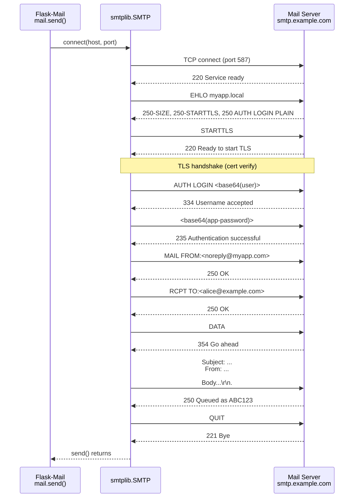
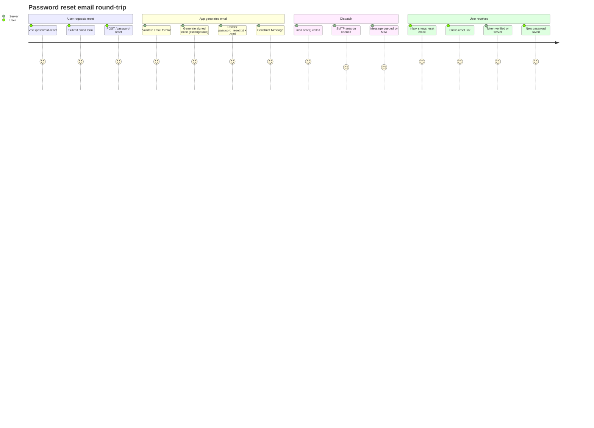
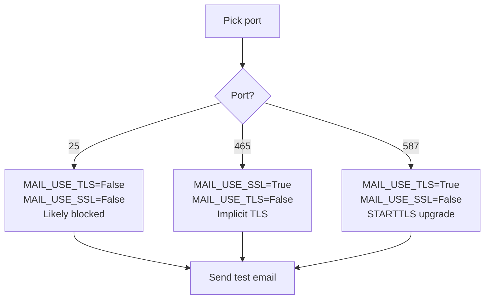

# Flask-Mail

#flask #mail #email #smtp #async #celery #utilities

> [!info] The SMTP integration extension for Flask
> Flask-Mail wraps Python's `smtplib` with a Flask-friendly configuration layer, connection pooling, and a `Message` class that makes plain-text, HTML, attachment, and bulk email straightforward. It is the original Pallets-ecosystem answer to "how do I send email from a Flask app?" and is still perfectly serviceable for low- to mid-volume transactional email, password resets, and admin notifications.
>
> For high-throughput or marketing email you'll usually front Flask-Mail with a transactional API provider — SendGrid, Mailgun, AWS SES, Postmark — which is just a different `MAIL_SERVER` away.

Think of Flask-Mail as the **post office branch inside your app**: you address a letter (`Message`), hand it to the clerk (`mail.send`), and the clerk figures out how to talk SMTP to the upstream mail server. The extension opens and pools connections, handles TLS/SSL negotiation, and even batches many letters into a single trip when you use `send_mass_mail`.

---

## 1. Overview & Metaphor

### What problem does email-in-app solve?

Web apps send email for two distinct reasons:

1. **Transactional email** — driven by user actions: welcome emails, password resets, receipts, two-factor codes, "your export is ready" notifications. These must be fast, reliable, and templated.
2. **Bulk/marketing email** — newsletters, drip campaigns, announcements. These are higher-volume, less latency-sensitive, and usually better handled by a dedicated ESP (Email Service Provider).

Flask-Mail targets the **transactional** case. The transactional email flow is:

1. An event happens in your app (user signs up, password reset requested).
2. You render the email body from a Jinja2 template.
3. You construct a `Message` with subject, sender, recipients, and body.
4. You call `mail.send(msg)` — which opens (or reuses) an SMTP connection and transmits the message.
5. The receiving MTA (Mail Transfer Agent — Gmail, SendGrid, Postfix, etc.) routes it to the recipient's inbox.

The tricky bits — connection management, TLS handshake, attachment encoding, batching — are what Flask-Mail handles for you.

> [!tip] The metaphor
> Flask-Mail is the **mailroom in your office building**. You (the route handler) write a memo (`Message`), put it in the outbox (`mail.send`). The mailroom clerk opens the loading-dock door to the post office (SMTP connection), hands over your memo, and either closes the door or keeps it propped open for the next memo (connection pooling). The clerk never waits around if the post office is slow — you have the option of dropping the memo in a queue and walking away (`send_async_email` with a thread, or a [[Celery]] task).

### SMTP in 60 seconds

**SMTP** (Simple Mail Transfer Protocol, RFC 5321) is the protocol MTAs use to exchange mail. A typical TLS-protected SMTP session:

```
Client → Server: EHLO client.example.com
Server → Client: 250-mail.example.com at your service
Server → Client: 250-SIZE 35882577
Server → Client: 250-STARTTLS
Server → Client: 250 AUTH LOGIN PLAIN
Client → Server: STARTTLS
Server → Client: 220 Ready to start TLS
…TLS handshake…
Client → Server: AUTH LOGIN <base64(username)>
Client → Server: <base64(password)>
Server → Client: 235 Authenticated
Client → Server: MAIL FROM:<sender@example.com>
Server → Client: 250 OK
Client → Server: RCPT TO:<recipient@example.com>
Server → Client: 250 OK
Client → Server: DATA
Server → Client: 354 Go ahead
Client → Server: …MIME message body…
Client → Server: .
Server → Client: 250 Queued as ABC123
Client → Server: QUIT
```

Every step is a place things can break: wrong port (25 vs 465 vs 587), TLS not negotiated, credentials rejected, recipient address malformed, message too large. Flask-Mail hides the dialogue but surfaces the same `SMTPException` subclasses (`SMTPAuthenticationError`, `SMTPServerDisconnected`, `SMTPRecipientsRefused`), so you still need to know the failure modes.

#### SMTP Session Sequence



| Port | Purpose | Encryption | When to use |
|---|---|---|---|
| **25** | MTA-to-MTA relay | Plain / opportunistic STARTTLS | Almost never from an app — blocked by most ISPs and cloud providers |
| **465** | SMTPS — implicit TLS | SSL/TLS from connection start | Legacy; supported by Gmail, Yahoo, etc. |
| **587** | Submission — STARTTLS upgrade | Plain → STARTTLS → TLS | **Recommended for app email** |
| **2525** | Alt submission | Plain or STARTTLS | Common with Mailgun, SparkPost |

---

## 2. Installation

```bash
(venv) $ pip install Flask-Mail
```

Versions used in this note:

- Flask-Mail **0.10.0** (last release; the project is in maintenance mode — see §11)
- Flask **3.0.x**

> [!warning] `Flask-Mail` vs `Flask-Mailman`
> The actively maintained successor is **`Flask-Mailman`** — a re-implementation that ports Django's mail API to Flask and supports modern Python/async patterns. If you're starting a new project, prefer Flask-Mailman or the underlying `aiosmtplib`. This note covers classic Flask-Mail because it is still the most-deployed option; the configuration concepts map cleanly onto Flask-Mailman.

---

## 3. Configuration

Flask-Mail reads its settings from the Flask app's `config` object. Every key starts with `MAIL_`.

| Config key | Default | Description |
|---|---|---|
| `MAIL_SERVER` | `localhost` | SMTP server hostname or IP |
| `MAIL_PORT` | `25` | SMTP port (465/587 typical) |
| `MAIL_USE_TLS` | `False` | Upgrade the connection with `STARTTLS` after connect (port 587) |
| `MAIL_USE_SSL` | `False` | Use implicit TLS from connection start (port 465) |
| `MAIL_USERNAME` | `None` | SMTP auth username (often the full email address) |
| `MAIL_PASSWORD` | `None` | SMTP auth password (use an app password for Gmail!) |
| `MAIL_DEFAULT_SENDER` | `None` | Tuple `(name, email)` or string — used if `Message(sender=...)` is omitted |
| `MAIL_MAX_EMAILS` | `None` | Reconnect after this many messages on a pooled connection |
| `MAIL_SUPPRESS_SEND` | `False` | When `True`, `send()` no-ops — perfect for testing |
| `MAIL_ASCII_ATTACHMENTS` | `False` | Force ASCII filenames in `Content-Disposition` headers |
| `MAIL_DEBUG` | `app.debug` | Pass `debug=…` to `smtplib.SMTP` |
| `MAIL_BACKEND` | `smtp` | Flask-Mailman-only — selects `smtp`/`console`/`locmem`/`dummy` |
| `MAIL_SUPPRESS_SEND` | `False` | The testing escape hatch — see §6 |

A canonical development config (using Gmail with an app password):

```python
# config.py
class DevelopmentConfig:
    MAIL_SERVER = "smtp.gmail.com"
    MAIL_PORT = 587
    MAIL_USE_TLS = True
    MAIL_USE_SSL = False
    MAIL_USERNAME = "you@gmail.com"
    MAIL_PASSWORD = "abcd-efgh-ijkl-mnop"   # App password, NOT your Gmail password
    MAIL_DEFAULT_SENDER = ("My App", "you@gmail.com")
    MAIL_SUPPRESS_SEND = False
```

> [!danger] Gmail: you must use an App Password
> As of 2022, Gmail rejects plain password SMTP auth on accounts with 2FA enabled (which should be all of them). You must generate an **App Password** at <https://myaccount.google.com/apppasswords> and use that 16-character string in `MAIL_PASSWORD`. Anything else produces `SMTPAuthenticationError: 535 Authentication failed`.

### Initialising the extension

```python
# extensions.py
from flask import Flask
from flask_mail import Mail

mail = Mail()

def init_app(app: Flask) -> None:
    mail.init_app(app)
```

```python
# app.py
from flask import Flask
from config import DevelopmentConfig
from extensions import init_app

def create_app() -> Flask:
    app = Flask(__name__)
    app.config.from_object(DevelopmentConfig)
    init_app(app)
    return app

app = create_app()
```

> [!tip] Application-factory pattern
> Always use `init_app(app)` rather than `Mail(app)` in the factory. This keeps the extension importable without an app context (useful in tests and [[Celery]] workers — see §6).

---

## 4. Basic usage

### The `Mail` class

`Mail` is the extension instance. You rarely call methods on it directly except `send()`:

```python
from flask_mail import Mail, Message

mail = Mail()  # initialised with init_app elsewhere

mail.send(Message(
    subject="Hello",
    recipients=["user@example.com"],
    body="Welcome aboard!",
))
```

### The `Message` class

`Message` is the value object that describes a single email. Constructor highlights:

```python
Message(
    subject="Welcome to My App",
    recipients=["alice@example.com"],          # list[str]
    cc=["bob@example.com"],                    # optional
    bcc=["audit@example.com"],                 # optional
    sender=("My App", "noreply@myapp.com"),    # (name, email) or "Name <email>"
    reply_to="support@myapp.com",
    body="Plain-text body",
    html="<h1>HTML body</h1>",                 # optional; if both, multi-part
    attachments=[Attachment("report.pdf", "application/pdf", data)],
    charset="utf-8",
)
```

| `Message` attribute | Type | Notes |
|---|---|---|
| `subject` | `str` | Email subject |
| `recipients` | `list[str]` | `To:` addresses |
| `cc`, `bcc` | `list[str]` | Carbon copies |
| `sender` | `tuple` or `str` | Falls back to `MAIL_DEFAULT_SENDER` |
| `reply_to` | `str` | `Reply-To:` header |
| `body` | `str` | Plain-text body |
| `html` | `str` | HTML body — set both for multipart/alternative |
| `attachments` | `list[Attachment]` | See §5 |
| `charset` | `str` | Defaults to `utf-8` |
| `extra_headers` | `dict` | Arbitrary extra headers (e.g. `X-Mailgun-Tag`) |
| `date` | `datetime` | Sent-time; defaults to `utcnow` |
| `charset` | `str` | Body encoding |

### Sending your first email

```python
# routes.py
from flask import Blueprint, request, jsonify
from flask_mail import Message
from extensions import mail

bp = Blueprint("contact", __name__)

@bp.post("/contact")
def contact():
    data = request.get_json()
    msg = Message(
        subject=f"[Contact] {data['subject']}",
        recipients=["support@myapp.com"],
        reply_to=data["email"],          # replies go straight to the user
        body=data["message"],
    )
    mail.send(msg)
    return jsonify(ok=True)
```

### `send()` vs `send_mass_mail`

- **`mail.send(msg)`** — sends a single `Message`. If `msg.recipients` is a list of N addresses, this opens one SMTP session and issues `RCPT TO:` N times — every recipient sees the others in the headers (or BCC if hidden).
- **`mail.send_message(**kwargs)`** — shortcut constructor + `send()` in one call.
- **Bulk / mass mail** — see §6. Flask-Mail doesn't expose a Django-style `send_mass_mail`, but you can build one with `mail.connect()`:

```python
from flask_mail import Message
from extensions import mail

def send_mass(messages: list[Message]) -> None:
    with mail.connect() as conn:
        for msg in messages:
            conn.send(msg)
```

`mail.connect()` returns a context manager that holds a single SMTP connection open across many `send()` calls — much faster than reconnecting per message.

---

## 5. Intermediate patterns

### HTML emails

Set both `body` and `html` to produce a `multipart/alternative` message — mail clients pick whichever they prefer:

```python
msg = Message(
    subject="Your receipt",
    recipients=["alice@example.com"],
    body="Thanks for your purchase! Order #12345 — $49.00.",
    html="""\
<h1>Thanks for your purchase!</h1>
<p>Order <strong>#12345</strong> — <strong>$49.00</strong>.</p>
<p><a href="https://myapp.com/orders/12345">View your order →</a></p>
""",
)
mail.send(msg)
```

> [!note] Email HTML is *not* web HTML
> Most mail clients (Outlook, Gmail) strip `<style>`, `<script>`, `<form>`, `<video>`, and many CSS properties. Use **inline styles**, **tables for layout**, and **absolute image URLs**. Tools like [MJML](https://mjml.io) or [Premailer](https://premailer.dialect.ca) compile modern HTML into email-safe HTML.

### Attachments

```python
from flask_mail import Attachment, Message

with open("monthly_report.pdf", "rb") as f:
    pdf_data = f.read()

msg = Message(
    subject="Your monthly report",
    recipients=["alice@example.com"],
    body="See attached.",
)
msg.attach(
    filename="monthly_report.pdf",
    content_type="application/pdf",
    data=pdf_data,
)
mail.send(msg)
```

`msg.attach(...)` is the convenience wrapper around the `Attachment` class. Set `MAIL_ASCII_ATTACHMENTS=True` if you see garbled filenames in Outlook when sending files with Unicode names.

### Inline images (CID references)

To embed an image so it renders without "Click here to download images":

```python
from flask_mail import Message

msg = Message(
    subject="New product launch",
    recipients=["alice@example.com"],
    html='<p>Check out our new logo:</p>',
)
with open("logo.png", "rb") as f:
    msg.attach(
        filename="logo.png",
        content_type="image/png",
        data=f.read(),
        # The 'inline' disposition is set via the headers keyword:
    )
# Add the Content-ID header to the last attachment:
msg.attachments[-1].add_header("Content-ID", "<logo>")
mail.send(msg)
```

### Templated emails with Jinja2

Email bodies are templates too. Render them with `render_template()`:

#### Password-Reset Email Journey



```
templates/
├── emails/
│   ├── welcome.txt
│   ├── welcome.html
│   ├── password_reset.txt
│   └── password_reset.html
```

```python
# emails/welcome.txt
Welcome to {{ app_name }}, {{ user.name }}!

Please confirm your email by visiting:
{{ url_for('auth.confirm_email', token=token, _external=True) }}
```

```python
# emails/welcome.html
<!doctype html>
<html>
  <body style="font-family: sans-serif;">
    <h1>Welcome to {{ app_name }}, {{ user.name }}! 🎉</h1>
    <p>Please confirm your email:</p>
    <p>
      <a href="{{ url_for('auth.confirm_email', token=token, _external=True) }}"
         style="background:#4f46e5;color:white;padding:10px 20px;">
        Confirm my email
      </a>
    </p>
  </body>
</html>
```

```python
# services/mailer.py
from flask import render_template
from flask_mail import Message
from extensions import mail

def send_welcome_email(user, token):
    msg = Message(
        subject=f"Welcome to My App, {user.name}",
        recipients=[user.email],
        body=render_template("emails/welcome.txt", user=user, token=token),
        html=render_template("emails/welcome.html", user=user, token=token),
    )
    mail.send(msg)
```

### Bulk / batch sending with one connection

#### Bulk Send Queue Timeline

```mermaid
gantt
    title Sending 1000 welcome emails (single connection vs per-message)
    dateFormat X
    axisFormat %s sec
    section Per-message connect
    Message 1 (connect+send+close) : 0, 2
    Message 2 (connect+send+close) : 2, 4
    Message 3 (connect+send+close) : 4, 6
    Ellipsis (~1000 × 2s)          :crit, 6, 2000
    section mail.connect() pooled
    Open one connection           :a1, 0, 1
    Send msg 1                    :a2, after a1, 1
    Send msg 2                    :a3, after a2, 1
    Send msg 3                    :a4, after a3, 1
    Send msg N (~1000 × 1s)       :a5, after a4, 1000
    Close connection              :a6, after a5, 1
```



```python
def send_newsletter(subscribers: list[User], subject: str, body: str) -> int:
    sent = 0
    with mail.connect() as conn:
        for sub in subscribers:
            msg = Message(
                subject=subject,
                recipients=[sub.email],
                body=body,
                # Per-recipient personalisation:
                sender=("My App", f"noreply@myapp.com"),
            )
            try:
                conn.send(msg)
                sent += 1
            except Exception as exc:
                app.logger.warning("Failed to send to %s: %s", sub.email, exc)
    return sent
```

> [!tip] Use `MAIL_MAX_EMAILS` to rotate connections
> Some providers (notably Gmail) cap messages per SMTP session. Set `MAIL_MAX_EMAILS=100` to make Flask-Mail reconnect after every 100 sends.

---

## 6. Advanced usage

### Async email with threads

SMTP calls are synchronous and slow (often 200–2000 ms each). Sending email in the request thread makes your endpoint sluggish and ties up a worker. The classic Flask pattern pushes `mail.send` onto a background thread:

```python
# services/mailer.py
import threading
from flask import current_app, render_template
from flask_mail import Message
from extensions import mail

def _send_async_email(app, msg):
    # Threads don't inherit the app context — push one manually.
    with app.app_context():
        mail.send(msg)

def send_async_email(recipients, subject, template, **ctx):
    msg = Message(
        subject=subject,
        recipients=recipients,
        body=render_template(f"emails/{template}.txt", **ctx),
        html=render_template(f"emails/{template}.html", **ctx),
    )
    # Capture the real app object, not the proxy.
    app = current_app._get_current_object()
    threading.Thread(target=_send_async_email, args=(app, msg)).start()
```

> [!warning] Threads die if the process dies
> If you `kill -9` your Gunicorn worker mid-request, the thread dies with it and the email is never sent. For durable delivery use [[Celery]] (next pattern) or a queue (RQ, Dramatiq, Huey).

### Email with Celery

```python
# tasks/email.py
from celery import shared_task
from flask import render_template
from flask_mail import Message
from extensions import mail

@shared_task(bind=True, max_retries=5, default_retry_delay=60)
def send_email_task(self, recipients, subject, template, ctx):
    try:
        msg = Message(
            subject=subject,
            recipients=recipients,
            body=render_template(f"emails/{template}.txt", **ctx),
            html=render_template(f"emails/{template}.html", **ctx),
        )
        mail.send(msg)
    except Exception as exc:
        # Retry on transient failures; surfaces as a failed task otherwise.
        raise self.retry(exc=exc)
```

```python
# routes.py
from tasks.email import send_email_task

@bp.post("/subscribe")
def subscribe():
    user = create_user(...)
    send_email_task.delay([user.email], "Welcome to My App", "welcome",
                          {"user": user.to_dict(), "token": token})
    return jsonify(ok=True)
```

The Celery worker must run inside an app context:

```python
# celery_app.py
from celery import Celery
from app import create_app

celery = Celery("myapp")
celery.conf.update(broker_url="redis://localhost:6379/0")

app = create_app()

@celery.task
def send_email_task(*args, **kwargs):
    with app.app_context():
        # ... call send_email_task body
        pass
```

See [[Celery]] for the full integration recipe.

### Testing emails

Two complementary approaches:

**1. `MAIL_SUPPRESS_SEND=True`** — `mail.send()` becomes a no-op, but you can still inspect what *would* have been sent:

```python
# config/testing.py
class TestingConfig:
    TESTING = True
    MAIL_SUPPRESS_SEND = True
    MAIL_DEFAULT_SENDER = "test@myapp.com"
```

```python
# tests/test_contact.py
def test_contact_form_sends_email(client):
    with mail.record_messages() as outbox:
        client.post("/contact", json={
            "email": "alice@example.com",
            "subject": "Hello",
            "message": "Help",
        })
    assert len(outbox) == 1
    assert outbox[0].subject == "[Contact] Hello"
    assert "alice@example.com" in outbox[0].reply_to
```

`mail.record_messages()` is a context manager that captures every `Message` passed to `send()` while `MAIL_SUPPRESS_SEND` is active.

**2. Use a local SMTP debugging server** — Python ships with one:

```bash
(venv) $ python -m smtpd -c DebuggingServer -n localhost:8025 &
```

```python
# config/dev_local.py
MAIL_SERVER = "localhost"
MAIL_PORT = 8025
MAIL_USE_TLS = False
MAIL_SUPPRESS_SEND = False
```

Every email gets dumped to the server's stdout — perfect for interactive development.

For full end-to-end testing of deliverability, use a service like **Mailtrap** or **MailHog** which runs a fake SMTP server with a web UI.

### Custom `MAIL_DEFAULT_SENDER` per blueprint

```python
# extensions/mail.py
from contextvars import ContextVar

_current_sender = ContextVar("current_sender", default=None)

def set_default_sender(sender):
    return _current_sender.set(sender)

def get_default_sender():
    return _current_sender.get()
```

Then patch your `Message` construction to prefer the context var. This is useful when you have many sub-brands sharing one app.

### Custom email backends (Flask-Mailman)

Flask-Mailman supports pluggable backends — `locmem` for tests, `console` for dev, `smtp` for prod:

```python
MAIL_BACKEND = "locmem"   # in-memory, captured in `mail.outbox`
```

The same concept doesn't exist in classic Flask-Mail; you simulate it with `MAIL_SUPPRESS_SEND` plus `record_messages`.

---

## 7. Common pitfalls & troubleshooting

| Symptom | Likely cause | Fix |
|---|---|---|
| `SMTPAuthenticationError: 535` | Gmail with 2FA + plain password | Generate an **App Password**; use it in `MAIL_PASSWORD` |
| `SMTPServerDisconnected: Connection unexpectedly closed` | Wrong port/encryption combo | 587 → `MAIL_USE_TLS=True`; 465 → `MAIL_USE_SSL=True`; never both |
| `SSL: WRONG_VERSION_NUMBER` | Connecting plain to a TLS-only port | Set `MAIL_USE_SSL=True` on port 465 |
| `STARTTLS upgrade failed` | Server requires TLS but `MAIL_USE_TLS=False` | Flip the flag |
| Email hangs for 30+ seconds | SMTP server unreachable from inside Docker | Check egress rules; DNS inside container; firewall |
| Attachments arrive as `noname` | Missing `content_type` in `msg.attach()` | Always pass `content_type="application/pdf"` etc. |
| Inline image shows as attachment | Missing `Content-ID` header | `msg.attachments[-1].add_header("Content-ID", "<logo>")` and reference `cid:logo` in HTML |
| Subject line garbled | Non-ASCII subject without charset | Flask-Mail handles this; if you bypass with raw headers, encode with `email.utils.make_msgid` / `Header` |
| Working in shell, fails in route | No app context | Wrap shell calls in `with app.app_context(): mail.send(msg)` |
| Email sent twice | Both a thread and a Celery task firing | Pick one async strategy; don't stack them |
| `MAIL_DEFAULT_SENDER` ignored | Set after `init_app` | Set config *before* `mail.init_app(app)` |

### TLS vs SSL confusion



### Working outside a request

The `Mail` extension requires an app context (it reads config). In a script or REPL:

```python
from app import create_app
from extensions import mail
from flask_mail import Message

app = create_app()
with app.app_context():
    mail.send(Message("Test", recipients=["me@example.com"], body="Hi"))
```

---

## 8. Best practices

1. **Never block the request on SMTP.** Always offload to a thread or [[Celery]] task — SMTP round-trips of 1–3 seconds will kill p99 latency.
2. **Use app passwords, not user passwords.** Every major provider (Gmail, Outlook, Yahoo) now requires OAuth or app passwords for SMTP.
3. **Send transactional email from a dedicated subdomain** like `mail.myapp.com` (SPF/DKIM/DMARC) — not `myapp.com`. Protect your primary domain's reputation.
4. **Set SPF, DKIM, and DMARC DNS records.** Without them, your mail lands in spam. Your ESP provides the records.
5. **Prefer HTML+text multipart** — accessibility, spam filters, and plain-text clients all want the text part.
6. **Always set `Reply-To`** to a real monitored address if `sender` is a `noreply@` address.
7. **Don't construct emails by string concatenation.** Use Jinja2 templates; you'll thank yourself when the marketing team wants an emoji added.
8. **Don't send user-supplied HTML without sanitisation.** It's a vector for stored XSS in mail clients.
9. **BCC bulk recipients** — or send individually. Never expose your subscriber list to all recipients.
10. **Log every send** with subject, recipient, and message-id — invaluable for debugging "I didn't get the email".
11. **Handle bounces and complaints** — webhook your ESP's bounce/complaint/spam events and unsubscribe the user.
12. **Test in Mailtrap/MailHog** before deploying — never use your real Gmail quota for staging.

---

## 9. Integration with other extensions

### [[Flask-Login]] — password reset

The canonical Flask-Mail integration: a user forgets their password, you email them a timed token.

```python
# services/tokens.py
from itsdangerous import URLSafeTimedSerializer
from flask import current_app

def generate_reset_token(email: str) -> str:
    s = URLSafeTimedSerializer(current_app.config["SECRET_KEY"])
    return s.dumps(email, salt="password-reset")

def verify_reset_token(token: str, max_age=3600) -> str | None:
    s = URLSafeTimedSerializer(current_app.config["SECRET_KEY"])
    try:
        return s.loads(token, salt="password-reset", max_age=max_age)
    except Exception:
        return None
```

```python
# routes/auth.py
from flask import Blueprint, request, jsonify, url_for
from flask_mail import Message
from extensions import mail
from services.tokens import generate_reset_token, verify_reset_token
from models import User
from extensions import db

bp = Blueprint("auth", __name__)

@bp.post("/auth/forgot")
def forgot_password():
    email = request.json["email"]
    user = User.query.filter_by(email=email).first()
    if user:
        token = generate_reset_token(user.email)
        msg = Message(
            subject="Reset your My App password",
            recipients=[user.email],
            body=render_template("emails/password_reset.txt",
                                 user=user,
                                 reset_url=url_for("auth.reset_password",
                                                   token=token, _external=True)),
        )
        # Async — never block the request:
        send_async_email([user.email], msg.subject, "password_reset",
                         {"user": user, "reset_url": url_for("auth.reset_password",
                                                             token=token, _external=True)})
    # Always return 200 to avoid leaking which emails are registered:
    return jsonify(ok=True)

@bp.post("/auth/reset")
def reset_password():
    token = request.json["token"]
    new_password = request.json["password"]
    email = verify_reset_token(token)
    if not email:
        return jsonify(error="Invalid or expired token"), 400
    user = User.query.filter_by(email=email).one()
    user.set_password(new_password)
    db.session.commit()
    return jsonify(ok=True)
```

> [!danger] Always return 200 from `/forgot`
> If you return 404 for unregistered emails, attackers can enumerate your user base. Always return the same response, and only send an email if the account exists.

### [[Flask-WTF]] — contact form

```python
from flask_wtf import FlaskForm
from wtforms import StringField, TextAreaField
from wtforms.validators import DataRequired, Email, Length

class ContactForm(FlaskForm):
    name = StringField("Your name", validators=[DataRequired(), Length(max=80)])
    email = StringField("Email", validators=[DataRequired(), Email()])
    message = TextAreaField("Message", validators=[DataRequired(), Length(min=10, max=2000)])

@bp.route("/contact", methods=["GET", "POST"])
def contact():
    form = ContactForm()
    if form.validate_on_submit():
        msg = Message(
            subject=f"[Contact] from {form.name.data}",
            recipients=["support@myapp.com"],
            reply_to=form.email.data,
            body=form.message.data,
        )
        mail.send(msg)
        flash("Thanks — we'll be in touch within 24 hours.")
        return redirect(url_for("contact.contact"))
    return render_template("contact.html", form=form)
```

### [[Celery]]

See §6 — the standard pattern for durable email delivery.

### [[Flask-Caching]]

Cache rendered email templates if they're expensive (e.g. involve a complex query). Don't cache the `Message` itself — you'll leak recipients across users.

---

## 10. Real-world example — full password-reset flow

A complete, runnable single-file Flask app demonstrating registration, login, password reset request, password reset confirmation, all with async email sending.

```python
# app.py — single-file demo
import os
import threading
from flask import (Flask, request, jsonify, url_for, redirect,
                   render_template_string, flash)
from flask_mail import Mail, Message
from flask_sqlalchemy import SQLAlchemy
from werkzeug.security import generate_password_hash, check_password_hash
from itsdangerous import URLSafeTimedSerializer

app = Flask(__name__)
app.config.update(
    SECRET_KEY="dev-secret-change-me",
    SQLALCHEMY_DATABASE_URI="sqlite:///app.db",
    SQLALCHEMY_TRACK_MODIFICATIONS=False,
    MAIL_SERVER="smtp.gmail.com",
    MAIL_PORT=587,
    MAIL_USE_TLS=True,
    MAIL_USERNAME=os.environ.get("MAIL_USERNAME", "you@gmail.com"),
    MAIL_PASSWORD=os.environ.get("MAIL_PASSWORD", ""),
    MAIL_DEFAULT_SENDER=("My App", "noreply@myapp.com"),
)
db = SQLAlchemy(app)
mail = Mail(app)

# ---------- Models ----------
class User(db.Model):
    id = db.Column(db.Integer, primary_key=True)
    email = db.Column(db.String(255), unique=True, nullable=False)
    name = db.Column(db.String(80), nullable=False)
    password_hash = db.Column(db.String(255), nullable=False)

    def set_password(self, pw): self.password_hash = generate_password_hash(pw)
    def check_password(self, pw): return check_password_hash(self.password_hash, pw)

# ---------- Tokens ----------
def ts(): return URLSafeTimedSerializer(app.config["SECRET_KEY"])

def make_reset_token(email): return ts().dumps(email, salt="pw-reset")
def read_reset_token(token, max_age=3600):
    try: return ts().loads(token, salt="pw-reset", max_age=max_age)
    except Exception: return None

# ---------- Async email ----------
def send_async(msg):
    def _send(app, msg):
        with app.app_context():
            mail.send(msg)
    t = threading.Thread(target=_send, args=(app, msg))
    t.start()

# ---------- Routes ----------
@app.post("/api/register")
def register():
    d = request.json
    if User.query.filter_by(email=d["email"]).first():
        return jsonify(error="Email already registered"), 400
    u = User(email=d["email"], name=d["name"])
    u.set_password(d["password"])
    db.session.add(u); db.session.commit()
    msg = Message("Welcome to My App",
                  recipients=[u.email],
                  body=f"Hi {u.name},\n\nThanks for signing up!")
    send_async(msg)
    return jsonify(ok=True)

@app.post("/api/forgot")
def forgot():
    d = request.json
    u = User.query.filter_by(email=d["email"]).first()
    if u:
        token = make_reset_token(u.email)
        reset_url = url_for("reset", token=token, _external=True)
        msg = Message("Reset your password",
                      recipients=[u.email],
                      body=f"Reset link: {reset_url}\nExpires in 1 hour.")
        send_async(msg)
    return jsonify(ok=True)

@app.post("/api/reset")
def reset():
    d = request.json
    email = read_reset_token(d["token"])
    if not email:
        return jsonify(error="Invalid or expired token"), 400
    u = User.query.filter_by(email=email).first()
    if not u:
        return jsonify(error="User not found"), 404
    u.set_password(d["password"])
    db.session.commit()
    msg = Message("Your password was reset",
                  recipients=[u.email],
                  body=f"Hi {u.name},\n\nYour password was just reset. "
                       "If this wasn't you, please contact support immediately.")
    send_async(msg)
    return jsonify(ok=True)

if __name__ == "__main__":
    with app.app_context():
        db.create_all()
    app.run(debug=True)
```

### Production ESP integrations

All four major ESPs expose an SMTP endpoint — point Flask-Mail at it:

| Provider | `MAIL_SERVER` | `MAIL_PORT` | TLS | Notes |
|---|---|---|---|---|
| **SendGrid** | `smtp.sendgrid.net` | 587 | Yes | Username `apikey`, password = your API key |
| **Mailgun** | `smtp.mailgun.org` | 587 | Yes | Username = `postmaster@your-domain`, password from dashboard |
| **AWS SES** | `email-smtp.<region>.amazonaws.com` | 587 | Yes | Username/password are SES SMTP credentials (not AWS keys) |
| **Postmark** | `smtp.postmarkapp.com` | 587 | Yes | Username = server API token |
| **Brevo** | `smtp-relay.brevo.com` | 587 | Yes | Username = your Brevo login email |

```python
# config/production.py
class ProductionConfig:
    MAIL_SERVER = "smtp.sendgrid.net"
    MAIL_PORT = 587
    MAIL_USE_TLS = True
    MAIL_USERNAME = "apikey"
    MAIL_PASSWORD = os.environ["SENDGRID_API_KEY"]
    MAIL_DEFAULT_SENDER = ("My App", "mail@myapp.com")
```

> [!tip] For high volume, call the ESP's HTTP API instead
> SMTP adds 200–500 ms of protocol overhead per send. SendGrid/Mailgun/SES all expose a REST API that's faster and gives you delivery webhooks. Wrap their Python SDK in a `send_email()` service so the rest of your code is provider-agnostic.

---

## 11. References

- **Flask-Mail docs** — <https://pythonhosted.org/Flask-Mail/>
- **Flask-Mailman** (modern successor) — <https://github.com/waynerv/flask-mailman>
- **RFC 5321** — Simple Mail Transfer Protocol — <https://www.rfc-editor.org/rfc/rfc5321>
- **RFC 5322** — Internet Message Format — <https://www.rfc-editor.org/rfc/rfc5322>
- **RFC 2045–2049** — MIME — <https://www.rfc-editor.org/rfc/rfc2045>
- **RFC 8689** — SMTP MTA Strict Transport Security (MTA-STS) — <https://www.rfc-editor.org/rfc/rfc8689>
- **MJML** — responsive email HTML compiler — <https://mjml.io>
- **Mailtrap** — fake SMTP for dev/test — <https://mailtrap.io>
- **MailHog** — self-hosted fake SMTP — <https://github.com/mailhog/MailHog>
- Related notes: [[Flask-Login]] · [[Flask-WTF]] · [[Celery]] · [[Flask-Caching]] · [[Security-Best-Practices]] · [[Flask-Limiter]]
