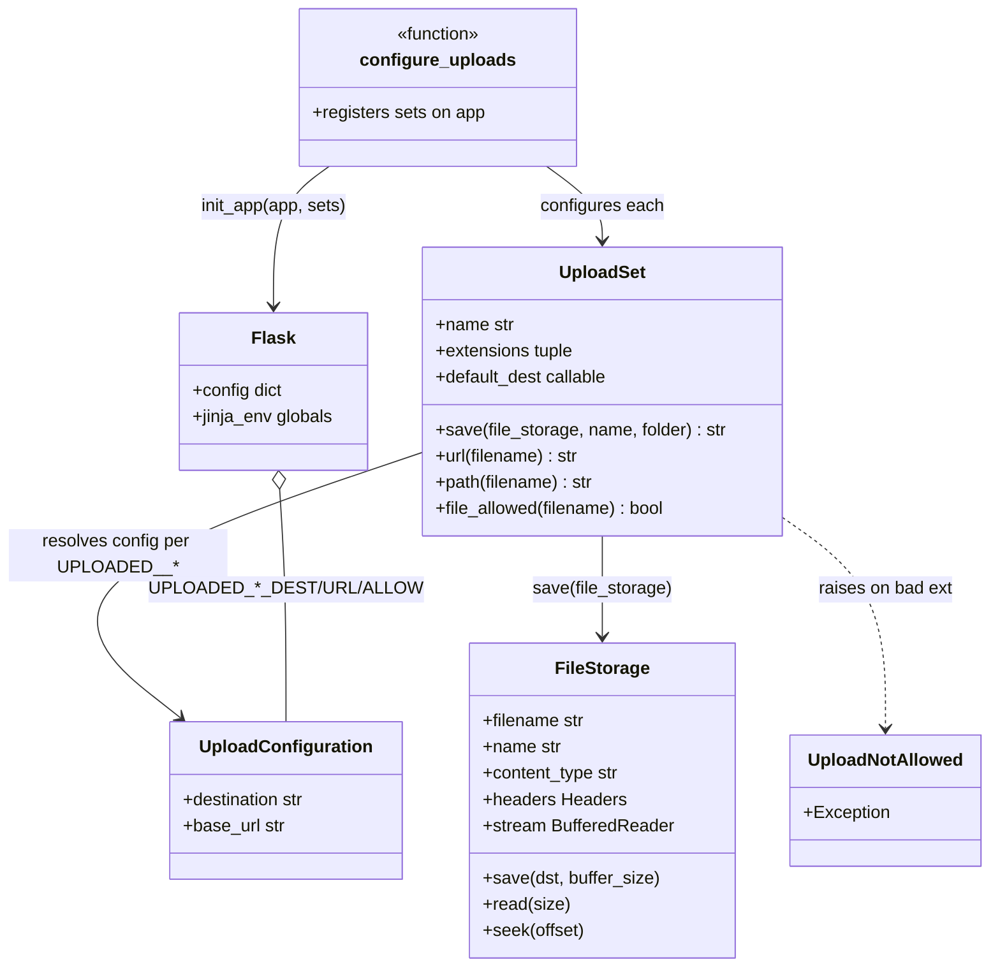
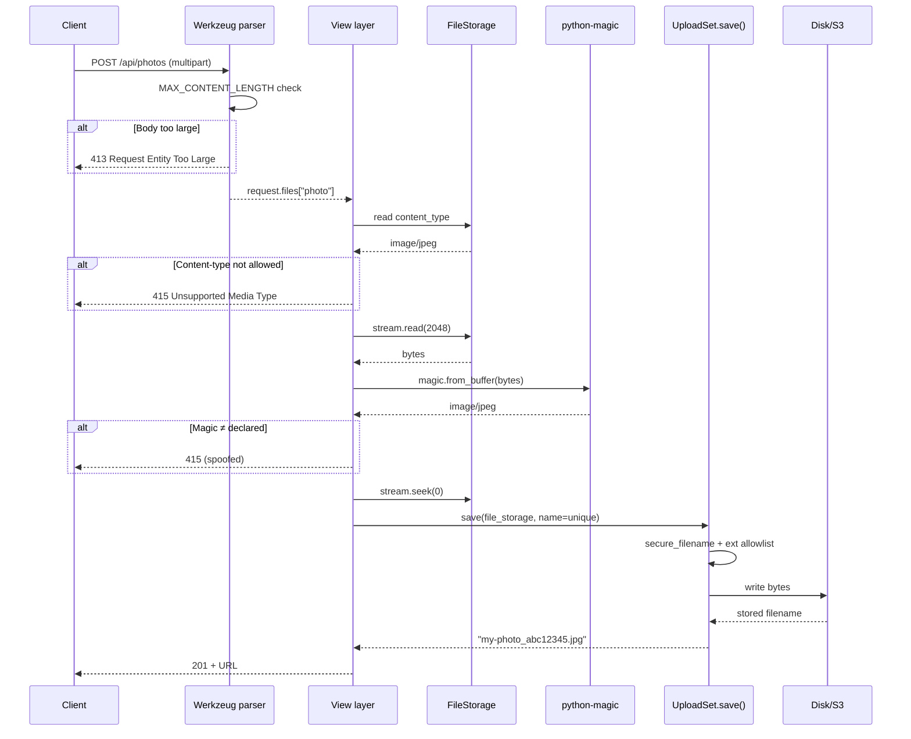
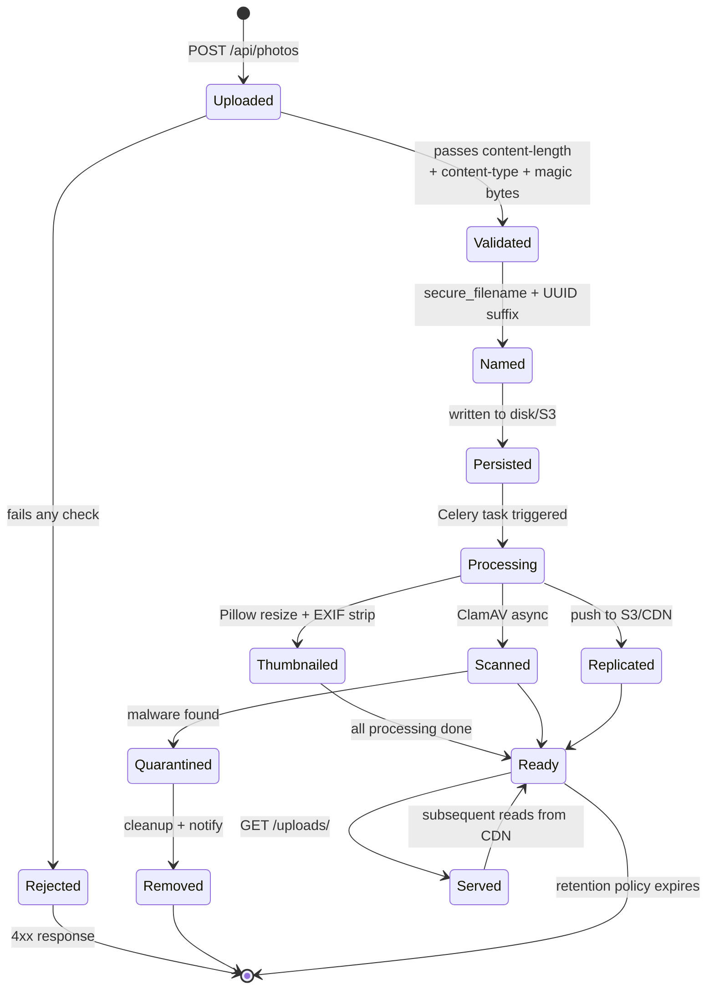
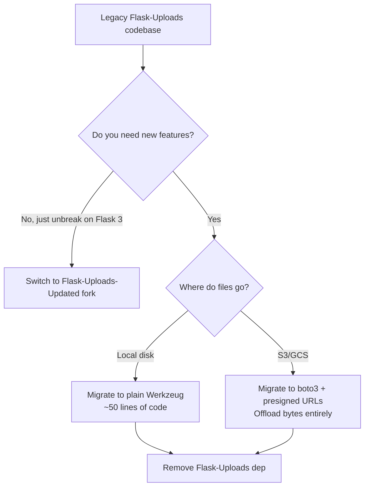

# Flask-Uploads

#flask #uploads #files #storage #deprecated #utilities

> [!warning] This project is unmaintained
> Flask-Uploads has had no release since 2017 and does not officially support Flask 2.x/3.x or Python 3.10+. Use it only if you're maintaining a legacy codebase. **For new projects, use one of the alternatives in §11** — the most common choice is to handle `werkzeug.datastructures.FileStorage` directly (it's not much code), or reach for **Flask-Dropzone** for drag-and-drop UIs, **Flask-Rebar** for declarative file-handling, or a dedicated object-storage SDK (boto3 for S3, google-cloud-storage for GCS).
>
> This note documents Flask-Uploads for the legions of legacy codebases still using it, and shows the migration path off it.

> [!info] What Flask-Uploads was
> Flask-Uploads wrapped Werkzeug's `FileStorage` with an `UploadSet` abstraction: a named collection of allowed extensions, a destination directory, and a `save()` method that handled secure filenames, uniqueness, and URL construction. With one config block you could declare `photos`, `documents`, `avatars` and have a uniform API for all of them.
>
> The concepts are sound; the codebase is just stale. Everything it does can be reproduced in ~50 lines of modern Flask + Werkzeug.

Think of Flask-Uploads as a **luggage drop at a museum**. You hand over your bag (the uploaded file); the clerk checks it's on the allowed-items list (`extensions`), slaps a unique tag on it (`secure_filename` + a UUID if needed), puts it on the right shelf (`UPLOAD_DEST`), and gives you a claim ticket (the URL). The clerk can also tell you the bag's size (`file.content_length`) and refuse oversized bags (`MAX_CONTENT_LENGTH`).

---

## 1. Overview & Metaphor

### What problem does file-upload management solve?

A file upload in HTTP is an RFC 7578 `multipart/form-data` request. Werkzeug parses the body and hands you a `FileStorage` object per file — a stream-like wrapper with a `filename`, `content_type`, `headers`, and `save()` method. That's the raw primitive.

A real upload pipeline needs to:

1. **Validate** the file — extension allowlist, MIME type, magic bytes, size.
2. **Secure** the filename — strip path traversal (`../../etc/passwd`), normalise Unicode, optionally UUID-rename.
3. **Persist** the bytes — to disk, to S3, to a CDN.
4. **Record** the upload in the database (filename, owner, content-type, size, checksum).
5. **Serve** the file back — public URL, signed URL, or authenticated streaming.
6. **Process** the file — virus scan, image resize, PDF thumbnail, OCR.

Flask-Uploads covered steps 1–3 plus a thin layer of 5. Steps 4 and 6 are left to your app code.

> [!tip] The metaphor
> Flask-Uploads is a **valet parking attendant**. You drive up (POST a file), the valet checks the car is on the allowed-makes list (`UploadSet.extensions`), assigns you a numbered spot (`secure_filename`), parks the car (`save()`), and gives you a ticket with the spot's URL (`url()`). When you want the car back, you follow the URL.

### Security threats

File uploads are a top-ten OWASP risk if mishandled:

- **Path traversal** — `../../../etc/passwd` as the filename.
- **Malicious extensions** — `image.jpg.php`, `image.php.png`.
- **Stored XSS** — an HTML file uploaded as `image.html` and served inline.
- **Server-side execution** — uploading a `.php`/`.jsp`/`.py` to a directory the webserver executes.
- **Disk exhaustion** — no size limit, attacker fills `/var`.
- **Malware** — `.exe`, `.scr`, macro-enabled Office docs.
- **EXIF-based de-anonymisation** — photos with GPS data.

**Mitigations**: extension allowlists, content-type validation, magic-byte sniffing (e.g. via `python-magic`), `MAX_CONTENT_LENGTH`, secure filenames, storing uploads outside the web root, serving with `Content-Disposition: attachment` and a non-executable content type.

---

## 2. Installation

> [!danger] Pin Flask-Uploads to a fork that works with modern Flask
> The original `Flask-Uploads` on PyPI is unmaintained and breaks on Flask 2+. The community forks `Flask-Uploads-Updated` or `flask-uploads3` work with Flask 3.0:
> ```bash
> (venv) $ pip install Flask-Uploads-Updated
> ```
> Import as `flask_uploads` — the module name is preserved for legacy compat.

```bash
(venv) $ pip install Flask-Uploads-Updated   # modern fork
# OR for a legacy codebase:
(venv) $ pip install Flask-Uploads==0.1.5    # last original release
```

Versions referenced in this note:

- Flask-Uploads-Updated **1.2.0**
- Flask **3.0.x**
- Pillow **10.x** (for the image example in §10)

---

## 3. Configuration

Flask-Uploads reads its config from `app.config`. The most important keys:

| Key | Default | Description |
|---|---|---|
| `UPLOADS_DEFAULT_DEST` | `None` | Base directory for all upload sets |
| `UPLOADS_DEFAULT_URL` | `None` | Base URL for serving uploads (e.g. `https://cdn.myapp.com/`) |
| `UPLOADED_<NAME>_DEST` | `None` | Per-UploadSet destination directory (overrides default) |
| `UPLOADED_<NAME>_URL` | `None` | Per-UploadSet base URL |
| `UPLOADED_<NAME>_ALLOW` | `None` | Allowlist of extensions for the set (e.g. `("png", "jpg")`) |
| `UPLOADED_<NAME>_DENY` | `None` | Denylist (rare; prefer allow) |
| `MAX_CONTENT_LENGTH` | `None` | Flask core — rejects requests with body > N bytes |

`<NAME>` is the upper-snake-cased name of the UploadSet. For a set called `photos`, the config keys are `UPLOADED_PHOTOS_DEST`, `UPLOADED_PHOTOS_URL`, `UPLOADED_PHOTOS_ALLOW`.

### Example config

```python
# config.py
import os

class ProductionConfig:
    UPLOADS_DEFAULT_DEST = "/var/www/myapp/uploads"
    UPLOADS_DEFAULT_URL  = "https://cdn.myapp.com/"
    UPLOADED_PHOTOS_DEST  = "/var/www/myapp/uploads/photos"
    UPLOADED_PHOTOS_URL   = "https://cdn.myapp.com/photos/"
    UPLOADED_PHOTOS_ALLOW = ("png", "jpg", "jpeg", "gif", "webp")
    UPLOADED_DOCUMENTS_DEST  = "/var/www/myapp/uploads/docs"
    UPLOADED_DOCUMENTS_URL   = "https://cdn.myapp.com/docs/"
    UPLOADED_DOCUMENTS_ALLOW = ("pdf", "docx", "txt", "csv")
    MAX_CONTENT_LENGTH = 16 * 1024 * 1024   # 16 MB total per request
```

### Initialising the extension

```python
# extensions.py
from flask import Flask
from flask_uploads import UploadSet, configure_uploads, IMAGES, DOCUMENTS, ALL

photos = UploadSet("photos", IMAGES)
documents = UploadSet("documents", DOCUMENTS)

def init_app(app: Flask) -> None:
    configure_uploads(app, (photos, documents))
```

```python
# app.py
from flask import Flask
from config import ProductionConfig
from extensions import init_app

def create_app() -> Flask:
    app = Flask(__name__)
    app.config.from_object(ProductionConfig)
    init_app(app)
    return app
```

`configure_uploads` reads the `UPLOADED_*` config keys and wires each `UploadSet` to its destination/URL/extension-list. The extension sets `app.jinja_env.globals[set.name + "_url"]` so templates can call `{{ photos_url(filename) }}`.

---

## 4. Basic usage

### The `UploadSet` class

```python
from flask_uploads import UploadSet, IMAGES

photos = UploadSet("photos", IMAGES)
```

`UploadSet(name, extensions=None, default_dest=None)`:

| Param | Type | Description |
|---|---|---|
| `name` | `str` | The set's identifier — matches `UPLOADED_<NAME>_*` config keys |
| `extensions` | `tuple` / `str` / `None` | Allowed extensions; `IMAGES`, `DOCUMENTS`, `AUDIO`, `VIDEO`, `ALL` presets |
| `default_dest` | `Callable` | Function `(app) -> path` returning a default destination dir |

Presets:

```python
from flask_uploads import IMAGES, DOCUMENTS, AUDIO, VIDEO, ALL

IMAGES    = ("jpg", "jpe", "jpeg", "png", "gif", "svg", "bmp")
DOCUMENTS = ("rtf", "odf", "ods", "gnumeric", "abw", "doc", "docx",
             "xls", "xlsx", "pdf", "txt")
AUDIO     = ("wav", "mp3", "aac", "ogg", "oga", "flac")
VIDEO     = ("avi", "mkv", "mov", "mp4", "webm")
ALL       = None   # accept any extension
```

### The `save()` method

```python
photos.save(file_storage, name=None, folder=None) -> str
```

- `file_storage` — a `werkzeug.datastructures.FileStorage` from `request.files`.
- `name` — optional filename override (without extension). If omitted, the original filename is used (sanitised).
- `folder` — optional subfolder within the set's destination.
- Returns the **stored filename** (basename, no path) on success.

```python
from flask import Flask, request, jsonify
from extensions import photos

@app.post("/api/photos")
def upload_photo():
    if "photo" not in request.files:
        return jsonify(error="No photo provided"), 400
    file = request.files["photo"]
    if file.filename == "":
        return jsonify(error="Empty filename"), 400
    filename = photos.save(file)   # validates extension, secures filename
    return jsonify(url=photos.url(filename), filename=filename)
```

### `url()` and `path()`

```python
photos.url(filename)   # → https://cdn.myapp.com/photos/foo.png
photos.path(filename)  # → /var/www/myapp/uploads/photos/foo.png
```

#### UploadSet & FileStorage Class Diagram



---

## 5. Intermediate patterns

### File validation

#### Extension allowlist

```python
UPLOADED_PHOTOS_ALLOW = ("png", "jpg", "jpeg", "webp")
```

`photos.save()` raises `UploadNotAllowed` if the extension isn't in the list.

#### Content-length limit

Flask core: `MAX_CONTENT_LENGTH = 16 * 1024 * 1024` rejects requests with bodies > 16 MB before your view runs (returns 413).

#### Content-type check

`UploadSet` doesn't validate MIME — it only checks the extension. Validate the content type yourself:

```python
ALLOWED_CONTENT_TYPES = {"image/png", "image/jpeg", "image/webp"}

def upload_photo():
    file = request.files["photo"]
    if file.content_type not in ALLOWED_CONTENT_TYPES:
        return jsonify(error="Unsupported content type"), 415
    filename = photos.save(file)
    ...
```

#### Magic-byte sniffing

The extension and content-type can both be spoofed. Verify the actual bytes:

```bash
(venv) $ pip install python-magic
```

```python
import magic

def real_mime(file_storage) -> str:
    # Read first 2048 bytes without consuming the stream.
    head = file_storage.stream.read(2048)
    file_storage.stream.seek(0)
    return magic.from_buffer(head, mime=True)

def upload_photo():
    file = request.files["photo"]
    if real_mime(file) not in {"image/png", "image/jpeg", "image/webp"}:
        return jsonify(error="File content doesn't match its type"), 415
    ...
```

#### Layered Validation Sequence



### Secure filename

Flask-Uploads uses Werkzeug's `secure_filename()` internally:

```python
from werkzeug.utils import secure_filename
secure_filename("../../../etc/passwd")            # → "etc_passwd"
secure_filename("My Vacation 😎 Photo!.JPG")      # → "My_Vacation_Photo.JPG"
secure_filename("фото.jpg")                       # → "фото.jpg" (Unicode preserved)
```

The transformation:
1. Strips path components (`/`, `\`).
2. Replaces non-alphanumeric chars (except `_-.`) with `_`.
3. Lowercases nothing — preserves case but normalises separators.

For collision safety, append a UUID:

```python
import uuid, os

def unique_filename(file_storage) -> str:
    safe = secure_filename(file_storage.filename)
    name, ext = os.path.splitext(safe)
    return f"{name}_{uuid.uuid4().hex[:8]}{ext}"

@app.post("/api/photos")
def upload_photo():
    file = request.files["photo"]
    filename = photos.save(file, name=os.path.splitext(unique_filename(file))[0])
    ...
```

### Serving uploaded files

For development, serve from a Flask route:

```python
from flask import send_from_directory

@app.route("/uploads/photos/<path:filename>")
def serve_photo(filename):
    return send_from_directory(app.config["UPLOADED_PHOTOS_DEST"], filename)
```

For production, prefer:

- **Nginx `internal` location** with `X-Accel-Redirect` — Nginx serves the file; Flask only checks auth.
- **A CDN** — uploads go to S3; Flask never serves them.
- **Signed URLs** for private files — `itsdangerous.URLSafeTimedSerializer` mints a token.

### Upload flow

```mermaid
flowchart TD
    A[Client: <input type=file>] --> B[POST /api/photos<br/>multipart/form-data]
    B --> C{Body > MAX_CONTENT_LENGTH?}
    C -->|Yes| R413[413 Request Entity Too Large]
    C -->|No| D[Flask parses multipart]
    D --> E[Validate extension<br/>photos.save]
    E --> F{Allowed?}
    F -->|No| R400[UploadNotAllowed]
    F -->|Yes| G[Secure filename]
    G --> H[Write to UPLOADED_PHOTOS_DEST]
    H --> I[Return URL]
    I --> J[Optionally: virus scan, thumbnail, EXIF strip]
```



### Multiple files

```python
@app.post("/api/photos/bulk")
def upload_bulk():
    files = request.files.getlist("photos")
    if not files or files[0].filename == "":
        return jsonify(error="No files"), 400
    uploaded = []
    for f in files:
        try:
            uploaded.append(photos.save(f))
        except UploadNotAllowed:
            app.logger.warning("Skipped rejected file: %s", f.filename)
    return jsonify(uploaded=uploaded)
```

---

## 6. Advanced usage

### Custom `default_dest` based on app state

```python
def avatar_dest(app):
    return os.path.join(app.config["UPLOADS_DEFAULT_DEST"], "avatars", "user")

avatars = UploadSet("avatars", IMAGES, default_dest=avatar_dest)
```

### Subfolder organisation

```python
# Save into a per-year/month subfolder to avoid filesystem full-directory issues.
from datetime import datetime

@app.post("/api/photos")
def upload_photo():
    file = request.files["photo"]
    now = datetime.utcnow()
    folder = f"{now:%Y}/{now:%m}"
    filename = photos.save(file, folder=folder)
    return jsonify(url=photos.url(f"{folder}/{filename}"))
```

### Custom filename generator

For deterministic file names (e.g. user-specific):

```python
def upload_avatar(user_id):
    file = request.files["avatar"]
    # name= without extension → UploadSet adds the extension back
    filename = photos.save(file, name=f"avatar_{user_id}")
    return filename
```

### Integration with [[Flask-SQLAlchemy]]

Store file metadata in the DB; the actual bytes live on disk/S3:

```python
from extensions import db
from datetime import datetime

class Upload(db.Model):
    id = db.Column(db.Integer, primary_key=True)
    user_id = db.Column(db.Integer, db.ForeignKey("user.id"), nullable=False)
    filename = db.Column(db.String(255), nullable=False)
    original_name = db.Column(db.String(255))
    content_type = db.Column(db.String(100))
    size_bytes = db.Column(db.Integer)
    sha256 = db.Column(db.String(64), index=True)
    uploaded_at = db.Column(db.DateTime, default=datetime.utcnow)

    @property
    def url(self):
        return photos.url(self.filename)
```

```python
import hashlib

def save_upload(file_storage, user_id):
    filename = photos.save(file_storage)
    # Compute SHA-256 by reading the saved file:
    path = photos.path(filename)
    h = hashlib.sha256()
    with open(path, "rb") as f:
        for chunk in iter(lambda: f.read(8192), b""):
            h.update(chunk)
    upload = Upload(
        user_id=user_id,
        filename=filename,
        original_name=file_storage.filename,
        content_type=file_storage.content_type,
        size_bytes=os.path.getsize(path),
        sha256=h.hexdigest(),
    )
    db.session.add(upload)
    db.session.commit()
    return upload
```

### Direct-to-S3 uploads (bypass Flask)

For large files, upload straight to S3 via a pre-signed POST — Flask never sees the bytes:

```python
import boto3

s3 = boto3.client("s3")

@app.post("/api/uploads/sign")
@limiter.limit("10 per minute")
def sign_s3_upload():
    filename = secure_filename(request.json["filename"])
    content_type = request.json["contentType"]
    key = f"uploads/{uuid.uuid4().hex}/{filename}"
    presigned = s3.generate_presigned_post(
        Bucket="myapp-uploads",
        Key=key,
        Conditions=[
            ["content-length-range", 0, 50 * 1024 * 1024],   # max 50 MB
            ["starts-with", "$Content-Type", "image/"],
        ],
        ExpiresIn=300,
    )
    return jsonify(presigned=presigned, key=key)
```

The client uploads directly to S3 using the presigned POST; then notifies your backend with the final key. This pattern scales to gigabyte-sized uploads without touching your web workers.

### Virus scanning with ClamAV

```bash
(venv) $ pip install clamd
```

```python
import clamd

cd = clamd.ClamdUnixSocket()  # or ClamdNetworkSocket

def scan_file(path):
    result = cd.scan(path)
    # result: {'/path/to/file': ('OK', None)} or ('FOUND', 'Eicar-Test-Signature')
    status = result[path][0]
    return status == "OK"
```

Scan asynchronously in a [[Celery]] task — don't block the request.

---

## 7. Common pitfalls & troubleshooting

| Symptom | Likely cause | Fix |
|---|---|---|
| `ImportError: No module named flask_uploads` | Original package broken on Flask 3 | Use `Flask-Uploads-Updated` fork |
| `UploadNotAllowed` on legit file | Extension not in `UPLOADED_<NAME>_ALLOW` or extension case mismatch | Add extension; Flask-Uploads lowercases internally — verify |
| 413 Request Entity Too Large | `MAX_CONTENT_LENGTH` exceeded | Raise the limit (and your reverse proxy's `client_max_body_size`) |
| 413 even for small files | Nginx/Apache body limit | Set `client_max_body_size 50m;` in Nginx |
| File saved but URL 404 | `UPLOADED_PHOTOS_URL` not set, or no route to serve from disk | Set URL or add a `send_from_directory` route in dev |
| Filename collisions overwrite files | Two users upload `photo.jpg` | Append UUID to filename (§5) |
| Unicode filenames break | `secure_filename` strips some Unicode | Pre-process with `unicodedata.normalize("NFC", name)` |
| Files served as inline HTML | Default content-type from Nginx/FastAPI | Force `Content-Disposition: attachment` and a non-HTML type |
| `.php` uploaded and executed | Stored in web root of an executing server | Store outside web root; serve via `send_file` with `as_attachment=True` |
| `request.files` empty | Form missing `enctype="multipart/form-data"` | Add `enctype` to the `<form>` |
| EXIF GPS leaks | Photos stored with original metadata | Strip with `Pillow`: `ImageOps.exif_transpose(img); img.save(path, exif=b"")` |

### Don't trust the client filename — ever

```python
# NEVER do this:
filename = request.files["photo"].filename
with open(f"/var/www/uploads/{filename}", "wb") as f:
    f.write(request.files["photo"].read())

# Attack: filename = "../../etc/passwd" → writes /etc/passwd
#         filename = "config.py"        → overwrites app config
```

Always go through `secure_filename` (or UUID-rename) and validate the extension.

### Validate `MAX_CONTENT_LENGTH` early

Flask checks `MAX_CONTENT_LENGTH` *before* reading the body. But Werkzeug still streams the body into memory/disk first if it's smaller than the limit. For very large uploads, configure `app.config["MAX_FORM_MEMORY_SIZE"]` and `MAX_FORM_PARTS` (Flask 2.3+) to bound in-memory parsing.

---

## 8. Best practices

1. **Use an extension allowlist.** Never `ALL` in production.
2. **Validate content-type and magic bytes** — not just the extension.
3. **Set `MAX_CONTENT_LENGTH`** — both in Flask and your reverse proxy.
4. **Store uploads outside the web root** — serve via `send_file` with auth checks.
5. **UUID-rename files** to prevent collisions and information leakage (sequential IDs are an enumeration vector).
6. **Compute and store a checksum** (SHA-256) — dedup, integrity, malware hash lookup.
7. **Scan for malware asynchronously** with ClamAV in a [[Celery]] task.
8. **Strip EXIF for user photos** — `Pillow`'s `ImageOps.exif_transpose()` + `exif=b""`.
9. **Generate thumbnails** on upload, not on every request — saves CPU on hot reads.
10. **Use object storage (S3/GCS/R2) in production** — disk is for dev only.
11. **Force `Content-Disposition: attachment`** for download endpoints.
12. **Authenticate file access** — `is_owner_or_admin` check before serving private files.
13. **Rate-limit upload endpoints** — see [[Flask-Limiter]].
14. **Log uploads** — who, when, original name, stored name, size, content-type — for audit and abuse response.

---

## 9. Integration with other extensions

### [[Flask-WTF]] — `FileField` and `FileAllowed`

```python
from flask_wtf import FlaskForm
from flask_wtf.file import FileField, FileAllowed, FileRequired
from wtforms import SubmitField

class PhotoForm(FlaskForm):
    photo = FileField("Photo", validators=[
        FileRequired(),
        FileAllowed(["jpg", "jpeg", "png", "webp"], "Images only!"),
    ])
    submit = SubmitField("Upload")
```

```python
@app.route("/upload", methods=["GET", "POST"])
def upload():
    form = PhotoForm()
    if form.validate_on_submit():
        filename = photos.save(form.photo.data)
        flash(f"Uploaded: {filename}")
        return redirect(url_for("upload"))
    return render_template("upload.html", form=form)
```

```html
<form method="post" enctype="multipart/form-data">
  {{ form.hidden_tag() }}
  {{ form.photo.label }} {{ form.photo() }}
  <span class="err">{{ error }}</span>
  {{ form.submit() }}
</form>
```

### [[Flask-SQLAlchemy]]

See §6 — store metadata rows alongside the files.

### [[Flask-Limiter]]

```python
@app.post("/api/photos")
@limiter.limit("10 per minute")  # upload floods are a DoS vector
def upload_photo(): ...
```

### [[Celery]]

Offload image processing, thumbnail generation, virus scanning, EXIF stripping to background tasks:

```python
@shared_task
def process_photo(upload_id):
    upload = Upload.query.get(upload_id)
    src = photos.path(upload.filename)
    # Make thumbnail, strip EXIF, scan with ClamAV, push to S3
    ...
```

---

## 10. Real-world example — image upload with thumbnails

A complete, runnable single-file Flask app demonstrating upload, validation, secure naming, thumbnail generation with Pillow, and serving back to the browser.

### Upload Lifecycle States



```python
# app.py
import os, uuid
from flask import (Flask, request, jsonify, render_template_string,
                   send_from_directory, redirect, url_for, flash)
from flask_uploads import UploadSet, configure_uploads, IMAGES, UploadNotAllowed
from PIL import Image
from werkzeug.utils import secure_filename

UPLOAD_DIR = os.path.abspath("./uploads")
THUMB_DIR  = os.path.abspath("./uploads/thumbs")
os.makedirs(UPLOAD_DIR, exist_ok=True)
os.makedirs(THUMB_DIR, exist_ok=True)

app = Flask(__name__)
app.config.update(
    SECRET_KEY="dev-secret",
    UPLOADED_PHOTOS_DEST=UPLOAD_DIR,
    UPLOADED_PHOTOS_URL="/uploads/",
    UPLOADED_PHOTOS_ALLOW=("png", "jpg", "jpeg", "webp"),
    MAX_CONTENT_LENGTH=10 * 1024 * 1024,  # 10 MB
)
photos = UploadSet("photos", IMAGES)
configure_uploads(app, photos)

ALLOWED_MIME = {"image/png", "image/jpeg", "image/webp"}

def unique_name(file_storage) -> str:
    safe = secure_filename(file_storage.filename) or "upload"
    name, ext = os.path.splitext(safe)
    return f"{name}_{uuid.uuid4().hex[:8]}{ext}"

def make_thumbnail(src_path: str, dest_path: str, size=(300, 300)) -> None:
    with Image.open(src_path) as img:
        img.thumbnail(size)
        # Strip EXIF (rotation privacy + size):
        img = img.convert("RGB") if img.mode in ("RGBA", "P") else img
        img.save(dest_path, "JPEG", quality=85)

@app.route("/")
def index():
    return render_template_string("""
      <h1>Upload a photo</h1>
      <form method="post" action="/upload" enctype="multipart/form-data">
        <input type="file" name="photo" accept="image/*" required>
        <button>Upload</button>
      </form>
    """)

@app.route("/upload", methods=["POST"])
def upload():
    if "photo" not in request.files:
        return "No file", 400
    f = request.files["photo"]
    if f.filename == "":
        return "Empty filename", 400
    if f.content_type not in ALLOWED_MIME:
        return f"Unsupported content type: {f.content_type}", 415
    try:
        name = unique_name(f)
        base, ext = os.path.splitext(name)
        filename = photos.save(f, name=base)  # returns base+ext
    except UploadNotAllowed:
        return "File type not allowed", 400

    src_path = photos.path(filename)
    thumb_name = f"{base}_thumb.jpg"
    make_thumbnail(src_path, os.path.join(THUMB_DIR, thumb_name))
    return jsonify({
        "filename": filename,
        "url": photos.url(filename),
        "thumb_url": f"/uploads/thumbs/{thumb_name}",
        "size": os.path.getsize(src_path),
    })

@app.route("/uploads/<path:filename>")
def serve_upload(filename):
    return send_from_directory(UPLOAD_DIR, filename)

@app.route("/uploads/thumbs/<path:filename>")
def serve_thumb(filename):
    return send_from_directory(THUMB_DIR, filename)

if __name__ == "__main__":
    app.run(debug=True)
```

```bash
# Test
$ curl -F "photo=@my-photo.jpg" http://localhost:5000/upload
{"filename":"my-photo_abc12345.jpg","url":"/uploads/my-photo_abc12345.jpg",
 "thumb_url":"/uploads/thumbs/my-photo_abc12345_thumb.jpg","size":482311}
```

---

## 11. Migration: alternatives to Flask-Uploads

For new code, pick one of these:

### Option A — Plain Werkzeug (recommended for simple cases)

The Flask docs cover file uploads without any extension. The "core" is ~20 lines:

```python
import os, uuid
from flask import Flask, request, jsonify, send_from_directory
from werkzeug.utils import secure_filename
from werkzeug.datastructures import FileStorage

app = Flask(__name__)
app.config["UPLOAD_FOLDER"] = "/var/www/uploads"
app.config["ALLOWED_EXTENSIONS"] = {"png", "jpg", "jpeg", "webp"}
app.config["MAX_CONTENT_LENGTH"] = 10 * 1024 * 1024

def allowed(filename: str) -> bool:
    return "." in filename and \
           filename.rsplit(".", 1)[1].lower() in app.config["ALLOWED_EXTENSIONS"]

@app.post("/upload")
def upload():
    f = request.files.get("file")
    if not f or not f.filename:
        return "No file", 400
    if not allowed(f.filename):
        return "Not allowed", 400
    ext = f.filename.rsplit(".", 1)[1].lower()
    name = f"{uuid.uuid4().hex}.{ext}"
    f.save(os.path.join(app.config["UPLOAD_FOLDER"], name))
    return jsonify(url=f"/uploads/{name}")

@app.get("/uploads/<path:name>")
def serve(name):
    return send_from_directory(app.config["UPLOAD_FOLDER"], name)
```

This is what most modern Flask tutorials recommend. The Flask-Uploads abstraction is not buying much beyond `secure_filename`.

### Option B — Flask-Dropzone

For drag-and-drop UIs:

```bash
(venv) $ pip install Flask-Dropzone
```

```python
from flask_dropzone import DropZone
app.config["DROPZONE_MAX_FILE_SIZE"] = 10
app.config["DROPZONE_ALLOWED_FILE_CUSTOM"] = True
app.config["DROPZONE_ALLOWED_FILE_TYPE"] = "image/*"
DropZone(app)
```

Adds the JS/CSS for the upload widget; the backend handler is still your responsibility.

### Option C — Flask-Rebar

For declarative API schemas with file parameters (uses Marshmallow under the hood).

### Option D — Object-storage SDK directly

```bash
(venv) $ pip install boto3            # AWS S3
(venv) $ pip install google-cloud-storage  # GCS
(venv) $ pip install azure-storage-blob    # Azure
(venv) $ pip install minio              # MinIO / R2 / S3-compatible
```

For production, this is the standard pattern — your Flask app is the *signing service*, the browser uploads directly to S3 via a presigned URL. See §6.

### Migration path



> [!tip] The migration is mostly mechanical
> 1. Replace `UploadSet.save(file)` with `file.save(os.path.join(folder, secure_name))`.
> 2. Replace `photos.url(filename)` with `url_for("serve_upload", name=filename, _external=True)`.
> 3. Replace `IMAGES`/`DOCUMENTS` presets with your own tuples.
> 4. Replace `UploadNotAllowed` with a `400 Bad Request`.

---

## 12. References

- **Flask-Uploads-Updated (modern fork)** — <https://github.com/maxcountryman/flask-uploads>
- **Original Flask-Uploads docs** (archived) — <https://pythonhosted.org/Flask-Uploads/>
- **Flask docs on file uploads** (the canonical, no-extension way) — <https://flask.palletsprojects.com/en/latest/patterns/fileuploads/>
- **Werkzeug `FileStorage`** — <https://werkzeug.palletsprojects.com/en/latest/datastructures/werkzeug.datastructures.FileStorage>
- **Werkzeug `secure_filename`** — <https://werkzeug.palletsprojects.com/en/latest/utils/#werkzeug.utils.secure_filename>
- **RFC 7578 — multipart/form-data** — <https://www.rfc-editor.org/rfc/rfc7578>
- **OWASP File Upload Cheat Sheet** — <https://cheatsheetseries.owasp.org/cheatsheets/File_Upload_Cheat_Sheet.html>
- **Pillow docs** — <https://pillow.readthedocs.io/>
- **boto3 S3 presigned POST** — <https://boto3.amazonaws.com/v1/documentation/api/latest/reference/services/s3.html#S3.Client.generate_presigned_post>
- **ClamAV** — <https://www.clamav.net/>
- Related notes: [[Flask-WTF]] · [[Flask-SQLAlchemy]] · [[Flask-Limiter]] · [[Celery]] · [[Security-Best-Practices]]
