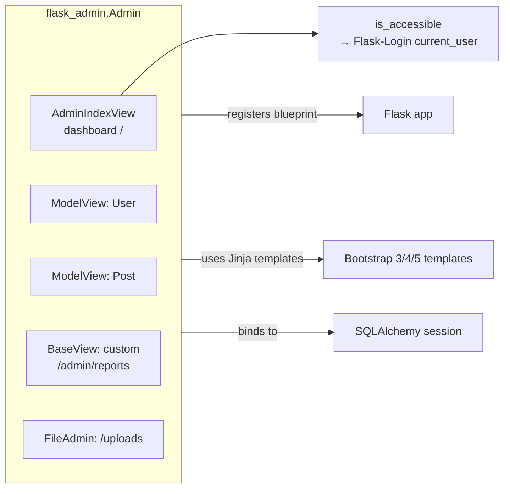
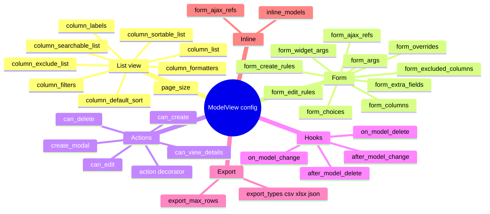
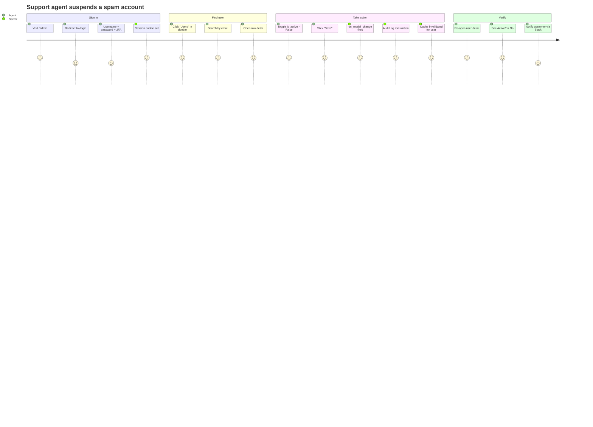
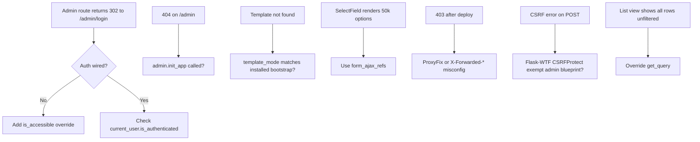

# Flask-Admin

#flask #admin #crud #backoffice #sqlalchemy #security

> [!info] The admin-panel generator for Flask
> Flask-Admin (`flask-admin`) is a batteries-included admin interface generator. Point it at a SQLAlchemy model, a MongoDB collection, a directory of files, or a custom view, and you get a free CRUD UI with list/table views, create/edit forms, search, filters, sortable columns, batch actions, and Bootstrap styling. It is the Flask equivalent of Django's built-in admin.
>
> It is not a CMS — it is a developer-oriented backoffice for operating staff. It is also **the single most dangerous surface in most Flask apps** if left unauthenticated, so this note spends a lot of ink on §7 (Pitfalls) and §8 (Best practices) around access control.

Think of Flask-Admin as the **cockpit of an airliner**: you do not let passengers wander in, but trained operators use it to flip switches, change config, and review the system state. Without it, every operational chore (banning a user, deleting a spam post, fixing a typo) becomes a one-off migration script. With it, those chores become a 30-second click.

---

## 1. Overview & Metaphor

### What problem does an admin panel solve?

Operational work that does not deserve its own customer-facing UI:

1. **Customer support** — find a user by email, reset their password, refund a charge, suspend an account.
2. **Content moderation** — review flagged posts, ban authors, bulk-delete spam.
3. **Data hygiene** — fix a typo, merge two duplicate rows, inspect orphaned records.
4. **Operations** — toggle feature flags, view queue depth, restart a Celery worker, purge a cache.
5. **Debugging** — quickly answer "what does row 1234 look like?" without opening a SQL shell.

Building these as bespoke React pages is wasteful. Flask-Admin gives you a generic CRUD scaffolding that covers 80% of operational needs in roughly 5 lines per model.

### What Flask-Admin is *not*

- **Not a public CMS** — it is for staff, not end users.
- **Not an analytics dashboard** — use Metabase, Superset, or Grafana for charts.
- **Not a replacement for proper migrations** — schema changes still go through [[Flask-Migrate]].
- **Not a security boundary by itself** — the default `AdminIndexView` is **publicly accessible**. You must add auth (§7, §8).

### The piece-parts



Every `Admin` instance mounts a blueprint (default URL prefix `/admin`) and holds a list of **views**. Each view is a subclass of `BaseView` that knows how to render at least one page. The most useful subclass is `ModelView`, which generates a full CRUD UI from a SQLAlchemy model. `FileAdmin` exposes a directory. `AdminIndexView` is the dashboard.

#### View Class Hierarchy

```mermaid
classDiagram
    class BaseView {
        +admin Admin
        +name str
        +category str
        +endpoint str
        +url str
        +is_accessible() bool
        +inaccessible_callback(name, **kwargs)
        +render(template, **kwargs)
        +expose(rule, **options)
    }
    class AdminIndexView {
        +index() dashboard
    }
    class BaseModelView {
        +column_list
        +column_filters
        +column_searchable_list
        +form_columns
        +can_create / can_edit / can_delete
        +scaffold_list_columns()
        +scaffold_form()
        +get_query()
        +get_one(id)
        +on_model_change(form, model, is_created)
        +after_model_change(form, model, is_created)
    }
    class ModelView {
        +model
        +session SQLAlchemy session
        +scaffold_list_columns() from model
    }
    class FileAdmin {
        +path str
        +editable_extensions tuple
        +can_upload bool
        +allowed_upload_extensions
    }
    class RedisCli {
        +redis client
    }
    BaseView <|-- AdminIndexView
    BaseView <|-- BaseModelView
    BaseView <|-- FileAdmin
    BaseView <|-- RedisCli
    BaseModelView <|-- ModelView
    note right of BaseModelView
        Per-backend subclasses:
        ModelView (SQLAlchemy),
        MongoModelView, PyMongoView,
        PeeweeView
    end note
```

---

## 2. Installation

```bash
pip install Flask-Admin
# For SQLAlchemy model views (almost always what you want):
pip install Flask-Admin Flask-SQLAlchemy
# Optional extras:
pip install WTForms-SQLAlchemy   # for form_ajax_refs / related-object autocompletes
pip install flask-admin[mongoengine]   # MongoEngine backend
pip install flask-admin[peewee]        # Peewee backend
pip install flask-admin[pymongo]       # PyMongo backend
```

Verify:

```python
import flask_admin
print(flask_admin.__version__)  # >= 2.0 recommended; 1.6 is legacy
```

> [!warning] Version 2.x vs 1.x
> Flask-Admin 2.0 (released 2024) ships Bootstrap 4 templates by default and supports Flask 3 / Werkzeug 3. The 1.x line is Bootstrap 3 and is unmaintained. Always pin `Flask-Admin>=2.0` for greenfield work.

In an `extensions.py` pattern (see [[Project-Structure]]):

```python
# extensions.py
from flask_admin import Admin
from flask_sqlalchemy import SQLAlchemy

db = SQLAlchemy()
admin = Admin(name="My App", template_mode="bootstrap4")
```

```python
# app.py
from flask import Flask
from extensions import db, admin

def create_app():
    app = Flask(__name__)
    app.config["SECRET_KEY"] = "change-me"
    app.config["SQLALCHEMY_DATABASE_URI"] = "sqlite:///app.db"
    db.init_app(app)
    admin.init_app(app)
    return app
```

---

## 3. Configuration

### App-level config keys

| Key | Default | Purpose |
|---|---|---|
| `FLASK_ADMIN_SWATCH` | `"cerulean"` | Bootswatch theme name (`flatly`, `darkly`, `cosmo`, `superhero`, …) |
| `FLASK_ADMIN_TEMPLATE_MODE` | `"bootstrap4"` | Template set: `bootstrap3`, `bootstrap4`, `bootstrap5` (v2+) |
| `FLASK_ADMIN_FLUID` | `False` | Use full-width (`container-fluid`) layout |
| `SECRET_KEY` | — | **Required.** Flask-Admin uses Flask sessions for messages and CSRF. |

### `Admin(...)` constructor arguments

| Argument | Default | Purpose |
|---|---|---|
| `name` | `"Admin"` | Branding text in the top-left |
| `url` | `"/admin"` | URL prefix for the blueprint |
| `subdomain` | `None` | Mount blueprint on a subdomain |
| `index_view` | `AdminIndexView()` | The dashboard view; replace to add auth |
| `template_mode` | `"bootstrap3"` (1.x) / `"bootstrap4"` (2.x) | Template set |
| `category_translations` | `{}` | i18n overrides |
| `endpoint` | `"admin"` | Blueprint endpoint name |
| `static_url_path` | `"/admin/static"` | Static path |
| `base_template` | `"admin/base.html"` | Override the layout shell |

### `ModelView` configuration attributes (the big ones)

| Attribute | Type | Purpose |
|---|---|---|
| `column_list` | `list[str]` | Columns shown in the list view (default: model PKs + first few fields) |
| `column_exclude_list` | `list[str]` | Hide these from list view |
| `column_labels` | `dict[str,str]` | Human-readable column headings |
| `column_formatters` | `dict[str,Callable]` | Custom cell renderers (`value, row, ctx -> str`) |
| `column_formatters_export` | `dict[str,Callable]` | Formatters used for CSV/Excel export |
| `column_formatters_detail` | `dict[str,Callable]` | Formatters used in the detail view |
| `column_type_formatters` | `dict[Type,Callable]` | Per-type formatters applied globally |
| `column_filters` | `list` | Filter widgets (`FilterLike`, `FilterEqual`, etc.) |
| `column_searchable_list` | `list[str]` | Columns searched by the search box |
| `column_default_sort` | `list/tuple/str` | Default sort (`("created_at", True)` = descending) |
| `column_sortable_list` | `list[str]` | Columns that are clickable to sort |
| `column_display_actions` | `bool` | Show the row-actions column (edit/delete) |
| `column_autoformatter` | `bool` | Auto-format booleans, datetimes, etc. |
| `form_columns` | `list[str]` | Fields shown in create/edit form |
| `form_excluded_columns` | `list[str]` | Fields hidden from create/edit form |
| `form_overrides` | `dict[str,Type]` | Override the WTForms field type for a column |
| `form_args` | `dict[str,dict]` | Pass `validators`, `label`, `default`, `description` to a field |
| `form_widget_args` | `dict[str,dict]` | Pass HTML attributes to the widget (`{"readonly": True}`) |
| `form_ajax_refs` | `dict[str,AjaxModelLoader]` | AJAX autocomplete for related objects |
| `form_create_rules` / `form_edit_rules` | `list[Rule]` | Fine-grained form layout (rules API) |
| `page_size` | `20` | Items per page in list view |
| `can_create` / `can_edit` / `can_delete` / `can_view_details` | `True`/`False` | Toggle CRUD actions |
| `create_modal` / `edit_modal` | `False` | Render create/edit in a modal |
| `action_disallowed_list` | `list[str]` | Built-in actions to disable (`"delete"`) |
| `export_types` | `["csv"]` | Export formats: `csv`, `xlsx`, `json`, `yaml`, `xml` |
| `export_max_rows` | `0` | Cap on export size; `0` = unlimited |
| `column_display_pk` | `False` | Show the primary key column |
| `form_choices` | `dict[str,list[tuple]]` | Render a SelectField with fixed choices for a column |
| `form_extra_fields` | `dict[str,Field]` | Add fields that are not on the model |
| `form_prevalidate` / `form_postprocess` | `Callable` | Hooks around form validation |
| `on_model_change` / `on_model_delete` | `Callable` | Hook around persistence (`form, model, is_created`) |
| `after_model_change` / `after_model_delete` | `Callable` | Post-commit hooks |
| `inline_models` | `list` | Inline editing of related models (like Django admin inlines) |

> [!tip] Don't memorize — bookmark
> The official [API reference](https://flask-admin.readthedocs.io/en/latest/api/mod_contrib_sqla/) lists ~80 attributes. Most teams use ~15. Pin a `models.py` file with one canonical `ModelView` per model and grow it as needs arise.

#### ModelView Feature Mindmap



---

## 4. Basic Usage

### Minimal admin: one model

```python
# app.py
from flask import Flask
from flask_admin import Admin
from flask_admin.contrib.sqla import ModelView
from flask_sqlalchemy import SQLAlchemy

app = Flask(__name__)
app.config["SECRET_KEY"] = "dev"
app.config["SQLALCHEMY_DATABASE_URI"] = "sqlite:///app.db"
db = SQLAlchemy(app)

class User(db.Model):
    id = db.Column(db.Integer, primary_key=True)
    email = db.Column(db.String(255), unique=True, nullable=False)
    is_active = db.Column(db.Boolean, default=True, nullable=False)
    created_at = db.Column(db.DateTime, server_default=db.func.now())

admin = Admin(app, name="My Admin", template_mode="bootstrap4")
admin.add_view(ModelView(User, db.session))

with app.app_context():
    db.create_all()

if __name__ == "__main__":
    app.run(debug=True)
```

Visit `http://localhost:5000/admin/` and you have a working CRUD UI for `User`.

> [!danger] This is public by default!
> The snippet above lets anyone on the internet create, edit, and delete users. Always subclass `ModelView` and override `is_accessible` (see §7).

### Categorised views

When the sidebar gets long, group views:

```python
admin.add_view(UserView(User, db.session, name="Users", category="Accounts"))
admin.add_view(TeamView(Team, db.session, name="Teams", category="Accounts"))
admin.add_view(PostView(Post, db.session, name="Posts", category="Content"))
```

Renders as a dropdown in the sidebar.

---

## 5. Intermediate Patterns

### Customising the list view

```python
from flask_admin.contrib.sqla import ModelView
from flask_admin.model.template import macro
from markupsafe import Markup

class UserView(ModelView):
    column_list = ("id", "email", "is_active", "created_at", "avatar")
    column_labels = {"is_active": "Active?", "created_at": "Joined"}
    column_default_sort = ("created_at", True)  # newest first
    column_searchable_list = ("email",)
    column_filters = ("email", "is_active", "created_at")

    # Render an avatar image instead of the raw URL
    column_formatters = {
        "avatar": lambda v, c, u, p: Markup(
            f''
        ),
        "email": lambda v, c, u, p: Markup(
            f'<a href="mailto:{u.email}">{u.email}</a>'
        ),
    }
```

### Customising the form

```python
class UserView(ModelView):
    form_columns = ("email", "is_active", "roles")
    form_excluded_columns = ("password_hash", "created_at")  # never editable
    form_args = {
        "email": {"label": "Email", "validators": [Email()]},
        "is_active": {"description": "Inactive users cannot log in"},
    }
    form_widget_args = {
        "email": {"readonly": True},  # editable only via SQL
    }
    form_overrides = {"is_active": SelectField}
    form_choices = {"is_active": [("true", "Yes"), ("false", "No")]}
    form_extra_fields = {
        "notify": BooleanField("Send welcome email?", default=True)
    }
```

### Filtering the default queryset

```python
class ActiveUserView(ModelView):
    def get_query(self):
        return self.session.query(self.model).filter(self.model.is_active == True)

    def get_count_query(self):
        return self.session.query(func.count("*")).filter(self.model.is_active == True)
```

The "Count" column at the bottom of the list view will then only reflect active rows.

### Custom actions

```python
from flask_admin import expose
from flask_admin.babel import gettext

class PostView(ModelView):
    column_list = ("id", "title", "status", "author", "created_at")
    column_filters = ("status", "created_at")

    @expose("/action/publish/", methods=("POST",))
    def action_publish(self):
        ids = request.form.getlist("rowid")
        count = 0
        for p in self.session.query(Post).filter(Post.id.in_(ids)):
            p.status = "published"
            count += 1
        self.session.commit()
        flash(f"Published {count} posts.", "success")
        return redirect(request.referrer or "/admin/post")

    # Register it as a checkbox action
    @expose("/action/", methods=("POST",))
    def action_view(self):
        return self.handle_action()
```

Add the action to the list-page dropdown by overriding the list template, or use the simpler `@action` decorator:

```python
from flask_admin.actions import action

class PostView(ModelView):
    @action("publish", "Publish", "Are you sure you want to publish selected posts?")
    def action_publish(self, ids):
        self.session.query(Post).filter(Post.id.in_(ids)).update({"status": "published"})
        self.session.commit()
        flash(f"Published {len(ids)} posts.", "success")
```

### FileAdmin — manage uploads on disk

```python
from flask_admin.contrib.fileadmin import FileAdmin
import os.path as op

class MyFileAdmin(FileAdmin):
    editable_extensions = ("txt", "md", "html", "css", "js")
    can_upload = True
    can_delete_dirs = True
    allowed_upload_extensions = ("jpg", "png", "gif", "pdf")

admin.add_view(MyFileAdmin(op.join(op.dirname(__file__), "uploads"),
                           "/admin/uploads", name="Uploads"))
```

### Custom `BaseView` — a one-off page

```python
from flask_admin import BaseView, expose

class ReportsView(BaseView):
    @expose("/")
    def index(self):
        active_users = User.query.filter_by(is_active=True).count()
        posts_today = Post.query.filter(Post.created_at >= date.today()).count()
        return self.render("admin/reports.html",
                           active_users=active_users, posts_today=posts_today)

admin.add_view(ReportsView(name="Reports", url="/admin/reports"))
```

`templates/admin/reports.html` extends `admin/master.html`:

```jinja2


<h2>Operational Reports</h2>
<ul>
  <li>Active users: {{ active_users }}</li>
  <li>Posts created today: {{ posts_today }}</li>
</ul>

```

### Custom `AdminIndexView` — the dashboard

```python
from flask_admin import Admin, AdminIndexView

class MyHomeView(AdminIndexView):
    @expose("/")
    def index(self):
        stats = {"users": User.query.count(), "posts": Post.query.count()}
        return self.render("admin/home.html", stats=stats)

admin = Admin(index_view=MyHomeView(name="Home", url="/admin"))
```

---

## 6. Advanced Usage

### Multiple admin instances

```python
admin_internal = Admin(name="Internal", url="/internal", endpoint="internal")
admin_partner  = Admin(name="Partner",  url="/partner",  endpoint="partner")
admin_internal.init_app(app)
admin_partner.init_app(app)
```

Useful for separating staff-only and partner-only UIs without entangling permissions.

### `form_ajax_refs` for large related tables

If you relate a `Post` to an `Author` via a foreign key, the default form renders a `<select>` populated with **every** author. For 100k authors this is a memory bomb. AJAX autocomplete solves it:

```python
class PostView(ModelView):
    form_ajax_refs = {
        "author": {
            "fields": ["email", "username"],
            "page_size": 10,
            "placeholder": "Search authors…",
        }
    }
```

### Inline models (Django-style inlines)

```python
class Post(db.Model):
    id = db.Column(db.Integer, primary_key=True)
    title = db.Column(db.String(255))

class Comment(db.Model):
    id = db.Column(db.Integer, primary_key=True)
    post_id = db.Column(db.Integer, db.ForeignKey("post.id"))
    post = db.relationship("Post", backref="comments")
    body = db.Column(db.Text)

class PostView(ModelView):
    inline_models = [(Comment, dict(form_columns=["id", "body"]))]
```

Now the Post edit form embeds a sub-form for every Comment, with add/remove buttons.

### The rules API — form layout

```python
from flask_admin.form.rules import Field, Header, Section, Macro, JS

class UserView(ModelView):
    form_create_rules = [
        Header("Identity"),
        Section("Required", Field("email"), Field("username")),
        Section("Optional", Field("bio")),
        Header("Access"),
        Field("is_active"),
        Field("roles"),
    ]
```

The same `rules` API works for `form_edit_rules` and `column_formatters` rules.

### `on_model_change` and audit logging

```python
class AuditedModelView(ModelView):
    def on_model_change(self, form, model, is_created):
        actor = current_user.email if current_user.is_authenticated else "system"
        db.session.add(AuditLog(
            actor=actor,
            action="create" if is_created else "update",
            entity=type(model).__name__,
            entity_id=model.id,
            payload=json.dumps({k: str(getattr(model, k)) for k in form.data}),
        ))

    def after_model_change(self, form, model, is_created):
        # Hook point for cache invalidation, webhooks, Celery tasks
        invalidate_cache_for(model)
```

### Overriding templates

Flask-Admin looks up templates by name, so dropping a file at `templates/admin/list.html` overrides the global list template. For per-view overrides:

```python
class UserView(ModelView):
    list_template = "admin/user/list.html"
    create_template = "admin/user/create.html"
    edit_template = "admin/user/edit.html"
    details_template = "admin/user/details.html"
```

### Redis CLI

```python
from flask_admin.contrib.rediscli import RedisCli
import redis

admin.add_view(RedisCli(redis.Redis(host="localhost", port=6379),
                        name="Redis", category="Tools"))
```

### MongoEngine, PyMongo, Peewee

```python
from flask_admin.contrib.mongoengine import ModelView as MongoView
from flask_admin.contrib.pymongo import ModelView as PyMongoView
from flask_admin.contrib.peewee import ModelView as PeeweeView
```

Each has its own per-backend options; see [the backends docs](https://flask-admin.readthedocs.io/en/latest/backends/).

### Permissions per view

Wrap `is_accessible` differently per view:

```python
class SuperAdminOnly(ModelView):
    def is_accessible(self):
        return current_user.is_authenticated and current_user.is_superadmin

class EditorView(ModelView):
    def is_accessible(self):
        return current_user.is_authenticated and "editor" in current_user.roles
```

#### Admin Operator Journey



### Bulk operations beyond `action`

Override `model_actions` or use `on_model_delete` for cascading effects:

```python
class PostView(ModelView):
    def on_model_delete(self, post):
        # Cascade soft-delete to comments
        for c in post.comments:
            c.deleted_at = func.now()
```

---

## 7. Common Pitfalls & Troubleshooting



| Symptom | Cause | Fix |
|---|---|---|
| `TemplateNotFound: admin/master.html` | `template_mode` mismatch or Flask-Admin not installed | `pip install Flask-Admin` and set `template_mode="bootstrap4"` |
| 404 on `/admin` | `admin.init_app(app)` not called | Call it in `create_app()` |
| Admin UI is public | Default `is_accessible` returns `True` | Subclass `ModelView`/`AdminIndexView` and override `is_accessible` |
| 403 after reverse-proxy deploy | `ProxyFix` not applied, Flask sees wrong scheme/host | `app.wsgi_app = ProxyFix(app.wsgi_app, x_for=1, x_proto=1, x_host=1)` |
| CSRF error 400 on form submit | `flask_wtf.CSRFProtect` protects the admin blueprint | `csrf.exempt(admin.blueprint)` *or* rely on session-based auth |
| Select field with 50k options freezes browser | Default related-object renderer loads all rows | Use `form_ajax_refs` |
| "Object not found" on edit after deploy | Multi-process app + SQLite file lock contention | Move to Postgres or single-worker admin |
| `DateTime` shows wrong timezone | Server-side `func.now()` stored as naive UTC, displayed in local | Standardise on UTC and add a `column_formatter` |
| `can_delete=False` still shows delete button | Cached template | Restart app, hard-refresh browser |
| Filters don't appear | `column_filters` references a property not a column | Use a SQL column, or override `get_filters` |
| `column_formatters` breaks export | Formatter returns HTML, not a plain string | Set `column_formatters_export` separately |

> [!danger] The classic CSRF trap
> If you use [[Flask-WTF]]'s `CSRFProtect` globally (the default in many templates), every POST in the admin panel will fail with `400 Bad Request: The CSRF token is missing`. Two fixes:
>
> 1. `csrf.exempt(admin.blueprint)` — admin relies on session auth + same-origin policy instead.
> 2. Add `` to your admin templates so WTForms renders the token.
>
> Option 1 is the common choice for staff admin panels.

> [!warning] `column_formatters` returning `Markup`
> Always use `markupsafe.Markup` (or import from `flask_admin.model.template`) when returning HTML. Returning a raw `str` causes Flask-Admin to escape it, so your `` tag shows up as visible text.

---

## 8. Best Practices

### Security (the non-negotiables)

1. **Always protect the admin.** Subclass `ModelView` and override `is_accessible` to check [[Flask-Login]]'s `current_user`. Never ship the default.
2. **Use a separate subdomain** (`admin.example.com`) so the admin is isolated from your main app's CORS, cookies, and content-security-policy. Set `app.config["SESSION_COOKIE_DOMAIN"] = "admin.example.com"`.
3. **Force HTTPS** for the admin: `SESSION_COOKIE_SECURE = True`, `SESSION_COOKIE_HTTPONLY = True`, `SESSION_COOKIE_SAMESITE = "Lax"`.
4. **Add IP allow-listing** in the reverse proxy (Nginx `allow/deny`) for staff networks.
5. **Rate-limit the admin login.** Use [[Flask-Limiter]] on the login route to prevent brute force.
6. **Audit every mutation.** Hook `on_model_change` / `on_model_delete` to write to an `AuditLog` table.
7. **Never expose sensitive columns.** `form_excluded_columns = ("password_hash", "totp_secret", "api_key")`.
8. **Make destructive actions two-step.** Set `can_delete = False` and provide a soft-delete action instead, or use the `action` decorator with a confirmation dialog.

### Code organisation

```python
# admin/__init__.py
from flask_admin import Admin
from flask_admin.contrib.sqla import ModelView

admin = Admin(name="MyApp", template_mode="bootstrap4", index_view=MyAdminIndexView())

# admin/views.py
class BaseModelView(ModelView):
    """Shared auth + audit logic for every model view."""
    def is_accessible(self):
        return current_user.is_authenticated and current_user.is_staff
    def inaccessible_callback(self, name, **kw):
        return redirect(url_for("auth.login", next=request.url))
    def on_model_change(self, form, model, is_created):
        audit_log(type(model).__name__, model.id, is_created)
    # … etc.

class UserView(BaseModelView): ...
class PostView(BaseModelView): ...

# admin/__init__.py continued
def init_admin(app):
    from .views import UserView, PostView
    from extensions import db
    from models import User, Post
    admin.init_app(app)
    admin.add_view(UserView(User, db.session))
    admin.add_view(PostView(Post, db.session))
```

### Performance

1. **Cap `page_size`** at 50–100.
2. **Use `form_ajax_refs`** for any foreign-key relationship whose table exceeds ~500 rows.
3. **Avoid `column_formatters` that issue N+1 queries.** Use `joinedload` in `get_query`.
4. **Disable `column_display_pk`** unless your staff need it.
5. **Cache the dashboard** with [[Flask-Caching]] (`@cache.cached(timeout=60)`).

---

## 9. Integration with Other Extensions

### [[Flask-SQLAlchemy]]

The default backend. Bind a `ModelView` to `db.session` and Flask-Admin introspects columns, relationships, validators, and choices.

```python
admin.add_view(UserView(User, db.session))
```

### [[Flask-Login]]

```python
from flask_login import current_user
from flask import redirect, url_for, request

class AdminIndexView(flask_admin.AdminIndexView):
    @expose("/")
    def index(self):
        if not (current_user.is_authenticated and current_user.is_staff):
            return redirect(url_for("auth.login", next=request.url))
        return super().index()

admin = Admin(index_view=AdminIndexView())
```

### [[Flask-WTF]]

Conflict: `CSRFProtect` blocks admin POSTs. Resolution:

```python
from flask_wtf.csrf import CSRFProtect
csrf = CSRFProtect(app)
csrf.exempt(admin.blueprint)
```

### [[Marshmallow]]

If you have Marshmallow schemas and want to surface them in admin, the cleanest pattern is to define `form_args` from the schema's declared fields:

```python
from schemas import UserSchema

class UserView(ModelView):
    form_args = {
        name: {"validators": field.validators}
        for name, field in UserSchema().fields.items()
        if hasattr(field, "validators")
    }
```

### [[Flask-Limiter]]

```python
@limiter.limit("10/minute")
@app.route("/admin/login", methods=["POST"])
def admin_login():
    ...
```

Rate-limit the login form and any destructive endpoint exposed via the admin.

### [[Flask-Caching]]

Cache the dashboard's expensive counts:

```python
class AdminIndexView(flask_admin.AdminIndexView):
    @expose("/")
    @cache.cached(timeout=60, key_prefix="admin_home")
    def index(self):
        ...
```

### [[Flask-Mail]]

Trigger admin notifications on model changes:

```python
def after_model_change(self, form, model, is_created):
    send_async_email(
        to="ops@example.com",
        subject=f"[Admin] {type(model).__name} {model.id} {'created' if is_created else 'updated'}",
        body=str(form.data),
    )
```

---

## 10. Real-World Example: Blog Admin

A complete runnable Flask app with Users, Posts, Comments, custom formatters, filters, batch actions, audit logging, role-based access, and Flask-Login auth.

```python
# blog_admin.py
import json
from datetime import datetime
from flask import Flask, redirect, url_for, request, flash
from flask_login import (LoginManager, UserMixin, login_user,
                         logout_user, login_required, current_user)
from flask_admin import Admin, AdminIndexView, expose
from flask_admin.contrib.sqla import ModelView
from flask_admin.actions import action
from flask_sqlalchemy import SQLAlchemy
from markupsafe import Markup
from werkzeug.security import generate_password_hash, check_password_hash

app = Flask(__name__)
app.config["SECRET_KEY"] = "change-me-in-prod"
app.config["SQLALCHEMY_DATABASE_URI"] = "sqlite:///blog.db"
db = SQLAlchemy(app)
login_manager = LoginManager(app)

# ---------- Models ----------
class User(UserMixin, db.Model):
    id = db.Column(db.Integer, primary_key=True)
    email = db.Column(db.String(255), unique=True, nullable=False)
    password_hash = db.Column(db.String(255), nullable=False)
    is_staff = db.Column(db.Boolean, default=False, nullable=False)
    is_superadmin = db.Column(db.Boolean, default=False, nullable=False)
    display_name = db.Column(db.String(120))
    created_at = db.Column(db.DateTime, default=datetime.utcnow)

    def set_password(self, pw): self.password_hash = generate_password_hash(pw)
    def check_password(self, pw): return check_password_hash(self.password_hash, pw)

class Post(db.Model):
    id = db.Column(db.Integer, primary_key=True)
    title = db.Column(db.String(255), nullable=False)
    body = db.Column(db.Text)
    status = db.Column(db.String(20), default="draft")  # draft|published|archived
    author_id = db.Column(db.Integer, db.ForeignKey("user.id"))
    author = db.relationship("User", backref="posts")
    created_at = db.Column(db.DateTime, default=datetime.utcnow)

class Comment(db.Model):
    id = db.Column(db.Integer, primary_key=True)
    post_id = db.Column(db.Integer, db.ForeignKey("post.id"))
    post = db.relationship("Post", backref="comments")
    body = db.Column(db.Text)
    is_approved = db.Column(db.Boolean, default=False)
    created_at = db.Column(db.DateTime, default=datetime.utcnow)

class AuditLog(db.Model):
    id = db.Column(db.Integer, primary_key=True)
    actor = db.Column(db.String(255))
    action = db.Column(db.String(50))
    entity = db.Column(db.String(80))
    entity_id = db.Column(db.Integer)
    payload = db.Column(db.Text)
    at = db.Column(db.DateTime, default=datetime.utcnow)

@login_manager.user_loader
def load_user(uid):
    return db.session.get(User, int(uid))

# ---------- Admin views ----------
class BaseAdmin(ModelView):
    """Common auth + audit logic."""
    can_view_details = True
    page_size = 25

    def is_accessible(self):
        return current_user.is_authenticated and current_user.is_staff

    def inaccessible_callback(self, name, **kw):
        return redirect(url_for("login", next=request.url))

    def _audit(self, action, model, is_created):
        db.session.add(AuditLog(
            actor=current_user.email,
            action=action,
            entity=type(model).__name__,
            entity_id=getattr(model, "id", None),
            payload=json.dumps({k: str(getattr(model, k)) for k in
                                ("title", "status", "email", "is_approved") if hasattr(model, k)},
                               default=str),
        ))

    def on_model_change(self, form, model, is_created):
        self._audit("create" if is_created else "update", model, is_created)

    def on_model_delete(self, model):
        self._audit("delete", model, False)

class UserView(BaseAdmin):
    column_list = ("id", "email", "display_name", "is_staff", "is_superadmin", "created_at")
    column_searchable_list = ("email", "display_name")
    column_filters = ("is_staff", "is_superadmin", "created_at")
    column_default_sort = ("created_at", True)
    form_excluded_columns = ("password_hash", "created_at", "posts")
    form_columns = ("email", "display_name", "is_staff", "is_superadmin")
    form_widget_args = {"email": {"readonly": True}}
    column_formatters = {
        "email": lambda v, c, m, p: Markup(f'<a href="mailto:{m.email}">{m.email}</a>'),
    }

class PostView(BaseAdmin):
    column_list = ("id", "title", "status", "author", "created_at")
    column_searchable_list = ("title", "body")
    column_filters = ("status", "created_at", "author_id")
    column_default_sort = ("created_at", True)
    column_choices = {"status": [("draft", "Draft"), ("published", "Published"), ("archived", "Archived")]}
    form_choices = {"status": [("draft", "Draft"), ("published", "Published"), ("archived", "Archived")]}
    form_ajax_refs = {"author": {"fields": ["email", "display_name"], "page_size": 10}}
    form_columns = ("title", "body", "status", "author")
    column_formatters = {
        "status": lambda v, c, m, p: Markup(
            f'<span class="badge bg-{"success" if m.status=="published" else "secondary"}">{m.status}</span>'
        ),
    }

    @action("publish", "Publish", "Publish selected posts?")
    def action_publish(self, ids):
        self.session.query(Post).filter(Post.id.in_(ids)).update({"status": "published"})
        self.session.commit()
        flash(f"Published {len(ids)} posts.", "success")

    @action("archive", "Archive", "Archive selected posts?")
    def action_archive(self, ids):
        self.session.query(Post).filter(Post.id.in_(ids)).update({"status": "archived"})
        self.session.commit()
        flash(f"Archived {len(ids)} posts.", "info")

class CommentView(BaseAdmin):
    column_list = ("id", "post", "body", "is_approved", "created_at")
    column_filters = ("is_approved", "created_at")
    column_default_sort = ("created_at", True)
    form_columns = ("body", "is_approved", "post")
    inline_models = []

class AuditLogView(BaseAdmin):
    column_list = ("id", "actor", "action", "entity", "entity_id", "at")
    column_filters = ("actor", "action", "entity", "at")
    column_default_sort = ("at", True)
    can_create = False
    can_edit = False
    can_delete = False

class MyAdminIndexView(AdminIndexView):
    @expose("/")
    def index(self):
        if not (current_user.is_authenticated and current_user.is_staff):
            return redirect(url_for("login", next=request.url))
        stats = {
            "users": User.query.count(),
            "posts": Post.query.count(),
            "published": Post.query.filter_by(status="published").count(),
            "pending_comments": Comment.query.filter_by(is_approved=False).count(),
        }
        recent = AuditLog.query.order_by(AuditLog.at.desc()).limit(10).all()
        return self.render("admin/home.html", stats=stats, recent=recent)

admin = Admin(app, name="Blog Admin", template_mode="bootstrap4",
              index_view=MyAdminIndexView())
admin.add_view(UserView(User, db.session, name="Users", category="Accounts"))
admin.add_view(PostView(Post, db.session, name="Posts", category="Content"))
admin.add_view(CommentView(Comment, db.session, name="Comments", category="Content"))
admin.add_view(AuditLogView(AuditLog, db.session, name="Audit Log", category="System"))

# ---------- Auth routes ----------
@app.route("/login", methods=["GET", "POST"])
def login():
    if request.method == "POST":
        email, password = request.form["email"], request.form["password"]
        user = User.query.filter_by(email=email).first()
        if user and user.check_password(password) and user.is_staff:
            login_user(user)
            return redirect(request.args.get("next") or "/admin/")
        flash("Invalid credentials.", "danger")
    return """<form method=post>
      <input name=email placeholder=email>
      <input name=password type=password>
      <button>Login</button></form>"""

@app.route("/logout")
@login_required
def logout():
    logout_user()
    return redirect(url_for("login"))

# ---------- Bootstrap ----------
with app.app_context():
    db.create_all()
    if not User.query.filter_by(email="admin@example.com").first():
        admin_user = User(email="admin@example.com", is_staff=True, is_superadmin=True)
        admin_user.set_password("admin")
        db.session.add(admin_user)
        db.session.commit()

if __name__ == "__main__":
    app.run(debug=True)
```

Run it, log in at `/login` with `admin@example.com` / `admin`, and you have a fully functional blog backoffice: dashboard with stats, CRUD for users/posts/comments, custom formatters (status badges, mailto links), search + filters, AJAX author lookup, batch publish/archive actions, and a complete audit trail.

`templates/admin/home.html`:

```jinja2


<h2>Dashboard</h2>
<div class="row">
  <div class="col"><div class="card p-3"><h3>{{ stats.users }}</h3>Users</div></div>
  <div class="col"><div class="card p-3"><h3>{{ stats.posts }}</h3>Posts</div></div>
  <div class="col"><div class="card p-3"><h3>{{ stats.published }}</h3>Published</div></div>
  <div class="col"><div class="card p-3"><h3>{{ stats.pending_comments }}</h3>Pending comments</div></div>
</div>
<h3 class="mt-4">Recent activity</h3>
<table class="table">
  <tr><th>Time</th><th>Actor</th><th>Action</th><th>Entity</th></tr>
  
  <tr><td>{{ a.at }}</td><td>{{ a.actor }}</td><td>{{ a.action }}</td>
      <td>{{ a.entity }} #{{ a.entity_id }}</td></tr>
  
</table>

```

---

## 11. References

- **Docs**: <https://flask-admin.readthedocs.io/>
- **PyPI**: <https://pypi.org/project/Flask-Admin/>
- **Source**: <https://github.com/flask-admin/flask-admin>
- **Backends**: SQLAlchemy, MongoEngine, Peewee, PyMongo — see [backends docs](https://flask-admin.readthedocs.io/en/latest/backends/)
- **Templates**: Bootswatch themes — <https://bootswatch.com/>
- **API reference**: [`ModelView` (SQLAlchemy)](https://flask-admin.readthedocs.io/en/latest/api/mod_contrib_sqla/)
- **Rules API**: [`flask_admin.form.rules`](https://flask-admin.readthedocs.io/en/latest/api/mod_form/)
- **Related notes**:
  - [[Flask-SQLAlchemy]] — the default backend
  - [[Flask-Login]] — how `is_accessible` should gate the admin
  - [[Flask-WTF]] — CSRF integration pitfalls
  - [[Marshmallow]] — for serialising admin data out to JSON
  - [[Flask-Limiter]] — rate-limit the admin login
  - [[Flask-Caching]] — cache expensive dashboard stats
  - [[Security-Best-Practices]] — defense-in-depth for staff tools
- **Inspiration**: Django Admin (<https://docs.djangoproject.com/en/stable/ref/contrib/admin/>) — Flask-Admin's design ancestor.
- **Alternatives**:
  - `flask-admin-lite` — minimal variant
  - `flask-peewee-admin` — Peewee-specific
  - Bespoke React + [[Flask-RESTful]] admin front-ends when the generic UI is too constraining.

---

**Tags**: #flask #admin #crud #backoffice #sqlalchemy #security #audit-log #fileadmin #modelview
