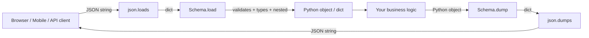
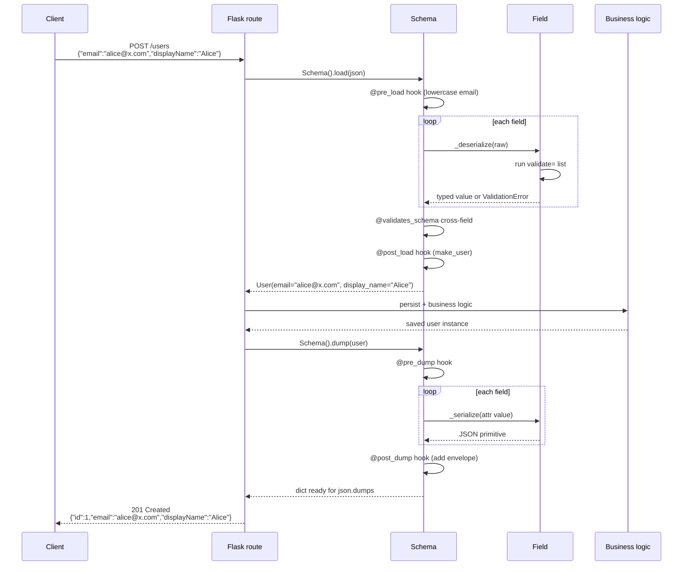
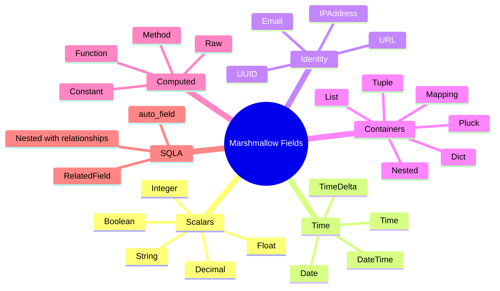
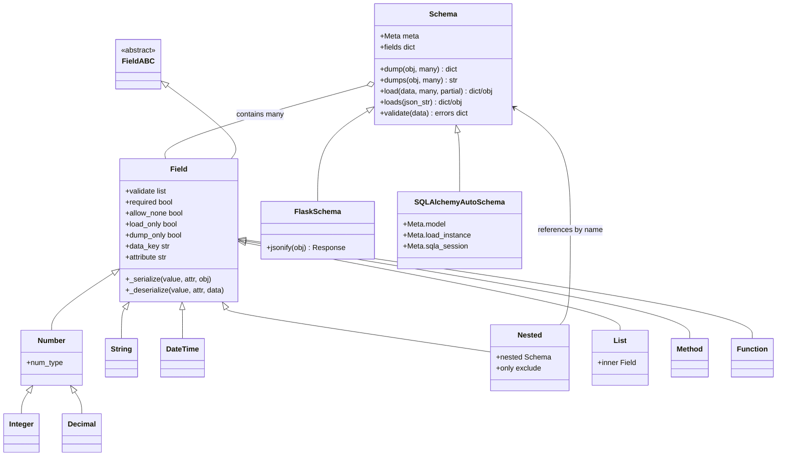

# Marshmallow

#flask #serialization #validation #schema #api #openapi #marshmallow

> [!info] The Python serialization & validation library
> Marshmallow converts complex Python objects (SQLAlchemy models, dataclasses, attrs classes, arbitrary dicts) to and from primitive JSON-compatible types — and validates the input along the way. It is the de facto choice for serializing data in Flask APIs and the foundation under most Flask REST frameworks (Flask-Smorest, Flask-RESTX's marshalling alternative, apispec).
>
> Where [[Flask-WTF]] validates *forms*, Marshmallow validates *JSON*. Where [[Flask-Admin]] gives you a backoffice UI, Marshmallow gives you the **wire format** your API speaks.

Think of Marshmallow as a **border-control officer** at the edge of your application. Every payload entering from the network is checked against a passport (the `Schema`), stamped with type information (`String`, `Integer`, `Email`), and either waved through into Python-land or rejected with a precise list of reasons. Every payload leaving Python is converted back into the lingua franca of the web (JSON primitives) so JavaScript clients don't choke on `datetime`, `Decimal`, or `UUID` objects.

---

## 1. Overview & Metaphor

### What is serialization? What is deserialization?

| Direction | Also called | Marshmallow method | Input → Output |
|---|---|---|---|
| **Serialization** | marshalling, encoding | `Schema.dump()` | Python object → dict (JSON-ready) |
| **Deserialization** | unmarshalling, decoding | `Schema.load()` | dict (JSON input) → Python object + validation |
| **Validation only** | — | `Schema.validate()` | dict → `dict[str, list[str]]` of errors |



### Marshmallow vs Flask-Marshmallow vs apispec vs marshmallow-sqlalchemy

These are four libraries that are almost always used together. They are *not* alternatives — they form a stack.

| Package | Purpose | Depends on |
|---|---|---|
| `marshmallow` | Core Schema, Fields, Validators | — |
| `flask-marshmallow` | Glue: `Schema.jsonify()`, `HyperlinkRelated` field | marshmallow, Flask |
| `marshmallow-sqlalchemy` | `SQLAlchemyAutoSchema` / `SQLAlchemySchema` that introspect models | marshmallow, SQLAlchemy |
| `apispec` | Generates OpenAPI (Swagger) specs from Marshmallow schemas | marshmallow |
| `apispec-webframeworks` | Flask integration helpers for apispec | apispec, Flask |

```bash
pip install marshmallow flask-marshmallow marshmallow-sqlalchemy apispec apispec-webframeworks
```

> [!note] Versioning matters
> Marshmallow 3.x changed the API significantly from 2.x (`dump()` returns the dict directly, not a `(data, errors)` tuple). All examples below assume **marshmallow ≥ 3.20, flask-marshmallow ≥ 1.2, marshmallow-sqlalchemy ≥ 1.0**. Pin these in your `requirements.txt`.

### Where it fits in the Flask stack

```mermaid
flowchart TD
    R[Flask route] --> P[request.get_json]
    P --> SC1[Schema().load — deserialize + validate]
    SC1 --> SVC[Service layer]
    SVC --> ORM[SQLAlchemy]
    ORM --> SVC
    SVC --> SC2[Schema().dump — serialize]
    SC2 --> J[jsonify]
    J --> R
```

---

## 2. Installation

```bash
pip install marshmallow               # core
pip install flask-marshmallow          # Flask glue (Schema.jsonify, URL fields)
pip install marshmallow-sqlalchemy     # auto-schema from SQLAlchemy models
pip install apispec apispec-webframeworks  # OpenAPI generation
# Optional:
pip install python-dateutil            # robust datetime parsing
pip install email-validator            # for marshmallow.fields.Email
pip install ujson                      # faster JSON encoder
```

Extensions pattern (see [[Project-Structure]]):

```python
# extensions.py
from flask_marshmallow import Marshmallow
ma = Marshmallow()
```

```python
# app.py
from flask import Flask
from extensions import ma

def create_app():
    app = Flask(__name__)
    ma.init_app(app)
    return app
```

---

## 3. Configuration

Marshmallow itself has no global configuration object — its behaviour is per-Schema (via the `Meta` inner class). Flask-Marshmallow has a tiny init-time config:

| Setting | Default | Purpose |
|---|---|---|
| `MA.HTTP_ARGS_SEPARATOR` | `","` | Separator used by the `Fields` query-string parser |
| `Ma.HEALTH_CHECK_URL` | — | Optional health-check URL |

Schema-level options live on `Meta`:

| Meta option | Default | Purpose |
|---|---|---|
| `fields` | — | Whitelist of fields to include |
| `exclude` | `()` | Blacklist of fields to skip |
| `include` | `{}` | Extra fields not on the source object |
| `ordered` | `False` | Preserve field declaration order in output |
| `unknown` | `RAISE` | Behaviour for unknown input keys: `RAISE`, `EXCLUDE`, `INCLUDE` |
| `load_only` | `()` | Fields dumped as `null` but required on load |
| `dump_only` | `()` | Fields dumped normally but rejected on load |
| `register` | `True` | Register class in Marshmallow's class registry (for `Nested`) |
| `datetimeformat` | `iso` | Default format for `DateTime` dumps |
| `dateformat` | `iso` | Default format for `Date` dumps |
| `render_module` | `json` | Module used by `Schema.dumps()` (e.g. `ujson`) |
| `skip_none` | `False` (3.20+: `EXCLUDE`/`INCLUDE`) | Drop keys whose value is `None` on dump |

---

## 4. Basic Usage

### A first schema

```python
from marshmallow import Schema, fields

class UserSchema(Schema):
    id = fields.Integer(dump_only=True)
    email = fields.Email(required=True)
    display_name = fields.String(data_key="displayName")
    is_active = fields.Boolean(load_default=True)
    created_at = fields.DateTime(dump_only=True)

# Deserialize (parse + validate)
incoming = {"email": "alice@example.com", "displayName": "Alice"}
user_dict = UserSchema().load(incoming)
# {"email": "alice@example.com", "display_name": "Alice", "is_active": True}

# Serialize (a plain dict or any object with attributes)
class User: pass
u = User(); u.id=1; u.email="alice@example.com"; u.display_name="Alice"; u.is_active=True
from datetime import datetime
u.created_at = datetime.utcnow()
out = UserSchema().dump(u)
# {"id": 1, "email": "alice@example.com", "displayName": "Alice",
#  "is_active": True, "created_at": "2024-01-15T10:00:00.000000"}
```

### The `Meta` whitelist

```python
class UserSchema(Schema):
    id = fields.Integer()
    email = fields.Email()
    password_hash = fields.String()

    class Meta:
        fields = ("id", "email")           # password_hash never serialized
        # OR
        exclude = ("password_hash",)       # equivalent
        ordered = True
        unknown = EXCLUDE                  # ignore extra keys on load
```

### Many at once

```python
UserSchema(many=True).dump([user1, user2, user3])
UserSchema(many=True).load([{"email": "a@x.com"}, {"email": "b@x.com"}])
```

### Validation-only mode

```python
errors = UserSchema().validate({"email": "not-an-email"})
if errors:
    return jsonify(errors), 400
# {"email": ["Not a valid email address."]}
```

### Errors on `load`

```python
from marshmallow import ValidationError
try:
    UserSchema().load({"email": "bad"})
except ValidationError as err:
    print(err.messages)   # {"email": ["Not a valid email address."]}
    print(err.valid_data) # partial valid input survives
```

#### Load/Dump Sequence



---

## 5. Intermediate Patterns

### Field reference

| Field | Python type | JSON type | Notes |
|---|---|---|---|
| `String` | str | str | — |
| `Integer` | int | int | — |
| `Float` | float | number | — |
| `Decimal` | `decimal.Decimal` | str | Safer than Float for money |
| `Boolean` | bool | bool | Accepts `"true"`/`"yes"`/`1`/`0` |
| `DateTime` | `datetime` | ISO-8601 str | Set `format` for custom |
| `Date` | `date` | ISO-8601 str | — |
| `Time` | `time` | ISO-8601 str | — |
| `TimeDelta` | `timedelta` | number (seconds) | `precision` configurable |
| `Email` | str | str | Requires `email-validator` |
| `URL` | str | str | — |
| `UUID` | `uuid.UUID` | str | — |
| `Number` | `Decimal` | str | Base class for Decimal/Float/Integer |
| `Method` | any | any | Calls `get_<field>` on dump, `load_<field>` on load |
| `Function` | any | any | Calls a lambda |
| `Constant` | any | any | Always the same value |
| `List` | list | array | Wrap another field: `fields.List(fields.Integer())` |
| `Tuple` | tuple | array | For fixed-length heterogeneous arrays |
| `Dict` | dict | object | Wrap key/value: `fields.Dict(keys=fields.Str())` |
| `Mapping` | dict | object | Alias of `Dict` |
| `Nested` | another Schema | object/array | For relations |
| `Pluck` | any | scalar/array | Pull one field out of a nested schema |
| `Enum` (3.18+) | enum | str/int | Serialise `enum.Enum` members |
| `Raw` | any | any | Pass-through |

#### Field Type Mindmap



### Common field parameters

| Param | Applies on | Effect |
|---|---|---|
| `required` | load | Raise if key missing |
| `allow_none` | load+dump | Accept `None` |
| `load_only` | load | Validate on load, skip on dump |
| `dump_only` | dump | Output on dump, ignore on load |
| `load_default` (was `missing`) | load | Default value if key absent |
| `dump_default` (was `default`) | dump | Default value if attr missing |
| `default` | dump | Alias of `dump_default` |
| `attribute` | load+dump | Source attribute on the object |
| `data_key` | load+dump | JSON key name (snake↔camelCase) |
| `validate` | load | Validator or list of validators |
| `error_messages` | both | Override default error messages |
| `metadata` | both | Extra metadata for OpenAPI generation |
| `metadata={"description": "…"}` | both | Shown in generated OpenAPI docs |

### Validators

| Validator | Use |
|---|---|
| `validate.Length(min=…, max=…, equal=…)` | Strings, lists |
| `validate.OneOf([…])` | Enums / fixed-choice fields |
| `validate.Range(min=…, max=…)` | Numbers |
| `validate.Equal(x)` | Exact equality |
| `validate.Regexp(r"…")` | Strings |
| `validate.Email()` | Strings (rarely needed — use `fields.Email`) |
| `validate.URL()` | Strings (rarely needed — use `fields.URL`) |
| `validate.Predicate("is_…", …)` | Call a method on the value |
| `validate.ContainsOnly([…])` | Lists — every element must be in the set |
| `validate.NoneOf([…])` | Value must NOT be one of these |

```python
from marshmallow import fields, validate

password = fields.String(
    required=True,
    validate=validate.Length(min=8, max=128),
    load_only=True,
    error_messages={"required": "Password is mandatory."},
)
role = fields.String(validate=validate.OneOf(["admin", "editor", "reader"]))
age = fields.Integer(validate=validate.Range(min=13, max=130))
```

### Custom validators

```python
from marshmallow import ValidationError

def must_be_future(value):
    if value <= datetime.utcnow():
        raise ValidationError("Date must be in the future.")

class BookingSchema(Schema):
    starts_at = fields.DateTime(required=True, validate=must_be_future)
```

Or a reusable validator class:

```python
class OutsideRange:
    def __init__(self, lo, hi): self.lo, self.hi = lo, hi
    def __call__(self, value):
        if self.lo <= value <= self.hi:
            raise ValidationError(f"{value} is inside the forbidden range.")
```

### Nested schemas

```python
class CommentSchema(Schema):
    id = fields.Integer()
    body = fields.String()
    author = fields.Nested("UserSchema", only=("id", "display_name"))

class PostSchema(Schema):
    id = fields.Integer()
    title = fields.String(required=True)
    comments = fields.List(fields.Nested(CommentSchema))
```

> [!tip] Circular references
> Pass the schema **as a string** (`fields.Nested("UserSchema")`) so Marshmallow resolves it lazily from the class registry. This breaks circular-import problems between schema modules.

### `data_key` for snake/camel interop

```python
class UserSchema(Schema):
    display_name = fields.String(data_key="displayName")
    created_at = fields.DateTime(data_key="createdAt")
```

The JSON wire format uses camelCase; the Python side uses snake_case. One declaration handles both directions.

### Partial loading

For PATCH requests where the client only sends the fields to update:

```python
UserSchema(partial=True).load({"display_name": "Alice"})        # all required fields relaxed
UserSchema(partial=("email", "password")).load({...})            # only those two are relaxed
```

### `Method` and `Function` fields

```python
class PostSchema(Schema):
    word_count = fields.Method("get_word_count")        # calls get_word_count(self, obj)
    upper_title = fields.Function(lambda obj: obj.title.upper())

    def get_word_count(self, obj):
        return len(obj.body.split()) if obj.body else 0
```

### `Pluck` — pull one field from a relation

```python
class PostSchema(Schema):
    author_name = fields.Pluck("UserSchema", "display_name", attribute="author")
# Output: {"author_name": "Alice"}  (instead of {"author": {"display_name": "Alice"}})
```

---

## 6. Advanced Usage

### Pre/post hooks

Marshmallow exposes four hooks for transforming data before or after the main pass:

| Decorator | Fires when | Receives | Returns |
|---|---|---|---|
| `@pre_load` | Before `load` validation | raw dict | transformed dict |
| `@post_load` | After `load` validation | validated dict | transformed value (often a model instance) |
| `@pre_dump` | Before `dump` | source object | transformed object |
| `@post_dump` | After `dump` | serialized dict | transformed dict |

```python
from marshmallow import pre_load, post_load, pre_dump, post_dump

class UserSchema(Schema):
    email = fields.Email(required=True)
    password = fields.String(load_only=True)
    password_hash = fields.String(dump_only=True)

    @pre_load
    def lower_email(self, data, **kw):
        if "email" in data:
            data["email"] = data["email"].lower().strip()
        return data

    @post_load
    def make_user(self, data, **kw):
        from werkzeug.security import generate_password_hash
        if "password" in data:
            data["password_hash"] = generate_password_hash(data.pop("password"))
        return User(**data)               # return a model instance

    @post_dump(pass_many=True)
    def add_envelope(self, data, many, **kw):
        return {"data": data} if many else data
```

> [!warning] `@pre_load` runs **before** validation
> That means malformed data can land in your hook. Always use `data.get(...)` rather than `data[...]`, and never assume types — a JSON client can send `{"email": 123}` and your `lower_email` will crash with `AttributeError`.

### `@validates` and `@validates_schema`

Cross-field validation:

```python
from marshmallow import validates, validates_schema, ValidationError

class BookingSchema(Schema):
    starts_at = fields.DateTime(required=True)
    ends_at = fields.DateTime(required=True)

    @validates("ends_at")
    def validate_ends(self, value, **kw):
        # kw contains the partial input dict via data_key/attribute
        if "starts_at" in (kw.get("data") or {}):
            starts = kw["data"]["starts_at"]
            if value <= starts:
                raise ValidationError("ends_at must be after starts_at")

    @validates_schema
    def check_consistency(self, data, **kw):
        if data["starts_at"] >= data["ends_at"]:
            raise ValidationError("ends_at must be after starts_at", "ends_at")
```

Use `@validates("<field>")` for single-field checks that need surrounding context, and `@validates_schema` for cross-field invariants.

### Custom fields

```python
from marshmallow import fields

class StripString(fields.String):
    """A String that always strips whitespace on load."""
    def _deserialize(self, value, attr, data, **kw):
        if isinstance(value, str):
            value = value.strip()
        return super()._deserialize(value, attr, data, **kw)

class MoneyField(fields.Decimal):
    """Decimal fixed at 2 places, as a string."""
    def __init__(self, **kw):
        super().__init__(places=2, rounding="ROUND_HALF_UP", as_string=True, **kw)
```

Use custom fields when the same transform/validate logic appears in many schemas.

### marshmallow-sqlalchemy

```python
from marshmallow_sqlalchemy import SQLAlchemyAutoSchema, auto_field
from models import Post, User
from extensions import db, ma

class PostSchema(SQLAlchemyAutoSchema):
    class Meta:
        model = Post
        load_instance = True                  # return Post() instances on load
        sqla_session = db.session
        include_relationships = True

    id = auto_field(dump_only=True)
    title = auto_field(required=True, validate=validate.Length(min=1, max=255))
```

`SQLAlchemyAutoSchema` introspects column types and generates matching fields automatically. Use `auto_field(...)` to override specific ones. Set `load_instance = True` to get a model instance back from `load()` — perfect for create endpoints.

#### Schema/Field Class Hierarchy



For finer control, use `SQLAlchemySchema` and declare each field explicitly with `auto_field`:

```python
from marshmallow_sqlalchemy import SQLAlchemySchema

class UserSchema(SQLAlchemySchema):
    class Meta:
        model = User
        load_instance = True

    id = auto_field(dump_only=True)
    email = auto_field(required=True)
    is_active = auto_field(load_default=True)
```

### Context — passing data into a schema

```python
schema = UserSchema()
schema.context["actor"] = current_user
schema.context["partial"] = (request.method == "PATCH")

# Inside the schema:
class UserSchema(Schema):
    @validates("role")
    def check_role(self, value, **kw):
        if value == "admin" and self.context["actor"].role != "admin":
            raise ValidationError("Only admins can grant admin role.")
```

### `unknown` handling

| `Meta.unknown` | Behaviour on unknown input keys |
|---|---|
| `RAISE` (default) | Raise `ValidationError` |
| `EXCLUDE` | Silently drop them |
| `INCLUDE` | Pass them through untyped |

```python
class WebhookSchema(Schema):
    event = fields.String(required=True)
    class Meta:
        unknown = INCLUDE        # forward unknown keys to the processor
```

### Custom error messages

Per-field:

```python
email = fields.Email(
    error_messages={
        "required": "Email is mandatory.",
        "invalid": "That does not look like an email.",
    }
)
```

Schema-wide:

```python
class Meta:
    error_messages = {
        "required": "Field is required: {field_name}",
        "unknown": "Unexpected field: {field_name}",
    }
```

### Generating OpenAPI with apispec

```python
from apispec import APISpec
from apispec.ext.marshmallow import MarshmallowPlugin
from apispec_webframeworks.flask import FlaskPlugin

spec = APISpec(
    title="Blog API",
    version="1.0.0",
    openapi_version="3.0.3",
    plugins=[FlaskPlugin(), MarshmallowPlugin()],
)

# Register schemas
spec.components.schema("User", schema=UserSchema)
spec.components.schema("Post", schema=PostSchema)
spec.components.schema("Comment", schema=CommentSchema)

# Register a route with its schemas
@app.route("/api/posts", methods=["POST"])
@spec.doc(
    tags=["posts"],
    summary="Create a post",
    request=PostCreateSchema,            # body schema
    response=PostSchema,                 # 200 schema
)
def create_post():
    data = PostCreateSchema().load(request.get_json() or {})
    post = PostService.create(**data)
    return PostSchema().jsonify(post)

# Serve the spec
@app.route("/openapi.json")
def openapi_json():
    return jsonify(spec.to_dict())
```

Pair with Swagger UI (`flask-swagger-ui` or `flask-smorest`'s built-in) for a clickable docs page.

### Performance: schema reuse, dump_many, partial reuse

```python
# DO: instantiate once at module scope
USER_SCHEMA = UserSchema()
USERS_SCHEMA = UserSchema(many=True)

@app.route("/users/<int:id>")
def get_user(id):
    return USER_SCHEMA.jsonify(User.query.get_or_404(id))

@app.route("/users")
def list_users():
    return USERS_SCHEMA.jsonify(User.query.all())
```

Reusing a schema avoids re-compiling the field set on every request. `dump(obj, many=True)` is also faster than calling `dump(obj)` N times because Marshmallow can pre-compute the field list.

### Async-friendly patterns

Marshmallow itself is sync, but pairs well with async Flask if you `await` business logic between load and dump:

```python
@app.post("/posts")
async def create_post():
    data = await asyncio.to_thread(PostCreateSchema().load, await request.get_json())
    post = await PostService.async_create(**data)
    return PostSchema().jsonify(post)
```

### Versioning schemas

```python
class UserV1Schema(Schema):
    email = fields.Email()
    display_name = fields.String()

class UserV2Schema(UserV1Schema):
    bio = fields.String(load_default="")
    avatar_url = fields.String(dump_default="")

def schema_for(accept_version):
    return {"v1": UserV1Schema, "v2": UserV2Schema}[accept_version]()
```

### Dataclass & attrs integration

```python
from marshmallow_dataclass import dataclass   # pip install marshmallow-dataclass

@dataclass
class User:
    id: int
    email: str
    is_active: bool = True

# User.Schema() is auto-generated
```

---

## 7. Common Pitfalls & Troubleshooting

```mermaid
flowchart TD
    A[ValidationError raised] --> B{Where?}
    B -- load --> C{Required field missing?}
    B -- dump --> D{Attribute missing on object?}
    C --> C1[Add load_default or partial=True]
    D --> D1[Add dump_default or attribute=]
    E[datetime serialized as '2024-01-15T...Z'] --> F[Acceptable — use DateTime format='%Y-%m-%d' for date-only]
    G[Nested('UserSchema') raises ClassNotFound] --> H[Pass string name + ensure both schemas imported]
    I[load() returns dict, expected model] --> J[Use SQLAlchemySchema + load_instance=True, or @post_load]
    K[Camel-case fields not round-tripping] --> L[Use data_key= on both fields]
    M[Email field slow on bulk load] --> N[Strip leading/trailing whitespace before; Email is regex+SMTP-check]
    O[Decimal serialised as '12.34' string] --> P[Marshmallow 3+ default; pass as_string=False for float]
    Q[TypeError: Object of type Decimal is not JSON serializable] --> R[Use fields.Decimal not float]
```

| Symptom | Cause | Fix |
|---|---|---|
| `TypeError: Object of type datetime is not JSON serializable` | You returned the ORM object directly from `jsonify` | Wrap in `Schema().dump(obj)` first |
| `ValidationError: {'email': ['Not a valid email address.']}` | Input missing `@` or wrong shape | Validate on client too; consider `fields.String` + custom regex if Email's RFC check is too strict |
| `ClassNotFound` on `fields.Nested("UserSchema")` | Schema class not imported anywhere | Import the module at app startup, or use the class directly |
| Load returns dict, not model | Default Schema returns dict | Set `Meta.load_instance=True` (SQLAlchemySchema) or `@post_load` returning a model |
| `Unknown field` errors on PATCH | Client sent extra keys, `unknown=RAISE` | Set `Meta.unknown=EXCLUDE` or use `partial=True` |
| `decimal.Decimal` not JSON serialisable | You used `fields.Float` for money and lost precision | Use `fields.Decimal(as_string=True)` so it round-trips as a string |
| Big-O slow on huge lists | Re-compiling schema each call | Cache `Schema()` instance, use `many=True` once |
| `data_key` round-trip breaks | Missing on `load` side or `dump` side | Always set `data_key` on the field — it applies to both |
| Timezone lost on `DateTime` | Source naive datetime | Standardise on `datetime.now(timezone.utc)` and use `fields.DateTime(format="iso")` |
| Booleans from `0`/`1` failing | Client sends integers, not strings | `fields.Boolean` accepts both — but `fields.Boolean(truthy=("1", "true", True), falsy=("0", "false", False))` lets you customise |
| `@post_dump` envelope applies once for `many=True` despite many objects | Forgot `pass_many=True` | `@post_dump(pass_many=True)` |

> [!danger] The `default` vs `missing` rename (3.13+)
> In marshmallow 3.0–3.12, you used `missing=` for the load default and `default=` for the dump default. Since 3.13 the names are `load_default` and `dump_default` (the old names still work but emit a `DeprecationWarning`). Pin the version and use the new names in greenfield code.

> [!warning] Mutating `data` in `@pre_load`
> The `data` argument to `@pre_load` is the very dict the client sent (after `json.loads`). Mutating it in place is fine within one request, but never store a reference to it on the schema — schemas are reused across requests and you'll leak state between users.

---

## 8. Best Practices

### Schema organisation

1. **One schema file per domain aggregate.** `schemas/post.py` defines `PostSchema`, `PostCreateSchema`, `PostUpdateSchema`, `PostListSchema`.
2. **Reuse via inheritance.** `class PostUpdateSchema(PostSchema): class Meta: ... partial=True`.
3. **Separate create/read/update schemas.** Don't try to make one schema serve every endpoint — `id` is `dump_only` for create, but `required` for update.
4. **Instantiate schemas once.** At module scope, not inside the view function.

### Validation discipline

1. **Validate at the boundary.** Schemas are the only thing standing between untrusted JSON and your business logic — be paranoid.
2. **Be strict by default.** `unknown=RAISE` (the default). Switch to `EXCLUDE` only when integrating with third-party webhooks that add keys you don't care about.
3. **Use `Email`/`URL` fields, not regex.** Marshmallow's built-ins follow RFC 5322/3986 — your regex doesn't.
4. **Money is `Decimal`, never `Float`.** Floating point loses cents; JSON doesn't have a decimal type so use `as_string=True`.
5. **Don't put secrets in dump fields.** `password_hash`, `api_key`, `totp_secret` are `load_only=True` or omitted entirely.

### Serialisation discipline

1. **`dump_only` for server-managed fields.** `id`, `created_at`, `updated_at`, `is_active` should never come from the client.
2. **Snake/camel at the schema, not the model.** Use `data_key` consistently so the rest of your codebase stays Pythonic.
3. **Pagination envelope.** Wrap list responses with `{"data": [...], "total": N, "page": p, "per_page": pp}` via `@post_dump(pass_many=True)`.
4. **Version your schemas.** When the wire format changes, ship a new `V2` schema alongside the old one. Deprecate after a sunset period.

### Performance

1. **Cache schema instances.** `Schema()` is the expensive call; `.load()` and `.dump()` are cheap.
2. **`many=True` once is faster than N `dump()` calls.**
3. **Use `ujson` or `orjson` as the render module** via `Meta.render_module` for 2–5× faster dumps at scale.
4. **Avoid `Method`/`Function` fields for hot paths.** Plain attribute access is faster.

---

## 9. Integration with Other Extensions

### [[Flask-RESTful]]

Flask-RESTful's own `@marshal_with` is deprecated (see [[Flask-RESTful]] note). The modern pattern is:

```python
from flask_restful import Resource
from schemas import PostSchema

class PostResource(Resource):
    def get(self, post_id):
        post = Post.query.get_or_404(post_id)
        return PostSchema().dump(post)

    def post(self):
        data = PostCreateSchema().load(request.get_json() or {})
        post = PostService.create(**data)
        return PostSchema().dump(post), 201
```

### [[Flask-RESTX]] / Flask-Smorest

Both frameworks natively use Marshmallow as their schema layer and auto-generate OpenAPI from it. If you're starting fresh, consider Flask-Smorest — Marshmallow is its first-class citizen.

### [[Flask-SQLAlchemy]]

Use `marshmallow-sqlalchemy`'s `SQLAlchemyAutoSchema` to introspect models:

```python
class UserSchema(SQLAlchemyAutoSchema):
    class Meta:
        model = User
        sqla_session = db.session
        load_instance = True
        include_relationships = True
        include_fk = True
```

### [[Flask-JWT-Extended]]

Serialize JWT claims with a schema:

```python
class ClaimsSchema(Schema):
    sub = fields.String(required=True)            # user id
    role = fields.String(load_default="reader")
    fresh = fields.Boolean(load_default=False)
    version = fields.Integer(load_default=1)

@jwt.additional_claims_loader
def add_claims(user):
    return ClaimsSchema().dump({
        "sub": str(user.id), "role": user.role,
        "fresh": True, "version": user.token_version,
    })
```

### [[Flask-Admin]]

Surface admin data via JSON:

```python
@admin.route("/api/users")
def admin_api_users():
    users = User.query.all()
    return AdminUserSchema(many=True).jsonify(users)
```

### [[Flask-CORS]] + [[Flask-Limiter]]

Pair Marshmallow-based APIs with CORS for browser access and Limiter for brute-force protection on the validation endpoints.

---

## 10. Real-World Example: Blog API

A complete runnable Flask + Marshmallow blog API covering create/read/update/delete with nested comments, partial updates, validation, and OpenAPI generation.

```python
# blog_api.py
from datetime import datetime
from flask import Flask, request, jsonify
from flask_sqlalchemy import SQLAlchemy
from flask_marshmallow import Marshmallow
from marshmallow import Schema, fields, validate, ValidationError, pre_load, post_dump, validates_schema
from apispec import APISpec
from apispec.ext.marshmallow import MarshmallowPlugin
from apispec_webframeworks.flask import FlaskPlugin

app = Flask(__name__)
app.config["SQLALCHEMY_DATABASE_URI"] = "sqlite:///blog.db"
app.config["SQLALCHEMY_TRACK_MODIFICATIONS"] = False
db = SQLAlchemy(app)
ma = Marshmallow(app)

# ---------- Models ----------
class User(db.Model):
    id = db.Column(db.Integer, primary_key=True)
    email = db.Column(db.String(255), unique=True, nullable=False)
    display_name = db.Column(db.String(120), nullable=False)
    role = db.Column(db.String(20), default="reader", nullable=False)
    created_at = db.Column(db.DateTime, default=datetime.utcnow)

class Post(db.Model):
    id = db.Column(db.Integer, primary_key=True)
    title = db.Column(db.String(255), nullable=False)
    body = db.Column(db.Text)
    status = db.Column(db.String(20), default="draft")
    author_id = db.Column(db.Integer, db.ForeignKey("user.id"))
    author = db.relationship("User", backref="posts")
    created_at = db.Column(db.DateTime, default=datetime.utcnow)

class Comment(db.Model):
    id = db.Column(db.Integer, primary_key=True)
    post_id = db.Column(db.Integer, db.ForeignKey("post.id"))
    post = db.relationship("Post", backref="comments")
    body = db.Column(db.Text, nullable=False)
    author_name = db.Column(db.String(120))
    is_approved = db.Column(db.Boolean, default=False)
    created_at = db.Column(db.DateTime, default=datetime.utcnow)

# ---------- Schemas ----------
class UserSchema(ma.SQLAlchemyAutoSchema):
    class Meta:
        model = User
        load_instance = True
        sqla_session = db.session
        ordered = True
        include_relationships = False
    id = ma.auto_field(dump_only=True)
    email = ma.auto_field(required=True, validate=validate.Email())
    display_name = ma.auto_field(required=True, validate=validate.Length(min=1, max=120))
    role = ma.auto_field(validate=validate.OneOf(["reader", "editor", "admin"]))
    created_at = ma.auto_field(dump_only=True)

class CommentSchema(ma.SQLAlchemyAutoSchema):
    class Meta:
        model = Comment
        load_instance = True
        sqla_session = db.session
        ordered = True
    id = ma.auto_field(dump_only=True)
    body = ma.auto_field(required=True, validate=validate.Length(min=1, max=2000))
    author_name = ma.auto_field(load_default="anonymous")
    is_approved = ma.auto_field(dump_only=True)
    created_at = ma.auto_field(dump_only=True)

class PostSchema(ma.SQLAlchemyAutoSchema):
    class Meta:
        model = Post
        load_instance = True
        sqla_session = db.session
        ordered = True
        include_relationships = True
    id = ma.auto_field(dump_only=True)
    title = ma.auto_field(required=True, validate=validate.Length(min=1, max=255))
    body = ma.auto_field()
    status = ma.auto_field(validate=validate.OneOf(["draft", "published", "archived"]))
    author = ma.Nested(UserSchema, only=("id", "display_name"), dump_only=True)
    author_id = ma.auto_field(load_only=True, required=True)
    comments = ma.List(ma.Nested(CommentSchema), dump_only=True)
    created_at = ma.auto_field(dump_only=True)

    @validates_schema
    def check_publish_requires_body(self, data, **kw):
        if data.get("status") == "published" and not (data.get("body") or "").strip():
            raise ValidationError("Published posts must have a non-empty body.", "body")

class PostUpdateSchema(PostSchema):
    class Meta(PostSchema.Meta):
        pass
    title = ma.auto_field(required=False)
    author_id = ma.auto_field(load_only=True, required=False)

# Envelope wrapper for list responses
class PaginatedPostSchema(Schema):
    data = fields.List(fields.Nested(PostSchema))
    total = fields.Integer()
    page = fields.Integer()
    per_page = fields.Integer()

    @post_dump(pass_many=True)
    def wrap(self, data, many, **kw):
        # when called with many=True the schema is given a list, not an envelope
        return data if many else data

# ---------- Routes ----------
USER_SCHEMA = UserSchema()
USERS_SCHEMA = UserSchema(many=True)
POST_SCHEMA = PostSchema()
POSTS_SCHEMA = PostSchema(many=True)
POST_UPDATE_SCHEMA = PostUpdateSchema(partial=True)
COMMENT_SCHEMA = CommentSchema()
COMMENTS_SCHEMA = CommentSchema(many=True)

@app.errorhandler(ValidationError)
def handle_validation(err):
    return jsonify({"errors": err.messages}), 400

@app.post("/users")
def create_user():
    user = USER_SCHEMA.load(request.get_json() or {})
    db.session.add(user)
    db.session.commit()
    return USER_SCHEMA.jsonify(user), 201

@app.get("/users")
def list_users():
    return USERS_SCHEMA.jsonify(User.query.all())

@app.post("/users/<int:user_id>/posts")
def create_post(user_id):
    User.query.get_or_404(user_id)
    payload = request.get_json() or {}
    payload["author_id"] = user_id
    post = POST_SCHEMA.load(payload)
    db.session.add(post)
    db.session.commit()
    return POST_SCHEMA.jsonify(post), 201

@app.get("/posts")
def list_posts():
    page = int(request.args.get("page", 1))
    per_page = min(int(request.args.get("per_page", 20)), 100)
    q = Post.query
    status = request.args.get("status")
    if status:
        q = q.filter_by(status=status)
    pag = q.order_by(Post.created_at.desc()).paginate(page=page, per_page=per_page)
    return jsonify({
        "data": POSTS_SCHEMA.dump(pag.items),
        "total": pag.total,
        "page": pag.page,
        "per_page": pag.per_page,
    })

@app.get("/posts/<int:post_id>")
def get_post(post_id):
    return POST_SCHEMA.jsonify(Post.query.get_or_404(post_id))

@app.patch("/posts/<int:post_id>")
def update_post(post_id):
    post = Post.query.get_or_404(post_id)
    updates = POST_UPDATE_SCHEMA.load(request.get_json() or {}, partial=True)
    for k, v in updates.__dict__.items():
        if k.startswith("_") or v is None:
            continue
        setattr(post, k, v)
    db.session.commit()
    return POST_SCHEMA.jsonify(post)

@app.delete("/posts/<int:post_id>")
def delete_post(post_id):
    post = Post.query.get_or_404(post_id)
    db.session.delete(post)
    db.session.commit()
    return "", 204

@app.post("/posts/<int:post_id>/comments")
def add_comment(post_id):
    Post.query.get_or_404(post_id)
    payload = request.get_json() or {}
    payload["post_id"] = post_id
    comment = COMMENT_SCHEMA.load(payload)
    db.session.add(comment)
    db.session.commit()
    return COMMENT_SCHEMA.jsonify(comment), 201

# ---------- OpenAPI ----------
spec = APISpec(
    title="Blog API",
    version="1.0.0",
    openapi_version="3.0.3",
    plugins=[FlaskPlugin(), MarshmallowPlugin()],
    info={"description": "A blog API demonstrating marshmallow integration."},
)
spec.components.schema("User", schema=UserSchema)
spec.components.schema("Post", schema=PostSchema)
spec.components.schema("Comment", schema=CommentSchema)

with app.test_request_context():
    spec.path(view=create_user)
    spec.path(view=list_users)
    spec.path(view=create_post)
    spec.path(view=list_posts)
    spec.path(view=get_post)
    spec.path(view=update_post)
    spec.path(view=delete_post)
    spec.path(view=add_comment)

@app.get("/openapi.json")
def openapi_json():
    return jsonify(spec.to_dict())

# ---------- Bootstrap ----------
with app.app_context():
    db.create_all()
    if not User.query.first():
        u = User(email="alice@example.com", display_name="Alice", role="admin")
        db.session.add(u)
        db.session.commit()
        db.session.add(Post(title="Hello world", body="My first post.",
                            status="published", author_id=u.id))
        db.session.commit()

if __name__ == "__main__":
    app.run(debug=True)
```

Run it and:

```bash
# List users
curl localhost:5000/users

# Create a post
curl -X POST localhost:5000/users/1/posts \
     -H 'Content-Type: application/json' \
     -d '{"title":"Second post","body":"Body","status":"draft"}'

# Validation error
curl -X POST localhost:5000/users/1/posts \
     -H 'Content-Type: application/json' \
     -d '{"title":"","status":"published"}'
# {"errors": {"title": ["Shorter than minimum length 1."],
#             "body": ["Published posts must have a non-empty body."]}}

# OpenAPI spec
curl localhost:5000/openapi.json | jq .info
```

---

## 11. Comparison with Alternatives

| Library | Strengths | Weaknesses | When to choose |
|---|---|---|---|
| **Marshmallow** | Mature, framework-agnostic, OpenAPI-friendly, huge ecosystem | Verbose; manual schema declaration | General-purpose APIs in Flask/Django/FastAPI |
| **Pydantic v2** | Type-annotated, faster (Rust core), dataclass-friendly | OpenAPI gen weaker for Flask; not as wired into Flask frameworks | FastAPI projects, dataclass-heavy codebases |
| **Serpy** | Extremely fast, minimal | Validation is manual; serialization only | Read-heavy APIs where you control input |
| **Django REST Framework serializers** | Tight Django integration, browsable API | Couples you to Django; can't reuse elsewhere | Django-only projects |
| **msgspec** | Fastest, schema + binary, type-annotated | Newer ecosystem; less Flask integration | High-throughput microservices |
| **cattrs** | Structured round attrs/dataclasses | No built-in validation DSL | Codebases already deep in attrs/dataclasses |

For Flask specifically, Marshmallow remains the canonical choice because every Flask REST framework (Flask-Smorest, Flask-RESTX, Flask-Rebar, Flask-Classful) integrates with it natively.

---

## 12. References

- **Marshmallow docs**: <https://marshmallow.readthedocs.io/>
- **Marshmallow source**: <https://github.com/marshmallow-code/marshmallow>
- **Flask-Marshmallow**: <https://flask-marshmallow.readthedocs.io/>
- **marshmallow-sqlalchemy**: <https://github.com/marshmallow-code/marshmallow-sqlalchemy>
- **apispec**: <https://apispec.readthedocs.io/>
- **Migration guide (2.x → 3.x)**: <https://marshmallow.readthedocs.io/en/stable/upgrading.html>
- **API reference**: [`fields`](https://marshmallow.readthedocs.io/en/stable/marshmallow.fields.html), [`validate`](https://marshmallow.readthedocs.io/en/stable/marshmallow.validate.html), [`Schema`](https://marshmallow.readthedocs.io/en/stable/marshmallow.html#schema)
- **Related notes**:
  - [[Flask-RESTful]] — pair Marshmallow with the (deprecated) `@marshal_with` alternative
  - [[Flask-SQLAlchemy]] — power `SQLAlchemyAutoSchema`
  - [[Flask-JWT-Extended]] — serialize claims + identity
  - [[Flask-Admin]] — expose admin data over JSON
  - [[Flask-WTF]] — for the form-validation equivalent on the server-rendered side
  - [[Security-Best-Practices]] — input validation as a security control
- **Alternatives**:
  - [Pydantic](https://docs.pydantic.dev/) — type-annotated, FastAPI-native
  - [Serpy](https://github.com/clarkduvall/serpy) — serialization-focused, very fast
  - [msgspec](https://jcristharif.com/msgspec/) — Rust-core, schema + binary
- **Inspiration**: Django REST Framework serializers (<https://www.django-rest-framework.org/api-guide/serializers/>)

---

**Tags**: #flask #serialization #validation #schema #openapi #api #marshmallow #pydantic #apispec
