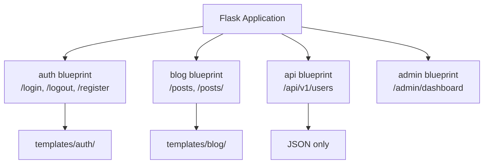

# Blueprints

> As your Flask application grows, putting all routes in a single file becomes unmanageable. Blueprints are Flask's solution for organizing applications into modular, reusable components. Understanding blueprints is essential for building any Flask application larger than a few routes.

## Learning Objectives

After completing this chapter, you will be able to:

- Explain what blueprints are and how they work in Flask
- Create and register blueprints with URL prefixes and templates
- Organize a Flask application using blueprints by feature
- Share data between blueprints using the application context
- Convert a monolithic Flask app to a blueprint-based architecture

## What Are Blueprints?

A **Blueprint** is a collection of routes, templates, static files, and other application components that can be registered on a Flask application. Think of it as a template for an application — it defines the structure but does not create an app itself.



## Creating a Blueprint

```python
from flask import Blueprint, render_template

# Create a blueprint
blog = Blueprint('blog', __name__, 
                 template_folder='templates',
                 static_folder='static')

# Define routes on the blueprint
@blog.route('/')
def index():
    return render_template('blog/index.html')

@blog.route('/<int:post_id>')
def show_post(post_id):
    post = Post.query.get_or_404(post_id)
    return render_template('blog/post.html', post=post)
```

### Blueprint Constructor Parameters

| Parameter | Description |
|-----------|-------------|
| `name` | Blueprint name (used for endpoint names) |
| `import_name` | Pass `__name__` for current module |
| `template_folder` | Templates relative to blueprint |
| `static_folder` | Static files relative to blueprint |
| `static_url_path` | URL path for static files |
| `url_prefix` | Prefix all blueprint routes |

## Registering Blueprints

```python
from flask import Flask

app = Flask(__name__)

# Import and register blueprints
from .blog import blog as blog_blueprint
from .auth import auth as auth_blueprint
from .api import api as api_blueprint

app.register_blueprint(blog_blueprint, url_prefix='/blog')
app.register_blueprint(auth_blueprint, url_prefix='/auth')
app.register_blueprint(api_blueprint, url_prefix='/api/v1')
```

Resulting routes:
- `/blog/` → blog.index
- `/blog/123` → blog.show_post
- `/auth/login` → auth.login
- `/auth/register` → auth.register
- `/api/v1/users` → api.list_users

## Blueprint Structure

A typical blueprint-organized Flask application:

```
myapp/
    __init__.py          # App factory
    config.py            # Configuration
    models.py            # Database models
    extensions.py        # Flask extensions (db, login_manager, etc.)
    
    auth/                # Auth blueprint
        __init__.py      # Blueprint creation and registration
        views.py         # Routes
        forms.py         # WTForms
        templates/
            auth/
                login.html
                register.html
        static/
            auth.css
    
    blog/                # Blog blueprint
        __init__.py
        views.py
        forms.py
        templates/
            blog/
                index.html
                post.html
        static/
            blog.css
    
    api/                 # API blueprint
        __init__.py
        views.py
        serializers.py
```

### Blueprint `__init__.py`

```python
# auth/__init__.py
from flask import Blueprint

auth = Blueprint('auth', __name__, template_folder='templates')

from . import views  # Import views after blueprint creation
```

```python
# auth/views.py
from flask import render_template, redirect, url_for, flash
from . import auth  # The blueprint instance

@auth.route('/login', methods=['GET', 'POST'])
def login():
    # ... login logic ...
    return render_template('auth/login.html')

@auth.route('/register', methods=['GET', 'POST'])
def register():
    # ... registration logic ...
    return render_template('auth/register.html')

@auth.route('/logout')
def logout():
    # ... logout logic ...
    return redirect(url_for('main.index'))
```

> [!IMPORTANT]
> Import views **after** blueprint creation to avoid circular imports. The pattern is: create blueprint in `__init__.py`, import views at the bottom of `__init__.py`.

## Templates in Blueprints

Blueprint templates are namespaced by default. Flask looks for templates in:
1. Application's `templates/` folder
2. Blueprint's `templates/` folder

Blueprint templates should be placed in a subfolder matching the blueprint name:

```
auth/
    templates/
        auth/
            login.html
            register.html
```

Reference them by their full path:

```python
@auth.route('/login')
def login():
    return render_template('auth/login.html')  # Note: auth/login.html
```

This prevents template name collisions between blueprints.

## URL Building with Blueprints

`url_for()` works with blueprints using the format `blueprint.endpoint`:

```html
<!-- In templates -->
<a href="{{ url_for('auth.login') }}">Login</a>
<a href="{{ url_for('blog.show_post', post_id=1) }}">Read More</a>
<a href="{{ url_for('main.index') }}">Home</a>
```

```python
# In Python code
from flask import url_for, redirect

return redirect(url_for('auth.login'))
```

## Before and After Request Hooks

Blueprints can have their own request hooks:

```python
@auth.before_request
def check_auth():
    """Runs before every request in the auth blueprint."""
    pass

@auth.after_request
def add_header(response):
    """Runs after every request in the auth blueprint."""
    response.headers['X-Auth-Blueprint'] = 'true'
    return response
```

## Error Handlers in Blueprints

```python
@auth.errorhandler(404)
def auth_not_found(error):
    return render_template('auth/404.html'), 404
```

## Blueprint Factory Pattern

For maximum flexibility, combine blueprints with the application factory:

```python
# myapp/__init__.py
from flask import Flask
from .extensions import db, login_manager
from .config import config

def create_app(config_name='default'):
    app = Flask(__name__)
    app.config.from_object(config[config_name])
    
    # Initialize extensions
    db.init_app(app)
    login_manager.init_app(app)
    
    # Register blueprints
    from .auth import auth as auth_bp
    from .blog import blog as blog_bp
    from .api import api as api_bp
    
    app.register_blueprint(auth_bp, url_prefix='/auth')
    app.register_blueprint(blog_bp, url_prefix='/blog')
    app.register_blueprint(api_bp, url_prefix='/api/v1')
    
    return app
```

## Common Mistakes

**Mistake: Circular imports**
Importing views before the blueprint is created causes circular imports. Always import views at the bottom of `__init__.py`.

**Mistake: Wrong template paths**
Blueprint templates need the blueprint subfolder prefix: `render_template('blog/index.html')` not `render_template('index.html')`.

**Mistake: Forgetting URL prefix**
Without `url_prefix`, blueprint routes are at the root. This may conflict with other routes.

## Best Practices

- Organize blueprints by feature (auth, blog, admin), not by layer
- Use `url_prefix` to namespace blueprint routes
- Namespace templates in subfolders matching the blueprint name
- Import views after blueprint creation to avoid circular imports
- Keep blueprints cohesive — each should handle one feature area
- Use the application factory pattern with blueprints

## Exercises

1. **Create Blueprints**: Take a monolithic Flask app and reorganize it into auth, blog, and main blueprints.

2. **URL Prefixes**: Register the same blueprint with different URL prefixes for different contexts.

3. **Template Namespacing**: Create two blueprints with a template named `index.html` in each. Verify they do not conflict.

4. **Factory Pattern**: Implement the application factory pattern with blueprints and configuration classes.

## Quiz

**Question 1**: What is a Flask Blueprint? What problem does it solve?

**Question 2**: How do you register a blueprint with a URL prefix?

**Question 3**: Why should blueprint templates be namespaced in subfolders?

**Question 4**: How do you reference a blueprint route in `url_for()`?

**Question 5**: What causes circular imports with blueprints, and how do you avoid them?

## Interview Questions

1. "What are Flask blueprints, and when would you use them?"

2. "How would you organize a large Flask application using blueprints?"

3. "Explain the application factory pattern with blueprints."

4. "How do blueprints handle templates and static files?"

5. "What are common issues when using blueprints, and how do you solve them?"

## Related Chapters

- [[06-Blueprints/Application-Factory]] — Deep dive into the factory pattern
- [[06-Blueprints/Refactoring]] — Converting monolithic apps to blueprints
- [[01-Flask-Core/Routing]] — Flask routing fundamentals

## Official Documentation References

- [Flask Blueprints Documentation](https://flask.palletsprojects.com/en/latest/blueprints/)
- [Flask Application Factories](https://flask.palletsprojects.com/en/latest/patterns/appfactories/)

---

*Next: [[06-Blueprints/Application-Factory]]*