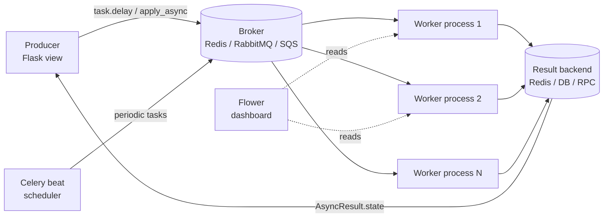
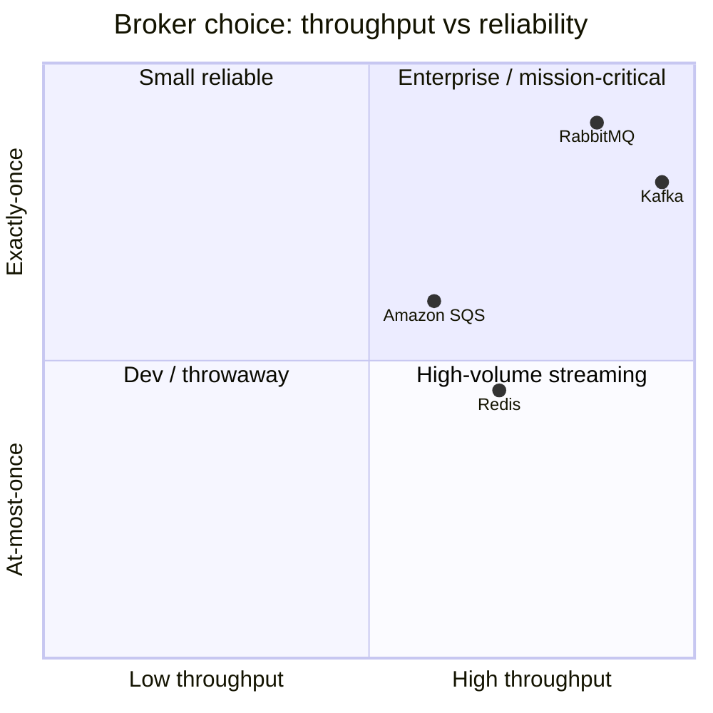
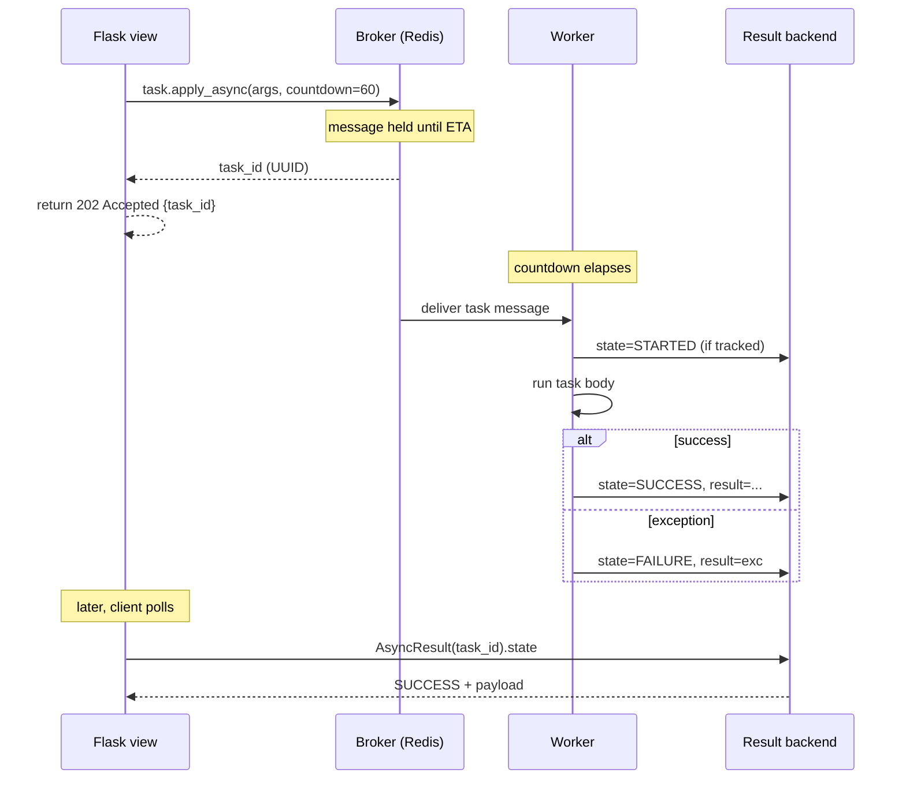
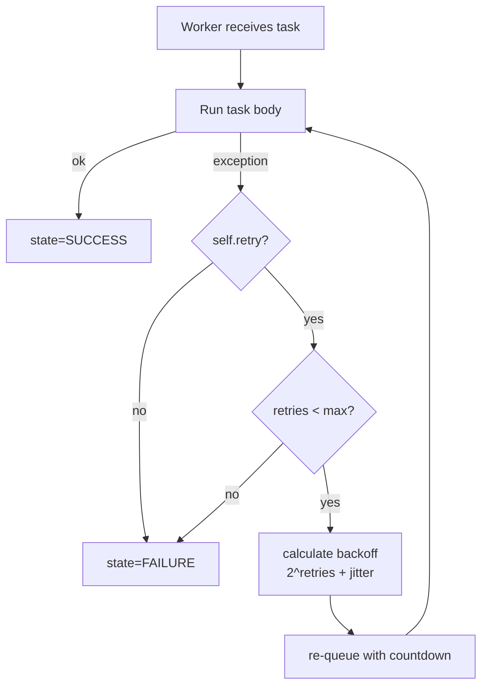
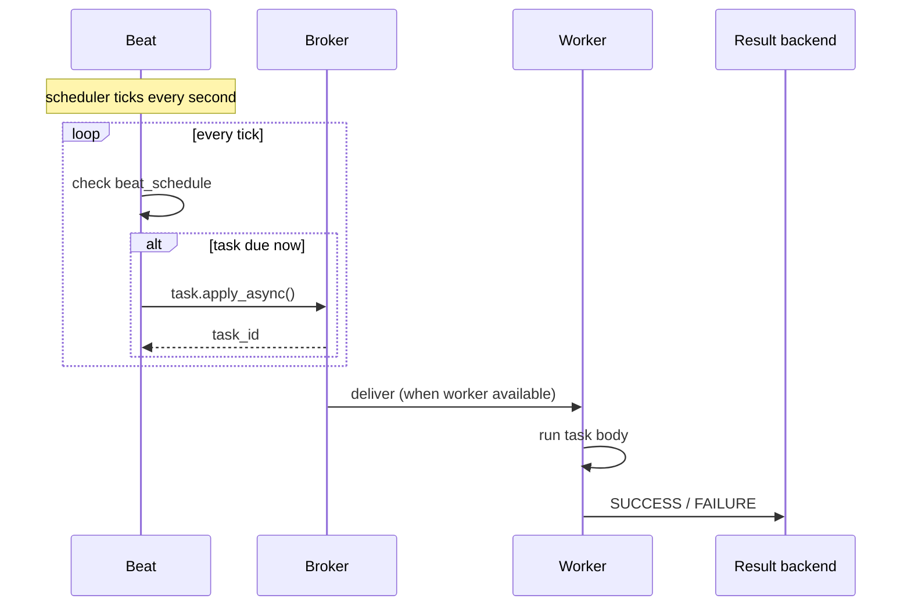
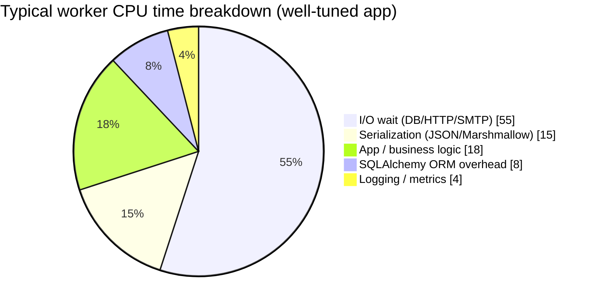
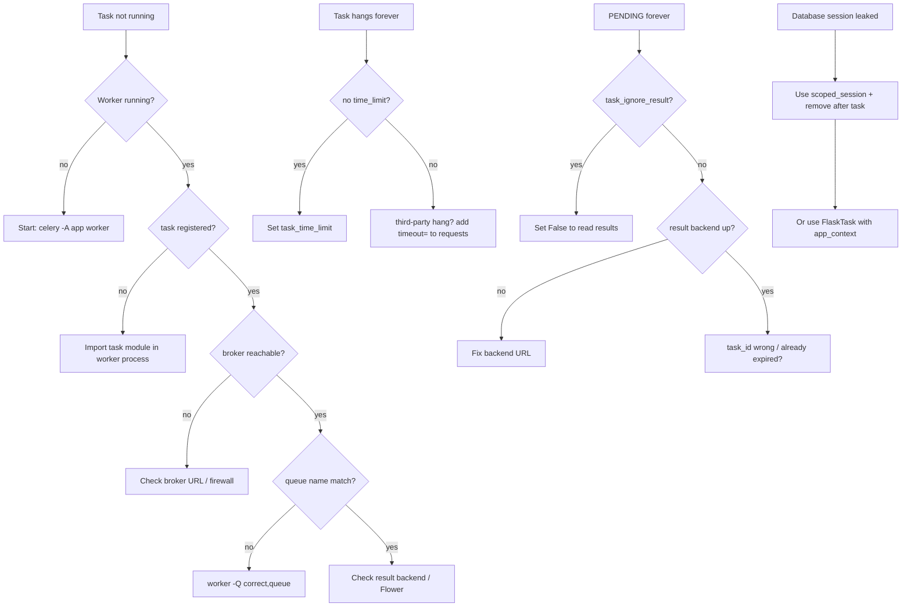

# Celery

#flask #celery #async #task-queue #background-tasks #redis #rabbitmq

> [!info] The Python distributed task queue
> Celery is the most widely used asynchronous task queue/job queue for Python. It lets you push expensive work — email sending, report generation, video transcoding, ML inference, scheduled cleanups — out of the request/response cycle into a separate pool of worker processes that pick jobs off a broker (Redis, RabbitMQ, Amazon SQS).
>
> In Flask, Celery pairs with [[Flask-Mail]] (async email), [[Flask-SQLAlchemy]] (DB-bound tasks), and [[Flask-SocketIO]] (real-time progress from a background job). If you've ever had a Flask view that takes 30 seconds to return, Celery is the canonical answer.

Think of Celery as a **takeout-order restaurant**. The Flask view is the waiter — it takes the customer's order, writes it on a ticket, hands the ticket to the kitchen, and immediately returns to the customer with an order number (`task_id`). The kitchen (a Celery worker) processes tickets as fast as it can, in parallel, from one or more cooks (processes). The customer can later poll the order counter ("is my food ready?") using their order number — that's `AsyncResult.state`.

---

## 1. Overview & Metaphor

### What is a task queue? Why background tasks?

The HTTP request/response cycle is **blocking** and **time-boxed**. A browser typically gives up after 30 seconds, a load balancer after 60, and end users after about 3. Anything that takes longer than ~200 ms degrades perceived performance; anything longer than ~5 s risks a timeout.

The kinds of work that break this model are predictable:

- Sending email (SMTP round-trip = 0.5–5 s per message)
- Generating PDF/Excel reports (CPU + IO bound, 5–60 s)
- Image/video processing (CPU bound, seconds to minutes)
- Calling slow third-party APIs (network bound, 1–30 s)
- Bulk database writes (IO bound, unbounded)
- Webhooks (outbound HTTP)
- Periodic cleanups and rollups

A **task queue** decouples *requesting* the work from *performing* it. The Flask view becomes a thin dispatcher; the actual work happens later, on different machines, possibly in parallel, with retries, monitoring, and persistence.

### Celery architecture: the four pieces



| Component | Role | Examples |
|---|---|---|
| **Producer** | Anything that calls `task.delay()` or `task.apply_async()` | Flask views, CLI commands, other Celery tasks |
| **Broker** | Message bus that queues task requests between producer and workers | Redis, RabbitMQ, Amazon SQS, Apache Kafka (via plugins) |
| **Worker** | Process (or thread/greenlet) that pops messages off the broker and runs the task body | `celery -A app worker -l info` |
| **Result backend** | Store for return values and state (PENDING → STARTED → SUCCESS / FAILURE) | Redis, RPC, SQLAlchemy, Django ORM, Memcached, Elasticsearch |

> [!note] The broker is *not* the result backend
> Beginners often confuse these. The broker carries **task requests** (work to do). The result backend carries **task results** (work completed). You can use Redis for both — but you should use different Redis databases (`db=0` for broker, `db=1` for results) so result reads/writes don't evict pending tasks.

### Brokers compared

| Broker | Throughput | Latency | Priority queues | Reliability | When to choose |
|---|---|---|---|---|---|
| **Redis** | High | Sub-ms | Sort of (multiple lists) | At-most-once by default; once with `task_acks_late` + `redis_backend_use_redis_backend` | Default choice; small-to-medium sites; caching already in place |
| **RabbitMQ** | Very high | Low-ms | Yes (native) | Once-and-only-once with confirms | Mission-critical jobs; complex routing; large fan-out |
| **Amazon SQS** | High | 100ms+ (poll) | FIFO queues only | At-least-once | Serverless/AWS-native; no broker to operate |
| **Apache Kafka** | Very high | Low-ms | No | Once with idempotent producers | Event-streaming pipelines; replay required |

### Result backends compared



| Backend | Use case | Gotcha |
|---|---|---|
| **Redis** | Default for most apps; transient results | TTL results (set `result_expires`) |
| **RPC (amqp)** | RabbitMQ only; results back via reply queue | Doesn't scale to many clients reading the same result |
| **Database (SQLAlchemy)** | Audit trail of every task | High write load; index `task_id` + `date_done` |
| **Django ORM** | Same as SQLAlchemy for Django | Same as above |
| **Memcached** | Ephemeral, very fast | Lossy; don't use for important results |
| **Elasticsearch** | Searchable task log | Heavy; only if you need Kibana dashboards |

---

## 2. Installation

```bash
# Core Celery
pip install "celery>=5.3"

# Redis as broker + result backend (the most common combo)
pip install "celery[redis]>=5.3"

# RabbitMQ as broker
pip install "celery[librabbitmq]>=5.3"

# Auth backend for Redis (if your Redis needs ACL)
pip install redis[hiredis]

# Monitoring dashboard
pip install flower

# SQLAlchemy result backend
pip install "celery[sqlalchemy]>=5.3"

# Beat scheduler with Redis-backed persistent store (for multi-worker beat)
pip install "celery[redis]>=5.3" redis
pip install celery-redbeat
```

Pin Celery to a major version (`celery>=5.3,<6.0`) — Celery 6 will likely drop Python 3.8 and may rename CLI flags.

> [!warning] Celery 4 → 5 breaking changes
> Celery 5 removed the `celery.task` module, removed the old lower-case config names (`celerybeat_schedule` → `beat_schedule`), and made the CLI require the application instance path (`celery -A myapp worker` not `celery worker -A myapp`). If you're migrating from Celery 4, expect to fix imports.

### A minimal Redis + Celery dev stack with Docker

```yaml
# docker-compose.yml
version: "3.9"
services:
  redis:
    image: redis:7-alpine
    ports: ["6379:6379"]
    command: ["redis-server", "--save", "60", "1", "--loglevel", "warning"]

  flower:
    image: mher/flower:2.0
    command: ["celery", "--broker=redis://redis:6379/0", "flower", "--port=5555"]
    ports: ["5555:5555"]
    depends_on: [redis]
```

```bash
docker compose up -d redis flower
celery -A myapp worker -l info     # run worker locally
# open http://localhost:5555 for Flower dashboard
```

---

## 3. Configuration

### The `celery.py` application instance

The canonical pattern (from Celery's own Flask integration guide) is to create a `celery.py` next to your `__init__.py`:

```python
# myapp/celery.py
import os
from celery import Celery, Task

def make_celery(app):
    """Bind Celery tasks to the Flask app context."""
    class FlaskTask(Task):
        def __call__(self, *args, **kwargs):
            with app.app_context():
                return self.run(*args, **kwargs)

    celery_app = Celery(app.import_name, task_cls=FlaskTask)
    celery_app.config_from_object("myapp.celeryconfig")
    return celery_app

celery_app = make_celery(__import__("myapp").create_app())
```

### The `celeryconfig.py`

```python
# myapp/celeryconfig.py
import os

# --- Broker & result backend ---
BROKER_URL = os.environ.get("CELERY_BROKER_URL", "redis://localhost:6379/0")
CELERY_BROKER_URL = BROKER_URL
CELERY_RESULT_BACKEND = os.environ.get("CELERY_RESULT_BACKEND", "redis://localhost:6379/1")

# --- Serialization ---
CELERY_TASK_SERIALIZER = "json"          # never pickle in production
CELERY_RESULT_SERIALIZER = "json"
CELERY_ACCEPT_CONTENT = ["json"]          # reject pickle/yaml payloads
CELERY_TIMEZONE = "UTC"
CELERY_ENABLE_UTC = True

# --- Queues & routing ---
CELERY_TASK_DEFAULT_QUEUE = "default"
CELERY_TASK_ROUTES = {
    "myapp.tasks.send_email": {"queue": "email"},
    "myapp.tasks.generate_report": {"queue": "cpu"},
}
CELERY_TASK_QUEUES = (
    ("default",   {"exchange": "default",   "routing_key": "default"}),
    ("email",     {"exchange": "email",     "routing_key": "email"}),
    ("cpu",       {"exchange": "cpu",       "routing_key": "cpu"}),
)

# --- Reliability ---
CELERY_TASK_ACKS_LATE = True              # ack *after* completion (at-least-once)
CELERY_WORKER_PREFETCH_MULTIPLIER = 1     # 1 task in flight per worker child
CELERY_TASK_REJECT_ON_WORKER_LOST = True  # requeue if worker dies mid-task

# --- Timeouts ---
CELERY_TASK_TIME_LIMIT = 60 * 30          # 30 min hard kill
CELERY_TASK_SOFT_TIME_LIMIT = 60 * 25     # 25 min SoftTimeLimitExceeded

# --- Result expiry ---
CELERY_RESULT_EXPIRES = 60 * 60 * 24      # 24h then evicted
CELERY_TASK_IGNORE_RESULT = False

# --- Beat (periodic tasks) ---
CELERY_BEAT_SCHEDULE = {
    "cleanup-expired-sessions-every-hour": {
        "task": "myapp.tasks.cleanup_expired_sessions",
        "schedule": 3600.0,                # seconds (or crontab)
    },
    "send-daily-digest": {
        "task": "myapp.tasks.send_daily_digest",
        "schedule": __import__("celery.schedules").schedules.crontab(hour=7, minute=0),
    },
}
```

### Full configuration reference (most-used keys)

| Key | Default | What it does |
|---|---|---|
| `broker_url` | — | Broker connection URL |
| `result_backend` | disabled | Where task results are stored |
| `task_serializer` | `json` | How task arguments are encoded |
| `result_serializer` | `json` | How results are encoded |
| `accept_content` | `["json"]` | Which content-types workers accept |
| `timezone` | `"UTC"` | Internal clock for `eta`/`countdown` |
| `enable_utc` | `True` | Store all timestamps in UTC |
| `task_default_queue` | `celery` | Default queue name |
| `task_routes` | `{}` | Map of task name → queue/options |
| `task_queues` | `(default,)` | Declared queues |
| `task_acks_late` | `False` | Ack after success → at-least-once |
| `task_reject_on_worker_lost` | `False` | Re-queue if child dies |
| `worker_prefetch_multiplier` | `4` | Tasks each child holds ready |
| `task_time_limit` | disabled | Hard kill after N seconds |
| `task_soft_time_limit` | disabled | Raise `SoftTimeLimitExceeded` after N seconds |
| `task_ignore_result` | `False` | If True, no result stored (perf) |
| `result_expires` | 1 day | TTL for results in backend |
| `task_default_retry_delay` | 180 s | Default delay between retries |
| `task_max_iterations_per_child` | disabled | Recycle child after N tasks (memory leaks) |
| `worker_max_tasks_per_child` | disabled | Same, newer name |
| `worker_concurrency` | # CPUs | Number of concurrent child processes |
| `beat_schedule` | `{}` | Periodic task definitions |
| `beat_scheduler` | default | Use `redbeat.RedBeatScheduler` for HA beat |

> [!tip] Always set `task_time_limit`
> A task without a hard time limit can hang forever (think: a stuck TCP socket in a third-party API call) and tie up a worker slot indefinitely. Set `task_time_limit` globally to a generous ceiling (e.g., 30 min) and override per-task for shorter jobs.

---

## 4. Basic Usage

### Defining a task

```python
# myapp/tasks.py
from myapp.celery import celery_app

@celery_app.task
def add(x, y):
    return x + y

@celery_app.task
def send_welcome_email(user_id):
    from myapp.models import User
    from myapp.extensions import mail
    from flask_mail import Message
    from flask import current_app

    user = User.query.get(user_id)
    if not user:
        return {"error": "user_not_found"}

    msg = Message(
        subject="Welcome to MyApp",
        recipients=[user.email],
        body=f"Hi {user.name}, thanks for signing up!",
    )
    mail.send(msg)
    return {"sent_to": user.email}
```

### Calling tasks

```python
from myapp.tasks import add, send_welcome_email

# 1. Simplest: fire-and-forget
result = add.delay(2, 3)
print(result.id)            # task UUID
print(result.state)         # PENDING / STARTED / SUCCESS / FAILURE
print(result.get(timeout=5))  # 5  (blocks; never do this in a Flask view!)

# 2. apply_async with options
result = send_welcome_email.apply_async(
    args=[42],
    queue="email",
    countdown=60,             # run 60 s from now
    expires=3600,             # cancel if not started within 1h
    retry=True,
    retry_policy={
        "max_retries": 3,
        "interval_start": 0.2,
        "interval_step": 0.5,
        "interval_max": 3.0,
    },
)

# 3. Calling the function synchronously (no queue) — useful in tests
assert add(2, 3) == 5
assert add.run(2, 3) == 5
assert add.apply(args=[2, 3]).get() == 5
```

### Task states

| State | Meaning |
|---|---|
| `PENDING` | Sent to broker, no worker has started it yet (or never will if worker is down) |
| `STARTED` | Worker picked it up (requires `task_track_started = True`) |
| `SUCCESS` | Returned without exception; result available |
| `FAILURE` | Raised; `result.result` is the exception |
| `RETRY` | Failed but scheduled to retry; `result.result` is the original exception |
| `REVOKED` | Cancelled via `result.revoke()` |

```python
from celery.result import AsyncResult
from myapp.celery import celery_app

res = AsyncResult(task_id, app=celery_app)
if res.successful():
    print("Returned:", res.result)
elif res.failed():
    print("Failed:", res.result)        # the exception instance
elif res.state in ("PENDING", "STARTED"):
    print("Still running…")
```

### Mermaid: task execution lifecycle



---

## 5. Intermediate Patterns

### `@shared_task` for reusable apps

If you're writing a Flask *extension* or a reusable package, you don't own the `celery_app` instance — the host application does. Use `@shared_task` which registers on whatever Celery app is current at runtime:

```python
# myapp/extensions.py  (a reusable Flask-Celery email extension)
from celery import shared_task

@shared_task(bind=True, max_retries=5, default_retry_delay=30)
def send_email_task(self, to, subject, body):
    try:
        # extension code uses host's mail config
        ...
    except smtplib.SMTPServerDisconnected as exc:
        raise self.retry(exc=exc)
```

### Retries with exponential backoff

```python
import random
from myapp.celery import celery_app

@celery_app.task(bind=True, max_retries=5)
def fetch_third_party(self, url):
    try:
        return requests.get(url, timeout=10).json()
    except (requests.Timeout, requests.ConnectionError) as exc:
        # exponential backoff with jitter
        delay = min(60, (2 ** self.request.retries) + random.uniform(0, 1))
        raise self.retry(exc=exc, countdown=delay)
```

> [!tip] Always pass `exc` to `self.retry`
> Without `exc=`, the retry doesn't preserve the original exception. If the final retry fails, you'll see `Retry: Retry in 60s` instead of the actual `SMTPServerDisconnected`, making debugging much harder.

### Mermaid: retry flow



### Task arguments: `args`, `kwargs`, `options`

| Option | Type | Effect |
|---|---|---|
| `countdown` | int (seconds) | Run `countdown` seconds from now |
| `eta` | datetime (UTC, tz-aware) | Run at a specific wall-clock time |
| `expires` | int (s) or datetime | Discard if not started by then |
| `retry` | bool | Retry on connection failure (default True) |
| `retry_policy` | dict | `{max_retries, interval_start, interval_step, interval_max}` |
| `queue` | str | Override routing |
| `routing_key` | str | Override routing |
| `priority` | int 0–255 | Priority (RabbitMQ priority queues only) |
| `serializer` | str | Override `task_serializer` |
| `compression` | str | `gzip` / `bzip2` (broker must support) |

> [!warning] `eta` must be tz-aware UTC
> `eta=datetime(2024, 6, 1, 12, 0)` (naive) will run at the *local* 12:00 on a worker configured with `timezone="UTC"`. Always use `datetime.now(timezone.utc)` or `datetime.fromtimestamp(..., tz=timezone.utc)`.

### Task routing by queue

```python
# Send to a specific queue at call time
send_welcome_email.apply_async(args=[42], queue="email")

# Or rely on task_routes in config
CELERY_TASK_ROUTES = {
    "myapp.tasks.send_*": {"queue": "email"},
    "myapp.tasks.transcode_video": {"queue": "cpu", "priority": 5},
}
```

Run dedicated workers per queue:

```bash
celery -A myapp worker -Q email -c 8 -n email@%h
celery -A myapp worker -Q cpu -c 2 -n cpu@%h   # few procs, CPU-bound
celery -A myapp worker -Q default -c 4 -n default@%h
```

### Periodic tasks with `celery beat`

```python
from celery.schedules import crontab

CELERY_BEAT_SCHEDULE = {
    # every 5 minutes
    "poll-inbox": {
        "task": "myapp.tasks.poll_inbox",
        "schedule": 300.0,
    },
    # daily at 02:30 UTC
    "nightly-backup": {
        "task": "myapp.tasks.run_backup",
        "schedule": crontab(hour=2, minute=30),
    },
    # every Monday at 09:00 UTC
    "weekly-report": {
        "task": "myapp.tasks.weekly_report",
        "schedule": crontab(hour=9, minute=0, day_of_week=1),
    },
    # on the 1st of every month at midnight
    "monthly-invoices": {
        "task": "myapp.tasks.generate_invoices",
        "schedule": crontab(minute=0, hour=0, day_of_month=1),
    },
}
```

### Mermaid: a day in the life of beat

```mermaid
gantt
    title Sample beat schedule across 24h (UTC)
    dateFormat HH:mm
    axisFormat %H:%M
    section Cleanup
    cleanup-expired-sessions (every 1h) :crit, 0000, 24h
    section Digests
    send-daily-digest (07:00) :milestone, 0700, 0m
    section Backups
    nightly-backup (02:30) :milestone, 0230, 0m
    section Reports
    weekly-report (Mon 09:00) :milestone, 0900, 0m
    section Invoices
    monthly-invoices (1st 00:00) :milestone, 0000, 0m
    section Polling
    poll-inbox (every 5m) :active, 0000, 5m
```



`crontab` keyword arguments:

| Argument | Allowed values |
|---|---|
| `minute` | `0-59`, `*`, list, `"*/15"`, `"15,30,45"` |
| `hour` | `0-23`, `*`, list, `"*/2"` |
| `day_of_week` | `0-6` (0=Sun), `mon`/`tue`/`wed`/`thu`/`fri`/`sat`/`sun`, list |
| `day_of_month` | `1-31`, `*`, `"*/5"`, `"1,15"` |
| `month_of_year` | `1-12`, `*`, `"1,4,7,10"` |

```bash
celery -A myapp beat -l info        # in a separate process
celery -A myapp worker -B -l info   # embedded beat (DEV ONLY — not HA)
```

> [!danger] Never run beat in production with `-B`
> Embedded beat works only if you have a single worker. With multiple workers, beat runs *N times* and every scheduled task fires *N times*. Run `celery beat` in its own process (one replica), or use `celery-redbeat` for HA beat.

### Mermaid: periodic scheduling flow



### Task revocation

```python
from myapp.celery import celery_app

# Cancel a single task (if not yet started)
celery_app.control.revoke(task_id, terminate=False)

# Kill a running task (sends SIGTERM then SIGKILL)
celery_app.control.revoke(task_id, terminate=True, signal="SIGKILL")

# Revoke + don't run again on a worker restart
celery_app.control.revoke(task_id, terminate=False, signal="SIGTERM")

# Revoke all *pending* tasks matching a pattern
celery_app.control.revoke_by_stamped_state(stamp="batch_42")

# Time-limited revocation
celery_app.control.revoke(task_id, expires=3600)
```

### Task priority (RabbitMQ only)

```python
CELERY_TASK_QUEUE_MAX_PRIORITY = 10  # 0..10 priority levels

urgent_task.apply_async(args=[...], priority=10)
normal_task.apply_async(args=[...], priority=5)
```

Redis "priority" is faked with multiple queues — for true priority, use RabbitMQ priority queues.

---

## 6. Advanced Usage

### Canvas: composing tasks

Celery's **canvas** is the DSL for composing tasks into workflows. Five primitives:

```mermaid
mindmap
  root((Canvas))
    chain
      sequential pipeline
      output feeds next
      chain(fetch, parse, store)
    group
      parallel fan-out
      results as ordered list
      group(thumbnail.s(i) for i in sizes)
    chord
      group + reducer
      barrier synchronization
      chord(crawl_group, total)
    immutable sig (.si)
      ignores prior result
      for fan-out with own args
    map / starmap / chunks
      shortcut over iterables
      split-into-N-chunks
```

| Primitive | Signature | Use case |
|---|---|---|
| **chain** | `chain(a.s(2), b.s(), c.s())` | Sequential pipeline; output of one feeds into next |
| **group** | `group(a.s(i) for i in range(10))` | Parallel fan-out; results as a list |
| **chord** | `chord(group(...), reducer.s())` | Parallel + reduce (barrier) |
| **map** | `a.map([1, 2, 3])` | Apply task to each item (shortcut for group) |
| **starmap** | `a.starmap([(1, 2), (3, 4)])` | Apply task with multiple args per call |
| **chunks** | `a.chunks(range(100), 10)` | Split iterable into N chunks → group |

#### chain

```python
from celery import chain

@celery_app.task
def fetch(url): return requests.get(url).text
@celery_app.task
def parse(html): return len(html.split())
@celery_app.task
def store(word_count): return db.save(word_count)

# fetch → parse → store, each output fed to the next as first arg
workflow = chain(fetch.s("https://example.com"), parse.s(), store.s())
result = workflow.apply_async()
result.get()   # final result
```

#### group

```python
from celery import group

@celery_app.task
def thumbnail(path, size): return f"{path}_{size}.png"

# Run 4 thumbnails in parallel
g = group(thumbnail.s("img1.png", size) for size in [64, 128, 256, 512])
result = g.apply_async()
result.get()  # ["img1_64.png", "img1_128.png", ...]  in order
result.ready()           # True only when ALL done
result.successful()      # True only if ALL succeeded
```

#### chord (group + reduce)

```python
from celery import chord

@celery_app.task
def crawl(url): return len(requests.get(url).text)
@celery_app.task
def total(sizes):
    return sum(sizes)

urls = ["https://a.com", "https://b.com", "https://c.com"]
workflow = chord((crawl.s(u) for u in urls), total.s())
result = workflow.apply_async()
result.get()  # e.g. 12453 — sum of all byte counts
```

> [!warning] Chords can deadlock with `task_acks_late=True`
> A chord's reducer is queued only after *all* body tasks ack. If any body task's worker dies after `task_acks_late` is set, the reducer never fires. Either use `chord_unlock` retry settings or set `task_reject_on_worker_lost=True`.

#### Immutable signatures with `.si()`

```python
# Normal .s() chains pass prior result as first arg.
# .si() (immutable signature) ignores prior result — useful for fan-out where
# each task takes its own args.

@celery_app.task
def notify(user_id, message): ...

workflow = chain(
    generate_report.s(user_id),
    chord(
        group(notify.si(user_id, "email").set(queue="email"),
              notify.si(user_id, "slack").set(queue="slack")),
        log_completion.s(),
    ),
)
```

### Worker pools



| Pool | Concurrency model | Best for |
|---|---|---|
| **prefork** (default) | multiprocessing | CPU-bound work; default; isolates failures |
| **eventlet** | green threads | Many I/O-bound tasks (network); 1000s of concurrent |
| **gevent** | green threads | Same as eventlet |
| **solo** | single-tasking | Debugging; tasks that mutate global state |
| **threads** | OS threads | Mixed CPU + I/O; tasks that hold non-thread-safe libs |

```bash
celery -A myapp worker --pool=prefork --concurrency=4
celery -A myapp worker --pool=eventlet --concurrency=1000
celery -A myapp worker --pool=gevent --concurrency=500
celery -A myapp worker --pool=solo
celery -A myapp worker --pool=threads --concurrency=20
```

> [!danger] Monkey-patching order
> When using `eventlet` or `gevent`, the monkey-patch **must** happen *before* any other import (including Flask, SQLAlchemy, Redis). Put `import eventlet; eventlet.monkey_patch()` as the very first line of your entry-point module, or use the `--pool=eventlet` flag (Celery handles it for you).

### Monitoring with Flower

```bash
pip install flower
celery -A myapp flower --port=5555 --broker=redis://localhost:6379/0
```

Flower exposes a web UI on `:5555` plus a JSON API:

```bash
curl http://localhost:5555/api/tasks | jq .
curl -X POST http://localhost:5555/api/task/async-apply -d 'args=[1,2]' -d 'kwargs={}'
```

### Sending progress from a task to [[Flask-SocketIO]]

```python
from myapp.extensions import socketio

@celery_app.task(bind=True)
def long_running_import(self, file_id):
    total = 1000
    for i in range(total):
        process_row(file_id, i)
        if i % 50 == 0:
            self.update_state(state="PROGRESS", meta={"current": i, "total": total})
            socketio.emit("import_progress", {"current": i, "total": total},
                          to=f"file_{file_id}", namespace="/imports")
    return {"current": total, "total": total}
```

See [[Flask-SocketIO]] for the matching client.

---

## 7. Common Pitfalls & Troubleshooting

### Mermaid: troubleshooting flow



### Symptom / cause / fix table

| Symptom | Likely cause | Fix |
|---|---|---|
| `Received unregistered task of type 'myapp.tasks.foo'` | Worker didn't import the task module | Add `include=["myapp.tasks"]` to `Celery(...)` or import in `celery.py` |
| Task stays `PENDING` forever | Wrong `task_id`, result backend down, or `task_ignore_result=True` | Verify id; check backend; set `task_ignore_result=False` |
| Worker picks up task twice | `task_acks_late=True` + worker crash | Make task idempotent; this is by design (at-least-once) |
| `SoftTimeLimitExceeded` after 25 min | Hit global soft limit | Override per-task: `@task(soft_time_limit=3600)` |
| `ConnectionError: Lost connection to broker` | Broker restarted; no retry | Set `broker_connection_retry_on_startup=True` (Celery 5.3+) |
| `kombu.exceptions.EncodeError: Object of type User is not JSON serializable` | Passing a SQLAlchemy model instance | Pass `user.id`, fetch inside task — never pass ORM objects |
| Beat fires every task N times | Multiple beat processes running | Run beat in 1 replica (or use `celery-redbeat`) |
| `celery -A myapp worker` says no module `myapp` | Wrong CWD / `PYTHONPATH` | Run from project root; install your app with `pip install -e .` |
| `WorkerLostError: Worker exited prematurely` | Child crashed (segfault, OOM, `sys.exit`) | Check `dmesg`; reduce `worker_max_tasks_per_child`; profile memory |
| Email task works in shell but fails in worker | Worker not in Flask app context | Use `FlaskTask` from §3; or `with app.app_context():` inside task |
| SQLAlchemy `DetachedInstanceError` in task | ORM object passed across process boundary | Pass primitives (ids, dicts), re-fetch inside task |

### The big four killers

> [!danger] 1. Passing non-JSON-serializable args
> With `task_serializer="json"`, you cannot pass SQLAlchemy models, `datetime` (without ISO), `Decimal`, `set`, `bytes`, or custom classes. The error message is obscure (`EncodeError`). **Always pass primitives** (ints, strings, lists, dicts). Fetch domain objects inside the task.

> [!danger] 2. Database sessions in prefork workers
> Each worker child is its own process. If you create a SQLAlchemy session in the parent and use it in a task, you'll see `DetachedInstanceError` or stale data. Use `scoped_session` and call `db.session.remove()` at the end of each task, or use the `FlaskTask` wrapper from §3 which gives every task its own app context.

> [!danger] 3. Missing `CELERY_BROKER_URL` in worker
> If your config lives in Flask's `app.config` and you instantiate Celery before the Flask app is loaded, the broker URL will be empty and the worker will try to connect to `amqp://guest@localhost//`. Always load env vars in `celeryconfig.py` directly.

> [!danger] 4. Forgetting to run beat
> The most common Celery bug report: "my periodic tasks aren't running". Beat is a separate process. You must start it: `celery -A myapp beat -l info` (separate from workers). In Docker, this means a separate service.

---

## 8. Best Practices

### Idempotency

Every task should be safe to run twice. Workers crash, network blips cause requeue — your task will be retried. Patterns:

```python
@celery_app.task(bind=True)
def charge_card(self, order_id):
    order = Order.query.get(order_id)
    if order.status == "paid":        # already done → no-op
        return {"skipped": "already_paid"}
    # ... charge ...
    order.status = "paid"
    db.session.commit()
```

### Pass IDs, not objects

```python
# BAD — tries to JSON-serialize a SQLAlchemy instance
send_email.delay(user)

# GOOD — pass primitive id, fetch inside the task
send_email.delay(user.id)
```

### Set hard and soft time limits

```python
@celery_app.task(time_limit=60, soft_time_limit=50)
def call_external_api(url):
    return requests.get(url, timeout=40).json()
```

### Use `task_acks_late` + `task_reject_on_worker_lost`

These two together give you at-least-once delivery — if a worker OOMs mid-task, the task is re-queued. Combined with idempotent tasks, this is robust.

### Don't `result.get()` in a Flask view

`AsyncResult.get(timeout=...)` blocks the request thread. Either:

1. Return `202 Accepted` with `{task_id}` immediately and let the client poll
2. Use [[Flask-SocketIO]] to push the result back when done
3. Use a webhook: pass a `callback_url` arg, POST result to it from the task

### Set `worker_max_tasks_per_child`

Recycle worker children after N tasks to mitigate memory leaks (especially in long-running tasks that import C extensions like Pillow or numpy):

```python
CELERY_WORKER_MAX_TASKS_PER_CHILD = 1000
```

### Use `celery-redbeat` for HA beat

If your scheduled tasks are critical, run beat in HA mode with Redis as the lock store:

```python
CELERY_BEAT_SCHEDULER = "redbeat.RedBeatScheduler"
CELERY_REDBEAT_REDIS_URL = "redis://localhost:6379/2"
```

You can now run multiple beat replicas; only one will fire tasks at a time.

### Send results to a real DB for auditing

If you need a permanent audit trail of every task run, use the SQLAlchemy result backend or roll your own:

```python
@celery_app.task
@db_task_audit  # decorator that logs start/stop/error to a TaskRun table
def important_task(...): ...
```

### Logging

```python
import logging
logger = logging.getLogger(__name__)

@celery_app.task(bind=True)
def my_task(self, x):
    logger.info("Processing %s", x, extra={"task_id": self.request.id})
```

Configure `Celery`'s `worker_hijack_root_logger=False` to use your own structured logging (e.g., structlog).

### One queue per workload shape

Don't mix CPU-bound video transcoding with fast email sends on one queue — the email user waits behind a 30-min video. Use separate queues and dedicated workers per workload class.

---

## 9. Integration with Other Extensions

### [[Flask-SQLAlchemy]]

The classic integration pitfall is ORM session management. The cleanest pattern is the `FlaskTask` from §3, which wraps every task in an app context, so `db.session` is correctly scoped:

```python
@celery_app.task(bind=True)
def update_user_stats(self, user_id):
    user = User.query.get(user_id)        # uses Flask-SQLAlchemy session
    user.last_login_at = datetime.now(timezone.utc)
    db.session.commit()
    # FlaskTask.__call__ exits app context → db.session.remove() auto-called
```

For bulk work, prefer `db.session.bulk_save_objects()` or Core-level `insert()` for 10x–100x speedups.

### [[Flask-Mail]]

```python
@celery_app.task(bind=True, max_retries=5, default_retry_delay=30)
def send_email(self, to, subject, body):
    from myapp.extensions import mail
    from flask_mail import Message
    try:
        msg = Message(subject=subject, recipients=[to], body=body)
        mail.send(msg)
    except smtplib.SMTPException as exc:
        raise self.retry(exc=exc)
```

See [[Flask-Mail]] for the full async email pattern with templated HTML.

### [[Flask-Caching]]

Two patterns:

1. **Cache task results** — Use `@cache.memoize()` on the task function itself; idempotent results don't need re-execution.
2. **Cache invalidation from tasks** — When a task mutates shared state, call `cache.delete(key)` inside the task body to invalidate.

```python
@celery_app.task
def regenerate_dashboard():
    data = compute_expensive_dashboard()
    cache.set("dashboard:summary", data, timeout=3600)
    return {"cached_at": datetime.now(timezone.utc).isoformat()}
```

### [[Flask-SocketIO]]

For real-time progress from a long task:

```python
@celery_app.task(bind=True)
def import_csv(self, file_id):
    total = sum(1 for _ in open(file_path))
    for i, row in enumerate(reader):
        process(row)
        if i % 100 == 0:
            socketio.emit("progress", {"current": i, "total": total},
                          to=f"file_{file_id}")
    socketio.emit("done", {"file_id": file_id}, to=f"file_{file_id}")
```

### [[Flask-JWT-Extended]]

Don't try to forward JWT tokens into tasks — they expire and break. Instead, pass `user_id` and let the task fetch a fresh system token if it needs to call back into the API.

### [[Marshmallow]]

Serialize task arguments with Marshmallow before sending:

```python
@celery_app.task
def process_user(user_dict):
    user = UserSchema().load(user_dict)  # validated at task boundary
    ...
```

This protects against malformed payloads sitting in the broker for hours before a worker reads them.

---

## 10. Real-World Example

A complete, runnable single-file Flask + Celery app demonstrating email sending + report generation + scheduled cleanup.

```python
# myapp.py — single-file Flask + Celery demo
import os, time, random
from datetime import datetime, timezone
from flask import Flask, request, jsonify, url_for
from celery import Celery, Task
from celery.schedules import crontab

# --- Configuration ---
BROKER_URL = os.environ.get("BROKER_URL", "redis://localhost:6379/0")
BACKEND_URL = os.environ.get("BACKEND_URL", "redis://localhost:6379/1")

# --- Flask application factory ---
def create_app():
    app = Flask(__name__)
    app.config["SECRET_KEY"] = "dev-secret"

    # ----- Celery -----
    class FlaskTask(Task):
        def __call__(self, *args, **kwargs):
            with app.app_context():
                return self.run(*args, **kwargs)

    celery = Celery(app.import_name, task_cls=FlaskTask)
    celery.conf.update(
        broker_url=BROKER_URL,
        result_backend=BACKEND_URL,
        task_serializer="json",
        result_serializer="json",
        accept_content=["json"],
        timezone="UTC",
        enable_utc=True,
        task_acks_late=True,
        task_reject_on_worker_lost=True,
        worker_prefetch_multiplier=1,
        task_time_limit=60 * 30,
        task_soft_time_limit=60 * 25,
        result_expires=60 * 60 * 24,
        beat_schedule={
            "cleanup-tokens-every-hour": {
                "task": "myapp.cleanup_expired_tokens",
                "schedule": 3600.0,
            },
            "daily-digest": {
                "task": "myapp.send_daily_digest",
                "schedule": crontab(hour=7, minute=0),
            },
        },
    )
    app.celery = celery

    # ----- Mock services -----
    app.tokens = set()

    # ----- Routes -----
    @app.post("/signup")
    def signup():
        email = request.json["email"]
        # Fire-and-forget welcome email
        result = send_welcome_email.delay(email)
        return jsonify({"message": "signed up", "email_task_id": result.id}), 202

    @app.post("/reports/generate")
    def generate():
        report_type = request.json.get("type", "monthly")
        result = generate_report.apply_async(
            args=[report_type],
            queue="cpu",
            countdown=2,                # small delay so client can connect to poll
        )
        return jsonify({"report_task_id": result.id,
                        "poll": url_for("task_status", task_id=result.id)}), 202

    @app.get("/tasks/<task_id>")
    def task_status(task_id):
        r = celery.AsyncResult(task_id)
        return jsonify({"state": r.state,
                        "result": r.result if r.successful() else None,
                        "error": str(r.result) if r.failed() else None})

    @app.post("/tokens/<token>")
    def add_token(token):
        app.tokens.add(token)
        return jsonify({"tokens": list(app.tokens)})

    return app

# --- Celery tasks (module-level so worker can import them) ---
app = create_app()
celery = app.celery

@celery.task(bind=True, max_retries=5, default_retry_delay=30)
def send_welcome_email(self, email):
    """Mock sending email with simulated SMTP failure."""
    try:
        if random.random() < 0.3:               # simulate 30% failure rate
            raise ConnectionError("SMTP timeout")
        print(f"✉️  Welcome email sent to {email}")
        return {"email": email, "sent_at": datetime.now(timezone.utc).isoformat()}
    except ConnectionError as exc:
        delay = min(60, 2 ** self.request.retries)
        raise self.retry(exc=exc, countdown=delay)

@celery.task(bind=True)
def generate_report(self, report_type):
    """CPU-bound mock report generator with progress updates."""
    steps = 10
    for i in range(steps):
        time.sleep(0.5)                          # simulate heavy work
        self.update_state(state="PROGRESS",
                          meta={"current": i + 1, "total": steps})
    return {"report_type": report_type,
            "rows": 1234,
            "generated_at": datetime.now(timezone.utc).isoformat()}

@celery.task
def cleanup_expired_tokens():
    """Mock cleanup — would delete expired rows from DB."""
    removed = len(app.tokens)
    app.tokens.clear()
    print(f"🧹 Cleaned up {removed} tokens")
    return {"removed": removed}

@celery.task
def send_daily_digest():
    print("📬 Sending daily digest to all users…")
    return {"sent": True}

if __name__ == "__main__":
    app.run(debug=True, port=5000)
```

### Docker Compose: web + worker + beat + flower

```yaml
# docker-compose.yml
version: "3.9"
services:
  redis:
    image: redis:7-alpine
    ports: ["6379:6379"]

  web:
    build: .
    command: python myapp.py
    environment:
      BROKER_URL: redis://redis:6379/0
      BACKEND_URL: redis://redis:6379/1
    ports: ["5000:5000"]
    depends_on: [redis]

  worker-cpu:
    build: .
    command: celery -A myapp.celery worker -Q cpu -c 2 -l info
    environment:
      BROKER_URL: redis://redis:6379/0
      BACKEND_URL: redis://redis:6379/1
    depends_on: [redis]

  worker-default:
    build: .
    command: celery -A myapp.celery worker -Q default,celery -c 4 -l info
    environment:
      BROKER_URL: redis://redis:6379/0
      BACKEND_URL: redis://redis:6379/1
    depends_on: [redis]

  beat:
    build: .
    command: celery -A myapp.celery beat -l info
    environment:
      BROKER_URL: redis://redis:6379/0
      BACKEND_URL: redis://redis:6379/1
    depends_on: [redis]

  flower:
    image: mher/flower:2.0
    command: celery --broker=redis://redis:6379/0 flower --port=5555
    ports: ["5555:5555"]
    depends_on: [redis]
```

### Try it

```bash
docker compose up -d
# Sign up — fires welcome email task (may retry)
curl -X POST localhost:5000/signup -H "Content-Type: application/json" \
     -d '{"email":"alice@example.com"}'
# Generate a report — long-running CPU task with progress
curl -X POST localhost:5000/reports/generate -H "Content-Type: application/json" \
     -d '{"type":"monthly"}'
# Poll status
curl localhost:5000/tasks/<task_id>
# Watch the dashboard at http://localhost:5555
```

### Production deployment checklist

- [ ] Broker (Redis or RabbitMQ) deployed with persistence enabled
- [ ] Separate Redis DB for broker vs. result backend
- [ ] `task_acks_late=True` + `task_reject_on_worker_lost=True` + idempotent tasks
- [ ] `task_time_limit` set globally, narrower limits per heavy task
- [ ] One beat process (HA via `celery-redbeat` if uptime matters)
- [ ] Dedicated worker per queue shape (CPU-bound vs I/O-bound)
- [ ] `worker_max_tasks_per_child=1000` to recycle for memory leaks
- [ ] Flower deployed behind auth (HTTP Basic + TLS, or OAuth proxy)
- [ ] Sentry SDK installed: `sentry_sdk.init(...)` + Celery integration
- [ ] Structured logging (structlog/json) shipped to ELK/Loki
- [ ] Health check: `celery -A app inspect ping`
- [ ] Alerts: queue depth, failed-task rate, worker offline
- [ ] CI: `celery -A app check` (validates beat schedule and config)

---

## 11. References

### Official

- **Celery docs** — https://docs.celeryq.dev
- **Celery 5.x changelog** — https://docs.celeryq.dev/en/stable/history/
- **Canvas (chain/group/chord)** — https://docs.celeryq.dev/en/stable/userguide/canvas.html
- **Routing** — https://docs.celeryq.dev/en/stable/userguide/routing.html
- **Beat** — https://docs.celeryq.dev/en/stable/userguide/periodic-tasks.html
- **Monitoring (Flower)** — https://flower.readthedocs.io
- **Celery + Flask guide** — https://flask.palletsprojects.com/en/latest/patterns/celery/
- **Celery GitHub** — https://github.com/celery/celery

### Brokers & backends

- Redis — https://redis.io/docs
- RabbitMQ — https://www.rabbitmq.com/docs
- Amazon SQS broker — https://github.com/celery/celery/blob/main/celery/backends/s3.py
- celery-redbeat (HA beat) — https://github.com/sibson/redbeat

### Tutorials & deep dives

- "Celery in Production" — https://blog.sentry.io
- "Celery best practices" — https://celery.readthedocs.io
- "Why your celery task runs twice" — https://docs.celeryq.dev/en/stable/faq.html

### Cross-vault wikilinks

- [[Flask-SQLAlchemy]] — ORM session management inside tasks
- [[Flask-Mail]] — async email with retries
- [[Flask-Caching]] — cache invalidation from tasks; memoize task results
- [[Flask-SocketIO]] — real-time progress from running tasks
- [[Flask-JWT-Extended]] — passing user identity into background work
- [[Marshmallow]] — validating task payloads
- [[Project-Structure]] — where `celery.py` and `tasks/` live
- [[Security-Best-Practices]] — never pass secrets in task args, audit task calls
- [[Performance-Optimization]] — prefetch tuning, pool choice, queue isolation

---

> [!quote] Final metaphor
> Celery is the **kitchen behind the restaurant**. Flask is the waitstaff — it should never be caught cooking. Move every expensive job out of the request cycle, give it an id, let the customer poll or get a push notification, and never block a worker thread on `result.get()` inside a view. Do that, and your Flask app will scale from "works on my laptop" to "serves millions of requests an hour" without changing a single line of view code.
