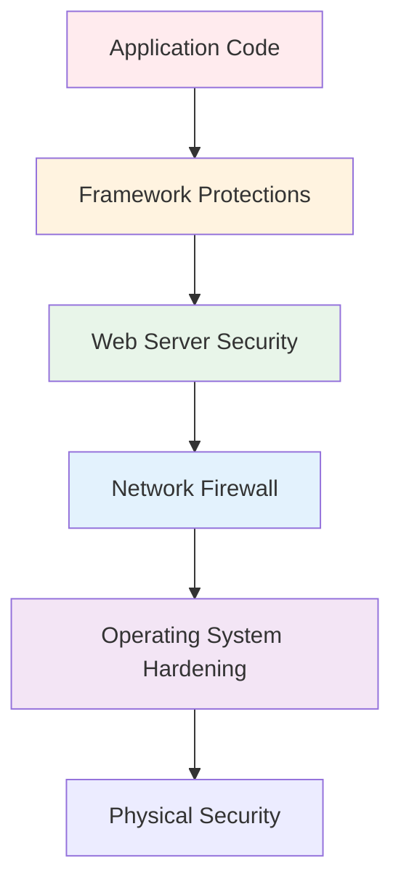

# Security Overview

> Security is not a feature you add at the end — it is a mindset you apply throughout development. Flask provides the tools to build secure applications, but it is your responsibility to use them correctly. This chapter covers the essential security concepts, common vulnerabilities, and Flask-specific protections every developer must understand.

## Learning Objectives

After completing this chapter, you will be able to:

- Identify and mitigate the OWASP Top 10 vulnerabilities in Flask applications
- Configure Flask for secure production deployments
- Implement proper authentication and authorization controls
- Protect against XSS, CSRF, SQL injection, and session hijacking
- Apply security headers and configure HTTPS properly
- Understand the principle of defense in depth

## Security Principles

### Defense in Depth

Security is not a single layer but multiple overlapping layers. If one fails, others protect you:



### Principle of Least Privilege

Grant the minimum permissions necessary. Your Flask application should:
- Run as a non-root user
- Use a dedicated database user with limited permissions
- Not have write access to code directories
- Only access required network resources

### Never Trust User Input

Every piece of data from the outside world is potentially malicious:
- Form inputs
- URL parameters
- File uploads
- Headers
- Cookies
- Database entries (could be compromised)

## OWASP Top 10 for Flask

### 1. Broken Access Control

**The Problem:** Users can access resources or perform actions they should not.

**Flask Solutions:**

```python
from flask_login import login_required, current_user
from functools import wraps

def admin_required(f):
    @wraps(f)
    def decorated_function(*args, **kwargs):
        if not current_user.is_authenticated or not current_user.is_admin:
            abort(403)
        return f(*args, **kwargs)
    return decorated_function

@app.route('/admin')
@login_required
@admin_required
def admin_dashboard():
    return render_template('admin/dashboard.html')

# Check ownership
@app.route('/post/<int:post_id>/edit', methods=['POST'])
@login_required
def edit_post(post_id):
    post = Post.query.get_or_404(post_id)
    if post.author_id != current_user.id and not current_user.is_admin:
        abort(403)
    # ... edit logic ...
```

### 2. Cryptographic Failures

**The Problem:** Sensitive data is exposed through weak encryption or improper handling.

**Flask Solutions:**

```python
# Use HTTPS only
app.config.update(
    SESSION_COOKIE_SECURE=True,
    SESSION_COOKIE_HTTPONLY=True,
    SESSION_COOKIE_SAMESITE='Lax',
    SECRET_KEY=secrets.token_hex(32),  # Strong, random key
)

# Hash passwords - never store plain text
from werkzeug.security import generate_password_hash
password_hash = generate_password_hash(password, method='pbkdf2:sha256')

# Encrypt sensitive data at rest
from cryptography.fernet import Fernet
cipher = Fernet(app.config['ENCRYPTION_KEY'])
encrypted = cipher.encrypt(sensitive_data.encode())
```

### 3. Injection

**The Problem:** Attacker-supplied data is executed as code.

**SQL Injection:**

```python
# VULNERABLE - Never do this!
cursor.execute(f"SELECT * FROM users WHERE username = '{username}'")

# SAFE - Use parameterized queries
User.query.filter_by(username=username).first()

# SAFE - SQLAlchemy escapes parameters automatically
db.session.execute(select(User).where(User.username == username))
```

**Command Injection:**

```python
# VULNERABLE
os.system(f"convert {user_input} output.jpg")

# SAFE - Use subprocess with list (no shell)
subprocess.run(['convert', user_input, 'output.jpg'])

# SAFER - Validate input against whitelist
ALLOWED_FORMATS = {'jpg', 'png', 'gif'}
ext = os.path.splitext(user_input)[1].lstrip('.')
if ext not in ALLOWED_FORMATS:
    raise ValueError("Invalid file format")
```

### 4. Insecure Design

**The Problem:** Security is not considered during design.

**Flask Solutions:**

```python
# Rate limiting
from flask_limiter import Limiter

limiter = Limiter(app, key_func=lambda: request.remote_addr)

@app.route('/login', methods=['POST'])
@limiter.limit("5 per minute")
def login():
    pass

# Input validation
from marshmallow import Schema, fields, validate

class RegistrationSchema(Schema):
    username = fields.Str(required=True, validate=validate.Length(min=3, max=80))
    email = fields.Email(required=True)
    password = fields.Str(required=True, validate=validate.Length(min=8))

schema = RegistrationSchema()
errors = schema.validate(request.get_json())
if errors:
    return jsonify(errors), 400
```

### 5. Security Misconfiguration

**The Problem:** Insecure default configurations, verbose error messages, unnecessary features enabled.

**Flask Solutions:**

```python
# Production configuration
app.config.update(
    DEBUG=False,
    TESTING=False,
    SECRET_KEY=os.environ['SECRET_KEY'],  # Never use default
)

# Custom error handlers (no stack traces in production)
@app.errorhandler(500)
def internal_error(error):
    app.logger.error(f'Server Error: {error}')
    return render_template('errors/500.html'), 500

# Disable unused extensions
app.config['WTF_CSRF_ENABLED'] = True  # Enable CSRF protection
```

### 6. Vulnerable Components

**The Problem:** Using outdated dependencies with known vulnerabilities.

**Flask Solutions:**

```bash
# Check for vulnerabilities
pip install safety
safety check

# Keep dependencies updated
pip install --upgrade flask flask-sqlalchemy flask-login

# Use a requirements file with pinned versions
pip freeze > requirements.txt

# Regular audits
pip install pip-audit
pip-audit
```

### 7. Authentication Failures

Covered in detail in [[04-Authentication/Authentication-Overview]] and [[04-Authentication/Flask-Login]].

### 8. Data Integrity Failures

**The Problem:** Data is modified without authorization.

**Flask Solutions:**

```python
# CSRF protection (covered in [[08-Security/CSRF-Protection]])
from flask_wtf.csrf import CSRFProtect
csrf = CSRFProtect(app)

# Digital signatures for webhooks
import hmac
import hashlib

def verify_webhook_signature(payload, signature, secret):
    expected = hmac.new(secret.encode(), payload, hashlib.sha256).hexdigest()
    return hmac.compare_digest(expected, signature)
```

### 9. Logging Failures

**The Problem:** Security events are not logged, preventing detection and response.

**Flask Solutions:**

```python
import logging
from flask import request

@app.after_request
def log_request(response):
    app.logger.info(
        f'{request.remote_addr} - {request.method} {request.path} - {response.status_code}'
    )
    return response

# Log security events
@app.route('/login', methods=['POST'])
def login():
    user = User.query.filter_by(email=email).first()
    if not user or not user.check_password(password):
        app.logger.warning(f'Failed login attempt for {email} from {request.remote_addr}')
        # ...
```

### 10. SSRF (Server-Side Request Forgery)

**The Problem:** Server makes requests to unintended destinations.

**Flask Solutions:**

```python
import socket
import ipaddress

def is_internal_ip(url):
    """Check if URL points to internal IP."""
    try:
        hostname = url.split('//')[1].split('/')[0].split(':')[0]
        ip = socket.getaddrinfo(hostname, None)[0][4][0]
        addr = ipaddress.ip_address(ip)
        return addr.is_private or addr.is_loopback or addr.is_reserved
    except:
        return True  # Fail closed

@app.route('/fetch')
def fetch_url():
    url = request.args.get('url')
    if is_internal_ip(url):
        abort(400, 'Internal URLs not allowed')
    # ... proceed with request
```

## Security Headers

```python
@app.after_request
def set_security_headers(response):
    response.headers['X-Content-Type-Options'] = 'nosniff'
    response.headers['X-Frame-Options'] = 'DENY'
    response.headers['X-XSS-Protection'] = '1; mode=block'
    response.headers['Strict-Transport-Security'] = 'max-age=31536000; includeSubDomains'
    response.headers['Content-Security-Policy'] = "default-src 'self'"
    response.headers['Referrer-Policy'] = 'strict-origin-when-cross-origin'
    response.headers['Permissions-Policy'] = 'geolocation=(), microphone=(), camera=()'
    return response
```

## Flask-Talisman

Use Flask-Talisman to handle security headers automatically:

```python
from flask_talisman import Talisman

Talisman(app,
    force_https=True,
    strict_transport_security=True,
    content_security_policy={
        'default-src': "'self'",
        'script-src': "'self'",
        'style-src': ["'self'", "'unsafe-inline'"],
    }
)
```

## Production Security Checklist

```
[ ] DEBUG = False
[ ] SECRET_KEY is strong and random
[ ] HTTPS only (HSTS enabled)
[ ] Secure cookie attributes set
[ ] CSRF protection enabled
[ ] Passwords hashed with strong algorithm
[ ] Rate limiting on auth endpoints
[ ] Input validation on all endpoints
[ ] SQL injection prevented (use ORM)
[ ] XSS prevented (autoescaping, CSP)
[ ] Security headers configured
[ ] Error handlers (no stack traces)
[ ] Logging enabled
[ ] Dependencies audited
[ ] Server hardening (firewall, non-root user)
[ ] Database user has limited privileges
[ ] File upload validation
[ ] CORS configured if needed
```

## Common Mistakes

**Mistake: DEBUG=True in production**
Debug mode exposes stack traces and the interactive debugger.

**Mistake: Trusting any user input**
Always validate, sanitize, and escape user input.

**Mistake: Weak password hashing**
Use PBKDF2, bcrypt, or Argon2. Never MD5 or SHA-256 alone.

**Mistake: No HTTPS**
Without HTTPS, cookies and credentials are exposed.

**Mistake: No rate limiting**
Login endpoints without rate limiting are vulnerable to brute force.

## Best Practices

- Keep Flask and dependencies updated
- Use Flask-Talisman for security headers
- Enable CSRF protection on all forms
- Hash passwords with strong algorithms
- Use HTTPS everywhere
- Validate all inputs
- Log security events
- Run with least privilege
- Regular security audits of dependencies
- Use a Web Application Firewall (WAF) in production

## Exercises

1. **Security Headers**: Implement all recommended security headers using Flask-Talisman.

2. **Input Validation**: Create a form with comprehensive server-side validation.

3. **Rate Limiting**: Add rate limiting to login and registration endpoints.

4. **Security Audit**: Run `safety check` and `pip-audit` on a requirements file. Fix any vulnerabilities.

5. **CSP**: Create a Content Security Policy that allows only trusted sources.

## Quiz

**Question 1**: What is the principle of defense in depth?

**Question 2**: What are the OWASP Top 10 vulnerabilities most relevant to Flask?

**Question 3**: How does Flask protect against SQL injection by default?

**Question 4**: What security headers should every Flask application set?

**Question 5**: Why is DEBUG=True dangerous in production?

## Interview Questions

1. "What are the most common security vulnerabilities in web applications? How do you prevent them in Flask?"

2. "Explain XSS and CSRF. How does Flask protect against them?"

3. "What security headers would you set for a production Flask application?"

4. "How would you secure a Flask REST API?"

5. "Explain the OWASP Top 10. Which are most relevant to Flask applications?"

6. "How would you handle file uploads securely in Flask?"

## Related Chapters

- [[08-Security/CSRF-Protection]] — CSRF prevention
- [[08-Security/XSS-Prevention]] — XSS prevention
- [[08-Security/SQL-Injection]] — SQL injection prevention
- [[08-Security/Rate-Limiting]] — Rate limiting
- [[08-Security/Security-Headers]] — Security headers

## Official Documentation References

- [OWASP Top 10](https://owasp.org/Top10/)
- [Flask Security Considerations](https://flask.palletsprojects.com/en/latest/security/)
- [OWASP Flask Security Guide](https://cheatsheetseries.owasp.org/cheatsheets/Flask_Security_Cheat_Sheet.html)

---

*Next: [[08-Security/CSRF-Protection]]*