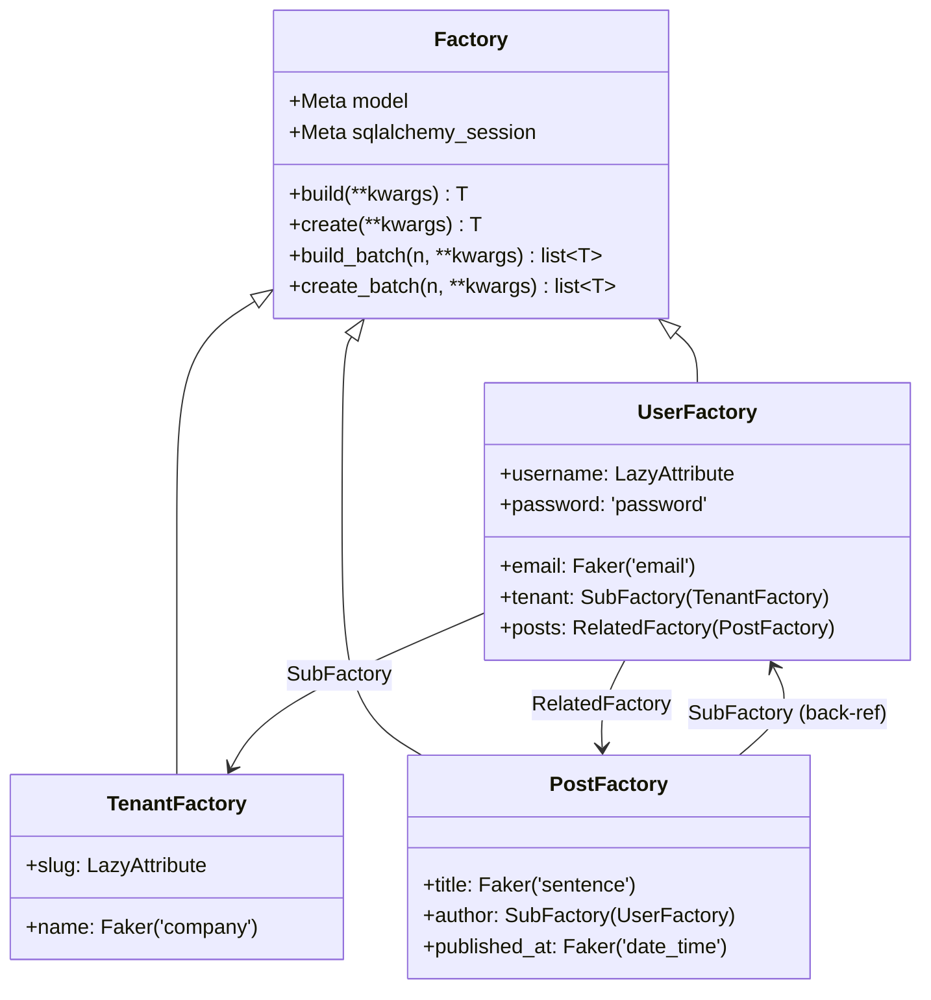
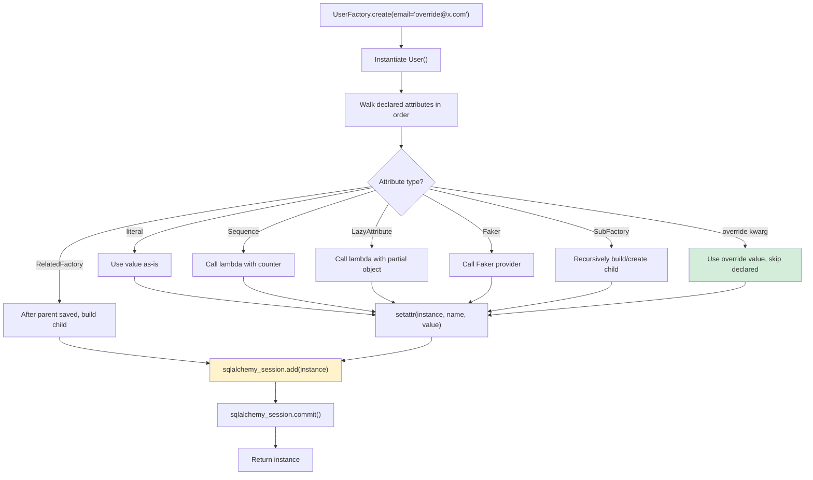
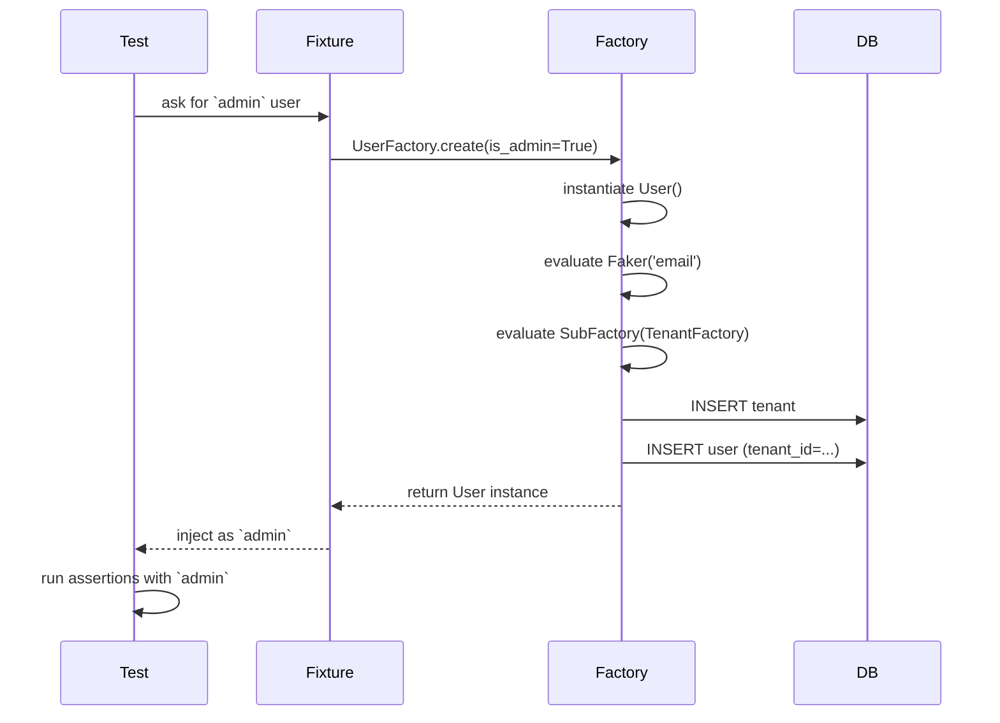

# Factory Boy

#flask #testing #factory_boy #fixtures #faker #pytest #sqlalchemy

> [!info] The testing fixture that pays for itself within a week
> **factory_boy** is a fixtures library originally written for Django but completely framework-agnostic. It builds Python objects — usually ORM model instances — from declarative "factory" classes, with sensible defaults, randomized values via [Faker](https://faker.readthedocs.io/), and a fluent API for overriding any field at construction time. Used alongside [[Pytest-Flask]] or [[Flask-Testing]], it removes the single most boring and error-prone part of a Flask test suite: hand-writing `User(email="a@b.com", password="x", ...)` blocks at the top of every test.

Think of a factory as a **default recipe** for an object. `UserFactory.build()` makes a `User` that satisfies every constraint (unique email, valid password, non-null name) without you having to remember which fields are mandatory. When a particular test cares about a specific value — say, an admin user, or a user whose account is locked — you override exactly that field: `UserFactory(is_admin=True, locked_at=datetime.utcnow())`. Everything else stays at the default recipe.

> [!tip] factory_boy vs hand-written helper functions
> The alternative is `def make_user(**kwargs): ...` helpers. Those work for a week. By month three you have nine of them (`make_user`, `make_admin`, `make_locked_user`, `make_user_with_posts`, …), each duplicating 80% of the others. Factories collapse this sprawl: one `UserFactory` plus override kwargs covers every variant. The mental model is "build a default, override what you care about" — exactly what your tests want.

---

## 1. Overview & Metaphor

### What factory_boy replaces

Without a factory library, every test that needs a `User` ends up looking like this:

```python
def test_user_can_login(client, db):
    user = User(
        email="alice@example.com",
        username="alice",
        password=generate_password_hash("hunter2"),
        created_at=datetime.utcnow(),
        is_active=True,
    )
    db.session.add(user)
    db.session.commit()
    resp = client.post("/login", json={"email": "alice@example.com", "password": "hunter2"})
    assert resp.status_code == 200
```

Half the test is setup. Six tests later you've copy-pasted this five times. When the `User` model gains a `tenant_id` column, five tests break with `NOT NULL constraint failed` even though none of them care about tenancy.

With factory_boy the same setup becomes:

```python
def test_user_can_login(client):
    user = UserFactory.create()  # email, password, etc. all generated
    resp = client.post("/login", json={"email": user.email, "password": "password"})
    assert resp.status_code == 200
```

The model change is absorbed by the factory: you add `tenant = factory.SubFactory(TenantFactory)` once and every test keeps working.

### Mermaid: factory relationships

A factory class is a declarative spec for an object graph. Each attribute maps to either a literal default, a `Sequence` (incrementing counter), a `LazyAttribute` (compute from other fields), a `SubFactory` (build another factory), or a Faker provider.



The arrows are the relationships the factory will materialize when you call `UserFactory.create()`. The cycle (`UserFactory → PostFactory → UserFactory`) is handled by factory_boy's lazy evaluation; you just have to break it explicitly when it matters (use `factory.LazyAttribute(lambda o: None)` for the back-reference on one side, or `factory.SubFactory(UserFactory, factory_related_name='_')`).

### Mermaid: test data generation flow

When a test calls `UserFactory.create(email="override@example.com")`, factory_boy walks the factory class in declaration order, computing each attribute and finally persisting via the session configured in `Meta`.



The green node (override kwarg) is the key: anything you pass to `.create(...)` or `.build(...)` short-circuits the declared value, so you only specify what the test cares about.

---

## 2. Installation

```bash
pip install factory_boy faker
# or, if you also want pytest integration:
pip install factory_boy faker pytest pytest-flask
```

`faker` is technically optional — factory_boy will lazy-import it only when you use `factory.Faker(...)` — but in practice every Flask project uses both together. Lock Faker's version in your `requirements.txt`: a Faker minor upgrade can change the random email formats and break snapshot tests that hard-coded a domain.

> [!warning] Pin Faker, always
> Faker's providers occasionally change their output formats between minor versions. If your tests assert `"@example.com" in user.email`, a Faker upgrade that switches the default domain from `@example.com` to `@example.org` will silently break dozens of tests. Pin the version and review Faker's changelog on upgrade.

---

## 3. The Factory Class — Basics

A `Factory` subclass declares a `Meta.model` (the class to instantiate) plus one attribute per field. The attribute can be a literal value, a `factory.Sequence`, a `factory.LazyAttribute`, a `factory.Faker`, or a `factory.SubFactory`.

```python
# tests/factories.py
from datetime import datetime
import factory
from app import db
from app.models import User, Post, Tenant

class TenantFactory(factory.alchemy.SQLAlchemyModelFactory):
    class Meta:
        model = Tenant
        sqlalchemy_session = db.session
        sqlalchemy_session_persistence = "commit"

    name = factory.Faker("company")
    slug = factory.LazyAttribute(lambda o: o.name.lower().replace(" ", "-"))
    created_at = factory.LazyFunction(datetime.utcnow)

class UserFactory(factory.alchemy.SQLAlchemyModelFactory):
    class Meta:
        model = User
        sqlalchemy_session = db.session
        sqlalchemy_session_persistence = "commit"

    email = factory.Faker("email")
    username = factory.LazyAttribute(lambda o: o.email.split("@")[0])
    password = "password"  # set in __init__ or post_generation to hash
    is_active = True
    is_admin = False
    created_at = factory.LazyFunction(datetime.utcnow)
    tenant = factory.SubFactory(TenantFactory)
```

Three things to notice:

1. **`SQLAlchemyModelFactory`** is the right base for Flask-SQLAlchemy models. The plain `Factory` base doesn't know about sessions and won't persist anything.
2. **`sqlalchemy_session = db.session`** wires the factory to the same session your app uses. Set this once per factory; forgetting it is the #1 factory_boy bug ("my factory builds objects but `db.session` doesn't see them").
3. **`sqlalchemy_session_persistence = "commit"`** makes `create()` flush AND commit. The alternative, `"flush"`, just flushes without committing — useful when your tests use transaction rollback for isolation (see [[Pytest-Flask]]).

### `build()` vs `create()`

| Method | DB touched? | Returns |
|---|---|---|
| `UserFactory.build()` | No | An unsaved `User` instance (`id` is `None`) |
| `UserFactory.create()` | Yes | A saved, committed `User` with an `id` |
| `UserFactory.build_batch(5)` | No | List of 5 unsaved instances |
| `UserFactory.create_batch(5)` | Yes | List of 5 saved instances |
| `UserFactory.stub(...)` | No | A "stub" object — not a model instance, just attribute access |

Use `build()` for unit tests that don't need persistence (form validation, pure serialization, business logic). Use `create()` for integration tests that go through the DB.

---

## 4. Sequence & LazyAttribute

### `Sequence` — guaranteed unique values

`factory.Sequence(lambda n: ...)` calls the lambda with a per-factory counter, so each instance gets a distinct value. Useful for unique constraints:

```python
class UserFactory(factory.alchemy.SQLAlchemyModelFactory):
    class Meta:
        model = User
        sqlalchemy_session = db.session
        sqlalchemy_session_persistence = "commit"

    email = factory.Sequence(lambda n: f"user{n}@example.com")
    username = factory.Sequence(lambda n: f"user{n}")
```

The counter resets to 0 when the factory class is defined (not per-test), so across a test session you'll see `user0@example.com`, `user1@example.com`, …, `user412@example.com`. If your test asserts an exact email, override it explicitly: `UserFactory.create(email="alice@example.com")`.

### `LazyAttribute` — compute from other fields

`LazyAttribute(lambda o: ...)` receives the partially-built object (with all previously-declared fields already set) and computes a derived value:

```python
class UserFactory(factory.alchemy.SQLAlchemyModelFactory):
    class Meta:
        model = User
        sqlalchemy_session = db.session

    email = factory.Faker("email")
    username = factory.LazyAttribute(lambda o: o.email.split("@")[0])
    display_name = factory.LazyAttribute(lambda o: o.username.replace(".", " ").title())
```

Order matters: `LazyAttribute` only sees fields declared *above* it. If you reference a field below, you'll get an `AttributeError` at build time.

### `LazyFunction` — call without arguments

`LazyFunction(datetime.utcnow)` is shorthand for `LazyAttribute(lambda _: datetime.utcnow())`. Use it for timestamps and other side-effecting defaults.

---

## 5. SubFactory & RelatedFactory — relationships

### `SubFactory` — many-to-one

`SubFactory(OtherFactory)` builds the related object as part of building this one. The parent owns the relationship:

```python
class PostFactory(factory.alchemy.SQLAlchemyModelFactory):
    class Meta:
        model = Post
        sqlalchemy_session = db.session

    title = factory.Faker("sentence", nb_words=6)
    body = factory.Faker("text", max_nb_chars=500)
    published_at = factory.Faker("date_time_this_year")
    author = factory.SubFactory(UserFactory)  # builds a new User for each Post
```

`PostFactory.create()` produces both a `Post` *and* its `author` `User`. You can override the author to share one across many posts:

```python
alice = UserFactory.create()
posts = PostFactory.create_batch(5, author=alice)  # 5 posts, 1 user total
```

### `RelatedFactory` — one-to-many (after parent saved)

`RelatedFactory(ChildFactory, factory_related_name='parent')` runs *after* the parent is created and inserts a child pointing back at the parent. Useful when a test needs "a user that already has 1 post":

```python
class UserFactory(factory.alchemy.SQLAlchemyModelFactory):
    class Meta:
        model = User
        sqlalchemy_session = db.session

    email = factory.Sequence(lambda n: f"user{n}@example.com")
    # ...
    sample_post = factory.RelatedFactory(PostFactory, factory_related_name="author")
```

`UserFactory.create()` now produces a `User` AND a `Post` authored by them. The post is accessible via `user.posts` (one entry). To skip it, pass `sample_post=None` — but more idiomatic is to not declare the `RelatedFactory` and instead call `PostFactory.create(author=user)` when the test cares about posts.

---

## 6. Faker Integration

`factory.Faker("provider", **kwargs)` calls Faker's provider to generate realistic-looking values. Common providers for Flask apps:

| Provider | Example output | Use for |
|---|---|---|
| `email` | `john.doe@example.com` | User.email |
| `user_name` | `johndoe84` | User.username |
| `password` | `aB3!xY9z` | (length=10 by default) |
| `url` | `https://www.example.com/` | Link.url |
| `sentence` | `The quick brown fox jumps.` | Post.title |
| `paragraph` | `Lorem ipsum dolor...` | Post.body |
| `date_time_this_year` | `2024-03-15 14:23:11` | created_at, updated_at |
| `pybool` | `True` / `False` | flags |
| `pyint(min_value=1, max_value=100)` | `42` | counters |
| `currency_code` | `USD`, `EUR` | Order.currency |

### Locale

```python
# French names, addresses, phone numbers:
name = factory.Faker("name", locale="fr_FR")

# Or set globally for the factory:
class FrenchUserFactory(factory.alchemy.SQLAlchemyModelFactory):
    class Meta:
        model = User
        sqlalchemy_session = db.session

    name = factory.Faker("name", locale="fr_FR")
```

### Deterministic tests with `factory.Faker.override_default_locale` and seeds

Faker is deterministic per-seed. In tests you usually want determinism across runs:

```python
# conftest.py
import pytest
from faker import Faker

@pytest.fixture(autouse=True)
def faker_seed():
    Faker.seed(0)  # every test gets the same Faker sequence
```

Without this, "test passes locally, fails on CI" turns into a recurring source of flakiness — Faker occasionally generates a value that trips a validator (a 254-char email here, an all-whitespace name there).

---

## 7. factory_boy with Flask-SQLAlchemy

The wiring above (`sqlalchemy_session = db.session`) assumes a single module-level `db` object. With the application-factory pattern (see [[Project-Structure]]) `db.session` exists only inside an app context. Three common solutions:

### Option A: Set the session lazily per test (most explicit)

```python
# tests/conftest.py
import pytest
from app import db as _db
from app import create_app
from tests.factories import UserFactory, PostFactory

@pytest.fixture(scope="session")
def app():
    app = create_app(testing=True)
    with app.app_context():
        _db.create_all()
        # Wire every factory to this session
        UserFactory._meta.sqlalchemy_session = _db.session
        PostFactory._meta.sqlalchemy_session = _db.session
        yield app
        _db.drop_all()
```

### Option B: Use a session-scoped factory wrapper

```python
# tests/factories.py
def set_session(session):
    for factory_cls in [UserFactory, PostFactory, TenantFactory]:
        factory_cls._meta.sqlalchemy_session = session
```

Call `set_session(db.session)` from your `app` fixture. This is the approach used in [[Pytest-Flask]] examples.

### Option C: Build a custom base factory that reads the session lazily

```python
class BaseFactory(factory.alchemy.SQLAlchemyModelFactory):
    class Meta:
        abstract = True
        sqlalchemy_session_persistence = "commit"

    @classmethod
    def _create(cls, model_class, *args, **kwargs):
        # Late-bind the session so factories work inside any app context
        from app import db
        cls._meta.sqlalchemy_session = db.session
        return super()._create(model_class, *args, **kwargs)
```

> [!warning] Factory session ≠ test session means orphans
> If your factory commits via its own session but your test runs queries against a different session, you'll see "I called `UserFactory.create()` but `User.query.all()` returns `[]`". Symptom: works for the first test, fails for the second. Fix: ensure both use the *same* `db.session` object — which they will if both go through Flask-SQLAlchemy's `db` proxy inside the same app context.

---

## 8. Pytest Fixtures Integration

Factories pair naturally with pytest fixtures. The idiomatic pattern: define a `user_factory` fixture that returns the factory class (so tests can call `.create(...)` with overrides), and a `user` fixture that returns a single default user for tests that need exactly one.

```python
# tests/conftest.py
import pytest
from tests.factories import UserFactory, PostFactory

@pytest.fixture
def user_factory(db_session):
    """Returns the factory class; tests call user_factory.create(...)."""
    return UserFactory

@pytest.fixture
def user(user_factory):
    """A single default user — for tests that need exactly one."""
    return user_factory.create()

@pytest.fixture
def admin(user_factory):
    return user_factory.create(is_admin=True)

@pytest.fixture
def user_with_posts(user_factory):
    user = user_factory.create()
    PostFactory.create_batch(3, author=user)
    return user
```

Tests then read like English:

```python
def test_admin_can_delete_any_post(client, admin, user_with_posts):
    post = user_with_posts.posts[0]
    resp = client.delete(f"/posts/{post.id}", headers=auth_header(admin))
    assert resp.status_code == 204

def test_normal_user_cannot_delete_others_post(client, user, user_with_posts):
    post = user_with_posts.posts[0]  # belongs to user_with_posts, not user
    resp = client.delete(f"/posts/{post.id}", headers=auth_header(user))
    assert resp.status_code == 403
```

> [!tip] Name factories by role, not by data shape
> `admin`, `banned_user`, `user_with_unverified_email`, `user_with_posts` — these are *roles* your tests care about. Don't name them `user_2`, `user_with_field_x_set_to_5`. The fixture name should tell the reader what's interesting about this user.

---

## 9. Common Patterns

### Hashing passwords via `post_generation`

Model fields that need transformation (hashing, normalization) are best handled with `@factory.post_generation`:

```python
class UserFactory(factory.alchemy.SQLAlchemyModelFactory):
    class Meta:
        model = User
        sqlalchemy_session = db.session

    email = factory.Faker("email")
    # Plain password is "password" by default; override per test.
    _password = "password"

    @factory.post_generation
    def password(self, create, extracted, **kwargs):
        """Hash the password before saving."""
        from werkzeug.security import generate_password_hash
        raw = extracted if extracted is not None else "password"
        self.password_hash = generate_password_hash(raw)
```

Now `UserFactory.create(password="hunter2")` will store the *hash* of `"hunter2"` in `password_hash`, and tests can log in with `"hunter2"` as the plaintext.

### Trait — boolean toggles that set multiple fields

`factory.Trait` declares a named bundle of overrides:

```python
class UserFactory(factory.alchemy.SQLAlchemyModelFactory):
    class Meta:
        model = User
        sqlalchemy_session = db.session

    email = factory.Faker("email")
    is_active = True
    is_admin = False
    deleted_at = None

    class Params:
        admin = factory.Trait(is_admin=True)
        banned = factory.Trait(is_active=False, deleted_at=datetime.utcnow())
```

Usage: `UserFactory.create(admin=True)`, `UserFactory.create(banned=True)`. Cleaner than passing three kwargs each time.

### Build strategies for nested factories

By default `SubFactory` calls `.create()` on the child. To skip DB writes for the child (useful when the parent hasn't been committed yet), use `factory_builders`:

```python
class PostFactory(factory.alchemy.SQLAlchemyModelFactory):
    class Meta:
        model = Post
        sqlalchemy_session = db.session

    author = factory.SubFactory(
        UserFactory,
        factory_builders={"email": "alice@example.com"},  # override a field on the sub-factory
    )
```

### Mermaid: factory lifecycle in a test



---

## 10. Troubleshooting

| Symptom | Likely cause | Fix |
|---|---|---|
| `UserFactory.create()` succeeds but `User.query.all()` is empty | Factory using a different session than your test queries | Set `sqlalchemy_session = db.session` inside the app context |
| `IntegrityError: duplicate key value` on second test | `Sequence` counter didn't reset between tests; or factory commits but your test rolls back the transaction | Reset sequence in a fixture, or use `sqlalchemy_session_persistence="flush"` with a session-level rollback in teardown |
| `AttributeError: 'NoneType' object has no attribute 'foo'` in `LazyAttribute` | Referencing a field declared *below* the `LazyAttribute` | Move the `LazyAttribute` below the field it depends on |
| Faker values look identical across instances | `Faker.seed()` was set globally and Faker is memoizing | Set the seed once per session, not per test, or use `factory.Faker` (which creates a fresh Faker per call) |
| `ValueError: Cannot evaluate ... value as a Query` from `RelatedFactory` | The relationship isn't set up correctly on the model | Use `factory_related_name` matching the FK attribute name on the child |
| Factory creates extra rows in tests using transaction rollback | `persistence="commit"` issues a real `COMMIT`, defeating the rollback | Switch to `"flush"` for tests, or override per-test |
| `password` field stores plaintext | You set `password = "password"` directly without a `post_generation` hook | Add the hook from §9 |

---

## 11. Best Practices

> [!tip] Factory hygiene checklist
> 1. **One factory per model.** Don't build variants by subclassing; use `Trait` and override kwargs.
> 2. **All non-nullable fields have a declared value.** A factory that breaks when you add a `NOT NULL` column is a factory doing its job — add the default and move on.
> 3. **Factories live in `tests/factories.py`** (or `tests/factories/` as a package). Importable from any test module.
> 4. **Pin Faker's version** and seed it for deterministic runs.
> 5. **Use `Trait` for "roles"** (admin, banned, verified) instead of half a dozen subclasses.
> 6. **Prefer `build()` over `create()`** in unit tests. The DB is slow; don't touch it unless the test cares.
> 7. **Hash passwords in `post_generation`**, never store plaintext even in test data.
> 8. **Don't assert on Faker-generated values.** If a test needs `user.email == "alice@example.com"`, override it explicitly. Faker's output is for filling schema gaps, not for asserting against.

---

## 12. Related Vault Notes

- [[Pytest-Flask]] — pytest is the recommended runner; this note covers how factory_boy integrates via `conftest.py` fixtures
- [[Flask-Testing]] — legacy `unittest`-style suites; factory_boy works the same way, just instantiate in `setUp`
- [[Flask-SQLAlchemy]] — the ORM whose models factories build; the `db.session` wiring is the crux
- [[Flask-Migrate]] — when tests run real migrations (`flask db upgrade`), factories reseed against the migrated schema
- [[Marshmallow]] — factories generate the *input* data; Marshmallow validates and serializes it. Common pattern: `UserSchema().load(UserFactory.build().__dict__)`
- [[Performance-Optimization]] — `build()` is ~100× faster than `create()`; suite speed is dominated by DB writes, so use `build` everywhere you can
