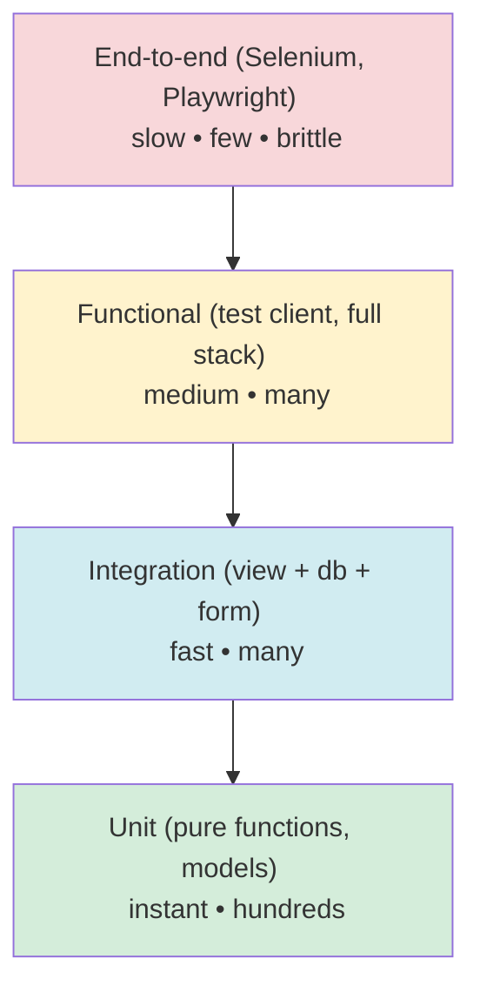
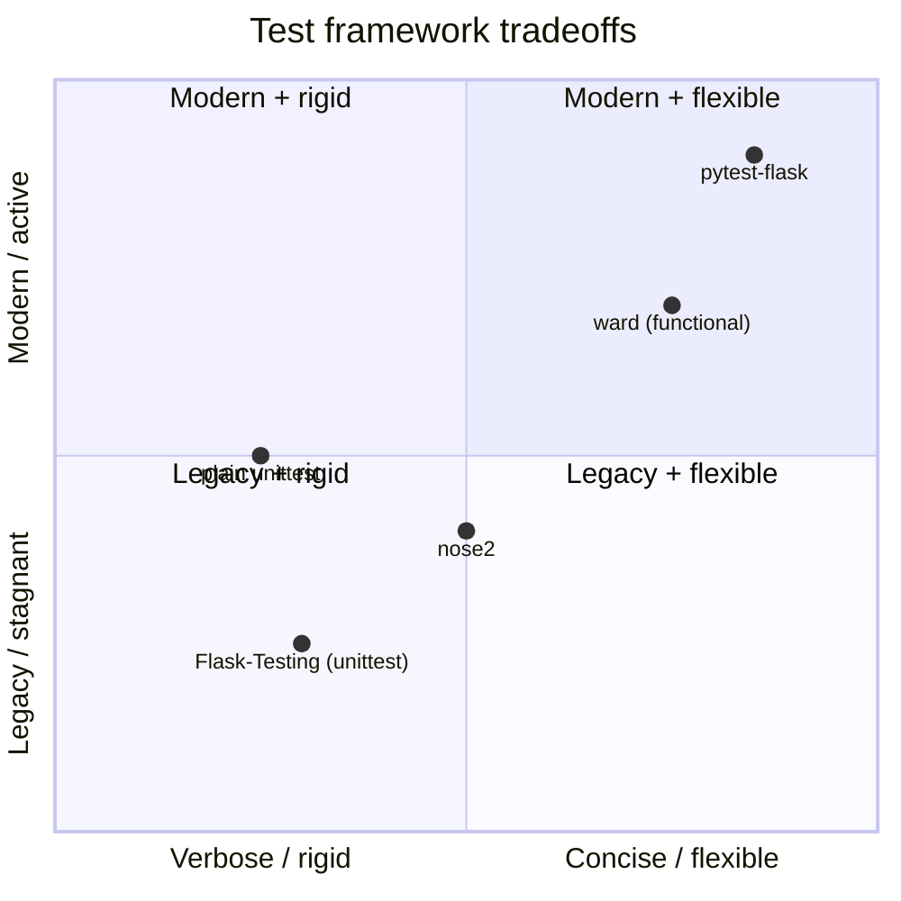
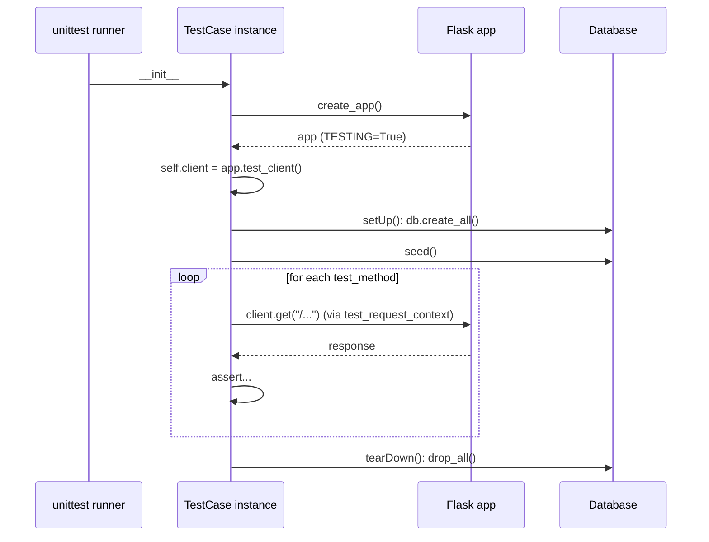
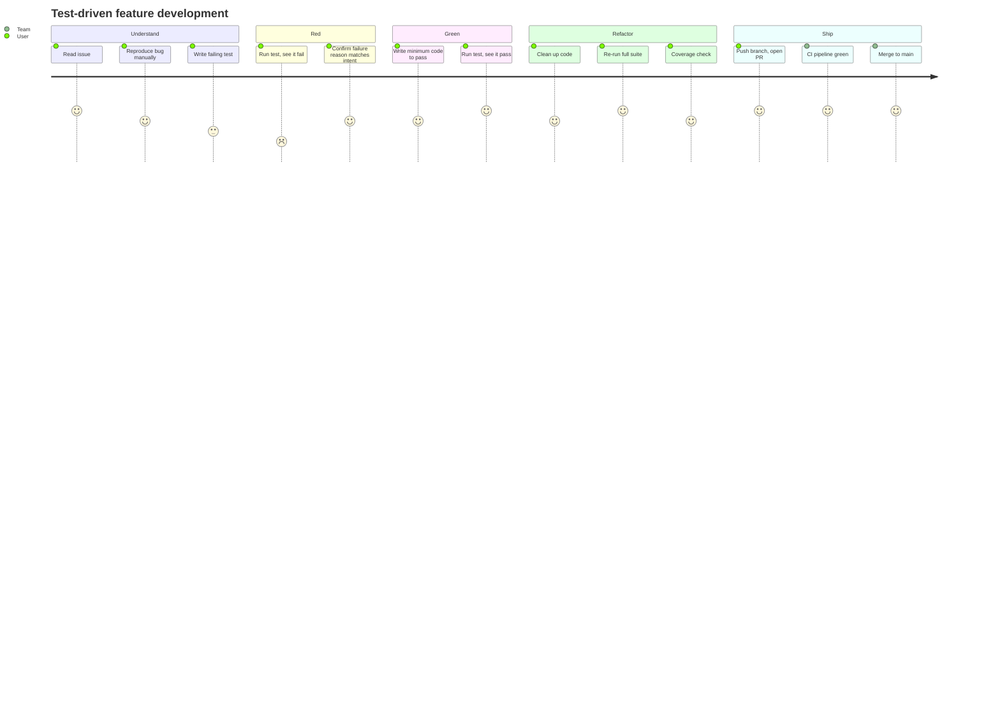
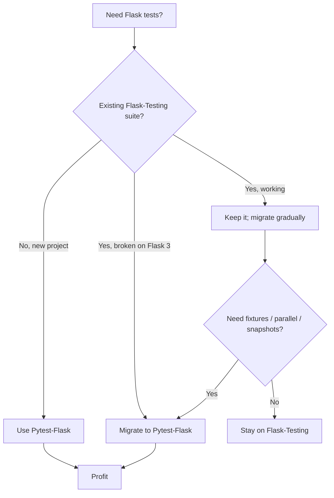

# Flask-Testing

#flask #testing #unittest #qa #test-client #coverage

> [!warning] Maintenance-mode notice — read first
> **Flask-Testing is in maintenance mode.** The maintainer (Dan Jacob) has stated no new features will be added; only critical bugfixes and Python/Flask compatibility updates are released. For **new projects**, the recommendation is to use [[Pytest-Flask]] instead — it is more actively developed, has a richer plugin ecosystem, and integrates better with modern tooling (coverage, parallelism, snapshot testing, async).
>
> This note still covers Flask-Testing because:
> 1. Many legacy codebases use `unittest.TestCase` subclasses with `flask_testing`.
> 2. `LiveServerTestCase` is still a clean way to drive Selenium from a unittest-style suite.
> 3. The assertion helpers (`assertStatusCode`, `assertTemplateUsed`, `assertRedirects`, `assertContext`) are pedagogically useful even if you later migrate to pytest.
>
> If you are starting from scratch, jump to [[Pytest-Flask]]. If you are maintaining an existing Flask-Testing suite, this note is for you.

> [!info] What Flask-Testing adds on top of `unittest`
> Flask-Testing is a thin layer over Python's built-in `unittest` that wires the Flask **test client** into your test cases, provides convenience assertions for HTTP responses and Jinja templates, and offers `LiveServerTestCase` for running a real HTTP server in a thread so browser-driven tests (Selenium, Playwright) can hit it.

Think of Flask-Testing as the **training wheels** that came with your first bike: they keep you upright while you learn the basics of HTTP-level testing, but the moment you want to do tricks — fixtures, parametrization, parallel runs, snapshot diffs — you'll want to take them off and ride the pytest bike.

---

## 1. Overview & Metaphor

### What does "testing a Flask app" actually mean?

A Flask app is a function from `request` → `response`. Testing it means exercising that function with crafted inputs and asserting things about the outputs. The inputs come in three flavors:

1. **Pure Python calls** — instantiate a model, call a service function, run a template render with a fake context. These are **unit tests**.
2. **Werkzeug test client requests** — `client.get("/posts/3")` synthesizes a WSGI environ, runs the full middleware → view → response pipeline, but skips the real socket/HTTP layer. These are **integration tests**.
3. **Real HTTP requests against a running server** — `requests.get("http://localhost:5000/posts/3")` while Flask listens on a port. These are **functional / end-to-end tests** and are needed when you want to drive a real browser (Selenium) or test your actual WSGI server config.

### The test pyramid



The pyramid says: **most** of your tests should be unit tests (fast, isolated), a **moderate** number should be integration tests (exercise the seams between your code and Flask/SQLAlchemy), and **few** should be end-to-end tests (slow, brittle, but the only ones that prove "the whole thing actually works for a user").

### What Flask-Testing gives you

| Feature | What it does |
|---|---|
| `TestCase` base class | Subclass of `unittest.TestCase` that auto-creates `self.client` from `self.create_app()`. |
| `assertStatusCode(response, code)` | Shorthand for `self.assertEqual(response.status_code, code)`. |
| `assert200`, `assert404`, `assert403`, `assert500`, `assert400` | Common status codes pre-baked. |
| `assertRedirects(response, location)` | Checks 301/302 and the `Location` header. |
| `assertTemplateUsed(name)` | Records templates rendered during the request and asserts one was used. Only works if `RENDER_TEMPLATE_AS_RECEIVED` or the patching is on. |
| `assertContext(name, value)` | Asserts a variable was passed into a template's context. |
| `assertMessageFlashed(message, category)` | Asserts a `flash()` was called. |
| `LiveServerTestCase` | Spins up Flask in a background thread on a random port for Selenium. |
| `TestCase.create_app()` | Hook you override to return a configured Flask app. |

### Mermaid: testing frameworks at a glance



### What Flask-Testing does NOT do

| Concern | Who handles it |
|---|---|
| Fixtures & dependency injection | `pytest` + [[Pytest-Flask]], or roll-your-own `setUp` |
| Parametrized tests | `pytest.mark.parametrize`, or `parameterized` package |
| Parallel test runs | `pytest-xdist`, or `unittest` with `pytest` runner |
| Coverage reports | `coverage.py` directly |
| Mocking | `unittest.mock` (stdlib) |
| Database transaction rollback | You wire it in `setUp`/`tearDown` |
| Snapshot testing | `pytest-snapshot` / `syrupy` |
| Async test support | `pytest-asyncio` |

> [!tip] The metaphor
> Flask-Testing is a **pre-assembled workbench**: it gives you the vise (the test client), a few measuring tools (`assert200`, `assertTemplateUsed`), and a power strip (`LiveServerTestCase`). It does not give you a CNC mill (fixtures) or a 3D printer (parametrization) — for those, switch to pytest.

---

## 2. Installation

```bash
(venv) $ pip install Flask-Testing
```

Recommended companions:

```bash
(venv) $ pip install coverage            # coverage measurement
(venv) $ pip install responses           # mock requests/httpx calls
(venv) $ pip install selenium            # browser automation for LiveServerTestCase
(venv) $ pip install Factory-Boy         # test data builders
```

Versions used in this note:

| Package | Version |
|---|---|
| Flask | 3.0.x |
| Flask-Testing | 0.8.1 |
| Flask-SQLAlchemy | 3.1.x |
| Flask-Login | 0.6.x |
| coverage | 7.4.x |

> [!warning] Flask 3.x compatibility
> Flask-Testing 0.8.1 was released before Flask 3.0 and imports `flask._app_ctx_stack` (removed in Flask 2.3+). On Flask 3.x you may need either (a) pin to Flask 2.2.x, (b) install the community fork `Flask-Testing-Next` or patch the import in your `conftest`/`sitecustomize`, or (c) **migrate to pytest-flask**. This is the single biggest reason new projects should not adopt Flask-Testing today.

---

## 3. Configuration

### App factory + Flask-Testing

The cleanest pattern: an app factory that accepts a `config` object, plus a `TestConfig` that overrides the database URI and disables CSRF, email sending, rate limiting, and any external calls.

```python
# app/__init__.py
from flask import Flask
from app.extensions import db, login_manager, mail, cache

def create_app(config="app.config.Config"):
    app = Flask(__name__)
    app.config.from_object(config)
    db.init_app(app)
    login_manager.init_app(app)
    mail.init_app(app)
    cache.init_app(app)
    from app.main import main_bp
    app.register_blueprint(main_bp)
    return app
```

```python
# app/config.py
class Config:
    SECRET_KEY = "change-me"
    SQLALCHEMY_DATABASE_URI = "sqlite:///app.db"
    SQLALCHEMY_TRACK_MODIFICATIONS = False
    MAIL_SUPPRESS_SEND = False
    CACHE_TYPE = "SimpleCache"

class TestConfig(Config):
    TESTING = True
    WTF_CSRF_ENABLED = False                  # easier form posts in tests
    SQLALCHEMY_DATABASE_URI = "sqlite:///:memory:"
    MAIL_SUPPRESS_SEND = True                 # don't talk to SMTP
    CACHE_TYPE = "NullCache"                  # tests shouldn't share cache state
    RATELIMIT_ENABLED = False                 # don't trip the limiter
    SERVER_NAME = "localhost.localdomain"     # needed for url_for outside request
```

### Test base class

```python
# tests/base.py
from flask_testing import TestCase
from app import create_app
from app.config import TestConfig
from app.extensions import db

class BaseTestCase(TestCase):
    def create_app(self):
        return create_app(TestConfig)

    def setUp(self):
        db.create_all()
        self.seed()

    def tearDown(self):
        db.session.remove()
        db.drop_all()

    def seed(self):
        """Override in subclasses to insert fixtures."""
        pass
```

> [!info] `create_app` is called for every test method
> Flask-Testing calls `self.create_app()` inside `__call__` (i.e., once per test). This is the single biggest performance cost of Flask-Testing — if you have 500 tests, you build 500 app objects. With pytest-flask you can build once per session and reuse it.

### Mermaid: what this note covers

```mermaid
mindmap
  root((Flask-Testing))
    TestCase base
      create_app() hook
      auto self.client
      setUp / tearDown
    Assertions
      assert200 / assert404
      assertRedirects
      assertTemplateUsed
      assertContext
      assertMessageFlashed
    LiveServerTestCase
      background thread
      random port
      Selenium / Playwright
      real HTTP
    Config flags
      TESTING=True
      WTF_CSRF_ENABLED=False
      MAIL_SUPPRESS_SEND=True
      CACHE_TYPE=NullCache
      RATELIMIT_ENABLED=False
    Companion tools
      coverage.py
      responses (mock HTTP)
      Factory-Boy
      unittest.mock
```

### Key Flask config flags for tests

| Flag | Why |
|---|---|
| `TESTING = True` | Enables test client exceptions to propagate (instead of being caught into 500 pages). |
| `PRESERVE_CONTEXT_ON_EXCEPTION = False` | Don't keep the app/request context around after errors. |
| `WTF_CSRF_ENABLED = False` | POST forms without a CSRF token. (Or generate one — see §5.) |
| `SQLALCHEMY_DATABASE_URI = "sqlite:///:memory:"` | Fast, isolated, dies with the process. |
| `MAIL_SUPPRESS_SEND = True` | Flask-Mail records outgoing messages in `mail.outbox` without sending. |
| `CACHE_TYPE = "NullCache"` | Disable caching unless you are explicitly testing cache behavior. |
| `RATELIMIT_ENABLED = False` | Disable [[Flask-Limiter]] so your tests don't hit 429s. |
| `DEBUG = False` | Match production behavior; exception propagation is controlled by `TESTING`. |

---

## 4. Basic Usage

### Hello-world test

```python
# tests/test_hello.py
from flask_testing import TestCase
from app import create_app
from app.config import TestConfig

class HelloTestCase(TestCase):
    def create_app(self):
        return create_app(TestConfig)

    def test_index_returns_200(self):
        response = self.client.get("/")
        self.assert200(response)

    def test_index_says_hello(self):
        response = self.client.get("/")
        self.assertIn(b"Hello", response.data)

    def test_unknown_route_is_404(self):
        response = self.client.get("/this-does-not-exist")
        self.assert404(response)
```

Run with the standard library:

```bash
(venv) $ python -m unittest discover tests
(venv) $ python -m unittest tests.test_hello.HelloTestCase.test_index_returns_200
```

### Built-in assertions cheat sheet

```python
self.assert200(response)               # 200 OK
self.assert400(response)
self.assert401(response)
self.assert403(response)
self.assert404(response)
self.assert405(response)               # Method Not Allowed
self.assert500(response)

self.assertStatus(response, 418)       # any code

self.assertRedirects(response, "/login")     # 301/302 + Location header
self.assertRedirects(response, "http://localhost/login")

self.assertTemplateUsed("index.html")
self.assertTemplateUsed("index.html", count=1)   # rendered exactly once

self.assertContext("user", some_user)        # template var equals value
self.assertMessageFlashed("Logged in.", "success")
```

> [!warning] `assertTemplateUsed` requires context recording
> Flask-Testing patches `app.jinja_env` to record template renders — but only **inside the request** that occurs during the test. If you call `render_template` outside the test client (e.g., in a service function called directly), the template won't be recorded. Wrap the call in `with app.test_request_context():` if you need it.

### Test client mechanics

```python
# GET with query string
response = self.client.get("/search", query_string={"q": "flask"})

# POST form data
response = self.client.post("/login", data={
    "email": "alice@example.com",
    "password": "swordfish",
})

# POST JSON
response = self.client.post(
    "/api/posts",
    json={"title": "Hello", "body": "World"},
)

# Custom headers (auth, etc.)
response = self.client.get(
    "/api/me",
    headers={"Authorization": "Bearer abc123"},
)

# Follow redirects
response = self.client.get("/protected", follow_redirects=True)

# Cookies: the client persists them across requests in the same TestCase
self.client.set_cookie("session", "abc", domain="localhost")
response = self.client.get("/dashboard")
```

---

## 5. Intermediate Patterns

### Test lifecycle



### Testing with [[Flask-SQLAlchemy]] — in-memory SQLite + rollback

For unit/integration tests you have two strategies:

**Strategy A — create/drop per test** (simple, slow):

```python
def setUp(self):
    db.create_all()
    self.user = User(email="alice@example.com")
    self.user.set_password("pw")
    db.session.add(self.user)
    db.session.commit()

def tearDown(self):
    db.session.remove()
    db.drop_all()
```

**Strategy B — single transaction, rollback per test** (fast, subtle):

```python
from contextlib import contextmanager

@contextmanager
def nested_transaction():
    """Run a block inside a SAVEPOINT; roll back at the end."""
    sp = db.session.begin_nested()
    yield
    sp.rollback()              # also rolled back automatically on session close

class PostTestCase(BaseTestCase):
    def setUp(self):
        # create_all done once per session in BaseTestCase
        pass

    def test_create_post(self):
        with nested_transaction():
            post = Post(title="t", body="b")
            db.session.add(post)
            db.session.commit()
            self.assertEqual(Post.query.count(), 1)
        # After the with block, the savepoint is rolled back:
        self.assertEqual(Post.query.count(), 0)
```

> [!tip] SQLite gotcha
> SQLite's default isolation behavior with `:memory:` can cause "database is locked" errors if you mix `db.session.commit()` with raw `db.engine.execute()` in the same test. Pin to a single connection: `SQLALCHEMY_ENGINE_OPTIONS = {"connect_args": {"check_same_thread": False}, "poolclass": "StaticPool"}`.

### Testing with [[Flask-Login]] — logging in as a test user

You have three options.

**Option 1 — POST to `/login` through the test client.** Most realistic, but slow.

```python
def login(self, email="alice@example.com", password="pw"):
    return self.client.post("/login", data={
        "email": email, "password": password,
    }, follow_redirects=True)

def test_dashboard_requires_login(self):
    response = self.client.get("/dashboard")
    self.assertRedirects(response, "/login")

def test_dashboard_after_login(self):
    self.login()
    response = self.client.get("/dashboard")
    self.assert200(response)
```

**Option 2 — use Flask-Login's `login_user` inside a request context.** Skips the password check entirely; faster.

```python
from flask_login import login_user, logout_user

def login_as(self, user):
    with self.client.session_transaction() as sess:
        # Flask-Login stores user_id under the configured key
        sess["_user_id"] = str(user.id)
    return self.client
```

**Option 3 — use `current_user` directly in a `test_request_context`.** Useful when you're testing a function that reads `current_user` without going through HTTP.

```python
from flask_login import current_user

def test_helper_reads_current_user(self):
    with self.app.test_request_context("/", user=self.user):
        # The user kwarg is honored by Flask-Login's request loader in newer versions
        result = my_service.current_user_posts()
        self.assertEqual(len(result), 3)
```

### Testing forms ([[Flask-WTF]])

```python
def test_register_valid(self):
    response = self.client.post("/register", data={
        "username": "alice",
        "email": "alice@example.com",
        "password": "swordfish",
        "confirm": "swordfish",
    }, follow_redirects=True)
    self.assert200(response)
    self.assertTemplateUsed("register_success.html")

def test_register_passwords_dont_match(self):
    response = self.client.post("/register", data={
        "username": "alice",
        "email": "alice@example.com",
        "password": "swordfish",
        "confirm": "xyz",
    })
    self.assert200(response)          # re-renders form with errors
    self.assertIn(b"Field must be equal to password", response.data)

def test_register_requires_csrf_when_enabled(self):
    self.app.config["WTF_CSRF_ENABLED"] = True
    response = self.client.post("/register", data={...})
    self.assert400(response)
```

### Testing JSON APIs

```python
import json

def test_create_post_requires_auth(self):
    response = self.client.post("/api/posts", json={"title": "t"})
    self.assert401(response)
    self.assertEqual(response.json["error"], "unauthorized")

def test_create_post_validates_payload(self):
    self.login()
    response = self.client.post("/api/posts", json={"body": "no title"})
    self.assert400(response)
    self.assertEqual(response.json["errors"]["title"], ["Missing data for required field."])

def test_create_post_success(self):
    self.login()
    response = self.client.post("/api/posts", json={
        "title": "Hello", "body": "World",
    })
    self.assertEqual(response.status_code, 201)
    self.assertEqual(response.json["title"], "Hello")
    self.assertIn("id", response.json)
```

### Mocking — email sending & external APIs

Flask-Mail has a built-in "record but don't send" mode (`MAIL_SUPPRESS_SEND = True`); use it instead of mocking:

```python
def test_password_reset_sends_email(self):
    self.client.post("/forgot", data={"email": "alice@example.com"})
    self.assertEqual(len(mail.outbox), 1)
    self.assertEqual(mail.outbox[0].recipients, ["alice@example.com"])
    self.assertIn("reset", mail.outbox[0].body)
```

For arbitrary HTTP calls (e.g., calling Stripe), use `responses` or `unittest.mock.patch`:

```python
from unittest.mock import patch, MagicMock

def test_charge_calls_stripe(self):
    with patch("app.billing.stripe.Charge") as MockCharge:
        MockCharge.create.return_value = MagicMock(id="ch_123")
        self.client.post("/charge", json={"amount": 500})
        MockCharge.create.assert_called_once_with(
            amount=500, currency="usd", source="tok_visa",
        )

# Or with `responses` to mock the actual HTTP layer:
import responses

@responses.activate
def test_geoip_lookup(self):
    responses.add(responses.GET, "https://ipapi.co/8.8.8.8/json/",
                  json={"city": "Mountain View"}, status=200)
    response = self.client.get("/whereami?ip=8.8.8.8")
    self.assert200(response)
    self.assertIn(b"Mountain View", response.data)
```

---

## 6. Advanced Usage

### `LiveServerTestCase` — driving a real browser

`LiveServerTestCase` boots Flask in a daemon thread on a random port and exposes `self.server_url`. This is what you need when Selenium must hit a real HTTP server (it cannot drive the in-process WSGI test client).

```python
# tests/test_selenium.py
from flask_testing import LiveServerTestCase
from selenium import webdriver
from selenium.webdriver.common.by import By
from app import create_app
from app.config import TestConfig

class BrowserTestCase(LiveServerTestCase):
    def create_app(self):
        app = create_app(TestConfig)
        app.config["LIVESERVER_PORT"] = 8943
        app.config["LIVESERVER_TIMEOUT"] = 5
        return app

    def setUp(self):
        super().setUp()
        self.browser = webdriver.Chrome()
        self.browser.implicitly_wait(3)

    def tearDown(self):
        self.browser.quit()
        super().tearDown()

    def test_user_can_register_and_log_in(self):
        self.browser.get(self.get_server_url() + "/register")
        self.browser.find_element(By.NAME, "username").send_keys("alice")
        self.browser.find_element(By.NAME, "email").send_keys("alice@example.com")
        self.browser.find_element(By.NAME, "password").send_keys("swordfish")
        self.browser.find_element(By.CSS_SELECTOR, "button").click()
        self.assertIn("Welcome", self.browser.page_source)
```

```bash
(venv) $ python -m unittest tests.test_selenium.BrowserTestCase
```

> [!warning] `LiveServerTestCase` caveats
> 1. The server runs in a **separate thread**, not a separate process. Anything stored in thread-locals in your app (e.g., a `scoped_session` configured per-thread) may not see the data your test inserted via `db.session`. Either commit before the Selenium step or use a shared connection.
> 2. The server's port is random unless you set `LIVESERVER_PORT`. If you hard-code it in tests, parallel test runs collide.
> 3. `LiveServerTestCase` does not work with `gunicorn`/`uvicorn` workers — it uses `werkzeug.serving.make_server` directly. For async (Quart/Flask 2.x async views), use pytest + a real server fixture.

### Coverage measurement

Use `coverage.py` from the outside:

```bash
(venv) $ pip install coverage
(venv) $ coverage run --source=app -m unittest discover tests
(venv) $ coverage report -m
(venv) $ coverage html      # open htmlcov/index.html
```

`.coveragerc`:

```ini
[run]
source = app
omit =
    app/__init__.py
    app/config.py
    */migrations/*

[report]
exclude_lines =
    pragma: no cover
    if __name__ == .__main__.:
    if app.config\["TESTING"\]:
    raise NotImplementedError
```

### Testing CLI commands

Flask's `cli` is just Click; you can invoke commands directly without going through the shell:

```python
from click.testing import CliRunner
from app.cli import create_admin_command

class CLITestCase(BaseTestCase):
    def test_create_admin(self):
        runner = CliRunner()
        result = runner.invoke(create_admin_command,
                               ["alice", "alice@example.com", "--password=pw"])
        self.assertEqual(result.exit_code, 0)
        self.assertIsNotNone(User.query.filter_by(username="alice").first())
```

### Testing with [[Flask-Caching]]

Caching in tests is a frequent source of false greens. Two patterns:

```python
# Pattern 1: disable cache globally (TestConfig.CACHE_TYPE = "NullCache")
# Pattern 2: explicitly clear cache between tests
def setUp(self):
    super().setUp()
    cache.clear()
```

If you're testing the cache itself:

```python
def test_cached_view_returns_same_result(self):
    # First call computes; second returns cached
    self.app.config["CACHE_TYPE"] = "SimpleCache"
    cache.clear()
    self.client.get("/expensive")
    self.client.get("/expensive")
    # assert the underlying function was called exactly once
    # (you'd patch it to count calls)
```

### Snapshot testing without pytest

```python
import json, os, pathlib

SNAPSHOT_DIR = pathlib.Path(__file__).parent / "snapshots"

def assert_snapshot(self, name, value):
    path = SNAPSHOT_DIR / f"{name}.json"
    if not path.exists():
        path.write_text(json.dumps(value, indent=2, sort_keys=True))
        return
    expected = json.loads(path.read_text())
    self.assertEqual(value, expected)
```

This is poor man's snapshot testing — for the real thing, use `syrupy` with pytest.

---

## 7. Common Pitfalls & Troubleshooting

### Pitfall 1 — "Working outside of application context"

```
RuntimeError: Working outside of application context.
```

**Cause**: you called `db.session` or `url_for` outside a request without pushing an app context.

**Fix**:

```python
def test_helper_outside_request(self):
    with self.app.app_context():
        do_something_with_db()
```

### Pitfall 2 — `assertTemplateUsed` always fails

**Cause**: Flask-Testing only records templates rendered **during** a request handled by `self.client`. If you called `render_template` manually in a service, it isn't recorded.

**Fix**: either go through the client, or wrap the call:

```python
with self.app.test_request_context("/"):
    rendered = render_template("x.html", foo=1)
```

### Pitfall 3 — Tests pass alone, fail when run together

**Cause**: state leaking between tests. The usual culprits:

- `db.session` not removed in `tearDown` → stale identity map.
- `cache` not cleared → cached result from previous test.
- Module-level singletons (`_app = create_app()` at import time).
- Class-level mutable attributes shared across test methods.

**Fix**: in `tearDown`:

```python
def tearDown(self):
    db.session.remove()
    db.drop_all()
    cache.clear()
```

### Pitfall 4 — "database is locked" (SQLite in-memory)

**Cause**: SQLite serializes writes; multiple threads/connections deadlock.

**Fix**:

```python
SQLALCHEMY_ENGINE_OPTIONS = {
    "connect_args": {"check_same_thread": False},
    "poolclass": "StaticPool",   # single shared connection for :memory:
}
```

### Pitfall 5 — CSRF errors break every form POST

**Cause**: you set `WTF_CSRF_ENABLED = True` in tests but don't send a token.

**Fix**: either disable (`WTF_CSRF_ENABLED = False`) or generate:

```python
def get_csrf_token(self):
    response = self.client.get("/form-page")
    return response.json["_csrf_token"]   # if you expose it; otherwise parse the HTML

def submit_with_csrf(self, url, data):
    token = self.get_csrf_token()
    data["csrf_token"] = token
    return self.client.post(url, data=data)
```

### Pitfall 6 — `LiveServerTestCase` server doesn't see data your test inserted

**Cause**: the server runs in a different thread; Flask-SQLAlchemy's `scoped_session` is per-thread.

**Fix**: `db.session.commit()` before any Selenium step that needs the data, or share a single connection via `StaticPool`.

### Pitfall 7 — `mail.outbox` is empty even though you sent mail

**Cause**: `MAIL_SUPPRESS_SEND` was not set to `True`, or you called `mail.send` with a custom `Message` whose `send` method bypasses the suppression.

**Fix**: ensure `TestConfig.MAIL_SUPPRESS_SEND = True` and use `mail.send(msg)` (not a custom subclass).

### Pitfall 8 — Flask-Testing import fails on Flask 3.x

```
ImportError: cannot import name '_app_ctx_stack' from 'flask'
```

**Cause**: Flask 2.3+ removed internal context-stack globals.

**Fix**: pin Flask to 2.2.x, or apply this shim in `tests/__init__.py`:

```python
import flask
if not hasattr(flask, "_app_ctx_stack"):
    import flask.globals
    from werkzeug.local import LocalStack
    flask._app_ctx_stack = LocalStack()
```

Or, better, migrate to [[Pytest-Flask]].

---

## 8. Best Practices

1. **Use an app factory.** `create_app(config)` lets tests inject `TestConfig` without touching environment variables.
2. **One assertion concept per test.** Multiple `assertEqual` calls are fine; multiple *behaviors* are not. Split them.
3. **Build a `BaseTestCase`** with `setUp`/`tearDown` for db lifecycle, then subclass per concern.
4. **Seed deterministically.** Use [[Factory-Boy]] or hand-rolled factories, not random data, so failures are reproducible.
5. **Disable everything external in `TestConfig`** — CSRF off, mail suppressed, cache null, rate-limiter off, external HTTP mocked.
6. **Commit-or-rollback.** Either always commit in tests (and recreate the schema between them) or never commit (and use savepoints). Mixing the two causes flakiness.
7. **Test behavior, not implementation.** Assert "the post appears in the list" not "Post.query was called with these args".
8. **Name tests by behavior**: `test_login_redirects_anonymous_users_to_login_page`, not `test_login_1`.
9. **Run with coverage** and aim for the *meaningful* 80%, not the keyword-stuffing 100%.
10. **Treat slow tests as a bug.** If a unit test takes >100 ms, it's probably hitting the database or network by accident.

> [!tip] The golden rule
> A test suite you can run in under 5 seconds gets run on every save. A suite that takes 30 seconds gets run on every commit. A suite that takes 5 minutes gets run on CI, if you're lucky. Optimize ruthlessly for the first.

### Mermaid: a day in the life of a TDD practitioner



---

## 9. Integration with Other Extensions

| Extension | Testing pattern |
|---|---|
| [[Flask-SQLAlchemy]] | `:memory:` SQLite + `db.create_all()`/`drop_all()` per test; or `begin_nested` savepoints. |
| [[Flask-Login]] | Set `_user_id` in `session_transaction()`, or POST to `/login`. |
| [[Flask-WTF]] | Disable CSRF in `TestConfig`, or fetch & submit token. |
| [[Flask-Mail]] | `MAIL_SUPPRESS_SEND = True` → assertions on `mail.outbox`. |
| [[Flask-Caching]] | `CACHE_TYPE = "NullCache"`; or `cache.clear()` in `setUp`. |
| [[Flask-Limiter]] | `RATELIMIT_ENABLED = False`. |
| [[Flask-JWT-Extended]] | `create_access_token(identity=user)` and pass in `Authorization: Bearer <token>` header. |
| [[Marshmallow]] | Test schemas directly: `schema.dump(obj)` / `schema.load(payload)`. |
| [[Celery]] | `CELERY_TASK_ALWAYS_EAGER = True`, `CELERY_TASK_EAGER_PROPAGATES = True` — tasks run inline and raise. |
| [[Flask-SocketIO]] | Use `socketio.test_client(app)` — no real WebSocket needed. |
| [[Flask-Admin]] | Drive views via `self.client.get("/admin/model/")`; assert 200 and that rows appear. |

---

## 10. Real-World Example: Testing a Blog Application

This example exercises models, views, forms, and email in a small but realistic blog.

### The app (abridged)

```python
# app/models.py
from datetime import datetime
from app.extensions import db

class Post(db.Model):
    id = db.Column(db.Integer, primary_key=True)
    title = db.Column(db.String(200), nullable=False)
    body = db.Column(db.Text, nullable=False)
    author_id = db.Column(db.Integer, db.ForeignKey("user.id"))
    created_at = db.Column(db.DateTime, default=datetime.utcnow)
    published = db.Column(db.Boolean, default=False)

class User(db.Model):
    id = db.Column(db.Integer, primary_key=True)
    email = db.Column(db.String(120), unique=True, nullable=False)
    password_hash = db.Column(db.String(255), nullable=False)
    posts = db.relationship("Post", backref="author")

# app/forms.py
from flask_wtf import FlaskForm
from wtforms import StringField, TextAreaField, BooleanField
from wtforms.validators import DataRequired, Length

class PostForm(FlaskForm):
    title = StringField("Title", validators=[DataRequired(), Length(max=200)])
    body = TextAreaField("Body", validators=[DataRequired()])
    published = BooleanField("Publish", default=False)

# app/main.py
from flask import Blueprint, render_template, redirect, url_for, request, flash
from flask_login import login_required, current_user
from app.extensions import db, mail
from app.models import Post
from app.forms import PostForm
from flask_mail import Message

main_bp = Blueprint("main", __name__)

@main_bp.route("/")
def index():
    posts = Post.query.filter_by(published=True).order_by(Post.created_at.desc()).all()
    return render_template("index.html", posts=posts)

@main_bp.route("/posts/new", methods=["GET", "POST"])
@login_required
def new_post():
    form = PostForm()
    if form.validate_on_submit():
        post = Post(title=form.title.data, body=form.body.data,
                    published=form.published.data, author=current_user)
        db.session.add(post)
        db.session.commit()
        msg = Message("New post published",
                      sender="blog@example.com",
                      recipients=[current_user.email])
        msg.body = f"Your post '{post.title}' is live."
        mail.send(msg)
        flash("Post created.", "success")
        return redirect(url_for("main.index"))
    return render_template("new_post.html", form=form)
```

### The test suite

```python
# tests/test_blog.py
from flask_testing import TestCase
from werkzeug.security import generate_password_hash
from app import create_app
from app.config import TestConfig
from app.extensions import db, mail
from app.models import User, Post

class BlogTestCase(TestCase):
    def create_app(self):
        return create_app(TestConfig)

    def setUp(self):
        db.create_all()
        self.author = User(email="alice@example.com",
                           password_hash=generate_password_hash("pw"))
        db.session.add(self.author)
        db.session.commit()

    def tearDown(self):
        db.session.remove()
        db.drop_all()

    # ----- helpers -----
    def login(self):
        with self.client.session_transaction() as sess:
            sess["_user_id"] = str(self.author.id)

    # ----- model tests -----
    def test_post_defaults_unpublished(self):
        p = Post(title="t", body="b", author=self.author)
        db.session.add(p); db.session.commit()
        self.assertFalse(p.published)
        self.assertIsNotNone(p.created_at)

    # ----- view tests -----
    def test_index_shows_only_published(self):
        a = Post(title="Published", body="b", published=True, author=self.author)
        b = Post(title="Draft", body="b", published=False, author=self.author)
        db.session.add_all([a, b]); db.session.commit()
        response = self.client.get("/")
        self.assert200(response)
        self.assertTemplateUsed("index.html")
        self.assertIn(b"Published", response.data)
        self.assertNotIn(b"Draft", response.data)

    def test_new_post_requires_login(self):
        response = self.client.get("/posts/new")
        self.assertRedirects(response, "/login")

    def test_new_post_with_valid_form_creates_post_and_sends_email(self):
        self.login()
        response = self.client.post("/posts/new", data={
            "title": "Hello", "body": "World", "published": "y",
        }, follow_redirects=True)
        self.assert200(response)
        self.assertTemplateUsed("index.html")
        self.assertEqual(Post.query.count(), 1)
        self.assertTrue(Post.query.first().published)
        self.assertEqual(len(mail.outbox), 1)
        self.assertEqual(mail.outbox[0].recipients, ["alice@example.com"])
        self.assertIn("Hello", mail.outbox[0].body)

    def test_new_post_with_empty_title_re_renders_form(self):
        self.login()
        response = self.client.post("/posts/new", data={
            "title": "", "body": "World",
        })
        self.assert200(response)
        self.assertTemplateUsed("new_post.html")
        self.assertEqual(Post.query.count(), 0)

    # ----- 404 -----
    def test_unknown_post_returns_404(self):
        response = self.client.get("/posts/9999")
        self.assert404(response)
```

Run it:

```bash
(venv) $ python -m unittest tests.test_blog
.........
----------------------------------------------------------------------
Ran 9 tests in 0.412s
OK
```

With coverage:

```bash
(venv) $ coverage run --source=app -m unittest discover tests
(venv) $ coverage report -m
Name                  Stmts   Miss  Cover   Missing
---------------------------------------------------
app/__init__.py          12      0   100%
app/main.py              34      2    94%   48, 67
app/models.py            18      0   100%
app/forms.py             10      0   100%
---------------------------------------------------
TOTAL                    74      2    97%
```

---

## 11. References & Further Reading

- **Flask-Testing docs**: <https://pythonhosted.org/Flask-Testing/>
- **Source code**: <https://github.com/jarus/flask-testing>
- **PyPI**: <https://pypi.org/project/Flask-Testing/>
- **Flask testing docs (Pallets)**: <https://flask.palletsprojects.com/en/latest/testing/>
- **Werkzeug test client**: <https://werkzeug.palletsprojects.com/en/latest/test/>
- **Miguel Grinberg's Mega-Tutorial**: <https://blog.miguelgrinberg.com/post/the-flask-mega-tutorial-part-vii-error-handling>
- **coverage.py docs**: <https://coverage.readthedocs.io/>
- **`responses` library**: <https://github.com/getsentry/responses>
- **Selenium Python docs**: <https://selenium-python.readthedocs.io/>

### Related notes in this vault

- [[Pytest-Flask]] — the modern, recommended alternative
- [[Flask-SQLAlchemy]] — model under test
- [[Flask-Login]] — testing authenticated views
- [[Flask-WTF]] — form & CSRF testing
- [[Flask-Mail]] — `mail.outbox` assertions
- [[Flask-Caching]] — cache-clearing between tests
- [[Flask-Limiter]] — disabling rate limits in tests
- [[Security-Best-Practices]] — security test checklist

### When to choose Flask-Testing vs Pytest-Flask



> [!success] Migration heuristic
> If you can read this note in 2024+ and you're starting a project, **don't pick Flask-Testing**. The maintenance-mode status and Flask 3.x incompatibility make it a liability. Use [[Pytest-Flask]] for everything except the legacy `LiveServerTestCase` workflow — and even there, a 30-line pytest fixture replaces it.
