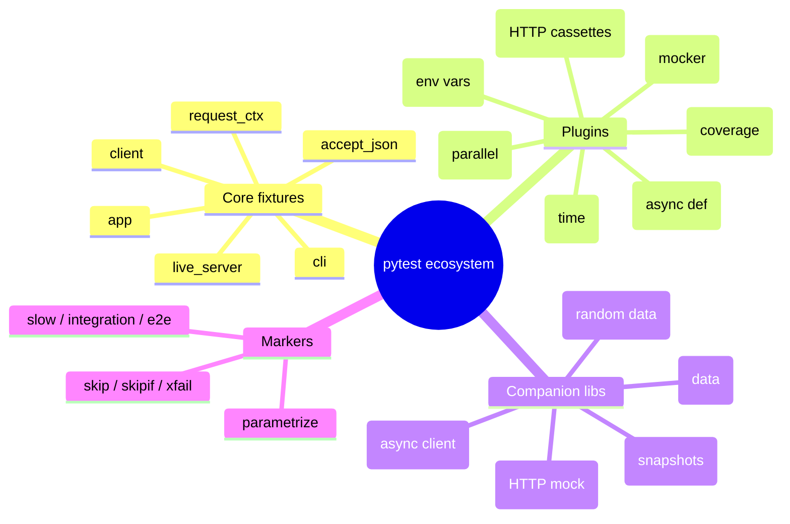
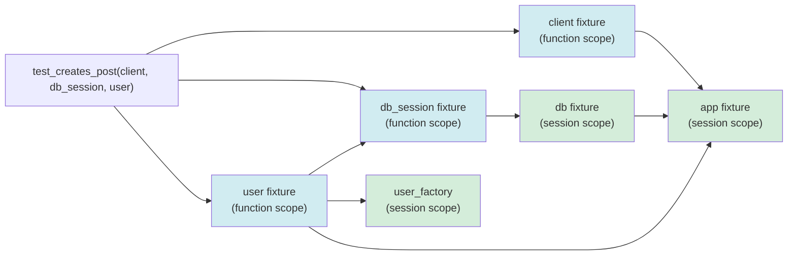
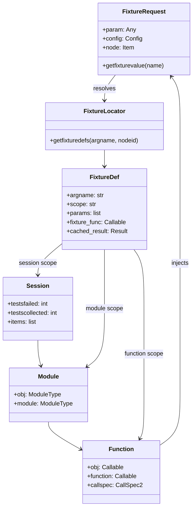
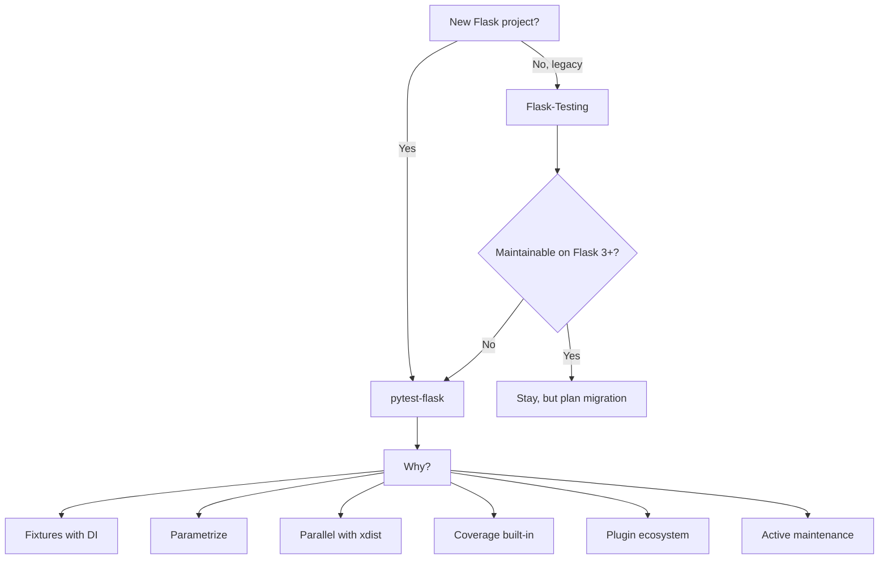

# Pytest-Flask

#flask #pytest #testing #fixtures #coverage #ci #async

> [!info] The modern testing standard for Flask
> **Pytest-Flask** is a small plugin (a few hundred lines) that bolts Flask onto [pytest](https://docs.pytest.org/). It provides ready-made fixtures (`app`, `client`, `cli`, `request_ctx`, `accept_json`, …), configures pytest to find your app factory, and teaches pytest how to introspect Flask's test client. Combined with pytest's own killer features — **fixtures with dependency injection**, **parametrization**, **rich assertions**, **plugins** — it is the recommended way to test Flask apps today, superseding the legacy [[Flask-Testing]] library.

Think of pytest as a **DI framework that happens to run tests**. Each test function is just a function that takes arguments; pytest sees those arguments' names, finds the matching fixture, builds it (caching it at the right scope), and injects it. Once you internalize this, "testing Flask" stops being a special activity and becomes just "writing Python functions that ask for the things they need."

---

## 1. Overview & Metaphor

### Why pytest over `unittest`?

| Concern | `unittest` | `pytest` |
|---|---|---|
| Assertion syntax | `self.assertEqual(a, b)` | `assert a == b` (rewritten with assertion-introspection) |
| Test discovery | classes, methods named `test_*` | any `test_*` function in `test_*.py` |
| Setup/teardown | `setUp`/`tearDown` methods | **Fixtures** (DI, composable, scoped) |
| Parametrization | none built-in | `@pytest.mark.parametrize` |
| Skipping / xfail | decorators | decorators, same syntax |
| Plugins | scarce | hundreds on PyPI (`-xdist`, `-cov`, `-asyncio`, `-mock`, `-vcr`, …) |
| Failure output | "OK" / "FAIL" + traceback | rich diffs for dicts, lists, dataclasses |
| Customization | metaclasses, subclasses | `conftest.py` + hooks |
| Parallelism | not really | `pytest -n auto` (pytest-xdist) |

The biggest single win is **fixtures**. A fixture is a function decorated with `@pytest.fixture` that produces a value (an object, a database session, a logged-in client, …) and lives for a configurable scope (`function`, `class`, `module`, `package`, `session`). Tests declare which fixtures they need by **argument name**; pytest builds the dependency tree and injects.

### What pytest-flask adds

| Fixture / hook | Purpose |
|---|---|
| `app` | A Flask app. You override this in your `conftest.py` to return your app factory's output. |
| `client` | `app.test_client()` — already wired to `app`. |
| `test_client` | Lower-level alias; same object. |
| `cli` | A Click `CliRunner` bound to your app's CLI. |
| `request_ctx` | A pushed `test_request_context()`. |
| `accept_json` / `accept_jsonp` | Header dicts ready to pass to `client.get(..., headers=accept_json)`. |
| `config` | Override hook to mutate app config before tests. |
| `live_server` | Threaded real HTTP server (replaces Flask-Testing's `LiveServerTestCase`). |
| `pytest.mark.app(options)` | Pass options to the app fixture. |

### What pytest-flask does NOT do

It is a thin plugin. Database transaction rollback, factory construction, mocking, coverage, parallelism — all come from **other** plugins or your own fixtures. This is by design: pytest's philosophy is "small composable pieces."

> [!tip] The metaphor
> Pytest is a **restaurant kitchen** with a brigade system. Fixtures are the stations (prep, grill, sauté, pastry). A test is an order: "I need a logged-in client, a seeded database, and a mocked mailer" — pytest's expediter reads the ticket, summons each station, and the stations produce exactly what's asked for, in the right scope (an entrée for one table is not the same as a batch for the banquet).

---

## 2. Installation

```bash
(venv) $ pip install pytest pytest-flask
```

The full testing stack most Flask projects end up with:

```bash
(venv) $ pip install \
    pytest \
    pytest-flask \
    pytest-cov \
    pytest-mock \
    pytest-xdist \
    pytest-asyncio \
    pytest-vcr \
    pytest-env \
    factory-boy \
    faker \
    freezegun \
    responses
```

| Plugin | Role |
|---|---|
| `pytest-flask` | Flask fixtures (`app`, `client`, …) |
| `pytest-cov` | Coverage reports inside pytest |
| `pytest-mock` | `mocker` fixture — wraps `unittest.mock` |
| `pytest-xdist` | Parallel runs (`-n auto`) |
| `pytest-asyncio` | `async def` tests & fixtures |
| `pytest-vcr` | Record/replay HTTP via cassettes |
| `pytest-env` | Set env vars from `pyproject.toml` |
| `pytest-freezegun` | (or `freezegun` directly) freeze time |
| `factory-boy` | Test data factories |
| `faker` | Random realistic data |
| `responses` | Mock `requests`/`httpx` calls |

Versions used in this note:

| Package | Version |
|---|---|
| pytest | 8.x |
| pytest-flask | 1.3.x |
| Flask | 3.0.x |
| Flask-SQLAlchemy | 3.1.x |
| pytest-cov | 5.x |
| pytest-asyncio | 0.23.x |

---

## 3. Configuration

### Mermaid: pytest plugin ecosystem



### `pyproject.toml` (preferred)

```toml
[tool.pytest.ini_options]
minversion = "8.0"
addopts = "-ra --strict-markers --strict-config --cov=app --cov-report=term-missing --cov-report=html"
testpaths = ["tests"]
filterwarnings = [
    "error",
    "ignore::DeprecationWarning:flask_sqlalchemy.*",
]
markers = [
    "slow: marks tests as slow (deselect with '-m \"not slow\"')",
    "integration: requires database",
    "e2e: end-to-end via live_server",
    "smoke: quick sanity checks",
]
```

### `pytest.ini` (legacy alternative)

```ini
[pytest]
addopts = -ra --strict-markers
testpaths = tests
markers =
    slow: marks tests as slow
    integration: requires database
```

### `.coveragerc`

```ini
[run]
source = app
branch = True
omit =
    app/__init__.py
    app/wsgi.py
    */migrations/*

[report]
exclude_lines =
    pragma: no cover
    if __name__ == .__main__.:
    raise NotImplementedError
    if TYPE_CHECKING:
show_missing = True
skip_covered = False
```

### Project layout

```
myproject/
├── app/
│   ├── __init__.py          # create_app()
│   ├── extensions.py
│   ├── models/
│   ├── api/
│   └── ...
├── tests/
│   ├── conftest.py          # top-level fixtures (app, db, client)
│   ├── unit/
│   │   ├── conftest.py      # unit-only fixtures
│   │   ├── test_models.py
│   │   └── test_serializers.py
│   ├── integration/
│   │   ├── conftest.py      # db_session, factories
│   │   ├── test_auth_flow.py
│   │   └── test_posts_api.py
│   └── e2e/
│       ├── conftest.py      # live_server, selenium
│       └── test_signup.py
├── pyproject.toml
└── .coveragerc
```

### Telling pytest-flask about your app

pytest-flask looks for an `app` fixture. You provide it in `conftest.py`:

```python
# tests/conftest.py
import pytest
from app import create_app
from app.config import TestConfig

@pytest.fixture
def app():
    app = create_app(TestConfig)
    yield app
    # cleanup (close db engine, etc.) here if needed

@pytest.fixture
def client(app):
    return app.test_client()
```

That's it. `pytest` discovers `test_*.py` files, `pytest-flask` injects `client` into any test that asks for it.

---

## 4. Basic Usage

### Hello world

```python
# tests/test_health.py
def test_index_returns_200(client):
    response = client.get("/")
    assert response.status_code == 200

def test_index_says_hello(client):
    response = client.get("/")
    assert b"Hello" in response.data

def test_unknown_route_is_404(client):
    response = client.get("/nope")
    assert response.status_code == 404
```

Run:

```bash
(venv) $ pytest                          # all tests
(venv) $ pytest tests/test_health.py     # one file
(venv) $ pytest tests/test_health.py::test_index_returns_200
(venv) $ pytest -k "index"               # keyword filter
(venv) $ pytest -m "not slow"            # marker filter
(venv) $ pytest -x                       # stop on first failure
(venv) $ pytest --lf                     # rerun last failures
(venv) $ pytest -n auto                  # parallel
```

### Built-in pytest-flask fixtures

```python
def test_with_app(app):
    # `app` is your Flask app instance
    assert app.config["TESTING"] is True

def test_with_client(client):
    # `client` is app.test_client()
    assert client.get("/").status_code == 200

def test_with_cli_runner(cli):
    result = cli.invoke(args=["routes"])
    assert result.exit_code == 0

def test_with_accept_json(client, accept_json):
    response = client.get("/api/posts", headers=accept_json)
    assert response.is_json

def test_with_request_ctx(app, request_ctx):
    # request_ctx is a pushed test_request_context("/")
    from flask import url_for
    assert url_for("main.index") == "/"
```

### Parametrization

```python
import pytest

@pytest.mark.parametrize("url,expected_status", [
    ("/", 200),
    ("/about", 200),
    ("/posts/9999", 404),
    ("/admin", 302),       # redirect to login
])
def test_url_status_codes(client, url, expected_status):
    response = client.get(url)
    assert response.status_code == expected_status


@pytest.mark.parametrize("username,valid", [
    ("alice", True),
    ("bob", True),
    ("", False),
    ("a" * 300, False),
])
def test_username_validation(app, username, valid):
    from app.validators import is_valid_username
    assert is_valid_username(username) is valid
```

### Marks: skip / xfail

```python
import pytest

@pytest.mark.skip(reason="pending #451")
def test_future_feature(client):
    ...

@pytest.mark.skipif(sys.platform == "win32", reason="no signals on win")
def test_signal_handler(client):
    ...

@pytest.mark.xfail(reason="known issue #312, will fix in v2")
def test_known_bug(client):
    ...

@pytest.mark.slow
def test_full_reindex(app):
    ...
```

---

## 5. Intermediate Patterns — Fixtures

### Fixture dependency resolution



pytest reads each test's argument list, resolves each name to a fixture, builds the DAG, and instantiates each fixture exactly once per its scope. A `session`-scoped `app` built for one test is reused by every other test that needs `app`.

### Fixture scopes

| Scope | Built once per | Use for |
|---|---|---|
| `function` (default) | each test function | ephemeral state (test client, transaction, mocked object) |
| `class` | each test class | rare; prefer `module` or `session` |
| `module` | each `.py` file | data shared by tests in one file |
| `package` | each `tests/<dir>/` | rarely used |
| `session` | entire pytest run | Flask app, DB engine, factory-boy session |

```python
@pytest.fixture(scope="session")
def app():
    return create_app(TestConfig)

@pytest.fixture(scope="session")
def _db(app):
    from app.extensions import db
    with app.app_context():
        db.create_all()
        yield db
        db.drop_all()

@pytest.fixture(scope="function")
def db_session(_db):
    """Per-test transaction, rolled back at the end."""
    conn = _db.engine.connect()
    trans = conn.begin()
    options = {"bind": conn, "binds": {}}
    session = _db._make_scoped_session(options=options)
    _db.session = session
    yield session
    session.remove()
    trans.rollback()
    conn.close()
```

### `conftest.py` patterns

`conftest.py` files are auto-discovered by pytest. Fixtures defined in `tests/conftest.py` are available to every test under `tests/`; those in `tests/integration/conftest.py` only to tests under `tests/integration/`.

```python
# tests/conftest.py
import pytest
from app import create_app
from app.config import TestConfig

@pytest.fixture(scope="session")
def app():
    app = create_app(TestConfig)
    ctx = app.app_context()
    ctx.push()
    yield app
    ctx.pop()

@pytest.fixture(scope="session")
def _db(app):
    from app.extensions import db
    db.create_all()
    yield db
    db.drop_all()

@pytest.fixture
def client(app):
    return app.test_client()

@pytest.fixture
def runner(app):
    return app.test_cli_runner()
```

### Mermaid: the fixture class hierarchy



### Common custom fixtures

**Logged-in client** — most-used fixture in any auth-protected app:

```python
@pytest.fixture
def user(db_session):
    from app.models import User
    u = User(email="alice@example.com")
    u.set_password("pw")
    db_session.add(u)
    db_session.commit()
    return u

@pytest.fixture
def logged_in_client(client, user):
    with client.session_transaction() as sess:
        sess["_user_id"] = str(user.id)
    return client
```

**Logged-in admin**:

```python
@pytest.fixture
def admin_user(db_session):
    from app.models import User
    u = User(email="admin@example.com", is_admin=True)
    u.set_password("pw")
    db_session.add(u); db_session.commit()
    return u

@pytest.fixture
def admin_client(client, admin_user):
    with client.session_transaction() as sess:
        sess["_user_id"] = str(admin_user.id)
    return client
```

**Mocked mailer** (with Flask-Mail's suppress mode):

```python
@pytest.fixture
def outbox(app):
    from app.extensions import mail
    # TestConfig sets MAIL_SUPPRESS_SEND = True
    with mail.record_messages() as outbox:
        yield outbox
```

**Factory-boy factories**:

```python
# tests/factories.py
import factory
from app.models import User, Post

class UserFactory(factory.alchemy.SQLAlchemyModelFactory):
    class Meta:
        model = User
        sqlalchemy_session = None           # set in conftest
        sqlalchemy_session_persistence = "commit"

    email = factory.Sequence(lambda n: f"user{n}@example.com")
    password_hash = factory.LazyFunction(lambda: hash_pw("pw"))

class PostFactory(factory.alchemy.SQLAlchemyModelFactory):
    class Meta:
        model = Post
        sqlalchemy_session = None
        sqlalchemy_session_persistence = "commit"

    title = factory.Faker("sentence")
    body = factory.Faker("paragraph")
    published = True
    author = factory.SubFactory(UserFactory)
```

```python
# tests/conftest.py
@pytest.fixture(scope="function", autouse=True)
def bind_factories(db_session):
    from tests.factories import UserFactory, PostFactory
    UserFactory._meta.sqlalchemy_session = db_session
    PostFactory._meta.sqlalchemy_session = db_session
    yield
```

### Fixture cleanup with `yield`

```python
@pytest.fixture
def freeze_time(mocker):
    from freezegun import freeze_time
    frozen = freeze_time("2024-06-01 12:00:00")
    frozen.start()
    yield frozen
    frozen.stop()
```

### `autouse` fixtures

```python
@pytest.fixture(autouse=True)
def reset_cache(app):
    """Run before every test, no need to declare."""
    from app.extensions import cache
    cache.clear()
    yield
    cache.clear()
```

> [!warning] Don't overuse `autouse`
> An `autouse=True` fixture applies to **every** test in its scope, even ones that don't need it. If your `reset_cache` fixture takes 50ms and you have 1000 tests, that's 50 extra seconds. Use sparingly.

---

## 6. Advanced Usage

### Parametrized fixtures

```python
@pytest.fixture(params=["alice", "bob", "carol"])
def username(request):
    return request.param

def test_user_can_log_in(client, username):
    # runs 3 times, once per param
    ...
```

### Snapshot testing with `syrupy`

```python
import pytest
from syrupy.extensions.json import JSONSnapshotExtension

@pytest.fixture
def snapshot_json(snapshot):
    return snapshot.with_defaults(extension_class=JSONSnapshotExtension)

def test_api_response_matches_snapshot(client, snapshot_json):
    response = client.get("/api/posts")
    assert response.json == snapshot_json
```

First run writes `tests/__snapshots__/test_posts.test_api_response_matches_snapshot.json`. Subsequent runs diff against it. Update with `pytest --snapshot-update`.

### Testing CLI commands

```python
def test_create_admin(runner):
    result = runner.invoke(args=["users", "create-admin",
                                 "alice", "alice@example.com",
                                 "--password=pw"])
    assert result.exit_code == 0
    assert "Created admin alice" in result.output

def test_create_admin_validates_email(runner):
    result = runner.invoke(args=["users", "create-admin",
                                 "alice", "not-an-email",
                                 "--password=pw"])
    assert result.exit_code != 0
    assert "Invalid email" in result.output
```

### Testing [[Celery]] tasks

Set eager mode in `TestConfig`:

```python
class TestConfig(Config):
    CELERY_TASK_ALWAYS_EAGER = True
    CELERY_TASK_EAGER_PROPAGATES = True       # exceptions raise inline
    CELERY_BROKER_URL = "memory://"
    CELERY_RESULT_BACKEND = "cache+memory://"
```

Now `send_welcome_email.delay(user.id)` runs synchronously in the same process; exceptions propagate.

```python
def test_send_welcome_email(user, outbox):
    send_welcome_email.delay(user.id)
    assert len(outbox) == 1
    assert user.email in outbox[0].recipients

def test_task_raises_on_missing_user(db_session):
    from app.tasks import send_welcome_email
    with pytest.raises(UserNotFoundError):
        send_welcome_email.delay(99999)
```

### Testing [[Flask-SocketIO]]

`flask_socketio.SocketIO.test_client` gives you an in-process socket client — no real WebSocket.

```python
@pytest.fixture
def socketio(app):
    from app.extensions import socketio
    return socketio

def test_broadcast_on_new_post(socketio, client, user):
    sio = socketio.test_client(app)
    sio.emit("join", {"room": "posts"})
    # trigger the broadcast
    client.post("/api/posts", json={"title": "t", "body": "b"},
                headers={"Authorization": f"Bearer {token_for(user)}"})
    received = sio.get_received()
    assert any(ev["name"] == "post_created" for ev in received)
```

### Testing [[Flask-JWT-Extended]]

```python
@pytest.fixture
def auth_headers(user):
    from flask_jwt_extended import create_access_token
    token = create_access_token(identity=str(user.id))
    return {"Authorization": f"Bearer {token}"}

def test_protected_endpoint(client, auth_headers):
    response = client.get("/api/me", headers=auth_headers)
    assert response.status_code == 200
    assert response.json["id"] == user.id
```

> [!info] Token creation requires an app context
> `create_access_token` reads config off `current_app`. If you call it outside a request, push an app context: `with app.app_context(): token = create_access_token(...)`.

### Testing async Flask (Flask 2.x+ async views)

Install `pytest-asyncio`:

```bash
(venv) $ pip install pytest-asyncio
```

`pyproject.toml`:

```toml
[tool.pytest.ini_options]
asyncio_mode = "auto"
```

```python
# app/api/posts.py
from flask import Blueprint, jsonify, request
bp = Blueprint("posts", __name__)

@bp.post("/api/posts")
async def create_post():
    data = await request.get_json()
    # async DB call or HTTP fetch...
    return jsonify(data), 201
```

```python
# tests/test_async_views.py
async def test_async_create_post(client):
    response = await client.post("/api/posts", json={"title": "t"})
    assert response.status_code == 201
    body = await response.get_json()
    assert body["title"] == "t"
```

> [!warning] Test client async support
> Flask's `app.test_client()` returns a sync client in 3.0; use `app.test_client(use_cookies=True)` and the `httpx`-based async client (`flask.testing.FlaskClient`'s async variant) — or just keep async views synchronous at the test boundary by awaiting the coroutine inside the test.

### `live_server` for Selenium / Playwright

pytest-flask ships a `live_server` fixture:

```python
# tests/e2e/test_signup.py
import pytest
from selenium import webdriver
from selenium.webdriver.common.by import By

@pytest.fixture
def browser():
    options = webdriver.ChromeOptions()
    options.add_argument("--headless")
    b = webdriver.Chrome(options=options)
    yield b
    b.quit()

def test_signup(live_server, browser):
    browser.get(f"{live_server.url}/signup")
    browser.find_element(By.NAME, "email").send_keys("alice@example.com")
    browser.find_element(By.NAME, "password").send_keys("swordfish")
    browser.find_element(By.CSS_SELECTOR, "button").click()
    assert "Welcome" in browser.page_source
```

```toml
# pyproject.toml
[tool.pytest.ini_options]
live_server_scope = "session"     # reuse the server for the whole run
```

### Recording HTTP with `pytest-vcr`

```python
@pytest.mark.vcr
def test_geoip_lookup(client):
    response = client.get("/whereami?ip=8.8.8.8")
    assert response.status_code == 200
```

First run records `tests/cassettes/test_geoip_lookup.yaml`. Subsequent runs replay without hitting the network — fast and hermetic.

### Coverage with `pytest-cov`

```bash
(venv) $ pytest --cov=app --cov-report=term-missing --cov-report=html
(venv) $ pytest --cov=app --cov-fail-under=80    # CI gate
```

### Mermaid: journey of a single test run


---

## 7. Common Pitfalls & Troubleshooting

### Pitfall 1 — `Fixture "app" called directly`

```python
def test_something(app):
    app()       # WRONG: app is already the Flask instance
```

**Fix**: `app` is the *built* Flask application object, not the factory. Call factory methods, not `app()`.

### Pitfall 2 — DB pollution: tests pass alone, fail together

**Cause**: a `session`-scoped `_db` fixture plus per-test `db.session.commit()` writes data that persists.

**Fix**: use a per-test transaction that rolls back:

```python
@pytest.fixture
def db_session(_db):
    connection = _db.engine.connect()
    transaction = connection.begin()
    session = _db._make_scoped_session(bind=connection)
    yield session
    session.remove()
    transaction.rollback()
    connection.close()
```

### Pitfall 3 — "Working outside of application context"

**Cause**: you accessed `db.session`, `url_for`, or `current_app` outside a request and outside an app context.

**Fix**:

```python
def test_helper(app):
    with app.app_context():
        do_db_stuff()
```

Or push the context in the fixture:

```python
@pytest.fixture(scope="session")
def app():
    app = create_app(TestConfig)
    with app.app_context():
        yield app
```

### Pitfall 4 — `client` fixture returns `None` after `with` block

**Cause**: you wrote `with client: ...` — the WSGI app context is exited at the end of the `with`, so subsequent calls to `client.get()` fail.

**Fix**: don't use `client` as a context manager unless you specifically want the teardown.

### Pitfall 5 — Async test not awaited / skipped

**Cause**: forgot `pytest-asyncio` or didn't set `asyncio_mode = "auto"`.

**Fix**: install `pytest-asyncio` and add to `pyproject.toml`:

```toml
[tool.pytest.ini_options]
asyncio_mode = "auto"
```

### Pitfall 6 — `--cov` shows 100% but real bugs slip through

**Cause**: 100% line coverage doesn't mean 100% branch coverage, and neither means "all behaviors are asserted".

**Fix**: turn on branch coverage (`branch = True` in `.coveragerc`), add mutation testing (`mutmut` or `cosmic-ray`) on a regular cadence, and write *behavioral* assertions, not just "this line executed".

### Pitfall 7 — `factory_boy` writes to wrong session

**Cause**: `Factory._meta.sqlalchemy_session` was set in a different scope than the test's `db_session`.

**Fix**: bind in an `autouse` fixture scoped to `function`:

```python
@pytest.fixture(autouse=True, scope="function")
def _bind_factories(db_session):
    for f in (UserFactory, PostFactory):
        f._meta.sqlalchemy_session = db_session
```

### Pitfall 8 — Parallel test failures (`pytest-xdist`)

**Cause**: shared mutable global state (module-level singletons, file-based locks, in-memory SQLite).

**Fix**:
- Use `pytest-xdist`'s `--dist=loadgroup` to keep tests that share state on the same worker.
- Use a per-worker DB: `SQLALCHEMY_DATABASE_URI = f"sqlite:///test-{worker_id}.db"` (read `PYTEST_XDIST_WORKER` env var).
- Or run parallel *per file* with `pytest -n auto --dist=loadfile`.

### Pitfall 9 — Slow tests, no obvious culprit

**Cause**: usually `scope="function"` on a fixture that builds something expensive (full app + db schema).

**Fix**: hoist to `scope="session"` and use a per-test transaction rollback for isolation.

### Pitfall 10 — Markers not registered → warning → error

With `--strict-markers`, unknown marks error out:

```
'foo' not found in `markers` configuration option
```

**Fix**: declare every marker in `pyproject.toml`:

```toml
[tool.pytest.ini_options]
markers = ["slow: ...", "integration: ...", "foo: ..."]
```

---

## 8. Best Practices

1. **App factory is mandatory.** `create_app(TestConfig)` is the only sane way to inject test config.
2. **Session-scoped app + per-test transaction.** Build the schema once, roll back per test. This is the single biggest performance win.
3. **One fixture, one concern.** Don't make `db_session` also log a user in. Compose small fixtures.
4. **Name fixtures by what they produce**, not by what they test: `logged_in_client`, not `test_helper`.
5. **Parametrize aggressively.** If you find yourself copy-pasting a test and changing one input, parametrize it.
6. **Use `--strict-markers` and `--strict-config`** from day one; future-you will thank you.
7. **Fail on warnings** (`filterwarnings = ["error"]`); squash deprecations early.
8. **Aim for the *meaningful* 80%.** Don't write tests just to hit 100%.
9. **Run the full suite in CI on every push**, and the subset you can in 5s locally.
10. **Keep tests hermetic** — no real network, no real clock, no real filesystem writes outside `tmp_path`.
11. **Use `tmp_path` for filesystem tests**, never `/tmp`.
12. **Snapshot your API responses**, then diff in review.
13. **Pin your plugins** in `requirements-dev.txt` — pytest-flask API breaks happen.

> [!tip] The fixture heuristic
> If you find yourself writing the same 5 lines in `setUp` of multiple test classes, it's a fixture. If a fixture grows past 20 lines, it's probably two fixtures. If two fixtures always go together, compose them: `def admin_client(client, admin_user): ...`.

---

## 9. Integration with Other Extensions

| Extension | Fixture pattern |
|---|---|
| [[Flask-SQLAlchemy]] | Session-scoped `_db` (create_all once) + function-scoped `db_session` with rollback. |
| [[Flask-Login]] | `logged_in_client` sets `_user_id` in `session_transaction()`; or use `login_user()` inside `app.test_request_context()`. |
| [[Flask-WTF]] | `TestConfig.WTF_CSRF_ENABLED = False`; or fetch & submit token via a `csrf_token` fixture. |
| [[Flask-Mail]] | `TestConfig.MAIL_SUPPRESS_SEND = True`; `outbox` fixture uses `mail.record_messages()`. |
| [[Flask-Caching]] | `TestConfig.CACHE_TYPE = "NullCache"`; or `autouse` fixture calling `cache.clear()`. |
| [[Flask-Limiter]] | `RATELIMIT_ENABLED = False`. |
| [[Flask-JWT-Extended]] | `auth_headers` fixture builds a token via `create_access_token()`. |
| [[Marshmallow]] | Test schemas directly; no Flask needed. `schema.dump(obj)` returns a `dict` you can assert on. |
| [[Celery]] | `CELERY_TASK_ALWAYS_EAGER = True` + `CELERY_TASK_EAGER_PROPAGATES = True`. |
| [[Flask-SocketIO]] | `socketio.test_client(app)` — in-process, no WebSocket. |

---

## 10. Real-World Example: Full Test Suite for a Blog API

### The API (abridged)

```python
# app/api/posts.py
from flask import Blueprint, request, g
from flask_login import login_required, current_user
from app.extensions import db
from app.models import Post
from app.serializers import PostSchema

bp = Blueprint("posts", __name__)

@bp.get("/posts")
def list_posts():
    posts = Post.query.filter_by(published=True).order_by(Post.created_at.desc()).all()
    return PostSchema(many=True).dump(posts)

@bp.post("/posts")
@login_required
def create_post():
    payload = PostSchema().load(request.get_json())
    post = Post(**payload, author=current_user)
    db.session.add(post); db.session.commit()
    return PostSchema().dump(post), 201

@bp.get("/posts/<int:post_id>")
def get_post(post_id):
    post = db.session.get(Post, post_id)
    if not post:
        return {"error": "not found"}, 404
    return PostSchema().dump(post)
```

### `tests/conftest.py`

```python
import pytest
from app import create_app
from app.config import TestConfig

@pytest.fixture(scope="session")
def app():
    app = create_app(TestConfig)
    with app.app_context():
        yield app

@pytest.fixture(scope="session")
def _db(app):
    from app.extensions import db
    db.create_all()
    yield db
    db.drop_all()

@pytest.fixture
def db_session(_db):
    conn = _db.engine.connect()
    trans = conn.begin()
    session = _db._make_scoped_session(bind=conn)
    _db.session = session
    yield session
    session.remove()
    trans.rollback()
    conn.close()

@pytest.fixture
def client(app):
    return app.test_client()

@pytest.fixture(autouse=True)
def _bind_factories(db_session):
    from tests.factories import UserFactory, PostFactory
    UserFactory._meta.sqlalchemy_session = db_session
    PostFactory._meta.sqlalchemy_session = db_session

@pytest.fixture
def user(db_session):
    from tests.factories import UserFactory
    return UserFactory()

@pytest.fixture
def logged_in_client(client, user):
    with client.session_transaction() as sess:
        sess["_user_id"] = str(user.id)
    return client

@pytest.fixture
def outbox(app):
    from app.extensions import mail
    with mail.record_messages() as outbox:
        yield outbox
```

### Unit tests (no Flask)

```python
# tests/unit/test_serializers.py
from app.serializers import PostSchema

def test_post_schema_serializes_post():
    schema = PostSchema()
    post = type("P", (), {"id": 1, "title": "t", "body": "b",
                          "published": True, "author_id": 7})()
    data = schema.dump(post)
    assert data == {"id": 1, "title": "t", "body": "b",
                    "published": True, "author_id": 7}

def test_post_schema_requires_title():
    schema = PostSchema()
    errors = schema.validate({"body": "b"})
    assert "title" in errors
```

### Integration tests

```python
# tests/integration/test_posts_api.py
import pytest
from tests.factories import PostFactory, UserFactory

@pytest.mark.parametrize("count", [0, 1, 5, 20])
def test_list_posts(client, db_session, count):
    for _ in range(count):
        PostFactory(published=True)
    PostFactory(published=False)         # should be excluded
    response = client.get("/posts")
    assert response.status_code == 200
    assert len(response.json) == count

def test_create_post_requires_login(client):
    response = client.post("/posts", json={"title": "t", "body": "b"})
    assert response.status_code == 302                  # redirect to login

def test_create_post_with_valid_payload(logged_in_client, user, outbox):
    response = logged_in_client.post("/posts", json={
        "title": "Hello", "body": "World", "published": True,
    })
    assert response.status_code == 201
    assert response.json["title"] == "Hello"
    assert response.json["author_id"] == user.id
    assert len(outbox) == 1                              # if you notify on publish

@pytest.mark.parametrize("payload,field", [
    ({"body": "b"}, "title"),
    ({"title": "t"}, "body"),
    ({"title": "t", "body": "b", "published": "yes"}, "published"),
])
def test_create_post_validates_payload(logged_in_client, payload, field):
    response = logged_in_client.post("/posts", json=payload)
    assert response.status_code == 400
    assert field in response.json["errors"]

def test_get_post_returns_404_for_missing(client):
    response = client.get("/posts/9999")
    assert response.status_code == 404
    assert response.json == {"error": "not found"}
```

### CLI tests

```python
# tests/integration/test_cli.py
def test_create_admin(runner, db_session):
    result = runner.invoke(args=["users", "create-admin",
                                 "alice", "alice@example.com",
                                 "--password=pw"])
    assert result.exit_code == 0
    from app.models import User
    assert User.query.filter_by(email="alice@example.com").first() is not None
```

### Snapshot tests

```python
# tests/integration/test_posts_snapshot.py
def test_post_payload_shape(client, db_session, snapshot_json):
    PostFactory(published=True, title="t", body="b")
    response = client.get("/posts")
    assert response.json == snapshot_json
```

### Running it

```bash
(venv) $ pytest                                    # all
(venv) $ pytest tests/unit                         # just unit
(venv) $ pytest -m "not slow"                      # skip slow
(venv) $ pytest -n auto                            # parallel
(venv) $ pytest --cov=app --cov-fail-under=85      # with gate
```

Sample output:

```
========================= test session starts =========================
collected 47 items

tests/unit/test_serializers.py ..                              [  4%]
tests/integration/test_posts_api.py ...........s..           [ 36%]
tests/integration/test_cli.py ...                            [ 42%]
tests/integration/test_posts_snapshot.py .                   [ 44%]
tests/e2e/test_signup.py ..                                   [ 48%]
...

---------- coverage: app ----------
Name                    Stmts   Miss  Branch BrPart  Cover   Missing
-------------------------------------------------------------------
app/api/posts.py           22      0      8      0   100%
app/models.py              18      0      4      0   100%
app/serializers.py         14      1      6      0    95%   41
-------------------------------------------------------------------
TOTAL                     158      3     38      1    97%

Required test coverage of 85% reached. Total coverage: 97.00%
======================== 47 passed in 3.12s =========================
```

---

## CI/CD: GitHub Actions

```mermaid
gantt
    title CI pipeline wall-clock (typical PR, ~100s)
    dateFormat HH:mm:ss
    axisFormat %M:%S
    section Setup
    Checkout            :a1, 00:00:00, 3s
    Install Python      :a2, after a1, 5s
    pip install deps    :a3, after a2, 25s
    section Test
    Lint (ruff)         :b1, after a3, 6s
    Typecheck (mypy)    :b2, after a3, 12s
    Unit tests          :b3, after b1, 9s
    Integration tests   :b4, after b3, 22s
    E2E (live_server)   :b5, after b4, 18s
    section Report
    Coverage report     :c1, after b5, 3s
    Codecov upload      :c2, after c1, 4s
```



```yaml
# .github/workflows/tests.yml
name: tests

on:
  push:
    branches: [main]
  pull_request:

jobs:
  test:
    runs-on: ubuntu-latest
    strategy:
      matrix:
        python-version: ["3.10", "3.11", "3.12"]
    steps:
      - uses: actions/checkout@v4
      - uses: actions/setup-python@v5
        with:
          python-version: ${{ matrix.python-version }}
      - name: Install
        run: |
          python -m pip install --upgrade pip
          pip install -r requirements.txt -r requirements-dev.txt
      - name: Run tests
        run: pytest --cov=app --cov-fail-under=85 -n auto
      - name: Upload coverage
        if: matrix.python-version == '3.12'
        uses: codecov/codecov-action@v4
```

### Tox for multi-version testing

```ini
# tox.ini
[tox]
envlist = py310, py311, py312, lint, typecheck

[testenv]
deps = -r requirements-dev.txt
commands = pytest {posargs}

[testenv:lint]
deps = ruff
commands = ruff check app tests

[testenv:typecheck]
deps = mypy
commands = mypy app
```

```bash
(venv) $ tox                  # run all envs
(venv) $ tox -e py312         # one env
(venv) $ tox -- -k posts      # pass extra args to pytest
```

---

## 11. References & Further Reading

- **pytest docs**: <https://docs.pytest.org/en/stable/>
- **pytest-flask docs**: <https://pytest-flask.readthedocs.io/>
- **pytest-flask source**: <https://github.com/pytest-dev/pytest-flask>
- **pytest fixtures**: <https://docs.pytest.org/en/stable/explanation/fixtures.html>
- **pytest parametrize**: <https://docs.pytest.org/en/stable/how-to/parametrize.html>
- **Excellent pytest guide**: <https://docs.pytest.org/en/stable/how-to/index.html>
- **factory-boy docs**: <https://factoryboy.readthedocs.io/>
- **pytest-cov**: <https://pytest-cov.readthedocs.io/>
- **pytest-xdist**: <https://pytest-xdist.readthedocs.io/>
- **pytest-asyncio**: <https://pytest-asyncio.readthedocs.io/>
- **syrupy (snapshot)**: <https://github.com/tophat/syrupy>
- **Tox**: <https://tox.wiki/>
- **Miguel Grinberg on testing Flask**: <https://blog.miguelgrinberg.com/post/the-flask-mega-tutorial-part-vii-error-handling>
- **Obey the Testing Goat (TDD)**: <https://www.obeythetestinggoat.com/>

### Related notes in this vault

- [[Flask-Testing]] — the legacy alternative; useful for `LiveServerTestCase` reference
- [[Flask-SQLAlchemy]] — the model layer under test
- [[Flask-Login]] — auth fixtures (`logged_in_client`)
- [[Flask-WTF]] — CSRF & form testing
- [[Flask-JWT-Extended]] — token fixtures
- [[Marshmallow]] — serializer unit tests
- [[Celery]] — eager-mode task tests
- [[Flask-SocketIO]] — `socketio.test_client`
- [[Flask-Mail]] — `outbox` fixture
- [[Flask-Caching]] — cache-clear fixtures
- [[Security-Best-Practices]] — security test checklist

### pytest-flask vs Flask-Testing: a quick decision matrix



> [!success] TL;DR
> Pytest-flask is the **default choice** for Flask testing in 2024+. Fixtures replace `setUp`/`tearDown` with composable, scoped, dependency-injected building blocks. The plugin ecosystem gives you coverage, parallelism, snapshot testing, VCR recording, async support, and more. The only reason to reach for [[Flask-Testing]] is maintaining an existing suite — and even there, a gradual migration to pytest-flask pays for itself within a sprint.
