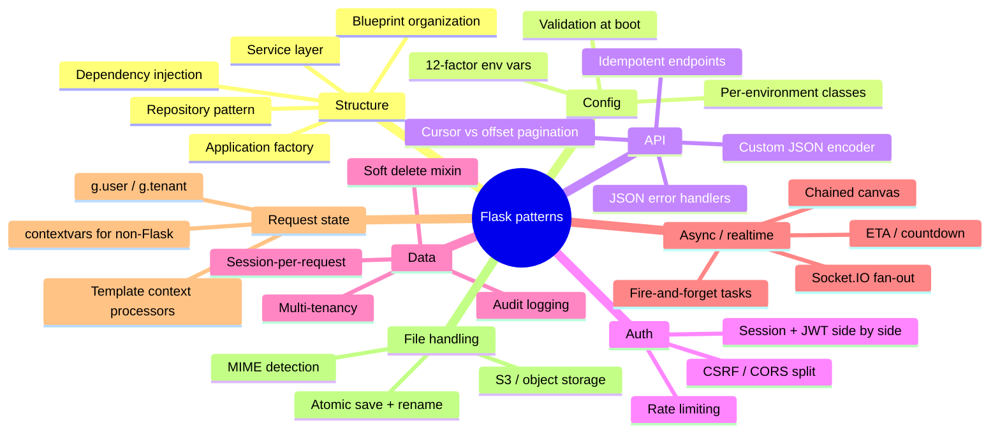
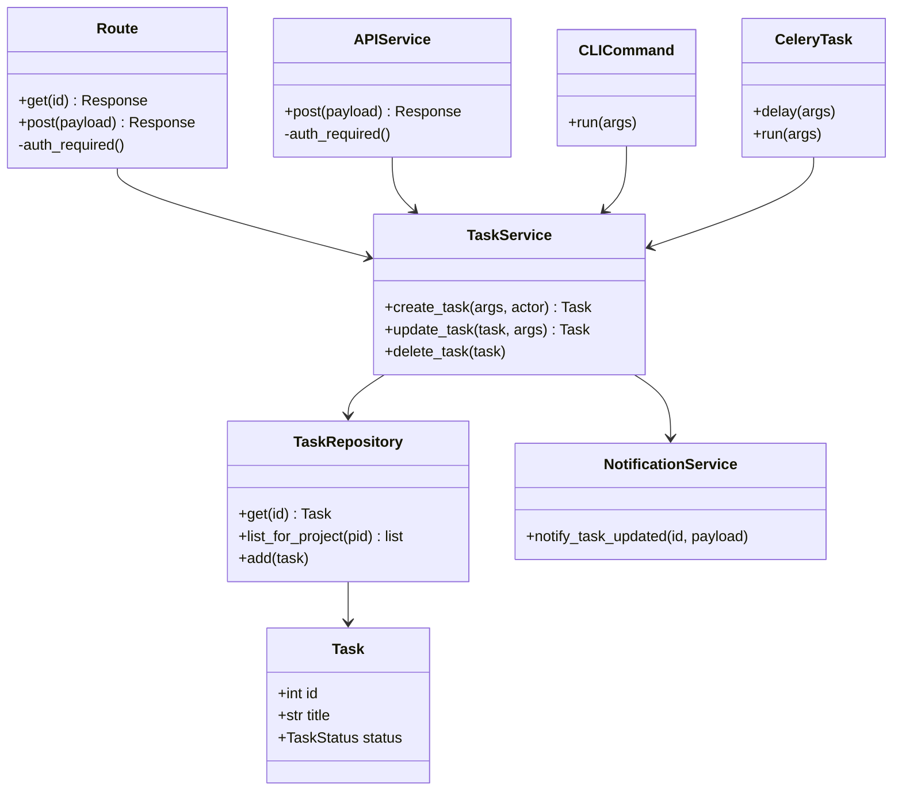
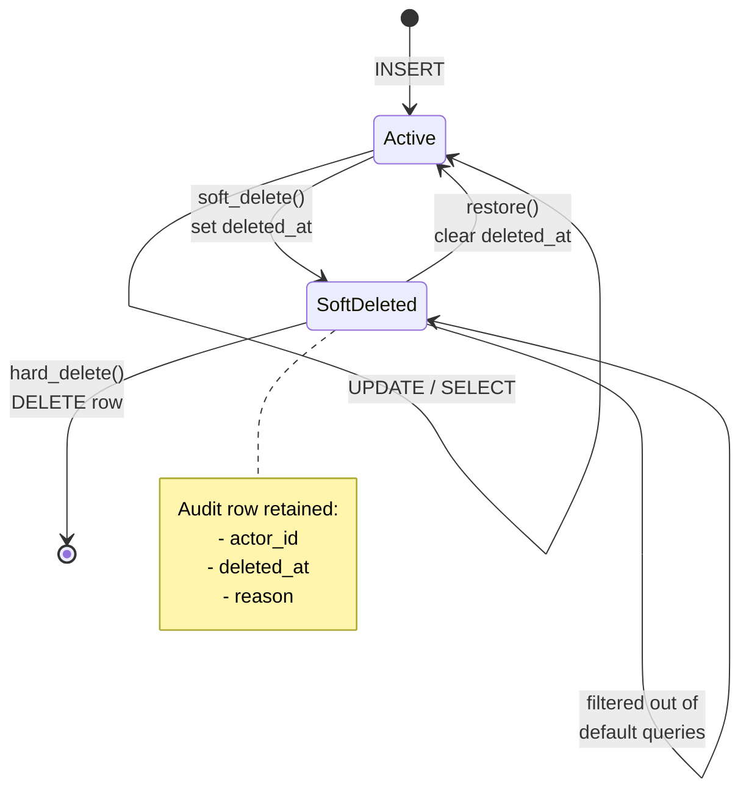
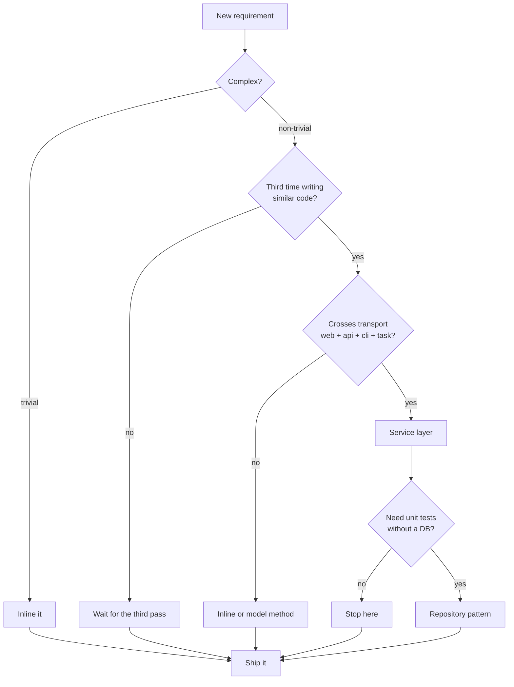
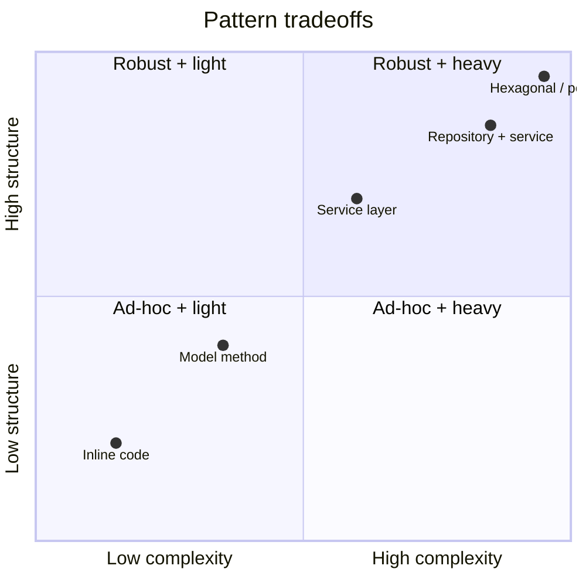

# Common Patterns

#flask #patterns #cookbook #architecture #best-practices

> [!info] The Flask cookbook
> Every extension note shows you *how to use* one tool. This note shows you *how to glue* them. Each section is a self-contained pattern with a code snippet, a "when to use it" note, and the anti-pattern it replaces. Copy whichever ones fit; ignore the rest.

Patterns are not laws — they are defaults. The right answer for your app is always "the simplest thing that could possibly work," and that answer evolves as the app grows. The patterns below are ordered roughly by how early you'll reach for them.

## Patterns at a Glance



---

## 1. Application Factory Pattern

**When**: every Flask app, every time.

```python
# app/__init__.py
from flask import Flask

def create_app(config_name="development"):
    app = Flask(__name__)
    app.config.from_object(f"app.config.{config_name.capitalize()}Config")

    # Init extensions, register blueprints, etc.

    return app
```

```python
# wsgi.py
from app import create_app
app = create_app("production")
```

```python
# manage.py or pytest fixtures
from app import create_app
app = create_app("testing")
```

**Why**: One factory used by the WSGI server, the CLI, the test suite, and Celery. Configuration is selected by argument, not by environment sniffing inside `app.py`. Multiple app instances (e.g., for testing) are trivial.

**Anti-pattern**: A module-level `app = Flask(__name__)` with `db = SQLAlchemy(app)` directly underneath. This makes testing miserable — the app is built at import time with whatever env vars happen to be set.

See [[Project-Structure]] for the full pattern.

---

## 2. Blueprint Organization

**When**: more than ~5 routes; you want to split code across files.

```python
# app/web/__init__.py
from flask import Blueprint
web_bp = Blueprint("web", __name__, template_folder="templates", static_folder="static")

from . import views   # noqa: register routes

# app/api/__init__.py
api_bp = Blueprint("api", __name__)

# app/__init__.py
def create_app():
    ...
    from app.web import web_bp
    from app.api import api_bp
    app.register_blueprint(web_bp)
    app.register_blueprint(api_bp, url_prefix="/api/v1")
```

**Tip**: Use a Blueprint per **business domain**, not per HTTP method. `users_bp` for `/users` web pages + `/api/users` JSON is wrong — keep `web/users.py` and `api/users.py` separate. The boundaries are about **media type and auth**, not feature.

**Anti-pattern**: One giant `views.py` with 500 routes, or one Blueprint per route.

---

## 3. Service Layer Pattern

**When**: any business rule that the same data can reach via multiple transports (web UI, JSON API, CLI, Celery task).

```python
# app/services/task_service.py
from app.extensions import db
from app.models import Task

def create_task(*, title, project_id, assignee_id=None, actor):
    project = Project.query.get_or_404(project_id)
    if actor not in project.members:
        raise PermissionError("not a member")
    task = Task(title=title, project_id=project_id, assignee_id=assignee_id)
    db.session.add(task); db.session.commit()
    notify_task_created(task)
    return task
```

Routes call services; services call models + emit events; models are passive.

```python
# app/api/tasks.py
@use_args(TaskCreateSchema)
def post(self, args, project_id):
    task = create_task(
        title=args["title"],
        project_id=project_id,
        assignee_id=args.get("assignee_id"),
        actor=current_user,
    )
    return TaskSchema().dump(task), 201
```

**Why**: The web route, API resource, CLI command, and Celery task all need to create a task. Putting the logic in the route duplicates it 4×. Putting it in the model couples business rules to data shape.

**Anti-pattern**: Business logic in views, or methods like `Task.create_with_email()` on the model that import Flask-Mail.

### Mermaid: layered architecture — who calls whom



---

## 4. Repository Pattern

**When**: complex query logic, multiple data sources, or you want to unit-test services without a DB.

```python
# app/repositories/task_repo.py
from sqlalchemy import select
from app.extensions import db
from app.models import Task, TaskStatus

class TaskRepository:
    def __init__(self, session=None):
        self.session = session or db.session

    def get(self, task_id: int) -> Task | None:
        return self.session.get(Task, task_id)

    def list_for_project(self, project_id: int, status: TaskStatus | None = None):
        stmt = select(Task).where(Task.project_id == project_id)
        if status:
            stmt = stmt.where(Task.status == status)
        return self.session.execute(stmt).scalars().all()

    def add(self, task: Task):
        self.session.add(task); self.session.commit()
```

Services depend on a repository interface; tests inject a fake.

**Why**: Decouples query logic from the model, makes services unit-testable with a fake repo, and gives you a single place to add caching or audit hooks.

**Anti-pattern**: Using a repository for trivial CRUD on top of SQLAlchemy, which is already a repository. The pattern earns its keep only when queries are non-trivial or when you swap implementations.

---

## 5. Dependency Injection (lightweight)

**When**: services need configuration, repos, or external clients and you want testable wiring.

Flask doesn't ship a DI container, but `current_app.config` plus factory functions are usually enough:

```python
# app/services/__init__.py
class Container:
    """Per-app service container, attached in create_app()."""
    def __init__(self, app):
        self.task_repo = TaskRepository()
        self.mailer = Mailer(
            server=app.config["MAIL_SERVER"],
            username=app.config["MAIL_USERNAME"],
            password=app.config["MAIL_PASSWORD"],
        )

# app/__init__.py
def create_app():
    app = Flask(__name__)
    ...
    app.container = Container(app)

# Anywhere in a request:
def send_welcome(user_id):
    user = User.query.get(user_id)
    current_app.container.mailer.send_welcome(user)
```

For heavier DI, use [dependency-injector](https://python-dependency-injector.ets-labs.org/) or [lagom](https://lagom-di.readthedocs.io/).

**Anti-pattern**: Importing `Mail()` and constructing it inside the function. Untestable, unconfigurable.

---

## 6. Configuration Per Environment

**When**: always.

```python
# app/config.py
import os
from datetime import timedelta

class Config:
    SECRET_KEY = os.environ["SECRET_KEY"]
    SQLALCHEMY_TRACK_MODIFICATIONS = False
    JWT_ACCESS_TOKEN_EXPIRES = timedelta(minutes=15)

class DevelopmentConfig(Config):
    DEBUG = True
    SQLALCHEMY_ECHO = False

class TestingConfig(Config):
    TESTING = True
    SQLALCHEMY_DATABASE_URI = "sqlite:///:memory:"
    WTF_CSRF_ENABLED = False
    RATELIMIT_ENABLED = False

class ProductionConfig(Config):
    DEBUG = False
    PREFERRED_URL_SCHEME = "https"

config_by_name = {
    "development": DevelopmentConfig,
    "testing": TestingConfig,
    "production": ProductionConfig,
}
```

```python
app.config.from_object(config_by_name[os.getenv("FLASK_ENV", "development")])
```

**Anti-pattern**: `if os.environ.get("ENV") == "prod":` scattered through the codebase. Configuration is data, not control flow.

---

## 7. JSON API Error Handlers

**When**: any API.

```python
# app/errors.py
from flask import jsonify, request
from werkzeug.exceptions import HTTPException

def register_error_handlers(app):
    @app.errorhandler(HTTPException)
    def handle_http(e):
        if request.path.startswith("/api/"):
            return jsonify({
                "error": e.name,
                "message": e.description,
                "code": e.code,
            }), e.code
        # Render HTML for web
        return render_template("error.html", code=e.code, message=e.description), e.code

    @app.errorhandler(ValidationError)
    def handle_marshmallow(e):
        return jsonify({"error": "Validation Error", "fields": e.messages}), 422

    @app.errorhandler(IntegrityError)
    def handle_db(e):
        app.logger.exception("DB integrity error")
        return jsonify({"error": "Conflict", "message": "Resource already exists"}), 409

    @app.errorhandler(Exception)
    def handle_unknown(e):
        app.logger.exception("Unhandled")
        if request.path.startswith("/api/"):
            return jsonify({"error": "Internal Server Error", "code": 500}), 500
        return render_template("error.html", code=500), 500
```

> [!warning] The catch-all `Exception` handler hides bugs
> It's there for user experience, not for you. Make sure Sentry or your log shipper catches the full traceback *before* this handler returns a 500. Otherwise you'll get a 500 in production with no clue why.

**Anti-pattern**: `try/except` blocks in every route. Catch at the boundary (the app), let exceptions bubble.

---

## 8. Custom JSON Encoder

**When**: your data has types JSON doesn't (UUID, datetime, Enum, Decimal).

```python
import json
from datetime import datetime, date
from decimal import Decimal
from enum import Enum
from uuid import UUID
from flask.json.provider import DefaultJSONProvider

class CustomJSONProvider(DefaultJSONProvider):
    def default(self, obj):
        if isinstance(obj, (datetime, date)):
            return obj.isoformat()
        if isinstance(obj, UUID):
            return str(obj)
        if isinstance(obj, Decimal):
            return float(obj)
        if isinstance(obj, Enum):
            return obj.value
        return super().default(obj)

# In create_app():
app.json = CustomJSONProvider(app)
```

> [!tip] Prefer Marshmallow for API responses
> A custom encoder is global — every `jsonify()` uses it. For API responses, [[Marshmallow]] gives per-field control and explicit schemas. Reserve the custom encoder for things like `datetime` that should always serialize the same way everywhere.

---

## 9. Pagination Patterns

**When**: any list endpoint.

### Cursor-based (recommended for APIs)

```python
# app/api/tasks.py
from base64 import urlsafe_b64encode, urlsafe_b64decode

def paginate_cursor(query, per_page=20, after=None):
    if after:
        # `after` is base64(last_id)
        last_id = int(urlsafe_b64decode(after.encode()).decode())
        query = query.filter(Task.id > last_id)
    items = query.order_by(Task.id).limit(per_page + 1).all()
    has_more = len(items) > per_page
    items = items[:per_page]
    next_cursor = (
        urlsafe_b64encode(str(items[-1].id).encode()).decode()
        if has_more and items else None
    )
    return {"items": items, "next": next_cursor}
```

Cursors are stable under insertions (a new item at the top doesn't shift your view), don't expose total counts (often expensive), and work well with keyset indexes.

### Offset-based (for web UI)

```python
pagination = db.paginate(select(Task).where(...), page=2, per_page=20)
# pagination.items, pagination.pages, pagination.total, pagination.has_next
```

**Anti-pattern**: Returning `Model.query.all()` and slicing in Python. Loads the whole table.

---

## 10. File Handling Patterns

**When**: uploads, generated files.

```python
import os, uuid
from werkzeug.utils import secure_filename
from flask import abort

ALLOWED_EXTENSIONS = {"png", "jpg", "jpeg", "pdf", "csv"}
MAX_SIZE = 10 * 1024 * 1024

def save_upload(file_storage, dest_dir: str) -> str:
    # 1. Validate extension
    ext = file_storage.filename.rsplit(".", 1)[-1].lower()
    if ext not in ALLOWED_EXTENSIONS:
        abort(400, "File type not allowed")

    # 2. Validate size (Content-Length can lie, so check after read)
    file_storage.seek(0, 2)
    size = file_storage.tell()
    file_storage.seek(0)
    if size > MAX_SIZE:
        abort(413, "File too large")

    # 3. Generate safe, unique name
    safe = secure_filename(file_storage.filename) or f"upload.{ext}"
    name = f"{uuid.uuid4().hex}_{safe}"
    path = os.path.join(dest_dir, name)

    # 4. Write atomically: write to .tmp, then rename
    tmp = path + ".tmp"
    file_storage.save(tmp)
    os.rename(tmp, path)
    return name
```

**For S3 / object storage**:

```python
import boto3
s3 = boto3.client("s3")
s3.upload_fileobj(file_storage, "my-bucket", key, ExtraArgs={
    "ContentType": file_storage.mimetype,
    "Metadata": {"original_filename": secure_filename(file_storage.filename)},
})
```

> [!danger] Never trust `filename` or `mimetype`
> Both come from the client and can be spoofed. Validate extension against an allowlist, store under a generated name, and re-detect mimetype server-side with `python-magic` if it matters.

See [[Flask-Uploads]] for more.

---

## 11. Background Task Patterns

### Fire-and-forget

```python
@shared_task
def send_email(to, subject, body): ...

# In a request handler:
send_email.delay(user.email, "Welcome!", body)
```

### ETA / countdown

```python
send_reminder.apply_async(args=[task.id], eta=task.due_date - timedelta(hours=1))
```

### Chained tasks

```python
from celery import chain
pipeline = chain(process_raw.s(file_id) | extract_text.s() | index_text.s())
pipeline.delay()
```

### Idempotent tasks (key-based de-duplication)

```python
@shared_task(bind=True)
def process_payment(self, payment_id, idempotency_key):
    if cache.get(f"payment:{idempotency_key}"):
        return  # already processed
    ...
    cache.set(f"payment:{idempotency_key}", 1, timeout=86400)
```

See [[Celery]] for the full treatment.

**Anti-pattern**: Doing heavy work in the request handler. The user waits 30s for a 200 OK; if the request times out, the work is lost.

---

## 12. Real-Time Notification Patterns

**When**: collaborative features, live updates.

```python
# Pattern: emit from anywhere via the Redis-backed SocketIO singleton.
from app.extensions import socketio

def notify_task_updated(task_id: int, payload: dict):
    socketio.emit("task:updated", payload, room=f"task:{task_id}")
```

Called from a Celery worker, it publishes to Redis; every Flask-SocketIO server with a matching room delivers. See [[Flask-SocketIO]] for the full pattern.

For "fan-out to user's devices", attach a room per user (`f"user:{user_id}"`) and have each device join it on connect.

---

## 13. Caching Patterns

### Function-level memoization

```python
@cache.memoize(timeout=300)
def get_user_stats(user_id):
    return expensive_computation(user_id)

# Invalidate when the underlying data changes:
@user_bp.route("/<int:user_id>", methods=["PUT"])
def update_user(user_id):
    ...
    cache.delete_memoized(get_user_stats, user_id)
```

### View-level caching (per-user key)

```python
@cache.cached(
    timeout=60,
    key_prefix=lambda: f"tasks:user:{current_user.id}:p{request.args.get('page', 1)}",
)
def get_tasks():
    ...
```

### Stampede protection

```python
@cache.cached(timeout=300, unless=lambda: random.random() < 0.05)
# 5% of requests recompute live — gradually refreshes the cache without a thundering herd.
```

Or use `cache.get_or_set(key, lambda: ..., timeout=300)` which uses a lock per key.

See [[Flask-Caching]].

> [!warning] `@cache.cached` on a JWT-protected view
> The default key is the URL. Two different users hitting the same URL will get each other's data. Always include the user identity in `key_prefix`. See [[Full-Stack-Example]] §8.

---

## 14. Rate Limiting Patterns

```python
# Per-endpoint
@limiter.limit("10/minute; 100/hour")
def login(): ...

# Per-user (not per-IP)
@limiter.limit("1000/hour", key_func=lambda: current_user.id)
def api_call(): ...

# Dynamic from a config / DB
def dynamic_limit():
    user = current_user
    return "10000/hour" if user.is_premium else "100/hour"

@limiter.limit(dynamic_limit)
def search(): ...

# Exempt internal callers
@limiter.exempt
def webhook(): ...
```

Store counters in Redis (not memory) so all Gunicorn workers share them.

See [[Flask-Limiter]].

---

## 15. Auth Patterns: Session + JWT Side by Side

**When**: you serve both a web UI (cookies, server-rendered) and an API (token, SPA/mobile).

```python
# Web: Flask-Login session
@login_manager.user_loader
def load_user(user_id):
    return User.query.get(int(user_id))

@web_bp.route("/login", methods=["POST"])
def login():
    user = User.query.filter_by(email=form.email.data).first()
    if user and user.check_password(form.password.data):
        login_user(user)
        ...

# API: JWT
@api_bp.route("/auth/login", methods=["POST"])
def jwt_login():
    user = User.query.filter_by(email=req["email"]).first()
    if user and user.check_password(req["password"]):
        access = create_access_token(identity=str(user.id))
        refresh = create_refresh_token(identity=str(user.id))
        return {"access_token": access, "refresh_token": refresh}
```

CSRF protection is on by default for the web blueprint; the API blueprint is `csrf.exempt`'d because JWT in the `Authorization` header is CSRF-safe.

```python
csrf.exempt(api_bp)
```

See [[Flask-Login]] and [[Flask-JWT-Extended]].

> [!tip] Don't try to unify them
> A common mistake is "let's use JWTs in cookies for the web UI too!" — usually ends in tears (JWT can't be server-side invalidated, logout requires blocklists, etc.). Sessions for the web, JWTs for the API, both auth-issuing from the same `User` table.

---

## 16. Multi-Tenancy Patterns

### Shared database, tenant_id column

Simplest. Every query filters by tenant.

```python
class Task(db.Model):
    id = db.Column(db.Integer, primary_key=True)
    tenant_id = db.Column(db.Integer, db.ForeignKey("tenants.id"), nullable=False, index=True)
    ...

# Query
tasks = db.session.execute(
    select(Task).where(Task.tenant_id == current_tenant.id)
).scalars().all()
```

Use a query event to **enforce** the filter so you can't forget:

```python
from sqlalchemy import event

@event.listens_for(db.session, "do_orm_execute")
def _add_tenant_filter(execute_state):
    if current_tenant and not execute_state.is_relationship_load:
        execute_state.statement = execute_state.statement.where(
            Task.tenant_id == current_tenant.id
        )
```

### Database per tenant

Strongest isolation. Pick a DB per request based on subdomain:

```python
@app.before_request
def set_tenant_db():
    tenant = Tenant.query.filter_by(subdomain=request.host.split(".")[0]).first()
    db.switch_engine(f"tenant_{tenant.id}")
```

Requires `SQLALCHEMY_BINDS` or dynamic engine creation.

### Schema per tenant (Postgres)

Middle ground. Use `SET search_path TO tenant_x` at the start of each request.

| Approach | Isolation | Cost | Complexity |
|---|---|---|---|
| `tenant_id` column | Weak | Low (shared infra) | Low |
| Schema per tenant | Medium | Medium | Medium |
| DB per tenant | Strong | High | High |

---

## 17. Soft Delete Pattern

**When**: data you must retain for audit/legal reasons but should "disappear" from the UI.

```python
from datetime import datetime

class SoftDeleteMixin:
    deleted_at = db.Column(db.DateTime, nullable=True)

    @property
    def is_deleted(self):
        return self.deleted_at is not None

    def soft_delete(self):
        self.deleted_at = datetime.utcnow()
        db.session.commit()

    def restore(self):
        self.deleted_at = None
        db.session.commit()
```

### Mermaid: soft delete — state machine



Filter deleted rows automatically:

```python
@event.listens_for(db.session, "do_orm_execute")
def _exclude_deleted(execute_state):
    if not execute_state.is_relationship_load and \
       hasattr(execute_state.statement, "whereclause"):
        # Only apply to entities that have `deleted_at`
        ...
```

Or use [SQLAlchemy-Utils](https://sqlalchemy-utils.readthedocs.io/)'s `ar_choicerow` / `Table` events.

> [!warning] Soft-deleted foreign keys
> If you soft-delete a `User`, what happens to their `Task`s? Either cascade-soft-delete, or keep the FK intact (so you can still see "deleted user" attribution). Decide up front — this is a schema question, not a code question.

---

## 18. Audit Logging Pattern

**When**: compliance, debugging, "who changed what and when".

```python
# app/models/audit.py
class AuditLog(db.Model):
    id = db.Column(db.Integer, primary_key=True)
    actor_id = db.Column(db.Integer, db.ForeignKey("users.id"), nullable=True)
    entity_type = db.Column(db.String(64), nullable=False)
    entity_id = db.Column(db.Integer, nullable=False)
    action = db.Column(db.String(32), nullable=False)  # create/update/delete
    changes = db.Column(db.JSON)   # before/after field values
    created_at = db.Column(db.DateTime, default=datetime.utcnow)
```

Hook it into SQLAlchemy session events:

```python
from sqlalchemy import event
from sqlalchemy.orm import attributes

def _audit_before_flush(session, flush_context, instances):
    from flask import g
    actor_id = getattr(g, "user_id", None) if has_app_context() else None

    for obj in session.new:
        _record(obj, "create", actor_id, before=None, after=_snapshot(obj))
    for obj in session.dirty:
        _record(obj, "update", actor_id, before=_snapshot_dirty(obj), after=_snapshot(obj))
    for obj in session.deleted:
        _record(obj, "delete", actor_id, before=_snapshot(obj), after=None)

event.listen(db.session, "before_flush", _audit_before_flush)
```

For Celery tasks, set `g.user_id = task_actor_id` at the start of the task.

> [!tip] Audit logs are append-only
> Never `UPDATE` an audit row. If you discover an error, write a compensating entry. Auditing loses its value if it can be edited.

---

## 19. Database Session per Request

**When**: always — Flask-SQLAlchemy does this for you. But you should know what it does.

For each request:

1. `before_request` — open a session (Flask-SQLAlchemy's `scoped_session` does this lazily).
2. Handler runs, calls `db.session.commit()` or `rollback()`.
3. `teardown_request` — `db.session.remove()` returns the connection to the pool and discards the session.

Manual control (rarely needed in Flask):

```python
@app.before_request
def open_session():
    g.db = db.session

@app.teardown_request
def close_session(exc):
    if exc:
        db.session.rollback()
    db.session.remove()
```

**Anti-pattern**: A module-level `Session = sessionmaker(engine)` and `session = Session()` shared across requests. Cross-request state, leaks, and concurrency bugs.

---

## 20. Idempotent API Endpoints

**When**: any non-safe POST that might be retried (payments, email sends, third-party webhooks).

```python
@api_bp.route("/payments", methods=["POST"])
@use_args(PaymentSchema)
def create_payment(args):
    key = request.headers.get("Idempotency-Key")
    if not key:
        return {"error": "Idempotency-Key required"}, 400

    cached = cache.get(f"payment:{key}")
    if cached:
        return cached, 200   # exact same response

    payment = process_payment(args)
    response = PaymentSchema().dump(payment)
    cache.set(f"payment:{key}", response, timeout=86400)
    return response, 201
```

Rules from the Stripe idempotency spec:
- Same key + same params → same response.
- Same key + different params → 422 error.
- Key is valid for at least 24 hours.
- Response body and status code are both cached.

---

## 21. Request-Scoped State

**When**: data needed by many layers (current user, tenant, request ID) without threading it through every function.

```python
from flask import g

@app.before_request
def load_context():
    g.request_id = request.headers.get("X-Request-ID") or str(uuid.uuid4())
    g.user = authenticate_request()  # may return None
    g.tenant = g.user.tenant if g.user else None
```

Anywhere in the call stack: `g.user`, `g.tenant`, `g.request_id`.

For **non-Flask** code (Celery tasks, scripts), use `contextvars`:

```python
import contextvars
current_user = contextvars.ContextVar("current_user", default=None)
```

`g` is built on `contextvars` since Flask 2.2, so they interoperate.

**Anti-pattern**: Module-level globals like `CURRENT_USER = None`. Shared across requests in threaded servers → data races.

---

## 22. Anti-Patterns Catalog

| Anti-pattern | Why it's bad | What to do instead |
|---|---|---|
| `db = SQLAlchemy(app)` at import time | Can't test, can't run multiple apps | Factory + `db.init_app(app)` |
| Business logic in routes | Duplication across web/api/cli | Service layer |
| Business logic in models | Coupling, circular imports | Service layer |
| `Model.query.all()` then Python filter | Loads whole table | DB-level filter + pagination |
| `jsonify(model.__dict__)` | Leaks columns, breaks on rename | Marshmallow schemas |
| `print()` for debugging in prod | Lost in container stdout | `app.logger` |
| `if ENV == "prod"` in code | Config as control flow | Config classes |
| `try/except: pass` | Hides bugs | Specific exceptions + log |
| Module-level `Session()` | Cross-request state | `db.session` (scoped) |
| `SECRET_KEY = "dev"` in prod | Cryptographic disaster | Env var from secrets manager |
| JWT in `localStorage` | XSS exfiltration | HttpOnly cookie + CSRF token |
| Soft-delete with `ON DELETE CASCADE` FK | Orphaned children | Cascade-soft-delete or restrict |
| `@cache.cached()` on auth'd view | Cross-user data leak | Per-user `key_prefix` |
| Gunicorn + `flask run` in prod | Single-threaded, no crash recovery | Gunicorn with sync/eventlet workers |
| `app.logger.exception()` returning 200 | Hidden errors | Return 5xx + Sentry capture |

---

## 23. Configuration Validation Pattern

**When**: production — fail fast on missing or malformed config at boot, not at the first user request.

```python
# app/config.py
import os
from pydantic import BaseModel, Field, HttpUrl, SecretStr, field_validator

class AppConfig(BaseModel):
    SECRET_KEY: SecretStr = Field(..., min_length=32)
    DATABASE_URL: str
    JWT_SECRET_KEY: SecretStr = Field(..., min_length=32)
    REDIS_URL: str
    MAIL_SERVER: str
    CORS_ORIGINS: list[str] = Field(default_factory=list)

    @field_validator("CORS_ORIGINS", mode="before")
    @classmethod
    def split_origins(cls, v):
        if isinstance(v, str):
            return [o.strip() for o in v.split(",") if o.strip()]
        return v

    @field_validator("SECRET_KEY")
    @classmethod
    def no_default_secret(cls, v):
        if v.get_secret_value() in {"dev", "changeme", "secret"}:
            raise ValueError("Weak SECRET_KEY in production")
        return v

def validate_config(app):
    """Call from create_app() after from_object()."""
    if app.config["ENV"] != "production":
        return
    AppConfig(**{k: app.config.get(k) for k in AppConfig.model_fields})
```

This makes a missing env var a `ValidationError` at boot rather than a `KeyError` five minutes into a request. Pair with a startup smoke test in your deploy script.

**Anti-pattern**: Silently falling back to `"dev"` defaults when env vars are missing. The app boots, appears healthy, and then exposes your user data under a known cryptographic key.

---

## 24. Template Context Processors

**When**: every template needs some shared variable (current user, theme, feature flags).

```python
# app/__init__.py
def register_template_context(app):
    @app.context_processor
    def inject_globals():
        return {
            "current_user": current_user if current_user.is_authenticated else None,
            "feature_flags": app.config["FEATURE_FLAGS"],
            "app_version": app.config["VERSION"],
            "csrf_token": lambda: generate_csrf(),  # already done by Flask-WTF, but explicit
        }
```

Now `{{ app_version }}` is available in every Jinja template without per-view setup.

> [!tip] Don't put expensive calls here
> Context processors run on **every** template render, including fragments. If you need to compute something heavy (e.g., count unread notifications), do it in the view or use AJAX — never in a context processor.

---

## 25. When Patterns Are Overkill





The patterns in this note describe the **shape of a mature Flask app**. They are not requirements. A side project with one route does not need a service layer; an internal tool with 3 endpoints does not need a repository pattern; a read-only dashboard does not need audit logging.

> [!tip] The rule of three
> Reach for a pattern the **third time** you write the same code. Not the first (you don't know the shape yet), not the second (you might be wrong), but the third — at which point you have enough signal to abstract correctly. Premature abstraction is just as costly as duplication, because the abstraction you build on the second pass is almost always the wrong shape.

---

## 26. Where To Go Next

- [[Full-Stack-Example]] — most of these patterns applied together.
- [[Production-Deployment]] — what the patterns look like under load.
- [[Security-Best-Practices]] — security-focused patterns (CSRF, JWT revocation, file upload hardening).
- [[Performance-Optimization]] — performance-focused patterns (caching, eager loading, async views).

---

## 27. References

- [Flask Patterns](https://flask.palletsprojects.com/en/stable/patterns/) — official pattern index.
- [Larger Applications](https://flask.palletsprojects.com/en/stable/patterns/packages/) — the canonical guide to the factory + blueprints.
- [Miguel Grinberg: The Flask Mega-Tutorial](https://blog.miguelgrinberg.com/post/the-flask-mega-tutorial-part-i-hello-world) — most patterns above are explained there in narrative form.
- [Clean Architecture in Python](https://www.youtube.com/watch?v=C7MRkqP5NRI) — Brandon Rhodes' PyCon talk on layered architecture.
- [Domain-Driven Design in Python](https://www.cosmicpython.com/) — book by Harry Percival and Bob Gregory; the service-layer pattern is from there.
- [Stripe Idempotent Requests](https://stripe.com/docs/api/idempotent_requests) — the canonical idempotency spec.
