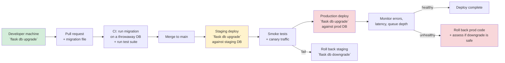
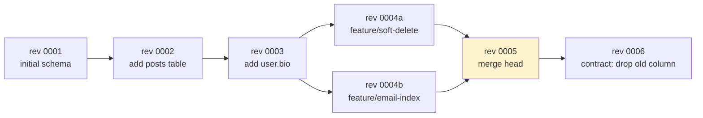
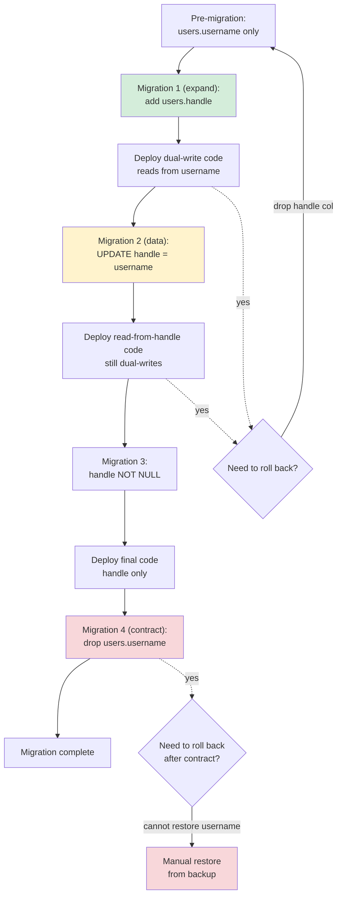
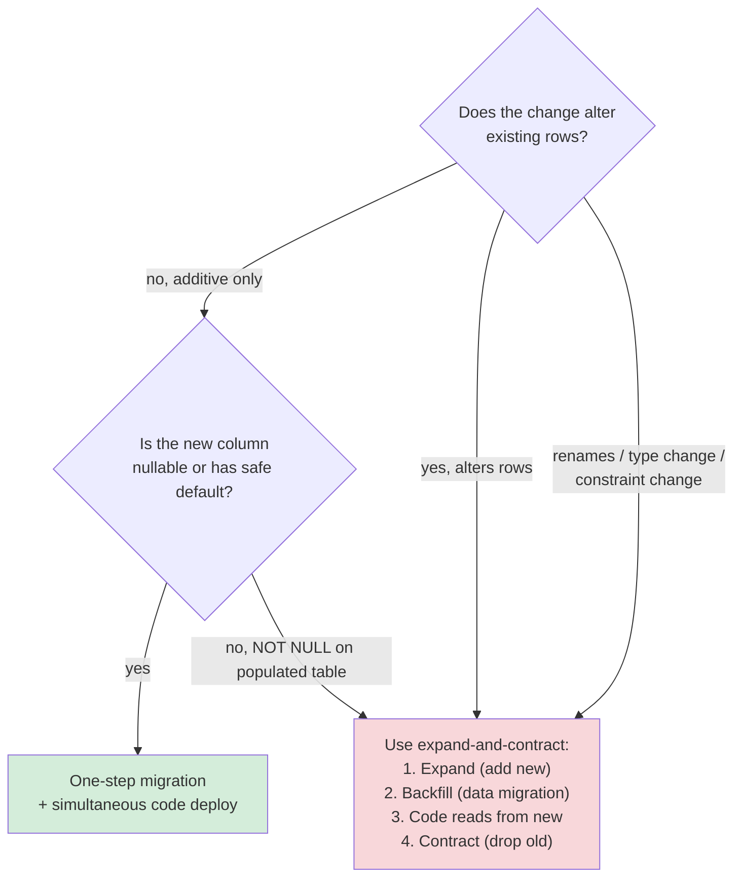
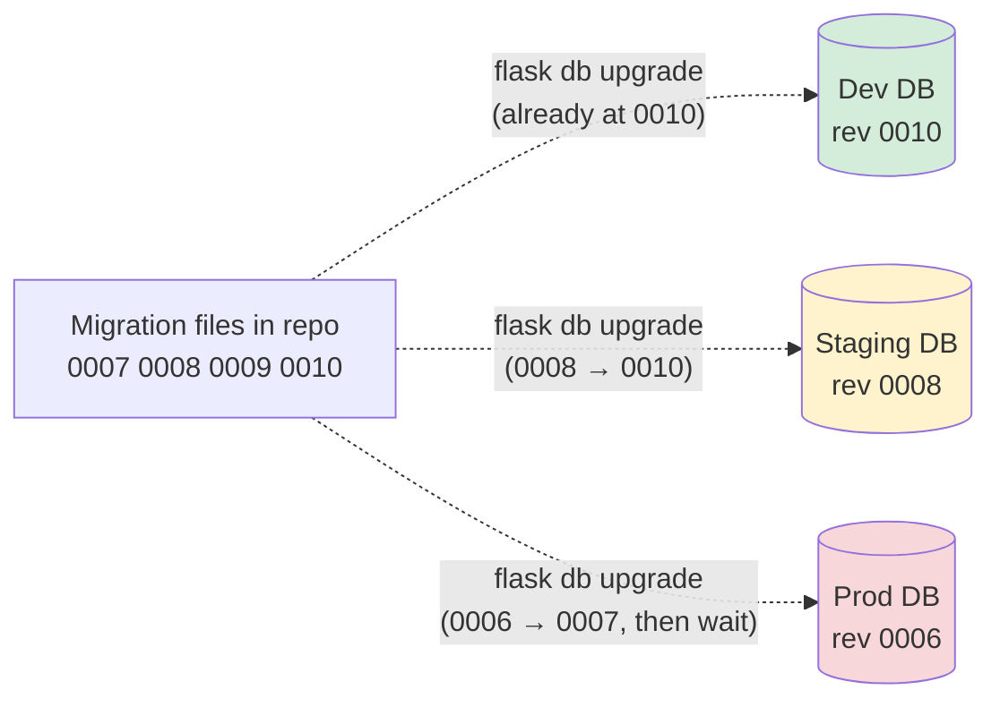
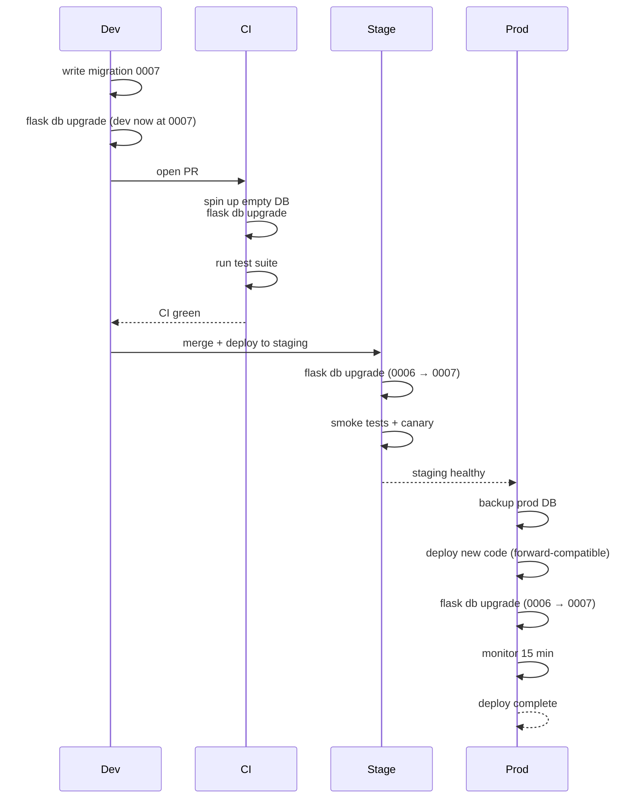
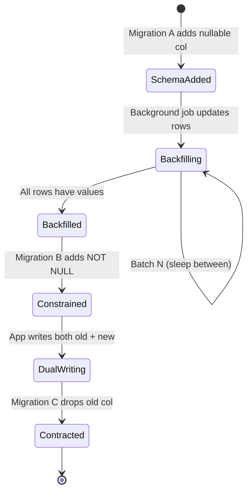

# Database Migrations Strategy

#flask #migrations #alembic #database #production #zero-downtime #expand-and-contract #devops

> [!info] The operations manual for evolving a live database
> [[Flask-Migrate]] teaches you the *mechanics*: `flask db migrate`, `flask db upgrade`, `flask db downgrade`. This note teaches the *strategy*: when to write one migration vs two, how to ship a column rename without taking the app down, how to roll back a bad deploy, how to keep dev / staging / prod schemas in sync without surprises. If Flask-Migrate is the steering wheel, this note is the route planner.

A schema migration is a **change to the shape of your data**, applied while the application is running. Unlike a code deploy — where the old version is gone the moment the new version is up — a schema change persists. If you get it wrong, the database is in an inconsistent state and rolling back the code doesn't fix it. Strategy matters because the cost of a mistake is hours of restoration work, not minutes of redeployment.

> [!danger] Migrations are the highest-risk routine operation
> A bad code deploy breaks things until you roll back. A bad migration breaks things *permanently* — even after rollback, your data may be lost or in a state the old code doesn't understand. Treat migrations as more dangerous than code deploys: review every one, test against a copy of prod, back up before applying, and prefer multi-step expand-and-contract sequences for anything non-trivial.

---

## 1. Overview & Metaphor

### What migrations actually are

Every migration is a pair of functions: `upgrade()` (forward) and `downgrade()` (backward). Alembic runs `upgrade` to move the schema *forward* to the next revision, `downgrade` to move it *back*. The set of revisions forms a chain (or, with branches, a DAG), and Alembic tracks which revision the database is currently at via a single-row `alembic_version` table.

```python
# migrations/versions/a1b2c3_add_user_bio.py
"""add user.bio column

Revision ID: a1b2c3
Revises: 9z8y7x
Create Date: 2024-06-15 10:23:11.482911
"""
from alembic import op
import sqlalchemy as sa

revision = "a1b2c3"
down_revision = "9z8y7x"
branch_labels = None
depends_on = None

def upgrade():
    op.add_column("users", sa.Column("bio", sa.Text(), nullable=True))

def downgrade():
    op.drop_column("users", "bio")
```

### Mermaid: migration deployment pipeline

A schema change moves from the developer's machine through dev, staging, and prod, each step gated by a different concern.



Each step is a checkpoint. The cost of catching a problem escalates: a bad migration caught in CI costs nothing; caught in staging costs a re-deploy; caught in production costs an incident.

### Mermaid: the migration chain (revisions)



Branches happen when two developers add migrations in parallel; `flask db merge` reconciles them into a single head. See [[Flask-Migrate]] §Branching and merging for the mechanics.

---

## 2. Migration Philosophy

### Schema changes are irreversible in practice

`downgrade()` looks like a perfect inverse of `upgrade()`. It almost never is. If `upgrade` does:

```python
def upgrade():
    op.add_column("users", sa.Column("bio", sa.Text(), nullable=True))
    # Backfill bios from existing profiles
    op.execute("UPDATE users SET bio = (SELECT bio FROM profiles WHERE profiles.user_id = users.id)")
```

Then `downgrade` can drop the column — but the bios you backfilled are now gone. Re-running `upgrade` won't recover them. **Information-losing migrations are one-way.** Plan accordingly.

### The four principles

1. **Migrations are code.** They live in the repo, are reviewed in PRs, and are tested in CI. They are not scripts operators run ad-hoc.
2. **One change per migration.** A migration that adds a column, an index, and a constraint is three migrations bundled together — each one independently revertible.
3. **The application must work before and after the migration.** A migration that requires simultaneous code + schema changes is brittle; deploy ordering breaks down.
4. **Forward compatibility is a property of the code, not the migration.** Your code should accept the *old* schema *and* the *new* schema during the deploy window. The migration just shifts the database from one to the other; the code must tolerate both.

### Mermaid: the deploy-time compatibility window

```mermaid
gantt
    title Deploy window: code must tolerate both schemas
    dateFormat HH:mm
    axisFormat %H:%M
    section Code
    Old code (v1.4) :done, old, 00:00, 05:00
    New code (v1.5, forward-compatible) :active, new, 05:00, 10:00
    section DB
    Old schema (rev N) :done, olds, 00:00, 05:30
    New schema (rev N+1) :active, news, 05:30, 10:00
    section Window
    Both schemas valid for new code :crit, window, 05:00, 05:30
```



During the critical 30-minute window between "new code deployed" and "migration applied" (or vice versa), your code must work against either schema. This is the single most important property of a safe migration.

---

## 3. The Expand-and-Contract Pattern

The expand-and-contract pattern is the canonical way to ship a breaking schema change without downtime. It splits the change into three migrations deployed over days or weeks:

1. **Expand** — add the new structure alongside the old. Both schemas are valid.
2. **Migrate** — backfill data, dual-write to both old and new, read from old.
3. **Contract** — switch reads to new, stop writing old, drop old structure.

### Worked example: rename `users.username` to `users.handle`

The naive migration:

```python
def upgrade():
    op.alter_column("users", "username", new_column_name="handle")
def downgrade():
    op.alter_column("users", "handle", new_column_name="username")
```

This is a single-step rename. It works on dev. It dies in production:

- During the deploy, old code references `users.username` (which no longer exists) → `IntegrityError`.
- If you deploy code + migration simultaneously, there's a brief window where some app instances run old code against the new schema → same crash.
- Rollback is impossible: the column was renamed, and any rows inserted between deploy and rollback wrote to `handle`, not `username`.

### Expand-and-contract version

**Migration 1 (expand) — add the new column:**

```python
# rev 0007: add users.handle (expand)
def upgrade():
    op.add_column("users", sa.Column("handle", sa.String(80), nullable=True))
    op.create_index("ix_users_handle", "users", ["handle"], unique=True)
def downgrade():
    op.drop_index("ix_users_handle", table_name="users")
    op.drop_column("users", "handle")
```

Deploy migration 1 + code that:
- Writes to **both** `username` and `handle` on every insert/update.
- Reads from `username`.

```python
# Updated model — both columns exist; code writes both, reads username
class User(db.Model):
    username = db.Column(db.String(80), unique=True, nullable=False)
    handle = db.Column(db.String(80), unique=True, nullable=True)

    @db.validates("username")
    def _sync_handle(self, key, value):
        self.handle = value  # dual-write
        return value
```

**Migration 2 (migrate) — backfill:**

```python
# rev 0008: backfill users.handle from users.username (data migration)
def upgrade():
    op.execute("UPDATE users SET handle = username WHERE handle IS NULL")
def downgrade():
    # No-op — once handle is populated, we don't un-populate it
    pass
```

After backfill, make `handle` non-nullable:

```python
# rev 0009: make users.handle non-nullable
def upgrade():
    op.alter_column("users", "handle", nullable=False)
def downgrade():
    op.alter_column("users", "handle", nullable=True)
```

Deploy code that switches reads from `username` to `handle`. The code still dual-writes (in case you need to roll back to the read-from-username version).

**Migration 3 (contract) — drop the old column:**

```python
# rev 0010: drop users.username (contract)
def upgrade():
    op.drop_index("ix_users_username", table_name="users")
    op.drop_column("users", "username")
def downgrade():
    op.add_column("users", sa.Column("username", sa.String(80), nullable=True))
    # Note: can't restore uniqueness / non-null without data — contract is one-way
```

Deploy code that removes `username` from the model entirely.

### Mermaid: expand-and-contract flow



The green node (expand) is safe to roll back — just drop the new column. The yellow node (backfill) is also safe — nothing depends on the data yet. The red node (contract) is **irreversible**: once you drop `username`, you cannot restore the column with its original data without a backup.

> [!tip] Only contract after you're sure
> Run the expand + backfill + read-from-new code for a week before contracting. If something is wrong, you'll see it in error rates. If you contract prematurely, you've burned the rollback option.

---

## 4. Zero-Downtime Migrations

A migration is "zero-downtime" if the application never has to stop serving requests during it. In practice this means:

1. **No long table locks.** Adding a column with a default value on a 100M-row table can lock the table for minutes on some databases.
2. **No `ALTER TABLE` that rewrites the table.** Some `ALTER`s (changing column type, dropping NOT NULL on a column with a CHECK) rewrite the entire table.
3. **No destructive operations on a hot table.** `DROP COLUMN` on a heavily-written table can block inserts while the schema change propagates.

### Per-database migration costs

| Operation | PostgreSQL | MySQL (InnoDB) | SQLite |
|---|---|---|---|
| `ADD COLUMN nullable` | Fast (metadata only) | Fast (8.0+) | Requires table rebuild |
| `ADD COLUMN ... DEFAULT non-null` | Re-writes all rows (PG 11+ is fast for non-volatile defaults) | Re-writes all rows | Re-writes all rows |
| `DROP COLUMN` | Fast (logical drop; physical cleanup later via `VACUUM`) | Re-writes (or async in 8.0) | Re-writes |
| `CREATE INDEX` | `CONCURRENTLY` — slow but non-locking | `Online DDL` (8.0+) | Locks table |
| `ALTER COLUMN TYPE` | Re-writes all rows | Often re-writes | Re-writes |
| `ADD CONSTRAINT CHECK` | Validates existing rows; lock during validation | Validates; lock | Re-writes |

> [!warning] `ADD COLUMN ... NOT NULL DEFAULT 'x'` is the most common "surprise" migration footgun
> On PostgreSQL < 11, this re-writes the entire table. On PostgreSQL 11+, it's fast for non-volatile defaults (constants, not function calls). On MySQL, it depends on version. **Always test against a copy of prod data.** If in doubt, split into two migrations: add the nullable column, backfill, then add the NOT NULL constraint.

### PostgreSQL-specific: `CREATE INDEX CONCURRENTLY`

```python
def upgrade():
    # Standard CREATE INDEX locks the table against writes.
    # CONCURRENTLY doesn't, but takes longer and can't run inside a transaction.
    op.execute("CREATE INDEX CONCURRENTLY IF NOT EXISTS ix_users_email_lower ON users (lower(email))")

def downgrade():
    op.execute("DROP INDEX CONCURRENTLY IF EXISTS ix_users_email_lower")
```

Alembic's `op.create_index(..., postgresql_concurrently=True)` does the same thing, but **it requires that the migration is not wrapped in a transaction**. Alembic wraps each migration in a transaction by default; you have to opt out:

```python
# In migrations/env.py:
context.configure(
    connection=connection,
    target_metadata=target_metadata,
    transaction_per_migration=False,  # or use transactional_ddl=False per-migration
)
```

Or per-migration:

```python
def upgrade():
    # This migration runs outside a transaction
    op.execute("COMMIT")  # exit the per-migration transaction
    op.execute("CREATE INDEX CONCURRENTLY ...")
    op.execute("BEGIN")   # re-enter so the migration looks clean to Alembic
```

### Mermaid: zero-downtime vs blocking migration

```mermaid
graph TD
    subgraph Blocking [Blocking migration]
        B1["`op.add_column NOT NULL DEFAULT 'x'`"]
        B2["Table lock acquired"]
        B3["All rows rewritten"]
        B4["Lock released"]
        B5["App blocked for N seconds"]
        B1 --> B2 --> B3 --> B4 --> B5
    end
    subgraph ZeroDT [Zero-downtime equivalent]
        Z1["Migration A: add nullable column"]
        Z2["App continues running<br/>dual-writes to new col"]
        Z3["Migration B: backfill in batches<br/>UPDATE WHERE id BETWEEN ..."]
        Z4["Migration C: SET NOT NULL"]
        Z5["App continues running"]
        Z1 --> Z2 --> Z3 --> Z4 --> Z5
    end

    style B5 fill:#f8d7da
    style Z5 fill:#d4edda
```



---

## 5. Backward-Compatible vs Breaking Changes

### Backward-compatible changes (one-step, low-risk)

These can ship as a single migration with simultaneous code deploy:

- Add a nullable column
- Add an index (`CONCURRENTLY` on PostgreSQL)
- Add a new table (no relation to existing)
- Drop a column the code no longer references (after a deploy cycle)
- Add a check constraint that's already satisfied by all rows

### Breaking changes (require expand-and-contract)

- Rename a column
- Change a column type
- Add a NOT NULL column to a populated table
- Split one table into two
- Merge two tables into one
- Change a unique constraint
- Change a primary key
- Drop a column the code still references

### Mermaid: decision tree



---

## 6. Multi-Environment Migration

Dev → staging → prod is the typical promotion path. Each environment runs the migrations *in order*, and the `alembic_version` table tells you where each environment currently is.

### Mermaid: migration deployment pipeline (multi-env)



Three rules:

1. **Dev always runs the latest head.** Developers run `flask db upgrade` constantly; the dev DB is disposable.
2. **Staging tracks prod + the next release's migrations.** When staging is behind dev, that's fine — staging should match what prod *will* be after the next deploy, not what dev currently is.
3. **Prod runs migrations explicitly, not automatically.** Don't run `flask db upgrade` automatically on app startup in prod (see §9 below). Run it as a discrete step in the deploy script, with logging and the ability to abort.

### The strict-superset rule

When you have multiple environments, prod's migration history should always be a **strict prefix** of staging's, which is a strict prefix of dev's. If prod is at rev 0006 and dev is at rev 0010, every revision between 0007 and 0010 must apply cleanly to prod's data.

> [!danger] Don't let environments diverge
> If a teammate creates a migration in dev that depends on data only present in dev (e.g., `UPDATE users SET role = 'admin' WHERE email = 'dev@example.com'`), the migration will fail on staging and prod. **Never put environment-specific data in a migration.** Put it in a seed script that's run separately per environment.

### Mermaid: promotion sequence



---

## 7. Rollback Strategies

### Roll back code, not schema

Most "bad deploys" are code bugs, not schema bugs. The recovery is: roll back the *code* to the previous version. The schema can stay where it is — your previous code worked against this schema (forward compatibility). This is why forward compatibility matters: it makes code rollback a viable option.

### When you must roll back the schema

You can run `flask db downgrade` to revert to a previous revision. This works *if and only if*:

1. The `downgrade()` function is correct and tested.
2. The downgrade is information-preserving — i.e., no data was lost in `upgrade()` that `downgrade()` can't reconstruct.
3. No code currently running depends on the schema introduced by `upgrade()`.

If any of these fail, **restore from backup** instead. `downgrade` is a convenience for dev and for forward-compatible migrations; it's not a recovery tool for broken prod deploys.

### Mermaid: rollback decision tree

```mermaid
flowchart TD
    Issue["Issue detected<br/>after prod deploy"]
    Issue --> Q1{"Code bug<br/>or schema bug?"}
    Q1 -->|"code bug"| CR["Roll back code to<br/>previous version"]
    CR --> Q2{"Forward-compatible?<br/>(prev code works on new schema)"}
    Q2 -->|yes| Done1["Issue resolved"]
    Q2 -->|no| Schema["Also need to<br/>downgrade schema"]
    Q1 -->|"schema bug"| Q3{"Migration is<br/>information-preserving?"}
    Q3 -->|yes| Down["`flask db downgrade -1`<br/>+ roll back code"]
    Q3 -->|no, data was lost| Backup["Restore prod DB<br/>from pre-deploy backup"]
    Q3 -->|"unknown / not tested"| Backup
    Down --> Done2["Issue resolved"]
    Backup --> Done3["Issue resolved<br/>(data lost since deploy)"]

    style Done1 fill:#d4edda
    style Done2 fill:#d4edda
    style Done3 fill:#f8d7da
    style Backup fill:#f8d7da
```

### The "deploy hook" backup

Always take a DB backup before applying a prod migration:

```bash
# deploy/00_pre_deploy.sh
set -euo pipefail

echo "Taking pre-deploy DB backup..."
aws rds create-db-snapshot \
    --db-instance-identifier "$RDS_INSTANCE_ID" \
    --db-snapshot-identifier "pre-deploy-$(date +%Y%m%d-%H%M%S)"

# Wait for snapshot to complete
aws rds wait db-snapshot-available \
    --db-snapshot-identifier "pre-deploy-$(date +%Y%m%d-%H%M%S)"

echo "Backup complete. Proceeding with deploy."
```

If the worst happens, you can restore from this snapshot. The RPO (recovery point objective) is "the moment before the deploy started" — perfect.

---

## 8. Data Migrations vs Schema Migrations

A **schema migration** changes the *shape* of the database: add/drop columns, tables, indexes, constraints. Alembic is built for these.

A **data migration** changes the *contents* of the database without changing the shape: backfill a new column, normalize a string format, fix bad rows, split a column into two. Alembic can do these too, via `op.execute("UPDATE ...")`, but they have different rules.

### Schema vs data migration rules

| Aspect | Schema migration | Data migration |
|---|---|---|
| Speed | Usually fast (metadata changes) | Often slow (touches every row) |
| Reversible? | Usually yes (drop what you added) | Often no (can't un-update rows) |
| Lock impact | Table-level locks | Row-level locks; long-running ones can block writes |
| Idempotent? | Yes — running twice = running once | Should be — `UPDATE ... WHERE new_col IS NULL` is safe to re-run |
| Test on copy of prod? | Yes | **Absolutely yes** — a slow data migration can lock prod for hours |

### Batched data migrations

Never run a single `UPDATE` against a 100M-row table. Batch it:

```python
# migrations/versions/0011_backfill_user_handle.py
"""backfill user.handle from user.username in batches"""
from alembic import op
import sqlalchemy as sa

revision = "0011"
down_revision = "0010"

def upgrade():
    conn = op.get_bind()
    batch_size = 10_000
    while True:
        result = conn.execute(sa.text("""
            UPDATE users
            SET handle = username
            WHERE id IN (
                SELECT id FROM users WHERE handle IS NULL LIMIT :batch
            )
        """), {"batch": batch_size})
        if result.rowcount == 0:
            break
        print(f"Updated {result.rowcount} rows")
    # Now safe to add NOT NULL constraint in the next migration

def downgrade():
    # No-op: we can't "un-backfill"
    pass
```

The batched version lets other queries slip in between batches, preventing the table from being locked for the duration of the migration.

> [!tip] Use a separate background job for very large backfills
> If the backfill would take more than a few minutes, don't run it from `flask db upgrade`. Run it as a background task (Celery, AWS Batch, a one-off k8s Job) that updates rows in batches with `COMMIT` between batches. Then write a *separate* migration that just verifies the backfill completed (e.g., asserts `SELECT count(*) FROM users WHERE handle IS NULL` returns 0) before adding the NOT NULL constraint.

### Mermaid: data migration lifecycle



---

## 9. Common Pitfalls

### Pitfall 1: Auto-running migrations on app startup

```python
# DON'T do this in production:
with app.app_context():
    from flask_migrate import upgrade
    upgrade()
```

This runs migrations *before* the app serves any request. If the migration is slow, the app doesn't start. If you have multiple app instances (which you do in prod), they all try to migrate simultaneously, leading to race conditions on the `alembic_version` table.

**Fix:** Run migrations as a discrete step in the deploy pipeline — before the new code starts serving, but as its own command:

```bash
# deploy script
flask db upgrade     # explicit, logged, can fail loudly
gunicorn app:wsgi    # only start serving after migration succeeded
```

In Kubernetes, run migrations as an [init container](https://kubernetes.io/docs/concepts/workloads/pods/init-containers/) so the app container doesn't start until migrations complete.

### Pitfall 2: Forgetting to commit migrations with code

A migration committed without the model change it supports leaves the repo in a broken state — `flask db migrate` will try to re-create the change. Always commit migrations in the *same commit* as the model change.

### Pitfall 3: Editing a deployed migration

If a migration has been run on any non-dev environment (including a teammate's dev DB), **never edit it**. The revision ID and `down_revision` form a chain; editing breaks the chain. If the migration is wrong, write a new migration that fixes it.

### Pitfall 4: Relying on `db.create_all()` in production

`db.create_all()` creates tables that don't exist but doesn't alter existing ones. A model that gains a column won't get that column in the database via `create_all()`. Use migrations from day one — even for the initial schema — so you don't have to "adopt" the database later via `flask db stamp head` (which is error-prone).

### Pitfall 5: Untested `downgrade()`

You test `upgrade()`. Do you test `downgrade()`? A downgrade that's never been run is a downgrade that doesn't work. In CI:

```bash
flask db upgrade head
flask db downgrade -1
flask db upgrade head
```

If the second command fails, your downgrade is broken. Fix it before merging.

### Pitfall 6: Not splitting schema + data migrations

The single most common prod incident: a migration that adds a NOT NULL column AND backfills it in one transaction. The transaction holds locks on every row it touches; the migration appears to "hang" while inserts pile up. Always split:

- Migration A: add nullable column.
- Migration B: backfill (separately, possibly as a background job).
- Migration C: add NOT NULL constraint.

### Pitfall 7: SQLite in tests, PostgreSQL in prod

If your tests use SQLite (fast, in-memory) but prod uses PostgreSQL, behavior diverges. SQLite doesn't enforce types, doesn't have `CONCURRENTLY`, treats `ALTER` differently. Run tests against a real PostgreSQL instance (in Docker, in CI) for migrations specifically — at minimum, run `flask db upgrade && flask db downgrade -1` in CI against a throwaway Postgres database.

---

## 10. Troubleshooting

| Symptom | Likely cause | Fix |
|---|---|---|
| `flask db upgrade` hangs in prod | Long-running data migration locking tables | Kill it, rewrite as batched background job, re-run |
| `TargetDatabase is not up to date` | Staging/prod is behind the dev migration head | Run `flask db upgrade` — but only if forward-compatible |
| `Multiple heads are present` | Two PRs each added a migration on the same base | Run `flask db merge -m "merge heads"` to create a merge revision |
| `Can't locate revision identified by 'XXXX'` | A migration was deleted or its revision ID changed | Restore the file from git, or stamp the DB to a known-good revision |
| `IntegrityError` during deploy | Code deployed before migration, or vice versa, breaking forward compatibility | Deploy migration + forward-compatible code first; deploy breaking code only after migration |
| Migration works locally, fails in prod | Different DB engine, different data volume, different timezone | Test on a restored prod backup before deploying |
| `downgrade` fails after a successful `upgrade` | `downgrade()` was never tested, or upgrade lost information | Restore from backup; treat the migration as one-way |
| `ALTER TABLE` taking forever on prod | Long table rewrite | Use `CONCURRENTLY` (Postgres) or online DDL (MySQL); split into expand-contract |

---

## 11. Best Practices

> [!tip] Migration strategy checklist
> 1. **Treat migrations as code.** Review in PRs, test in CI, never edit deployed ones.
> 2. **One change per migration.** Easy to revert, easy to review.
> 3. **Always write `downgrade()`.** And test it in CI (`upgrade → downgrade -1 → upgrade`).
> 4. **Use expand-and-contract for breaking changes.** Never rename, type-change, or split in one step.
> 5. **Don't auto-run migrations on app startup.** Run as a discrete deploy step.
> 6. **Take a DB backup before every prod migration.** Test restore quarterly.
> 7. **Batch large data migrations.** Don't `UPDATE` 100M rows in one transaction.
> 8. **Make forward compatibility a code property.** Code must tolerate old and new schemas during the deploy window.
> 9. **Test migrations against a copy of prod data.** Dev data doesn't catch prod-scale locking issues.
> 10. **Run CI against the production database engine.** SQLite in tests hides PostgreSQL issues.
> 11. **Pin migration order in a strict-superset chain.** Prod's history is a prefix of staging's is a prefix of dev's.
> 12. **Don't put environment-specific data in migrations.** Use seed scripts.
> 13. **Only contract after a week of dual-writing.** The contract step is irreversible.
> 14. **Document the migration runbook.** What's the backup command? What's the rollback command? Who's on call?

---

## 12. Related Vault Notes

- [[Flask-Migrate]] — the Flask wrapper around Alembic; covers `flask db` commands, autogenerate, branching/merging, and the `stamp` footgun
- [[Flask-SQLAlchemy]] — the ORM whose models are the source of truth for `flask db migrate`; relationship loading, lazy/eager, and session lifecycle all interact with migration strategy
- [[Production-Deployment]] — the deploy pipeline that migrations are a step in; covers blue-green deploys, init containers, and rollback mechanics
- [[Project-Structure]] — where migrations/ lives in your package layout; how `Migrate(app, db)` is wired in the application factory
- [[Flask-CLI]] — the `flask db` command group is itself a Flask CLI extension; custom deploy commands can wrap `flask db upgrade` with pre/post hooks
