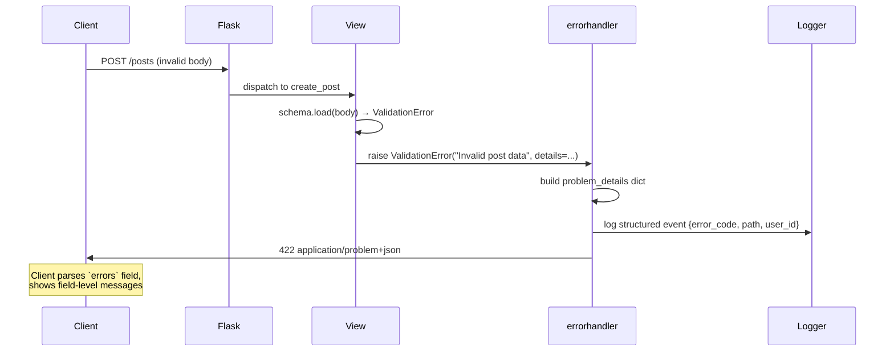
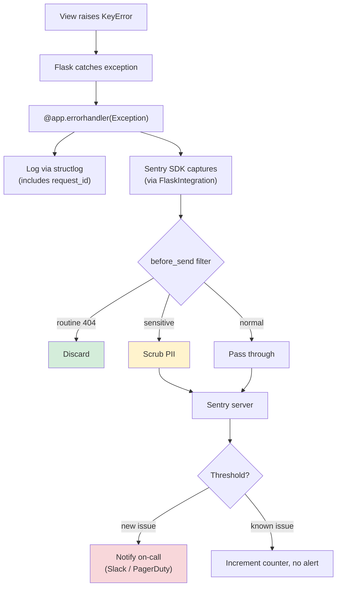
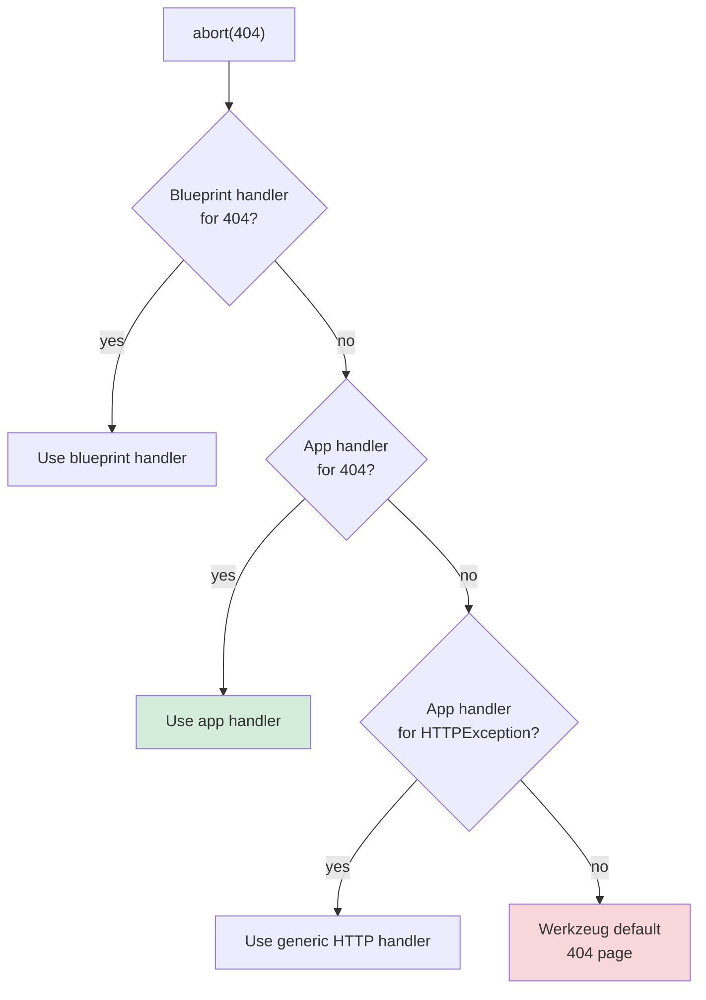

# Error Handling

#flask #errors #exceptions #http #rfc9457 #sentry #api #debugging #observability

> [!info] The unglamorous half of every Flask app
> Building the happy path is fun. Building the unhappy path — 404 on a missing resource, 422 on a validation failure, 500 on an unexpected exception, 429 on rate-limit, 403 on a forbidden action — is what separates a toy demo from production software. This note covers Flask's error-handling primitives (`@app.errorhandler`, custom exception classes, blueprint error handlers), the modern standard for machine-readable API errors ([RFC 9457 Problem Details](https://datatracker.ietf.org/doc/html/rfc9457)), logging and Sentry integration, custom 404/500 pages, and the different shapes error handling takes in APIs vs server-rendered apps.

Think of error handling as a **second routing layer**. The first layer (`@app.route`) maps URL → view function. The error layer maps (HTTP status, exception type) → handler function. Every request that ends in an error — whether an explicit `abort(404)` or an uncaught `KeyError` — flows through this second layer. If you've designed it well, the user gets a helpful response and your monitoring gets a structured event. If you haven't, the user sees Flask's default HTML error page (or, worse, a stack trace in debug mode) and your monitoring sees nothing.

> [!danger] Default error pages leak information
> Flask's default 404/500 pages in debug mode (`DEBUG=True`) include stack traces, source snippets, and local variable values. **Never ship `DEBUG=True` to production.** A stack trace to an attacker is a roadmap: it reveals your package layout, the libraries you use, and often the exact line of code that mishandles user input. See [[Security-Best-Practices]] §13.

---

## 1. Overview & Metaphor

### Three flavors of error

| Flavor | Triggered by | Status code | Example |
|---|---|---|---|
| **HTTP error** | `abort(404)`, `abort(403, description="...")`, or returning a response with a 4xx/5xx status | 4xx, 5xx | `abort(404)` for a missing resource |
| **Handled exception** | Your code raises an exception that's registered with `@app.errorhandler` | Whatever the handler returns | `raise ValidationError("email invalid")` → 422 |
| **Unhandled exception** | Any other exception bubbles up through Flask | 500 (Internal Server Error) | A `KeyError` from a dict access in a view |

Flask normalizes all three to "an error handler is invoked with the relevant argument (HTTPException, the raised exception, or nothing for a 404/500 by URL)". Your job is to register handlers that produce a consistent, useful response for each.

### Mermaid: error propagation flow

```mermaid
flowchart TD
    Req["Incoming HTTP request"] --> View["View function executes"]
    View --> Outcome{Outcome}
    Outcome -->|returns Response| Happy["Return response to client"]
    Outcome -->|abort(N)| HTTP["Werkzeug HTTPException"]
    Outcome -->|raises Exception X| Exc["Exception X bubbles up"]
    Outcome -->|returns tuple (data, N)| TupleResp["Build Response with status N"]
    HTTP --> Lookup["Look up errorhandler for<br/>HTTPException + status code"]
    Exc --> Lookup2["Look up errorhandler for<br/>Exception class"]
    TupleResp --> Happy
    Lookup --> Found{Handler found?}
    Lookup2 --> Found2{Handler found?}
    Found -->|yes| Invoke["Invoke handler"]
    Found -->|no| Default["Use Werkzeug default HTML page"]
    Found2 -->|yes| Invoke
    Found2 -->|no| Gen500["Convert to 500 Internal Server Error"]
    Gen500 --> Lookup3["Look up 500 handler"]
    Lookup3 --> Default500{Handler?}
    Default500 -->|yes| Invoke
    Default500 -->|no| Default
    Invoke --> Log["Log via app.logger / structlog"]
    Log --> Capture["Capture in Sentry if 5xx"]
    Capture --> Resp["Return handler's Response to client"]
    Default --> Resp
    style Happy fill:#d4edda
    style Invoke fill:#d1ecf1
    style Default fill:#f8d7da
    style Capture fill:#fff3cd
```

### Mermaid: error handler resolution

When Flask looks up an errorhandler for a raised exception, it walks the exception's MRO (method resolution order) — the class itself, then its bases, then *their* bases. The first matching handler wins.

```mermaid
flowchart TD
    Exc["`raise ValidationError('bad email')`"] --> CheckApp["Search app.error_handler_spec[None][code][exc]"]
    CheckApp --> Walk{Walk exception MRO}
    Walk --> Exact["`ValidationError`?"]
    Exact -->|yes| Use1["Use this handler"]
    Exact -->|no| Base1["`APIException` (parent)?"]
    Base1 -->|yes| Use2["Use this handler"]
    Base1 -->|no| Base2["`Exception` (root)?"]
    Base2 -->|yes| Use3["Use generic handler"]
    Base2 -->|no| NotFound["No handler registered"]
    NotFound --> Default["Werkzeug default 500 HTML page"]
    Use1 --> Return["Return Response"]
    Use2 --> Return
    Use3 --> Return
    style Use1 fill:#d4edda
    style Default fill:#f8d7da
```

This means: register a handler for `Exception` to catch everything (your safety net), register a handler for `APIException` (your custom base) to apply common API error formatting, and register handlers for specific subclasses when they need bespoke responses.

---

## 2. `@app.errorhandler` — The Basics

The `@app.errorhandler(code_or_exc)` decorator registers a function to run when that status code or exception class fires:

```python
from flask import Flask, jsonify, render_template

app = Flask(__name__)

@app.errorhandler(404)
def not_found(error):
    return render_template("errors/404.html"), 404

@app.errorhandler(500)
def server_error(error):
    # error is the exception that triggered the 500
    app.logger.exception("Unhandled server error: %s", error)
    return render_template("errors/500.html"), 500

@app.errorhandler(403)
def forbidden(error):
    return render_template("errors/403.html"), 403
```

The handler receives the `HTTPException` instance (for status-code handlers) or the raised exception (for exception-class handlers). It must return a `Response`, a `(body, status)` tuple, or a `(body, status, headers)` tuple — the same as a view function.

### Handling `Werkzeug HTTPException`

`abort(404)`, `abort(403)`, and similar raise subclasses of `werkzeug.exceptions.HTTPException`. You can register a single handler for the base class to catch all of them:

```python
from werkzeug.exceptions import HTTPException

@app.errorhandler(HTTPException)
def handle_http_exception(error):
    response = jsonify({
        "error": error.name.lower().replace(" ", "_"),
        "message": error.description,
        "status": error.code,
    })
    response.status_code = error.code
    return response
```

This single handler now covers 400, 401, 403, 404, 405, 406, 409, 410, 413, 415, 422, 429, 500, … — every status Werkzeug knows about. Per-status overrides still win:

```python
@app.errorhandler(HTTPException)
def generic_http(error):
    return jsonify({"error": "http", "message": error.description}), error.code

@app.errorhandler(404)
def not_found(error):
    # This wins for 404 specifically
    return jsonify({"error": "not_found", "message": "Resource not found"}), 404
```

---

## 3. Custom Exception Classes

For non-HTTP errors (business-rule violations, validation failures, service-layer errors), the cleanest pattern is a custom exception hierarchy:

```python
# app/errors.py
from werkzeug.exceptions import HTTPException

class APIException(Exception):
    """Base class for all API errors. Subclasses set status_code and message."""
    status_code = 500
    default_message = "An internal error occurred."
    error_code = "internal_error"

    def __init__(self, message=None, *, error_code=None, details=None, status_code=None):
        super().__init__(message or self.default_message)
        self.message = message or self.default_message
        self.error_code = error_code or self.error_code
        self.details = details or {}
        if status_code is not None:
            self.status_code = status_code

class ValidationError(APIException):
    status_code = 422
    default_message = "Validation failed."
    error_code = "validation_error"

class NotFoundError(APIException):
    status_code = 404
    default_message = "Resource not found."
    error_code = "not_found"

class ConflictError(APIException):
    status_code = 409
    default_message = "Conflict with current state."
    error_code = "conflict"

class AuthenticationError(APIException):
    status_code = 401
    default_message = "Authentication required."
    error_code = "authentication_required"

class AuthorizationError(APIException):
    status_code = 403
    default_message = "You do not have permission to perform this action."
    error_code = "forbidden"
```

Then a single handler for the base class converts any `APIException` into a JSON response:

```python
# app/errors.py (continued)
from flask import jsonify

def register_error_handlers(app):
    @app.errorhandler(APIException)
    def handle_api_exception(error):
        response = {
            "error": error.error_code,
            "message": error.message,
        }
        if error.details:
            response["details"] = error.details
        return jsonify(response), error.status_code

    @app.errorhandler(HTTPException)
    def handle_http_exception(error):
        # Convert Werkzeug's HTTPExceptions to the same shape
        return jsonify({
            "error": error.name.lower().replace(" ", "_"),
            "message": error.description,
        }), error.code

    @app.errorhandler(Exception)
    def handle_unexpected(error):
        # The safety net — catches anything not handled above
        # Don't leak the error message in production
        from flask import current_app
        current_app.logger.exception("Unhandled exception: %s", error)
        if current_app.config.get("DEBUG"):
            return jsonify({
                "error": "internal_error",
                "message": str(error),
                "type": type(error).__name__,
            }), 500
        return jsonify({
            "error": "internal_error",
            "message": "An internal server error occurred.",
        }), 500
```

Wire it from `create_app()`:

```python
def create_app(config_name="production"):
    app = Flask(__name__)
    # ... config, extensions, blueprints ...
    from app.errors import register_error_handlers
    register_error_handlers(app)
    return app
```

Now your views can raise domain-meaningful exceptions instead of sprinkling `abort()` calls:

```python
@app.route("/posts/<int:post_id>")
def get_post(post_id):
    post = Post.query.get(post_id)
    if post is None:
        raise NotFoundError(f"Post {post_id} not found")
    return PostSchema().dump(post)

@app.route("/posts", methods=["POST"])
def create_post():
    try:
        data = PostSchema().load(request.get_json())
    except MarshmallowValidationError as e:
        raise ValidationError("Invalid post data", details=e.messages)
    # ...
```

> [!tip] Why custom exceptions beat `abort()`
> `abort(404, description="...")` is concise but lossy: you can't attach structured details (which fields failed, what the conflicting resource ID was, what to do next), and the handler can't distinguish your domain errors from generic Werkzeug ones. Custom exceptions carry all that context on the instance, and the handler can serialize it consistently. The pattern pays off the first time a frontend developer asks "what's the exact shape of a 422 response?" and you can answer "always `{error, message, details}` — see `app/errors.py`".

---

## 4. RFC 9457 Problem Details — Structured API Errors

[RFC 9457](https://datatracker.ietf.org/doc/html/rfc9457) (formerly RFC 7807) defines a standard JSON shape for HTTP error responses. Every error response is a `application/problem+json` document with these fields:

| Field | Type | Purpose |
|---|---|---|
| `type` | URI | A page documenting this error class. Defaults to `"about:blank"`. |
| `title` | string | Short human-readable summary. |
| `status` | integer | HTTP status code (mirrors the response status). |
| `detail` | string | Human-readable explanation specific to this occurrence. |
| `instance` | URI | The specific request that failed (often the request path). |

Plus extension fields prefixed with no namespace (e.g., `errors`, `trace_id`, `retry_after`).

```python
# app/errors.py
from flask import jsonify, request

def problem_response(title, status, detail=None, type_uri="about:blank", **extensions):
    """Build an RFC 9457 Problem Details response."""
    body = {
        "type": type_uri,
        "title": title,
        "status": status,
    }
    if detail:
        body["detail"] = detail
    body["instance"] = request.path
    body.update(extensions)
    response = jsonify(body)
    response.status_code = status
    response.headers["Content-Type"] = "application/problem+json"
    return response

def register_error_handlers(app):
    @app.errorhandler(APIException)
    def handle_api_exception(error):
        return problem_response(
            title=error.error_code.replace("_", " ").title(),
            status=error.status_code,
            detail=error.message,
            type_uri=f"https://docs.example.com/errors/{error.error_code}",
            errors=error.details,  # extension field
        )
```

Example response:

```http
HTTP/1.1 422 Unprocessable Entity
Content-Type: application/problem+json

{
  "type": "https://docs.example.com/errors/validation_error",
  "title": "Validation Error",
  "status": 422,
  "detail": "Invalid post data",
  "instance": "/posts",
  "errors": {
    "title": ["Field is required."],
    "body": ["Must be at least 10 characters."]
  }
}
```

> [!tip] Why RFC 9457?
> 1. **It's an IETF standard.** API consumers (and libraries like [RFC 9457 Problem Details clients](https://pypi.org/project/problem-details/)) can parse your errors without reading your docs.
> 2. **`Content-Type: application/problem+json`** is content-negotiable. Clients that ask for HTML get HTML; clients that ask for JSON get problem details.
> 3. **Extension fields are explicitly allowed.** Add `trace_id`, `retry_after`, `errors` — your domain's needs — without breaking the standard shape.
> 4. **It works across frameworks.** Spring, ASP.NET, Django REST Framework, and Flask apps can all emit the same shape. Cross-service debugging gets easier.

### Mermaid: problem-details response lifecycle



---

## 5. Logging Errors

Every error handler should log. The minimum:

```python
@app.errorhandler(Exception)
def handle_unexpected(error):
    current_app.logger.exception("Unhandled exception: %s", error)
    # ... build response ...
```

`logger.exception` (not `logger.error`) includes the traceback. It only works inside an `except` block — which `errorhandler` functions effectively are.

For structured logs (recommended in production — see [[Structlog-Integration]]):

```python
import structlog
logger = structlog.get_logger()

@app.errorhandler(APIException)
def handle_api_exception(error):
    logger.info(
        "api_error",
        error_code=error.error_code,
        status_code=error.status_code,
        path=request.path,
        method=request.method,
        user_id=getattr(g, "user_id", None),
        details=error.details,
    )
    return problem_response(...)

@app.errorhandler(Exception)
def handle_unexpected(error):
    logger.exception(
        "unhandled_exception",
        error_type=type(error).__name__,
        path=request.path,
        method=request.method,
        user_id=getattr(g, "user_id", None),
    )
    # ... 500 response ...
```

The structure matters: `error_code` and `status_code` become first-class fields in your log aggregator (Loki, ELK, Datadog), so you can query `error_code="validation_error" | count by path` to find which endpoints are most error-prone.

### Request context propagation

Errors don't happen in isolation — they happen *to a specific request*. Bind `request_id`, `user_id`, and `tenant_id` to the logging context once per request (typically in a `before_request` handler) so every error log line carries them:

```python
import uuid
from flask import g, request

@app.before_request
def bind_request_context():
    g.request_id = request.headers.get("X-Request-ID") or str(uuid.uuid4())
    structlog.contextvars.clear_contextvars()
    structlog.contextvars.bind_contextvars(
        request_id=g.request_id,
        path=request.path,
        method=request.method,
    )
```

See [[Structlog-Integration]] for the full pattern.

---

## 6. Sentry Integration

For 5xx errors — and any 4xx you consider a bug — ship them to Sentry (or a similar service: Rollbar, Honeybadger, Bugsnag). Sentry captures the stack trace, request, user, breadcrumbs, and lets you triage from a UI instead of grepping logs.

```bash
pip install sentry-sdk[flask]
```

```python
# app/__init__.py
import sentry_sdk
from sentry_sdk.integrations.flask import FlaskIntegration
from sentry_sdk.integrations.sqlalchemy import SqlalchemyIntegration

def create_app(config_name="production"):
    app = Flask(__name__)
    app.config.from_object(f"app.config.{config_name.capitalize()}Config")

    if app.config.get("SENTRY_DSN"):
        sentry_sdk.init(
            dsn=app.config["SENTRY_DSN"],
            environment=app.config["ENV"],
            release=app.config.get("GIT_SHA"),
            integrations=[
                FlaskIntegration(),
                SqlalchemyIntegration(),
            ],
            # Sample 100% of errors; sample 10% of normal transactions for perf.
            traces_sample_rate=0.1,
            send_default_pii=False,  # don't send IP / cookies by default
            before_send=scrub_sensitive_data,
        )
    # ... rest of create_app ...
    return app

def scrub_sensitive_data(event, hint):
    """Remove sensitive fields before Sentry sees them."""
    for request_field in ("data", "json", "cookies", "headers"):
        data = event.get("request", {}).get(request_field, {})
        if isinstance(data, dict):
            for k in list(data.keys()):
                if k.lower() in {"password", "secret", "token", "authorization", "api_key"}:
                    data[k] = "[REDACTED]"
    return event
```

> [!danger] `send_default_pii=False` is the safe default
> Sentry's `send_default_pii=True` ships IP addresses, cookies, and request bodies (including form fields named `password`) to Sentry's servers. Even on a self-hosted Sentry, that's a GDPR headache. Default to `False`, and only opt-in specific non-sensitive fields via `before_send` if you need them.

### Filtering: what not to send to Sentry

Sentry is for *unexpected* errors. Don't fill your quota with routine 404s:

```python
import logging

def create_app(config_name="production"):
    # ...
    sentry_sdk.init(
        dsn=app.config["SENTRY_DSN"],
        before_send=lambda event, hint: None if _is_routine_404(event) else event,
        # ...
    )

def _is_routine_404(event):
    if event.get("level") != "error":
        return False
    exc = event.get("exception", {}).get("values", [{}])[-1]
    return exc.get("type") == "NotFound"
```

Or use the `ignore_errors` config:

```python
from werkzeug.exceptions import NotFound, MethodNotAllowed

sentry_sdk.init(
    # ...
    ignore_errors=[NotFound, MethodNotAllowed],
)
```

### Mermaid: error → Sentry flow



---

## 7. Custom 404/500 Pages

For server-rendered apps (where the response is HTML), custom error pages are part of the brand. Flask serves default pages — minimal, English, vanilla. Replace them with branded ones:

```python
@app.errorhandler(404)
def not_found(error):
    return render_template("errors/404.html"), 404

@app.errorhandler(500)
def server_error(error):
    app.logger.exception("500 from %s %s", request.method, request.path)
    return render_template("errors/500.html"), 500

@app.errorhandler(403)
def forbidden(error):
    return render_template("errors/403.html"), 403
```

`templates/errors/404.html` extends your base template, includes the standard nav/footer, and shows a friendly message. Keep these templates *simple* — they must render even when the database is down or your extensions are broken:

> [!warning] Don't make 500 pages fragile
> A 500 handler runs *after* something has gone wrong. If your 500 template calls `current_user.name`, queries the database, or hits Redis, and *that* thing was the original cause of the 500, your error handler will itself raise a 500 — and Flask will serve its built-in fallback page, not yours. **Hard-code the brand chrome in error templates**, or load it from a cache that can survive a DB outage.

```html
<!-- templates/errors/500.html -->

Something went wrong

<div class="error-page">
  <h1>500 — Internal Server Error</h1>
  <p>We've been notified and are looking into it.</p>
  <p>Reference: <code>{{ g.request_id }}</code></p>
  <a href="/">Go home</a>
</div>

```

### Per-blueprint custom 404

Blueprints can register their own errorhandlers, scoped to the blueprint:

```python
# app/blueprints/blog.py
from flask import Blueprint, render_template

bp = Blueprint("blog", __name__, url_prefix="/blog", template_folder="templates")

@bp.app_errorhandler(404)  # app_errorhandler = global; bp.errorhandler = blueprint-only
def blog_404(error):
    # Check if the request was for a blog URL; if so, show the blog's custom 404
    if request.path.startswith("/blog/"):
        return render_template("blog/errors/404.html"), 404
    # Otherwise fall through to the default
    return error  # Werkzeug will retry with the next handler in the chain
```

In practice, blueprint error handlers are rarely used — most apps want a single consistent 404 page. The pattern is useful when one Blueprint serves a sub-brand (e.g., an admin panel that should have admin-styled error pages).

### Mermaid: handler precedence



Blueprint handlers take precedence over app-level handlers, which take precedence over the generic `HTTPException` handler, which takes precedence over Werkzeug's built-in page.

---

## 8. APIs vs Server-Rendered Apps

Error handling differs in shape between APIs and server-rendered apps:

| Aspect | Server-rendered | JSON API |
|---|---|---|
| Response body | HTML page | JSON document (ideally RFC 9457) |
| Content-Type | `text/html` | `application/problem+json` |
| 404 page | Branded "page not found" | `{"type": "...", "title": "Not Found", "status": 404}` |
| 500 page | Branded "something went wrong" + request ID | `{"type": "...", "title": "Internal Error", "status": 500}` (no stack trace) |
| Validation errors | Re-render form with field-level messages | 422 with `{errors: {field: [msg, msg]}}` |
| Auth errors | Redirect to login | 401 with `WWW-Authenticate: Bearer` header |
| Rate limit | 429 HTML "slow down" page | 429 with `Retry-After` header |

### API pattern with content negotiation

If your app serves both HTML (browser) and JSON (API) clients, content-negotiate the error response:

```python
from flask import request, jsonify, render_template

def wants_json():
    best = request.accept_mimetypes.best_match(["application/json", "text/html"])
    return best == "application/json" and request.accept_mimetypes[best] > request.accept_mimetypes["text/html"]

@app.errorhandler(404)
def not_found(error):
    if wants_json():
        return problem_response(
            title="Not Found",
            status=404,
            detail=f"The resource {request.path} does not exist.",
            type_uri="https://docs.example.com/errors/not_found",
        )
    return render_template("errors/404.html"), 404
```

Or split the routes: HTML routes under `/`, JSON API under `/api/v1/...` with its own set of errorhandlers.

### Flask-RESTful and Marshmallow integration

[[Flask-RESTful]] provides `flask_restful.abort` and a custom `HTTPException` subclass for resources. [[Marshmallow]] raises `ValidationError` on `schema.load()`. Convert both:

```python
from marshmallow import ValidationError as MarshmallowValidationError
from flask_restful import Api

def register_error_handlers(app):
    api = Api(app, catch_all_404s=True)

    @app.errorhandler(MarshmallowValidationError)
    def handle_marshmallow_validation(error):
        return problem_response(
            title="Validation Error",
            status=422,
            detail="One or more fields failed validation.",
            type_uri="https://docs.example.com/errors/validation_error",
            errors=error.messages,  # {field: [messages]}
        )

    @api.errorhandler(APIException)
    def handle_api_exception_for_restful(error):
        # flask_restful expects a different return shape
        return problem_response(...), error.status_code
```

See [[Flask-RESTful]] §Error Handling for the full RESTful-specific pattern.

---

## 9. Common Patterns

### Pattern: include a request ID in every error response

```python
@app.errorhandler(Exception)
def handle_unexpected(error):
    request_id = getattr(g, "request_id", "unknown")
    logger.exception("unhandled_exception", request_id=request_id)
    return jsonify({
        "error": "internal_error",
        "message": "An internal server error occurred.",
        "request_id": request_id,
    }), 500
```

The user can paste `request_id` into a support ticket; you can grep logs / Sentry for that exact ID to find the matching event.

### Pattern: rate-limit-aware 429

```python
from flask import Response
from datetime import timedelta

@app.errorhandler(429)
def rate_limited(error):
    retry_after = error.description if isinstance(error.description, int) else 60
    response = problem_response(
        title="Too Many Requests",
        status=429,
        detail=f"Rate limit exceeded. Retry in {retry_after} seconds.",
        type_uri="https://docs.example.com/errors/rate_limited",
        retry_after=retry_after,
    )
    response.headers["Retry-After"] = str(retry_after)
    response.headers["X-RateLimit-Remaining"] = "0"
    return response
```

### Pattern: method-not-allowed with `Allow` header

```python
@app.errorhandler(405)
def method_not_allowed(error):
    valid_methods = error.valid_methods  # set by Werkzeug
    response = problem_response(
        title="Method Not Allowed",
        status=405,
        detail=f"{request.method} is not allowed. Use one of: {', '.join(valid_methods)}.",
        type_uri="https://docs.example.com/errors/method_not_allowed",
        allowed_methods=list(valid_methods),
    )
    response.headers["Allow"] = ", ".join(valid_methods)
    return response
```

### Pattern: debug-only detailed errors

```python
@app.errorhandler(Exception)
def handle_unexpected(error):
    if current_app.config.get("DEBUG"):
        import traceback
        return jsonify({
            "error": "internal_error",
            "message": str(error),
            "type": type(error).__name__,
            "traceback": traceback.format_exc().splitlines(),
        }), 500
    return jsonify({
        "error": "internal_error",
        "message": "An internal server error occurred.",
        "request_id": getattr(g, "request_id", None),
    }), 500
```

**Never enable this in production.** Stack traces leak source structure, library versions, and often user data.

### Pattern: explicit error mapping table

Document every error your API can return, in code:

```python
# app/errors.py
ERROR_CATALOG = {
    "validation_error":    {"status": 422, "title": "Validation Error",         "doc": "/errors/validation_error"},
    "not_found":           {"status": 404, "title": "Not Found",                "doc": "/errors/not_found"},
    "conflict":            {"status": 409, "title": "Conflict",                 "doc": "/errors/conflict"},
    "authentication_required": {"status": 401, "title": "Authentication Required", "doc": "/errors/authentication_required"},
    "forbidden":           {"status": 403, "title": "Forbidden",                "doc": "/errors/forbidden"},
    "rate_limited":        {"status": 429, "title": "Too Many Requests",        "doc": "/errors/rate_limited"},
    "internal_error":      {"status": 500, "title": "Internal Server Error",    "doc": "/errors/internal_error"},
}
```

Generate your API docs from this dict; tests can assert that every error code in the catalog is actually raised somewhere.

---

## 10. Troubleshooting

| Symptom | Likely cause | Fix |
|---|---|---|
| Custom 404 handler doesn't fire | Handler registered after first request, or `app.error_handler_spec` doesn't have the entry | Register handlers inside `create_app()` before returning; ensure `register_error_handlers(app)` is called |
| Default Werkzeug HTML page shown despite custom handler | Handler for `HTTPException` overrides the specific 404 handler; or the blueprint is at the wrong level | Register specific handlers separately from generic `HTTPException` handler; check precedence (see §7) |
| 500 handler raises its own 500 | The 500 template uses `current_user` or queries DB that's broken | Keep error templates minimal; hard-code chrome; test by taking the DB down locally |
| Sentry doesn't capture 404s but does capture 500s | `ignore_errors=[NotFound]` is set, or `before_send` filters them | Adjust `ignore_errors` and `before_send` to your taste |
| Stack trace visible to users in production | `DEBUG=True` set in prod config, or `errorhandler` returns `str(error)` | Set `DEBUG=False` (see [[Security-Best-Practices]]); return generic message in prod |
| Error logs lack request context | No `before_request` handler binds `request_id` / `user_id` to structlog context | Add the `before_request` handler from §5 |
| 422 errors from Marshmallow don't include field details | Generic `Exception` handler catches `ValidationError` before the specific handler | Register handlers in order: specific → generic; Flask uses MRO so subclass handlers always win |
| Custom exception in a Blueprint isn't caught | Blueprint errorhandlers only catch HTTP errors raised inside Blueprint routes; custom exceptions still bubble to app | Register the custom exception handler at the app level via `@app.errorhandler(MyException)` |
| RFC 9457 `Content-Type` header missing | Used `jsonify()` which sets `application/json` | Set `response.headers["Content-Type"] = "application/problem+json"` explicitly |

---

## 11. Best Practices

> [!tip] Error handling checklist
> 1. **Register a base `Exception` handler** as the safety net. It should log and return a generic 500 — never leak the message.
> 2. **Use custom exception classes** (`APIException`, `ValidationError`, `NotFoundError`) for domain errors. Raise them from views and services; let the handler format the response.
> 3. **Adopt RFC 9457 Problem Details** for JSON APIs. The standard shape is a contract with API consumers.
> 4. **Log every error with request context** (`request_id`, `user_id`, `path`). Use `logger.exception` for tracebacks.
> 5. **Send 5xx errors to Sentry** (or equivalent). Filter routine 404s to keep signal high.
> 6. **Keep 500 templates minimal.** They must render when the DB, Redis, and your extensions are all broken.
> 7. **Content-negotiate** if you serve both HTML and JSON. Same error, two shapes.
> 8. **Set `DEBUG=False` in production.** Stack traces are an attack surface.
> 9. **Test your error handlers.** Raise each exception in a test and assert the response shape, status, and content-type. See [[Testing-Strategy]].
> 10. **Document your error catalog.** Frontend developers need to know every error code your API can return.
> 11. **Rate-limit responses include `Retry-After`.** 405 responses include `Allow`. 401 responses include `WWW-Authenticate`. Standards exist for a reason.
> 12. **Don't catch `Exception` in views** unless you re-raise or convert it. Let error handlers do their job.

---

## 12. Related Vault Notes

- [[Structlog-Integration]] — structured logging that pairs naturally with error handlers; bind `request_id` and `user_id` once per request
- [[Flask-RESTful]] — provides its own `abort()` and `@api.errorhandler` for resource-level error handling
- [[Marshmallow]] — raises `ValidationError` on `schema.load()`; convert it to your API's standard 422 shape
- [[Security-Best-Practices]] — `DEBUG=False`, no stack traces in prod, no sensitive data in error responses
- [[Production-Deployment]] — Sentry integration, log shipping, and the operational side of error handling
- [[Common-Patterns]] — additional patterns for cross-cutting concerns including error logging
