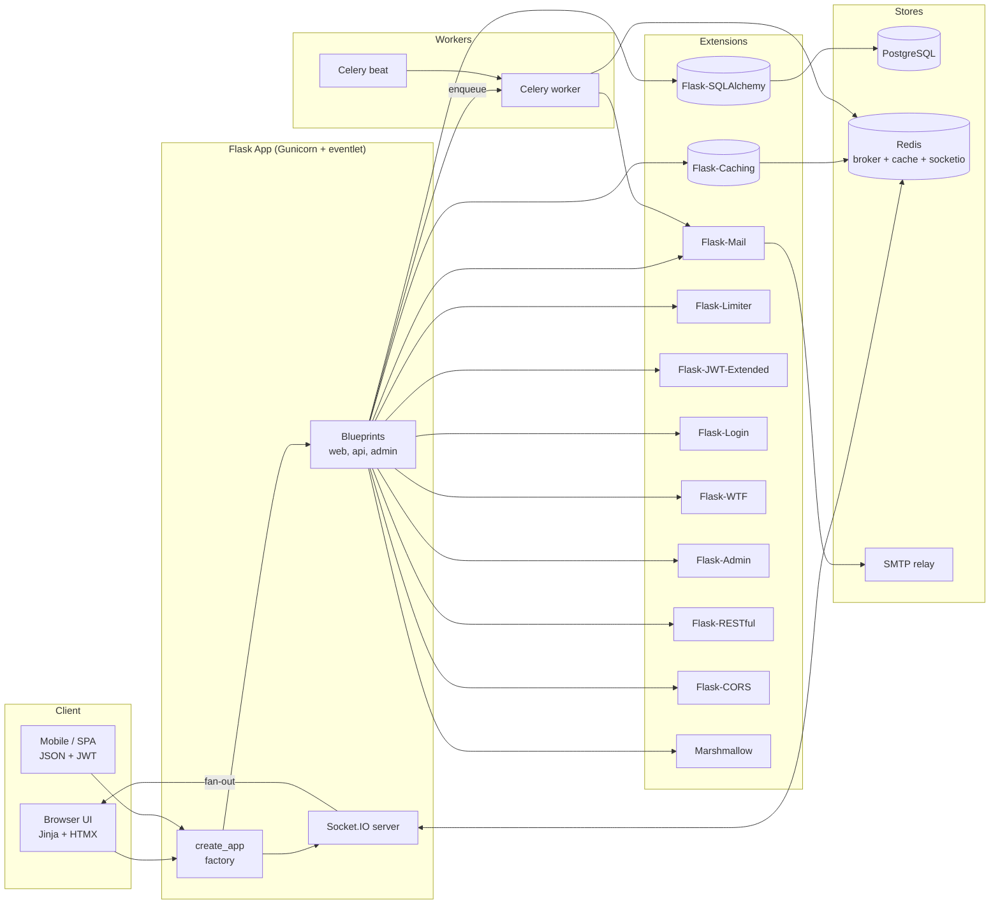
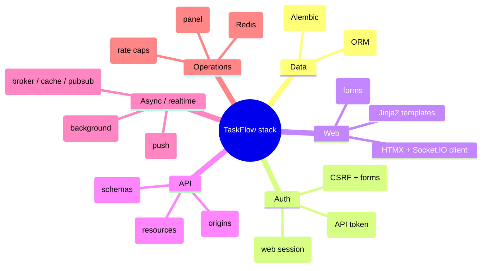
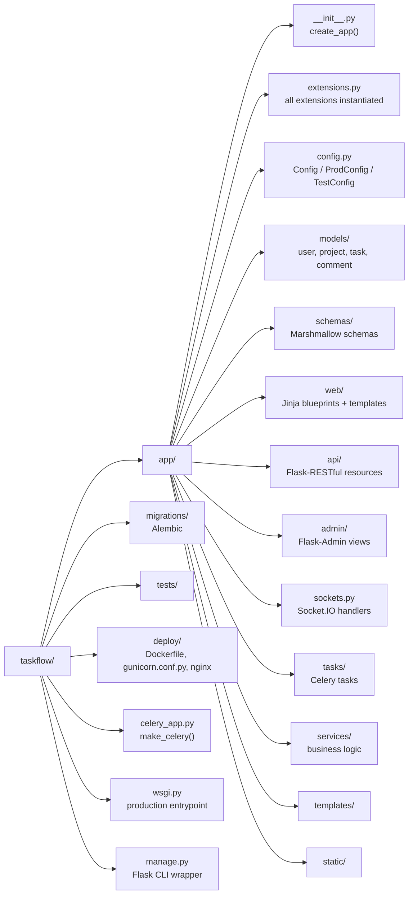
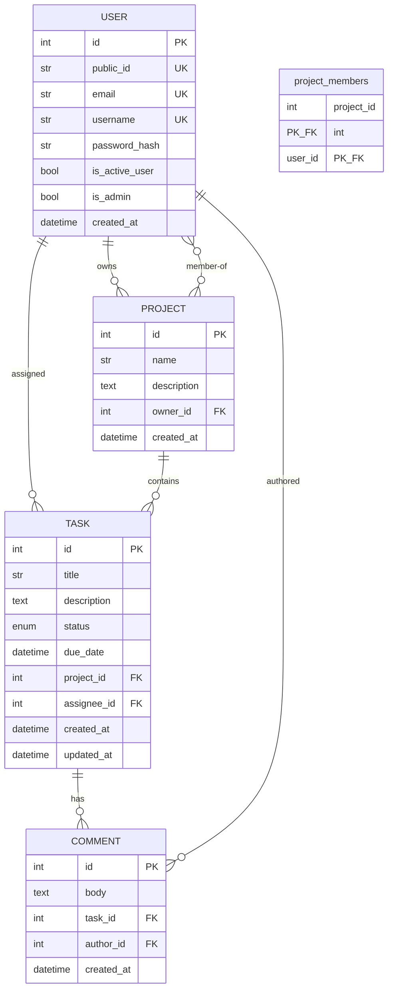
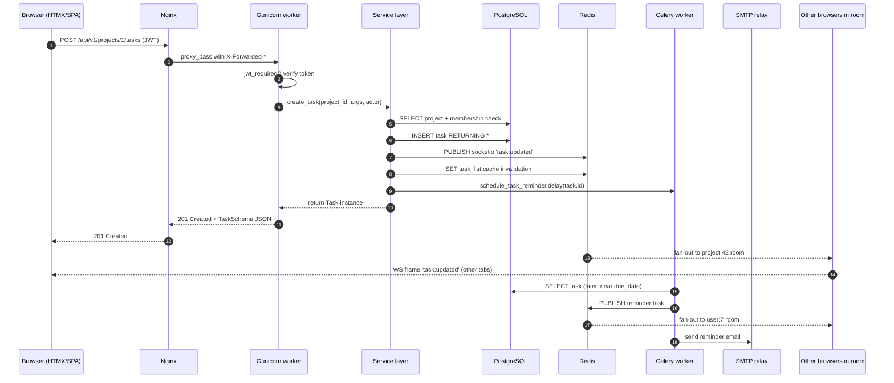

# Full-Stack Example — TaskFlow

#flask #integration #capstone #fullstack #example #architecture

> [!info] The capstone note
> This is the note that ties everything in the vault together. We build a single realistic Flask application — **TaskFlow**, a multi-user task management platform with a JSON API, a Jinja-based UI, an admin panel, background workers, real-time notifications, and rate-limited auth — using every extension covered in notes [[00-Map-of-Content]] through [[Pytest-Flask]].

If you've read the individual extension notes and wondered "but how does it all fit?", this note is the answer. Skim it, copy it, fork it. The goal is to show **one coherent architecture**, not 14 isolated snippets.

---

## 1. What We Are Building

**TaskFlow** is a collaborative task manager. Think Trello-lite or a simplified Asana. Features:

- **Users** sign up, log in (web session) **or** obtain a JWT (API).
- **Projects** contain **Tasks**; tasks have assignees, due dates, labels, and statuses.
- **Comments** on tasks, with `@mentions` that trigger email + real-time notifications.
- **Activity feed** streamed over WebSockets so collaborators see updates live.
- **Admin panel** for managing users/projects at `/admin`.
- **Public JSON API** for integrations at `/api/v1`.
- **Rate limiting** on auth endpoints to prevent brute force.
- **Background jobs**: welcome emails, daily digest, task reminders via Celery.
- **Caching**: project metadata, leaderboard, rate-limit counters in Redis.
- **Migrations** with Alembic via Flask-Migrate.

> [!tip] Why a single example?
> Each extension is a Lego brick. Bricks are interesting, but the castle is the point. This note shows the castle — the seams, the joinery, the load-bearing walls — so you can build your own.

---

## 2. System Architecture



The three big islands are **Flask (web/API)**, **Celery (background)**, and **Redis (the glue)** — Redis serves as cache, message broker, and SocketIO message queue. PostgreSQL is the single source of truth for relational data.

### Mermaid: extensions used, grouped by role



---

## 3. Project Layout



```
taskflow/
├── app/
│   ├── __init__.py            # create_app() factory
│   ├── extensions.py          # all extension singletons
│   ├── config.py              # Config classes
│   ├── models/
│   │   ├── __init__.py
│   │   ├── user.py
│   │   ├── project.py
│   │   ├── task.py
│   │   └── comment.py
│   ├── schemas/
│   │   ├── __init__.py
│   │   └── task.py
│   ├── web/
│   │   ├── __init__.py        # Blueprint('web')
│   │   ├── views.py
│   │   └── forms.py
│   ├── api/
│   │   ├── __init__.py        # Blueprint('api') + Api(api_bp)
│   │   ├── auth.py
│   │   ├── projects.py
│   │   ├── tasks.py
│   │   └── comments.py
│   ├── admin/
│   │   └── __init__.py        # Admin views
│   ├── sockets.py             # Socket.IO event handlers
│   ├── tasks/
│   │   ├── __init__.py        # celery app
│   │   ├── emails.py
│   │   └── reminders.py
│   ├── services/              # business logic (no Flask)
│   │   ├── __init__.py
│   │   ├── task_service.py
│   │   └── notification_service.py
│   ├── templates/
│   └── static/
├── migrations/                # Alembic (auto-generated)
├── tests/
├── deploy/
│   ├── Dockerfile
│   ├── docker-compose.yml
│   ├── gunicorn.conf.py
│   └── nginx.conf
├── celery_app.py
├── wsgi.py
├── manage.py
└── pyproject.toml
```

> [!tip] Why `services/`?
> The single biggest architectural decision in this codebase is keeping **business logic out of routes and out of models**. Routes are HTTP adapters. Models are data shape. Services are where the rules live. This is the difference between a codebase that scales and one that becomes a tar pit. See [[Common-Patterns]] for the full pattern.

---

## 4. The Application Factory

Every extension is instantiated **without an app** in `extensions.py`, then `init_app()`'d inside the factory. This is the canonical pattern — see [[Project-Structure]].

```python
# app/extensions.py
from flask_sqlalchemy import SQLAlchemy
from flask_migrate import Migrate
from flask_login import LoginManager
from flask_jwt_extended import JWTManager
from flask_wtf import CSRFProtect
from flask_restful import Api
from flask_cors import CORS
from flask_mail import Mail
from flask_admin import Admin
from flask_caching import Cache
from flask_limiter import Limiter
from flask_limiter.util import get_remote_address
from flask_socketio import SocketIO
from marshmallow import Marshmallow

db = SQLAlchemy()
migrate = Migrate()
login_manager = LoginManager()
jwt = JWTManager()
csrf = CSRFProtect()
mail = Mail()
admin = Admin(name="TaskFlow", template_mode="bootstrap4")
cache = Cache()
limiter = Limiter(key_func=get_remote_address(), default_limits=["1000/hour"])
ma = Marshmallow()
socketio = SocketIO(cors_allowed_origins="*", async_mode="eventlet")

# Api is bound to a blueprint, not the app, so we create it in api/__init__.py.
```

The factory wires extensions to blueprints in the right order:

```python
# app/__init__.py
import os
from flask import Flask
from .config import config_by_name
from .extensions import (
    db, migrate, login_manager, jwt, csrf, mail,
    admin, cache, limiter, ma, socketio,
)

def create_app(config_name=None):
    config_name = config_name or os.getenv("FLASK_ENV", "development")
    app = Flask(__name__)
    app.config.from_object(config_by_name[config_name])

    # 1. Core extensions first
    db.init_app(app)
    migrate.init_app(app, db)
    ma.init_app(app)
    cache.init_app(app)
    mail.init_app(app)
    limiter.init_app(app)

    # 2. Auth extensions
    login_manager.init_app(app)
    login_manager.login_view = "web.login"
    jwt.init_app(app)

    # 3. Security middleware
    csrf.init_app(app)

    # 4. Admin panel (before blueprints it uses internally)
    admin.init_app(app)

    # 5. Blueprints
    from .web import web_bp
    from .api import api_bp, api
    from .sockets import register_socket_handlers
    app.register_blueprint(web_bp)
    app.register_blueprint(api_bp, url_prefix="/api/v1")

    # 6. Wire Flask-RESTful resources (declared on blueprint-bound Api)
    from .api import register_resources
    register_resources(api)

    # 7. Admin views
    from .admin import register_admin_views
    register_admin_views(admin)

    # 8. Socket.IO handlers
    register_socket_handlers(socketio)

    # 9. CORS — apply to API only
    from flask_cors import CORS
    CORS(api_bp, resources={r"/*": {"origins": app.config["CORS_ORIGINS"]}})

    # 10. Error handlers, CLI commands, context processors
    register_error_handlers(app)
    register_cli(app)
    register_template_context(app)

    socketio.init_app(app, message_queue=app.config["SOCKETIO_MESSAGE_QUEUE"])

    return app
```

> [!warning] Order matters
> `db.init_app(app)` **must** happen before you register blueprints that import models. `csrf.init_app(app)` must happen before you register any view that uses `@csrf.exempt`. `socketio.init_app` is done last so its message queue is configured only after `app.config` is fully loaded.

---

## 5. Configuration

Three classes inherit from a base `Config`. See [[Flask-SQLAlchemy]] for the engine options.

```python
# app/config.py
import os
from datetime import timedelta

class Config:
    SECRET_KEY = os.environ["SECRET_KEY"]   # never hardcode
    SQLALCHEMY_DATABASE_URI = os.environ["DATABASE_URL"]
    SQLALCHEMY_TRACK_MODIFICATIONS = False
    SQLALCHEMY_ENGINE_OPTIONS = {
        "pool_size": 20,
        "max_overflow": 10,
        "pool_timeout": 30,
        "pool_recycle": 1800,
        "pool_pre_ping": True,
    }

    # Flask-JWT-Extended
    JWT_SECRET_KEY = os.environ["JWT_SECRET_KEY"]
    JWT_ACCESS_TOKEN_EXPIRES = timedelta(minutes=15)
    JWT_REFRESH_TOKEN_EXPIRES = timedelta(days=30)
    JWT_TOKEN_LOCATION = ["headers", "cookies"]
    JWT_COOKIE_CSRF_PROTECT = True

    # Flask-Mail
    MAIL_SERVER = os.environ.get("MAIL_SERVER", "smtp.gmail.com")
    MAIL_PORT = int(os.environ.get("MAIL_PORT", 587))
    MAIL_USE_TLS = True
    MAIL_USERNAME = os.environ.get("MAIL_USERNAME")
    MAIL_PASSWORD = os.environ.get("MAIL_PASSWORD")
    MAIL_DEFAULT_SENDER = os.environ.get("MAIL_DEFAULT_SENDER", "noreply@taskflow.app")

    # Flask-Caching
    CACHE_TYPE = "RedisCache"
    CACHE_REDIS_URL = os.environ.get("REDIS_URL", "redis://localhost:6379/0")
    CACHE_DEFAULT_TIMEOUT = 300

    # Flask-Limiter
    RATELIMIT_STORAGE_URI = os.environ.get("REDIS_URL", "redis://localhost:6379/1")
    RATELIMIT_HEADERS_ENABLED = True

    # Flask-SocketIO
    SOCKETIO_MESSAGE_QUEUE = os.environ.get("REDIS_URL", "redis://localhost:6379/2")

    # Celery
    CELERY_BROKER_URL = os.environ.get("REDIS_URL", "redis://localhost:6379/3")
    CELERY_RESULT_BACKEND = os.environ.get("REDIS_URL", "redis://localhost:6379/4")

    # CORS
    CORS_ORIGINS = ["https://app.taskflow.app", "http://localhost:3000"]

    # File uploads
    UPLOAD_FOLDER = os.environ.get("UPLOAD_FOLDER", "/var/taskflow/uploads")
    MAX_CONTENT_LENGTH = 10 * 1024 * 1024  # 10 MB

class DevelopmentConfig(Config):
    DEBUG = True
    SQLALCHEMY_ECHO = False  # set True for SQL logging

class TestingConfig(Config):
    TESTING = True
    SQLALCHEMY_DATABASE_URI = "sqlite:///:memory:"
    RATELIMIT_ENABLED = False
    WTF_CSRF_ENABLED = False
    CACHE_TYPE = "NullCache"
    MAIL_SUPPRESS_SEND = True

class ProductionConfig(Config):
    DEBUG = False
    PREFERRED_URL_SCHEME = "https"

config_by_name = {
    "development": DevelopmentConfig,
    "testing": TestingConfig,
    "production": ProductionConfig,
}
```

> [!danger] Never commit secrets
> `SECRET_KEY`, `JWT_SECRET_KEY`, `DATABASE_URL`, `MAIL_PASSWORD` come from env vars only. In production use a secret manager (AWS Secrets Manager, Doppler, Vault). See [[Security-Best-Practices]].

---

## 6. Models

A single `db` from `extensions.py` is imported everywhere. Models live one-per-file.

```python
# app/models/user.py
import uuid
from datetime import datetime
from flask_login import UserMixin
from werkzeug.security import generate_password_hash, check_password_hash
from app.extensions import db

class User(UserMixin, db.Model):
    __tablename__ = "users"

    id = db.Column(db.Integer, primary_key=True)
    public_id = db.Column(db.String(36), unique=True, default=lambda: str(uuid.uuid4()),
                          index=True)
    email = db.Column(db.String(255), unique=True, nullable=False, index=True)
    username = db.Column(db.String(64), unique=True, nullable=False)
    password_hash = db.Column(db.String(255), nullable=False)
    is_active_user = db.Column(db.Boolean, default=True, nullable=False)
    is_admin = db.Column(db.Boolean, default=False, nullable=False)
    created_at = db.Column(db.DateTime, default=datetime.utcnow, server_default=db.func.now())

    projects = db.relationship("Project", secondary="project_members", back_populates="members")
    tasks = db.relationship("Task", back_populates="assignee")

    def set_password(self, password: str):
        self.password_hash = generate_password_hash(password, method="scrypt")

    def check_password(self, password: str) -> bool:
        return check_password_hash(self.password_hash, password)

    # UserMixin uses is_active property; we have a column with a different name.
    @property
    def is_active(self):
        return self.is_active_user
```

```python
# app/models/project.py
from datetime import datetime
from app.extensions import db

project_members = db.Table(
    "project_members",
    db.Column("project_id", db.Integer, db.ForeignKey("projects.id"), primary_key=True),
    db.Column("user_id", db.Integer, db.ForeignKey("users.id"), primary_key=True),
)

class Project(db.Model):
    __tablename__ = "projects"

    id = db.Column(db.Integer, primary_key=True)
    name = db.Column(db.String(120), nullable=False)
    description = db.Column(db.Text)
    owner_id = db.Column(db.Integer, db.ForeignKey("users.id"), nullable=False, index=True)
    created_at = db.Column(db.DateTime, default=datetime.utcnow)

    owner = db.relationship("User", backref="owned_projects")
    members = db.relationship("User", secondary=project_members, back_populates="projects")
    tasks = db.relationship("Task", back_populates="project", cascade="all, delete-orphan")
```

```python
# app/models/task.py
import enum
from datetime import datetime
from app.extensions import db

class TaskStatus(enum.Enum):
    todo = "todo"
    in_progress = "in_progress"
    done = "done"
    blocked = "blocked"

class Task(db.Model):
    __tablename__ = "tasks"

    id = db.Column(db.Integer, primary_key=True)
    title = db.Column(db.String(255), nullable=False)
    description = db.Column(db.Text)
    status = db.Column(db.Enum(TaskStatus), default=TaskStatus.todo, nullable=False, index=True)
    due_date = db.Column(db.DateTime)
    project_id = db.Column(db.Integer, db.ForeignKey("projects.id"), nullable=False, index=True)
    assignee_id = db.Column(db.Integer, db.ForeignKey("users.id"), nullable=True, index=True)
    created_at = db.Column(db.DateTime, default=datetime.utcnow)
    updated_at = db.Column(db.DateTime, default=datetime.utcnow, onupdate=datetime.utcnow)

    project = db.relationship("Project", back_populates="tasks")
    assignee = db.relationship("User", back_populates="tasks")
    comments = db.relationship("Comment", back_populates="task", cascade="all, delete-orphan")
```

```python
# app/models/comment.py
from datetime import datetime
from app.extensions import db

class Comment(db.Model):
    __tablename__ = "comments"
    id = db.Column(db.Integer, primary_key=True)
    body = db.Column(db.Text, nullable=False)
    task_id = db.Column(db.Integer, db.ForeignKey("tasks.id"), nullable=False, index=True)
    author_id = db.Column(db.Integer, db.ForeignKey("users.id"), nullable=False)
    created_at = db.Column(db.DateTime, default=datetime.utcnow)

    task = db.relationship("Task", back_populates="comments")
    author = db.relationship("User")
```

```python
# app/models/__init__.py
from .user import User
from .project import Project, project_members
from .task import Task, TaskStatus
from .comment import Comment

__all__ = ["User", "Project", "project_members", "Task", "TaskStatus", "Comment"]
```

### Mermaid: TaskFlow entity relationships



---

## 7. Marshmallow Schemas

[[Marshmallow]] is our serialization layer — never `jsonify(model.__dict__)` directly, because that leaks columns and breaks the moment a column is renamed.

```python
# app/schemas/task.py
from marshmallow import fields, validate, EXCLUDE
from app.extensions import ma
from app.models import Task, TaskStatus

class TaskSchema(ma.SQLAlchemyAutoSchema):
    class Meta:
        model = Task
        include_relationships = True
        load_instance = True
        unknown = EXCLUDE

    status = fields.Enum(TaskStatus, by_value=True)
    assignee = fields.Method("get_assignee_summary")

    def get_assignee_summary(self, obj):
        if not obj.assignee:
            return None
        return {"id": obj.assignee.id, "username": obj.assignee.username}

class TaskCreateSchema(ma.Schema):
    title = fields.String(required=True, validate=validate.Length(min=1, max=255))
    description = fields.String(load_default="")
    status = fields.Enum(TaskStatus, by_value=True, load_default=TaskStatus.todo)
    due_date = fields.DateTime(required=False)
    assignee_id = fields.Integer(required=False)

class TaskUpdateSchema(ma.Schema):
    title = fields.String(validate=validate.Length(min=1, max=255))
    description = fields.String()
    status = fields.Enum(TaskStatus, by_value=True)
    due_date = fields.DateTime()
    assignee_id = fields.Integer(allow_none=True)
```

---

## 8. Flask-RESTful API

```python
# app/api/__init__.py
from flask import Blueprint
from flask_restful import Api

api_bp = Blueprint("api", __name__)
api = Api(api_bp)

def register_resources(api):
    from .auth import Register, Login, Refresh, Logout
    from .projects import ProjectList, ProjectDetail
    from .tasks import TaskList, TaskDetail, TaskComments
    from .comments import CommentDetail

    api.add_resource(Register,    "/auth/register")
    api.add_resource(Login,       "/auth/login")
    api.add_resource(Refresh,     "/auth/refresh")
    api.add_resource(Logout,      "/auth/logout")
    api.add_resource(ProjectList, "/projects")
    api.add_resource(ProjectDetail, "/projects/<int:project_id>")
    api.add_resource(TaskList,    "/projects/<int:project_id>/tasks")
    api.add_resource(TaskDetail,  "/tasks/<int:task_id>")
    api.add_resource(TaskComments, "/tasks/<int:task_id>/comments")
    api.add_resource(CommentDetail, "/comments/<int:comment_id>")
```

```python
# app/api/auth.py
from flask import jsonify, request
from flask_restful import Resource
from flask_jwt_extended import (
    create_access_token, create_refresh_token,
    jwt_required, get_jwt_identity, get_jwt,
    decode_token,
)
from webargs.flaskparser import use_args

from app.extensions import db, limiter, jwt, csrf
from app.models import User
from marshmallow import fields, validate, Schema

class RegisterSchema(Schema):
    username = fields.String(required=True, validate=validate.Length(min=3, max=64))
    email = fields.Email(required=True)
    password = fields.String(required=True, validate=validate.Length(min=8, max=128))

class LoginSchema(Schema):
    email = fields.Email(required=True)
    password = fields.String(required=True)

# A simple in-memory blocklist — in production use Redis, see Security-Best-Practices
_blocklist = set()

@jwt.token_in_blocklist_loader
def check_if_token_revoked(jwt_header, jwt_payload):
    jti = jwt_payload["jti"]
    return jti in _blocklist

class Register(Resource):
    @use_args(RegisterSchema, location="json")
    @limiter.limit("5/hour")
    def post(self, args):
        if User.query.filter_by(email=args["email"]).first():
            return {"error": "Email already registered"}, 409
        user = User(username=args["username"], email=args["email"])
        user.set_password(args["password"])
        db.session.add(user)
        db.session.commit()
        # Issue tokens immediately so the client doesn't need a second round-trip
        access = create_access_token(identity=str(user.id), additional_claims={"username": user.username})
        refresh = create_refresh_token(identity=str(user.id))
        return {"access_token": access, "refresh_token": refresh, "user_id": user.id}, 201

class Login(Resource):
    @use_args(LoginSchema, location="json")
    @limiter.limit("10/minute; 100/hour")
    def post(self, args):
        user = User.query.filter_by(email=args["email"]).first()
        if not user or not user.check_password(args["password"]):
            # Same error for "no such email" vs "wrong password" — prevents enumeration
            return {"error": "Invalid credentials"}, 401
        access = create_access_token(identity=str(user.id))
        refresh = create_refresh_token(identity=str(user.id))
        return {"access_token": access, "refresh_token": refresh}

class Refresh(Resource):
    method_decorators = [jwt_required(refresh=True)]
    def post(self):
        identity = get_jwt_identity()
        access = create_access_token(identity=identity)
        return {"access_token": access}

class Logout(Resource):
    method_decorators = [jwt_required()]
    def post(self):
        jti = get_jwt()["jti"]
        _blocklist.add(jti)
        return {"msg": "Logged out"}, 200
```

```python
# app/api/tasks.py
from flask import request
from flask_jwt_extended import jwt_required, get_jwt_current_user
from flask_restful import Resource
from webargs.flaskparser import use_args

from app.extensions import db, cache, limiter, csrf
from app.models import Task, Project
from app.schemas.task import TaskSchema, TaskCreateSchema, TaskUpdateSchema
from app.services.task_service import create_task, update_task
from app.tasks.reminders import schedule_task_reminder

def _cache_key_for_user(project_id):
    """Cache key includes the project and the requesting user — see the warning below."""
    from flask_jwt_extended import get_jwt_identity
    return f"task_list:p{project_id}:u{get_jwt_identity()}"

class TaskList(Resource):
    method_decorators = [jwt_required()]

    @cache.cached(timeout=60, key_prefix=_cache_key_for_user)
    def get(self, project_id):
        project = Project.query.get_or_404(project_id)
        tasks = Task.query.filter_by(project_id=project_id).all()
        return TaskSchema(many=True).dump(tasks)

    @use_args(TaskCreateSchema, location="json")
    def post(self, args, project_id):
        user = get_jwt_current_user()
        task = create_task(project_id, args, actor=user)
        # Invalidate the cached list for every project member.
        for member in task.project.members:
            cache.delete_memoized(TaskList.get, project_id)  # see Flask-Caching note
        schedule_task_reminder.delay(task.id)
        return TaskSchema().dump(task), 201

class TaskDetail(Resource):
    method_decorators = [jwt_required()]

    def get(self, task_id):
        return TaskSchema().dump(Task.query.get_or_404(task_id))

    @use_args(TaskUpdateSchema, location="json")
    def put(self, args, task_id):
        task = Task.query.get_or_404(task_id)
        updated = update_task(task, args)
        return TaskSchema().dump(updated)

    def delete(self, task_id):
        task = Task.query.get_or_404(task_id)
        project_id = task.project_id
        db.session.delete(task)
        db.session.commit()
        return "", 204
```

> [!warning] `@cache.cached` and `@jwt_required` ordering
> If you cache a JWT-protected endpoint with the default key (URL only), the cached response is served to **whichever user requests first** — every other user then sees their data. Either cache only public endpoints, or include the user identity in the cache key (as above with `key_prefix=_cache_key_for_user`). This is one of the most common Flask production bugs.

> [!tip] JWT blocklist must be persistent
> The `_blocklist` set above is in-process memory — fine for a single-worker demo, useless in production with multiple Gunicorn workers (each has its own set). Use Redis: `from app.extensions import cache; cache.set(f"revoked:{jti}", 1, timeout=...)` and check `cache.get(...)` in the loader. See [[Flask-JWT-Extended]] for the full pattern.

---

## 9. Web UI (Flask-Login + Flask-WTF)

```python
# app/web/__init__.py
from flask import Blueprint
web_bp = Blueprint("web", __name__)

from . import views  # noqa: E402,F401
```

```python
# app/web/forms.py
from flask_wtf import FlaskForm
from flask_wtf.file import FileField, FileAllowed, FileRequired
from wtforms import StringField, PasswordField, SubmitField, TextAreaField
from wtforms.validators import DataRequired, Email, Length, EqualTo

class LoginForm(FlaskForm):
    email = StringField("Email", validators=[DataRequired(), Email()])
    password = PasswordField("Password", validators=[DataRequired()])
    submit = SubmitField("Sign in")

class SignupForm(FlaskForm):
    username = StringField("Username", validators=[DataRequired(), Length(3, 64)])
    email = StringField("Email", validators=[DataRequired(), Email()])
    password = PasswordField("Password", validators=[DataRequired(), Length(8, 128)])
    confirm = PasswordField("Confirm", validators=[EqualTo("password")])
    avatar = FileField("Avatar", validators=[
        FileAllowed(["jpg", "png"], "Images only!")])
    submit = SubmitField("Create account")
```

```python
# app/web/views.py
from flask import render_template, redirect, url_for, flash, request
from flask_login import login_user, logout_user, login_required, current_user
from werkzeug.utils import secure_filename

from . import web_bp
from .forms import LoginForm, SignupForm
from app.extensions import db, limiter, csrf
from app.models import User
from app.tasks.emails import send_welcome_email

@web_bp.route("/")
def index():
    if current_user.is_authenticated:
        return redirect(url_for("web.dashboard"))
    return render_template("index.html")

@web_bp.route("/login", methods=["GET", "POST"])
@limiter.limit("10/minute; 100/hour")
def login():
    form = LoginForm()
    if form.validate_on_submit():
        user = User.query.filter_by(email=form.email.data).first()
        if user and user.check_password(form.password.data):
            login_user(user, remember=True)
            return redirect(request.args.get("next") or url_for("web.dashboard"))
        flash("Invalid credentials", "danger")
    return render_template("login.html", form=form)

@web_bp.route("/signup", methods=["GET", "POST"])
@limiter.limit("5/hour")
def signup():
    form = SignupForm()
    if form.validate_on_submit():
        user = User(username=form.username.data, email=form.email.data)
        user.set_password(form.password.data)
        if form.avatar.data:
            filename = secure_filename(form.avatar.data.filename)
            form.avatar.data.save(f"/var/taskflow/uploads/{filename}")
        db.session.add(user)
        db.session.commit()
        send_welcome_email.delay(user.id)
        login_user(user)
        return redirect(url_for("web.dashboard"))
    return render_template("signup.html", form=form)

@web_bp.route("/dashboard")
@login_required
def dashboard():
    return render_template("dashboard.html", user=current_user)
```

---

## 10. Admin Panel (Flask-Admin)

```python
# app/admin/__init__.py
from flask_admin.contrib.sqla import ModelView
from flask_login import current_user
from flask import redirect, url_for, abort
from app.extensions import db
from app.models import User, Project, Task, Comment

class AdminModelView(ModelView):
    def is_accessible(self):
        return current_user.is_authenticated and current_user.is_admin

    def inaccessible_callback(self, name, **kwargs):
        if not current_user.is_authenticated:
            return redirect(url_for("web.login", next=request.url))
        abort(403)

def register_admin_views(admin):
    admin.add_view(AdminModelView(User, db.session))
    admin.add_view(AdminModelView(Project, db.session))
    admin.add_view(AdminModelView(Task, db.session))
    admin.add_view(AdminModelView(Comment, db.session))
```

---

## 11. Real-Time Notifications (Flask-SocketIO)

```python
# app/sockets.py
from flask_socketio import SocketIO, join_room, leave_room, emit
from flask_login import current_user
from flask import request

def register_socket_handlers(socketio: SocketIO):

    @socketio.on("connect")
    def on_connect():
        if not current_user.is_authenticated:
            return False  # reject
        # Join a personal room for direct messages
        join_room(f"user:{current_user.id}")
        # Join each project room the user belongs to
        for project in current_user.projects:
            join_room(f"project:{project.id}")

    @socketio.on("disconnect")
    def on_disconnect():
        # Rooms are auto-cleaned on disconnect.
        pass

    @socketio.on("task:view")
    def on_task_view(data):
        task_id = data.get("task_id")
        join_room(f"task:{task_id}")
        emit("viewer:joined", {"user": current_user.username}, room=f"task:{task_id}",
             include_self=False)
```

A **service layer** broadcasts notifications — this is how Celery workers push updates to browsers without owning a Flask app context:

```python
# app/services/notification_service.py
from flask_socketio import SocketIO
from app.extensions import socketio  # the singleton, no app needed

def notify_task_updated(task_id, payload):
    """Can be called from any process — Flask or Celery — as long as
    the SocketIO client is configured with the message_queue URL."""
    socketio.emit("task:updated", payload, room=f"task:{task_id}")

def notify_user(user_id, event, payload):
    socketio.emit(event, payload, room=f"user:{user_id}")
```

> [!tip] Cross-process SocketIO
> The magic is `message_queue=redis://…` on the SocketIO instance. With that set, `socketio.emit()` from a Celery worker publishes a message to Redis, and the Flask-SocketIO server in the web process picks it up and fans it out to the right WebSocket connections. No direct connection between the worker and the browser. See [[Flask-SocketIO]].

### Mermaid: full request — POST /api/v1/projects/1/tasks



---

## 12. Background Tasks (Celery)

```python
# celery_app.py
from celery import Celery
import os

def make_celery():
    broker = os.environ.get("REDIS_URL", "redis://localhost:6379/3")
    celery = Celery("taskflow", broker=broker, backend=broker)
    celery.conf.update(
        task_serializer="json",
        accept_content=["json"],
        result_serializer="json",
        timezone="UTC",
        enable_utc=True,
        task_track_started=True,
        worker_prefetch_multiplier=1,  # important for long tasks
    )
    return celery

celery = make_celery()

# Make Celery aware of tasks by importing them.
import app.tasks.emails  # noqa
import app.tasks.reminders  # noqa
```

```python
# app/tasks/emails.py
from celery import shared_task
from flask import render_template, current_app
from app.extensions import mail, db
from app.models import User
from flask_mail import Message

@shared_task(bind=True, max_retries=3, default_retry_delay=60)
def send_welcome_email(self, user_id: int):
    user = db.session.get(User, user_id)
    if not user:
        return
    try:
        msg = Message(
            subject="Welcome to TaskFlow!",
            recipients=[user.email],
            html=render_template("emails/welcome.html", user=user),
        )
        mail.send(msg)
    except Exception as exc:
        raise self.retry(exc=exc)
```

```python
# app/tasks/reminders.py
from celery import shared_task
from datetime import datetime, timedelta
from app.extensions import db
from app.models import Task
from app.services.notification_service import notify_user

@shared_task
def schedule_task_reminder(task_id: int):
    """Schedule a reminder 1 hour before due date."""
    task = db.session.get(Task, task_id)
    if not task or not task.due_date:
        return
    eta = task.due_date - timedelta(hours=1)
    send_task_reminder.apply_async(args=[task_id], eta=eta)

@shared_task
def send_task_reminder(task_id: int):
    task = db.session.get(Task, task_id)
    if not task or task.assignee_id is None:
        return
    notify_user(task.assignee_id, "reminder:task", {
        "task_id": task.id,
        "title": task.title,
        "due_date": task.due_date.isoformat(),
    })

@shared_task
def daily_digest():
    """Run by Celery beat once a day at 8am local time."""
    soon = datetime.utcnow() + timedelta(days=1)
    tasks = Task.query.filter(
        Task.due_date < soon,
        Task.status != "done",
    ).all()
    # Group by assignee and send emails...
```

---

## 13. Service Layer

Routes are thin. Models are thin. **Services are fat.** This is the only way to share logic between web, API, CLI, and Celery without duplicating it.

```python
# app/services/task_service.py
from typing import Any
from app.extensions import db
from app.models import Task, Project, User, TaskStatus
from app.services.notification_service import notify_task_updated
from app.tasks.reminders import schedule_task_reminder

def create_task(project_id: int, data: dict[str, Any], actor: User) -> Task:
    project = Project.query.get_or_404(project_id)
    if actor not in project.members and project.owner_id != actor.id:
        raise PermissionError("Not a project member")
    task = Task(
        title=data["title"],
        description=data.get("description", ""),
        status=data.get("status", TaskStatus.todo),
        due_date=data.get("due_date"),
        assignee_id=data.get("assignee_id"),
        project_id=project_id,
    )
    db.session.add(task)
    db.session.commit()
    notify_task_updated(task.id, {"action": "created", "task_id": task.id})
    schedule_task_reminder.delay(task.id)
    return task

def update_task(task: Task, data: dict[str, Any]) -> Task:
    changed = []
    for field in ("title", "description", "status", "due_date", "assignee_id"):
        if field in data and getattr(task, field) != data[field]:
            setattr(task, field, data[field])
            changed.append(field)
    if changed:
        db.session.commit()
        notify_task_updated(task.id, {"action": "updated", "fields": changed})
    return task
```

---

## 14. Error Handlers

Consistent JSON errors whether the request hits a web route or an API resource:

```python
# app/__init__.py (continued)
from flask import jsonify, render_template
from werkzeug.exceptions import HTTPException

def register_error_handlers(app):
    @app.errorhandler(HTTPException)
    def handle_http_exc(e):
        if request.path.startswith("/api/"):
            return jsonify({"error": e.name, "message": e.description, "code": e.code}), e.code
        return render_template("error.html", code=e.code, message=e.description), e.code

    @app.errorhandler(404)
    def not_found(e):
        if request.path.startswith("/api/"):
            return jsonify({"error": "Not Found", "code": 404}), 404
        return render_template("error.html", code=404), 404

    @app.errorhandler(Exception)
    def handle_unexpected(e):
        app.logger.exception("Unhandled exception")
        if request.path.startswith("/api/"):
            return jsonify({"error": "Internal Server Error", "code": 500}), 500
        return render_template("error.html", code=500), 500
```

---

## 15. Running It

### Development

```bash
# Terminal 1 — Redis + Postgres via Docker
docker compose up redis postgres

# Terminal 2 — Flask + SocketIO
flask --app celery_app.py socketio run --reload --log-level debug

# Terminal 3 — Celery worker
celery -A celery_app.celery worker --loglevel=info

# Terminal 4 — Celery beat
celery -A celery_app.celery beat --loglevel=info

# Terminal 5 — Migrations
flask db upgrade
```

`wsgi.py` for production:

```python
# wsgi.py
from app import create_app
from app.extensions import socketio

app = create_app("production")

if __name__ == "__main__":
    socketio.run(app)
```

Run with Gunicorn + eventlet (SocketIO requires async workers — see [[Production-Deployment]]):

```bash
gunicorn -k eventlet -w 1 --bind 0.0.0.0:8000 wsgi:app
```

> [!warning] SocketIO + multiple Gunicorn workers
> If you scale Flask-SocketIO to multiple processes, you **must** use `--threads 1` and configure the `message_queue` on SocketIO. Otherwise emit from one worker won't reach sockets on another. The Redis message queue is the bus that synchronizes them.

---

## 16. Templates & JWT Cookie Mode

The API above uses JWTs in the `Authorization` header (the SPA/mobile case). The web UI uses Flask-Login sessions. But there's a third mode worth mentioning: **JWTs in HttpOnly cookies** for browser-first SPA apps that don't want to manage tokens in JavaScript. Set in `Config`:

```python
JWT_TOKEN_LOCATION = ["cookies"]
JWT_ACCESS_COOKIE_PATH = "/api/"
JWT_REFRESH_COOKIE_PATH = "/auth/refresh"
JWT_COOKIE_SECURE = True           # HTTPS only in prod
JWT_COOKIE_HTTPONLY = True         # JS cannot read
JWT_COOKIE_SAMESITE = "Lax"        # or "Strict"
JWT_COOKIE_CSRF_PROTECT = True     # double-submit CSRF cookie
```

When `JWT_COOKIE_CSRF_PROTECT` is enabled, Flask-JWT-Extended expects an `X-CSRF-TOKEN` header matching a CSRF cookie value. This pairs neatly with Flask-WTF's CSRF for the web UI — both flows are protected.

A minimal Jinja template for the dashboard (HTMX-driven, real-time updates via Socket.IO):

```html
<!-- app/templates/dashboard.html -->


<h1>Welcome, {{ current_user.username }}</h1>
<div id="tasks" hx-get="/api/v1/projects/1/tasks" hx-trigger="load, task:updated from:body">
  Loading…
</div>

<script>
const socket = io({ auth: { token: localStorage.getItem("jwt") } });
socket.on("task:updated", (data) => {
  htmx.trigger("#tasks", "task:updated");
});
socket.on("reminder:task", (data) => {
  alert("Reminder: " + data.title);
});
</script>

```

The base template injects the CSRF token so any `fetch` from JavaScript can include it:

```html
<!-- app/templates/base.html -->
<!doctype html>
<html>
<head>
  <meta name="csrf-token" content="{{ csrf_token() }}">
  <script src="https://unpkg.com/htmx.org"></script>
  <script src="https://cdn.socket.io/4.7.5/socket.io.min.js"></script>
</head>
<body></body>
</html>
```

---

## 17. CORS and CSRF Exemptions

The API blueprint needs CORS (for browser SPAs on a different origin) but **not** CSRF (because JWT-in-header is CSRF-safe — browsers don't auto-send `Authorization`). The web blueprint needs CSRF but not CORS (same-origin).

```python
# In create_app()
from flask_cors import CORS
# CORS only on the API blueprint
CORS(api_bp, resources={r"/*": {"origins": app.config["CORS_ORIGINS"]}},
     supports_credentials=True)

# Exempt API from CSRF — JWT in Authorization header is the protection
csrf.exempt(api_bp)
```

> [!warning] `supports_credentials=True` requires explicit origins
> If you set `supports_credentials=True`, you cannot use `"*"` as the origin — the browser will refuse. You must list exact origins. This is a CORS spec rule, not a Flask-CORS quirk. See [[Flask-CORS]].

---

## 18. CLI Commands

Flask's CLI is the right place for one-off scripts — creating admin users, seeding, flushing caches:

```python
# app/__init__.py (continued)
import click

def register_cli(app):
    @app.cli.command("create-admin")
    @click.argument("email")
    @click.password_option()
    def create_admin(email, password):
        """Create an admin user."""
        from app.models import User
        from app.extensions import db
        u = User(email=email, username=email.split("@")[0], is_admin=True)
        u.set_password(password)
        db.session.add(u); db.session.commit()
        click.echo(f"Admin {email} created.")

    @app.cli.command("flush-cache")
    def flush_cache():
        """Clear the entire cache."""
        from app.extensions import cache
        cache.clear()
        click.echo("Cache cleared.")

    @app.cli.command("seed")
    def seed():
        """Insert demo data."""
        from app.models import User, Project, Task
        from app.extensions import db
        u = User(email="demo@taskflow.app", username="demo"); u.set_password("demodemo")
        db.session.add_all([
            u,
            Project(name="Demo", owner_id=1),
            Task(title="Try TaskFlow", project_id=1, assignee_id=1),
        ])
        db.session.commit()
        click.echo("Seeded.")
```

Use them:

```bash
flask create-admin admin@taskflow.app
flask seed
flask flush-cache
```

---

## 19. Testing

Tests use the testing config; see [[Pytest-Flask]].

```python
# tests/conftest.py
import pytest
from app import create_app
from app.extensions import db

@pytest.fixture
def app():
    app = create_app("testing")
    with app.app_context():
        db.create_all()
        yield app
        db.session.remove()
        db.drop_all()

@pytest.fixture
def client(app):
    return app.test_client()

@pytest.fixture
def auth_client(app, client):
    """A client already authenticated via JWT."""
    from app.models import User
    with app.app_context():
        u = User(username="alice", email="a@b.c")
        u.set_password("hunter2!!")
        db.session.add(u); db.session.commit()
        uid = u.id
    r = client.post("/api/v1/auth/login", json={"email": "a@b.c", "password": "hunter2!!"})
    token = r.get_json()["access_token"]
    client.environ_base["HTTP_AUTHORIZATION"] = f"Bearer {token}"
    return client, uid
```

```python
# tests/test_tasks_api.py
def test_create_task_requires_auth(client):
    r = client.post("/api/v1/projects/1/tasks", json={"title": "x"})
    assert r.status_code == 401

def test_create_task(app, auth_client):
    client, uid = auth_client
    with app.app_context():
        from app.models import Project
        from app.extensions import db
        db.session.add(Project(name="P", owner_id=uid))
        db.session.commit()
    r = client.post("/api/v1/projects/1/tasks", json={"title": "First task"})
    assert r.status_code == 201
    assert r.get_json()["title"] == "First task"
```

> [!tip] Use `celery_task_always_eager` in tests
> Don't spin up a real broker in tests. Set `celery.conf.task_always_eager = True` (or override in `TestingConfig`) so tasks run synchronously in the same process. Assert on side effects, not on the fact that a task was called.

---

## 20. Why This Architecture Works

| Concern | Where it lives | Why |
|---|---|---|
| HTTP transport | `app/web`, `app/api` | Routes are adapters, not business logic. |
| Data shape | `app/models` | Models are passive — they don't enforce rules. |
| Business rules | `app/services` | One place to look when a rule changes. |
| Async side effects | `app/tasks` | Email/SMS/ML never block a request. |
| Real-time fan-out | `app/sockets` + Redis pub/sub | Decouples workers from browser connections. |
| Caching | `app/extensions.cache` + `@cache.cached` | Off-the-request hot path. |
| Limits | `app/extensions.limiter` | One policy, applied at the route. |
| Serialization | `app/schemas` | Single source of truth for API shape. |
| Migrations | `migrations/` | Schema changes are code, reviewed and reversible. |
| Tests | `tests/` | Mirror the `app/` structure. |

> [!success] The capstone in one sentence
> A Flask app is **thin routes + fat services + decoupled workers + Redis as the universal bus** — everything else is just configuration of the extensions covered in the rest of this vault.

---

## 21. Where To Go Next

- [[Production-Deployment]] — take this app to production: Gunicorn, Nginx, Docker, monitoring.
- [[Common-Patterns]] — the cookbook. Every pattern used above (factory, service layer, error handlers, soft delete, audit log) explained standalone.
- [[Security-Best-Practices]] — the OWASP lens on the same codebase.
- [[Performance-Optimization]] — profile it, cache it, scale it.

---

## 22. References

- [Miguel Grinberg's Flask Mega-Tutorial](https://blog.miguelgrinberg.com/post/the-flask-mega-tutorial-part-i-hello-world) — the canonical series. Many of the patterns here originated there.
- [Structure of a Flask Project](https://lepture.com/en/2018/structure-of-a-flask-project) — Hsiaoming Yang's opinionated guide.
- [Flask at Scale (PyCon 2017)](https://www.youtube.com/watch?v=tdzUvBvgzYQ) — talk by Jonathon Culy.
- [Celery with Flask](https://docs.celeryq.dev/en/stable/userguide/application.html) — official pattern for sharing the Celery app.
- [flask-smorest](https://flask-smorest.readthedocs.io/) — alternative to Flask-RESTful with OpenAPI generation; consider for new projects.
