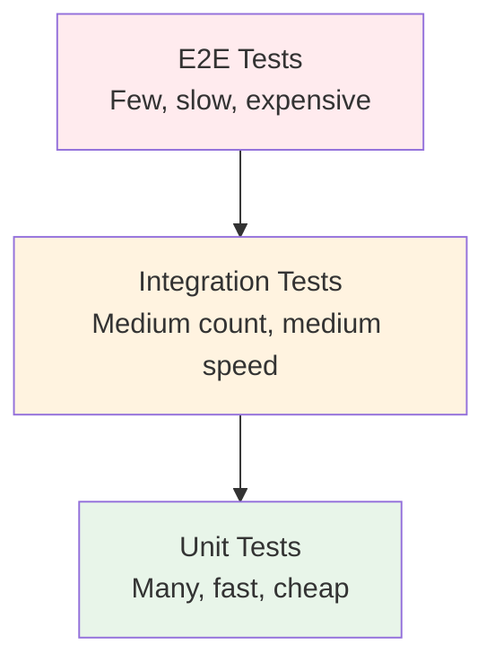

# Testing Overview

> Testing is not optional for production applications. A comprehensive test suite catches bugs before they reach users, documents expected behavior, and gives you confidence to refactor and deploy. This chapter covers the complete testing toolkit for Flask applications.

## Learning Objectives

After completing this chapter, you will be able to:

- Set up pytest for Flask application testing
- Write unit tests for view functions, models, and utilities
- Use the Flask test client to simulate HTTP requests
- Create and use fixtures for database setup and teardown
- Implement integration tests for complete request flows
- Measure and improve test coverage
- Mock external services and dependencies

## Why Test?

Testing provides:

- **Bug prevention**: Catch errors before deployment
- **Documentation**: Tests describe expected behavior
- **Confidence**: Refactor without fear of breaking things
- **Design feedback**: Hard-to-test code often indicates poor design
- **Regression prevention**: Ensure bugs stay fixed

## Testing Pyramid



| Type | Scope | Speed | Count | Tools |
|------|-------|-------|-------|-------|
| **Unit** | Single function/method | Fast | Many | pytest |
| **Integration** | Multiple components | Medium | Medium | pytest + test client |
| **E2E** | Full application flow | Slow | Few | Selenium, Playwright |

## Setting Up pytest

### Installation

```bash
pip install pytest pytest-flask pytest-cov factory-boy
```

### Project Structure

```
myapp/
    __init__.py
    config.py
    models.py
    views.py
    
tests/
    conftest.py          # Shared fixtures
    __init__.py
    unit/
        __init__.py
        test_models.py
        test_forms.py
        test_utils.py
    integration/
        __init__.py
        test_views.py
        test_auth.py
        test_api.py
    factories.py          # Test data factories
```

### Configuration

```python
# setup.cfg or pyproject.toml
[tool.pytest.ini_options]
testpaths = ["tests"]
python_files = ["test_*.py"]
python_classes = ["Test*"]
python_functions = ["test_*"]
addopts = "-v --cov=myapp --cov-report=term-missing --cov-report=html"
```

## The Flask Test Client

Flask provides a test client that simulates HTTP requests without running a server:

```python
def test_index_page(client):
    response = client.get('/')
    assert response.status_code == 200
    assert b'Welcome' in response.data
```

### Test Client Methods

```python
def test_full_crud(client):
    # GET request
    response = client.get('/posts')
    assert response.status_code == 200
    
    # POST request with form data
    response = client.post('/posts', data={
        'title': 'Test Post',
        'content': 'This is a test.'
    })
    assert response.status_code == 302  # Redirect after creation
    
    # POST with JSON
    response = client.post('/api/posts', json={
        'title': 'Test Post',
        'content': 'This is a test.'
    })
    assert response.status_code == 201
    
    # With headers
    response = client.get('/api/posts', headers={
        'Authorization': 'Bearer token123'
    })
    
    # Follow redirects
    response = client.get('/old-url', follow_redirects=True)
    assert response.request.path == '/new-url'
```

### Using the Request Context

```python
def test_with_context(app):
    with app.test_request_context('/hello?name=John'):
        assert request.path == '/hello'
        assert request.args['name'] == 'John'
```

### Session in Tests

```python
def test_login_session(client):
    with client.session_transaction() as sess:
        sess['user_id'] = 1
    
    response = client.get('/dashboard')
    assert response.status_code == 200
```

## Fixtures

Fixtures provide reusable test setup:

```python
# tests/conftest.py
import pytest
from myapp import create_app, db
from myapp.models import User

@pytest.fixture
def app():
    """Create application for testing."""
    app = create_app('testing')
    
    with app.app_context():
        db.create_all()
        yield app
        db.session.remove()
        db.drop_all()

@pytest.fixture
def client(app):
    """Create test client."""
    return app.test_client()

@pytest.fixture
def runner(app):
    """Create test CLI runner."""
    return app.test_cli_runner()

@pytest.fixture
def auth_client(client):
    """Create authenticated test client."""
    user = User(username='testuser', email='test@example.com')
    user.set_password('password')
    db.session.add(user)
    db.session.commit()
    
    client.post('/login', data={
        'email': 'test@example.com',
        'password': 'password'
    })
    return client
```

## Testing Models

```python
# tests/unit/test_models.py
def test_user_creation(app):
    with app.app_context():
        user = User(username='john', email='john@example.com')
        user.set_password('secret')
        db.session.add(user)
        db.session.commit()
        
        assert user.id is not None
        assert user.username == 'john'
        assert user.check_password('secret')
        assert not user.check_password('wrong')

def test_user_unique_constraint(app):
    with app.app_context():
        user1 = User(username='john', email='john@example.com')
        db.session.add(user1)
        db.session.commit()
        
        user2 = User(username='john', email='john2@example.com')
        db.session.add(user2)
        
        with pytest.raises(IntegrityError):
            db.session.commit()
```

## Testing Views

```python
# tests/integration/test_views.py
def test_index_page(client):
    response = client.get('/')
    assert response.status_code == 200
    assert b'Welcome' in response.data

def test_create_post(auth_client):
    response = auth_client.post('/posts', data={
        'title': 'New Post',
        'content': 'Post content'
    }, follow_redirects=True)
    
    assert response.status_code == 200
    assert b'New Post' in response.data

def test_create_post_requires_login(client):
    response = client.post('/posts', data={
        'title': 'New Post',
        'content': 'Post content'
    })
    
    assert response.status_code == 302
    assert '/login' in response.headers['Location']
```

## Testing Authentication

```python
# tests/integration/test_auth.py
def test_login_success(client):
    # Create user first
    with app.app_context():
        user = User(username='test', email='test@test.com')
        user.set_password('password')
        db.session.add(user)
        db.session.commit()
    
    response = client.post('/login', data={
        'email': 'test@test.com',
        'password': 'password'
    }, follow_redirects=True)
    
    assert response.status_code == 200
    assert b'Welcome' in response.data

def test_login_invalid_password(client):
    response = client.post('/login', data={
        'email': 'test@test.com',
        'password': 'wrong'
    })
    
    assert response.status_code == 200
    assert b'Invalid' in response.data
```

## Mocking

Mock external services to isolate tests:

```python
from unittest.mock import patch, MagicMock

def test_send_email():
    with patch('myapp.utils.send_email') as mock_send:
        mock_send.return_value = True
        
        result = send_welcome_email('user@example.com')
        
        assert result is True
        mock_send.assert_called_once_with(
            to='user@example.com',
            subject='Welcome!',
            template='welcome'
        )

@patch('requests.get')
def test_external_api(mock_get):
    mock_get.return_value.json.return_value = {'data': 'test'}
    
    result = fetch_external_data()
    
    assert result == {'data': 'test'}
    mock_get.assert_called_with('https://api.example.com/data')
```

## Test Coverage

### Running Coverage

```bash
# Run tests with coverage
pytest --cov=myapp --cov-report=term-missing

# Generate HTML report
pytest --cov=myapp --cov-report=html

# Set minimum coverage threshold
pytest --cov=myapp --cov-fail-under=80
```

### Coverage Report

```
Name                    Stmts   Miss  Cover   Missing
-----------------------------------------------------
myapp/__init__.py          15      0   100%
myapp/models.py            45      2    96%   30-31
myapp/views.py             78     15    81%   45-50, 67-72
myapp/utils.py             20      5    75%   10-14
-----------------------------------------------------
TOTAL                     158     22    86%
```

## Testing Best Practices

- **Test one thing per test**: Each test should verify a single behavior
- **Use descriptive names**: `test_user_cannot_login_with_wrong_password`
- **Arrange-Act-Assert**: Structure tests clearly
- **Avoid test interdependence**: Each test should be independent
- **Use fixtures for common setup**: DRY (Don't Repeat Yourself)
- **Test edge cases**: Empty inputs, maximum values, special characters
- **Mock external dependencies**: Tests should not call real APIs
- **Keep tests fast**: Slow tests are not run frequently
- **Run tests in CI**: Every commit should trigger tests

## Test Structure Pattern

```python
def test_feature_behavior_condition():
    # Arrange: Set up test data and state
    user = create_user()
    
    # Act: Execute the behavior being tested
    result = user.can_access(resource)
    
    # Assert: Verify the expected outcome
    assert result is True
```

## Common Mistakes

**Mistake: Testing implementation, not behavior**
Tests should verify what the code does, not how it does it.

**Mistake: Not cleaning up database state**
Always clean up test data to prevent test interdependence.

**Mistake: Testing with production database**
Always use a separate test database.

**Mistake: No assertions**
Every test must have at least one assertion.

## Exercises

1. **Setup**: Create a `conftest.py` with fixtures for app, client, and database.

2. **Model Tests**: Write unit tests for all database models (create, read, update, delete).

3. **View Tests**: Write integration tests for all routes, including authentication.

4. **Mock Exercise**: Mock an external API call in a test.

5. **Coverage**: Achieve 80%+ test coverage for a Flask application.

## Quiz

**Question 1**: What are the three types of tests in the testing pyramid? What are their characteristics?

**Question 2**: What is the Flask test client, and what does it do?

**Question 3**: What are pytest fixtures, and why are they useful?

**Question 4**: How do you mock external dependencies in tests?

**Question 5**: Why should each test be independent of others?

## Interview Questions

1. "How would you test a Flask application? What tools would you use?"

2. "What is the difference between unit tests and integration tests?"

3. "How do you test routes that require authentication?"

4. "Explain the Arrange-Act-Assert pattern."

5. "How would you mock an external API in your tests?"

6. "What test coverage percentage do you aim for? Why?"

## Related Chapters

- [[09-Testing/pytest-Basics]] — Deep dive into pytest
- [[09-Testing/Flask-Test-Client]] — Advanced test client usage
- [[09-Testing/Fixtures]] — Advanced fixture patterns
- [[09-Testing/Mocking]] — Mocking strategies
- [[09-Testing/Test-Coverage]] — Coverage analysis

## Official Documentation References

- [Flask Testing Documentation](https://flask.palletsprojects.com/en/latest/testing/)
- [pytest Documentation](https://docs.pytest.org/)
- [Flask Test Client](https://flask.palletsprojects.com/en/latest/api/#test-client)
- [pytest-flask Documentation](https://pytest-flask.readthedocs.io/)

---

*Next: [[09-Testing/pytest-Basics]]*