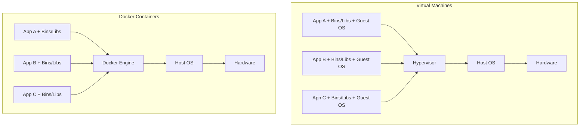

# Docker

> Docker containers package your Flask application with all its dependencies into a portable, consistent environment. Containers eliminate "it works on my machine" problems and provide a standardized deployment artifact that runs identically in development, staging, and production.

## Learning Objectives

After completing this chapter, you will be able to:

- Explain Docker containers, images, and registries
- Write a Dockerfile for a Flask application
- Use Docker Compose for multi-service development environments
- Containerize a Flask app with PostgreSQL and Redis
- Understand Docker networking and volumes
- Deploy Docker containers to production
- Optimize Docker images for size and security

## What Is Docker?

Docker is a platform for developing, shipping, and running applications in **containers**. Containers are lightweight, isolated environments that package an application with all its dependencies (libraries, system tools, configuration).

### Containers vs. Virtual Machines



| Feature | VM | Container |
|---------|-----|-----------|
| OS | Separate guest OS per VM | Shares host OS kernel |
| Size | GBs | MBs |
| Startup | Minutes | Seconds |
| Isolation | Strong (hardware-level) | Process-level |
| Portability | Limited | Highly portable |

## Dockerfile for Flask

A Dockerfile defines how to build a Docker image for your application:

```dockerfile
# Dockerfile
FROM python:3.11-slim

# Set environment variables
ENV PYTHONDONTWRITEBYTECODE=1 \
    PYTHONUNBUFFERED=1 \
    FLASK_APP=run.py \
    FLASK_ENV=production

# Set working directory
WORKDIR /app

# Install system dependencies
RUN apt-get update && apt-get install -y --no-install-recommends \
    gcc \
    postgresql-client \
    && rm -rf /var/lib/apt/lists/*

# Install Python dependencies
COPY requirements.txt .
RUN pip install --no-cache-dir -r requirements.txt

# Copy application code
COPY . .

# Create non-root user
RUN useradd -m -u 1000 appuser && chown -R appuser:appuser /app
USER appuser

# Expose port
EXPOSE 5000

# Health check
HEALTHCHECK --interval=30s --timeout=5s --start-period=5s --retries=3 \
    CMD curl -f http://localhost:5000/health || exit 1

# Run the application
CMD ["gunicorn", "--bind", "0.0.0.0:5000", "--workers", "4", "run:app"]
```

### Key Dockerfile Instructions

| Instruction | Purpose |
|-------------|---------|
| `FROM` | Base image |
| `ENV` | Environment variables |
| `WORKDIR` | Set working directory |
| `COPY` | Copy files from host to image |
| `RUN` | Execute commands during build |
| `EXPOSE` | Document which ports the container listens on |
| `USER` | Run as non-root user |
| `CMD` | Default command when container starts |
| `HEALTHCHECK` | Container health check |

### Multi-Stage Build (Optimized)

```dockerfile
# Build stage
FROM python:3.11-slim as builder

WORKDIR /app
COPY requirements.txt .
RUN pip install --user --no-cache-dir -r requirements.txt

# Production stage
FROM python:3.11-slim

ENV PYTHONDONTWRITEBYTECODE=1 \
    PYTHONUNBUFFERED=1

WORKDIR /app

# Copy only installed packages from builder
COPY --from=builder /root/.local /home/appuser/.local
ENV PATH=/home/appuser/.local/bin:$PATH

# Copy application code
COPY . .

# Run as non-root user
RUN useradd -m -u 1000 appuser && chown -R appuser:appuser /app
USER appuser

EXPOSE 5000

CMD ["gunicorn", "--bind", "0.0.0.0:5000", "--workers", "4", "run:app"]
```

Multi-stage builds dramatically reduce image size by not including build tools in the final image.

## Docker Compose

Docker Compose manages multi-container applications:

```yaml
# docker-compose.yml
version: '3.8'

services:
  web:
    build: .
    ports:
      - "5000:5000"
    environment:
      - DATABASE_URL=postgresql://postgres:postgres@db:5432/myapp
      - REDIS_URL=redis://redis:6379/0
      - SECRET_KEY=${SECRET_KEY}
    depends_on:
      - db
      - redis
    volumes:
      - ./:/app
    command: gunicorn --bind 0.0.0.0:5000 --reload --workers 2 run:app

  db:
    image: postgres:15-alpine
    environment:
      - POSTGRES_USER=postgres
      - POSTGRES_PASSWORD=postgres
      - POSTGRES_DB=myapp
    volumes:
      - postgres_data:/var/lib/postgresql/data
    ports:
      - "5432:5432"

  redis:
    image: redis:7-alpine
    ports:
      - "6379:6379"

  nginx:
    image: nginx:alpine
    ports:
      - "80:80"
      - "443:443"
    volumes:
      - ./nginx.conf:/etc/nginx/nginx.conf
      - ./static:/var/www/static
    depends_on:
      - web

volumes:
  postgres_data:
```

### Common Docker Compose Commands

```bash
# Build and start all services
docker-compose up --build

# Start in background
docker-compose up -d

# View logs
docker-compose logs -f web

# Run migrations
docker-compose exec web flask db upgrade

# Run tests
docker-compose exec web pytest

# Stop all services
docker-compose down

# Stop and remove volumes
docker-compose down -v

# Rebuild a specific service
docker-compose up -d --build web
```

## Docker Best Practices

### 1. Use Non-Root User

```dockerfile
RUN useradd -m -u 1000 appuser
USER appuser
```

### 2. Minimize Image Layers

```dockerfile
# Good: Single RUN instruction
RUN apt-get update && apt-get install -y \
    package1 \
    package2 \
    && rm -rf /var/lib/apt/lists/*
```

### 3. Use .dockerignore

```
# .dockerignore
__pycache__
*.pyc
*.pyo
.env
.git
.gitignore
.pytest_cache
.venv
venv/
*.egg-info
dist/
build/
.coverage
htmlcov/
```

### 4. Pin Base Image Versions

```dockerfile
# Good: Specific version
FROM python:3.11.4-slim

# Bad: Latest tag
FROM python:latest
```

### 5. Use Health Checks

```dockerfile
HEALTHCHECK --interval=30s --timeout=5s \
    CMD curl -f http://localhost:5000/health || exit 1
```

## Production Docker Deployment

### With Docker Swarm

```bash
# Initialize swarm
docker swarm init

# Deploy stack
docker stack deploy -c docker-compose.yml myapp

# Scale services
docker service scale myapp_web=4

# View services
docker service ls
```

### With Kubernetes

```yaml
# deployment.yaml
apiVersion: apps/v1
kind: Deployment
metadata:
  name: flask-app
spec:
  replicas: 3
  selector:
    matchLabels:
      app: flask
  template:
    metadata:
      labels:
        app: flask
    spec:
      containers:
      - name: flask
        image: myregistry/flask-app:latest
        ports:
        - containerPort: 5000
        env:
        - name: DATABASE_URL
          valueFrom:
            secretKeyRef:
              name: app-secrets
              key: database-url
        resources:
          requests:
            memory: "256Mi"
            cpu: "250m"
          limits:
            memory: "512Mi"
            cpu: "500m"
```

## Common Mistakes

**Mistake: Running as root in container**
Always create and use a non-root user.

**Mistake: Storing secrets in image**
Use environment variables or Docker secrets, never hardcode secrets.

**Mistake: Using `latest` tag**
Pin specific versions for reproducible builds.

**Mistake: Not using .dockerignore**
Unnecessary files bloat the image and may expose sensitive data.

## Exercises

1. **Dockerfile**: Write a Dockerfile for a Flask app with multi-stage build.

2. **Docker Compose**: Create a docker-compose.yml with Flask, PostgreSQL, and Redis.

3. **Health Check**: Add a `/health` endpoint to your Flask app and configure Docker health checks.

4. **Volume Persistence**: Set up named volumes for database persistence.

## Quiz

**Question 1**: What is the difference between a Docker image and a container?

**Question 2**: What is a multi-stage build, and why is it useful?

**Question 3**: What is Docker Compose, and when would you use it?

**Question 4**: Why should you run containers as a non-root user?

**Question 5**: What is the purpose of a .dockerignore file?

## Interview Questions

1. "Explain Docker containers and how they differ from virtual machines."

2. "How would you containerize a Flask application for production?"

3. "What is Docker Compose? How would you use it for development?"

4. "What are Docker best practices for Python applications?"

5. "How would you handle database migrations in a Dockerized Flask app?"

## Related Chapters

- [[07-Deployment/Deployment-Overview]] — Production deployment
- [[10-Advanced/CI-CD]] — Automated deployment with Docker
- [[07-Deployment/Gunicorn]] — WSGI server configuration

## Official Documentation References

- [Docker Documentation](https://docs.docker.com/)
- [Dockerfile Reference](https://docs.docker.com/engine/reference/builder/)
- [Docker Compose Documentation](https://docs.docker.com/compose/)
- [Docker Best Practices](https://docs.docker.com/develop/dev-best-practices/)

---

*Next: [[10-Advanced/CI-CD]]*