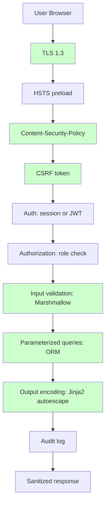
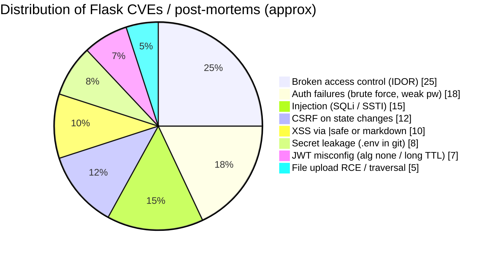
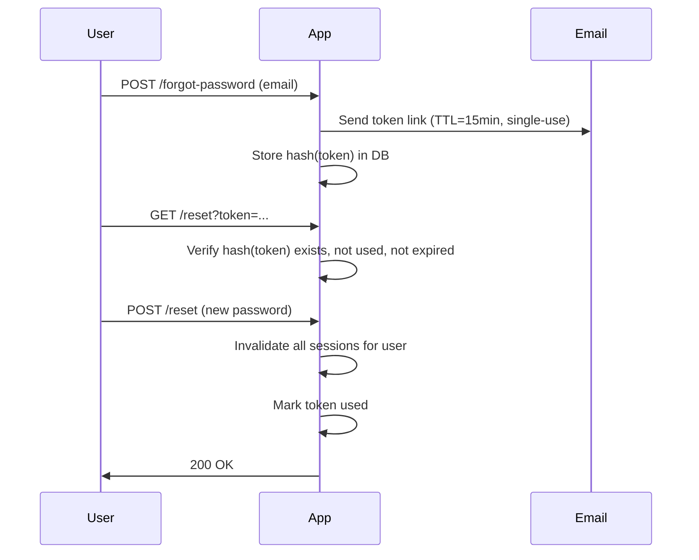
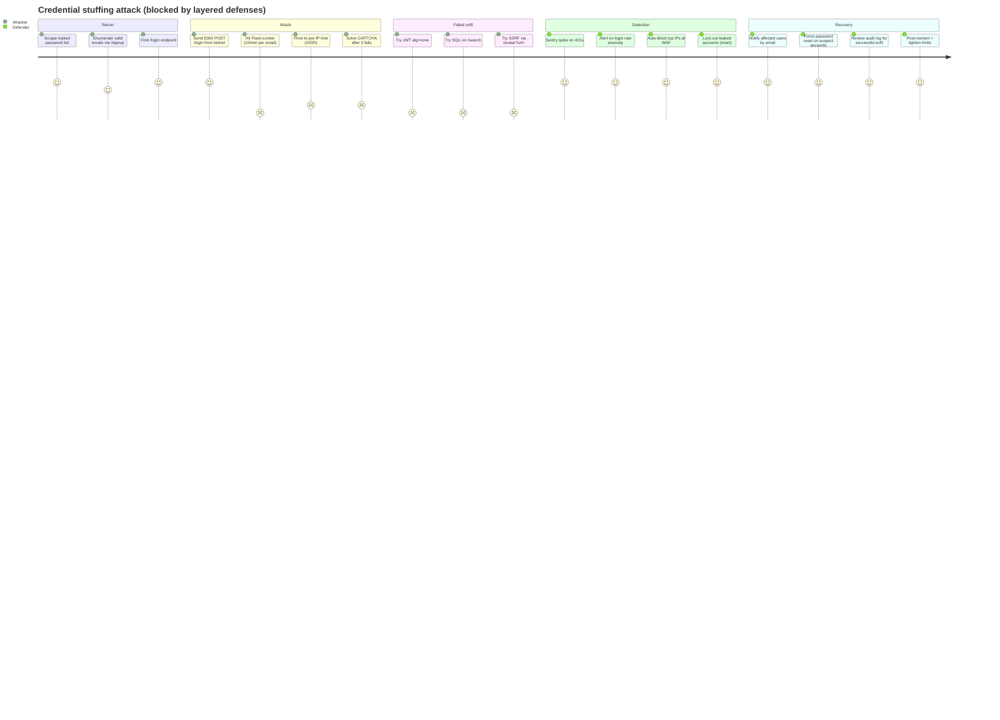

# Security Best Practices

#flask #security #owasp #csrf #jwt #https #best-practices

> [!info] The OWASP lens on Flask
> Flask itself is well-written and secure by default in most respects — Jinja2 autoescapes, `send_file` won't traverse paths, debug mode is off in production. The vulnerabilities in a Flask app are almost always **configuration mistakes, missing controls, or glue code** the framework can't enforce. This note maps the [OWASP Top 10](https://owasp.org/Top10/) onto Flask and shows the controls for each.

> [!danger] Security is never "done"
> A checklist gets you 80% of the way. The other 20% is threat modeling, pen testing, dependency scanning on every commit, and incident response drills. Treat this note as the floor, not the ceiling.

---

## 1. Defense in Depth

No single control is sufficient. Layer them so that the failure of one doesn't expose the user.



Each layer assumes the one before it has been compromised and the one after it might fail too. The combination is what makes the app safe.

### Mermaid: where real-world Flask vulnerabilities concentrate



---

## 2. OWASP Top 10 Mapped to Flask

| # | OWASP 2021 category | Flask relevance | Where in this note |
|---|---|---|---|
| A01 | Broken Access Control | Authorization checks missing on routes | §4 |
| A02 | Cryptographic Failures | Weak `SECRET_KEY`, plaintext passwords, JWT misconfig | §5, §7, §8 |
| A03 | Injection | SQL injection (raw queries), template injection | §3 |
| A04 | Insecure Design | Missing rate limits, no idempotency on writes | §11 |
| A05 | Security Misconfiguration | `DEBUG=True` in prod, default creds, verbose errors | §13 |
| A06 | Vulnerable Components | Outdated packages | §14 |
| A07 | Auth Failures | Brute force, credential stuffing, weak passwords | §9 |
| A08 | Data Integrity Failures | JWT `alg: none`, unsigned tokens | §8 |
| A09 | Logging Failures | No audit log, log injection | [[Common-Patterns]] §18 |
| A10 | SSRF | Outbound HTTP from user input | §15 |

### Mermaid: OWASP Top 10 as a concept map

```mermaid
mindmap
  root((OWASP Top 10))
    A01 Broken Access Control
      IDOR / missing ownership check
      missing role decorator
      multi-tenancy filter forgot
    A02 Cryptographic Failures
      weak SECRET_KEY
      plaintext passwords
      JWT alg confusion
    A03 Injection
      SQLi via f-string text()
      SSTI via render_template_string
      command injection via os.system
    A04 Insecure Design
      no rate limits
      no idempotency on writes
    A05 Security Misconfiguration
      DEBUG=True in prod
      default creds
      verbose error pages
    A06 Vulnerable Components
      outdated Flask / Werkzeug
      transitive deps with CVEs
    A07 Auth Failures
      brute force
      credential stuffing
      weak passwords
    A08 Data Integrity Failures
      JWT alg none
      unsigned cookies
    A09 Logging Failures
      no audit log
      log injection (newlines)
    A10 SSRF
      fetch URL from user
      metadata service access
```

---

## 3. SQL Injection (A03)

**Cause**: Concatenating user input into SQL.

```python
# VULNERABLE
db.session.execute(text(f"SELECT * FROM users WHERE email = '{email}'"))
```

If `email = "x' OR '1'='1"`, the query returns all users. If it's `"x'; DROP TABLE users;--"`, you lose the table.

**Fix**: Use parameterized queries or the ORM — always.

```python
# ORM (preferred)
user = db.session.execute(
    select(User).where(User.email == email)
).scalar_one_or_none()

# Raw SQL with bound params
db.session.execute(text("SELECT * FROM users WHERE email = :email"), {"email": email})
```

> [!warning] `text()` with f-strings is the #1 way to introduce SQLi in a Flask-SQLAlchemy app
> `text()` does not parse SQL — it sends the string directly to the DB. Only `:param` placeholders are safe. An f-string inside `text()` is fully vulnerable.

### ORM is safe by default

`Model.query.filter_by(email=email)` and `select(User).where(User.email == email)` generate parameterized SQL — user input is never interpolated into the query text.

The one ORM footgun is `eval`-like patterns:

```python
# VULNERABLE: user input directly as a filter expression
db.session.execute(select(User).filter(text(request.args.get("filter"))))
```

Treat user input as **values**, never as **SQL syntax**.

---

## 4. Broken Access Control (A01)

### In-route authorization

```python
@jwt_required()
def get_task(task_id):
    task = Task.query.get_or_404(task_id)
    if task.assignee_id != current_user.id and not current_user.is_admin:
        abort(403)
    return TaskSchema().dump(task)
```

> [!danger] IDOR — Insecure Direct Object Reference
> The most common access-control bug in Flask apps: the route takes an `id`, fetches the object, returns it — **without checking that the caller owns it**. Fix: every object load by ID must include an ownership check.

### Centralize with a decorator

```python
from functools import wraps
from flask import abort, g

def requires_role(*roles):
    def deco(fn):
        @wraps(fn)
        def wrapper(*args, **kwargs):
            if not g.user or g.user.role not in roles:
                abort(403)
            return fn(*args, **kwargs)
        return wrapper
    return deco

@requires_role("admin", "owner")
def delete_project(project_id): ...
```

### Resource-level: use the relationship

```python
# Don't trust the URL — verify membership
project = Project.query.get_or_404(project_id)
if current_user not in project.members:
    abort(403)
```

### Multi-tenancy: enforce at the query level

If you have a `tenant_id` on every model, hook SQLAlchemy's `do_orm_execute` to auto-append the filter — see [[Common-Patterns]] §16. Otherwise, you will forget it on one endpoint, and a user will see another tenant's data.

---

## 5. Password Hashing

Use **Werkzeug's `generate_password_hash`** (the default, since Flask wraps Werkzeug):

```python
from werkzeug.security import generate_password_hash, check_password_hash

hash = generate_password_hash("correct horse battery staple", method="scrypt")
check_password_hash(hash, "correct horse battery staple")  # True
```

| Method | When |
|---|---|
| `scrypt` (default in Werkzeug 2.3+) | Modern, memory-hard, recommended. |
| `pbkdf2:sha256` | Older default; still acceptable, slower than scrypt for attackers. |
| `argon2` (via `argon2-cffi`) | Best practice for new apps; only via `passlib` or manual. |
| `bcrypt` | Acceptable; max password length is 72 bytes. |

```python
# Argon2 via passlib
from passlib.hash import argon2

hash = argon2.using(time_cost=3, memory_cost=65536, parallelism=4).hash(password)
argon2.verify(hash, password)
```

> [!warning] Never roll your own
> Don't `hashlib.sha256(password.encode()).hexdigest()`. No salt = rainbow tables. Same salt = same hash for same password = dictionary attack. Use the libraries.

### Password requirements

- Min length 12+ characters (NIST 800-63B: prioritize length over complexity).
- Don't enforce "must contain special chars" — research shows it doesn't improve security and frustrates users.
- Check against [HaveIBeenPwned](https://haveibeenpwned.com/API/v3) range API.

### Password reset flow



Critical: store the **hash** of the reset token, not the token itself. If the DB leaks, the tokens are useless.

---

## 6. XSS — Cross-Site Scripting (A03)

### Jinja2 autoescape

Flask enables autoescape for `.html`, `.htm`, `.xml`, `.xhtml` by default. User input rendered with `{{ var }}` is escaped — `<script>` becomes `&lt;script&gt;`.

> [!warning] The `|safe` filter disables autoescape
> `{{ user_bio|safe }}` renders raw HTML. Only do this for trusted content (Markdown you rendered server-side, CMS content from staff). For user-supplied Markdown, render through a sanitizer like `bleach`.

### CSP — Content-Security-Policy

CSP is the modern XSS defense: a header telling the browser which sources it may load.

```python
# Flask-Talisman — easiest CSP in Flask
from flask_talisman import Talisman
Talisman(app,
    content_security_policy={
        "default-src": "'self'",
        "script-src": "'self' https://cdn.jsdelivr.net",
        "style-src": "'self' 'unsafe-inline'",
        "img-src": "'self' data: https:",
        "connect-src": "'self' wss://app.taskflow.app",
        "frame-ancestors": "'none'",
    },
    force_https=True,
    strict_transport_security=True,
    referrer_policy="strict-origin-when-cross-origin",
)
```

> [!tip] Start with report-only
> Don't roll out a strict CSP and break your site. First ship `Content-Security-Policy-Report-Only: ...` with a `report-uri` (or `report-to`), watch the violation reports for a week, then enforce.

### Stored vs reflected XSS

Stored XSS (user input rendered elsewhere in the app) is the dangerous one — it persists across sessions. Autoescape + CSP together kill most of it. Add an allowlist sanitizer for rich text.

---

## 7. CSRF — Cross-Site Request Forgery

**Cause**: browsers auto-send cookies with every request. A malicious site can `POST` to your `/change-email` endpoint and the user's session cookie goes along for the ride.

**Fix**: [[Flask-WTF]]'s `CSRFProtect` middleware.

```python
from flask_wtf.csrf import CSRFProtect
csrf = CSRFProtect(app)
```

Every `POST`/`PUT`/`DELETE` form must include ``. The middleware validates the token against the session.

### AJAX / API

For SPAs hitting your API, use the `X-CSRFToken` header:

```html
<meta name="csrf-token" content="{{ csrf_token() }}">
```

```javascript
fetch("/api/v1/tasks", {
    method: "POST",
    headers: {
        "Content-Type": "application/json",
        "X-CSRFToken": document.querySelector('meta[name="csrf-token"]').content,
    },
    body: JSON.stringify(data),
});
```

Configure Flask-WTF to look for the header:

```python
app.config["WTF_CSRF_HEADERS"] = ["X-CSRFToken", "X-CSRF-Token"]
```

### When to exempt

JWTs in `Authorization` header are CSRF-safe (browsers don't auto-send `Authorization`):

```python
csrf.exempt(api_bp)   # API uses JWT, no CSRF needed
```

But JWTs in **cookies** are not CSRF-safe — enable `JWT_COOKIE_CSRF_PROTECT = True` in Flask-JWT-Extended for double-submit cookie protection.

See [[Flask-WTF]] for the full treatment.

---

## 8. JWT Security (A02, A08)

### Algorithm confusion

JWT libraries historically accepted `alg: none` — meaning "this token is unsigned, trust it." Modern libraries reject this by default, but if you misconfigure `JWT_DECODE_ALGORITHMS`, you're vulnerable.

```python
# SAFE — pin the algorithm
app.config["JWT_ALGORITHM"] = "HS256"
app.config["JWT_DECODE_ALGORITHMS"] = ["HS256"]

# VULNERABLE — accepts "none" if attacker sends it
app.config["JWT_DECODE_ALGORITHMS"] = ["HS256", "none", "RS256"]
```

For RSA (asymmetric), the **algorithm confusion** attack works if you accept both HS256 and RS256: the attacker signs with HS256 using your **public** RSA key as the HMAC secret. Pin one algorithm.

### Secret rotation

Rotate the JWT signing secret periodically (e.g., quarterly, or on staff turnover). Use the `JWT_DECODE_ALGORITHMS`-style **key rotation** built into Flask-JWT-Extended:

```python
app.config["JWT_SECRET_KEY"] = new_secret
app.config["JWT_DECODE_KEYS"] = [new_secret, old_secret]  # accept both for the overlap window
```

### Token revocation

JWTs are stateless by design — once issued, they're valid until expiry. For logout, you need a **blocklist**.

```python
@jwt.token_in_blocklist_loader
def is_revoked(jwt_header, jwt_payload):
    jti = jwt_payload["jti"]
    return bool(cache.get(f"revoked:{jti}"))

@jwt_required()
def logout():
    jti = get_jwt()["jti"]
    exp = get_jwt()["exp"]
    ttl = exp - int(time.time())
    cache.set(f"revoked:{jti}", 1, timeout=ttl)
    return {"msg": "logged out"}, 200
```

The blocklist must be **shared across all Gunicorn workers** — use Redis (via `cache`), not in-process memory.

### Short-lived access + long-lived refresh

```python
JWT_ACCESS_TOKEN_EXPIRES = timedelta(minutes=15)
JWT_REFRESH_TOKEN_EXPIRES = timedelta(days=30)
```

A stolen access token is only useful for 15 minutes. The refresh token rotates on each use (detect theft: if the old refresh token is presented, revoke the entire family).

### Don't put PII in JWT

The JWT body is base64, not encrypted. Anyone with the token can read it. Put `user_id` only, never email/PII.

See [[Flask-JWT-Extended]] for the deep dive.

---

## 9. Auth Best Practices

### Rate limit auth endpoints

```python
@limiter.limit("10/minute; 100/hour", key_func=lambda: request.json["email"])
def login(): ...
```

Email-keyed limits prevent one attacker from trying thousands of passwords across many IPs. Be careful — this can be used to lock out a victim (DoS via rate limit); combine with a CAPTCHA after 3 failures.

### Generic error messages

```python
# DON'T reveal whether the email exists
return {"error": "Invalid credentials"}, 401   # not "User not found" or "Wrong password"
```

### Account lockout vs throttling

Locking accounts after N failed attempts enables **account-lockout DoS** (attacker locks out victim). Prefer slow throttling (1s delay after 3 fails, 5s after 5, etc.).

### MFA

Time-based OTP via `pyotp`:

```python
import pyotp

def verify_totp(user, code):
    secret = user.totp_secret  # stored encrypted
    totp = pyotp.TOTP(secret)
    return totp.verify(code, valid_window=1)
```

Store backup codes (hashed!) for account recovery.

### Session security

```python
app.config.update(
    SESSION_COOKIE_SECURE=True,        # HTTPS only
    SESSION_COOKIE_HTTPONLY=True,      # JS can't read
    SESSION_COOKIE_SAMESITE="Lax",     # or "Strict"
    PERMANENT_SESSION_LIFETIME=timedelta(days=7),
    SESSION_REFRESH_EACH_REQUEST=True, # rolling expiry
)
```

After login, rotate the session ID:

```python
from flask import session
login_user(user)
session.regenerate()  # prevent session fixation
```

### Mermaid: a credential stuffing attacker's journey



---

## 10. Clickjacking & Security Headers

The minimum header set, applied with Flask-Talisman or manually:

| Header | Value | Purpose |
|---|---|---|
| `Strict-Transport-Security` | `max-age=31536000; includeSubDomains; preload` | Force HTTPS |
| `X-Frame-Options` | `DENY` or `SAMEORIGIN` | Prevent clickjacking |
| `X-Content-Type-Options` | `nosniff` | Prevent MIME sniffing |
| `Referrer-Policy` | `strict-origin-when-cross-origin` | Limit referrer leakage |
| `Permissions-Policy` | `geolocation=(), camera=(), microphone=()` | Disable browser features |
| `Content-Security-Policy` | (see §6) | Restrict resource loading |

```python
@app.after_request
def set_security_headers(resp):
    resp.headers["X-Frame-Options"] = "DENY"
    resp.headers["X-Content-Type-Options"] = "nosniff"
    resp.headers["Referrer-Policy"] = "strict-origin-when-cross-origin"
    resp.headers["Permissions-Policy"] = "geolocation=(), camera=()"
    return resp
```

Or use [Flask-Talisman](https://github.com/GoogleCloudPlatform/flask-talisman) which bundles them all with sensible defaults.

---

## 11. Rate Limiting & DDoS

Layered:

1. **CDN/WAF** (Cloudflare, AWS WAF) — absorbs volumetric DDoS, blocks bad IPs before they reach you.
2. **Nginx** `limit_req` — coarse per-IP throttle.
3. **Flask-Limiter** — fine-grained, per-route, per-user.

```python
limiter = Limiter(key_func=get_remote_address, default_limits=["1000/hour"])

@limiter.limit("10/minute; 100/hour", methods=["POST"])
@limiter.limit("60/minute", methods=["GET"])
def login(): ...
```

Store counters in Redis (`RATELIMIT_STORAGE_URI=redis://...`) so all workers share state.

For DDoS protection beyond rate limiting, you need a CDN/scrubbing service — your Flask server can't survive a 100Gbps flood.

See [[Flask-Limiter]].

---

## 12. CORS Security

```python
from flask_cors import CORS

# Bad — allows any site
CORS(app, origins="*", supports_credentials=True)   # browsers reject this combo anyway

# Good — explicit allowlist
CORS(api_bp, origins=["https://app.taskflow.app", "https://staging.taskflow.app"],
     supports_credentials=True,
     allow_headers=["Content-Type", "Authorization", "X-CSRFToken"],
     methods=["GET", "POST", "PUT", "DELETE", "PATCH"],
     max_age=3600)
```

> [!warning] `supports_credentials=True` + `origins="*"` is rejected by browsers
> The CORS spec forbids this combination. If you find it in your code, you've either got a misconfiguration or a bug. List explicit origins whenever cookies/tokens are involved.

Never enable CORS on the **web** blueprint — same-origin policy is the protection.

See [[Flask-CORS]].

---

## 13. Security Misconfiguration (A05)

### Debug mode

```python
# NEVER in production
app.config["DEBUG"] = True
app.run(debug=True)
```

The Werkzeug debugger lets **anyone with the URL execute Python on your server** if `DEBUG=True`. The PIN protection is weak and can be brute-forced.

### Hide version info

```python
app.config["SEND_FILE_MAX_AGE_DEFAULT"] = 0
app.config["JSONIFY_PRETTYPRINT_REGULAR"] = False

@app.after_request
def hide_server(resp):
    resp.headers["Server"] = ""        # don't expose nginx/python version
    resp.headers.pop("X-Powered-By", None)
    return resp
```

### Don't leak stack traces

```python
@app.errorhandler(Exception)
def handle(e):
    app.logger.exception("unhandled")
    if app.debug:
        raise   # let Werkzeug debugger show it (dev only)
    return jsonify({"error": "Internal Server Error"}), 500
```

### Disable unused features

- `app.config["TEMPLATES_AUTO_RELOAD"] = False` in prod.
- `app.config["SQLALCHEMY_ECHO"] = False`.
- No `app.run()` in `wsgi.py` — Gunicorn only.

---

## 14. Dependency Scanning (A06)

```bash
# pip-audit — checks PyPI advisory database
pip install pip-audit
pip-audit

# safety — alternative, commercial DB
pip install safety
safety check

# In CI:
- run: pip-audit --strict
- run: safety check --continue-on-error
```

Automate in CI on every PR. Pin your `requirements.txt` (or `pyproject.toml`) to specific versions, not ranges.

```bash
# Renovate / Dependabot: auto-opens PRs when a dep has a CVE
```

> [!tip] Subscribe to security advisories
> Subscribe to [the Python security feed](https://mail.python.org/mailman3/lists/security-announce.python.org/) and to GitHub security advisories for your pinned packages. Response time matters — a 24-hour-old CVE is already in exploit kits.

---

## 15. SSRF — Server-Side Request Forgery (A10)

**Cause**: your server makes HTTP requests based on user input.

```python
# VULNERABLE
@app.route("/fetch")
def fetch():
    url = request.args["url"]
    return requests.get(url).content
```

If `url=http://169.254.169.254/latest/meta-data/`, the attacker reads AWS metadata — possibly IAM credentials.

**Fix**: allowlist domains; reject internal IPs.

```python
import ipaddress, socket
from urllib.parse import urlparse

ALLOWED_HOSTS = {"api.github.com", "api.stripe.com"}

def is_safe_url(url):
    p = urlparse(url)
    if p.scheme not in {"http", "https"}: return False
    if p.hostname not in ALLOWED_HOSTS: return False
    # Resolve DNS and reject private/loopback IPs
    try:
        ips = socket.getaddrinfo(p.hostname, None)
    except socket.gaierror:
        return False
    for family, _, _, _, sockaddr in ips:
        ip = ipaddress.ip_address(sockaddr[0])
        if ip.is_private or ip.is_loopback or ip.is_link_local or ip.is_reserved:
            return False
    return True
```

Even safer: egress proxy that blocks internal ranges.

---

## 16. File Upload Security

```python
import magic  # python-magic
from werkzeug.utils import secure_filename
import uuid, os

ALLOWED_MIMES = {"image/png", "image/jpeg", "image/webp", "application/pdf"}

def save_upload(file_storage, dest_dir):
    # 1. Check size BEFORE reading the body
    file_storage.seek(0, 2)
    if file_storage.tell() > 10 * 1024 * 1024:
        abort(413)
    file_storage.seek(0)

    # 2. Detect real MIME type from content, not extension
    head = file_storage.read(2048)
    file_storage.seek(0)
    mime = magic.from_buffer(head, mime=True)
    if mime not in ALLOWED_MIMES:
        abort(400, "File type not allowed")

    # 3. Generate a random name; never use the user's filename
    ext = {"image/png": ".png", "image/jpeg": ".jpg",
           "image/webp": ".webp", "application/pdf": ".pdf"}[mime]
    name = f"{uuid.uuid4().hex}{ext}"

    # 4. Save outside web root, or to S3
    path = os.path.join(dest_dir, name)
    file_storage.save(path)
    return name
```

> [!warning] The classic upload vulnerability
> Allowing user filenames + serving the upload directory = RCE. The user uploads `shell.php`, then visits `/uploads/shell.php`. Treat all uploads as untrusted content: random names, no execute permission on the directory, serve via `send_file` with `as_attachment=True` for non-image types.

### Path traversal

```python
# VULNERABLE
@app.route("/download/<filename>")
def download(filename):
    return send_file(f"/var/uploads/{filename}")

# Attacker requests: /download/../../../../etc/passwd
```

```python
# SAFE
from werkzeug.utils import safe_join
@app.route("/download/<filename>")
def download(filename):
    path = safe_join("/var/uploads", filename)
    if not path:
        abort(404)
    return send_file(path, as_attachment=True)
```

`safe_join` rejects paths that escape the base directory. Never use string concatenation for file paths from user input.

See [[Flask-Uploads]] for more.

---

## 17. Secrets Management

| Strategy | When |
|---|---|
| `.env` file, gitignored | Local dev |
| Docker secrets / k8s secrets | Single-host Docker or K8s |
| AWS Secrets Manager / GCP Secret Manager | Cloud-managed |
| HashiCorp Vault | Multi-cloud, complex rotation |
| Doppler / Infisical | Developer-friendly SaaS, integrates with CI |

```python
# Load from AWS Secrets Manager at boot
import boto3, json, os

def load_secrets(secret_id):
    client = boto3.client("secretsmanager")
    secret = json.loads(client.get_secret_value(SecretId=secret_id)["SecretString"])
    os.environ.update(secret)

# wsgi.py — call before importing the app
load_secrets("taskflow/prod")
```

> [!danger] The `.env` that ended up in git
> If `.env` lands in git history, **rotate every secret in it immediately**. `git rm .env` doesn't help — the secret is still in the commit. Use `git filter-repo` or BFG, and consider the repo compromised.

### Strong SECRET_KEY generation

```bash
python -c "import secrets; print(secrets.token_hex(32))"
# 64 hex chars = 256 bits of entropy
```

Never use `"dev"`, `"changeme"`, or a hard-coded string in prod.

---

## 18. HTTPS / TLS Configuration

```nginx
ssl_protocols TLSv1.2 TLSv1.3;
ssl_ciphers ECDHE-ECDSA-AES128-GCM-SHA256:ECDHE-RSA-AES128-GCM-SHA256;
ssl_prefer_server_ciphers off;
ssl_session_cache shared:SSL:10m;
ssl_session_tickets off;
```

- TLS 1.0/1.1 are deprecated; disable them.
- TLS 1.3 is preferred (faster handshake, modern crypto).
- Use [Let's Encrypt](https://letsencrypt.org/) for free certs; auto-renew via `certbot`.
- Test with [SSL Labs](https://www.ssllabs.com/ssltest/). Target A or A+.

Force HTTPS with HSTS:

```python
@app.after_request
def hsts(resp):
    if request.is_secure:
        resp.headers["Strict-Transport-Security"] = "max-age=31536000; includeSubDomains; preload"
    return resp
```

> [!warning] HSTS preload is irreversible
> Once your domain is on the [HSTS preload list](https://hstspreload.org/), removing it takes months. Make sure all subdomains work over HTTPS before submitting.

### `ProxyFix` for `request.is_secure`

```python
from werkzeug.middleware.proxy_fix import ProxyFix
app.wsgi_app = ProxyFix(app.wsgi_app, x_for=2, x_proto=1, x_host=1)
```

Without `ProxyFix`, `request.is_secure` is `False` (Nginx→Gunicorn is plain HTTP), so your HSTS header would never be set. See [[Production-Deployment]] §5.

---

## 19. Cookies & Sessions

```python
app.config.update(
    SECRET_KEY=os.environ["SECRET_KEY"],
    SESSION_COOKIE_SECURE=True,        # HTTPS only
    SESSION_COOKIE_HTTPONLY=True,      # JS can't read
    SESSION_COOKIE_SAMESITE="Lax",     # CSRF protection
    PERMANENT_SESSION_LIFETIME=timedelta(hours=8),
    USE_X_SENDFILE=False,
)
```

For server-side sessions (revocable, larger than 4KB), use [Flask-Session](https://flask-session.readthedocs.io/) with Redis:

```python
from flask_session import Session
app.config["SESSION_TYPE"] = "redis"
app.config["SESSION_PERMANENT"] = False
Session(app)
```

### Cookie prefixes

For sensitive cookies (session, CSRF), use the `__Host-` prefix:

```python
app.config["SESSION_COOKIE_NAME"] = "__Host-session"
```

A cookie named `__Host-` must have `Secure`, `Path=/`, no `Domain` — browsers enforce this and prevent subdomain override attacks.

---

## 20. Security Checklist

### Mermaid: defense cost vs attacker friction

```mermaid
quadrantChart
    title Security controls — effort vs protection
    x-axis Low effort (cheap) --> High effort (expensive)
    y-axis Low protection --> High protection
    quadrant-1 High-value, costly
    quadrant-2 High-value, cheap (do first!)
    quadrant-3 Low-value, cheap
    quadrant-4 Low-value, costly (skip)
    "Rate limits": [0.25, 0.7]
    "CSRF protect": [0.2, 0.75]
    "HSTS header": [0.1, 0.6]
    "CSP header": [0.45, 0.85]
    "Argon2 hashing": [0.3, 0.85]
    "MFA / TOTP": [0.55, 0.9]
    "Pen test": [0.9, 0.95]
    "Bug bounty": [0.85, 0.85]
    "Salt+rotate secrets": [0.2, 0.7]
```

```markdown
## Application
- [ ] SECRET_KEY is 256-bit random, from env var
- [ ] DEBUG=False in production
- [ ] Strong password hashing (scrypt/argon2)
- [ ] Password reset tokens are hashed at rest, single-use, TTL ≤ 15 min
- [ ] All routes have explicit authorization checks
- [ ] IDOR protected: every object-by-id fetch verifies ownership
- [ ] Rate limiting on auth endpoints (per-email AND per-IP)
- [ ] MFA available; backup codes hashed
- [ ] Generic "invalid credentials" error (no enumeration)

## Transport
- [ ] HTTPS-only; HTTP redirects to HTTPS
- [ ] TLS 1.2+ only; modern ciphers
- [ ] HSTS with preload
- [ ] ProxyFix applied so is_secure works behind proxy

## Headers
- [ ] Content-Security-Policy with no 'unsafe-inline' for scripts
- [ ] X-Frame-Options: DENY
- [ ] X-Content-Type-Options: nosniff
- [ ] Referrer-Policy: strict-origin-when-cross-origin
- [ ] Permissions-Policy restricting browser features

## Cookies
- [ ] Secure, HttpOnly, SameSite=Lax|Strict
- [ ] __Host- prefix on session cookie
- [ ] Server-side sessions for revocation (Flask-Session)

## Forms & API
- [ ] CSRF on all state-changing POST/PUT/DELETE
- [ ] JWT in HttpOnly cookie (preferred) OR Authorization header
- [ ] JWT alg pinned; no 'none' accepted
- [ ] JWT access token ≤ 15 min; refresh rotates
- [ ] JWT revocation via Redis blocklist
- [ ] CORS allowlist explicit; no wildcard with credentials
- [ ] Input validation via Marshmallow/Pydantic at the boundary
- [ ] Output via Marshmallow schemas (no model.__dict__)

## Database
- [ ] All queries use ORM or parameterized text()
- [ ] No f-string interpolation in SQL
- [ ] Migrations are reversible
- [ ] Sensitive columns encrypted at rest (pgcrypto)
- [ ] PII columns have access logging

## Files
- [ ] MIME type detected from content, not extension
- [ ] Random filenames; user's name never used
- [ ] Upload directory outside web root; no execute bit
- [ ] Size limit enforced before reading body
- [ ] Path traversal blocked via safe_join

## Operations
- [ ] Secrets from secrets manager, not env in prod
- [ ] pip-audit / safety in CI, fails the build
- [ ] Renovate / Dependabot on
- [ ] Sentry captures all 5xx
- [ ] Audit log for create/update/delete on sensitive tables
- [ ] Backups encrypted, restore tested quarterly
- [ ] Runbook for: secret rotation, DB compromise, account lockout
```

---

## 21. Where To Go Next

- [[Common-Patterns]] — patterns like audit logging, idempotent APIs, multi-tenancy.
- [[Production-Deployment]] — operational security (TLS, secrets manager, monitoring).
- [[Full-Stack-Example]] — see these controls applied end-to-end.
- [[Performance-Optimization]] — performance is sometimes a security control (rate limits, timeouts).

---

## 22. References

- [OWASP Top 10](https://owasp.org/Top10/) — the canonical list.
- [OWASP Flask Security Cheat Sheet](https://cheatsheetseries.owasp.org/cheatsheets/Flask_Security_Cheat_Sheet.html) — quick reference.
- [Flask-Talisman](https://github.com/GoogleCloudPlatform/flask-talisman) — HTTPS + CSP headers in one line.
- [JWT.io](https://jwt.io/) — debug JWTs (paste a token, see the decoded body).
- [HaveIBeenPwned API](https://haveibeenpwned.com/API/v3) — password breach check.
- [NIST 800-63B](https://pages.nist.gov/800-63-3/sp800-63b.html) — password guidelines.
- [Mozilla SSL Configuration Generator](https://ssl-config.mozilla.org/) — Nginx/Apache TLS configs.
- [CSP Evaluator](https://csp-evaluator.withgoogle.com/) — test your CSP for bypasses.
- [Bandit](https://bandit.readthedocs.io/) — static analyzer for Python security issues. Run in CI.
