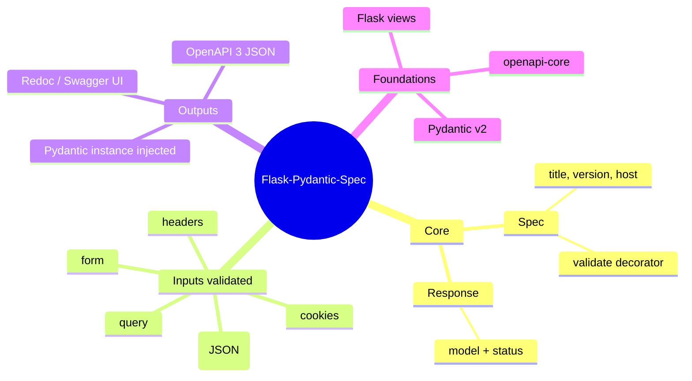
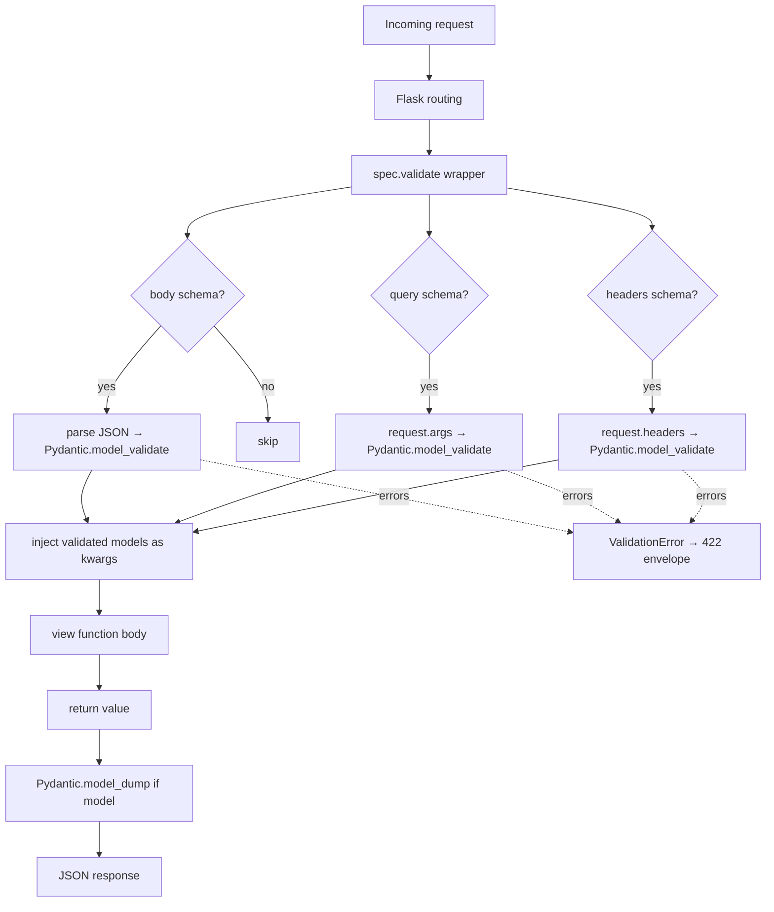
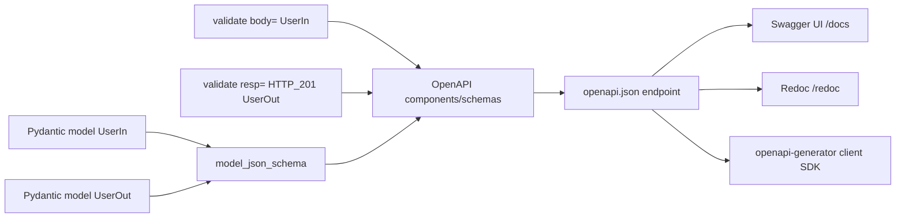
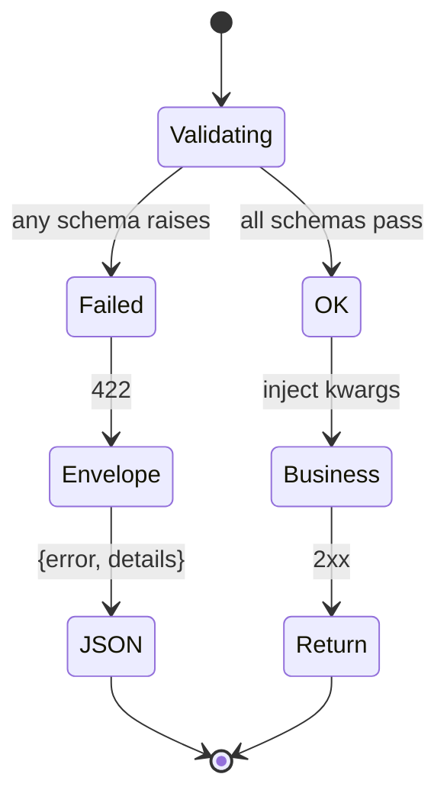
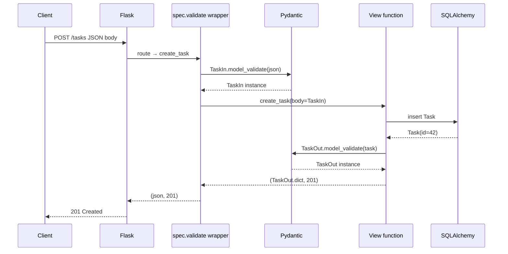

# Flask-Pydantic-Spec

#flask #api #pydantic #openapi #validation #spec #http #serialization

> [!info] Pydantic-powered request validation + OpenAPI for Flask
> `flask-pydantic-spec` is a lightweight extension that brings **Pydantic** validation and **OpenAPI 3** documentation to plain Flask views. Unlike [[Flask-RESTX]] or [[Flask-Smorest]], it does **not** impose a `Resource`/`MethodView` class structure — you decorate ordinary Flask view functions and the extension validates request bodies, query strings, headers, and form data against Pydantic models, then auto-emits an OpenAPI spec.
>
> If you like the FastAPI developer experience (Pydantic + OpenAPI) but want to stay on Flask's familiar function-based views and synchronous ecosystem, this is the bridge.

Think of Flask-Pydantic-Spec as a **decorator-based bouncer for your view functions**. Each view declares its expected inputs as Pydantic models; the decorator parses the incoming request, validates against those models, and injects the validated Python object as a function argument. As a side effect, every declaration also feeds the OpenAPI document — your spec is never out of date because it's generated from the same code that runs in production.

> [!tip] When to pick Flask-Pydantic-Spec
> Choose it when: (1) you're already committed to **Pydantic v2** for data validation, (2) you prefer **function-based views** over class-based `MethodView`/`Resource`, (3) you want **OpenAPI 3** without the framework overhead of [[Flask-Smorest]], (4) you're porting a FastAPI service to Flask and want to keep the schema layer.

---

## 1. Overview & Metaphor

Flask-Pydantic-Spec provides one main object — `Spec` — and a small set of decorators on it.

| Component | Role |
|---|---|
| `Spec(flask_app, ...)` | The extension; holds OpenAPI metadata, response factories, validation config |
| `@spec.validate(...)` | Validates request body, query, headers, cookies, form; injects them; serialises response |
| `Response(model, status_code)` | Binds a Pydantic model + status to a return code for the spec |
| `spec.url` / `spec.spec_url` | Endpoints that serve the UI / raw OpenAPI JSON |



### Pydantic vs marshmallow — which to choose?

| Concern | Pydantic | [[Marshmallow]] |
|---|---|---|
| Built on top of | `dataclasses` + `typing` + custom Rust core (v2) | Pure Python |
| Performance | Very fast (Rust core in v2) | Slower |
| Type annotations | First-class — you write types, validation follows | Schema-class style; types declared as fields |
| Serialization to JSON | `.model_dump_json()` | `Schema().dump()` |
| OpenAPI generation | Built-in via `model_json_schema()` | Via `apispec` plugin |
| Ecosystem | FastAPI, langchain, OpenAI SDKs | Flask-Smorest, Flask-RESTX-style apps |
| Custom validators | `@field_validator`, `@model_validator` | `@validates`, `pre_load/post_load` |
| Migration cost | Lower if you already use type hints | Lower if you have legacy schemas |

> [!note] Pydantic v2 vs v1
> Flask-Pydantic-Spec supports both v1 and v2. v2 is *much* faster and has a saner API (`model_dump`, `model_validate`, `model_json_schema`). If you're starting fresh, install Pydantic 2.x explicitly: `pip install "pydantic>=2"`.

---

## 2. Installation

```bash
pip install flask-pydantic-spec
```

The dependency tree will pull `pydantic`, `openapi-core`, and a small set of helpers. For Swagger UI / Redoc, the extension serves them itself — no extras needed.

For a typical Flask stack:

```bash
pip install flask flask-pydantic-spec "pydantic>=2" flask-sqlalchemy
```

> [!warning] Pydantic 1.x is still installed by some libraries
> Tools like `langchain<0.1` or older `fastapi` versions pin Pydantic 1. If your env resolves to Pydantic 1, several Pydantic 2 idioms in this note (`model_dump`, `model_json_schema`) won't work. Run `python -c "import pydantic; print(pydantic.VERSION)"` to verify.

---

## 3. Configuration

`Spec` is constructed with keyword arguments rather than `app.config`. The most useful ones:

| Argument | Default | Purpose |
|---|---|---|
| `app` | `None` | Flask app (or pass later via `spec.init_app(app)`) |
| `title` | `"Service API Document"` | OpenAPI `info.title` |
| `version` | `"0.1"` | OpenAPI `info.version` |
| `host` | `None` | Override `servers[0].url` |
| `open_api_version` | `"3.0.2"` | OAS version emitted |
| `validation` | `True` | Whether to actually validate requests |
| `validation_error_code` | `422` | Status returned when validation fails |
| `swagger_ui` | `True` | Serve Swagger UI |
| `redoc_ui` | `True` | Serve Redoc UI |
| `swagger_path` | `"/docs"` | Swagger UI URL |
| `redoc_path` | `"/redoc"` | Redoc URL |
| `spec_path` | `"/openapi.json"` | Raw OpenAPI JSON URL |

```python
from flask import Flask
from flask_pydantic_spec import Spec

app = Flask(__name__)
spec = Spec(
    app,
    title="Blog API",
    version="1.0.0",
    open_api_version="3.0.3",
    validation=True,
    validation_error_code=422,
    swagger_ui=True,
    swagger_path="/docs",
    redoc_ui=True,
    redoc_path="/redoc",
    spec_path="/openapi.json",
)
```

> [!tip] Disable UI in production
> Set `swagger_ui=False, redoc_ui=False` in production builds to avoid serving static JS you don't need. The spec JSON itself is harmless and useful for client SDK generation.

---

## 4. Basic Usage

### 4.1 A complete hello-world API

```python
from flask import Flask
from pydantic import BaseModel, Field
from flask_pydantic_spec import Spec, Response

app = Flask(__name__)
spec = Spec(app, title="Greeter API", version="1.0")

class GreetingIn(BaseModel):
    name: str = Field(..., min_length=1, max_length=80, description="Who to greet")
    language: str = Field("en", description="ISO 639-1 code")

class GreetingOut(BaseModel):
    message: str
    language: str

@app.route("/greetings", methods=["POST"])
@spec.validate(body=GreetingIn, resp=Response(HTTP_201=GreetingOut))
def create_greeting():
    """Create a greeting"""
    body: GreetingIn = context.body  # or use request.context
    return GreetingOut(message=f"Hello, {body.name}!", language=body.language).model_dump(), 201
```

Wait — the example above uses a `context` global that's version-dependent. The cleaner pattern in modern `flask-pydantic-spec` uses a `Type`-annotated function signature with `pydantic_model` injection. Let's show the canonical usage:

```python
from flask_pydantic_spec.typing import RequestSpecType, ResponseSpecType

@app.route("/greetings", methods=["POST"])
@spec.validate(body=GreetingIn, resp=Response(HTTP_201=GreetingOut))
def create_greeting(body: GreetingIn, **kwargs):
    return GreetingOut(message=f"Hello, {body.name}!", language=body.language), 201
```

> [!note] Different versions inject validated data differently
> Some versions inject `request.context.body`; others pass `body` as a kwarg. Always consult the version's README. The kwarg-injection style (above) is more readable and IDE-friendly.

Run `python app.py`, open `/docs` for Swagger UI or `/redoc` for Redoc.

### 4.2 Validating query, headers, cookies, form

```python
from typing import Optional
from pydantic import BaseModel, Field

class SearchQuery(BaseModel):
    q: str = Field(..., min_length=1, description="Search term")
    page: int = Field(1, ge=1)
    limit: int = Field(20, ge=1, le=100)

class AuthHeaders(BaseModel):
    authorization: str = Field(..., description="Bearer <token>")

@app.route("/search")
@spec.validate(query=SearchQuery, headers=AuthHeaders)
def search(query: SearchQuery, headers: AuthHeaders, **kwargs):
    return {"q": query.q, "page": query.page, "limit": query.limit,
            "auth": headers.authorization[:12] + "..."}
```

### Mermaid: validation flow



---

## 5. Intermediate Patterns

### 5.1 Multiple response codes

```python
from flask_pydantic_spec import Response
from werkzeug.exceptions import NotFound

class ErrorOut(BaseModel):
    message: str

@app.route("/posts/<int:post_id>")
@spec.validate(
    resp=Response(
        HTTP_200=PostOut,
        HTTP_404=ErrorOut,
        HTTP_500=ErrorOut,
    )
)
def get_post(post_id: int, **kwargs):
    p = Post.query.get(post_id)
    if not p:
        return ErrorOut(message="not found").model_dump(), 404
    return PostOut.model_validate(p).model_dump(), 200
```

### 5.2 Reusing models across endpoints

Pydantic models are just classes — share them across views and even other services:

```python
# schemas/post.py
from pydantic import BaseModel, Field

class PostBase(BaseModel):
    title: str = Field(..., min_length=1, max_length=200)
    body: str

class PostIn(PostBase):
    pass

class PostOut(PostBase):
    id: int
    author_id: int
```

### 5.3 Custom validation with `@field_validator`

```python
from pydantic import BaseModel, field_validator

class UserCreate(BaseModel):
    username: str
    email: str

    @field_validator("email")
    @classmethod
    def must_be_corp_domain(cls, v):
        if not v.endswith("@corp.example.com"):
            raise ValueError("Only corporate emails allowed")
        return v
```

### 5.4 Lists and nested models

```python
class Comment(BaseModel):
    body: str
    author: str

class Post(BaseModel):
    title: str
    body: str
    comments: list[Comment] = []
```

### Mermaid: spec generation flow



---

## 6. Advanced Usage

### 6.1 Custom error envelope

```python
from flask_pydantic_spec import ValidationError

@app.errorhandler(422)
def handle_validation_error(e: ValidationError):
    return {
        "error": "validation_failed",
        "details": e.errors() if hasattr(e, "errors") else str(e),
    }, 422
```

### 6.2 Multiple `Spec` instances in one app

Useful for versioned APIs:

```python
spec_v1 = Spec(app, title="Blog API v1", version="1.0", swagger_path="/v1/docs",
               spec_path="/v1/openapi.json")
spec_v2 = Spec(app, title="Blog API v2", version="2.0", swagger_path="/v2/docs",
               spec_path="/v2/openapi.json")

@app.route("/v1/posts")
@spec_v1.validate(resp=Response(HTTP_200=PostOutV1))
def list_posts_v1(): ...

@app.route("/v2/posts")
@spec_v2.validate(resp=Response(HTTP_200=PostOutV2))
def list_posts_v2(): ...
```

### 6.3 Combining with class-based views

You can decorate `MethodView` methods:

```python
from flask.views import MethodView

class PostResource(MethodView):
    @spec.validate(resp=Response(HTTP_200=PostOut))
    def get(self, post_id: int, **kwargs):
        return PostOut.model_validate(Post.query.get_or_404(post_id)).model_dump()

    @spec.validate(body=PostIn, resp=Response(HTTP_200=PostOut))
    def put(self, post_id: int, body: PostIn, **kwargs):
        ...

app.add_url_rule("/posts/<int:post_id>", view_func=PostResource.as_view("post_detail"))
```

### 6.4 File uploads

```python
class FileUpload(BaseModel):
    description: str | None = None

@app.route("/upload", methods=["POST"])
@spec.validate(form=FileUpload)
def upload(form: FileUpload, **kwargs):
    from flask import request
    f = request.files.get("file")
    if not f:
        return {"message": "file required"}, 400
    f.save(f"/tmp/{f.filename}")
    return {"filename": f.filename, "description": form.description}, 201
```

### Mermaid: error envelope state machine



---

## 7. Common Pitfalls & Troubleshooting

| Symptom | Likely cause | Fix |
|---|---|---|
| `pydantic.error_wrappers.ValidationError` instead of 422 | You're running on Pydantic v1 syntax | Use v2 (`model_validate`, `model_dump`) or pin v1 docs |
| Spec doesn't show request body | `body=` not passed to `@spec.validate` | Pass `body=YourModel` |
| 422 on every request | Wrong `Content-Type` | Set `Content-Type: application/json` on POSTs |
| `TypeError: unexpected keyword argument 'body'` | Decorator version mismatch — old version uses `request.context` | Read README for your installed version |
| OpenAPI spec missing schema fields | Pydantic field has no type annotation | Always annotate: `name: str = Field(...)` not `name = Field(...)` |
| `model_validate` not found | Pydantic v1 installed | `pip install "pydantic>=2"` and check imports |
| Swagger UI loads but spec is empty | Decorator `@spec.validate` not on view | Make sure it's between `@app.route` and the function |
| Duplicate operation IDs in spec | Same function name registered on multiple routes | Rename or pass `tags=`, `operation_id=` to `@spec.validate` |
| `422` body leaks internal details | Default error envelope is verbose | Register a `@app.errorhandler(422)` (see §6.1) |

> [!danger] Pydantic v1 vs v2 in production
> A common silent failure: your CI installs Pydantic v1 because some other dep pinned it. Code that worked locally (with v2) starts failing in staging with `AttributeError: 'BaseModel' object has no attribute 'model_dump'`. Always pin `pydantic>=2,<3` in your `requirements.txt` and add a CI guard:
> ```python
> import pydantic
> assert pydantic.VERSION.startswith("2."), "Pydantic v2 required"
> ```

### Mermaid: troubleshooting decision tree

```mermaid
flowchart TD
    S[Symptom] --> T{Type?}
    T -- 422 --> A[Check Pydantic version,<br/>then schema vs payload]
    T -- 500 --> B[Check decorator order:<br/>route ABOVE validate]
    T -- empty spec --> C[Did you pass body/resp to validate?]
    T -- wrong fields in UI --> D[Annotate every field with a type]
    A --> R1[Pin pydantic>=2]
    B --> R2[Reorder decorators]
    C --> R3[Add body=, resp= kwargs]
    D --> R4[Use Field(...) with type hint]
```

---

## 8. Best Practices

> [!tip] Twelve tips for healthy Flask-Pydantic-Spec APIs
> 1. **Pin `pydantic>=2,<3`** explicitly — version drift is the #1 source of bugs.
> 2. **Always annotate field types** — `name: str = Field(...)`, never `name = Field(...)`.
> 3. **Use `Field(..., description="…")`** so the spec is human-readable.
> 4. **Split `*In` and `*Out` models** — input strict, output may include server-generated fields.
> 5. **Document all response codes** in `Response(HTTP_200=..., HTTP_404=...)`.
> 6. **Validate at the boundary** — let the decorator be the only validator; services trust their inputs.
> 7. **Don't return raw dicts** — return Pydantic models and `.model_dump()` for symmetry.
> 8. **Register a 422 handler** to control the error envelope once globally.
> 9. **Hide the UI in production** via `swagger_ui=False, redoc_ui=False`.
> 10. **Generate client SDKs** from `/openapi.json` with `openapi-generator-cli`.
> 11. **Test the spec itself** — `assert "UserIn" in spec.spec["components"]["schemas"]`.
> 12. **Don't put business logic in view functions** — call services; views are HTTP glue.

---

## 9. Integration with Other Extensions

### With [[Flask-SQLAlchemy]]

Bridge ORM models to Pydantic manually (or use `pydantic-sqlalchemy`):

```python
from pydantic import BaseModel
from models import User  # SQLAlchemy model

class UserOut(BaseModel):
    id: int
    username: str
    email: str

    @classmethod
    def from_orm(cls, u: User) -> "UserOut":
        return cls(id=u.id, username=u.username, email=u.email)
```

> [!tip] Pydantic v2 dropped `from_orm`; use `model_validate`
> In Pydantic 2, configure `model_config = ConfigDict(from_attributes=True)` on the model and call `UserOut.model_validate(user_orm_instance)`.

### With [[Flask-JWT-Extended]]

```python
from flask_jwt_extended import jwt_required, get_jwt_identity

@app.route("/me")
@spec.validate(headers=AuthHeaders, resp=Response(HTTP_200=UserOut))
@jwt_required()
def me(headers: AuthHeaders, **kwargs):
    return UserOut.from_orm(User.query.filter_by(username=get_jwt_identity()).first()).model_dump()
```

### With [[Marshmallow]]

You generally pick one — Pydantic or marshmallow. If you must mix (e.g. legacy schemas + new Pydantic models), validate with marshmallow in the service layer and use Pydantic purely for the HTTP boundary.

### With [[Flask-Limiter]]

```python
from flask_limiter import Limiter
limiter = Limiter(app)

@app.route("/expensive")
@limiter.limit("10/minute")
@spec.validate(resp=Response(HTTP_200=ResultOut))
def expensive(): ...
```

---

## 10. Real-World Example — Tasks API

```python
# app.py — pip install flask flask-pydantic-spec "pydantic>=2" flask-sqlalchemy
import os
from typing import Optional
from flask import Flask, request
from pydantic import BaseModel, Field, ConfigDict
from flask_pydantic_spec import Spec, Response
from flask_sqlalchemy import SQLAlchemy
from werkzeug.exceptions import NotFound

app = Flask(__name__)
app.config["SQLALCHEMY_DATABASE_URI"] = "sqlite:///tasks.db"
app.config["SQLALCHEMY_TRACK_MODIFICATIONS"] = False
db = SQLAlchemy(app)
spec = Spec(app, title="Tasks API", version="1.0.0", open_api_version="3.0.3")

# ----- Models ----------------------------------------------------------
class Task(db.Model):
    id = db.Column(db.Integer, primary_key=True)
    title = db.Column(db.String(200), nullable=False)
    done = db.Column(db.Boolean, default=False)
    assignee = db.Column(db.String(80))

with app.app_context():
    db.create_all()

# ----- Pydantic schemas ------------------------------------------------
class TaskIn(BaseModel):
    title: str = Field(..., min_length=1, max_length=200)
    done: bool = False
    assignee: Optional[str] = Field(None, max_length=80)

class TaskOut(TaskIn):
    id: int
    model_config = ConfigDict(from_attributes=True)

class ErrorOut(BaseModel):
    message: str

# ----- Views -----------------------------------------------------------
@app.route("/tasks", methods=["GET"])
@spec.validate(resp=Response(HTTP_200=list[TaskOut]))
def list_tasks():
    return [TaskOut.model_validate(t).model_dump() for t in Task.query.all()], 200

@app.route("/tasks", methods=["POST"])
@spec.validate(body=TaskIn, resp=Response(HTTP_201=TaskOut, HTTP_422=ErrorOut))
def create_task(body: TaskIn, **kwargs):
    t = Task(title=body.title, done=body.done, assignee=body.assignee)
    db.session.add(t); db.session.commit()
    return TaskOut.model_validate(t).model_dump(), 201

@app.route("/tasks/<int:task_id>", methods=["GET"])
@spec.validate(resp=Response(HTTP_200=TaskOut, HTTP_404=ErrorOut))
def get_task(task_id: int):
    t = Task.query.get_or_404(task_id)
    return TaskOut.model_validate(t).model_dump(), 200

@app.route("/tasks/<int:task_id>", methods=["PUT"])
@spec.validate(body=TaskIn, resp=Response(HTTP_200=TaskOut, HTTP_404=ErrorOut))
def update_task(task_id: int, body: TaskIn, **kwargs):
    t = Task.query.get_or_404(task_id)
    t.title = body.title
    t.done = body.done
    t.assignee = body.assignee
    db.session.commit()
    return TaskOut.model_validate(t).model_dump(), 200

@app.route("/tasks/<int:task_id>", methods=["DELETE"])
@spec.validate(resp=Response(HTTP_204=None, HTTP_404=ErrorOut))
def delete_task(task_id: int):
    t = Task.query.get_or_404(task_id)
    db.session.delete(t); db.session.commit()
    return "", 204

@app.errorhandler(404)
def not_found(e):
    return ErrorOut(message="not found").model_dump(), 404

if __name__ == "__main__":
    app.run(debug=True)
```

### Mermaid: end-to-end request lifecycle



---

## 11. References

- **PyPI**: <https://pypi.org/project/flask-pydantic-spec/>
- **Docs / GitHub**: <https://github.com/luolingchun/flask_pydantic_spec>
- **Pydantic docs**: <https://docs.pydantic.dev/>
- **Pydantic v2 migration**: <https://docs.pydantic.dev/latest/migration/>
- **OpenAPI spec**: <https://spec.openapis.org/oas/v3.1.0>
- **openapi-generator**: <https://openapi-generator.tech/>
- Related notes in this vault: [[Marshmallow]] · [[Flask-RESTful]] · [[Flask-RESTX]] · [[Flask-Smorest]] · [[Flask-Rebar]] · [[Flask-SQLAlchemy]] · [[Flask-JWT-Extended]]
