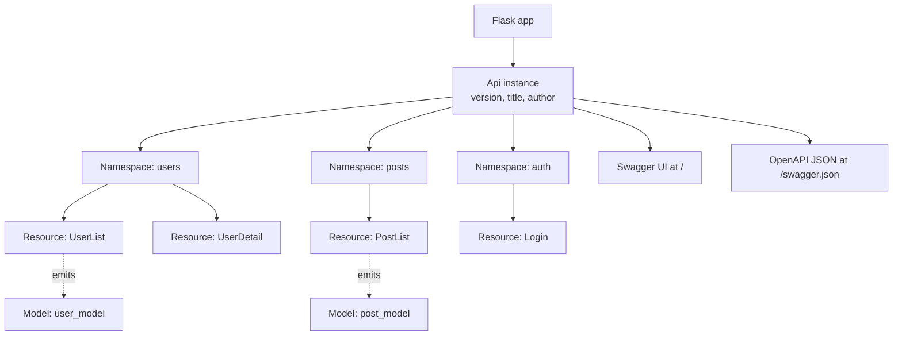
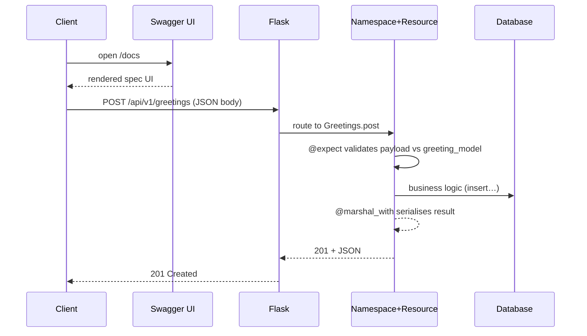
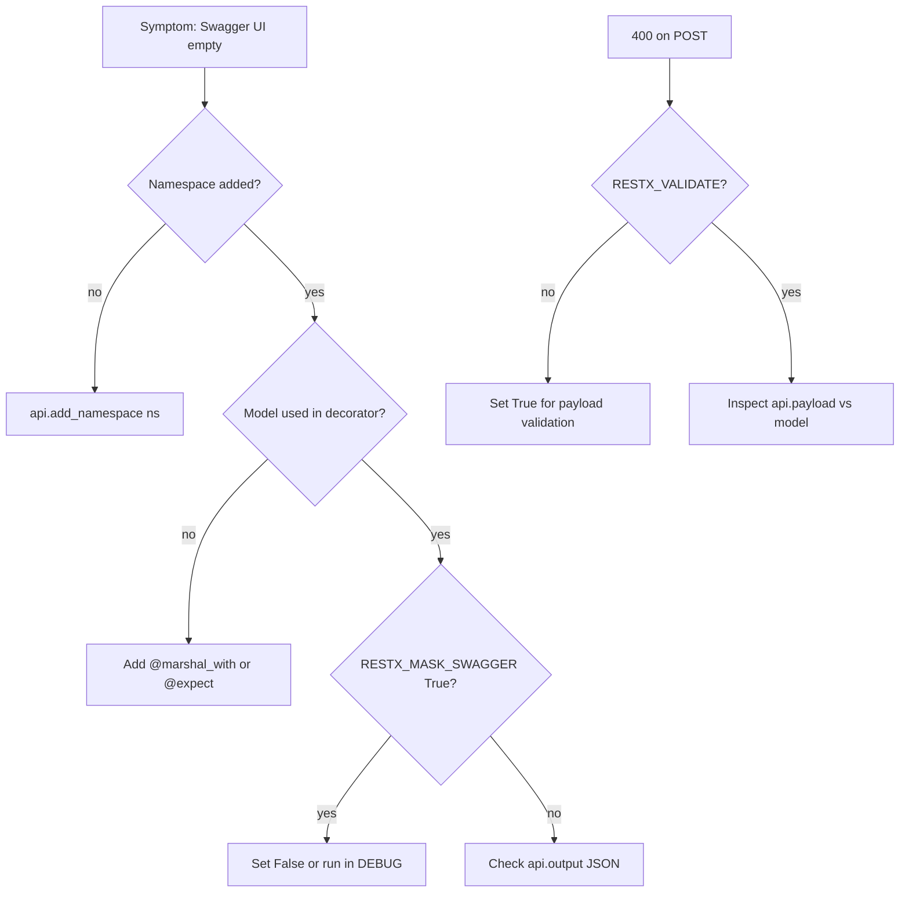
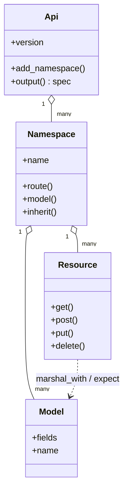

# Flask-RESTX

#flask #api #rest #restx #swagger #openapi #http #serialization

> [!info] The community fork of Flask-RESTPlus — Swagger/OpenAPI baked in
> Flask-RESTX is a community-driven fork of Flask-RESTPlus, which itself extended [[Flask-RESTful]] with first-class Swagger/OpenAPI support. After Flask-RESTPlus went into maintenance, Flask-RESTX took over and is now the actively maintained successor. It keeps the familiar `Resource` class pattern from Flask-RESTful while adding `Namespace`, `Api`, `@api.expect`, `@api.marshal_with`, `@api.doc`, and an auto-generated, interactive **Swagger UI** at `/` (or any path you choose).
>
> If you've ever wanted Flask-RESTful *plus* a "free" OpenAPI spec without bolting on [[Marshmallow]]+apispec manually, Flask-RESTX is the obvious choice.

Think of Flask-RESTX as **Flask-RESTful with a documentation engine welded to the side**. Every decorator you write (`@api.doc`, `@api.expect`, `@api.marshal_with`) does double duty: it validates the request/response at runtime *and* feeds the OpenAPI schema that powers the Swagger UI. You write the contract once; Flask-RESTX enforces it on the wire and renders it for humans.

> [!tip] Why pick Flask-RESTX over Flask-RESTful?
> Three reasons: (1) **Auto Swagger UI** without extra dependencies, (2) **Namespaces** for organising large APIs the way blueprints organise Flask apps, (3) **Active maintenance** — Flask-RESTful is in security-fix-only mode.

---

## 1. Overview & Metaphor

Flask-RESTX layers four abstractions on top of plain Flask:

| Abstraction | Role | Flask-RESTful equivalent |
|---|---|---|
| `Api` | Top-level container; owns Swagger config & error handlers | `Api` |
| `Namespace` | A grouped, blueprint-like sub-API (e.g. `users_ns`, `posts_ns`) | (none — you used raw `Blueprint`) |
| `Resource` | A class whose methods are HTTP verbs | `Resource` (same) |
| `Model` + `fields` | Schema definitions used both for marshalling and OpenAPI | `fields` only |

The mental model: an `Api` is a **book**, each `Namespace` is a **chapter**, each `Resource` is a **page**, and each `Model` is the **form** that data on that page must fit. The Swagger UI is the table of contents the book writes for itself.



### Flask-RESTX vs Flask-RESTful vs Flask-Smorest vs FastAPI

| Feature | [[Flask-RESTful]] | **Flask-RESTX** | [[Flask-Smorest]] | FastAPI |
|---|---|---|---|---|
| Maintenance status | Security-only | Active | Active | Very active |
| Built-in Swagger UI | ❌ | ✅ `/` | ✅ via `flask-smorest[swagger-ui]` | ✅ `/docs` |
| Schema engine | `fields` (own) | `fields`/`Model` (own) | [[Marshmallow]] | Pydantic |
| Async support | ❌ | ❌ | ❌ | ✅ native |
| OpenAPI 3.x | ❌ | ✅ | ✅ | ✅ |
| Class-based resources | ✅ | ✅ | ✅ (`MethodView`) | ❌ (function-based by default) |
| Learning curve | Low | Low-Medium | Medium | Medium |
| Best fit | Legacy | Swagger-first Flask APIs | Marshmallow shops | Async microservices |

> [!note] Flask-RESTX and OpenAPI 3
> Flask-RESTX ships both Swagger 2.0 (default) and experimental OpenAPI 3 support. For OpenAPI 3, set `OPENAPI_URL_PREFIX` and `app.config["RESTX_MASK_SWAGGER"] = False`. Many production apps still use the 2.0 layout because tooling support is broader.

---

## 2. Installation

```bash
pip install flask-restx[swagger]
```

Or, for a typical project stack:

```bash
pip install flask flask-restx flask-sqlalchemy flask-jwt-extended
```

> [!warning] Do not install both `flask-restful` and `flask-restx` in the same venv unless you know what you're doing
> They register overlapping names (`Resource`, `Api`, `fields`). The `import` order will decide which one wins, and you'll spend an hour debugging `AttributeError`. Pick one and uninstall the other.

Verify the install:

```bash
python -c "import flask_restx; print(flask_restx.__version__)"
```

---

## 3. Configuration

Flask-RESTX reads config from the standard `app.config` dictionary. The important keys:

| Config key | Default | Purpose |
|---|---|---|
| `RESTX_MASK_SWAGGER` | `True` | Mask Swagger UI when not in DEBUG |
| `RESTX_VALIDATE` | `False` | Validate payloads against `@api.expect` models |
| `RESTX_ERROR_404_HELP` | `True` | Append helpful message to 404 errors |
| `RESTX_JSON` | `None` | Custom JSON encoder function |
| `RESTX_INCLUDE_ALL_MODELS` | `False` | Include unused models in spec |
| `RESTX_SWAGGER_UI_DOC_EXPANSION` | `"none"` | `none`/`list`/`full` default expansion |
| `RESTX_SWAGGER_UI_OPERATION_ID` | `False` | Generate `operationId` from function name |
| `RESTX_SWRAGGER_UI_REQUEST_DURATION` | `False` | Show request duration in UI |
| `SWAGGER_UI_OAUTH_CLIENT_ID` | `""` | OAuth client id for "Authorize" button |

```python
from flask import Flask
from flask_restx import Api

app = Flask(__name__)
app.config["RESTX_VALIDATE"] = True
app.config["RESTX_MASK_SWAGGER"] = False  # show UI even in prod (or use auth)
app.config["RESTX_ERROR_404_HELP"] = False  # silence the verbose 404 message

api = Api(
    app,
    version="1.0",
    title="Blog API",
    description="A sample blog API demonstrating Flask-RESTX",
    author="Your Name",
    doc="/docs/",   # Swagger UI mounted here instead of /
    prefix="/api/v1",
)
```

> [!tip] Hide Swagger UI in production
> Either set `doc=False` when constructing `Api`, or guard it:
> ```python
> api = Api(app, doc=app.debug)  # UI only when DEBUG=True
> ```
> Exposing the spec is rarely a security risk, but it does leak internal structure.

---

## 4. Basic Usage

### 4.1 A complete hello-world API

```python
from flask import Flask
from flask_restx import Api, Resource, fields

app = Flask(__name__)
api = Api(app, version="1.0", title="Greeter API", doc="/docs")

ns = api.namespace("greetings", description="Greeting operations")

greeting_model = api.model("Greeting", {
    "message": fields.String(required=True, description="The greeting text"),
    "language": fields.String(default="en"),
})

@ns.route("/")
class Greetings(Resource):
    @ns.doc("list_greetings")
    @ns.marshal_list_with(greeting_model)
    def get(self):
        """Return all greetings"""
        return [{"message": "Hello, world!", "language": "en"}]

    @ns.doc("create_greeting")
    @ns.expect(greeting_model, validate=True)
    @ns.marshal_with(greeting_model, code=201)
    def post(self):
        """Create a new greeting"""
        return api.payload, 201

if __name__ == "__main__":
    app.run(debug=True)
```

Run it, open `http://localhost:5000/docs`, and you'll see a fully interactive Swagger UI generated entirely from the decorators.

### 4.2 The `Model`/`fields` vocabulary

Flask-RESTX ships its own field types (mirroring Flask-RESTful but extended for OpenAPI metadata):

```python
user_model = api.model("User", {
    "id":            fields.Integer(readOnly=True, description="User ID"),
    "username":      fields.String(required=True, min_length=3, max_length=80),
    "email":         fields.String(description="Primary email"),
    "is_active":     fields.Boolean(default=True),
    "created_at":    fields.DateTime(dt_format="iso8601"),
    "roles":         fields.List(fields.String, default=[]),
    "profile":       fields.Nested(profile_model, allow_null=True),
})
```

> [!note] Flask-RESTX `Model` ≠ marshmallow `Schema`
> They look similar but serve different roles. Flask-RESTX `Model` is OpenAPI-aware and is the canonical source for the Swagger spec. [[Marshmallow]] `Schema` is more powerful for validation (custom validators, `load_from`, `Method` fields). You can use `flask_restx.swagger.model` to mirror a marshmallow schema, but most teams pick one and stick with it.

### Mermaid: API request flow



---

## 5. Intermediate Patterns

### 5.1 Namespaces as "API blueprints"

Namespaces let you split a large API across files just like Flask blueprints. Each `Namespace` becomes a tag in the Swagger UI, which keeps the documentation navigable.

```python
# app/api/users.py
from flask_restx import Namespace, Resource, fields

ns = ns = Namespace("users", description="User operations")

user_model = ns.model("User", {
    "id":       fields.Integer(readOnly=True),
    "username": fields.String(required=True),
})

@ns.route("/")
class UserList(Resource):
    @ns.doc("list_users")
    @ns.marshal_list_with(user_model)
    def get(self):
        return [{"id": 1, "username": "alice"}]

@ns.route("/<int:user_id>")
@ns.param("user_id", "The user identifier")
class UserDetail(Resource):
    @ns.doc("get_user")
    @ns.marshal_with(user_model)
    def get(self, user_id):
        return {"id": user_id, "username": "alice"}
```

```python
# app/__init__.py
from flask import Flask
from flask_restx import Api
from app.api.users import ns as users_ns

def create_app():
    app = Flask(__name__)
    api = Api(app, version="1.0", title="Multi-NS API", doc="/docs")
    api.add_namespace(users_ns, path="/api/v1/users")
    return app
```

### 5.2 Request parsing with `reqparse` (legacy) vs `@api.expect`

Flask-RESTX inherits `reqparse` from Flask-RESTful but the modern idiom is to use **models** with `@api.expect(..., validate=True)`:

```python
create_user_model = api.model("CreateUser", {
    "username": fields.String(required=True, min_length=3),
    "email":    fields.String(required=True, pattern=r"^\S+@\S+$"),
    "password": fields.String(required=True, min_length=8),
})

@ns.route("/")
class UserList(Resource):
    @ns.expect(create_user_model, validate=True)
    @ns.marshal_with(user_model, code=201)
    def post(self):
        return api.payload, 201
```

> [!warning] `reqparse` is deprecated in both Flask-RESTful and Flask-RESTX
> Use it only for query-string parameters where a `Model` doesn't fit naturally. Even then, `@ns.doc(params={...})` plus manual `request.args.get()` is often cleaner.

### 5.3 Inheritance and `@api.inherit`

When you have multiple resources sharing a base shape, `inherit` reduces duplication:

```python
base_model = api.model("Base", {
    "id":         fields.Integer(readOnly=True),
    "created_at": fields.DateTime,
})

post_model = api.inherit("Post", base_model, {
    "title": fields.String,
    "body":  fields.String,
})

comment_model = api.inherit("Comment", base_model, {
    "body":    fields.String,
    "post_id": fields.Integer,
})
```

The OpenAPI output will reference `Post` as `allOf: [Base, {...}]`.

### Mermaid: Swagger generation flow

```mermaid
flowchart LR
    D1[@ns.doc] --> Spec
    D2[@ns.expect] --> Spec
    D3[@ns.marshal_with] --> Spec
    D4[@ns.param] --> Spec
    M1[api.model User] --> Spec
    M2[api.inherit Post] --> Spec
    Spec[Api.__schema__] --> JSON[swagger.json]
    JSON --> UI[Swagger UI HTML]
    Spec --> VAL[Runtime validation<br/>when RESTX_VALIDATE=True]
```

---

## 6. Advanced Usage

### 6.1 Custom error handlers

Flask-RESTX intercepts exceptions and renders them in a uniform envelope. Override the defaults:

```python
from flask_restx import Api

api = Api(app)

@api.errorhandler(ValueError)
def handle_value(error):
    """Render ValueError as 400 instead of 500"""
    return {"message": str(error), "code": 400}, 400

@api.errorhandler
def handle_default(error):
    """Catch-all handler"""
    return {"message": "An unexpected error occurred"}, 500
```

### 6.2 Decorators per resource method

Use `method_decorators` (dict or list) to apply auth, caching, or rate-limiting:

```python
from flask_jwt_extended import jwt_required

@ns.route("/me")
class Profile(Resource):
    method_decorators = {"get": [jwt_required()], "delete": [jwt_required(), require_admin]}

    def get(self):
        ...

    def delete(self):
        ...
```

### 6.3 Pagination envelope

A common pattern: a generic `pagination_model` reused across endpoints.

```python
pagination_model = api.model("Page", {
    "page":   fields.Integer,
    "pages":  fields.Integer,
    "per_page": fields.Integer,
    "total":  fields.Integer,
    "items":  fields.List(fields.Raw),
})

def paginated(item_model):
    return api.inherit("PageOf" + item_model.name, pagination_model, {
        "items": fields.List(fields.Nested(item_model)),
    })

@ns.route("/")
class PostList(Resource):
    @ns.marshal_with(paginated(post_model))
    def get(self):
        page = Post.query.paginate(page=int(request.args.get("page", 1)))
        return {
            "page": page.page, "pages": page.pages,
            "per_page": page.per_page, "total": page.total,
            "items": page.items,
        }
```

### 6.4 File uploads and form data

```python
upload_parser = api.parser()
upload_parser.add_argument("file", location="files", type="FileStorage", required=True)
upload_parser.add_argument("description", location="form")

@ns.route("/upload")
@ns.expect(upload_parser)
class Upload(Resource):
    def post(self):
        args = upload_parser.parse_args()
        f = args["file"]
        f.save(f"/tmp/{f.filename}")
        return {"filename": f.filename}, 201
```

### 6.5 OpenAPI 3 (experimental)

```python
app.config["RESTX_VALIDATE"] = True
api = Api(app, version="3.0.0")
# Generate OpenAPI 3 spec:
# api.output() now emits components/schemas rather than definitions
```

> [!danger] OpenAPI 3 support in Flask-RESTX is incomplete
> As of late 2024, several features (`allOf` inheritance edge cases, nullable `Nested`, format annotations) render imperfectly. If your downstream tooling strictly requires OpenAPI 3, prefer [[Flask-Smorest]] or [[Flask-Pydantic-Spec]].

---

## 7. Common Pitfalls & Troubleshooting

### Mermaid: troubleshooting flowchart



| Symptom | Likely cause | Fix |
|---|---|---|
| Swagger UI shows blank page at `/` | `doc` defaults to `/` but you mounted another blueprint there, or `RESTX_MASK_SWAGGER=True` and not in DEBUG | Pass `doc="/docs"` or set `RESTX_MASK_SWAGGER=False` |
| `@api.expect` doesn't reject bad payloads | `RESTX_VALIDATE=False` (default) | Set `RESTX_VALIDATE=True` or pass `validate=True` per call |
| `marshal_with` returns `None` for nullable field | Field has no `default` and value is `None` | `fields.String(default=None)` |
| `KeyError: 'name'` on `api.model` | You forgot to add the model to a namespace before referencing it | Pass `model=` to `@ns.marshal_with` not `@api.marshal_with` after creating with `ns.model` |
| Operation not grouped in UI | Used `@api.doc` instead of `@ns.doc` | Namespaces carry tags automatically; use the namespace's decorators |
| `ImportError: cannot import name 'Api'` | `flask-restful` and `flask-restx` both installed | Uninstall one |
| Trailing-slash 404s | Flask-RESTX is strict by default | `app.url_map.strict_slashes = False` |
| CORS errors from Swagger UI "Try it out" | You forgot [[Flask-CORS]] or didn't allow the UI origin | `CORS(app, resources={r"/api/*": {"origins": "*"}})` |
| `operationId` collision in spec | Two resources with same method name | `@ns.doc(operationId="unique_name")` or set `RESTX_SWAGGER_UI_OPERATION_ID=True` |

> [!danger] `api.payload` is `None` when Content-Type isn't JSON
> Flask-RESTX populates `api.payload` from `request.get_json()`. If the client posts `application/x-www-form-urlencoded` (a common mistake with curl), `api.payload` is `None` and `@api.expect(validate=True)` will *silently pass* because there's nothing to validate. Always set the header: `curl -H "Content-Type: application/json" ...`.

---

## 8. Best Practices

> [!tip] Twelve tips for healthy Flask-RESTX APIs
> 1. **One namespace per domain** — `users_ns`, `posts_ns`, `auth_ns`. Keeps the UI tidy.
> 2. **Validate by default** — `app.config["RESTX_VALIDATE"] = True` so `@expect` actually validates.
> 3. **Document every model field** with `description=`; Swagger UI uses them.
> 4. **`@ns.doc(security="Bearer")`** on protected routes — adds the lock icon in the UI.
> 5. **Return `(payload, status_code, headers)` tuples** explicitly; don't rely on the default 200.
> 6. **Hide the UI in production** unless you've authenticated it.
> 7. **Pin the version** — Flask-RESTX has shipped breaking changes between minor releases.
> 8. **Avoid `reqparse`** for new code; use models.
> 9. **Use `api.inherit`** for shared model shapes (audit fields, pagination envelopes).
> 10. **Add `operationId`** explicitly if you generate client SDKs.
> 11. **Unit-test the spec** — assert `"User" in api.__schema__["definitions"]` so silent regressions surface.
> 12. **Don't put business logic in `Resource` methods** — call services; resources are the HTTP layer.

---

## 9. Integration with Other Extensions

### With [[Flask-SQLAlchemy]]

Wrap models in Flask-RESTX models for serialisation:

```python
from flask_sqlalchemy import SQLAlchemy
db = SQLAlchemy()

class User(db.Model):
    id = db.Column(db.Integer, primary_key=True)
    username = db.Column(db.String(80), unique=True, nullable=False)

user_model = api.model("User", {"id": fields.Integer, "username": fields.String})

@ns.route("/<int:id>")
class UserDetail(Resource):
    @ns.marshal_with(user_model)
    def get(self, id):
        return User.query.get_or_404(id)
```

> [!tip] Use [[Marshmallow]] for nested validation, Flask-RESTX for the wire format
> Many teams use `marshmallow-sqlalchemy` to auto-generate a `Schema` from the model, then hand-write the Flask-RESTX `Model` for the response. They get strict input validation and a clean OpenAPI spec.

### With [[Flask-JWT-Extended]]

```python
authorizations = {"Bearer": {"type": "apiKey", "in": "header", "name": "Authorization"}}
api = Api(app, authorizations=authorizations, security="Bearer")

@ns.route("/me")
class Me(Resource):
    @ns.doc(security="Bearer")
    @ns.marshal_with(user_model)
    @jwt_required()
    def get(self):
        from flask_jwt_extended import get_jwt_identity
        return User.query.filter_by(username=get_jwt_identity()).first()
```

### With [[Flask-Limiter]]

Apply rate-limit decorators alongside `@ns.doc`:

```python
from flask_limiter import Limiter
from flask_limiter.util import get_remote_address
limiter = Limiter(get_remote_address, app=app)

@ns.route("/")
class UserList(Resource):
    method_decorators = {"post": [limiter.limit("10/hour")]}

    def post(self):
        ...
```

### With [[Flask-CORS]]

```python
from flask_cors import CORS
CORS(app, resources={r"/api/*": {"origins": "*"}})
```

---

## 10. Real-World Example — Tasks API with Namespaces

A complete, runnable single-file API:

```python
# app.py — pip install flask flask-restx flask-sqlalchemy flask-jwt-extended
import os
from flask import Flask, request
from flask_restx import Api, Resource, Namespace, fields, marshal_with
from flask_sqlalchemy import SQLAlchemy
from flask_jwt_extended import (JWTManager, jwt_required, create_access_token,
                                get_jwt_identity)

app = Flask(__name__)
app.config["SQLALCHEMY_DATABASE_URI"] = "sqlite:///tasks.db"
app.config["SQLALCHEMY_TRACK_MODIFICATIONS"] = False
app.config["JWT_SECRET_KEY"] = os.environ.get("JWT_SECRET", "dev")
app.config["RESTX_VALIDATE"] = True

db = SQLAlchemy(app)
jwt = JWTManager(app)

api = Api(app, version="1.0", title="Tasks API", doc="/docs",
          authorizations={"Bearer": {"type": "apiKey", "in": "header",
                                      "name": "Authorization"}},
          security="Bearer")

# ----- Models ----------------------------------------------------------
class User(db.Model):
    id = db.Column(db.Integer, primary_key=True)
    username = db.Column(db.String(80), unique=True, nullable=False)
    password = db.Column(db.String(255), nullable=False)
    tasks = db.relationship("Task", backref="owner", lazy=True)

class Task(db.Model):
    id = db.Column(db.Integer, primary_key=True)
    title = db.Column(db.String(200), nullable=False)
    done = db.Column(db.Boolean, default=False)
    owner_id = db.Column(db.Integer, db.ForeignKey("user.id"))

with app.app_context():
    db.create_all()

# ----- Namespaces ------------------------------------------------------
auth_ns = Namespace("auth", description="Authentication")
tasks_ns = Namespace("tasks", description="Task operations")
api.add_namespace(auth_ns, path="/api/v1/auth")
api.add_namespace(tasks_ns, path="/api/v1/tasks")

# ----- Schemas ---------------------------------------------------------
login_model = auth_ns.model("Login", {
    "username": fields.String(required=True),
    "password": fields.String(required=True),
})
token_model = auth_ns.model("Token", {"access_token": fields.String})

task_input = tasks_ns.model("TaskInput", {
    "title": fields.String(required=True, min_length=1, max_length=200),
    "done":  fields.Boolean(default=False),
})
task_model = tasks_ns.inherit("Task", task_input, {
    "id":       fields.Integer(readOnly=True),
    "owner_id": fields.Integer,
})
page_model = tasks_ns.model("Page", {
    "page":  fields.Integer,
    "total": fields.Integer,
    "items": fields.List(fields.Nested(task_model)),
})

# ----- Auth endpoints --------------------------------------------------
@auth_ns.route("/login")
class Login(Resource):
    @auth_ns.expect(login_model)
    @auth_ns.marshal_with(token_model)
    def post(self):
        u = User.query.filter_by(username=api.payload["username"]).first()
        if not u or u.password != api.payload["password"]:
            api.abort(401, "bad credentials")
        return {"access_token": create_access_token(identity=u.username)}

# ----- Task endpoints --------------------------------------------------
@tasks_ns.route("/")
class TaskList(Resource):
    @tasks_ns.doc("list_tasks", security="Bearer")
    @tasks_ns.marshal_with(page_model)
    @jwt_required()
    def get(self):
        q = Task.query.filter_by(owner=User.query.filter_by(
            username=get_jwt_identity()).first())
        page = q.paginate(page=int(request.args.get("page", 1)), per_page=20)
        return {"page": page.page, "total": page.total, "items": page.items}

    @tasks_ns.doc("create_task", security="Bearer")
    @tasks_ns.expect(task_input)
    @tasks_ns.marshal_with(task_model, code=201)
    @jwt_required()
    def post(self):
        u = User.query.filter_by(username=get_jwt_identity()).first()
        t = Task(title=api.payload["title"],
                 done=api.payload.get("done", False),
                 owner=u)
        db.session.add(t); db.session.commit()
        return t, 201

@tasks_ns.route("/<int:task_id>")
@tasks_ns.param("task_id", "Task ID")
class TaskDetail(Resource):
    @tasks_ns.doc("get_task", security="Bearer")
    @tasks_ns.marshal_with(task_model)
    @jwt_required()
    def get(self, task_id):
        return Task.query.get_or_404(task_id)

    @tasks_ns.doc("update_task", security="Bearer")
    @tasks_ns.expect(task_input)
    @tasks_ns.marshal_with(task_model)
    @jwt_required()
    def put(self, task_id):
        t = Task.query.get_or_404(task_id)
        t.title = api.payload["title"]
        t.done = api.payload.get("done", t.done)
        db.session.commit()
        return t

    @tasks_ns.doc("delete_task", security="Bearer")
    @jwt_required()
    def delete(self, task_id):
        t = Task.query.get_or_404(task_id)
        db.session.delete(t); db.session.commit()
        return "", 204

if __name__ == "__main__":
    app.run(debug=True)
```

Run `python app.py`, open `/docs`, and you have an interactive, JWT-secured Tasks API whose spec is generated entirely from decorators.

### Mermaid: namespace organisation



---

## 11. References

- **PyPI**: <https://pypi.org/project/flask-restx/>
- **Docs**: <https://flask-restx.readthedocs.io/>
- **GitHub**: <https://github.com/python-restx/flask-restx>
- **Migration from Flask-RESTPlus**: <https://flask-restx.readthedocs.io/en/latest/migration.html>
- **OpenAPI spec**: <https://spec.openapis.org/oas/v3.1.0>
- Related notes in this vault: [[Flask-RESTful]] · [[Marshmallow]] · [[Flask-Smorest]] · [[Flask-Pydantic-Spec]] · [[Flask-JWT-Extended]] · [[Flask-SQLAlchemy]] · [[Flask-CORS]] · [[Flask-Limiter]]
