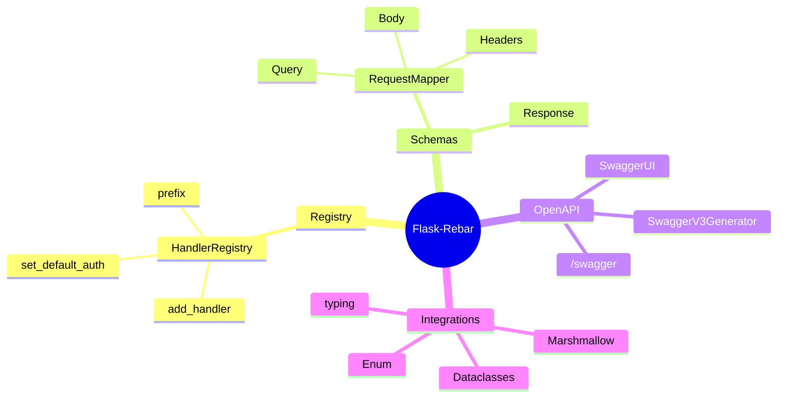
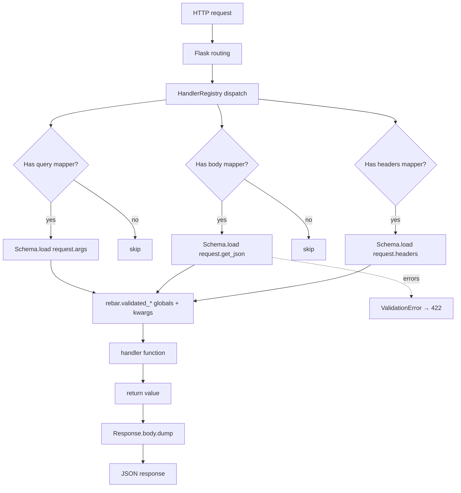
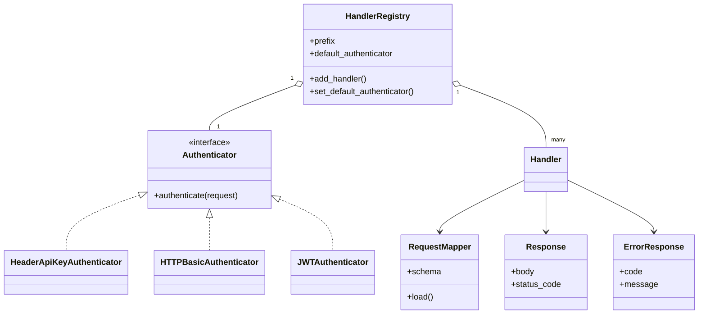
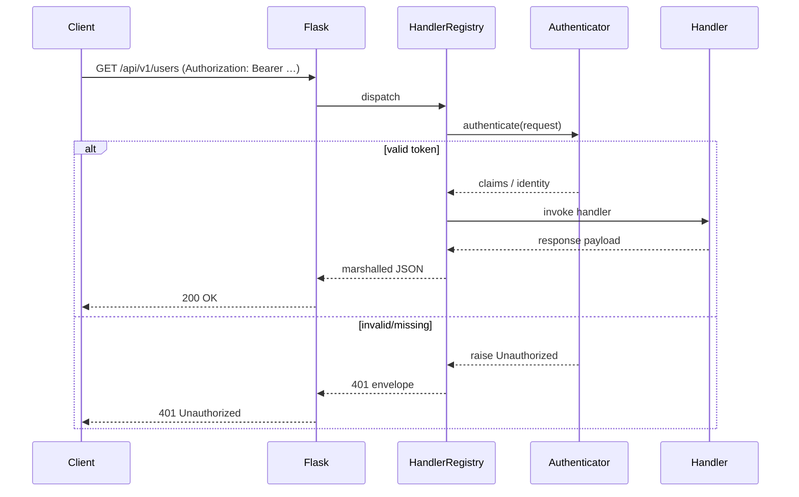
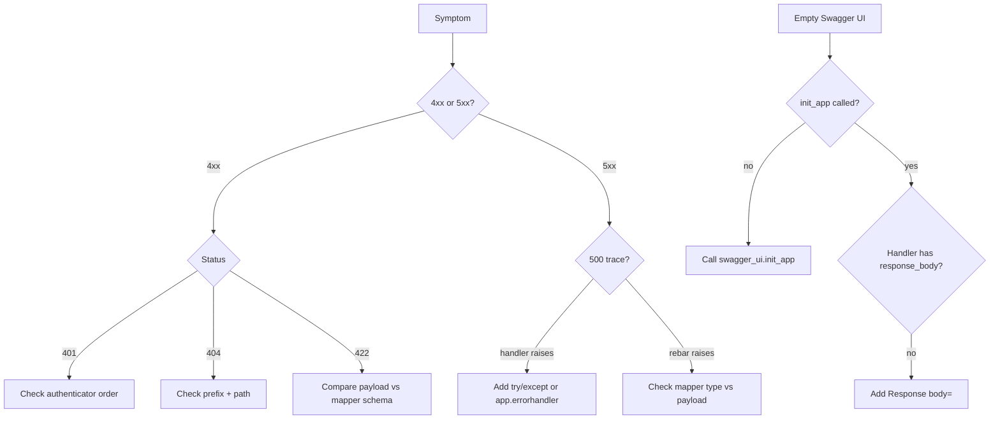
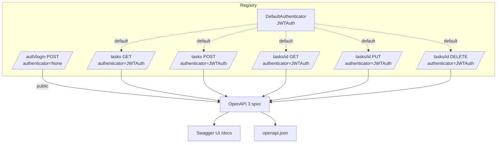

# Flask-Rebar

#flask #api #rest #rebar #openapi #swagger #google #marshalling #http

> [!info] Google's internal Flask REST framework, open-sourced
> Flask-Rebar is the framework Google uses to build many of its internal Flask APIs. It treats **request and response schemas as first-class citizens** via `RequestMappers` (historically marshmallow-based, now also supporting dataclasses), and registers them on a central `HandlerRegistry` that doubles as the source for an OpenAPI 3 specification.
>
> If you've ever wanted Flask + marshmallow with a single declarative "register this URL with these schemas" call site — Flask-Rebar is exactly that, plus Swagger UI for free.

Think of Flask-Rebar as a **bureaucratic office that processes incoming mail**. Each envelope (HTTP request) is routed to a clerk (the `HandlerRegistry`), who consults a stamp book (`RequestMappers` for query/body/headers) to verify everything is in order, stamps it approved, and forwards it to the actual worker (your view function). The clerk also keeps a public catalogue (the OpenAPI spec) of every kind of mail they'll accept, so clients know what to send.

> [!tip] When to choose Flask-Rebar
> Pick it when: (1) you want **declarative request validation** with minimal decorator noise, (2) you want a **single registry object** that owns routing + schema + OpenAPI metadata, (3) you like the **marshmallow ecosystem** but find [[Flask-Smorest]]'s `MethodView` style heavier than needed, (4) you want **merge_responses** and other Google-flavoured ergonomics.

---

## 1. Overview & Metaphor

Flask-Rebar is built around three primitives:

| Primitive | Role | Equivalent elsewhere |
|---|---|---|
| `HandlerRegistry` | Central registry; owns routes, prefixes, auth, OpenAPI generation | `Api` in [[Flask-RESTX]] / [[Flask-Smorest]] |
| `RequestMappers` | Schema definitions for query, body, headers, etc. | `api.model` / marshmallow `Schema` |
| `rebar/swagger_generation` | OpenAPI 3 generator | `apispec` in [[Flask-Smorest]] |

A typical endpoint is registered with **one** function call:

```python
registry.add_handler(
    path="/users/<int:user_id>",
    method="GET",
    handler=get_user,
    query_params=UserQueryParams(),       # RequestMapper
    response_body=Response(
        body=UserSchema(),
        status_code=200,
    ),
    tags=["users"],
    summary="Get a user",
)
```

That single call wires up:
- Flask routing
- Request validation (query/body/headers)
- Response marshalling
- OpenAPI metadata
- Error envelopes for validation failures (422)



### Comparison with peers

| Feature | [[Flask-RESTful]] | [[Flask-RESTX]] | [[Flask-Smorest]] | **Flask-Rebar** |
|---|---|---|---|---|
| Maintenance | Security-only | Active | Active | Active (Google) |
| Schema engine | own `fields` | own `fields` | marshmallow | **marshmallow + dataclasses** |
| OpenAPI version | ❌ | 2.0 (3 exp.) | 3.0.x | **3.0.x** |
| Routing style | `Resource` class | `Resource` class | `MethodView` | **Function handlers + registry** |
| Auth model | manual | `security=` in `@doc` | `@jwt_required` | **`set_default_auth` + per-handler** |
| Swagger UI | ❌ | ✅ built-in | via extra | ✅ built-in |
| Best fit | Legacy | Swagger 2 | Marshmallow + class views | **Function-first, declarative** |

> [!note] Rebar's "function-first" philosophy
> Unlike [[Flask-RESTful]] / [[Flask-RESTX]] / [[Flask-Smorest]], which push you toward class-based views (`Resource`/`MethodView`), Flask-Rebar treats each handler as a **plain function**. State that would be in the class lives in the registry instead. This is closer to FastAPI's mental model.

---

## 2. Installation

```bash
pip install flask-rebar
```

This pulls Flask, marshmallow, and `enum34`-style helpers. For Swagger UI:

```bash
pip install flask-rebar[swagger-ui]
```

Typical stack:

```bash
pip install flask flask-rebar flask-sqlalchemy flask-jwt-extended
```

> [!warning] Flask-Rebar requires marshmallow 3.x
> It is incompatible with marshmallow 2.x and (at time of writing) is still validating marshmallow 4.x support. Pin `marshmallow>=3,<4` in production until you've tested 4.x with your schemas.

---

## 3. Configuration

Flask-Rebar is configured mostly through the `HandlerRegistry` constructor and the `SwaggerV3Generator` config object, rather than `app.config`.

| Setting | Where | Default | Purpose |
|---|---|---|---|
| `prefix` | `HandlerRegistry` | `""` | URL prefix for all registered handlers |
| `default_headers` | `HandlerRegistry` | `None` | Default header mapper applied to all handlers |
| `default_query_parameters` | `HandlerRegistry` | `None` | Default query mapper |
| `default_authenticator` | `HandlerRegistry` | `None` | Default auth (applied unless overridden) |
| `swagger_path` | `SwaggerUI` | `"/swagger"` | URL for the UI |
| `swagger_json_path` | `SwaggerUI` | `"/swagger.json"` | Raw spec URL |
| `title`, `version`, `description` | `SwaggerV3Generator` | (required) | OpenAPI metadata |

```python
from flask import Flask
from flask_rebar import HandlerRegistry, SwaggerV3Generator
from flask_rebar.swagger_generation import SwaggerUI

app = Flask(__name__)

registry = HandlerRegistry(
    prefix="/api/v1",
    default_authenticator=JWTAuthenticator(),  # see §6
)

swagger_v3 = SwaggerV3Generator(
    title="Blog API",
    version="1.0.0",
    description="A blog API using Flask-Rebar",
)

swagger_ui = SwaggerUI(
    swagger_path="/docs",
    swagger_json_path="/openapi.json",
    generator=swagger_v3,
)
swagger_ui.init_app(app=app, registry=registry)
```

> [!tip] Hide Swagger UI in production
> Wrap the `init_app` call in `if app.config["DEBUG"]:` or behind an auth check. The spec JSON itself can stay public.

---

## 4. Basic Usage

### 4.1 A complete hello-world API

```python
from flask import Flask
from marshmallow import Schema, fields
from flask_rebar import HandlerRegistry, Response, SwaggerV3Generator
from flask_rebar.swagger_generation import SwaggerUI
from flask_rebar import rebar

app = Flask(__name__)
registry = rebar.create_handler_registry(
    prefix="/api",
    swagger_path="/docs",
    swagger_json_path="/openapi.json",
    spec=RbSwaggerV3Generator(title="Greeter", version="1.0"),
)

class GreetingIn(Schema):
    name = fields.Str(required=True, metadata={"description": "Who to greet"})
    language = fields.Str(load_default="en")

class GreetingOut(Schema):
    message = fields.Str()
    language = fields.Str()

def create_greeting():
    body = rebar.validated_body
    return {"message": f"Hello, {body['name']}!",
            "language": body["language"]}, 201

registry.add_handler(
    path="/greetings",
    method="POST",
    handler=create_greeting,
    request_body=GreetingIn(),
    response_body=Response(body=GreetingOut(), status_code=201),
    tags=["greetings"],
    summary="Create a greeting",
)

if __name__ == "__main__":
    app.run(debug=True)
```

Run it, open `/docs`, and you'll see a Swagger UI generated entirely from the registry.

> [!note] `rebar.validated_body` vs function arguments
> Flask-Rebar historically made validated payloads available through `rebar.validated_body`, `rebar.validated_args`, and `rebar.validated_headers` global accessors. Newer versions also pass them as keyword arguments. Check the version's README for the exact API.

### 4.2 The `RequestMappers` vocabulary

Flask-Rebar exposes several mapper types:

| Mapper | Maps to | Usage |
|---|---|---|
| `request_body=Schema()` | JSON request body | `body = rebar.validated_body` |
| `query_params=Schema()` | Query string parameters | `args = rebar.validated_args` |
| `headers=Schema()` | Request headers | `headers = rebar.validated_headers` |
| `flask_request=FlaskRequest` | Raw `flask.request` | Direct access |

### Mermaid: request mapping flow



---

## 5. Intermediate Patterns

### 5.1 Multiple response codes

```python
from flask_rebar import Response, ErrorResponse

registry.add_handler(
    path="/users/<int:user_id>",
    method="GET",
    handler=get_user,
    response_body=[
        Response(body=UserSchema(), status_code=200),
        ErrorResponse(code=404, message="User not found"),
        ErrorResponse(code=403, message="Forbidden"),
    ],
    tags=["users"],
    summary="Get a user",
)
```

### 5.2 `merge_responses` — flattening response lists

`merge_responses` is a small helper that lets you compose response lists from multiple sources — useful when you share a base set of error responses across endpoints:

```python
from flask_rebar import merge_responses

common_errors = [
    ErrorResponse(code=401, message="Unauthorized"),
    ErrorResponse(code=403, message="Forbidden"),
]

registry.add_handler(
    path="/posts/<int:post_id>",
    method="GET",
    handler=get_post,
    response_body=merge_responses(
        common_errors,
        [Response(body=PostSchema(), status_code=200),
         ErrorResponse(code=404, message="Post not found")],
    ),
)
```

### 5.3 Path parameters and Flask converters

Path params follow Flask's converter syntax and are passed as kwargs to the handler:

```python
def get_post(post_id: int):
    # post_id is already typed because of <int:post_id>
    ...

registry.add_handler(
    path="/posts/<int:post_id>/comments/<int:comment_id>",
    method="GET",
    handler=get_comment,
    response_body=Response(body=CommentSchema(), status_code=200),
)
```

### 5.4 Authenticators

```python
from flask_rebar.authenticators import HeaderApiKeyAuthenticator

api_key_auth = HeaderApiKeyAuthenticator(header="X-API-Key", name="api_key")
registry.set_default_authenticator(api_key_auth)
```

Now every registered handler requires `X-API-Key: <value>` in the headers, and the spec documents it under `securitySchemes`.

### Mermaid: registry composition



---

## 6. Advanced Usage

### 6.1 Custom authenticator (JWT)

```python
from flask_rebar.authenticators import Authenticator
from flask_jwt_extended import decode_token, verify_jwt_in_request

class JWTAuthenticator(Authenticator):
    """Custom Rebar authenticator that defers to Flask-JWT-Extended."""

    def authenticate(self, request):
        verify_jwt_in_request()
        return decode_token(request.headers.get("Authorization", "").replace("Bearer ", ""))

    @property
    def schema(self):
        # OpenAPI security scheme definition
        return {"type": "http", "scheme": "bearer", "bearerFormat": "JWT"}

registry.set_default_authenticator(JWTAuthenticator())
```

### 6.2 Per-handler authenticator override

```python
registry.add_handler(
    path="/public/health",
    method="GET",
    handler=health_check,
    authenticator=None,   # public
    response_body=Response(body=HealthSchema(), status_code=200),
)

registry.add_handler(
    path="/admin/users",
    method="DELETE",
    handler=delete_user,
    authenticator=AdminOnlyAuthenticator(),
    response_body=Response(body=MessageSchema(), status_code=200),
)
```

### 6.3 `response_marshaller` — custom marshalling

If you need post-marshalling transformation (e.g. add envelope):

```python
from flask_rebar import response_marshaller

@response_marshaller
def envelope(body, status_code):
    return {"data": body, "status": status_code}, status_code

@envelope
def my_handler():
    return {"foo": "bar"}, 200
# response: {"data": {"foo": "bar"}, "status": 200}
```

### 6.4 Dataclass-based schemas

```python
from dataclasses import dataclass
from typing import Optional
from flask_rebar import RequestMappable

@dataclass
class UserQuery(RequestMappable):
    page: int = 1
    limit: int = 20
    search: Optional[str] = None

registry.add_handler(
    path="/users",
    method="GET",
    handler=list_users,
    query_params=UserQuery(),
    response_body=Response(body=UserSchema(many=True), status_code=200),
)
```

> [!note] Dataclasses vs marshmallow Schemas
> Marshmallow is more powerful (custom validators, `Method` fields). Dataclasses are pure-Python and IDE-friendly. Flask-Rebar supports both — use whichever fits your team's muscle memory.

### 6.5 Multiple registries (versioning)

```python
v1_registry = HandlerRegistry(prefix="/api/v1")
v2_registry = HandlerRegistry(prefix="/api/v2")

v1_registry.add_handler(path="/users", method="GET", handler=list_users_v1, ...)
v2_registry.add_handler(path="/users", method="GET", handler=list_users_v2, ...)

rebar.create_handler_registry(app=app, registry=v1_registry)
rebar.create_handler_registry(app=app, registry=v2_registry)
```

### Mermaid: authentication & authorization flow



---

## 7. Common Pitfalls & Troubleshooting

| Symptom | Likely cause | Fix |
|---|---|---|
| `404` even though handler registered | Wrong `prefix` or trailing slash | Match `prefix + path` exactly; Rebar is strict on slashes |
| `422` on POST with valid JSON | Wrong `Content-Type` header | Set `Content-Type: application/json` |
| `KeyError` accessing `rebar.validated_body` | Mapper not declared in `add_handler` | Pass `request_body=Schema()` |
| Swagger UI empty | `swagger_ui.init_app()` not called | Initialise the UI after registering handlers |
| Schema not in spec | Mapper passed as a class, not an instance | Pass `Schema()` (instantiated), not `Schema` |
| `import flask_rebar.swagger_generation` fails | Old version, API moved | Upgrade to ≥ 3.0 |
| `marshmallow.ValidationError` leaks internal details | No custom error handler registered | Register `@app.errorhandler(ValidationError)` |
| Path param arrives as string | Flask converter missing | Use `<int:user_id>` not `<user_id>` |
| Auth not enforced | `set_default_authenticator` called after `add_handler` | Set authenticator first, or pass per-handler `authenticator=` |
| Duplicate paths in spec | Same path registered on two registries | Use distinct `prefix=` per registry |

> [!danger] Order matters when configuring the registry
> `set_default_authenticator` must run **before** `add_handler` for it to apply, unless you pass `authenticator=` per handler. If you see handlers that silently accept anonymous requests, double-check that the default was set early in app initialisation.

### Mermaid: troubleshooting decision tree



---

## 8. Best Practices

> [!tip] Twelve tips for healthy Flask-Rebar APIs
> 1. **One registry per version** — `v1_registry`, `v2_registry`. Makes deprecations painless.
> 2. **Set the default authenticator early** — before any `add_handler` call.
> 3. **Use `merge_responses`** for shared error envelopes — reduces duplication.
> 4. **Define `ErrorResponse` for every documented 4xx** — front-end devs need it.
> 5. **Prefer marshmallow for input validation** — richer validators than dataclasses.
> 6. **Use dataclasses for simple query params** — less ceremony for `page`/`limit`/`sort`.
> 7. **Document every handler** with `summary=` and `description=` — the spec is your API.
> 8. **Hide Swagger UI in production** — guard `init_app` with `app.debug` or auth.
> 9. **Pin marshmallow <4** until you've tested v4 with your schemas.
> 10. **Register a global `ValidationError` handler** to control the 422 envelope.
> 11. **Don't put business logic in handlers** — call services; handlers are HTTP glue.
> 12. **Generate client SDKs** from `/openapi.json` with `openapi-generator-cli`.

---

## 9. Integration with Other Extensions

### With [[Flask-SQLAlchemy]]

```python
from models import User
from schemas import UserSchema

def list_users():
    users = User.query.all()
    return UserSchema(many=True).dump(users), 200

registry.add_handler(
    path="/users", method="GET", handler=list_users,
    response_body=Response(body=UserSchema(many=True), status_code=200),
)
```

### With [[Flask-JWT-Extended]]

Wrap as a custom `Authenticator` (see §6.1). This is the canonical pattern — Rebar doesn't ship a JWT authenticator out of the box.

### With [[Marshmallow]]

Marshmallow is the native schema layer. All marshmallow features work: `validate=`, `pre_load`/`post_dump`, `Nested`, `Method`, `fields.Email`, etc.

### With [[Flask-Limiter]]

```python
from flask_limiter import Limiter
limiter = Limiter(app)

@limiter.limit("10/hour")
def create_user():
    body = rebar.validated_body
    ...

registry.add_handler(
    path="/users", method="POST", handler=create_user,
    request_body=UserCreateSchema(),
    response_body=Response(body=UserSchema(), status_code=201),
)
```

### With [[Flask-CORS]]

```python
from flask_cors import CORS
CORS(app, resources={r"/api/*": {"origins": "*"}})
```

---

## 10. Real-World Example — Tasks API

```python
# app.py — pip install flask flask-rebar flask-sqlalchemy flask-jwt-extended
import os
from flask import Flask
from marshmallow import Schema, fields, validate, ValidationError
from flask_rebar import HandlerRegistry, Response, ErrorResponse, rebar
from flask_rebar.swagger_generation import SwaggerV3Generator
from flask_sqlalchemy import SQLAlchemy
from flask_jwt_extended import (JWTManager, jwt_required, create_access_token,
                                get_jwt_identity, decode_token, verify_jwt_in_request)

app = Flask(__name__)
app.config["SQLALCHEMY_DATABASE_URI"] = "sqlite:///tasks.db"
app.config["SQLALCHEMY_TRACK_MODIFICATIONS"] = False
app.config["JWT_SECRET_KEY"] = os.environ.get("JWT_SECRET", "dev")
db = SQLAlchemy(app)
jwt = JWTManager(app)

# ----- Models ---------------------------------------------------------
class User(db.Model):
    id = db.Column(db.Integer, primary_key=True)
    username = db.Column(db.String(80), unique=True, nullable=False)
    password = db.Column(db.String(255), nullable=False)

class Task(db.Model):
    id = db.Column(db.Integer, primary_key=True)
    title = db.Column(db.String(200), nullable=False)
    done = db.Column(db.Boolean, default=False)
    owner_id = db.Column(db.Integer, db.ForeignKey("user.id"))

with app.app_context():
    db.create_all()

# ----- Schemas --------------------------------------------------------
class LoginSchema(Schema):
    username = fields.Str(required=True)
    password = fields.Str(required=True, load_only=True)

class TokenSchema(Schema):
    access_token = fields.Str()

class TaskInSchema(Schema):
    title = fields.Str(required=True, validate=validate.Length(min=1, max=200))
    done = fields.Boolean(load_default=False)

class TaskOutSchema(Schema):
    id = fields.Int()
    title = fields.Str()
    done = fields.Boolean()
    owner_id = fields.Int()

class TaskQuery(Schema):
    page = fields.Int(load_default=1, validate=validate.Range(min=1))
    done = fields.Boolean(allow_none=True, load_default=None)

class MessageSchema(Schema):
    message = fields.Str()

# ----- Registry + auth -----------------------------------------------
registry = HandlerRegistry(prefix="/api/v1")

class JWTAuth:
    def authenticate(self, request):
        verify_jwt_in_request()
        return decode_token(request.headers.get("Authorization", "").replace("Bearer ", ""))
    schema = {"type": "http", "scheme": "bearer", "bearerFormat": "JWT"}

registry.set_default_authenticator(JWTAuth())

# ----- Handlers -------------------------------------------------------
def login():
    body = rebar.validated_body
    u = User.query.filter_by(username=body["username"]).first()
    if not u or u.password != body["password"]:
        return {"message": "bad credentials"}, 401
    return {"access_token": create_access_token(identity=u.username)}, 200

def list_tasks():
    args = rebar.validated_args
    q = Task.query.filter_by(owner=User.query.filter_by(
        username=get_jwt_identity()).first())
    if args["done"] is not None:
        q = q.filter_by(done=args["done"])
    page = q.paginate(page=args["page"], per_page=20)
    return TaskOutSchema(many=True).dump(page.items), 200

def create_task():
    body = rebar.validated_body
    u = User.query.filter_by(username=get_jwt_identity()).first()
    t = Task(title=body["title"], done=body["done"], owner=u)
    db.session.add(t); db.session.commit()
    return TaskOutSchema().dump(t), 201

def get_task(task_id: int):
    t = Task.query.get_or_404(task_id)
    return TaskOutSchema().dump(t), 200

def update_task(task_id: int):
    body = rebar.validated_body
    t = Task.query.get_or_404(task_id)
    t.title = body["title"]
    t.done = body["done"]
    db.session.commit()
    return TaskOutSchema().dump(t), 200

def delete_task(task_id: int):
    t = Task.query.get_or_404(task_id)
    db.session.delete(t); db.session.commit()
    return "", 204

# ----- Registration ---------------------------------------------------
common_errors = [ErrorResponse(code=401, message="Unauthorized"),
                 ErrorResponse(code=403, message="Forbidden")]

registry.add_handler(
    path="/auth/login", method="POST", handler=login,
    authenticator=None,  # public
    request_body=LoginSchema(),
    response_body=[
        Response(body=TokenSchema(), status_code=200),
        ErrorResponse(code=401, message="bad credentials"),
    ],
    tags=["auth"], summary="Login",
)
registry.add_handler(
    path="/tasks", method="GET", handler=list_tasks,
    query_params=TaskQuery(),
    response_body=[Response(body=TaskOutSchema(many=True), status_code=200)] + common_errors,
    tags=["tasks"], summary="List tasks",
)
registry.add_handler(
    path="/tasks", method="POST", handler=create_task,
    request_body=TaskInSchema(),
    response_body=[Response(body=TaskOutSchema(), status_code=201)] + common_errors,
    tags=["tasks"], summary="Create task",
)
registry.add_handler(
    path="/tasks/<int:task_id>", method="GET", handler=get_task,
    response_body=[Response(body=TaskOutSchema(), status_code=200),
                   ErrorResponse(code=404, message="not found")] + common_errors,
    tags=["tasks"], summary="Get task",
)
registry.add_handler(
    path="/tasks/<int:task_id>", method="PUT", handler=update_task,
    request_body=TaskInSchema(),
    response_body=[Response(body=TaskOutSchema(), status_code=200),
                   ErrorResponse(code=404, message="not found")] + common_errors,
    tags=["tasks"], summary="Update task",
)
registry.add_handler(
    path="/tasks/<int:task_id>", method="DELETE", handler=delete_task,
    response_body=[Response(body=None, status_code=204),
                   ErrorResponse(code=404, message="not found")] + common_errors,
    tags=["tasks"], summary="Delete task",
)

# ----- Swagger UI -----------------------------------------------------
from flask_rebar.swagger_generation import SwaggerUI
swagger_ui = SwaggerUI(swagger_path="/docs", swagger_json_path="/openapi.json",
                       generator=SwaggerV3Generator(title="Tasks API", version="1.0"))
swagger_ui.init_app(app=app, registry=registry)
rebar.create_handler_registry(app=app, registry=registry)

@app.errorhandler(ValidationError)
def handle_validation(e):
    return {"errors": e.messages}, 422

if __name__ == "__main__":
    app.run(debug=True)
```

### Mermaid: registry pattern with auth



---

## 11. References

- **PyPI**: <https://pypi.org/project/flask-rebar/>
- **Docs**: <https://flask-rebar.readthedocs.io/>
- **GitHub**: <https://github.com/plangrid/flask-rebar>
- **Google's original announcement**: search the Flask-Rebar docs for "internal use at Plangrid/PlanGrid (Autodesk)"
- **OpenAPI spec**: <https://spec.openapis.org/oas/v3.1.0>
- Related notes in this vault: [[Flask-RESTful]] · [[Flask-RESTX]] · [[Flask-Smorest]] · [[Flask-Pydantic-Spec]] · [[Marshmallow]] · [[Flask-SQLAlchemy]] · [[Flask-JWT-Extended]] · [[Flask-Limiter]] · [[Flask-CORS]]
