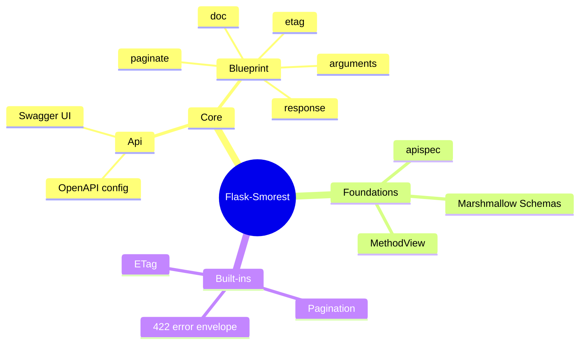
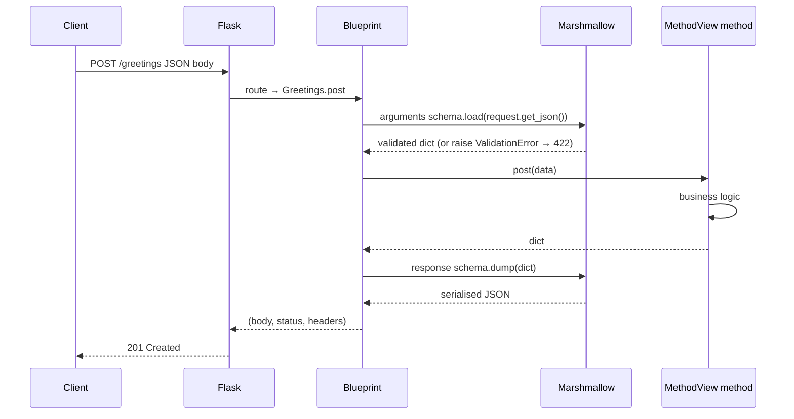
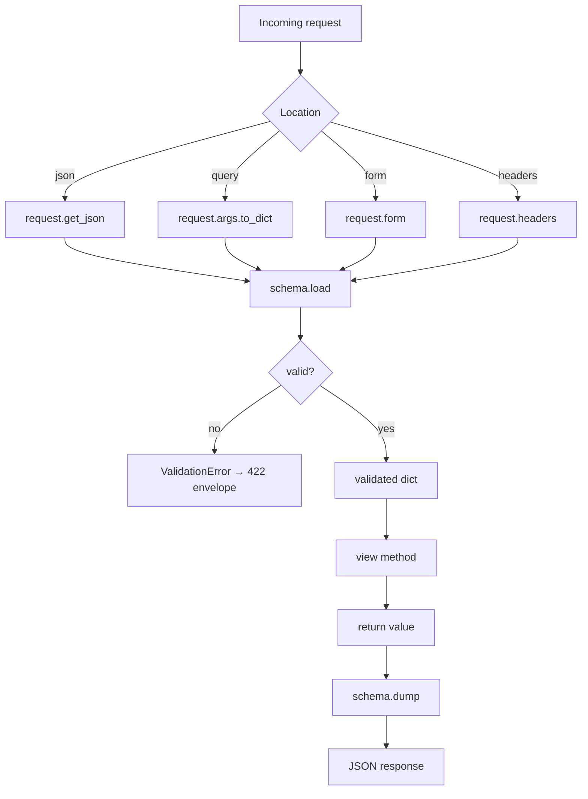
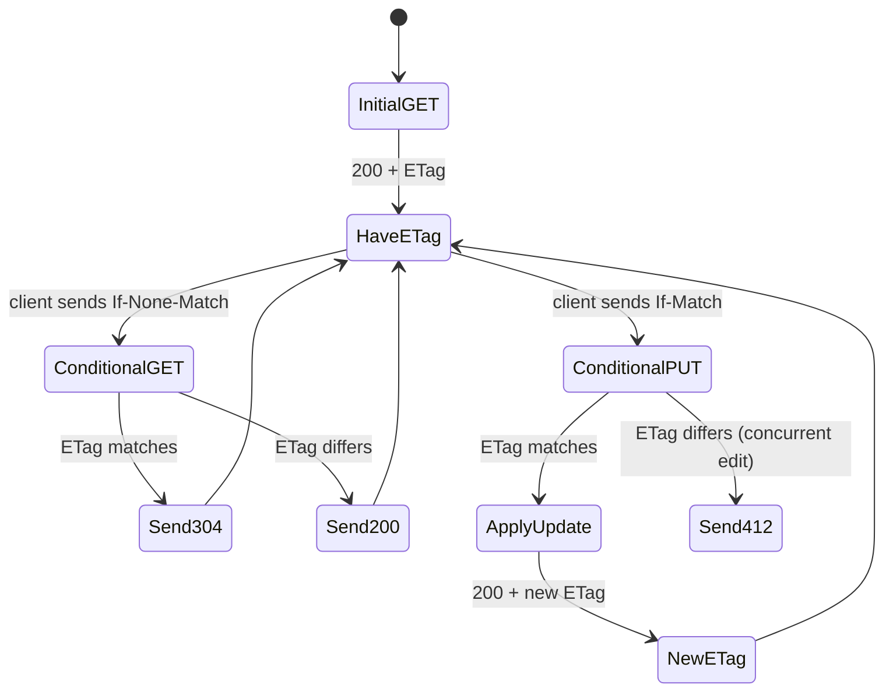
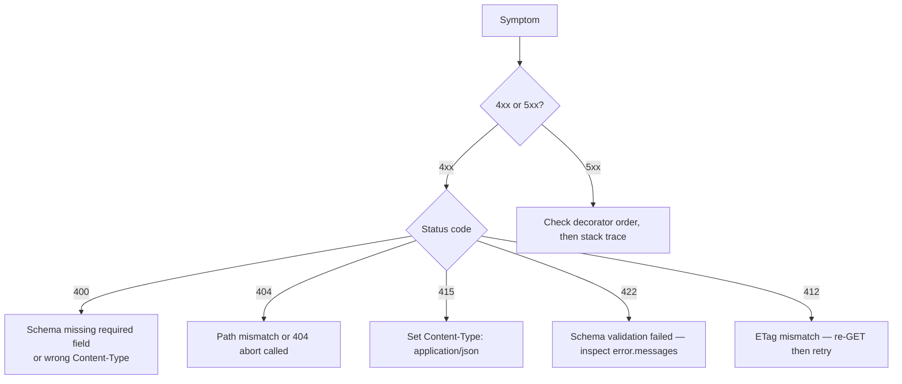
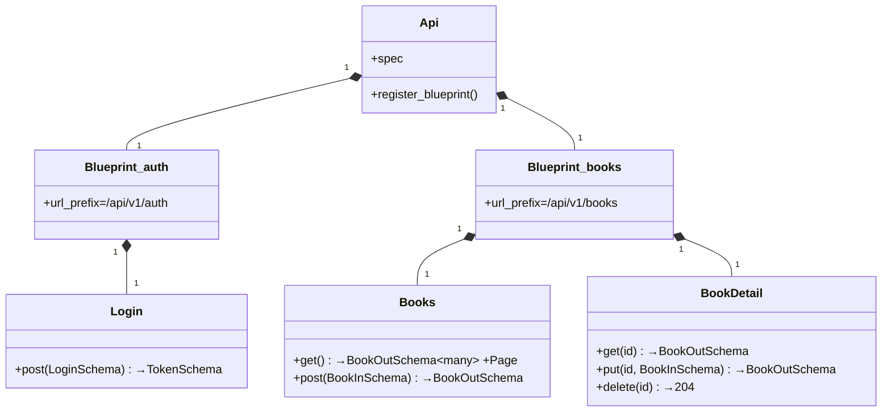

# Flask-Smorest

#flask #api #rest #smorest #marshmallow #openapi #apispec #http #serialization

> [!info] The marshmallow-first REST API framework for Flask
> Flask-Smorest (by the same maintainer as [[Marshmallow]] and apispec) is the modern, opinionated way to build Flask APIs that speak OpenAPI. Where [[Flask-RESTful]] and [[Flask-RESTX]] ship their own `fields` vocabulary, Flask-Smorest uses **marshmallow `Schema`s as the single source of truth** for both validation and OpenAPI generation. One schema = request validation + response serialisation + spec entry.
>
> If your team already lives in marshmallow land (and most Flask teams do), Flask-Smorest is the most ergonomic way to expose those schemas over HTTP with a free Swagger UI.

Think of Flask-Smorest as a **translator between HTTP and marshmallow**. The browser speaks JSON; your service speaks Python objects; marshmallow `Schema`s are the dictionary each side agrees on. Flask-Smorest wires up that translation with three decorators — `@bp.arguments`, `@bp.response`, `@bp.doc` — and emits an apispec OpenAPI document automatically.

> [!tip] When to reach for Flask-Smorest
> Pick it when you want: (1) a single schema vocabulary (marshmallow) end-to-end, (2) real OpenAPI 3 output (not Swagger 2), (3) class-based views (`MethodView`) for clean CRUD mapping, (4) first-class pagination and ETag support without reinventing them each project.

---

## 1. Overview & Metaphor

Flask-Smorest builds on three foundations:

| Foundation | Role |
|---|---|
| [[Marshmallow]] | Schema/serialisation/validation engine |
| `apispec` | OpenAPI 3 spec generator from marshmallow schemas |
| Flask `MethodView` + `Blueprint` | Routing & code organisation |

The library itself contributes:

- `Api` — top-level extension; configures OpenAPI metadata.
- `Blueprint` — subclass of `flask.Blueprint` with `arguments`, `response`, `paginate`, `etag`, `doc` decorators.
- `Page` & `Pagination` — pluggable pagination (SQLAlchemy, raw queries, lists).
- `ETag` — automatic `If-None-Match`/`If-Match` handling for cache and concurrency.
- Error handlers that render marshmallow `ValidationError` as 422.



### Comparison with peers

| Feature | [[Flask-RESTful]] | [[Flask-RESTX]] | **Flask-Smorest** | FastAPI |
|---|---|---|---|---|
| Schema library | own `fields` | own `fields` | **marshmallow** | Pydantic |
| OpenAPI version | none | 2.0 (3.0 experimental) | **3.0.x** | 3.x |
| Pagination built-in | ❌ | ❌ | ✅ | ❌ |
| ETag built-in | ❌ | ❌ | ✅ | ❌ |
| View style | `Resource` class | `Resource` class | **`MethodView`** | function-based |
| Async | ❌ | ❌ | ❌ | ✅ |
| Best fit | Legacy | Swagger 2.0 | Marshmallow shops, OpenAPI 3 | Async microservices |

> [!note] Why `MethodView` and not `Resource`?
> Flask's built-in `MethodView` dispatches `GET`/`POST`/`PUT`/`DELETE` to methods of the same name. Flask-Smorest extends it because that's the upstream Flask idiom; Flask-RESTful/RESTX rolled their own version historically. Functionally they are equivalent.

---

## 2. Installation

```bash
pip install flask-smorest[swagger-ui]
```

The `[swagger-ui]` extra pulls the static Swagger UI bundle. Without it you get the spec JSON but no interactive UI.

For a typical stack:

```bash
pip install flask flask-smorest[swagger-ui] marshmallow marshmallow-sqlalchemy flask-sqlalchemy
```

> [!warning] Pin marshmallow and smorest together
> Flask-Smorest is sensitive to marshmallow major versions. If you upgrade `marshmallow` from 3.x to 4.x without checking smorest's compat matrix, your schemas may break in subtle ways (e.g. `default` semantics, `required` propagation). Always check the [compatibility table](https://flask-smorest.readthedocs.io/en/latest/installation.html) before bumping.

---

## 3. Configuration

Flask-Smorest reads config from `app.config`. Important keys:

| Config key | Default | Purpose |
|---|---|---|
| `API_TITLE` | `"API"` | OpenAPI `info.title` |
| `API_VERSION` | `"1"` | OpenAPI `info.version` |
| `OPENAPI_URL_PREFIX` | `None` | Where to mount the spec endpoint (e.g. `"/docs"` → `/docs/openapi.json`) |
| `OPENAPI_SWAGGER_UI_PATH` | `"/swagger-ui"` | Swagger UI path under prefix |
| `OPENAPI_SWAGGER_UI_VERSION` | `"4.15.5"` | Swagger UI bundle version |
| `OPENAPI_SWAGGER_UI_CONFIG` | `{}` | UI config (deepLinking, displayRequestDuration…) |
| `OPENAPI_JSON_PATH` | `"openapi.json"` | Spec JSON file name |
| `API_SPEC_OPTIONS` | `{}` | Pass-through options (servers, security schemes) |

```python
from flask import Flask
from flask_smorest import Api

app = Flask(__name__)
app.config.update(
    API_TITLE="Blog API",
    API_VERSION="v1",
    OPENAPI_VERSION="3.0.3",
    OPENAPI_URL_PREFIX="/docs",
    OPENAPI_JSON_PATH="openapi.json",
    OPENAPI_SWAGGER_UI_PATH="swagger-ui",
    OPENAPI_SWAGGER_UI_VERSION="4.15.5",
    OPENAPI_SWAGGER_UI_CONFIG={"deepLinking": True, "displayRequestDuration": True},
    API_SPEC_OPTIONS={
        "components": {
            "securitySchemes": {
                "bearerAuth": {"type": "http", "scheme": "bearer"}
            }
        },
        "security": [{"bearerAuth": []}],
        "servers": [{"url": "/api/v1"}],
    },
)
api = Api(app)
```

> [!tip] Mount the spec at a versioned prefix
> `OPENAPI_URL_PREFIX="/docs"` exposes `/docs/openapi.json` and `/docs/swagger-ui/`. Front-end developers can then code against a stable URL even if the API itself moves.

---

## 4. Basic Usage

### 4.1 A complete hello-world API

```python
from flask import Flask
from flask_smorest import Api, Blueprint, abort
from marshmallow import Schema, fields

app = Flask(__name__)
app.config["API_TITLE"] = "Greeter"
app.config["API_VERSION"] = "v1"
app.config["OPENAPI_VERSION"] = "3.0.3"
app.config["OPENAPI_URL_PREFIX"] = "/docs"
app.config["OPENAPI_SWAGGER_UI_PATH"] = "/swagger-ui"
app.config["OPENAPI_SWAGGER_UI_VERSION"] = "4.15.5"
api = Api(app)

blp = Blueprint("greetings", "greetings", url_prefix="/greetings",
                description="Greeting operations")

class GreetingIn(Schema):
    name = fields.Str(required=True, metadata={"description": "Who to greet"})
    language = fields.Str(load_default="en")

class GreetingOut(Schema):
    message = fields.Str(required=True)
    language = fields.Str()

@blp.route("/")
class Greetings(MethodView):
    @blp.arguments(GreetingIn, location="query")
    @blp.response(200, GreetingOut)
    def get(self, args):
        """Get a greeting"""
        return {"message": f"Hello, {args['name']}!", "language": args["language"]}

    @blp.arguments(GreetingIn)
    @blp.response(201, GreetingOut)
    def post(self, data):
        """Create a greeting"""
        return {"message": f"Hello, {data['name']}!", "language": data["language"]}

api.register_blueprint(blp)

if __name__ == "__main__":
    app.run(debug=True)
```

Open `/docs/swagger-ui` and you'll see the interactive UI; the OpenAPI JSON is at `/docs/openapi.json`.

### 4.2 The decorator vocabulary

| Decorator | Role |
|---|---|
| `@blp.arguments(Schema, location="json")` | Validate request payload; injected as method arg |
| `@blp.response(status, Schema)` | Serialise return value; sets status code |
| `@blp.doc(summary="…", description="…", tags=[…])` | OpenAPI metadata |
| `@blp.paginate(Page)` | Wrap return value in a pagination envelope |
| `@blp.etag` | Enable ETag for `GET`; check `If-Match` on writes |
| `@blp.alt_response(404, ErrorSchema)` | Document non-default responses |
| `@blp.route("/path")` | URL routing (same as Flask `MethodView`) |

### Mermaid: request lifecycle



---

## 5. Intermediate Patterns

### 5.1 Split input vs output schemas

A classic pattern: a strict `*In` schema for input validation and a wider `*Out` schema that includes server-generated fields (`id`, `created_at`).

```python
from marshmallow import Schema, fields, validate

class UserIn(Schema):
    username = fields.Str(required=True, validate=validate.Length(min=3, max=80))
    email    = fields.Email(required=True)
    password = fields.Str(required=True, validate=validate.Length(min=8), load_only=True)

class UserOut(Schema):
    id = fields.Int()
    username = fields.Str()
    email = fields.Email()
    created_at = fields.DateTime()

@blp.route("/users")
class Users(MethodView):
    @blp.arguments(UserIn)
    @blp.response(201, UserOut)
    def post(self, data):
        user = create_user(**data)  # returns a User model instance
        return user
```

> [!note] Marshmallow `Schema.dump` accepts ORM objects directly
> If your `Schema` fields match attribute names on a SQLAlchemy model, just `return user_model_instance`. Marshmallow reads attributes via `getattr`.

### 5.2 Query string, form, and headers via `location=`

```python
@blp.route("/search")
class Search(MethodView):
    @blp.arguments(SearchQuerySchema, location="query")
    @blp.response(200, ResultsSchema)
    def get(self, args):
        # args is the validated query dict
        return search(args["q"], page=args["page"], limit=args["limit"])
```

Valid `location` values: `"query"`, `"json"` (default), `"form"`, `"files"`, `"headers"`, `"cookies"`, `"view_args"`, `"querystring"` (alias).

### 5.3 Multiple `@blp.arguments` on the same method

You can stack them — Flask-Smorest injects validated payloads as additional positional arguments in the order the decorators appear (bottom-up).

```python
@blp.route("/users/<int:user_id>/posts")
class UserPosts(MethodView):
    @blp.arguments(PostQuerySchema, location="query")  # injected second
    @blp.arguments(PostCreateSchema)                    # injected first (body)
    @blp.response(201, PostOut)
    def post(self, body, args, user_id):
        # body: validated JSON; args: validated query; user_id: from URL
        return create_post(owner_id=user_id, **body)
```

> [!warning] Argument order matters
> Decorators apply bottom-up, so the **innermost** `arguments` becomes the **first** positional parameter. Get this wrong and your function receives the body where it expects the query string.

### 5.4 Pagination

```python
from flask_smorest import Page
from flask_sqlalchemy import SQLAlchemy
db = SQLAlchemy()

@blp.route("/posts")
class Posts(MethodView):
    @blp.response(200, PostOut(many=True))
    @blp.page  # uses flask_sqlalchemyPagination under the hood
    def get(self):
        return Post.query  # smorest calls .paginate() automatically
```

The `Page` class accepts any query-like object that supports `paginate(page, per_page, error_out=False)` (SQLAlchemy, Flask-SQLAlchemy, etc.). The response envelope is:

```json
{
  "items": [...],
  "first": "http://.../posts?page=1",
  "last":  "http://.../posts?page=5",
  "next":  "http://.../posts?page=2",
  "prev":  null,
  "page": 1, "pages": 5, "per_page": 20, "total": 100
}
```

### Mermaid: schema validation flow



---

## 6. Advanced Usage

### 6.1 ETag for caching and concurrency

```python
from flask_smorest import etag

@blp.route("/posts/<int:id>")
class Post(Resource):
    @etag
    @blp.response(200, PostOut)
    def get(self, id):
        return Post.query.get_or_404(id)

    @etag
    @blp.arguments(PostUpdateSchema)
    @blp.response(200, PostOut)
    def put(self, data, id):
        post = Post.query.get_or_404(id)
        # If-Match checked automatically against current ETag
        for k, v in data.items():
            setattr(post, k, v)
        db.session.commit()
        return post
```

The first `GET` returns `ETag: W/"abc123"`. Subsequent requests with `If-None-Match: W/"abc123"` get `304 Not Modified`. Writes with `If-Match: W/"abc123"` will fail with `412 Precondition Failed` if the resource changed.

### 6.2 Custom error envelope

Flask-Smorest renders `ValidationError` as 422 with a default body:

```json
{"code": 422, "status": "Unprocessable Entity",
 "errors": {"username": ["Must be at least 3 characters."]}}
```

Override by registering a custom error handler:

```python
from flask_smorest import Blueprint
from werkzeug.exceptions import HTTPException
from marshmallow import ValidationError

@blp.error_processor
def handle_errors(error):
    return {
        "error": error.messages if hasattr(error, "messages") else str(error),
        "status": getattr(error, "code", 500),
    }, getattr(error, "code", 500)
```

### 6.3 Custom `Page` for non-SQLAlchemy data

```python
from flask_smorest import Page

class ListPage(Page):
    @property
    def item_count(self):
        return len(self.collection)

    def slice(self, item_count, first_item, last_item):
        return self.collection[first_item:last_item + 1]

@blp.route("/notes")
class Notes(MethodView):
    @blp.response(200, NoteOut(many=True))
    @blp.page(ListPage)
    def get(self):
        return NOTES_LIST  # any sliceable Python list
```

### 6.4 Documenting errors with `alt_response`

```python
from werkzeug.exceptions import NotFound

@blp.route("/posts/<int:id>")
class PostDetail(MethodView):
    @blp.doc(parameters=[{"in": "path", "name": "id", "schema": {"type": "integer"}}])
    @blp.response(200, PostOut)
    @blp.alt_response(404, schema=ErrorSchema, description="Post not found")
    def get(self, id):
        post = Post.query.get_or_404(id)
        return post
```

### 6.5 File uploads

```python
from marshmallow import Schema, fields
from werkzeug.datastructures import FileStorage

class FileUploadSchema(Schema):
    file = fields.Raw(metadata={"type": "string", "format": "binary"}, required=True)

@blp.route("/upload")
class Upload(MethodView):
    @blp.arguments(FileUploadSchema, location="files")
    @blp.response(201)
    def post(self, files):
        f: FileStorage = files["file"]
        f.save(f"/tmp/{f.filename}")
        return None, 201
```

### Mermaid: ETag state machine



---

## 7. Common Pitfalls & Troubleshooting

| Symptom | Likely cause | Fix |
|---|---|---|
| 415 Unsupported Media Type on POST | Client didn't send `Content-Type: application/json` | Set header; or override via `content_type` arg |
| 422 with `{"_schema": ["Invalid input type"]}` | Sent array but schema expects object (or vice versa) | Use `Schema(many=True)` for arrays |
| Spec shows nothing for `arguments(query)` | Forgot `location="query"` | Default is `"json"` — pass `location` explicitly |
| 500 on `@blp.response(200, Schema(many=True))` | Returned a dict instead of a list | `return [item1, item2]`, not `return {"items": [...]}` |
| ETag 412 on every PUT | ETag is computed from a string that includes a timestamp | Use a stable identifier (e.g. `updated_at` rounded to seconds, or a version counter) |
| `TypeError: Object of type Decimal is not JSON serializable` | Schema field has wrong type, e.g. `fields.Str` on a `Decimal` | Use `fields.Decimal(as_string=True)` |
| Pagination `Link` headers wrong host | Behind reverse proxy without `ProxyFix` | `from werkzeug.middleware.proxy_fix import ProxyFix; app.wsgi_app = ProxyFix(app.wsgi_app)` |
| Swagger UI shows "Failed to load spec" | `OPENAPI_URL_PREFIX` not set, or wrong UI version pinned | Set prefix; check `OPENAPI_SWAGGER_UI_VERSION` matches a real release |
| `@blp.arguments` payload is `None` | Decorator order: `arguments` must be **above** `response` | Re-order so `arguments` is innermost (closest to function) |
| Schema not appearing in spec | Never referenced by a decorator | Schemas only appear in `components/schemas` if used by at least one operation |

> [!danger] Decorator order is the #1 silent failure mode
> Flask-Smorest decorates bottom-up but executes outside-in. The canonical order is:
> ```
> @blp.route(...)              # top
> @blp.doc(...)
> @blp.arguments(QuerySchema, location="query")
> @blp.arguments(BodySchema)
> @blp.alt_response(404, ...)
> @blp.etag
> @blp.response(200, OutSchema)  # closest to method
> def method(self, body, args): ...
> ```
> Misordering typically results in `TypeError: method() got unexpected keyword argument 'query_args'` or a `422` that swallows the real cause.

### Mermaid: troubleshooting decision tree



---

## 8. Best Practices

> [!tip] Twelve tips for healthy Flask-Smorest APIs
> 1. **One Blueprint per domain** — `users_blp`, `posts_blp`. Mirrors your service boundary.
> 2. **Split `*In` and `*Out` schemas** — input must be strict; output can be wider.
> 3. **Use `load_only=True`** on secrets (passwords, tokens) so they never leak via `dump`.
> 4. **Always set `OPENAPI_VERSION="3.0.3"`** — Swagger UI renders better than the default.
> 5. **Document errors with `alt_response`** — front-end devs need to know what 4xx to expect.
> 6. **Use `@blp.paginate(Page)`** for every list endpoint — it's free and consistent.
> 7. **Enable `@etag`** on read-heavy endpoints — saves bandwidth and DB round-trips.
> 8. **Pin smorest + marshmallow together**; test upgrades in CI.
> 9. **Validate at the boundary, not in the service** — let smorest be the only validator.
> 10. **Don't put business logic in MethodView methods** — call services; views are HTTP glue.
> 11. **Customise the error envelope once** via `@blp.error_processor`, never per endpoint.
> 12. **Generate client SDKs from `/docs/openapi.json`** with `openapi-generator-cli`.

---

## 9. Integration with Other Extensions

### With [[Flask-SQLAlchemy]]

Pair with `marshmallow-sqlalchemy` to auto-generate schemas from models:

```python
from marshmallow_sqlalchemy import SQLAlchemyAutoSchema
from models import Post

class PostSchema(SQLAlchemyAutoSchema):
    class Meta:
        model = Post
        load_instance = True  # return model instances on load
        include_relationships = True
```

### With [[Flask-JWT-Extended]]

```python
from flask_jwt_extended import jwt_required

@blp.route("/me")
class Me(MethodView):
    @blp.doc(security=[{"bearerAuth": []}])
    @blp.response(200, UserOut)
    @jwt_required()
    def get(self):
        from flask_jwt_extended import get_jwt_identity
        return User.query.filter_by(username=get_jwt_identity()).first()
```

### With [[Marshmallow]]

Smorest is marshmallow-native, so all marshmallow features work: `validate=`, `pre_load`/`post_dump`, `Method` fields, `Nested`, `Pluck`, custom fields. See [[Marshmallow]] for the full vocabulary.

### With [[Flask-Limiter]]

```python
from flask_limiter import Limiter
from flask_limiter.util import get_remote_address
limiter = Limiter(get_remote_address, app=app)

@blp.route("/login")
class Login(MethodView):
    decorators = [limiter.limit("5/minute")]
    @blp.arguments(LoginSchema)
    @blp.response(200, TokenSchema)
    def post(self, data):
        ...
```

---

## 10. Real-World Example — Library API

A complete, runnable API with pagination, ETag, JWT, and OpenAPI:

```python
# app.py — pip install flask flask-smorest[swagger-ui] flask-sqlalchemy \
#                     flask-jwt-extended marshmallow-sqlalchemy
import os
from flask import Flask
from flask_smorest import Api, Blueprint, abort
from flask_sqlalchemy import SQLAlchemy
from flask_jwt_extended import JWTManager, jwt_required, create_access_token, get_jwt_identity
from marshmallow import Schema, fields, validate
from werkzeug.exceptions import NotFound

app = Flask(__name__)
app.config.update(
    API_TITLE="Library API", API_VERSION="v1",
    OPENAPI_VERSION="3.0.3",
    OPENAPI_URL_PREFIX="/docs", OPENAPI_SWAGGER_UI_PATH="/swagger-ui",
    OPENAPI_SWAGGER_UI_VERSION="4.15.5",
    SQLALCHEMY_DATABASE_URI="sqlite:///library.db",
    SQLALCHEMY_TRACK_MODIFICATIONS=False,
    JWT_SECRET_KEY=os.environ.get("JWT_SECRET", "dev"),
    API_SPEC_OPTIONS={
        "components": {"securitySchemes": {
            "bearerAuth": {"type": "http", "scheme": "bearer"}}},
        "security": [{"bearerAuth": []}],
    },
)
db = SQLAlchemy(app)
jwt = JWTManager(app)
api = Api(app)

# ---- Models ----------------------------------------------------------------
class Member(db.Model):
    id = db.Column(db.Integer, primary_key=True)
    username = db.Column(db.String(80), unique=True, nullable=False)
    password = db.Column(db.String(255), nullable=False)

class Book(db.Model):
    id = db.Column(db.Integer, primary_key=True)
    title = db.Column(db.String(200), nullable=False)
    author = db.Column(db.String(120))
    year = db.Column(db.Integer)
    copies = db.Column(db.Integer, default=1)

with app.app_context():
    db.create_all()

# ---- Schemas ---------------------------------------------------------------
class LoginSchema(Schema):
    username = fields.Str(required=True)
    password = fields.Str(required=True, load_only=True)

class TokenSchema(Schema):
    access_token = fields.Str()

class BookInSchema(Schema):
    title = fields.Str(required=True, validate=validate.Length(min=1, max=200))
    author = fields.Str()
    year = fields.Int(validate=validate.Range(min=0, max=2100))
    copies = fields.Int(load_default=1, validate=validate.Range(min=0))

class BookOutSchema(Schema):
    id = fields.Int()
    title = fields.Str()
    author = fields.Str(allow_none=True)
    year = fields.Int(allow_none=True)
    copies = fields.Int()

class ErrorSchema(Schema):
    message = fields.Str()

# ---- Blueprints ------------------------------------------------------------
auth_blp = Blueprint("auth", "auth", url_prefix="/api/v1/auth")
books_blp = Blueprint("books", "books", url_prefix="/api/v1/books",
                      description="Book operations")

@auth_blp.route("/login")
class Login(MethodView):
    @auth_blp.doc(security=[])  # public endpoint
    @auth_blp.arguments(LoginSchema)
    @auth_blp.response(200, TokenSchema)
    def post(self, data):
        m = Member.query.filter_by(username=data["username"]).first()
        if not m or m.password != data["password"]:
            abort(401, message="bad credentials")
        return {"access_token": create_access_token(identity=m.username)}

@books_blp.route("/")
class Books(MethodView):
    @books_blp.doc(security=[{"bearerAuth": []}])
    @books_blp.response(200, BookOutSchema(many=True))
    @books_blp.page
    @jwt_required()
    def get(self):
        return Book.query

    @books_blp.doc(security=[{"bearerAuth": []}])
    @books_blp.arguments(BookInSchema)
    @books_blp.response(201, BookOutSchema)
    @jwt_required()
    def post(self, data):
        b = Book(**data)
        db.session.add(b); db.session.commit()
        return b

@books_blp.route("/<int:book_id>")
@books_blp.doc(security=[{"bearerAuth": []}], parameters=[
    {"in": "path", "name": "book_id", "schema": {"type": "integer"}}])
class BookDetail(MethodView):
    @books_blp.response(200, BookOutSchema)
    @books_blp.alt_response(404, ErrorSchema, description="Not found")
    @jwt_required()
    def get(self, book_id):
        return Book.query.get_or_404(book_id)

    @books_blp.arguments(BookInSchema)
    @books_blp.response(200, BookOutSchema)
    @books_blp.alt_response(404, ErrorSchema)
    @jwt_required()
    def put(self, data, book_id):
        b = Book.query.get_or_404(book_id)
        for k, v in data.items():
            setattr(b, k, v)
        db.session.commit()
        return b

    @books_blp.response(204)
    @books_blp.alt_response(404, ErrorSchema)
    @jwt_required()
    def delete(self, book_id):
        b = Book.query.get_or_404(book_id)
        db.session.delete(b); db.session.commit()
        return None

api.register_blueprint(auth_blp)
api.register_blueprint(books_blp)

if __name__ == "__main__":
    app.run(debug=True)
```

### Mermaid: library API blueprint structure



---

## 11. References

- **PyPI**: <https://pypi.org/project/flask-smorest/>
- **Docs**: <https://flask-smorest.readthedocs.io/>
- **GitHub**: <https://github.com/marshmallow-code/flask-smorest>
- **Example apps**: <https://github.com/marshmallow-code/flask-smorest/tree/dev/examples>
- **apispec**: <https://apispec.readthedocs.io/>
- **OpenAPI 3 spec**: <https://spec.openapis.org/oas/v3.1.0>
- Related notes in this vault: [[Marshmallow]] · [[Flask-RESTful]] · [[Flask-RESTX]] · [[Flask-Pydantic-Spec]] · [[Flask-SQLAlchemy]] · [[Flask-JWT-Extended]] · [[Flask-Limiter]]
